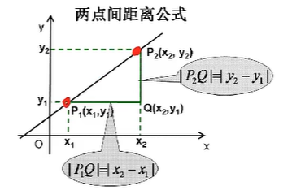

## KNN概述

**KNN(K Nearest Neighbor)**算法，也叫 **K 近邻算法**。这里K近邻就是 k个最近的邻居的意思。**KNN 算法的核心思想是，对一个位置样本的标签，可以使用K个 “特征和它最接近的已知样本的标签来推断“**。


KNN算法既可以用于分类问题，也可以用于回归问题：

- 对于分类问题，是使用与未知样本特征最接近的K个已知样本的标签中占比最多的标签值，作为未知样本的标签值
- 对于回归问题，是使用与未知样本特征最接近的K个已知样本的标签的加权平均数，作为未知样本的标签值


**样本间特征的相似度可以用特征的距离来表示，KNN一般使用欧式距离。**欧式距离可以用勾股定理推导而来，其公式如下：



- 二维平面上的点`a(x1,y1)`和点`b(x2,y2)`之间的欧式距离公式：
  $$
  d_{ab}=\sqrt{(x_1-x_2)^2+(y_1-y_2)^2}
  $$

- 三维空间上的点`a(x1,y1,z1)`和点`b(x2,y2,z2)`之间的欧式距离公式：
  $$
  d_{ab}=\sqrt{(x_1-x_2)^2+(y_1-y_2)^2+(z_1-z_2)^2}
  $$

- n维空间平面上的点点`a(x1,x2,...,xn)`和点`b(y1,y2,...,y2)`之间的欧式距离公式：
  $$
  d_{ab}=\sqrt{(x_1-y_1)^2+(x_2-y_2)^2+...+(x_n-y_n)^2}=\sqrt{\sum{_{i=1}^n}(x_i-y_i)^2}
  $$


**KNN的工作流程（以分类问题为例）：**

1. 确定超参数k的值（超参数，机器学习模型中需要手动指定的参数），通常应该是奇数，偶数会出现打平的状况
2. 计算已知样本中的点与当前点之间的距离
3. 按距离递增对已知样本进行排序
4. 选取与当前点距离最近的k个样本点
5. 统计前k个样本点所在类别出现的频率
6. 返回前k个样本点中类别出现频率最高的类别作为当前点的预测类别


## 预测验证

手动实现一个KNN的算法逻辑，KNN相比于之前的线性回归，其逻辑更为简单易理解。

```python
import math

from collections import Counter

from sklearn.preprocessing import StandardScaler
from sklearn.model_selection import train_test_split
from sklearn.datasets import load_iris


def knn_score(x_train, x_test, y_train, y_test, k):

    y_pred = []

    # 计算测试样本到已知样本的距离
    for test in x_test:
        dists = []
        for idx, train in enumerate(x_train):
            dist = math.sqrt(sum([(test[i] - train[i])**2 for i in range(len(test))]))
            # 记录未知样本到每个已知样本的距离和对应的分类
            dists.append((dist, y_train[idx]))

        # 根据k获取距离最近的几个样本
        dists = sorted(dists, key=lambda x: x[0])[:k]
        # 统计前k个样本出现次数最多的标签
        counter = Counter([item[1] for item in dists])
        # 讲述限次数最多的数据放到预测列表
        y_pred.append(counter.most_common(1)[0][0])

    # 计算准确率
    matched = 0
    diff = 0
    for pred, real in zip(y_pred, y_test):
        if pred == real:
            matched += 1
        else:
            diff += 1
    rate = matched / (matched + diff)
    return rate
```

现在我们继续使用sklearn自带的鸢尾花数据集进行预测：

```python
if __name__ == '__main__':
    # return_X_y 表示拆分然后返回样本和标签
    x, y = load_iris(return_X_y=True, as_frame=False)

    # 拆分训练集和测试集
    x_train, x_test, y_train, y_test = train_test_split(x, y, test_size=0.2, random_state=5)

    # 归一化 这里使用使用 均值标准差归一化
    scaler = StandardScaler()
    # 下面两步同 fit_transform
    scaler.fit(x_train)  # 先基于训练集计算均值和标准差

    # 使用相同标准归一化训练集和测试集
    x_train = scaler.transform(x_train)
    x_test = scaler.transform(x_test)

    # 使用自写算法进行测试打分
    score = knn_score(x_train, x_test, y_train, y_test, k=7)
    print(score)  # 0.9666666666666667
```

在超参数K=7时，我们的测试准确率为 0.967，下面继续使用sklearn库进行预测：

```python
# return_X_y 表示拆分然后返回样本和标签
x, y = load_iris(return_X_y=True, as_frame=False)

# 拆分训练集和测试集
x_train, x_test, y_train, y_test = train_test_split(x, y, test_size=0.2, random_state=5)

# 归一化 这里使用使用 均值标准差归一化
scaler = StandardScaler()
# 下面两步同 fit_transform
scaler.fit(x_train)  # 先基于训练集计算均值和标准差

# 使用相同标准归一化训练集和测试集
x_train = scaler.transform(x_train)
x_test = scaler.transform(x_test)

# 使用sklearn模型
model = KNeighborsClassifier(n_neighbors=7)
model.fit(x_train, y_train)

score = model.score(x_test, y_test)
print(score)  # 0.9666666666666667
```

可以看到，其结果与自己实现的算法准确率一致，说明我们实现的逻辑没问题。


## 选择K值

在前面的预测验证中其实有两个问题，一个是K值我们是凭感觉给的，可能并不是最优值；而是我们的训练集和测试集也是固定的，就是说得到的准确率并不严谨，同一批数据中变更一下训练集和测试集可能准确率就会出现较大波动。

因此，我们需要采取一些策略来确保我们的K值和准确率尽量的“靠谱”。

### K折交叉验证

所谓的K折，就是把数据集分成K份的意思。然后依次把其中一份作为测试集，其余部分作为训练集，使得数据集中的每个数据都作为训练集，也使得每个数据都作为测试集，然后将K次训练并预测的准确率求平均值作为最终的准确率。


下面基于代码来实现一下这个过程：

```python
import numpy as np

from sklearn.preprocessing import StandardScaler
from sklearn.model_selection import KFold
from sklearn.datasets import load_iris
from sklearn.neighbors import KNeighborsClassifier


x, y = load_iris(return_X_y=True, as_frame=False)

# 分成五份数据
kf = KFold(n_splits=5)

# 遍历每一份数据获取评分
scores = []

for train, test in kf.split(x, y):
    x_train, x_test = x[train], x[test]
    y_train, y_test = y[train], y[test]

    # 归一化
    scaler = StandardScaler()
    scaler.fit(x_train)
    x_train = scaler.transform(x_train)
    x_test = scaler.transform(x_test)

    # 使用sklearn模型
    model = KNeighborsClassifier(n_neighbors=7)
    model.fit(x_train, y_train)

    score = model.score(x_test, y_test)
    scores.append(score)

# 最终准确率
print(np.mean(scores))  # 0.8800000000000001
```

可以看到，在K=7时通过5折交叉验证，最终准确率只有0.88。同时，如果要验证其他K值，我们还需要在算一次，每一个K值我们都需要重复上面的过程，然后最终得到准确率最高的K。


### 网格搜索

通常情况下，有很多参数是需要手动指定的（如K近邻算法中的K值），这种叫超参数。但手动过程繁杂，所以需要对模型预设几种超参数组合。每组超参数都采用交叉验证来进行批评估，最后选择最优参数组合建立模型。

基于这种诉求，sklearn也提供了相应的能力。

```python
import numpy as np

from sklearn.preprocessing import StandardScaler
from sklearn.model_selection import KFold, train_test_split, GridSearchCV
from sklearn.datasets import load_iris
from sklearn.neighbors import KNeighborsClassifier


x, y = load_iris(return_X_y=True, as_frame=False)

# 拆分训练集和测试集
x_train, x_test, y_train, y_test = train_test_split(x, y, test_size=0.2, random_state=2)

# 归一化
scaler = StandardScaler()
scaler.fit(x_train)
x_train = scaler.transform(x_train)
x_test = scaler.transform(x_test)

# 预准备超参数
params = {"n_neighbors": [1, 3, 5, 7, 9, 11]}

# 这里的cv参数就表示把训练数据拆成五份交叉验证，注意此处只是训练数据
gsc = GridSearchCV(KNeighborsClassifier(), param_grid=params, cv=5)
gsc.fit(x_train, y_train)

# 使用测试集验证准确率
print(gsc.score(x_test, y_test))  # 1.0

# 网格搜索集交叉验证中的一些参数
print("交叉验证中最好的结果：", gsc.best_score_)  # 0.9666666666666668
print("交叉验证中最好的模型：", gsc.best_estimator_)  # KNeighborsClassifier(n_neighbors=9)
print("交叉验证中最好的参数：", gsc.best_params_)  # {'n_neighbors': 9}
print("交叉验证中每次验证的结果：", gsc.cv_results_)
```


## PCA数据降维

前面使用到的鸢尾花数据集，每一个样本有四个自变量，其实也可以表示成四维空间中的一个点（目前人类没法想象），也就是具备四个维度的样本数据，在逻辑回归中使用到的`heart.csv`数据集则有十多个维度。但如果一个数据样本的维度特别多（成百上千），那么可能就对我们的算力开始有挑战了，因此，针对多维的数据，我们有时候是需要将高维数据降到低维，以减少计算量。

数据降维的算法有很多，下面介绍一下PCA算法，需要注意的是数据降维，必然会丢失一些数据特征。

PCA（主成分分析）是一种广泛使用的数据降维技术，它通过线性变换将原始数据转换到新的坐标系统中，使得新坐标系统的方向是原始数据方差最大的方向。这种方法可以帮助我们减少数据的维度，同时尽可能保留数据中的主要信息。

**PCA的基本步骤：**

1. **标准化**：首先，对数据进行标准化处理，即将所有特征缩放到同一尺度（通常是均值变为0，方差变为1）。
2. **计算协方差矩阵**：计算原始数据的协方差矩阵。协方差矩阵显示了各个特征之间的相关性。
3. **计算特征值和特征向量**：对协方差矩阵进行特征分解，得到特征值和特征向量。特征值表示了每个特征向量对应的方差大小，而特征向量则表示了主成分的方向。
4. **选择主成分**：根据特征值的大小选择最重要的主成分。通常选择前N个最大的特征值对应的特征向量作为主成分，其中N是降维后的维度。
5. **数据变换**：使用选定的主成分对原始数据进行变换，得到降维后的数据。


在sklearn中也已经实现了PCA的算法，我们直接使用即可：

```python
import numpy as np

from sklearn.decomposition import PCA

# 示例数据
x = np.array([[2.5, 2.4, 3.3], [0.5, 0.7, 0.2], [2.2, 2.9, 1.8], [1.9, 2.2, 2.0]])


# 应用PCA进行降维。初始化时我们指定要降到的维度
pca = PCA(n_components=1)
x_pca = pca.fit_transform(x)

print(x_pca)  # [[-1.58272953] [ 2.46099999] [-0.61722153] [-0.26104893]]
print("原始数据的形状:", x.shape)  # (4, 3)
print("降维后数据的形状:", x_pca.shape)  # (4, 1)

# 降维时我们也可以指定降维后的精度，那么得到数据的维度就不是我们控制的了
pca = PCA(n_components=0.95)
x_pca2 = pca.fit_transform(x)

print(x_pca2)  # [[-1.58272953 -0.56452968] [ 2.46099999 -0.17949957] [-0.61722153  0.72302393] [-0.26104893  0.02100532]]
print("原始数据的形状:", x.shape)  # (4, 3)
print("降维后数据的形状:", x_pca2.shape)  # (4, 2)
```


在前面的我们使用sklearn对鸢尾花数据集做了训练和预测，测试集得到的准确率为：0.9666666666666667 。下面我们在把数据进行降维后再训练预测看下结果偏差：

```python
from sklearn.datasets import load_iris
from sklearn.decomposition import PCA
from sklearn.model_selection import train_test_split
from sklearn.neighbors import KNeighborsClassifier
from sklearn.preprocessing import StandardScaler

x, y = load_iris(return_X_y=True, as_frame=False)

# 数据降维  y本身就1维，就不做处理了
# 把四维降到二维
pca = PCA(n_components=2)
x = pca.fit_transform(x)
print(x.shape)  # (150, 2)

x_train, x_test, y_train, y_test = train_test_split(x, y, test_size=0.2, random_state=5)

scaler = StandardScaler()
scaler.fit(x_train)

x_train = scaler.transform(x_train)
x_test = scaler.transform(x_test)

# 使用sklearn模型
model = KNeighborsClassifier(n_neighbors=7)
model.fit(x_train, y_train)

score = model.score(x_test, y_test)
print(score)  # 0.9666666666666667
```

可以看到准确率是没有变化的，我们这里鸢尾花数据一共150条，数据量很小，整体影响不那么明显。
