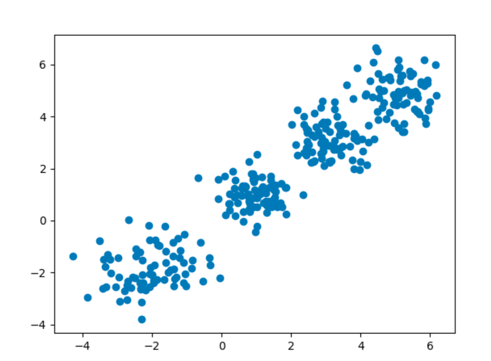
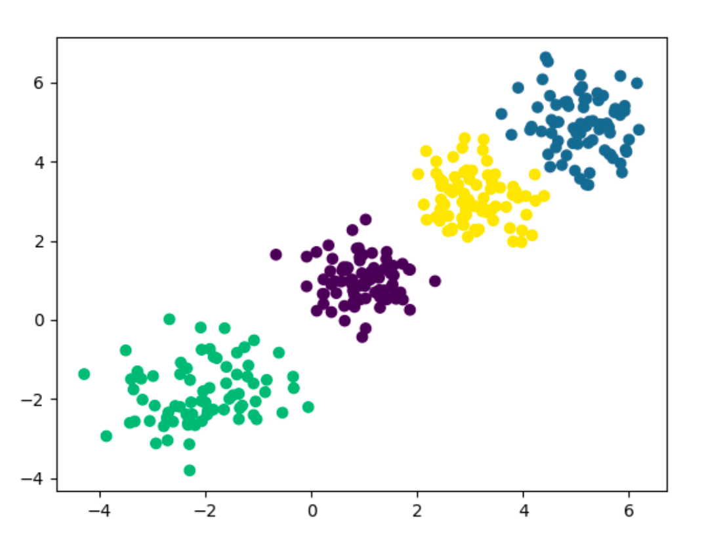
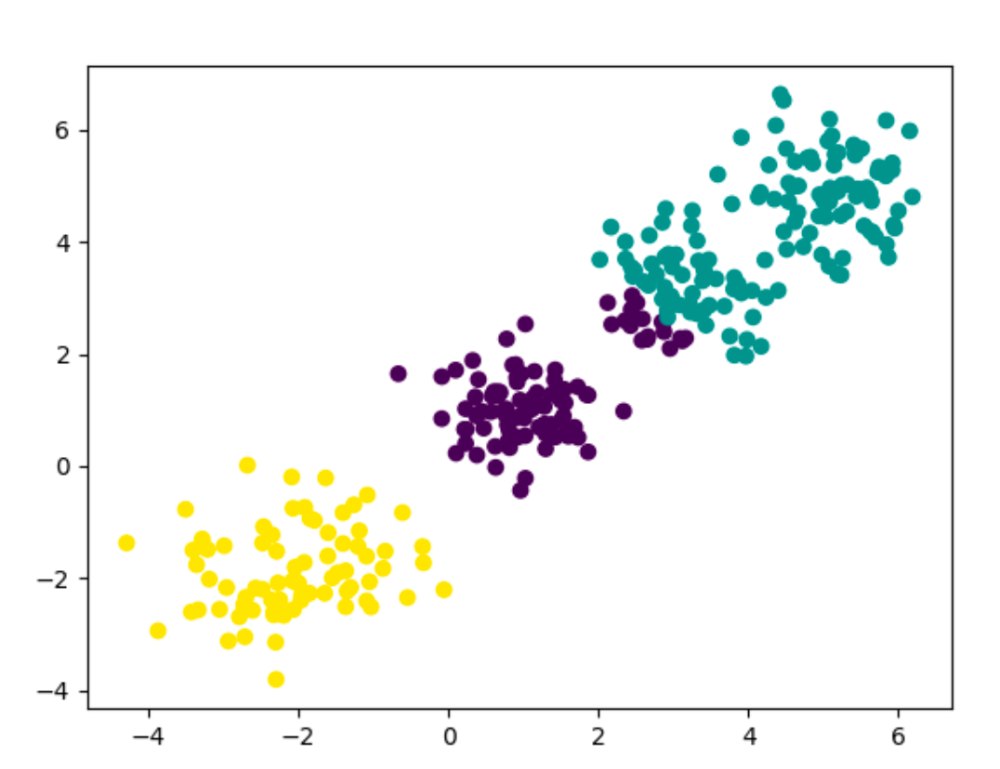
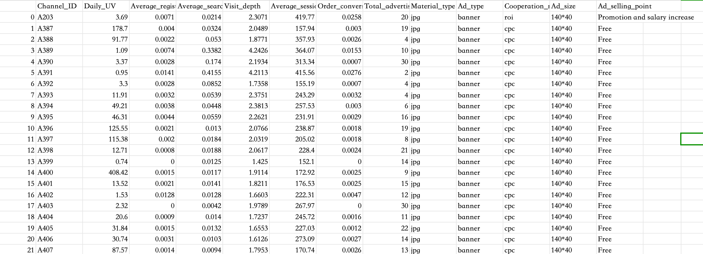
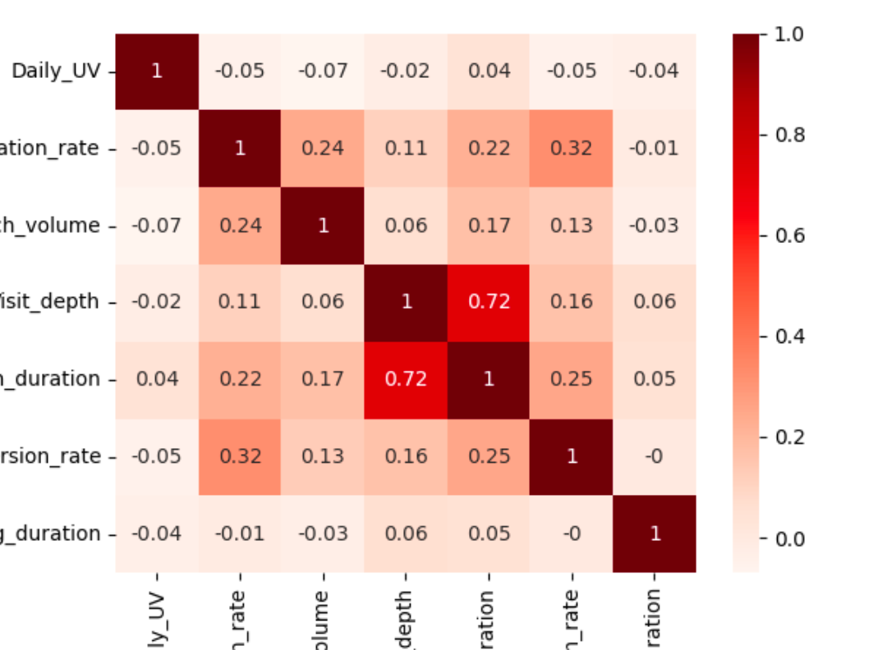
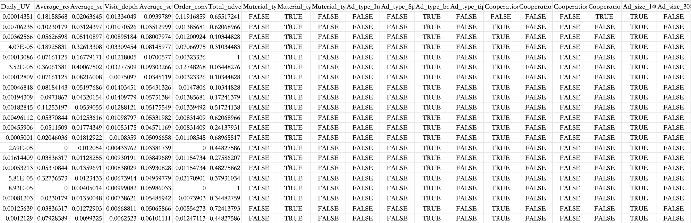
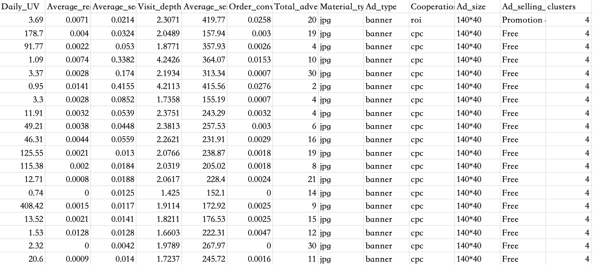

## 算法介绍

聚类（包括KMeans聚类）是一种用于数据分类的无监督学习技术。无监督学习意味着没有标签来指导学习过程（直白说就是没有确切的预期、结果没有对错之分），数据由算法来探索以发现数据的特征。

在聚类技术领域中，K-means可能是最常见也最常使用的算法之一。K-means使用迭代细化方法，基于用户定义的集群数量（由变量K表示）和数据集来产生最终聚类。例如，将K值设为3，则将数据集最终分组为3个集群。在聚类算法中，根据样本之间的相似性将样本划分到不同的类别中，对不同相似度的计算方法，得到的聚类结果也可能不同，常用的相似度计算方法是欧式距离法。

根据对数据集的划分力度不同，聚类算法分为 细聚类 和 粗聚类。细聚类划分更细致，每个簇包含的样本较少，适合需要高精度分类的任务，比如图像分割、基因片段分析；粗聚类划分更为粗糙，包含样本较多，适合快速分类或需要简化数据结构的场景，例如用户画像、广告推荐等场景。


**KMeans聚类的基本原理**

1. K个质心是随机创建的，基于预定义的K值，从数据集中随机选择K个数据，就是初始的K个质心
2. KMeans将数据集中的每个数据点分配距离最近的质心，也就是说如果数据点到某个质心的距离比到其他质心的距离都近，则认为该数据点位于特定集群中
3. 然后KMeans通过获取分配给该质心的所有数据点的平均值来重新计算质心，从而减小上一步中集群内的总方差。KMeans中Mean的含义就是指通过计算均值来找到新质心
4. 然后重复2、3步骤，直到满足一些标准。比如：所有数据点到其对应的质心距离之和达到最小值、计算轮次达到最大值、质心的质不再发生变化、数据点归属集群不再发生变化

看图理解：


**聚类算法的常见应用**

- 用户画像、广告推荐、Data Segmentation、搜索引擎的流量推荐、恶意流量识别
- 基于位置信息的商业推送、新闻聚类、筛选排序
- 图像分割、降维、识别；离群点检测；信用卡异常消费；发觉相同功能的基因片段


## 初体验

在sklearn中，同样为我们封装了KMeans的算法类，同时也提供了方法，可以让我直观的感受一下具有聚类效应的数据集。

下面来生成一些数据：

```python
import matplotlib.pyplot as plt
from sklearn.datasets._samples_generator import make_blobs

# 创建数据集
# n_samples 表示数据集中数据的个数 n_features 表示每个数据有几个特征，也就是有几个维度，这里使用2维便于绘图
# centers 参数可以指定初始质心，这也约束了数据簇的个数；cluster_std 指定每个集群的方差，控制数据点的聚合程度；random_state 随机数种子
x, y = make_blobs(n_samples=300, n_features=2, centers=[[-2, -2], [1, 1], [3, 3], [5, 5]],
                  cluster_std=[0.8, 0.6, 0.6, 0.7], random_state=5)

# 生成的数据集仍然是有标签的，但这里我们不使用就可以了
plt.scatter(x[:, 0], x[:, 1])
plt.show()
```

绘制成图：




我们现在得到了一些数据，用肉眼能看出来这里应该分成四类是最合理的，那么接下来我们用sklearn来进行聚类看看效果。

```python
import matplotlib.pyplot as plt
from sklearn.datasets._samples_generator import make_blobs
from sklearn.cluster import KMeans

# 创建数据集
# n_samples 表示数据集中数据的个数 n_features 表示每个数据有几个特征，也就是有几个维度，这里使用2维便于绘图
# centers 表示数据簇的中心位置，这也约束了数据簇的个数；cluster_std 指定每个集群的方差，控制数据点的聚合程度；random_state 随机数种子
x, y = make_blobs(n_samples=300, n_features=2, centers=[[-2, -2], [1, 1], [3, 3], [5, 5]],
                  cluster_std=[0.8, 0.6, 0.6, 0.7], random_state=5)

# 生成的数据集仍然是有标签的，但这里我们不使用就可以了
# plt.scatter(x[:, 0], x[:, 1])
# plt.show()

# kmeans模型
# n_clusters 就是 K 值，max_iter 表示训练的轮次数
model = KMeans(n_clusters=4, random_state=5, max_iter=200)

# 这里使用 拟合 + 预测，返回的结果就是对应数据所在的类别，这个类别就是不同的数字
# fit_predict 相当于先调用fit 再调用predict
y_pred = model.fit_predict(x)
print(y_pred)  # [1 2 0 1 0 3 0 1 0 1 2 3 2 1 3 0 ... ] 每个数字就表示一个类别

# 打印拟合完成后最后的质心点
print(model.cluster_centers_)  # [[ 0.94494475  1.00439628] [ 5.1089552   4.90725438] [-2.04967599 -1.85339282] [ 3.0971434   3.08179646]]

# 绘制图的时候，把类别当成颜色给到plot，就可以看到不同簇，的区别了
plt.scatter(x[:, 0], x[:, 1], c=y_pred)
plt.show()
```

sklearn聚类结果如下：



当然，你也可以不按照我们认为的应该是4类去拟合，我们把 n_clusters 改为3，那么模型就按3类去拟合，我们在绘制一个图看看：




## 数据分析处理

### 数据简介

我们从kaggle上找了一份广告数据`ad_data.csv`，统计了不同广告渠道的日常UV、注册率、点击率、点击深度等数据，基本长下面这样：



下面是用代码来看下数据集的基本情况。

#### 基本信息

```python
python
import pandas as pd

data = pd.read_csv("data/ad_data.csv")

# 打印前五行和列分布
print(data.head())
"""
   Unnamed: 0 Channel_ID  ...  Ad_size               Ad_selling_point
0           0       A203  ...   140*40  Promotion and salary increase
1           1       A387  ...   140*40                           Free
2           2       A388  ...   140*40                           Free
3           3       A389  ...   140*40                           Free
4           4       A390  ...   140*40                           Free
"""

# 打印数据类型分布
# 把每一列的数据类型打印出来
print(data.dtypes)
"""
Unnamed: 0                      int64
Channel_ID                     object
Daily_UV                      float64
Average_registration_rate     float64
Average_search_volume         float64
Visit_depth                   float64
Average_session_duration      float64
Order_conversion_rate         float64
Total_advertising_duration      int64
Material_type                  object
Ad_type                        object
Cooperation_method             object
Ad_size                        object
Ad_selling_point               object
"""

# 打印列的描述信息，比如：数据行数、平均值、标准差、最大最小值等
print(data.describe())
"""
       Unnamed: 0  ...  Total_advertising_duration
count  889.000000  ...                  889.000000
mean   444.000000  ...                   16.052868
std    256.776492  ...                    8.509435
min      0.000000  ...                    1.000000
25%    222.000000  ...                    9.000000
50%    444.000000  ...                   16.000000
75%    666.000000  ...                   24.000000
max    888.000000  ...                   30.000000
"""

# 统计每一列的缺失值
print(data.isnull().sum())
"""
Unnamed: 0                    0
Channel_ID                    0
Daily_UV                      0
Average_registration_rate     0
Average_search_volume         0
Visit_depth                   0
Average_session_duration      2
Order_conversion_rate         0
Total_advertising_duration    0
Material_type                 0
Ad_type                       0
Cooperation_method            0
Ad_size                       0
Ad_selling_point              0
"""
```

从上面发现，Average_session_duration 列中存在两个空值，我们需要处理。通常有两种方式，一是可以直接把这种数据行给删掉，另外就是使用该列的平均值进行填充。我们就直接填充一下：

```python
import pandas as pd

data = pd.read_csv("data/ad_data.csv")

# 数据填充 指定列把空值填充为列的平均值
# inplace 表示就地修改
data.fillna({"Average_session_duration": data["Average_session_duration"].mean()}, inplace=True)

print(data.isnull().sum())
"""
Average_session_duration      0
"""
```


#### 相关性分析

这里我们就示意一下分析的过程，因为我们 原始数据中还有一些列并不是数值类型。我们只取其中是数值的列来做分析。

需要说明的是，再前面线性回归中，我们也做过相关性分析，当时分析的是自变量x和因变量y之间的相关性，如果xi与y的相关性越高，则说明该自变量对结果的影响越大；此时我们是无监督学习，分析的是自变量x之间的相关性，即x1和x2之间的关系，如果他们之间相关性很高，则说明他们对结果的影响越相近，也就是说把相关性高的两列中的一列噶掉，对结果也没有大的影响。

```python
import pandas as pd

data = pd.read_csv("data/ad_data.csv")
data.fillna({"Average_session_duration": data["Average_session_duration"].mean()}, inplace=True)

# 渠道ID是没啥价值的，我们去第2-8列的数据
data28 = data.iloc[:, 2:9]

# 保留两位小数
print(data28.corr().__round__(2))
"""
                            Daily_UV  ...  Total_advertising_duration
Daily_UV                        1.00  ...                       -0.04
Average_registration_rate      -0.05  ...                       -0.01
Average_search_volume          -0.07  ...                       -0.03
Visit_depth                    -0.02  ...                        0.06
Average_session_duration        0.04  ...                        0.05
Order_conversion_rate          -0.05  ...                       -0.00
Total_advertising_duration     -0.04  ...                        1.00
"""
```

这样看着不够直观，绘制一下热力图：

```python
import pandas as pd
import matplotlib.pyplot as plt
import seaborn as sb

data = pd.read_csv("data/ad_data.csv")
data.fillna({"Average_session_duration": data["Average_session_duration"].mean()}, inplace=True)

# 渠道ID是没啥价值的，我们去第2-8列的数据
data28 = data.iloc[:, 2:9]
relations = data28.corr().__round__(2)

sb.heatmap(relations, cmap="Reds", annot=True)
plt.figure(figsize=(96, 64))
plt.show()
```



可以看到 Visit_depth 和 Average_session_duration 的相关性是比较高的 0.72，则说明这两列对结果的影响很接近。


### 数据处理

#### 独热编码处理非数值列

我们原始数据集中还躺着一些非数值的列，很显然这是不能给到模型进行训练的，这里我们就再次要使用到独热编码，来把非数值的列做转换，原始数据集中的非数值的列有：Material_type、Ad_type、Cooperation_method、Ad_size、Ad_selling_point

```python
import pandas as pd

data = pd.read_csv("data/ad_data.csv")
data.fillna({"Average_session_duration": data["Average_session_duration"].mean()}, inplace=True)

cols = ["Material_type", "Ad_type", "Cooperation_method", "Ad_size", "Ad_selling_point"]
cols = data[cols]

# 该方法根据列的取值，生成新的列，列的值只会是 0 或 1
one_hots = pd.get_dummies(cols)
print(one_hots.columns)
"""
Index(['Material_type_gif', 'Material_type_jpg', 'Material_type_video',
       'Ad_type_Information flow', 'Ad_type_Splash Screen', 'Ad_type_banner',
       'Ad_type_tips', 'Cooperation_method_cpc', 'Cooperation_method_cpd',
       'Cooperation_method_cpm', 'Cooperation_method_roi', 'Ad_size_140*40',
       'Ad_size_308*388', 'Ad_size_390*270', 'Ad_size_450*300',
       'Ad_size_480*360', 'Ad_size_600*90', 'Ad_size_900*120',
       'Ad_size_960*126', 'Ad_selling_point_Employment',
       'Ad_selling_point_Expert faculty', 'Ad_selling_point_Free',
       'Ad_selling_point_Improving efficiency', 'Ad_selling_point_Low Price',
       'Ad_selling_point_Promotion and salary increase'],
      dtype='object')
"""
```

原始数据中，前两列也是不需要的数据，我们直接把独热编码得到的列跟现有需要的列拼到一起。

```python
import pandas as pd

data = pd.read_csv("data/ad_data.csv")
data.fillna({"Average_session_duration": data["Average_session_duration"].mean()}, inplace=True)

cols = ["Material_type", "Ad_type", "Cooperation_method", "Ad_size", "Ad_selling_point"]
cols = data[cols]

# 该方法根据列的取值，生成新的列，列的值只会是 0 或 1
one_hots = pd.get_dummies(cols)

data = pd.concat((data.iloc[:, 2:9], one_hots), axis=1)
print(data.columns)
```


#### 数据归一化

独热编码的部分本身就是0和1不需要再做归一化了，我们把其他有用的数据做好处理

```python
import pandas as pd
from sklearn.preprocessing import MinMaxScaler

data = pd.read_csv("data/ad_data.csv")
data.fillna({"Average_session_duration": data["Average_session_duration"].mean()}, inplace=True)

cols = ["Material_type", "Ad_type", "Cooperation_method", "Ad_size", "Ad_selling_point"]
cols = data[cols]

# 该方法根据列的取值，生成新的列，列的值只会是 0 或 1
one_hots = pd.get_dummies(cols)

# 归一化
scaler = MinMaxScaler()
data = scaler.fit_transform(data.iloc[:, 2:9])

print(data.shape)  # (889, 7)

# 此时data被转成了np数组，所以拼接时还得转回来，不过列名就丢失了，我们可以给它加上
columns = ["Daily_UV", "Average_registration_rate", "Average_search_volume", "Visit_depth",
           "Average_session_duration", "Order_conversion_rate", "Total_advertising_duration"]
data = pd.concat((pd.DataFrame(data, columns=columns), one_hots), axis=1)

# 把处理的数据保存一下
# index 不要行前面的序号
data.to_csv("./data/ad_data_new.csv", index=False)
```

我们看看我们处理后的数据：




## 训练与评估

到此为止我们完成了数据处理，但此时会有一个新的问题，那就是K到底取什么值最合适，这里和KNN算法找K的思路差不多。另外，我们还要结合业务实际的需求来选择K值，因为K太大，后续得到的分类也就越多，对问题进一步的分析难度也会更大，极端情况是多少条数据粉多少个类，这就等于没做数据聚类了。

为了评估K取什么值合适，下面介绍一下 轮廓系数法 和 CH系数法。

### 轮廓系数法

轮廓系数（Silhouette Coefficient），是聚类效果好坏的一种评价方式。公式如下：
$$
S(i)=\frac{b(i)-a(i)}{max\{a(i),b(i)\}}
\\
a(i) 表示簇中其中一个向量i到它所属簇中其他点的距离的平均值，也就是向量i到同一簇内其他点不相似程度的平均值
\\
b(i) 表示簇中其中一个向量i到其他簇中所有点的距离的平均值的最小值，也就是向量i到其他簇的平均不相似程度的最小值
$$
参照下图理解：


可见轮廓系数的值是介于 [-1,1] ，越趋近于1代表内聚度和分离度都相对较优。


### CH系数法

CH系数基于`簇内离散度`和`簇间离散度`的比值，较高的CH值表明聚类结构更加明显，簇间差异大而簇内差异小，因此好的聚类结果应该有较高的CH系数。

CH系数公式如下：
$$
CH(k)=\frac{B_k/(k-1)}{W_k/(n-k)}
\\
B_k 簇间离散度，各簇质心到总质心之间离散程度的加权和。值越大，表示簇间差异越大
\\
W_k 簇内离散度，簇内各点到质心的离散程度加权和。值越小表示簇内凝聚性越好
\\
k 表示聚类的簇数
\\
n 表示样本总数
$$


### 查找K值

我们下面使用轮廓系数法来找一个区间范围中评分最高的K值。此处我们就是用前面处理过的数据集了。

```python
import pandas as pd

from sklearn.cluster import KMeans
from sklearn.metrics import silhouette_score

data = pd.read_csv("./data/ad_data_new.csv")

# 从 3-9 的范围找一个最合适的k值
k_score = []
for k in range(3, 10):
    # random_state 不固定的话，每次的初始质心会有差异，那就是去对比的意义了，这个 数据集拆分的random_state作用类似
    model = KMeans(n_clusters=k, random_state=5)
    # 虽然说数据集本身没有标签，但是既然是聚类算法，聚类后还是要给个标签表示数据属于那个分类
    # 至于说分类对不对就要用户自己分析了
    y_pred = model.fit_predict(data)
    # 打分
    score = silhouette_score(data, y_pred)

    k_score.append((k, score))

# 排序一下然后输出
k_score.sort(key=lambda x: x[1], reverse=True)
print(k_score[0])  # (9, 0.5217162355948689)
```

可以看到，在3-9的区间，打分最高的就是最多的分类9，如果区间更大一些，最有分类应该还会变化，此处就不纠结了，那么，我们就可以基于 K = 9 算出每个数据的分类标签，然后追加到原始数据中，标语分析评估：

```python
import pandas as pd

from sklearn.cluster import KMeans

data = pd.read_csv("./data/ad_data_new.csv")
model = KMeans(n_clusters=9, random_state=5)
y_pred = model.fit_predict(data)

origin_data = pd.read_csv("./data/ad_data.csv")

# 把不要的前两列去掉
origin_data = origin_data.iloc[:, 2:]

data = pd.concat((origin_data, pd.DataFrame(y_pred, columns=["clusters"])), axis=1)

# 保存一份带标签的数据
data.to_csv("./data/ad_data_label.csv", index=False)
```

带标签的数据如下：




### 结果分析

现在我们已经将数据的类别分好了，下面来做一些分析。

每个分类的数量：

```python
import pandas as pd

data = pd.read_csv("./data/ad_data_label.csv")

print(data.groupby("clusters").count().iloc[:, :1])
"""
          Daily_UV
clusters          
0               69
1               86
2              127
3              249
4               53
5               39
6               80
7               72
8              114
"""
```

查看每个分类的特征，针对数据类型的我们提取平均值，针对非数字类型我们提取top值：

```python
import pandas as pd
from pandas import Series

data = pd.read_csv("./data/ad_data_label.csv")
features = []
for i in range(9):
    group = data[data["clusters"] == i]

    # 数值部分
    nums = group.iloc[:, :7].describe().round(3)
    # 平均值在第二行，我们就去 第二行的所有列
    mean = nums.iloc[1, :]

    # 字符串部分
    strs = group.iloc[:, 7:-1].describe(include="all")
    # top 值在第三行
    top = strs.iloc[2, :]

    # 把当前分类标签放到第一列，类别样本总数放第二列，分类占比放第三列
    base = Series([i, group["clusters"].count(), (group["clusters"].count() / data["clusters"].count()).round(3)],
                  index=["clusters", "count", "ratio"])

    # 把分析数据拼到一起
    feature: Series = pd.concat((base, mean, top), axis=0)

    features.append(feature)

# 把分析数据保存到文件
pd.DataFrame(features).to_csv("./data/da_data_analysis.csv", index=False)
```

最终结果如下：


## 数据降维

我们把原始数据进行热的编码处理之后，每个数据的维度可能达到了三四十个了，那么这里我们也进行一下降维，看看最终的分析数据差异大不大

```python
import pandas as pd
from pandas import Series
from sklearn.cluster import KMeans
from sklearn.decomposition import PCA

data = pd.read_csv("./data/ad_data_new.csv")

print(data.shape)  # (889, 32)

# 数据降维
pca = PCA(n_components=3)
data = pca.fit_transform(data)

print(data.shape)  # (889, 3)

# 用降维后的数据聚类
model = KMeans(n_clusters=9, random_state=5)
y_pred = model.fit_predict(data)

# 基于原始数据构造分析数据
data = pd.read_csv("./data/ad_data.csv")
data = pd.concat((data.iloc[:, 2:], pd.DataFrame(y_pred, columns=["clusters"])), axis=1)

# 数据分析
features = []
for i in range(9):
    group = data[data["clusters"] == i]

    # 数值部分
    nums = group.iloc[:, :7].describe().round(3)
    # 平均值在第二行，我们就去 第二行的所有列
    mean = nums.iloc[1, :]

    # 字符串部分
    strs = group.iloc[:, 7:-1].describe(include="all")
    # top 值在第三行
    top = strs.iloc[2, :]

    # 把当前分类标签放到第一列，类别样本总数放第二列，分类占比放第三列
    base = Series([i, group["clusters"].count(), (group["clusters"].count() / data["clusters"].count()).round(3)],
                  index=["clusters", "count", "ratio"])

    # 把分析数据拼到一起
    feature: Series = pd.concat((base, mean, top), axis=0)

    features.append(feature)

# 把分析数据保存到文件
pd.DataFrame(features).to_csv("./data/da_data_analysis_pca.csv", index=False)
```

pca保存的分析数据文件：


可以看到整体结果还是有不小的差异，在降维的过程中必然是存在精度丢失的。
