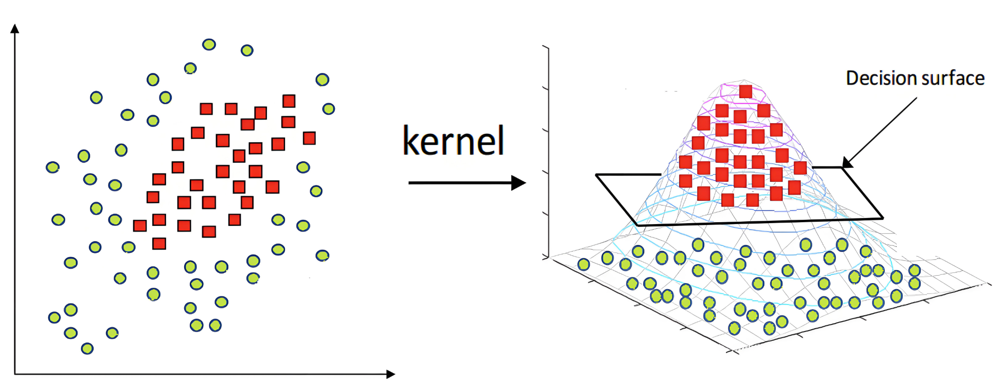
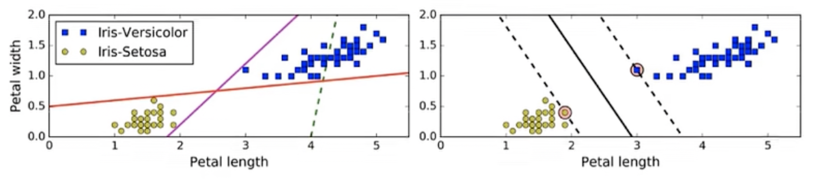
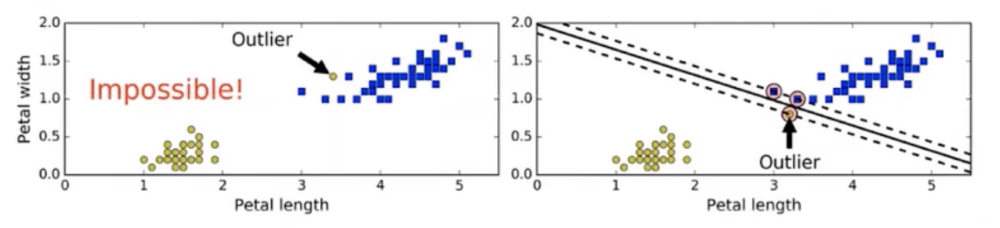

## 算法原理

支持向量机（Support Vector Machine）是一种有监督学习方法，主要用于分类和回归。它的基本思想是在特征空间中找到一个超平面，能够将不同类别的样本分开，并且使得离这个平面最近的样本点到该平面的距离最大化。支持向量机在处理高位数据和非线性问题时表现良好。

SVM能够执行线性或非线性的分类、回归，甚至是异常值检测任务，它是机器学习领域最受欢迎的模型之一。SVM特别适用于中小型数据集的分类。


### 概念

1. 超平面（Hyperplane）：在n维空间中，一个n-1维的子空间就是一个超平面。在二维空间中，超平面就是一条直线；在三维空间中，超平面就是一个平面。在支持向量机中，我们试图找到一个超平面，使得样本点刻意被分成两个类别。
2. 支持向量（Support vectors）：这些是离超平面最近的点，他们对于定义超平面并确定分类决策边界起着关键作用。支持向量机的训练过程中，只有支持向量的位置才会影响最终模型。
3. 间隔（Margin）：间隔是指超平面与支持向量之间的距离，支持向量机的目标是最大化这个间隔，从而提升模型泛化能力。
4. 核函数（Kernel Function）：在处理非线性问题时，可以使用核函数将数据映射到更高维空间中，使其在高维空间中线性可分。常用的核函数包括 线性核、多项式核、径向基函数（RBF）核。
5. C参数：C是一个正则化参数，它控制了对误分类样本的惩罚程度。较小的C值会导致更大的间隔，但可能允许一些样本被错误分类；较大的C值则会强调对误分类样本的惩罚，可能导致更复杂的决策边界


当在一个平面上无法线性可分时，可以通过核函数将其映射到一个高维空间中，实现线性可分。



如何映射到高维空间，算法有很多，简单的就是用空间里的点到原点的距离（本质就是勾股定理的变种），比如下图中的z就可以用如下公式得到，直接把计算结果作为新增的一维数据：
$$
z = \sqrt{{x_1}^2+{x_2}^2}
$$


### 优点

1. 适用于高维空间：SVM在高维空间中表现出色，特别适用于处理具有许多特征的数据集，如文本分类或图像识别。
2. 泛化能力强：SVM通过最大化间隔的方式，有助于提高模型对新样本的泛化能力，降低过拟合的风险。
3. 对小样本数据效果好：即使在样本量相对较小的情况下，SVM也能表现良好，这是因为它主要关注支持向量。
4. 核函数的灵活性：使用核函数可以处理非线性问题，将数据映射到更高维的空间中，使其在高维空间中变得线性可分。
5. 对异常值的鲁棒性：SVM对于一些噪声和异常值的影响相对较小，支持向量主要受到那些距离超平面最近的样本的影响。


### 缺点

1. 计算开销较大：对于大规模的数据集，SVM的训练和预测的计算开销较大，尤其在高维空间中。
2. 参数调优复杂：SVM有一些参数需要调优，例如C参数和核函数的选择，这可能需要通过交叉验证等方法来找到最优的参数设置。
3. 不适用于非线性大数据集：在非线性大数据集上，训练和预测的速度可能会受到影响，且可能需要更长的时间。
4. 不适用于非平衡数据集：对于类别不平衡的数据集，SVM可能会偏向于对多参数类别进行优化，而忽略少数类别。
5. 不直接提供概率估计：SVM本身不直接提供类别的概率估计，而是通过一些启发式方法进行近似，这在某些应用中可能不够理想。（逻辑回归直接输出概率）


### 为什么SVM适合处理多维特征数据

1. 最大间隔分隔超平面：SVM的目标是找到一个最大间隔的分隔超平面，使得不同类别的样本在特征空间中的投影距离最远。在高维空间中，样本点分布通常更稀疏，更容易找到一个超平面使得不同类别之间的距离最大化。
2. 高维度下线性可分性的增加：随着特征维度的增加，数据在高维空间中更有可能变得线性可分。这是由于在高维空间中，不同类别的样本更容易在某个维度上有较大的差异，使得找到一个超平面来分隔它们变得更为可能。
3.  避免维度灾难：在高维空间中，样本点之间的距离可能更加有意义。在低维空间中，由于维度较少，样本点之间的距离可能较小，这会导致模型更容易过拟合。而在高维空间中，样本点之间的距离相对较大，有助于避免维度灾难。
4. 支持向量的稀疏性：在高维空间中，支持向量（决策边界附近的样本点）的数量相对较少，因为只有这些样本点对模型的构建起关键作用。这种稀疏性使得SVM在高维空间中更加高效。
5. 核技巧：SVM使用核函数将样本映射到高维空间，从而在低维空间中非线性可分的问题在高维空间中变得线性可分。这种核技巧在处理文本分类、图像识别等高维特征数据时尤为有效。


## SVM 算法定义

### 超平面最大间隔



左图显示了三种线性分类器的决策边界。

虚线所代表的模型表现非常糟糕，甚至无法正确实现分类。其余两个模型在训练集的分类上表现非常好，但他们的决策边界与实例过于接近，导致在面对新实例时表现不会太好。

右图中的实现代表SVM分类器的决策边界，不仅分离了两个类别，还尽可能的远离了最近的训练实例。


### 硬间隔

在上面使用超平面分割数据的过程中，如果我们严格的让所有实例都不在最大间隔之间，并且实例位于正确的一边，这就是硬间隔分类。

硬间隔有两个问题：

- 它只在数据线性可分的时候有效
- 它对异常值非常敏感

比如，下图有一个异常数据：

- 左图的数据根本找不出硬间隔
- 右图的决策边界也与我们预期的决策边界相去甚远，可能无法很好的泛化




### 软间隔

要避免硬间隔的问题，就要使用更灵活的模型。目标是尽可能在保持最大间隔宽度的同时，控制好间隔违例（允许实例出现在最大间隔之上，甚至出现在错误分类的一边），这就是软间隔分类。


在sklearn的SVM类中，可以通过超参数C来控制这个平衡，C值越小，则间隔越宽，但是间隔违例也会越多。

上图中，左边使用了高C值，分类器的错误样本（违例）较少，但间隔也较小；右边使用了低C值，间隔大了很多，但位于间隔上的违例也更多。

但第二个看起来泛化效果会更好，因为大多数位于间隔上的违例实际是位于正确的一边，保证泛化效果的同时，也确保了较高的准确性。


## SVM 损失函数

在SVM中我们主要关注三种损失。


- 绿色：0/1损失

  - 当正例的点落在 y=0 这个超平面的下边，说明是分类正确，无论距离超平面所远多近，误差都是0

  - 当这个正例的样本点落在 y=0 的上方的时候，说明分类错误，无论距离多远多近，误差都为1

  - 图像就是上图绿色线

- 蓝色：SVM Hinge 损失函数（合叶损失）

  - 损失函数的公式为：

    $$
    L=\begin{cases}1-y_i\quad y_i<=1\\0\quad y_i>1\end{cases}
    $$

  - 当一个正例的点落在 y=1 的直线上，此时和超平面距离为 1，也就是 1-L=1，那么误差 L=0

  - 当它落在距离超平面 0.5 的地方，也就是 1-L=0.5，那么误差L=0.5

  - 当它落在 y=0 上的时候，此时和超平面距离为 0，也就是 1-L=0，那么误差L=1

  - 当这个点落在 y=0 的上方，被误分到了负例中，此时和超平面距离应该是负的，比如 -0.5，也就是 1-L=-0.5，那么误差L=1.5

  - 以此类推，画在二维坐标上就是上图中蓝色那根线了。

- 红色：Logistic 损失函数

  - 损失函数的公式为：
    $$
    ln(1+e^{y_i})
    \\
    ln是以自然常数e（约2.718）为底的对数（自然对数），而log通常指以10为底的常用对数（log₁₀），两者本质相同但底数不同
    $$
  
  - 当  y_i = 0 时，损失等于 ln2，这样损失函数不是很漂亮，所以我们给这个损失函数除以 ln2，这样当 y_i = 0 时，损失为 1，即损失函数过（0，1）点
  
  - 即上图中的红色线。


## SVM 应用

### 核函数简介

在现实任务中，原始样本空间内也许并不存在一个能正确划分两类样本的超平面。

对这样的问题，可将样本从原始空间映射到一个更高维的特征空间，使得样本在这个特征空间内线性可分。


- 线性核：只能解决线性可分问题，简单易用，可解释性强
- 多项式核：依靠升维使得原本线性不可分的数据线性可分。可以解决某些非线性问题，幂数太大不适用
- 高斯核：也叫RBF核，或径向基核，函数可以映射到无限维(可用泰勒级数展开至无限维)，只有一个参数。容易过拟合，可解释性差，计算速度比较慢。
- 拉普拉斯核：拉普拉斯核等价于指数核，唯一的区别在于前者对参数的敏感性下降，也是一种径向基核函数
- Sigmoid核：也叫双曲正切核，采用Sigmoid函数作为核函数时，支持向量机实现的就是一种多层感知神经网络

注意：若核函数选择不合适，则意味着将样本映射到了一个不合适的特征空间，很可能导致性能不佳。


### SVM 内置对象

| 类              | 含义                   | 输入参数示例                           |
| --------------- | ---------------------- | -------------------------------------- |
| svm.LinearSVC   | 线性支持向量分类       | [penalty, loss, dual, tol, C,...]      |
| svm.LinearSVR   | 线性支持向量回归       | [epsilon, tol, C, loss,...]            |
| svm.SVC         | 非线性多维支持向量分类 | [C, kernel, degree, gamma, coef0...]   |
| svm.SVR         | 非线性多维支持向量回归 | [kernel, degree, gamma, coef0, tol...] |
| svm.NuSVC       | Nu支持向量分类         | [nu, kernel, degree, gamma,...]        |
| svm.NuSVR       | Nu支持向量回归         | [nu, kernel, degree, gamma,...]        |
| svm.OneClassSVM | 无监督异常值检测       | [kernel, degree, gamma,...]            |


### 实战

此处继续使用在逻辑回归中使用过的`heart.csv`数据集，前置操作什么的就一顿复制了。

```python
import numpy as np
import pandas as pd

from sklearn.preprocessing import MinMaxScaler
from sklearn.model_selection import train_test_split
from sklearn.svm import SVC


# 加载数据
heart = pd.read_csv("./data/heart.csv")

# 做了独热编码后，效果好到难以相信，几个核差异很小，故此处先不做
# cp = pd.get_dummies(heart['cp'], prefix="cp")
# restecg = pd.get_dummies(heart['restecg'], prefix="restecg")
# slope = pd.get_dummies(heart['slope'], prefix="slope")
# ca = pd.get_dummies(heart['ca'], prefix="ca")
# thal = pd.get_dummies(heart['thal'], prefix="thal")
#
# heart = heart.drop(columns=["cp", "restecg", "slope", "ca", "thal"])
# heart = pd.concat([heart, cp, restecg, slope, ca, thal], axis=1)

x = np.array(heart.iloc[:, :-1])  # 取所有行，最后一列不取，最后一列是标签列
y = np.array(heart.iloc[:, -1:]).flatten()  # 展平成一维

# 拆分训练集和测试集
x_train, x_test, y_train, y_test = train_test_split(x, y, test_size=0.2, random_state=0)

# 归一化处理
scaler = MinMaxScaler()
x_train = scaler.fit_transform(x_train)
x_test = scaler.transform(x_test)

# 训练及测试，使用默认值
svc = SVC(kernel="rbf", C=1.0)  # 高斯核
svc.fit(x_train, y_train)
print(svc.score(x_test, y_test))  # 0.9024390243902439


svc = SVC(kernel="linear", C=1.0)  # 线性核
svc.fit(x_train, y_train)
print(svc.score(x_test, y_test))  # 0.8634146341463415

svc = SVC(kernel="poly", C=1.0)  # 多项式核
svc.fit(x_train, y_train)
print(svc.score(x_test, y_test))  # 0.9317073170731708

svc = SVC(kernel="sigmoid", C=1.0)
svc.fit(x_train, y_train)
print(svc.score(x_test, y_test))  # 0.7560975609756098
```

心脏病数据是一个二分类问题，我们也可以使用鸢尾花数据再来实战一次，鸢尾花是一个三维分类数据集。

```python
import numpy as np
import pandas as pd
from sklearn.datasets import load_iris

from sklearn.preprocessing import MinMaxScaler, StandardScaler
from sklearn.model_selection import train_test_split
from sklearn.svm import SVC


x, y = load_iris(return_X_y=True, as_frame=False)

# 拆分训练集和测试集
x_train, x_test, y_train, y_test = train_test_split(x, y, test_size=0.5, random_state=5)

scaler = StandardScaler()
scaler.fit(x_train)
# 使用相同标准归一化训练集和测试集
x_train = scaler.transform(x_train)
x_test = scaler.transform(x_test)

# 训练及测试，使用默认值
svc = SVC(kernel="rbf", C=1.0)  # 高斯核
svc.fit(x_train, y_train)
print(svc.score(x_test, y_test))  # 0.96

svc = SVC(kernel="linear", C=1.0)  # 线性核
svc.fit(x_train, y_train)
print(svc.score(x_test, y_test))  # 0.96

svc = SVC(kernel="poly", C=1.0)  # 多项式核
svc.fit(x_train, y_train)
print(svc.score(x_test, y_test))  # 0.9066666666666666

svc = SVC(kernel="sigmoid", C=1.0)
svc.fit(x_train, y_train)
print(svc.score(x_test, y_test))  # 0.8533333333333334
```

不同的数据集、不同的核函数，以及参数C都会对分类结果有影响，上面的实战中C值一直都是1，表示不对损失做收敛或放大。所谓的惩罚，其实就是放大损失，让模型训练时加快收敛的速度。

与逻辑回归相比，通过SVM分类的打分整体评分更高。


