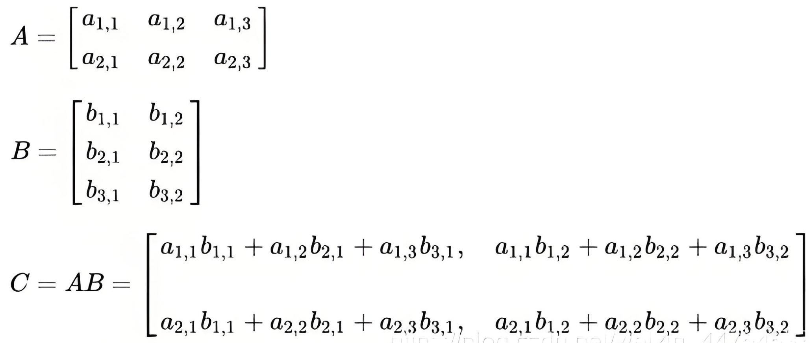
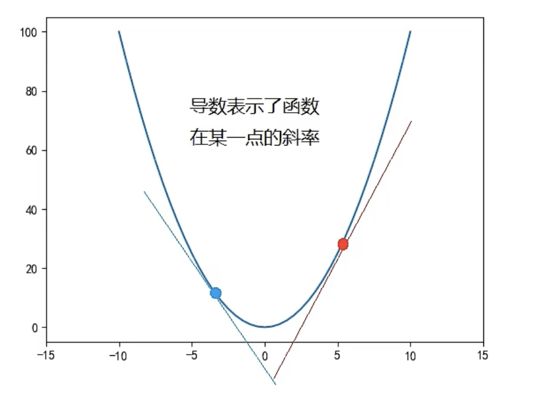
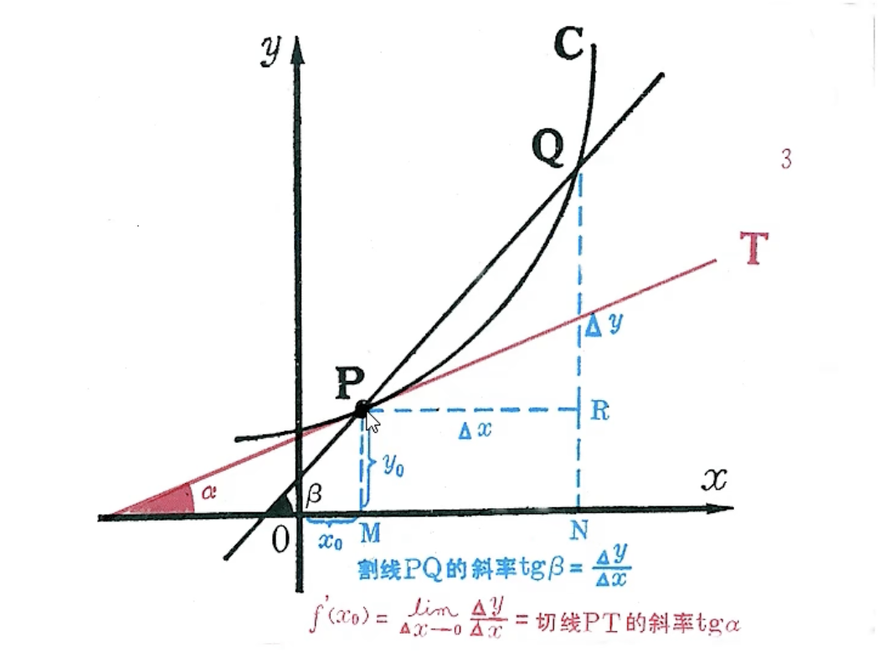

## 向量和距离计算

### 向量与原点的距离

在二维平面中，到原点的距离：
$$
\lvert\overrightarrow{x,y}\rvert=\sqrt{x^2+y^2}
$$
三维空间中，同样可得：
$$
\lvert\overrightarrow{x,y,z}\rvert=\sqrt{x^2+y^2+z^2}
$$
其实可以看出，就是勾股定理的延伸。延伸得到n维控件向量到原点的距离为：
$$
\overrightarrow{P}=\sqrt{{x_1}^2+{x_2}^2+{x_3}^2+...+{x_n}^2}
$$

### 向量间的距离

计算凉凉之间的距离或者求和，要求两个向量的维度必须一样。

**两个样本的特征相似度可以用特征距离来表示，KNN算法一般用的欧式公式。**欧式公式可以用勾股定理推导而来，其公式如下：

- 二维平面上的点`a(x1,y1)`和点`b(x2,y2)`之间的欧式距离公式：
  $$
  d_{ab}=\sqrt{(x_1-x_2)^2+(y_1-y_2)^2}
  $$

- 三维空间上的点`a(x1,y1,z1)`和点`b(x2,y2,z2)`之间的欧式距离公式：
  $$
  d_{ab}=\sqrt{(x_1-x_2)^2+(y_1-y_2)^2+(z_1-z_2)^2}
  $$

- n维空间平面上的点点`a(x1,x2,...,xn)`和点`b(y1,y2,...,y2)`之间的欧式距离公式：
  $$
  d_{ab}=\sqrt{(x_1-y_1)^2+(x_2-y_2)^2+...+(x_n-y_n)^2}=\sqrt{\sum_{i=1}^n(x_i-y_i)^2}
  $$

### 向量的和

两个向量求和，就是把对应维度上的数值相加，得到一个新的向量。
$$
\overrightarrow{a} = (3, 5)
\\
\overrightarrow{b} = (7, 2)
\\
\overrightarrow{P} = \overrightarrow{a} + {\overrightarrow{b}}=(3+7, 5+2)=(10, 7)
$$
那么求和得到的新向量到原点的距离就是：
$$
Distance=\sqrt{10^2+7^2}=\sqrt{149}=12.2
$$
我们也可以单独计算出两个向量到原点的距离在相加，来获得向量相加后的距离：
$$
Distance=\sqrt{3^2+5^2} + \sqrt{7^2+2^2}=13.11
$$
可以看到，上述两种计算向量相加后的距离是不一样的，为什么处出现这个情况呢？是因为在几何空间向量本身是有方向的，两个向量的夹角会影响求和的结果，当两个向量夹角为0时，公式8的计算结果将与公式9计算结果相同。

因此，公式9是单纯的计算出两个向量的模（就是到原点的距离）然后相加，而向量相加后到原点的真是距离应该是公式8计算得到的结果。

### 向量的积

两个向量求积，就是把对应维度上的数值相乘（也叫 点积）然后在相加。
$$
\overrightarrow{a} = (3, 4)
\\
\overrightarrow{b} = (2, 6)
\\
 \overrightarrow{a} * {\overrightarrow{b}}=3*2 + 4*6=30
$$
除了上述计算方法，还可以通过 两个向量的模相乘后再乘以两个向量夹角的余弦值 得出：
$$
\overrightarrow{a} * {\overrightarrow{b}}=\lvert\overrightarrow{a}\rvert*\lvert\overrightarrow{b}\rvert*\cos{\theta}
$$
那么我们就可以进一步计算得到两个向量的余弦值：
$$
\cos{\theta}=\frac{30}{\lvert\overrightarrow{a}\rvert*\lvert\overrightarrow{b}\rvert}=\frac{30}{\sqrt{3^2+4^2}*\sqrt{2^2+6^2}}=0.9486
$$
可以看到，两个向量的余弦值为：0.9486，而0度的余弦值最大，为1。所以，向量间的夹角余弦值也叫**余弦相似度**，用于评估两个向量的相似程度。

### 相似度计算

上面提到了**余弦相似度**，使用两个向量之间夹角的余弦值来衡量，夹角越小，余弦值越大，相似度越高。但这里可以很轻松地想到一些反例，相同夹角时向量的欧式距离可以有长有短，明显欧式距离更近的两个向量，即便夹角和距离较远的两个向量是相同的，但直观感觉上明显距离近的更相似。

基于此，还有一个**点积相似度**，上面也介绍了点积，就是把两个向量对应位置的数值相乘再相加，然后得到一个标量，不是新的向量。通常点积结果越大，认为相似度越高。但很明显这和上面余弦相似度有相同的问题。因此，计算点积相似度，需要把所有向量进行归一化处理，这样得到的值位于[-1, 1]之间，值越大相似度越高。-1表示完全不相似，1则表示完全相似。

### 矩阵乘法

矩阵乘法的规则：矩阵A的列数必须等于矩阵B的行数，才能相乘。

`A(M行, N列) * B(N行, P列) = C(M行, P列)`

## 导数与梯度下降

### 导数

导数的几何意义是切线的斜率。在平面坐标系中，函数图像上某一点的切线斜率等于该点的导数值。因此，通过求导确定曲线在某一点的切线斜率，进一步分析曲线的形状和变化趋势。

某个点的导数计算公式可以写为：
$$
P^{'}=\frac{\Delta_y}{\Delta_x}
$$
也可以写为：
$$
P^{'}=\frac{d_y}{d_x}
$$
导数计算的结果就是切线的斜率。但是由于在一条曲线上，导数都是在动态变化的，所以通常导数也使用一个函数来表示。比如：
$$
y^{'}=2x+3
$$

导数的作用：

1. 判断单调性。通过求函数的导数，可以判断函数的单调性。如果函数在某个区间内的导数大于0，则函数在该区间内单调递增；如果导数小于0，则函数单调递减
2. 判断极值和拐点。导数为0的点可能是函数的极值点或拐点。在极值点处，函数值从递增变为递减或从递减变为递增，因此极值点是函数变化的趋势的转折点。通过求导并令导数为0，我们可以找到可能得极值点或拐点，进一步分析这点的特质
3. 优化问题。在实际问题中，我们经常遇到需要找最值的问题，比如成本最低、利润最大等。通过求导找到函数的极值点，结合实际情况进行分析，可以找到最优解。

### 梯度下降

梯度下降可以说是机器学习的精髓，各种机器学习所产生的奇迹，都必须建立在梯度下降的机制之下才有了让人感觉智能的结果。

比如针对方程：`f(x) = x^2 + 2x + 3`，根据上述导数的计算规则，则导函数为：`f(x)' = 2x + 2` ，基于导函数可以获取x在某个取值时 f(x)' 的值。比如 x = 0 时，y' = 2，此时原函数单调递增；x = -1 时，y' = 0，原函数获得最小值 2；x = -3 时，y' = -4，此时 原函数单调递减。

梯度下降就是根据导函数来计算，如果导函数的值为证，则说明原函数呈上升趋势，这样就不能找到最小值；如果导函数的值为负数，则说明原函数呈下降趋势，就有可能找到最小值。

对于导函数x取值的步进，取值不能过大，过大可能导致原函数刚好跳过最小值，当然也不能过小，太小会导致计算量暴增。在AI领域，我们将这个步进称为 **学习速率** 。具体的调整需要根据具体的情况来测试，没有标准答案。

