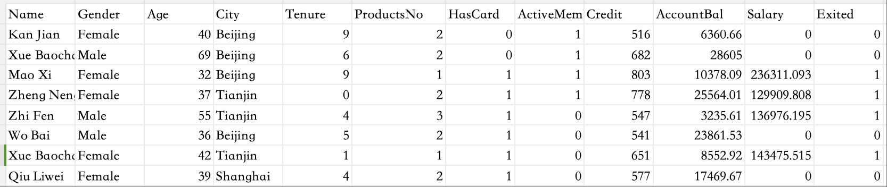
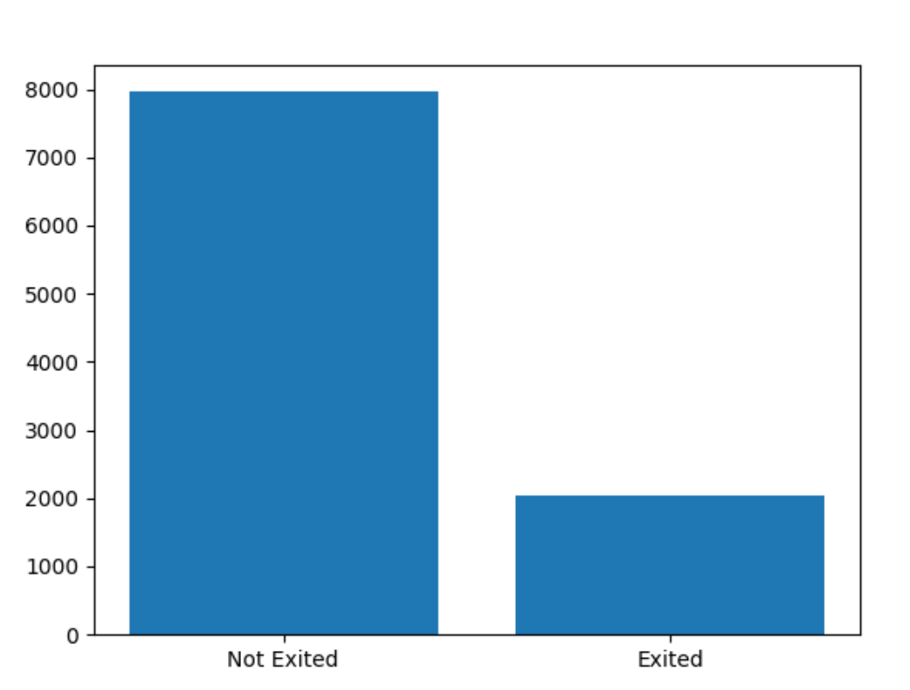
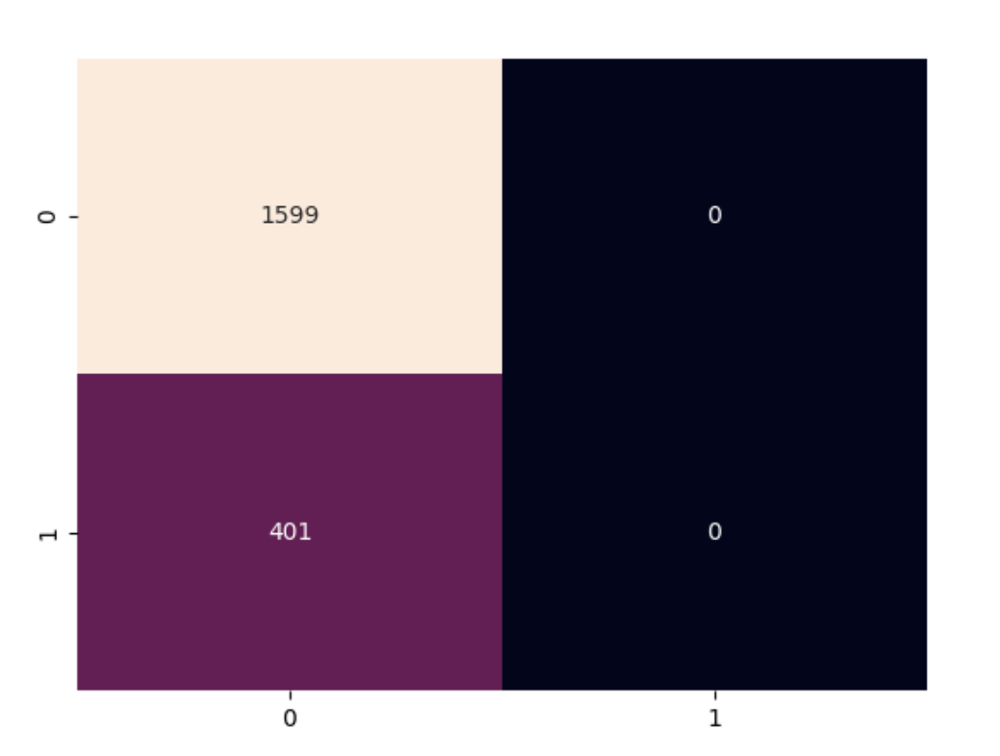

## 数据准备

我们准备一份银行客户的数据集`BankCustomer.csv`，这是一份带标签的数据集，我们先来分析一下数据的特征。



这份数据中Exited列作为标签列，表示客户是否已经退出，是一个二分类问题。这里数据集中标签的数量分布情况如下：

```python
import pandas as pd

data = pd.read_csv("data/BankCustomer.csv")
print(data[data["Exited"] == 0]['Exited'].count())  # 7963
print(data[data["Exited"] == 1]['Exited'].count())  # 2037
```

从统计数据看，标签数据的分布是很不均匀的，换句话说，就是给一个未经训练的模型，直接判定推出状态为0，它的准确率就可以达到80%。所以，这种分布不均匀的数据，用之前的评估思路是行不通的。这个问题我们先暂时放一下。

先来清洗数据，数据中的 Name 我们可以直接删除掉，名字对数据预测来说毫无作用，然后Gender、City两列是文本类型我们要处理为数值类型。由于Gender只有两种，所以可以直接替换为0和1，而City有三种取值，所以采用独热编码会更合适。

```python
import pandas as pd
from sklearn.model_selection import train_test_split

data = pd.read_csv("data/BankCustomer.csv")

# 数据处理
y = data["Exited"]
x: pd.DataFrame = data.iloc[:, :-1]

# inplace 表示就地修改
x["Gender"].replace({"Female": 0}, inplace=True)
x["Gender"].replace({"Male": 1}, inplace=True)

# 城市信息独热编码
city = pd.get_dummies(x["City"], prefix="City")
x = pd.concat([x, city], axis=1)  # axis=1 表示按列拼接
x = x.drop(["Name", "City"], axis=1)

# 拆分训练集和测试集
x_train, x_test, y_train, y_test = train_test_split(x, y, test_size=0.2, random_state=2)
```


## 训练验证

我们先使用逻辑回归来验证一下。

```python
from sklearn.linear_model import LogisticRegression

lr = LogisticRegression()
lr.fit(x_train, y_train)
score = lr.score(x_test, y_test)
print(score)  # 0.791
```

不难看出，这个准确率好像不太理想，前面分析数据时说了，就算直接判定推出状态是0，那它的准确率也有0.796，比我们训练的模型准确率还高，所以，这个数据集基于逻辑回归来训练预测，似乎毫无作用。

既然逻辑回归处理不了，那继续试试神经网络的模型，看看预测效果。

```python
from keras.models import Sequential
from keras.layers import Input, Dense, Dropout
from keras import activations, losses, initializers, optimizers

# 定义模型
# 这里使用另一种模型定义的方式
model = Sequential()

# 添加输入层，在前面是直接在第一个隐藏层指定的输入层信息
model.add(Input(shape=(x.shape[1], )))

# 添加隐藏层
model.add(Dense(units=24, activation=activations.relu, kernel_initializer=initializers.HeNormal()))
model.add(Dense(units=48, activation=activations.relu, kernel_initializer=initializers.HeNormal()))

# 添加一个Dropout层，本质是将部分神经元权重置为0，用于处理神经元过多的过拟合问题
# 0.3 表示丢弃30%的神经元
model.add(Dropout(0.3))

# 添加输出层
# 我们的标签只有一列，前面鸢尾花是独热编码后，有3列
# 二分类的输出层使用sigmoid
model.add(Dense(units=1, activation=activations.sigmoid))

# 编译模型
# 此处时二分类问题，所以损失函数也是二分类的交叉熵，统计指标 acc 是 accuracy 的简写，就是准确率
model.compile(optimizer=optimizers.Adam(), loss=losses.binary_crossentropy, metrics=["acc"])

# 训练模型
model.fit(x_train, y_train, epochs=50, batch_size=100)

# 测试集预测
loss, accuracy = model.evaluate(x_test, y_test)
print(loss, accuracy)  # 0.500898003578186 0.7994999885559082
```

看起来和逻辑回归效果差不了多少，那么这个准确率，究竟是不是有效的评估指标呢？


## 分类数据不平衡问题

### 数据分布不平衡

我们的目标是要预测客户是否流失，但是在训练的数据集中，有80%左右的客户是没有流失的，流失的客户占比在20%左右，这样就直接导致了数据不平衡。同时我们发现在上述模型预测得到的准确率基本都没超过80%，也就说明预测结果是完全无效的。产生这个问题主要是两个原因：数据失衡，模型简单。

```python
import pandas as pd
import matplotlib.pyplot as plt

data = pd.read_csv("data/BankCustomer.csv")

values = [data[data['Exited'] == 0]['Exited'].count(), data[data['Exited'] == 1]['Exited'].count()]
labels = ["Not Exited", "Exited"]
plt.bar(labels, values)
plt.show()
```




### 混淆矩阵

假如我们现在正在对一批产品进行模型预测，有1000个产品，其中5个是劣质品。给予我们前面的评估方式，数据明显就存在不平衡的问题。如果此时我们预测出了3个劣质品，则预准确率为 99.7%，但这并不能说明模型效果好，因为只预测准了3/5.所以此时我们需要使用新的指标。

这里介绍一下模型评估中的几个概念：

1. **真正例（TP，True Positive）**
   - 定义：模型正确预测为正类的实际正类样本数量
   - 说明：预测准确（例如将劣质品正确预测为劣质品）
2. **假正例（FP，False Positive）**
   - 定义：模型错误预测为正类的实际负类样本数量
   - 说明：误判（例如将合格品错误预测为劣质品）
3. **真负例（TN，True Negative）**
   - 定义：模型正确预测为负类的实际负类样本数量
   - 说明：预测准确（例如将合格品正确预测为合格品）
4. **假负例（FN，False Negative）**
   - 定义：模型错误预测为负类的实际正类样本数量
   - 说明：误判（例如将劣质品错误预测为合格品）

基于前面的场景和概念，那么我们就可以得到下面这样一个混淆矩阵：

| 真实值 \ 预测值 | 合格品        | 劣质品      |
| --------------- | ------------- | ----------- |
| 合格品          | 995（真负例） | 0（假正例） |
| 劣质品          | 2（假负例）   | 3（真正例） |

### 评估指标

#### 精确率（Precision）

衡量模型预测为正类的样本中，**真正为正类的比例**，用于评估假正例（FP）的影响。
$$
Precision=\frac{TP}{TP+FP}
$$
此处案例的精确率就是 3 / (3 + 0) = 100%，就是说模型预测的“劣质品”100%是劣质品。


#### 召回率（Recall）

衡量所有实际正类样本中，**被模型成功预测的比例**，用于评估假负例（FN）的影响。
$$
Recall = \frac{TP}{TP+FN}
$$
此处案例的召回率就是 3 / (3 + 2) = 60%，就是说仅60%的劣质品被模型识别，实际业务中漏检率就等于 1 - 60%


#### F1分数（F1 Score）

精确率和召回率的**调和平均数**，综合评估模型性能，避免单一指标的局限性。
$$
F1 = 2*\frac{Precision*Recall}{Precision+Recall}
$$
那么示例中的F1=2 x (1 x 0.6) / (1 + 0.6) = 1.2 / 1.6 = 0.75。F1打分平衡了精确率和召回率，能更好的反应模型表现。


### 分类报告

现在有了新的评测指标，我们基于前面训练的神经网络模型，来计算一下新指标。

```python
import pandas as pd
import numpy as np
import seaborn as sn
import matplotlib.pyplot as plt

from sklearn.model_selection import train_test_split

from keras.models import Sequential
from keras.layers import Input, Dense, Dropout
from keras import activations, losses, initializers, optimizers

from sklearn.metrics import classification_report, confusion_matrix


data = pd.read_csv("data/BankCustomer.csv")

# 数据处理
y = data["Exited"]
x: pd.DataFrame = data.iloc[:, :-1]

# inplace 表示就地修改
x["Gender"].replace({"Female": 0}, inplace=True)
x["Gender"].replace({"Male": 1}, inplace=True)

# 城市信息独热编码
city = pd.get_dummies(x["City"], prefix="City")
x = pd.concat([x, city], axis=1)  # axis=1 表示按列拼接
x = x.drop(["Name", "City"], axis=1)

x_train, x_test, y_train, y_test = train_test_split(x, y, test_size=0.2, random_state=2)

model = Sequential()

# 添加输入层，在前面是直接在第一个隐藏层指定的输入层信息
model.add(Input(shape=(x.shape[1], )))

# 添加隐藏层
model.add(Dense(units=24, activation=activations.relu, kernel_initializer=initializers.HeNormal()))
model.add(Dense(units=48, activation=activations.relu, kernel_initializer=initializers.HeNormal()))
model.add(Dropout(0.3))
model.add(Dense(units=1, activation=activations.sigmoid))

model.compile(optimizer=optimizers.Adam(), loss=losses.binary_crossentropy, metrics=["acc"])

# 训练模型
model.fit(x_train, y_train, epochs=50, batch_size=100)

# 预测结果
y_pred = model.predict(x_test, batch_size=100)
y_pred = np.round(y_pred)
y_test = y_test.values.reshape(*y_pred.shape)  # 把测试集的形状改成和预测集一样

# 数据报告
report = classification_report(y_test, y_pred, labels=[0, 1])
print(report)
"""
              precision    recall  f1-score   support

           0       0.80      1.00      0.89      1599
           1       0.00      0.00      0.00       401

    accuracy                           0.80      2000
   macro avg       0.40      0.50      0.44      2000
weighted avg       0.64      0.80      0.71      2000
"""

# 绘制热力图
cm = confusion_matrix(y_test, y_pred)
sn.heatmap(cm, annot=True, fmt="d", cbar=False)
plt.show()
```

从打印结果中可以看出，未流失客户的准确率为80%，召回率100%，F1打分时0.89；而流失客户的数据都很离谱了，没有一个客户被识别为流失，三个指标全为0。同时代码还绘制了热力图，这个图跟数据是契合的，可以按照混淆矩阵的规则来对照理解。




## 模型优化

### 归一化

前面我们准备的数据集训练和测试数据，还没有进行归一化，我们先处理一下看看效果。

```python
import pandas as pd
import numpy as np

from sklearn.model_selection import train_test_split
from sklearn.preprocessing import StandardScaler

from keras.models import Sequential
from keras.layers import Input, Dense, Dropout
from keras import activations, losses, initializers, optimizers

from sklearn.metrics import classification_report


data = pd.read_csv("data/BankCustomer.csv")

y = data["Exited"]
x: pd.DataFrame = data.iloc[:, :-1]

x["Gender"].replace({"Female": 0}, inplace=True)
x["Gender"].replace({"Male": 1}, inplace=True)

city = pd.get_dummies(x["City"], prefix="City")
x = pd.concat([x, city], axis=1)  # axis=1 表示按列拼接
x = x.drop(["Name", "City"], axis=1)

# 归一化处理训练数据，标签因为本身就是0和1，所以不用再处理
x = StandardScaler().fit_transform(x)

x_train, x_test, y_train, y_test = train_test_split(x, y, test_size=0.2, random_state=2)

model = Sequential()
model.add(Input(shape=(x.shape[1], )))
model.add(Dense(units=24, activation=activations.relu, kernel_initializer=initializers.HeNormal()))
model.add(Dense(units=48, activation=activations.relu, kernel_initializer=initializers.HeNormal()))
model.add(Dropout(0.3))
model.add(Dense(units=1, activation=activations.sigmoid))
model.compile(optimizer=optimizers.Adam(), loss=losses.binary_crossentropy, metrics=["acc"])
model.fit(x_train, y_train, epochs=50, batch_size=100)

# 预测结果
y_pred = model.predict(x_test, batch_size=100)
y_pred = np.round(y_pred)
y_test = y_test.values.reshape(*y_pred.shape)

# 数据报告
report = classification_report(y_test, y_pred, labels=[0, 1])
print(report)
"""
              precision    recall  f1-score   support

           0       0.89      0.96      0.92      1599
           1       0.75      0.52      0.61       401

    accuracy                           0.87      2000
   macro avg       0.82      0.74      0.77      2000
weighted avg       0.86      0.87      0.86      2000
"""
```

可以看到经归一化处理后，准确率和F1打分都有明显提升，尤其是流失客户的评分和准确率。因此，数据集的归一化是非常重要的，不可忽视。


### 训练调优

根据我们前面了解到的信息，我们在模型定义时我们可以调整的参数都还挺多的，下面的代码是经过多次尝试得到一个配置，可提升流失客户预测的准确率。这里只贴模型部分的代码。

```python
# 每个全连接层后面都加上DropOut层，随着神经元数量的增加，丢弃比例也逐步增加
model = Sequential()
model.add(Input(shape=(x.shape[1], )))
model.add(Dense(units=32, activation=activations.relu, kernel_initializer=initializers.HeNormal()))
model.add(Dropout(0.1))
model.add(Dense(units=64, activation=activations.relu, kernel_initializer=initializers.HeNormal()))
model.add(Dropout(0.2))
model.add(Dense(units=128, activation=activations.mish))  # 后面两层换成mish激活函数
model.add(Dropout(0.3))
model.add(Dense(units=256, activation=activations.mish))
model.add(Dropout(0.4))
model.add(Dense(units=1, activation=activations.sigmoid))
model.compile(optimizer=optimizers.Adam(), loss=losses.binary_crossentropy, metrics=["acc"])
model.fit(x_train, y_train, epochs=50, batch_size=150)  # 每次迭代的样本数量增加到150
```

最后得到指标评分：

```python
"""
              precision    recall  f1-score   support

           0       0.89      0.96      0.92      1599
           1       0.77      0.54      0.63       401

    accuracy                           0.87      2000
   macro avg       0.83      0.75      0.78      2000
weighted avg       0.87      0.87      0.87      2000
"""
```

由于训练集数据的不平衡问题是客观存在的，所以想要调整到很高的准确率和打分，也是非常困难的。
