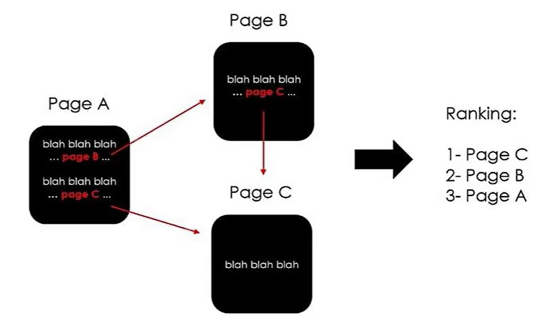
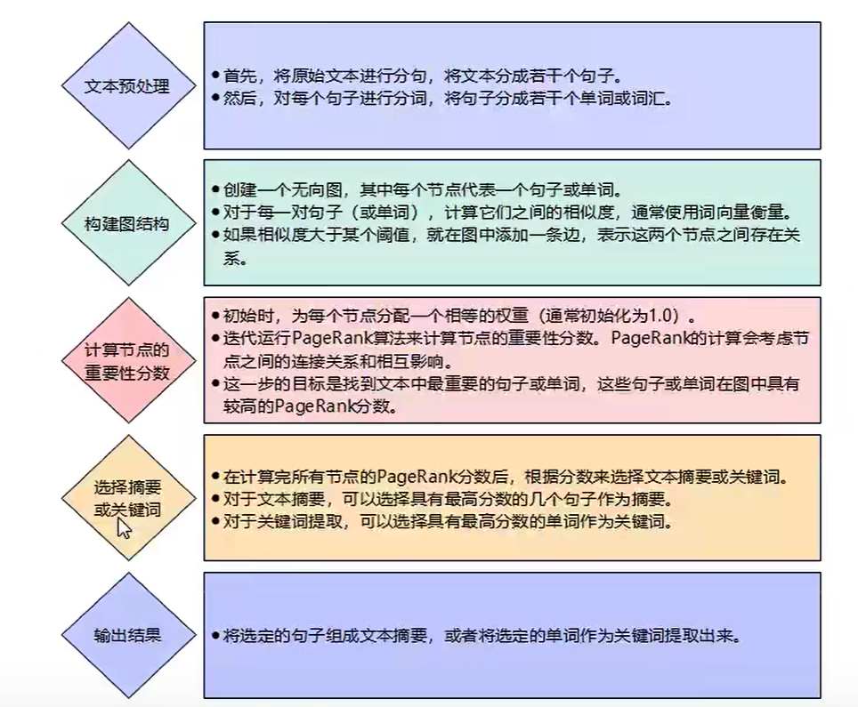

## 文本摘要

### 定义

文本摘要是通过技术手段对文本或文本集合进行**信息压缩**，提炼关键信息以概括原始文本主要内容的技术。作为文本生成任务的核心方向，其本质是解决信息爆炸时代的**高效信息获取问题**，核心挑战是从冗余、非结构化长文本中生成精简通顺的摘要。


### 分类

1. 按输入文本类型划分

   - **单文档文本摘要**：对单篇文本进行摘要（如单篇新闻、论文）。

   - **多文档文本摘要**：对多篇主题相关文本进行整合摘要（如多篇同事件新闻报道）。

2. 按技术方案划分

   - **抽取式摘要**：直接从原文中抽取关键句子、短语或词语组成摘要。

   - **生成式摘要**：通过自然语言生成技术，重新组织语言生成摘要。


### 抽取式摘要

**定义**

直接从原文中抽取预设单元（通常为句子）组成摘要，核心假设是“文档核心思想可由其中关键句概括”。

**优点**

- **语法错误率低**：直接使用原文句子，天然保证语法和句法正确性。

**缺点**

1. **冗余性**：抽取出的句子可能包含重复信息。
2. **重要性筛选问题**：可能包含非关键信息，或遗漏核心内容。
3. **连贯性差**：句子间衔接生硬，缺乏自然过渡。


### 生成式摘要

**定义**

生成式摘要是通过**理解原文语义**生成摘要的技术，模仿人类写作方式，既可用原文词汇，也可创造新词（未在原文中出现的表达）。


**优点**

- **核心优势**：用词灵活，能重构信息（如合并短句、简化表达），突破原文句子边界。
- **示例**：
  原文：*“诺兰于2010年导演了《盗梦空间》，由莱昂纳多主演。”*
  生成式摘要：*“莱昂纳多主演了《盗梦空间》。”*（自动省略导演信息，突出核心人物）


**缺点**

1. **易重复：**解码算法缺陷可能导致模型在连续时间内生成重复内容（如反复输出同一短语）。

2. **事实性错误：**可能生成与原文语义冲突的内容，例如：

   - 混淆主体（如将“导演”误写为“主演”）；

   - 编造未提及的信息（如虚构上映时间）。

3. **OOV问题：**生成过程中遇到**未登录词（Out-of-Vocabulary, 词表中不存在的词）**，模型用`UNK`（Unknown）替代，影响摘要可读性。


### 抽取式 vs 生成式

| 维度         | 抽取式摘要                       | 生成式摘要                       |
| ------------ | -------------------------------- | -------------------------------- |
| **技术本质** | 从原文抽取关键句/短语            | 理解语义后重新生成文本           |
| **优点**     | 语法正确、事实准确（无新增信息） | 表达灵活、信息密度高、可读性强   |
| **缺点**     | 冗余度高、连贯性差               | 易产生事实错误、训练成本高       |
| **比喻**     | “按部就班的老实人”（稳定但死板） | “逍遥的江湖侠客”（灵活但易失控） |


### 生成式摘要的主流模型

- **Seq2Seq**：基于编码器-解码器架构，适用于单文档摘要。
- **BERT**：预训练语言模型，通过微调实现摘要生成，提升语义理解能力。
- **GPT**：自回归生成模型，擅长长文本连贯生成，适合多轮摘要任务。


### 总结

生成式摘要是文本摘要的高级形态，通过深度学习模型实现“理解-重构”式压缩，虽在灵活性上优于抽取式，但需解决事实性和稳定性问题。实际应用中常结合两种方案（如抽取式过滤核心句+生成式重写），平衡准确性与可读性。


## PageRank

### 概述

PageRank 是 Google 创始人于 1997 年构建早期的搜索系统原型时提出的链接分析算法，是 Google 用于用来标识网页的等级 / 重要性的一种方法，是 Google 用来衡量一个网站的好坏的唯一标准。例如：一个 PR 值为 1 的网站表明这个网站不太具有流行度，而 PR 值为 7 到 10 则表明这个网站非常受欢迎（或者说极其重要）。一般 PR 值达到 4，就算是一个不错的网站了。



从上面的途中可以看到，C页面被引用两次，B页面被引用一次，A页面未被引用。所以C页面的排序优先级是最高的。

PageRank 算法计算每一个网页的 PageRank 值，然后根据这个值的大小对网页的重要性进行排序。它的思想是模拟一个悠闲的上网者，上网者首先随机选择一个网页打开，然后在这个网页上呆了几分钟后，跳转到该网页所指向的链接，这样无所事事、漫无目的地在网页上跳来跳去，PageRank 就是估计这个悠闲的上网者分布在各个网页上的概率。

**PageRank 背后的两个基本假设：**

- 数量假设：更重要的网页更可能被更多的网页链接到。
- 质量假设：有更高的 PageRank 的网页将会传递更高的权重。


### 算法

通过下面一个例子来理解算法的基本逻辑。


网页和网页之间的连接关系组成一个有向图，其中网页是节点，网页之间的连接为有向边。如上图所示的连接关系，就可以使用如下表格来表示：

| To\From | A    | B    | C    | D    |
| ------- | ---- | ---- | ---- | ---- |
| A       | 0    | 1/2  | 1    | 0    |
| B       | 1/3  | 0    | 0    | 1/2  |
| C       | 1/3  | 0    | 0    | 1/2  |
| D       | 1/3  | 1/2  | 0    | 0    |

从上面的表格可以看到，网页跳转到自己的权重为0，网页引用的其他网页权重是均分的。基于此，我们可以先得到一个转移矩阵（Transaction Matrix）：
$$
M = \begin{bmatrix}
0 & {1/2} & 1 & 0 \\
1/3 & 0 & 0 & 1/2 \\
1/3 & 0 & 0 &1/2 \\
1/3 & 1/2 & 0 & 0
\end{bmatrix}
$$
有了上面的转移矩阵，我们从两个角度来思考： 

1. 一个网页 X 如果有许多网页指向他，那么转移矩阵的 X 行就会有许多的非零元素，转移之后这个网页就会获得更大的 PageRank，这刚好和我们上文提到的数量假设相对应。
2. 假设 X 网页具有很高的重要性，那么 X 所转移到的那些网页将会由于 X 的高重要性而获得相对更高的重要性，这刚好和我们上文提到的质量假设相对应。

那么，怎样表示一个网页的重要性呢？我们使用 PageRank Matrix 来表示。先根据上述的有向图设定一个初始矩阵： 
$$
PR0 = \begin{bmatrix}
1/4 \\
1/4 \\
1/4 \\
1/4
\end{bmatrix}
$$
矩阵中从上到下分别表示A、B、C、D四个网页的初始PR值，之所以初始矩阵的 PR 值均为 1/4，是因为一个无聊的人上网，刚开始想要来打开一个网页，那么他打开这一堆网页中的任何一个在最开始都是相同概率的。

接下来使用转移矩阵与初始矩阵进行矩阵运算：
$$
PR1 = M * PR0 = \begin{bmatrix}
9/24 \\
5/24 \\
5/24 \\
5/24
\end{bmatrix}
$$
经过这样一轮计算后，可以看出网页A的PR只是最高的。同理，我们还可以继续使用 转移矩阵 和 PR1 继续计算PR2，不断重复迭代过程，直到 PR(k+1) 与 PR(k) 的差值小于预设阈值（如 10^−6），此时的 PageRank 向量即为收敛结果。

我们这里进行的是无阻尼迭代，若引入阻尼因子（默认是0.85），计算会更符合实际上网者的行为（有一定概率随机跳转，避免 “死端” 和 “循环” 问题），最终各网页的 PageRank 值会更合理地反映其重要性，PageRank 值高的网页在排序中更靠前。


### 代码实现

PageRank算法我们需要借助一个名叫NetWorkX的三方库来实现。

```shell
pip install -i https://pypi.tuna.tsinghua.edu.cn/simple/ networkx
```

下面给个示例：

```python
import networkx as nx

# 创建有向图
G = nx.DiGraph()

# 有向图之间边的关系
edges = [("A", "B"), ("A", "C"), ("A", "D"), ("B", "A"), ("B", "D"), ("C", "A"), ("D", "B"), ("D", "C")]
for edge in edges:
    G.add_edge(edge[0], edge[1])

# alpha 就是阻尼系数，取值范围为0到1之间
pagerank_list = nx.pagerank(G, alpha=0.85)
print(pagerank_list)
"""
{'A': 0.3245609358176832, 'B': 0.2251463547274389, 'C': 0.2251463547274389, 'D': 0.2251463547274389}
"""
```

这个有向图和前面的算法示例是一样的，最终最高的PR值得网页是A。


## TextRank

TextRank 算法是一种用于文本摘要和关键词提取的基于图的算法，它借鉴了 PageRank 算法的思想，用于自动提取文本中重要的句子或关键词。每个句子或词语都被表示为图中的一个节点。通常，可以使用词向量（Word Embeddings）来表示词语，这些词向量可以通过预训练的词嵌入模型（如 Word2Vec 或 GloVe）获取。对于句子，可以使用句向量来表示，通常是将句子中所有词语的词向量进行平均或加权平均。

接下来，需要确定节点之间的关系，即边。通常使用某种相似度度量来计算节点之间的相似性，例如余弦相似度。节点之间的相似度可以根据节点的词向量或其他特征来计算。如果相似度超过一个预定的阈值，则在两个节点之间建立一条边。

一旦构建了图，就可以使用类似 PageRank 的算法来计算每个节点（句子或词语）的重要性分数。TextRank 算法使用迭代的方式计算这些分数，直到收敛为止。

一旦计算出每个节点的重要性分数，就可以根据这些分数来选择最重要的句子或词语作为文本摘要或关键词。通常，可以根据分数排名来选择前 N 个句子或词语。



重要性分数的计算通过多轮迭代进行，每一轮都根据与其相连的节点的重要性来更新节点自身的重要性分数。更新公式如下：
$$
Score(A)=(1-d)+d*\sum{Score(B)/OutDegree(B)}
\\
B是与节点A相连接的其中一个节点,Score(B)则是节点B的重要性分数
\\
d是阻尼因子，介于0~1之间，用于平衡迭代过程中的随机浏览和节点之间的相互连接
\\
OutDegree(B)表示节点B的出度，就是与节点B相连接的边的数量
$$


### 关键句提取

```python
import jieba
import networkx as nx
import matplotlib.pyplot as plt

from sklearn.feature_extraction.text import TfidfVectorizer


def load_stop_words():
    with open(r"./data/stopwords.txt", "r", encoding="utf8") as f:
        lines = f.readlines()

    stop_words = set()
    for line in lines:
        stop_words.add(line.strip())

    return list(stop_words)


def extract_sentences(text, top=5):
    # 将文本分成句子，并去除空句子
    text = text.replace("。", "，")
    sentences = [sentence for sentence in text.split("，") if sentence]

    # 创建向量模型
    vectorizer = TfidfVectorizer(tokenizer=jieba.cut, stop_words=load_stop_words())
    # 训练结果矩阵
    tfidf_matrix = vectorizer.fit_transform(sentences)

    # 构建图
    graph = nx.from_scipy_sparse_array(tfidf_matrix * tfidf_matrix.T)

    # pagerank 重要性评分
    scores = nx.pagerank(graph)

    # 评分的索引就是句子的索引
    tops = sorted(scores.items(), key=lambda x: x[1], reverse=True)[:top]
    top_sentences = {score: sentences[idx] for idx, score in tops}
    print(top_sentences)
    """
    {0.06255761820126685: '即世界一流大学和一流学科', 
    0.061826090088680126: '双一流”建设与以往的“211工程”和“985工程”既存在联系', 
    0.05645534609257605: '重点支持部分高校创建世界一流大学和高水平大学', 
    0.05553994176036382: '推动一批高水平大学和学科进入世界一流行列或前列', 
    0.05550495271785693: '“211工程”于1995年正式启动'}
    """

    # 画图
    edges = nx.get_edge_attributes(graph, "weight")
    edges = {(u, v): round(w, 3) for (u, v), w in edges.items()}
    pos = nx.spring_layout(graph)  # 弹簧布局算法获取句子的位置

    nx.draw(graph, pos, with_labels=True, node_size=300, node_color="tomato", font_size=12, font_weight="bold")
    nx.draw_networkx_edge_labels(graph, pos, edge_labels=edges, alpha=0.5)  # 标记边的权重
    plt.show()


if __name__ == '__main__':
    text = ("“双一流”，即世界一流大学和一流学科，是中共中央、国务院于2015年作出的重大战略决策，"
            "也是我国高等教育领域继“211工程”“985工程”之后的又一国家战略。"
            "该政策旨在提升中国高等教育综合实力和国际竞争力，"
            "推动一批高水平大学和学科进入世界一流行列或前列，"
            "为实现“两个一百年”奋斗目标和中华民族伟大复兴的中国梦提供有力支撑。"
            "双一流”建设与以往的“211工程”和“985工程”既存在联系，又有着明显区别。"
            "“211工程”于1995年正式启动，旨在面向21世纪，重点建设100所左右的高等学校和一批重点学科，共计116所高校入选，"
            "侧重于提升高校整体实力，促进高等教育均衡发展。"
            "“985工程”于1999年正式启动，目标是形成一批达到国际先进水平的学科，"
            "重点支持部分高校创建世界一流大学和高水平大学，共有39所高校入选，更强调冲击世界一流大学的目标。")
    
    extract_sentences(text)
```

绘制的网络图如下：


### 关键词提取

可以提取句子，同样就可以提取词语，此处引入一个新的库`textrank4zh`。

```python
import jieba

from textrank4zh import TextRank4Keyword


def load_stop_words():
    with open(r"./data/stopwords.txt", "r", encoding="utf8") as f:
        lines = f.readlines()

    stop_words = set()
    for line in lines:
        stop_words.add(line.strip())

    return list(stop_words)

def extract_words(text, top=5):
    # 基于文本进行分词，并去除停用词
    stop_words = load_stop_words()
    all_words = jieba.lcut(text)
    words = [word for word in all_words if word not in stop_words]
    
    # 分析词语
    tr4z = TextRank4Keyword()
    tr4z.analyze(text=" ".join(words), lower=True, window=10)
    keywords = tr4z.get_keywords(top, word_min_len=2)
    print(keywords)
    """
    [{'word': '工程', 'weight': 0.0349662138792166}, 
    {'word': '一流', 'weight': 0.028255201897967843}, 
    {'word': '学科', 'weight': 0.027448694072093237}, 
    {'word': '高等教育', 'weight': 0.02720430434330949}, 
    {'word': '世界', 'weight': 0.02671875352608742}]
    """


if __name__ == '__main__':
    text = ("“双一流”，即世界一流大学和一流学科，是中共中央、国务院于2015年作出的重大战略决策，"
            "也是我国高等教育领域继“211工程”“985工程”之后的又一国家战略。"
            "该政策旨在提升中国高等教育综合实力和国际竞争力，"
            "推动一批高水平大学和学科进入世界一流行列或前列，"
            "为实现“两个一百年”奋斗目标和中华民族伟大复兴的中国梦提供有力支撑。"
            "双一流”建设与以往的“211工程”和“985工程”既存在联系，又有着明显区别。"
            "“211工程”于1995年正式启动，旨在面向21世纪，重点建设100所左右的高等学校和一批重点学科，共计116所高校入选，"
            "侧重于提升高校整体实力，促进高等教育均衡发展。"
            "“985工程”于1999年正式启动，目标是形成一批达到国际先进水平的学科，"
            "重点支持部分高校创建世界一流大学和高水平大学，共有39所高校入选，更强调冲击世界一流大学的目标。")
    
    extract_words(text)
```


## TF-IDF

TF-IDF（Term Frequency-Inverse Document Frequency）是自然语言处理（NLP）中用于 **评估词语在文本中重要性** 的经典加权算法，广泛应用于文本分类、关键词提取、搜索引擎排序等场景。

### 原理

TF-IDF 的核心思想：
**一个词语的重要性 = 词在单篇文档中的频率（TF） × 词在语料库中的稀缺性（IDF）**

- **高频词但普遍存在**（如“的”“是”）：TF 高但 IDF 低，TF-IDF 低 → 重要性低。
- **低频词但稀缺**（如专业术语“Transformer”）：TF 中等但 IDF 高，TF-IDF 高 → 重要性高。


### 公式

#### TF（词频，Term Frequency）

某词在 **单篇文档** 中出现的频率：
$$
TF(t,d)=\frac{该词在文档d中出现的次数}{文档d中词的总数}
$$
**示例**：文档“苹果发布新手机”中，“苹果”出现1次，总词数5 → TF=1/5=0.2。


#### IDF（逆文档频率，Inverse Document Frequency）

某词在 **整个语料库** 中的稀缺性（含该词的文档越少，IDF 越高）：
$$
IDF(t,D)=log\frac{语料库总文档数}{包含词t的文档数+1}
$$
**+1 目的**：避免分母为0（无文档包含该词时）。

**示例**：若语料库有1000篇文档，仅10篇含“苹果” → IDF=log(1000/(10+1))≈2.29。


#### TF-IDF 综合权重

$$
TF-IDF(t,d,D)=TF(t,d)*IDF(t,D)
$$

**示例**：上述“苹果”的 TF-IDF=0.2 × 2.29≈0.458，远高于高频停用词（如“的”的 TF-IDF≈0）。


### 应用场景

1. **关键词提取**：TF-IDF 值最高的词即为文档核心主题词（如论文关键词）。
2. **文本分类**：将 TF-IDF 向量作为特征输入分类模型（如 SVM、朴素贝叶斯）。
3. **搜索引擎**：按 TF-IDF 权重排序搜索结果（如 Google 早期排序算法）。


### 代码实现

此处基于中文文本做一下基础用法的演示。

```python
import jieba
import numpy as np

from sklearn.feature_extraction.text import TfidfVectorizer


def load_stop_words():
    with open(r"./data/stopwords.txt", "r", encoding="utf8") as f:
        lines = f.readlines()

    stop_words = set()
    for line in lines:
        stop_words.add(line.strip())

    return list(stop_words)


# 语料库
corpus = ["苹果发布新手机", "苹果是水果", "华为发布新电脑", "人工智能改变世界"]

# 计算TF-IDF矩阵
# token_pattern 表示匹配的词至少有两个字，这里是默认配置，我们可以根据实际情况修改
tfidf = TfidfVectorizer(tokenizer=jieba.cut, stop_words=load_stop_words(), token_pattern=r"(?u)\b\w\w+\b")
matrix = tfidf.fit_transform(corpus)

# 输出关键词列表
all_words = tfidf.get_feature_names_out()
print(all_words)
"""
['世界' '人工智能' '华为' '发布' '改变' '新' '新手机' '水果' '电脑' '苹果']
"""

print(matrix.toarray())
"""
[[0.    0.    0.    0.52640543 0.    0.   0.66767854 0.    0.    0.52640543]  # 文档1：发布、新手机、苹果 权重最高
 [0.    0.    0.    0.    0.    0.   0.    0.78528828 0.    0.619130]  # 文档2：水果、苹果 权重高
 [0.    0.    0.52547275 0.41428875 0.    0.52547275   0.    0.    0.52547275 0.]
 [0.57735027 0.57735027 0.    0.    0.57735027 0.   0.    0.    0.    0.]]
"""

# 打印每个文本最重要的词
index = np.argmax(matrix.toarray(), axis=1)
words = [all_words[idx] for idx in index]
print(words)
"""
['新手机', '水果', '华为', '世界']
"""
```
