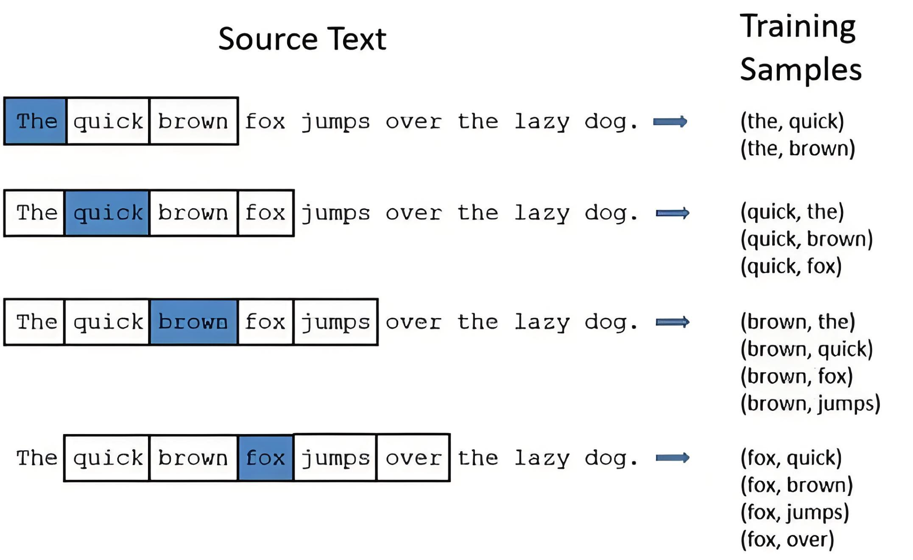
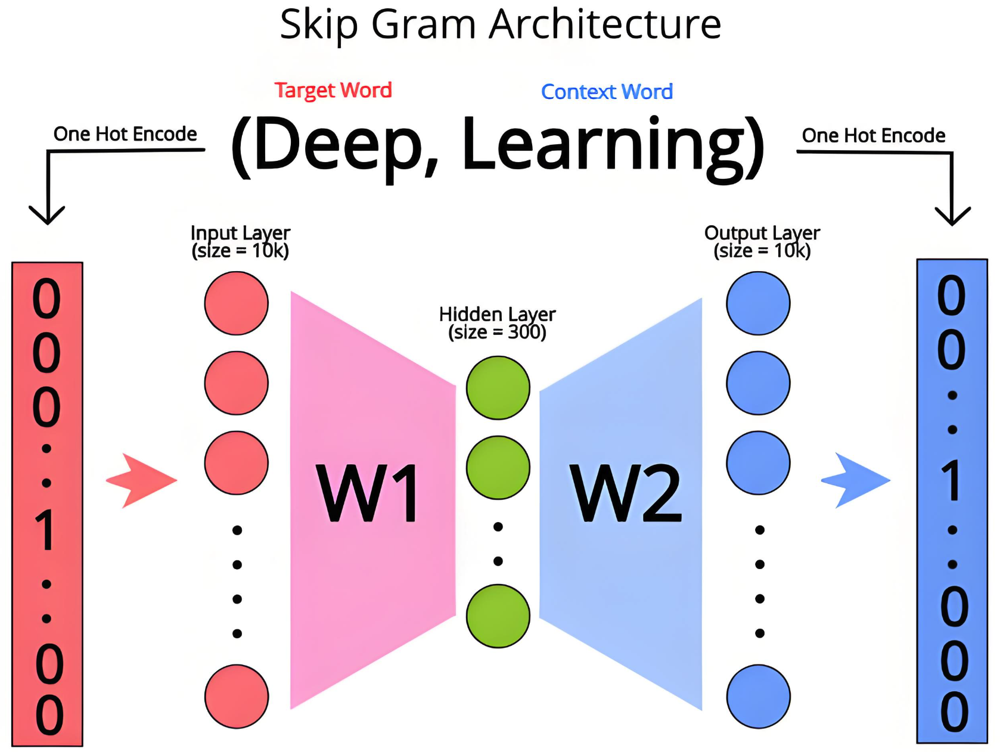
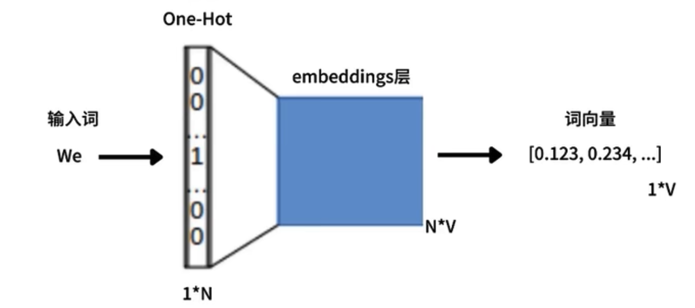

## word2vec

Word2Vec 词向量训练是通过浅层神经网络学习词语上下文关系，生成低维稠密向量的过程。所以这里还要再次明确一个点，最终生成的词向量其实是表征当前词和其他词的关系。同时训练词向量也并不是直接基于句子/词语本身去训练的，因为计算机能处理的只能是数值。

下面使用已经封装好的Word2Vec来完成一次训练和使用演示：

```python
import os
import jieba
import kagglehub

from gensim.models import Word2Vec


def load_stop_words():
    with open(r"./data/stopwords.txt", "r", encoding="utf8") as f:
        lines = f.readlines()

    stop_words = set()
    for line in lines:
        stop_words.add(line.strip())

    return list(stop_words)


stop_words = load_stop_words()


def preprocessing(sentence):
    words = jieba.lcut(sentence)
    words = [word for word in words if word not in stop_words]
    return words


sentences = [
    "自然语言处理是人工智能的核心分支之一",
    "Word2Vec能将词语转化为低维稠密向量",
    "词向量可用于计算词语间的语义相似度",
    "机器学习算法是训练词向量的基础工具",
    "上下文窗口大小影响Word2Vec的训练效果",
    "深度学习通过神经网络提升语言模型性能",
    "高质量语料对词向量质量起决定性作用",
    "预训练模型可通过微调适应特定任务需求",
    "句子相似度计算是NLP的基础应用场景",
    "语义分析帮助计算机理解文本深层含义"
]

# 将句子分词处理
sentences = [preprocessing(sentence) for sentence in sentences]

# 训练并保存w2v模型
model = Word2Vec(
    sentences=sentences,  # 预处理后的句子列表
    vector_size=20,  # 词向量的纬度
    window=5,  # 上下文窗口大小（5-10）
    min_count=1,  # 最小词频，过滤低频词汇，此处配置表示只出现过一次的词不参与训练
    negative=1,  # 启用负采样，通过采样少量负例（非上下文词）来优化目标函数，大幅降低计算成本
    hs=0,  # 禁用层级 Softmax。为 1 时表示启动层级softmax，此时negative需等于0
    sample=1e-4,  # 高频词进行随机下采样，降低高频词（如“的”“是”）的训练次数，避免其过度影响词向量
    sg=1,  # 模型选择：1=Skip-gram，0=CBOW
    workers=4,  # 并行训练线程数
    epochs=50  # 训练轮次
)
model.save("./models/w2v.model")
```

训练好之后，就可以加载向量模型来使用了：

```python
from gensim.models import Word2Vec

model = Word2Vec.load("./models/w2v.model")

# 获取词向量
vec1 = model.wv["自然语言"]
vec2 = model.wv.get_vector("算法")
print(vec1)
print(vec2)
"""
[-0.04190465 -0.00655975  0.00910743  0.03708575 -0.00981465 -0.01162403
  0.04742812  0.0003986  -0.01202788  0.04301986  0.01343568 -0.02672119
  0.03293636  0.02255135 -0.03527531 -0.00162397  0.00417157  0.02872966
 -0.00859619 -0.01404388]
[-0.02796707  0.00865709 -0.00448498  0.03396704  0.01986833  0.02265017
  0.00717308 -0.0134957  -0.02183582 -0.00515787  0.00718594 -0.01322451
 -0.0353674  -0.03903211 -0.04560293 -0.02968244 -0.00923534 -0.02161544
 -0.03231437 -0.01857764]
"""

# 查找相相似词
similar_words = model.wv.most_similar("人工智能", topn=3)
print("相似词:", similar_words)
"""
相似词: [('自然语言', 0.4403064250946045), ('适应', 0.40050211548805237), ('窗口', 0.3726695477962494)]
"""

# 获取两个词的相似度
similar = model.wv.similarity("算法", "人工智能")
print(similar)  # 0.13748376
```


## Skip-Gram

在Word2Vec中，可以使用两种算法，分别是 Skip-Gram 和 CBOW。Skip-Gram的核心思想是 **通过中心词预测上下文**，而CBOW则是**通过上下文来预测中心词**，二者主要差异如下：

| 模型          | 输入         | 输出         | 速度 | 低频词效果 | 适用场景                 |
| ------------- | ------------ | ------------ | ---- | ---------- | ------------------------ |
| **Skip-gram** | 中心词       | 多个上下文词 | 较慢 | 好         | 小语料库、低频词多的场景 |
| **CBOW**      | 多个上下文词 | 单个中心词   | 较快 | 一般       | 大语料库、高频词多的场景 |


### 算法逻辑

Skip-Gram算法是在给出目标单词（中心词）的情况下，预测它的上下文词（初中心词外的窗口内的其他单词），下图的窗口大小（window_size）是2，也就是左右各两个单词。


在上图中，给出了中心词Love，其实就是求Do、you、deep、learning出现的概率，可以用形如：P(Do|Love) 来表示。



在Skip-Gram模型的迭代过程中，会调整词向量，使得目标词的词向量与其上下文的词向量在向量空间中尽可能的接近。Skip-Gram采用浅层神经网络，其网络层仅有一层隐藏层：




### 代码实现

#### 语料库处理

现在准备了一个例句："a small red cat runs under the big tree"，为了能够实现skip-gram的算法，我们需要先进行一些预处理，构建出一个可以用于神经网络训练的数据集：

1. 讲英文单词全部转换为小写并进行分词，此处直接按空格拆分即可
2. 构建一个单词与索引相互映射的字典，便于使用索引下表来构建skip-gram的目标词和上下文
3. 构建类似于 (0, 1),(0, 2),(1, 0),(1, 2) 这样的数据集，数据对中第一项代表目标单词(X)的索引，第二项代表前后窗口的上下文单词(Y)，因为训练的目的就是要根据X推导出相关联上下文窗口的Y，也就是一个X可以推导出1～4个Y。**在词向量训练中，X和Y均作为模型的输入**

先按照上面的流程，对语料库进行处理：

```python
# 窗口大小此处使用2
def preprocess(sentence: str, window_size: int = 2):
    words = sentence.split()

    # 推导一个单词和其索引位置的字典
    word_index = {word: idx for idx, word in enumerate(words)}

    # 我们为每个目标词构建窗口中的上下文词的映射关系
    maps = []

    for idx, word in enumerate(words):
        for neighbor in words[max(idx - window_size, 0): min(len(words), idx + window_size + 1)]:
            if neighbor != word:
                maps.append((word_index[word], word_index[neighbor]))

    return maps


sentence = "a small red cat runs under the big tree"
print(preprocess(sentence))
"""
[(0, 1), (0, 2), (1, 0), (1, 2), (1, 3), (2, 0), (2, 1), (2, 3), (2, 4), (3, 1), (3, 2), (3, 4), (3, 5), (4, 2), (4, 3),
 (4, 5), (4, 6), (5, 3), (5, 4), (5, 6), (5, 7), (6, 4), (6, 5), (6, 7), (6, 8), (7, 5), (7, 6), (7, 8), (8, 6), (8, 7)]
"""
```


#### 构建并训练模型

词向量模型的训练，主要目的是为每个词训练一个N维向量，并且通过向量之间的余弦相似度计算，在Skip-Gram的窗口大小内的词之间的距离更近，相似度也越高，距离越远的词相似度越低。只要达成这个目标，说明词向量的训练是成功的，否则就还需要进一步优化。所以，训练词向量不需要像常规的神经网络一样去拆分训练集和测试集，也不需要准确度的评价指标。

在各类神经网络框架（keras、Pytoych、Paddle）中，都有一个网络层叫**Embeding**，该网络层专门用于训练词向量。该层主要提供两个必选参数，第一个是输入词汇表的形状，第二个则是输出词向量的维度。由于该网络层的存在，针对词汇表的索引，也不需要进行独热编码，Embedding层会自行处理。



这里我们继续使用keras库来训练：

```python
import numpy as np

from keras.layers import Input, Embedding, Reshape, Dot
from keras.models import Model
from keras import losses, optimizers


# 窗口大小此处使用2
def preprocess(sentence: str, window_size: int = 2):
    words = sentence.split()

    # 推导一个单词和其索引位置的字典
    word_index = {word: idx for idx, word in enumerate(words)}

    # 我们为每个目标词构建窗口中的上下文词的映射关系
    maps = []

    for idx, word in enumerate(words):
        for neighbor in words[max(idx - window_size, 0): min(len(words), idx + window_size + 1)]:
            if neighbor != word:
                maps.append((word_index[word], word_index[neighbor]))

    return word_index, maps


def train():
    # 定义目标词和上下文词的输入层，都是一维数组
    input_target = Input((1,))
    input_context = Input((1,))

    # 预处理
    word_index, maps = preprocess("a small red cat runs under the big tree")

    # 定义Embedding
    # input_dim 需要生成向量的词的数量
    # output_dim 输出的数据维度，此处输出的词向量为50维
    # name 就是单纯为当前隐藏层取个名字，后面可以通名字获取对应的layer
    embedding = Embedding(input_dim=len(word_index), output_dim=50, name="embedding")

    # 嵌入目标词和上下文词。因为中心词和上下文词的输入形状一样，所以此处都将得到一个 (None, 1, 50) 的张量
    target = embedding(input_target)
    context = embedding(input_context)

    # 点积层。用于计算点积，进而计算损失，并实现距离越近相似度越高的特性
    # 点击运算后，(None, 1, 50) 的两个张量将得到一个 (None, 1, 1) 的张量
    # axes 就表示在第二维上进行运算，第二维上的数据就是一个50维的列表，点积后得到一个常量 （注意区分数组的维度和张量的维度）
    dot = Dot(axes=2)([target, context])
    output = Reshape((1,))(dot)

    # 模型
    model = Model(inputs=[input_target, input_context], outputs=output)
    model.compile(loss=losses.binary_crossentropy, optimizer=optimizers.Adam())

    # 训练
    data = np.array(maps)
    targets = data[:, 0]  # 二维数组的第一列和第二列分别就是中心词和上下文词的索引
    contexts = data[:, 1]
    labels = np.ones((len(data), ))  # 因为要进行损失计算，所以还是需要标签。此处全是正样例，所以标签默认都给1

    model.fit([targets, contexts], labels, epochs=30, batch_size=2)

    # 获取每个词对应的词向量
    vectors = model.get_layer("embedding").get_weights()[0]
    word2vec = {}
    for word, idx in word_index.items():
        word2vec[word] = vectors[idx]

    return word2vec
```

得到每个词的词向量之后，我们就可以来看下距离相近和距离较远的词的相似度：

```python
if __name__ == '__main__':
    from sklearn.metrics.pairwise import cosine_similarity

    w2v = train()

    # 计算相似度
    # 距离近的词
    s1 = cosine_similarity(X=[w2v["small"]], Y=[w2v["cat"]])
    s2 = cosine_similarity(X=[w2v["big"]], Y=[w2v["tree"]])
    print(s1, s2)  # [[0.5561846]] [[0.77468663]]

    # 距离远的
    s3 = cosine_similarity(X=[w2v["red"]], Y=[w2v["tree"]])
    s4 = cosine_similarity(X=[w2v["small"]], Y=[w2v["big"]])
    print(s3, s4)  # [[0.15191124]] [[-0.30379084]]
```

从结果可以看出，我们自己训练得到的词向量基本是符合预期中，如果余弦相似度为负数，可以理解为毫不相干。


#### 负采样优化

在前面准备的训练数据中，我们只把中心词窗口内的索引和中心词索引做了映射，也就是正样本。但仅有正样本的训练集明显是不合理的，下面我们来准备一些同等数量的负样本数据，我们改造一下数据预处理的函数：

```python
# 窗口大小此处使用2
def preprocess(sentence: str, window_size: int = 2):
    words = sentence.split()

    # 推导一个单词和其索引位置的字典
    word_index = {word: idx for idx, word in enumerate(words)}

    # 我们为每个目标词构建窗口中的上下文词的映射关系
    maps = []
    for idx, word in enumerate(words):
        for neighbor in words[max(idx - window_size, 0): min(len(words), idx + window_size + 1)]:
            if neighbor != word:
                maps.append((word_index[word], word_index[neighbor]))

    # 到这里正样本准备完成，准备正样本相同数量的副样本
    count = len(maps)
    max_index = len(word_index) - 1
    negative = []
    while len(negative) < count:
        # 从正样本中随机取一个映射，拿到中心词的索引，再生成一个不在窗口内的随机索引，来组成一个副样本
        center = random.choice(maps)[0]
        cxt = random.randint(0, max_index)

        # 不能跟自己组合
        if center == cxt:
            continue

        pair = (center, cxt)

        # 这里既要去掉正样本，负样本也不能重复，也不能跟自己组合
        if pair not in maps and pair not in negative:
            negative.append(pair)

    return word_index, maps + negative
```

返回的映射数据中后面一半是负样本，那么我们的标签数据也要做修改：

```python
    # 训练的标签，前面一半是正样本，后面一半是负样本
    labels = np.append(np.ones((len(data) // 2, 1)), np.zeros((len(data) // 2, 1)))
```

经过负样本优化之后，我们经过多次训练并计算的相似度，表现得会更稳定。


### 大数据量的词向量训练

前面我们仅使用一句文本来进行演示，真实训练时树立处理需要考虑的问题会更多一些。

1. 文本中的停用词要去掉
2. 文本中必然有重复的词，所以不同位置相同的词的索引需要保持相同

基于此准备了一个`Alice_in_Wonderland.txt`文档来作为演示，仍然是英文文档，直接按每个单词拆分就可以了，不用像中文那样分词，我们主要优化的是数据处理的方法：

```python
import re
import json
import random

import numpy as np

from collections import Counter
from keras.layers import Input, Embedding, Reshape, Dot
from keras.models import Model
from keras import losses, optimizers


def preprocess(file_path: str, window_size: int = 2):
    with open(file_path) as f:
        lines = f.readlines()

    # 仅保留英文词汇，清除其他符号
    lines = [re.sub(r"[^\w\s]", " ", line) for line in lines if line]

    # 单词列表
    word_list = []
    for line in lines:
        words = [word.lower() for word in line.split() if word]
        word_list.extend(words)

    counter = Counter(word_list)
    word_index = {word: idx for idx, word in enumerate(counter.keys())}

    word_count = len(word_list)
    maps = []
    for idx, word in enumerate(word_list):
        for neighbor in word_list[max(idx - window_size, 0): min(word_count, idx + window_size + 1)]:
            if neighbor != word:
                maps.append((word_index[word], word_index[neighbor]))

    # 到这里正样本准备完成，准备正样本相同数量的副样本
    count = len(maps)
    max_index = len(word_index) - 1
    negative = []
    while len(negative) < count:
        center = random.choice(maps)[0]
        cxt = random.randint(0, max_index)

        if center == cxt:
            continue

        pair = (center, cxt)

        if pair not in maps and pair not in negative:
            negative.append(pair)

    return word_index, maps + negative


def train():
    input_target = Input((1,))
    input_context = Input((1,))

    # 预处理
    word_index, maps = preprocess("./data/Alice_in_Wonderland.txt")

    embedding = Embedding(input_dim=len(word_index), output_dim=50, name="embedding")
    target = embedding(input_target)
    context = embedding(input_context)

    dot = Dot(axes=2)([target, context])
    output = Reshape((1,))(dot)
    model = Model(inputs=[input_target, input_context], outputs=output)
    # 加上精度指标，训练过程中可以看到精度逐渐提升，损失逐渐降低
    model.compile(loss=losses.binary_crossentropy, optimizer=optimizers.Adam(), metrics=["acc"])

    data = np.array(maps)
    targets = data[:, 0]
    contexts = data[:, 1]

    labels = np.append(np.ones((len(data) // 2, 1)), np.zeros((len(data) // 2, 1)))

    # 现在数据量打了，把训练轮次和每个批次的样本数量都调大一些
    model.fit([targets, contexts], labels, epochs=50, batch_size=50)

    # 保存模型
    model.save("./data/alice.keras")

    # 把word2index映射关系也保存为json，便于后续验证使用
    with open("./data/word2index.json", "w") as f:
        json.dump(word_index, f)
```

通过运行上面的train方法，我们将得到一个模型文件，一个词索引的映射文件。下面来加载一下模型，计算一下不同距离的单词的余弦相似度：

```python
if __name__ == '__main__':
    from keras.src.saving import load_model
    from sklearn.metrics.pairwise import cosine_similarity

    # 加载模型
    model = load_model("./data/alice.keras")

    # 加载词索引映射
    with open("./data/word2index.json", "r") as f:
        word_index = json.load(f)

    # 获取每个词对应的词向量
    vectors = model.get_layer("embedding").get_weights()[0]
    w2v = {}
    for word, idx in word_index.items():
        w2v[word] = vectors[idx]

    # 计算相似度
    # 距离近的词
    s1 = cosine_similarity(X=[w2v["alice"]], Y=[w2v["idea"]])
    s2 = cosine_similarity(X=[w2v["alice"]], Y=[w2v["sister"]])
    print(s1, s2)  # [[0.13856551]] [[0.2642907]]

    # 距离远的
    s3 = cosine_similarity(X=[w2v["remarkable"]], Y=[w2v["thump"]])
    s4 = cosine_similarity(X=[w2v["remarkable"]], Y=[w2v["corner"]])
    print(s3, s4)  # [[-0.3075161]] [[-0.15557836]]
```

随着数据量的增大，同一个词跟多个词都有关联关系，所以相似度不会像前面的示例那样，能达到很高的水平。


## BOW

**词袋模型（Bag-of-Words, BOW）** 作为最简单且应用广泛的文本表示方法，通过忽略语法结构和词序，仅关注词汇的出现频率来实现文本向量化。

**词袋模型**的核心思想是将文本视为一个"装词的袋子"，其中**词汇表（Vocabulary）** 是袋子中所有不重复词的集合，而**文档向量（Document Vector）** 则是每个词在文本中出现频率的数值表示。词袋模型通常用于文本分类、情感分析、信息检索等场景。


### 优缺点分析

| **优点**                         | **缺点**                                             |
| -------------------------------- | ---------------------------------------------------- |
| 实现简单，计算效率高             | 丢失词序和语法结构信息                               |
| 适合初学者理解文本向量化         | 无法捕捉语义关联（如"猫抓老鼠"与"老鼠抓猫"向量相同） |
| 对短文本（如评论、标题）表现良好 | 高维稀疏问题（词汇表过大时向量维度剧增）             |


### 文本预处理

文本预处理是将原始文本转换为标准化词序列的过程，包括**转小写、去除特殊字符和分词**。以下代码通过 `preprocess_text` 函数实现：

```python
def load_stop_words():
    with open(r"./data/stopwords.txt", "r", encoding="utf8") as f:
        lines = f.readlines()

    words = set()
    for line in lines:
        words.add(line.strip())

    return list(words)


stop_words = load_stop_words()


def preprocess_text(text):
    """文本预处理：分词并去停用词"""
    words = jieba.lcut(text)
    word_list = []
    for word in words:
        if word and word not in stop_words:
            word_list.append(word)

    return word_list
```


### 词汇表构建

**词汇表**是所有文档中出现的唯一词的集合，通过 `build_vocabulary` 函数从语料库中提取并排序：

```python
def build_vocabulary(corpus):
    """从语料库构建词汇表"""
    vocabulary = set()  # 使用集合去重
    for doc in corpus:
        words = preprocess_text(doc)
        vocabulary.update(words)  # 添加文档中的词到集合
    return sorted(vocabulary)  # 排序后返回：便于向量维度对齐
```


### 文档向量生成

文档向量的生成过程是将文本映射为词频向量，每个维度对应词汇表中词的出现次数：

```python
def train_bow_model(corpus):
    """训练 BOW 模型：生成词汇表和文档向量"""
    vocab = build_vocabulary(corpus)
    vocab_size = len(vocab)
    word_to_index = {word: i for i, word in enumerate(vocab)}  # 词到索引的映射
    
    doc_vectors = []
    for doc in corpus:
        words = preprocess_text(doc)
        vector = [0] * vocab_size  # 初始化零向量
        word_counts = defaultdict(int)
        
        # 统计词频
        for word in words:
            word_counts[word] += 1
        
        # 构建文档向量
        for word, count in word_counts.items():
            if word in word_to_index:
                vector[word_to_index[word]] = count
        
        doc_vectors.append(vector)
    
    return vocab, doc_vectors
```


### 构建文档向量

```python
if __name__ == '__main__':
    corpus = [
        "个性化学习可以从机器学习中获取经验",
        "机器学习改进教育框架，提升智能水平",
        "人工智能形成个性化教育分支",
        "人工智能技术提升教育水平，是教育改革的方向",
        "机器学习的一个方向是人工智能"
    ]

    vocab, doc_vectors = train_bow_model(corpus)
    print(vocab)
    """
    ['个性化', '中', '人工智能', '分支', '学习', '形成', '技术', '提升', '改进', '改革', '教育', '方向', '智能', '机器', '框架', '水平', '经验', '获取']
    """

    print(doc_vectors)
    """
    [[1, 1, 0, 0, 2, 0, 0, 0, 0, 0, 0, 0, 0, 1, 0, 0, 1, 1], 
    [0, 0, 0, 0, 1, 0, 0, 1, 1, 0, 1, 0, 1, 1, 1, 1, 0, 0], 
    [1, 0, 1, 1, 0, 1, 0, 0, 0, 0, 1, 0, 0, 0, 0, 0, 0, 0], 
    [0, 0, 1, 0, 0, 0, 1, 1, 0, 1, 2, 1, 0, 0, 0, 1, 0, 0], 
    [0, 0, 1, 0, 1, 0, 0, 0, 0, 0, 0, 1, 0, 1, 0, 0, 0, 0]]
    """
```

现在得到了每个文档的向量，我们还可以手写一个余弦相似度计算的方法，来计算各文档之间的相似度。

实现相似度计算方法：

```python
def cosine_similar(a: np.ndarray, b: np.ndarray):
    """
    a*b = |a|*|b|*cosθ
    """
    ab = np.dot(a, b)
    a = np.sqrt(sum(val ** 2 for val in a))
    b = np.sqrt(sum(val ** 2 for val in b))

    cosine = ab / (a * b)

    return cosine
```

计算各文档间的相似度：

```python
if __name__ == '__main__':
    corpus = [
        "个性化学习可以从机器学习中获取经验",
        "机器学习改进教育框架，提升智能水平",
        "人工智能形成个性化教育分支",
        "人工智能技术提升教育水平，是教育改革的方向",
        "机器学习的一个方向是人工智能"
    ]

    vocab, doc_vectors = train_bow_model(corpus)

    # 计算文档间的相似度
    similar = {}
    for i in range(len(corpus) - 1):
        for j in range(i + 1, len(corpus)):
            similar[(i, j)] = cosine_similar(np.array(doc_vectors[i]), np.array(doc_vectors[j]).T)

    for idx, cosine in similar.items():
        m, n = idx
        print(f"'{corpus[m]}' 和 '{corpus[n]}' 相似度为: {cosine}")
    """
    '个性化学习可以从机器学习中获取经验' 和 '机器学习改进教育框架，提升智能水平' 相似度为: 0.35355339059327373
    '个性化学习可以从机器学习中获取经验' 和 '人工智能形成个性化教育分支' 相似度为: 0.14907119849998599
    '个性化学习可以从机器学习中获取经验' 和 '人工智能技术提升教育水平，是教育改革的方向' 相似度为: 0.0
    '个性化学习可以从机器学习中获取经验' 和 '机器学习的一个方向是人工智能' 相似度为: 0.5
    '机器学习改进教育框架，提升智能水平' 和 '人工智能形成个性化教育分支' 相似度为: 0.15811388300841897
    '机器学习改进教育框架，提升智能水平' 和 '人工智能技术提升教育水平，是教育改革的方向' 相似度为: 0.4472135954999579
    '机器学习改进教育框架，提升智能水平' 和 '机器学习的一个方向是人工智能' 相似度为: 0.35355339059327373
    '人工智能形成个性化教育分支' 和 '人工智能技术提升教育水平，是教育改革的方向' 相似度为: 0.42426406871192845
    '人工智能形成个性化教育分支' 和 '机器学习的一个方向是人工智能' 相似度为: 0.22360679774997896
    '人工智能技术提升教育水平，是教育改革的方向' 和 '机器学习的一个方向是人工智能' 相似度为: 0.31622776601683794
    """
```


## CBOW

前面我们已经提到，CBOW是通过上下文预测中心词，下面我们按照Skip-Gram的思路，来完成一次训练。这里核心的点在于，上下文词和中心词的映射关系正好适合Skip-Gram是相反的。

### 基于keras

```python
import random

import numpy as np

from keras.layers import Input, Embedding, Reshape, Dot
from keras.models import Model
from keras import losses, optimizers, activations
from keras.src.layers import Dense


def preprocess(sentence: str, window_size: int = 2):
    words = sentence.split()

    # word_index 需要去重
    word_index = {word: idx for idx, word in enumerate(set(words))}

    maps = []
    for idx, word in enumerate(words):
        for neighbor in words[max(idx - window_size, 0): min(len(words), idx + window_size + 1)]:
            if neighbor != word:
                # 这里就需要把上下文词的索引放前面了
                maps.append((word_index[neighbor], word_index[word]))

    count = len(maps)
    max_index = len(word_index) - 1
    negative = []
    while len(negative) < count:
        # CBOW 中心词索引就是第1个索引处的值了
        center = random.choice(maps)[1]
        cxt = random.randint(0, max_index)

        if center == cxt:
            continue

        # 这里为止也需要交换一下
        pair = (cxt, center)

        if pair not in maps and pair not in negative:
            negative.append(pair)

    return word_index, maps + negative


def train():
    input_target = Input((1,))
    input_context = Input((1,))

    # 换一下输入文本
    word_index, maps = preprocess("a small red cat runs under the big tree and blue cat is sleeping")

    # 定义Embedding，词向量维度改成20维
    embedding = Embedding(input_dim=len(word_index), output_dim=20, name="embedding")

    # 嵌入目标词和上下文词。因为中心词和上下文词的输入形状一样，所以此处都将得到一个 (None, 1, 20) 的张量
    # 这里修改张量的形状，便于后续输出层使用sigmoid
    target = embedding(input_target)
    target = Reshape((20, ))(target)
    context = embedding(input_context)
    context = Reshape((20, ))(context)

    # 计算点积
    dot = Dot(axes=1)([target, context])

    # 输出层改用全连接层，使用sigmoid
    output = Dense(1, activation=activations.sigmoid)(dot)

    # 模型
    model = Model(inputs=[input_target, input_context], outputs=output)
    model.compile(loss=losses.binary_crossentropy, optimizer=optimizers.Adam())

    # 训练
    data = np.array(maps)
    targets = data[:, 0]
    contexts = data[:, 1]
    labels = np.append(np.ones((len(data) // 2, 1)), np.zeros((len(data) // 2, 1)))

    model.fit([targets, contexts], labels, epochs=30, batch_size=2)

    # 获取每个词对应的词向量
    vectors = model.get_layer("embedding").get_weights()[0]
    word2vec = {}
    for word, idx in word_index.items():
        word2vec[word] = vectors[idx]

    return word2vec
```

同样也可以进行相似度计算：

```python
if __name__ == '__main__':
    w2v = train()

    from sklearn.metrics.pairwise import cosine_similarity

    s1 = cosine_similarity(X=[w2v["cat"]], Y=[w2v["tree"]])
    s2 = cosine_similarity(X=[w2v["small"]], Y=[w2v["tree"]])
    print(s1, s2)  # [[0.20489413]] [[-0.03986568]]
```


### 基于Pytorch

#### 数据预处理

前面我们继续沿用了Skip-Gram的数据构造方案，但CBOW本身是基于上下文词预测中心词，是一种多对一的关系，那么我们的数据映射可以使用 `[0, 1, 3, 4] -> [2]` 的形式来表示，使得训练数据更紧凑，同时也不再需要负样本。

 实现如下：

```python
def preprocess(sentence: str, window_size: int = 2):
    words = sentence.split()
    word_index = {word: idx for idx, word in enumerate(set(words))}

    # 此处需要处理一种情况，就是说在固定窗口尺寸场景下，句子两边的词的上下个数应该是不足的，我们使用-1来填充，确保自变量个数保持一致
    # 本次先直接抛弃不足自变量不为2倍窗口尺寸的数据
    x = []
    y = []
    for idx, word in enumerate(words):
        xs = []
        before = words[max(idx - window_size, 0): idx]
        after = words[idx + 1: idx + 1 + window_size]

        # 左侧填充
        # if window_size - len(before) != 0:
        #     xs = [-1] * (window_size - len(before)) + xs

        for neighbor in before + after:
            xs.append(word_index[neighbor])

        # 右侧填充
        # if window_size - len(after):
        #     xs = xs + [-1] * (window_size - len(after))

        if len(xs) == 2 * window_size:
            x.append(xs)
            y.append(word_index[word])

    return word_index, x, y
```


#### 实现训练逻辑

基于pytorch时，我们需要继承pytorch模块，来实现训练逻辑：

```python
import torch.nn as nn

class CBOW(nn.Module):
    def __init__(self, text, dim=20):
        super(CBOW, self).__init__()

        self.word_index, x, y = preprocess(text)

        # 把训练数据专程张量对象
        self.x = torch.tensor(x, dtype=torch.long)
        self.y = torch.tensor(y, dtype=torch.long)

        # 定义词嵌入层
        # num_embeddings 表示有多少个词需要训练向量
        # embedding_dim 每个词输出词向量的维度
        self.embedding = nn.Embedding(num_embeddings=len(self.word_index), embedding_dim=dim)

        # 定义全连接层
        # 第一个参数表示输入数据最后一维的特征数，也就是最后一层列表有多少个元素
        # 第二个元素就是经过矩阵乘法运算后，需要把最后一维特征数修改为多少个
        self.full_conn = nn.Linear(dim, len(self.word_index))

        # 损失函数
        self.loss_func = nn.CrossEntropyLoss()

        # 优化器
        self.optimizer = optim.Adam(self.parameters(), lr=0.01)

    def forward(self, inputs):
        """
        前向传播
        这里就是调用我们定义的两个隐藏层
        """
        embedding_outputs = self.embedding(inputs)
        outputs = self.full_conn(embedding_outputs)

        return outputs

    def my_train(self, epochs=100):
        for i in range(epochs):
            # 前向传播，会调用我们定义的 forward 方法
            # 获取当前阶段模型的预测结果
            outputs = self(self.x)

            # print(outputs.shape)  # torch.Size([10, 4, 13])
            # print(self.y.shape)  # torch.Size([10])

            # 计算损失。从上面看训练一轮后的预测结果形状和实际结果形状是有差异的。因为我们自变量有多个值，每个值都对应了13个权重（训练的词的数量）
            # 所以为了能计算出损失，此处把4个自变量的结果取平均，便于和实际值进行损失计算
            outputs = torch.mean(outputs, dim=1)  # dim 表示需要缩减的维度数量
            loss = self.loss_func(outputs, self.y)

            # 重置所有参数梯度，将其梯度清零，在反向传播前完成
            self.optimizer.zero_grad()
            # 反向传播
            loss.backward()
            # 更新参数
            self.optimizer.step()

            print(f"当前是第 {i + 1} 轮，损失值为: {loss.item()}")
            """
            ...
            当前是第 96 轮，损失值为: 0.028818920254707336
            当前是第 97 轮，损失值为: 0.028180459514260292
            当前是第 98 轮，损失值为: 0.02756715938448906
            当前是第 99 轮，损失值为: 0.026977384462952614
            当前是第 100 轮，损失值为: 0.026409918442368507
            """
```

上面同时给出了一些训练过程的数据，训练触发的代码如下：

```python
if __name__ == '__main__':
    text = "a small red cat runs under the big tree and blue cat is sleeping"

    model = CBOW(text)
    model.my_train()
```


#### 计算相似度

训练完成后，我们可以直接从embedding中获取训练词的词向量进行相似度计算：

```python
if __name__ == '__main__':
    text = "a small red cat runs under the big tree and blue cat is sleeping"

    model = CBOW(text)
    model.my_train()

    from sklearn.metrics.pairwise import cosine_similarity

    # no_grad 是 PyTorch 中用于临时禁用自动梯度计算的上下文管理器，主要应用于模型评估或推理阶段以减少显存消耗并提升计算速度。
    with torch.no_grad():
        v1 = model.embedding(torch.LongTensor([model.word_index["small"]])).detach().numpy()
        v2 = model.embedding(torch.LongTensor([model.word_index["red"]])).detach().numpy()

        print(cosine_similarity(v1, v2))  # [[0.41182894]]
```


