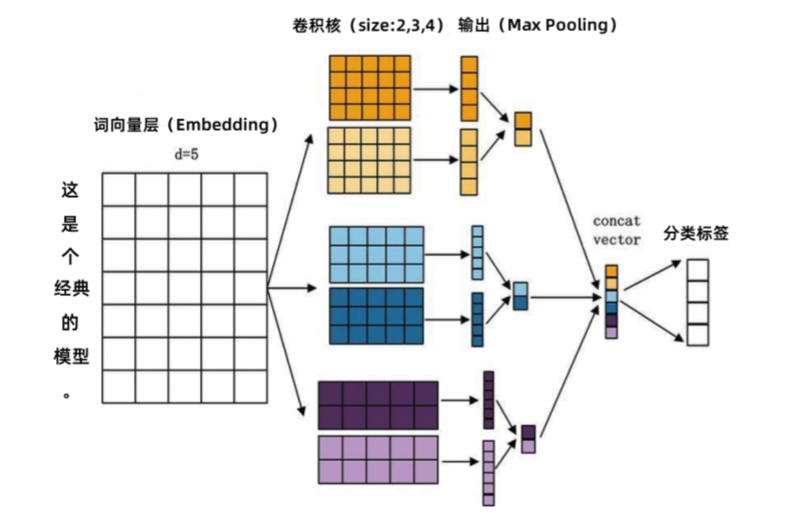
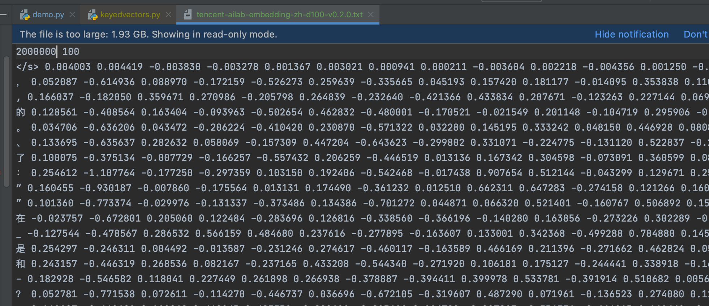

## 概述

深度学习模型在计算机视觉与语音识别方面取得了卓越的成就，在NLP领域也是可以的。将卷积神经网络CNN应用到文本分类任务，利用多个不同size的kernel来提取句子中的关键信息（类似n-gram的关 信息），从而能够更好地捕捉局部相关性。与传统图像的CNN网络相比，TextCNN在网络结构上没有任何变化（基至更加简单了），从下图可以看出TextCNN其实只有一层卷积，一层Max-Pooling，最后将输出外接Softmax来进行分类。



与图像处理的CNN网络相比，TextCNN最大的不同便是在输入数据的不同：图像是二维数据，图像的卷积核是从左到右，从上到下进行滑动来进行特征抽取。自然语言是一维数据，虽然经过Word Embedding生成了二维向量，但是对词向量做从左到右滑动来进行卷积没有意义。比如“今天”对应的向量[0, 0, 0, 0, 1]，按窗口大小为1*2从左到右滑动得到[0,0]，[0,0]，[0,0]，[0, 1]这四个向量，对应的都是“今天”这个词汇，这种滑动没有帮助。


### 文本应用CNN

在图像处理中经常看到的卷积核都是正方形的，比如4×4，然后在整张image上沿宽和高逐步移动进行卷积操作。但是NLP（自然语言处理）中的输入是一个词矩阵，比如由N个Words（单词）组成，每个Word用200维的Vector（向量）表示的话，这个输入就是N×200的矩阵，卷积核只在高度上进行滑动，在宽度上和Word Vector的维度一致（=200），也就是说每次窗口滑动过的位置都是完整的单词，不会将几个单词的一部分“Vector”进行卷积，这也保证了Word作为语言中最小粒度的合理性。

由于卷积核和Word Embedding（词嵌入）的维度一致，一个卷积核对于一个Sentence（即N×Word，N个单词的句子），卷积后得到的结果是一个Vector，其形状 = (word_count - filter_window + 1, 1)，那么，在Max-Pooling（最大池化）后得到的就是一个Scalar（标量）。所以，这点也是和图像卷积的不同之处，需要注意一下。

正是由于Max-Pooling后只是得到一个标量，在NLP中，会实施多个滑动窗口的大小（比如通常使用2, 3, 4, 5个Words的宽度分别作为卷积的窗口大小），每个窗口大小下又有N个（比如64个）卷积核。一个卷积核得到的只是一个标量太孤单了，人们就将相同Window_Size（窗口大小）卷积出来的N个标量组合在一起，组成这个Window_Size下的Feature_Vector（特征向量）。最后再将所有Window_size下的Feature_Vector也组合成一个Single Vector（单个向量），作为最后一层Softmax的输入。


### Padding填充

> 文档中不同句子的词语数量可能相同，也可能不同。

在卷积神经网络（CNN）中，填充（Padding）是一种常见的操作，尤其是在处理图像或文本数据时。填充的主要目的是保持输入和输出的大小一致，或者在卷积过程中保持特征图的尺寸不变。填充通常在卷积操作之前进行，即在原始数据（如图像或文本序列）的边缘添加额外的值，以便在卷积后保持原始数据的尺寸或形状。

填充操作的核心在于到底在前后补多少个值，这主要取决于卷积核和步长的大小，如果步长为1，卷积核大小为3，则只需要前后各补1个值即可（因为步长为1时，卷积核为3时，尺寸将缩减2）。针对步长为S（卷积核在输入数据上滑动时的**每次移动距离**），卷积核大小为K（表示为 **高度×宽度**（图像处理）或 **窗口长度**（文本处理，如1×K，就是卷积时覆盖的词语数量）），输入尺寸为W（文本为句子单词个数，图像为像素尺寸），Padding为P的情况下（在输入序列**前后添加的额外元素数量**（通常为0值，也称“补零”）），卷积运算后的输出尺寸N的计算公式为：
$$
N=\frac{W-K+2*P}{S}+1
$$
比如如果输入尺寸为21，卷积核为3，步长为1，填充为0时，则输出尺寸为：(21-3+2*0)/1 + 1 = 19，那么如果步长为2时，填充为5时，则输出尺寸为：(21-3+2*5)/2 + 1 = 15，基于此计算应该如何进行Padding即可。当然，也可以进行逆向计算，来决定如果要保持尺寸不变的情况下，需要设置填充P的值为多少合适(此时，N与W相同)。

填充在卷积神经网络中的应用是为了保持数据尺寸的稳定性和连续性，尤其是在处理像文本这样的序列数据时。通过合理的填充策略，可以在一定程度上提高模型的性能和稳定性。（一般文本序列通常在文本的前后填充0，也称为补零操作）。


## 数据预处理

### 数据下载

此处我们从kaggle上面下载一份百科类的问答数据，含有150万个预先过滤过的、高质量问题和答案，每个问题属于一个类别。总共有492个类别，其中频率达到或超过10次的类别有434个。数据下载使用如下代码：

```python
import os

import kagglehub

# Download latest version
path = kagglehub.dataset_download("terrychanorg/baike-qa2019")

print("Path to dataset files:", path)
```

下载成功后，我们可以得到两个文件，后缀分别是 train 和 valid，我们分别作为训练集和测试集来使用。数据中的单条数据是json结构的形式，结构如下：

```json
{"qid": "qid_5982723620932473219", "category": "教育/科学-理工学科-地球科学", "title": "人站在地球上为什么没有头朝下的感觉 ", "desc": "", "answer": "地球上重力作用一直是指向球心的，因此\r\n只要头远离球心，人们就回感到头朝上。"}
```


### 数据截取

原始数据文件数据量比较大，为了快速实现训练并验证，我们把`caregory`简化一下，只取前两个字作为一个类别，且只选择10个类别。训练集中，每个类别选取2000个数据，测试集每个类别选取500个数据。另外，训练数据也只使用`title`信息，进一步降低训练量。

我们使用如下代码，来讲原始数据处理为我们需要的数据集：

```python
import json
import jieba


def load_stop_words():
    with open(r"./data/stopwords.txt", "r", encoding="utf8") as f:
        lines = f.readlines()

    stop_words = set()
    for line in lines:
        stop_words.add(line.strip())

    return list(stop_words)


def extract_data(data_type: str):
    origin_file = f"./data/baike_qa_{data_type}.json"
    build_file = f"./data/baike_{data_type}.json"

    count = 2000 if data_type == "train" else 500

    # 定义标签类别，确保都是数据集中有的类别，并统计数据的数量
    type_dict = {"教育": 0, "健康": 0, "生活": 0, "娱乐": 0, "游戏": 0, "电脑": 0, "商业": 0, "文化": 0, "社会": 0, "烦恼": 0}

    # 加载停用词
    stop_words = load_stop_words()

    # 处理训练集
    with open(origin_file, "r", encoding="utf8") as f:
        lines = f.readlines()

    outputs = []
    for line in lines:
        data = json.loads(line)
        category = data["category"][0:2]
        # 训练集没个类别控制在2000个数据
        if category in type_dict and type_dict[category] < count:
            title = data["title"].strip()
            # 同步分词处理
            words = jieba.lcut(title)
            words = [word for word in words if (word.strip() and word not in stop_words)]
            out_json = {"category": category, "title": title, "words": words, "word_count": len(words)}
            outputs.append(json.dumps(out_json, ensure_ascii=False))

            type_dict[category] += 1

    # 保存
    with open(build_file, "w") as f:
        f.write("\n".join(outputs))


if __name__ == '__main__':
    extract_data("train")
    extract_data("valid")
```

通过脚本，我们可以得到训练集和测试集。


### 构建词汇表

我们还需要准备词和索引之间的映射关系，我们也将其保存到json文件中，便于后续复用。此处需要注意，我们在词汇表中还需要准备一个填充词。

```python
def build_vocab():
    all_words = []

    # 加载数据集，这里需要把训练集和测试集一起加载进来一起构建
    with open("./data/baike_train.json", "r", encoding="utf8") as f:
        lines = f.readlines()
    with open("./data/baike_valid.json", "r", encoding="utf8") as f:
        lines.extend(f.readlines())

    for line in lines:
        data = json.loads(line)
        all_words.extend(data["words"])

    unique_words = set(all_words)

    word2index = {"<pad>": 0}
    index2word = {0: "<pad>"}
    for index, word in enumerate(unique_words):
        word2index[word] = index + 1
        index2word[index + 1] = word

    with open("./data/baike_word2index.json", "w") as f:
        f.write(json.dumps(word2index, ensure_ascii=False))
    with open("./data/baike_index2word.json", "w") as f:
        f.write(json.dumps(index2word, ensure_ascii=False))


if __name__ == '__main__':
    build_vocab()
```


### 构建数据集

我们知道，计算机只能处理数值类型的数据，所以我们还需要把每一个条数据title的词专程索引的列表，并和类别做好映射（也就是标签）。这里需要注意一个问题，每个标题分词后的词语数量通常是不同的，我们进行训练的话，必须保持输入样本间数据的一致性。又考虑到通常说话一句话词汇不会太多，此处，我们每句话只取前16个词，不足16的使用占位索引补齐（0）。

下面还是把文本数据集，转为数值类型的数据集：

```python
def build_dataset(data_type: str):
    origin_file = f"./data/baike_{data_type}.json"
    build_file = f"./data/baike_num_{data_type}.json"

    # 词和索引的映射
    w2i = json.load(open("./data/baike_word2index.json", "r", encoding="utf8"))

    # 标签类别
    type_dict = {"教育": 0, "健康": 1, "生活": 2, "娱乐": 3, "游戏": 4, "电脑": 5, "商业": 6, "文化": 7, "社会": 8, "烦恼": 9}

    with open(origin_file, "r", encoding="utf8") as f:
        lines = f.readlines()

    num_lines = []

    for line in lines:
        data = json.loads(line)
        words = data["words"]
        category = data["category"]
        count = data["word_count"]

        indexes = [w2i[word] for word in words[:16]]
        if count < 16:
            indexes.extend([0] * (16 - count))

        # 在索引0处，放置标签
        indexes.insert(0, type_dict[category])

        num_lines.append(json.dumps(indexes))

    with open(build_file, "w", encoding="utf8") as f:
        f.write("\n".join(num_lines))


if __name__ == '__main__':
    build_dataset("train")
    build_dataset("valid")
```

经过上面的代码处理后，即可得到数值类型的数据集，索引0处的值就是当前样本的标签。

为了便于pytorch操作数据集，我们可以继承实现torch中抽象的DataSet类，然后通过DataLoader灵活获取样本数据。

```python
class BKDataSet(Dataset):
    def __init__(self, data_type: str):
        super(BKDataSet, self).__init__()
        with open(f"./data/baike_num_{data_type}.json", "r", encoding="utf8") as f:
            self.lines = f.readlines()

    def __getitem__(self, item):
        line = json.loads(self.lines[item])

        y = torch.tensor(line[0], dtype=torch.long)
        x = torch.tensor(line[1:], dtype=torch.long)

        return x, y

    def __len__(self):
        return len(self.lines)


if __name__ == '__main__':
    ds_train = BKDataSet("train")

    # DataLoader实例后是一个可迭代对象
    # batch_size 每次迭代数据量；shuffle 是否打乱随机获取样本
    loader = DataLoader(ds_train, batch_size=2, shuffle=True)

    for data in loader:
        print(data)
        break
    """
    [tensor([[32100,  3874,  8671, 34151,  4529,     0,     0,     0,     0,     0,
             0,     0,     0,     0,     0,     0],
        [ 3077, 35931,  3077, 18390, 35931,  5218,  7303,  1138,     0,     0,
             0,     0,     0,     0,     0,     0]]), tensor([0, 2])]
    """
```


## 训练卷积神经网络

### 定义网络结构

在开始之前需要做一个说明，TextCNN是用在分类问题中，我们下面的代码在每一次训练过程中，是在不断更新词嵌入层的参数的，通过多轮训练来得到更好分类效果的参数。

结合前面的数据集代码，新增模型训练的代码：

```python
import json
import torch

import torch.nn as nn
import torch.nn.functional as F

from torch import optim
from torch.optim.lr_scheduler import ExponentialLR
from torch.utils.data import DataLoader, Dataset


class BKDataSet(Dataset):
    def __init__(self, data_type: str):
        super(BKDataSet, self).__init__()
        with open(f"./data/baike_num_{data_type}.json", "r", encoding="utf8") as f:
            self.lines = f.readlines()

    def __getitem__(self, item):
        line = json.loads(self.lines[item])

        y = torch.tensor(line[0], dtype=torch.long)
        x = torch.tensor(line[1:], dtype=torch.long)

        return x, y

    def __len__(self):
        return len(self.lines)


class TextCNN(nn.Module):
    def __init__(self, dim=50):
        """
        dim 表示词向量的维度
        """
        super(TextCNN, self).__init__()

        # 词汇表中词汇的个数，我们直接写死，值可以从前面生成的词汇表中获取
        self.vocab_size = 41152

        # 定义词嵌入层
        # num_embeddings 表示有多少个词需要训练向量
        # embedding_dim 每个词输出词向量的维度
        # padding_idx 表示 0是填充索引，我们在构建词汇表时索引0就映射的是一个填充字符串。指定填充索引后，构建词向量时，会直接把填充索引的词向量也全部置为0
        self.embedding = nn.Embedding(num_embeddings=self.vocab_size, embedding_dim=dim, padding_idx=0)

        # 定义卷积层。进行多次不同size的卷积计算
        # in_channels 表示输入的数据的维度，这里就是词向量的维度，也就是卷积核的列数
        # out_channels 卷积核的个数，每个卷积核计算完成后还要进行最大池化处理，就是说每个卷积核最后只会保留卷积计算结果中的最大值。32个卷积核就得到32个最大值
        # kernel_size 表示卷积核的行数
        self.conv1 = nn.Conv1d(in_channels=dim, out_channels=32, kernel_size=3)
        self.conv2 = nn.Conv1d(in_channels=dim, out_channels=32, kernel_size=4)
        self.conv3 = nn.Conv1d(in_channels=dim, out_channels=32, kernel_size=5)

        # 定义全连接层
        # 每个样本的输入特征是把3个卷积结果拼一起的，因此是96
        # 输出特征只有10个。这里是一个多分类问题，每个样本预测的10个值中，最大值的下标就是预测的分类
        self.full_conn = nn.Linear(3 * 32, 10)

        # 损失函数
        self.loss_func = nn.CrossEntropyLoss()

        # 优化器
        self.optimizer = optim.Adam(self.parameters(), lr=0.01)

        # 调度器，用于动态调节学习速率
        self.scheduler = ExponentialLR(optimizer=self.optimizer, gamma=0.8)

        # 数据集加载器
        self.train_dl = DataLoader(BKDataSet("train"), batch_size=64, shuffle=True)
        self.test_dl = DataLoader(BKDataSet("valid"), batch_size=64, shuffle=True)

    def __conv_and_max(self, x: torch.Tensor, conv: nn.Conv1d):
        """
        x 的最后一个维度是计算出来的卷积结果
        x的形状是 (句子数量, 词数量, 卷积结果)
        """
        # 进行卷积
        # 这里需要注意一点，卷积计算时卷积数组的形状是 (卷积核的个数=32, 卷积核的列数=50, 卷积核的行数=3/4/5)
        # 而进行此前如得到的每个批次的词向量形状是 (sample_count=64, word_count=16, dimension=50)
        # 所以为了能够进行卷积运算，我们需要把x的维度做一下转换
        x = x.permute((0, 2, 1))  # 把第2维和第1维的维度做一下切换
        x = conv(x)

        x = F.relu(x)  # 激活函数激活
        x = F.max_pool1d(x, x.size(2))  # 在最后一个维度上进行最大池化
        x = x.squeeze(2)  # 最大池化后，最后一个维度里面就只有一个元素，这里是把最后个维度直接去掉（把中括号去掉），如果不传参数，则把张量中所有元素为1的所有维度都去掉

        return x

    def forward(self, inputs):
        """
        前向传播
        """
        # 词向量
        embedding_outputs = self.embedding(inputs)  # shape (sample_count=64, word_count=16, dimension=50)

        # 卷积
        x1 = self.__conv_and_max(embedding_outputs, self.conv1)  # shape (sample_count, kernel_count)
        x2 = self.__conv_and_max(embedding_outputs, self.conv2)
        x3 = self.__conv_and_max(embedding_outputs, self.conv3)

        # 把不同kernel_size进行卷积的结果拼到一起。每个size的卷积核有32个，那么每个样本每个size下都是一个长度为32的列表
        x = torch.cat((x1, x2, x3), dim=1)  # 拼接第一维，第0维就是每个批次的文本数量，都是一样的。 shape (sample_count, 3 * kernel_count)

        # 丢弃一些参数
        F.dropout(x, 0.5)

        outputs = self.full_conn(x)

        return outputs

    def _train(self):
        # 设置为训练模式
        self.train()

        # 获取样本及标签，按批次遍历所有样本
        train_loss, train_acc = 0, 0
        for x, y in self.train_dl:
            # 前向传播
            outputs: torch.Tensor = self(x)
            # 计算损失
            loss = self.loss_func(outputs, y)
            # 重置所有参数梯度，将其梯度清零，在反向传播前完成
            self.optimizer.zero_grad()
            # 反向传播
            loss.backward()
            # 更新参数
            self.optimizer.step()
            # item 用于返回Tensor的值，返回python标准的数值结果，仅在Tensor中只有一个元素时有效
            train_loss += loss.item()

            # 预测值
            # Tensor.argmax 是用于在张量中沿指定轴查找最大值索引的函数
            # 两个Tensor进行逻辑运算，返回满足条件的项组成的新的Tensor
            train_pred = outputs.argmax(dim=1)
            train_acc += (train_pred == y).sum().item()

        train_loss /= len(self.train_dl)  # 损失是按每个批次进行计算的
        train_acc /= len(self.train_dl.dataset)  # 精度按样本个数来计算

        return train_loss, train_acc

    def _test(self):
        # 设置为评估模式 等价于 self.train(False)
        self.eval()

        # 测试过程就是没有反向传播更新参数的过程
        test_loss, test_acc = 0, 0
        for x, y in self.test_dl:
            # 前向传播
            outputs: torch.Tensor = self(x)
            # 计算损失
            loss = self.loss_func(outputs, y)
            test_loss += loss.item()

            # 预测值
            train_pred = outputs.argmax(dim=1)
            test_acc += (train_pred == y).sum().item()

        test_loss /= len(self.test_dl)  # 损失是按每个批次进行计算的
        test_acc /= len(self.test_dl.dataset)  # 精度按样本个数来计算

        return test_loss, test_acc

    def my_train(self, epochs=20):
        for i in range(epochs):
            train_loss, train_acc = self._train()
            print(f"当前是第 {i + 1} 轮 '训练'，损失为: {train_loss}  精度为: {train_acc}")

            test_loss, test_acc = self._test()
            print(f"当前是第 {i + 1} 轮 '测试'，损失为: {test_loss}  精度为: {test_acc}")

            # 每完成一轮全量训练就更一下学习速率
        self.scheduler.step()
```

因为没有GPU，下面训练10轮来看看效果：

```python
if __name__ == '__main__':
    model = TextCNN()
    model.my_train(10)
    
    """
    ...
    当前是第 8 轮 '训练'，损失为: 0.004956733253144751  精度为: 0.9994
    当前是第 8 轮 '测试'，损失为: 2.3006385081931007  精度为: 0.579
    当前是第 9 轮 '训练'，损失为: 0.004237214656406865  精度为: 0.9994
    当前是第 9 轮 '测试'，损失为: 2.3291944295545166  精度为: 0.5816
    当前是第 10 轮 '训练'，损失为: 0.0037594082893226475  精度为: 0.99935
    当前是第 10 轮 '测试'，损失为: 2.346826936436605  精度为: 0.58
    """
```

从训练结果可以看到，随着训练轮次的增加，训练集的损失下降明显，且精度也很高，但是测试数据损失和精度都表现不太好，说明存在过拟合问题。针对文本分类来说，要提升拟合效果，通常有以下两种方法：

1. 加大数据集数量。我们前面准备的每个分类，训练数据只有2000，可以增加到1万以上，来提高模型的泛化能力。
2. 采用预训练词向量，而不是把词向量交给神经网络来训练。因为预训练词向量通常能够更好的处理词语之间的语义，那么对于模型来说，能够更好的计算训练集和验证集之间的差异，能够提高模型的准确率。同时可通过预训练词向量减少模型的过拟合问题，因为词向量不会一味的去迎合训练集参数而忽略了验证集的匹配情况。（我们前面准备的训练示例，训练集和验证集是隔离的）


### 预训练词向量优化效果

所谓预训练词向量，就是在模型训练过程中，预加载训练好的词向量，同时保持词嵌入层参数不做更新（参数更新的话就和前面没啥区别了）。**这里有一个需要注意的点，使用预训练的词向量时，构建数据集使用的词汇表，应该和预训练保持一致，就是说同一个词对应的索引应该保持一致。**所以使用预训练的词向量时，我们需要基于现有词汇表，重新构建数据集。

#### 准备预训练词向量

此处我们可以直接把前面的百科数据，按照前面的方式，使用CBOW、Skip-Gram或者Word2vector等方式生成词向量模型，但是需要花费较多时间。现在找了一份腾讯的预训练数据，词汇表有两百万，词向量是一百维，是一个文本格式的文件，如下：



文本格式的词向量文件加载较慢，我们可用如下代码将其重新保存为bin文件：

```python
from gensim.models.keyedvectors import KeyedVectors

word_vectors = KeyedVectors.load_word2vec_format("./data/tencent-ailab-embedding-zh-d100-v0.2.0.txt", binary=False)
word_vectors.save_word2vec_format("./data/tencent-ailab-embedding-zh-d100-v0.2.0.bin", binary=True)
```


#### 重新构建数据集

此处我们只需要修改前面构建数据集的代码，从预训练的模型中获取词汇表即可：

```python
def build_dataset(data_type: str):
    origin_file = f"./data/baike_{data_type}.json"
    build_file = f"./data/baike_tencent_{data_type}.json"

    # 使用腾讯预训练的词汇表
    # 此时索引0处的填充词汇是 '</s>'
    word_vectors = KeyedVectors.load_word2vec_format("./data/tencent-ailab-embedding-zh-d100-v0.2.0.bin", binary=True)
    w2i = word_vectors.key_to_index

    # 标签类别
    type_dict = {"教育": 0, "健康": 1, "生活": 2, "娱乐": 3, "游戏": 4, "电脑": 5, "商业": 6, "文化": 7, "社会": 8, "烦恼": 9}

    with open(origin_file, "r", encoding="utf8") as f:
        lines = f.readlines()

    num_lines = []

    for line in lines:
        data = json.loads(line)
        words = data["words"]
        category = data["category"]
        count = data["word_count"]

        # 现有数据集中的词汇可能在预训练的词汇表中并不存在
        # 凡是不存在都当成填充词处理
        indexes = [w2i.get(word, 0) for word in words[:16]]

        if count < 16:
            indexes.extend([0] * (16 - count))

        # 在索引0处，放置标签
        indexes.insert(0, type_dict[category])

        num_lines.append(json.dumps(indexes))

    with open(build_file, "w", encoding="utf8") as f:
        f.write("\n".join(num_lines))


if __name__ == '__main__':
    build_dataset("train")
    build_dataset("valid")
```

基于我们新的数据文件，数据集的类数据文件同步做一下更新：

```python
class BKDataSet(Dataset):
    def __init__(self, data_type: str):
        super(BKDataSet, self).__init__()
        # 这里
        with open(f"./data/baike_tencent_{data_type}.json", "r", encoding="utf8") as f:
            self.lines = f.readlines()

    def __getitem__(self, item):
        line = json.loads(self.lines[item])

        y = torch.tensor(line[0], dtype=torch.long)
        x = torch.tensor(line[1:], dtype=torch.long)

        return x, y

    def __len__(self):
        return len(self.lines)
```


#### 修改模型类

对于TextCNN，词汇表的大小和词向量维度就必须和预训练词向量保持一致了。

修改一：构造方法更新

```python
class TextCNN(nn.Module):
    def __init__(self):
        """
        dim 表示词向量的维度
        """
        super(TextCNN, self).__init__()

        word_vectors = KeyedVectors.load_word2vec_format("./data/tencent-ailab-embedding-zh-d100-v0.2.0.bin",
                                                         binary=True)
        # 向量维度和词汇表词语个数
        dim = word_vectors.vector_size
        self.vocab_size = len(word_vectors.index_to_key)

        # 定义词嵌入层，此时就直接从预训练模型中加载即可
        self.embedding = nn.Embedding(num_embeddings=self.vocab_size, embedding_dim=dim, padding_idx=0)
        self.embedding.weight.data.copy_(torch.from_numpy(np.array(word_vectors.vectors)))

        # 设置不再更新embedding层的参数
        self.embedding.weight.requires_grad = False
        
        ...
```

修改二：训练结束之后保存训练后的模型

```python
    def my_train(self, epochs=20):
        for i in range(epochs):
            train_loss, train_acc = self._train()
            print(f"当前是第 {i + 1} 轮 '训练'，损失为: {train_loss}  精度为: {train_acc}")

            test_loss, test_acc = self._test()
            print(f"当前是第 {i + 1} 轮 '测试'，损失为: {test_loss}  精度为: {test_acc}")

            # 每完成一轮全量训练就更一下学习速率
            self.scheduler.step()

        # 保存训练后的模型
        torch.save(self.state_dict(), "./data/textcnn-bk.pth")
```


#### 模型训练

修改后的代码，词嵌入层的参数就不再发生变化，每一轮训练更新的都是卷积层的参数了，训练过程准确度如下：

```python
if __name__ == '__main__':
    model = TextCNN()
    model.my_train(20)
    """
    当前是第 18 轮 '训练'，损失为: 0.11211843036424618  精度为: 0.98
    当前是第 18 轮 '测试'，损失为: 1.4052096039434023  精度为: 0.6906
    当前是第 19 轮 '训练'，损失为: 0.10924614529116466  精度为: 0.98035
    当前是第 19 轮 '测试'，损失为: 1.3980448102649254  精度为: 0.6898
    当前是第 20 轮 '训练'，损失为: 0.1067165761186292  精度为: 0.9812
    当前是第 20 轮 '测试'，损失为: 1.4266501295415661  精度为: 0.6898
    """
```

可以看到测试集的准确率是有提升的，当然还不够理想，主要原因有：

1. 预训练的词向量模型里面并没有完全覆盖我们数据集中的词汇
2. 训练集中的训练数据量不足


### 模型推理

我们已经训练得到了模型，那么就可以通过加载模型，对样本进行分类预测。

```python
    model = TextCNN()
    # 加载参数
    model.load_state_dict(torch.load("./data/textcnn-bk.pth"))
    # 设置模型为测试模式
    model.eval()

    # 随便写一句样本
    title = "西红柿是一种对身体非常有益的蔬菜"

    # 把样本转成索引列表，保持和训练数据一致
    word_vectors = KeyedVectors.load_word2vec_format("./data/tencent-ailab-embedding-zh-d100-v0.2.0.bin", binary=True)
    w2i = word_vectors.key_to_index

    # 标签类别
    type_dict = {"教育": 0, "健康": 1, "生活": 2, "娱乐": 3, "游戏": 4, "电脑": 5, "商业": 6, "文化": 7, "社会": 8, "烦恼": 9}
    type_index = {val: key for key, val in type_dict.items()}

    # 停用词
    with open(r"./data/stopwords.txt", "r", encoding="utf8") as f:
        lines = f.readlines()
    stop_words = set()
    for line in lines:
        stop_words.add(line.strip())

    # 分词
    words = jieba.lcut(title)
    words = [word for word in words if (word.strip() and word not in stop_words)]

    # 构建索引列表
    # 凡是不存在都当成填充词处理
    indexes = [w2i.get(word, 0) for word in words[:16]]
    if len(indexes) < 16:
        indexes.extend([0] * (16 - len(indexes)))

    # 调用模型进行推理
    x = torch.LongTensor([indexes])  # 这里之所以再套一层，也是为了保持和训练集shape一致
    y_pred = model(x)

    print(y_pred)
    """
    tensor([[ -0.8480,  -0.2091,   4.3861,  -3.0371, -13.9406,  -2.6262,  -8.9868,
          -6.7566,  -4.3752,  -2.8770]], grad_fn=<AddmmBackward0>)
    """
    print(y_pred.argmax())
    """
    tensor(2)
    """
    print(f"预测分类结果是：{type_index.get(y_pred.argmax().item())}")
    """
    预测分类结果是：生活
    """
```


