## 循环神经网络

### 前馈神经网络的不足

我们了解的人工神经网络（ANN）和卷积神经网络（CNN），都可以称为 "前馈神经网络（FeedForward Neural Network）"，各神经元分层排列，每个神经接收到前一层的输出并传递给下一层作为输入，各层之间没有反馈，每一层内部的神经元之间，也没有任何反馈机制。

前馈神经网络也能处理序列数据，但它是对数据进行整体读取、整体处理，然后一次性解析，所以导致每个单词在处理过程中权重是无差别的，网络并没有对相邻的两个单词进行特别对待。比如 "我今天从西安出发去成都"，这句话每一个词都是特征，对于 西安 和 成都 两个是相同权重，也就导致目的地是 西安 和 成都 的概率是一样的。


### RNN的特性

RNN是一种具有记忆功能的神经网络，其特点是能够把刚刚处理过的信息放进神经网络的内存中，这样离目标近的特征的影响就会比较大。比去前面的 西安 和 成都，因为 去 离 成都 更近，则目的地为 成都 的概率会更高。

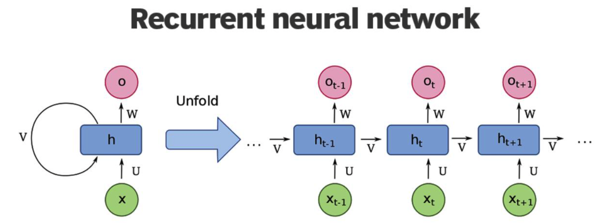

RNN的循环机制，使模型隐藏层在上一时间步（RNN是按输入序列顺序逐个处理序列中的元素，一个时间步就是指处理其中一个元素的过程）产生的结果，可以作为当前时间步输入的一部分，并对当前时间步的输出结果产生影响。

因为RNN结构能够很好利用序列之间的关系，因此针对具有连续性的输入序列，比如人类的语言、语音等可以进行很好的处理。


**示例**

1. 用户输入 "waht time is it ?"，首先需要对句子进行基本的分词，因为RNN是按照顺序工作的，每次只接收一个单词进行处理

2. 将单词 what 输送给RNN，它将会产生一个输出 O1

   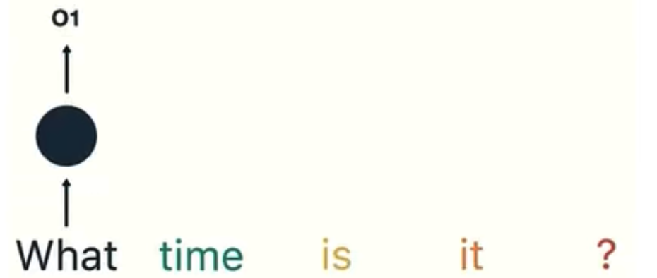

3. 继续讲单词 time 输送给RNN，但此时RNN不仅利用 time 来产生输出O2，还会使用来自上一层隐藏层输出O1作为输入信息

   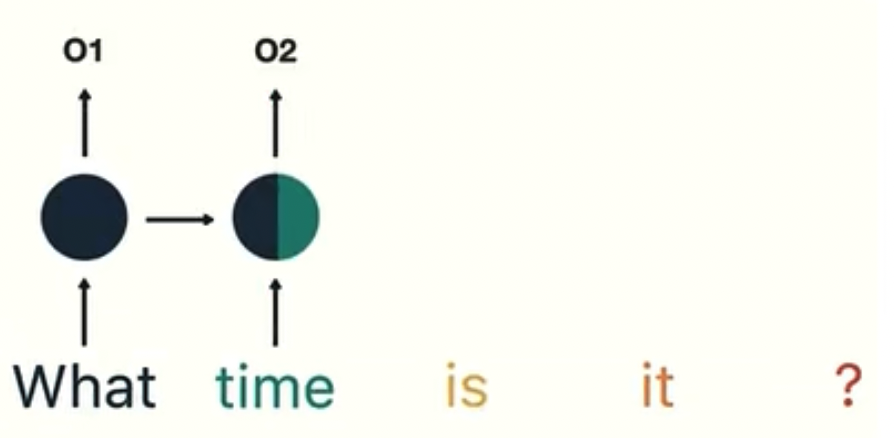

4. 重复这样的步骤，知道处理完所有的单词。最后，将最终的隐藏层输出O5进行处理来解析用户意图

   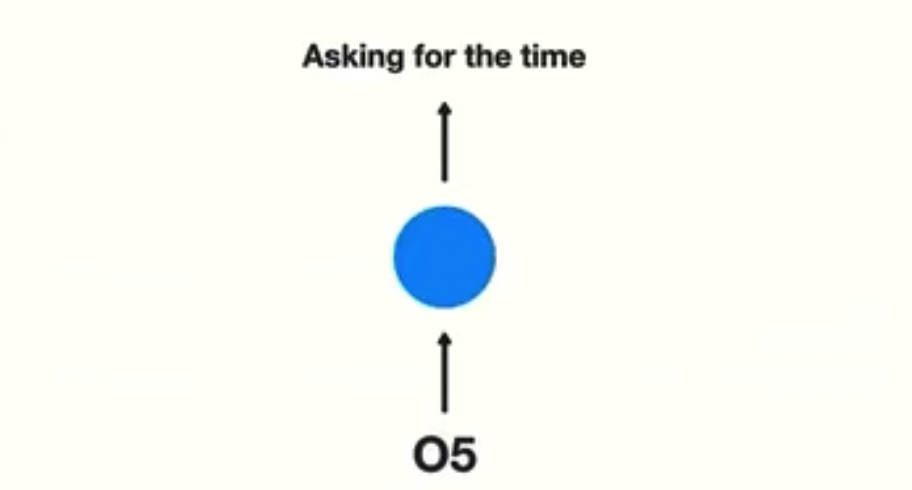


### RNN内部结构

RNN的每个神经节点增加了一个对当前状态的记忆功能，也就是除了权重W和偏置b之外，还有一个状态权重U，这个记录当前状态的U，负责文字记忆功能。隐藏状态记为h，则当前时间步的隐藏状态为:
$$
h_t=activation(W*x_t+U*h_{t-1}+b)
$$

下图是神经元数据流转的示意图：

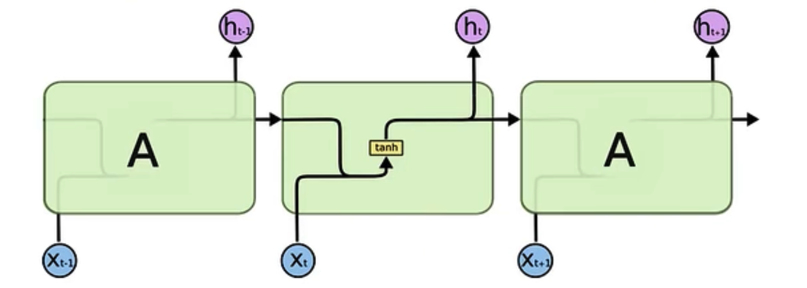

从图中可以看到神经元的输入有两部分。分别是 h(t-1) 和 X(t)，代表了上一时间步的隐藏层输出和当前时间步的输入。它们进入RNN结构体后会融合到一起，本质是将两个张量进行拼接，形成新的张量 [X(t), h(t-1)] ，之后这个张量将通过一个全连接层（Liner层），该层使用tanh作为激活函数，最终得到该时间步的输出 h(t) ，它又将作为下一个时间步的输入的一部分。所以，不难发现最后输出的结果受最新特征X(t)和最近状态h(t-1)影响最大。
$$
h_t=tanh(W[X_t,h_{t-1}]+b)
$$
通过使用激活函数tanh，可以将参数值呀所在 [-1, 1] 之间。


**RNN参数个数计算**

我们使用代码简单实现一个模型类，来看下各层的参数：

```python
import torch.nn as nn
import torchinfo

class SimpleRNN(nn.Module):
    def __init__(self):
        super(SimpleRNN, self).__init__()

        self.rnn = nn.RNN(32, 64)
        self.fc = nn.Linear(64, 10)

    def forward(self, x):
        x = self.rnn(x)
        x = self.fc(x)

        return x

model = SimpleRNN()
torchinfo.summary(model)
```

运行代码后可看到摘要信息：

```shell
=================================================================
Layer (type:depth-idx)                   Param #
=================================================================
SimpleRNN                                --
├─RNN: 1-1                               6,272
├─Linear: 1-2                            650
=================================================================
Total params: 6,922
Trainable params: 6,922
Non-trainable params: 0
=================================================================
```

先看线性层的参数，输入特征64，输出特征10，那么参数个数就该是 64 * 10 + 10，加的10指的是输出特征上的偏置，64 * 10 则表示每个输入特征到每个输出特征的权重参数。

再来看RNN，参数计算过程如下：

1. 按照线性层计算的方式，先把特征权重和偏置的参数个数计算出来，32 * 61 + 64 = 2112
2. RNN中还有一个隐藏层，它的输入输出特征数都是64，那么隐藏层的参数就是 64 * 64 + 64 = 4160
3. 因此RNN这一层总的参数就是 2112 + 4160 = 6272


## RNN的分类

### N vs N - RNN

这是RNN最基础的结构形式，最大的特点就是：输入和输出序列是等长的。由于这个限制的存在，适用范围比较小，可用于生成等长度的诗句。

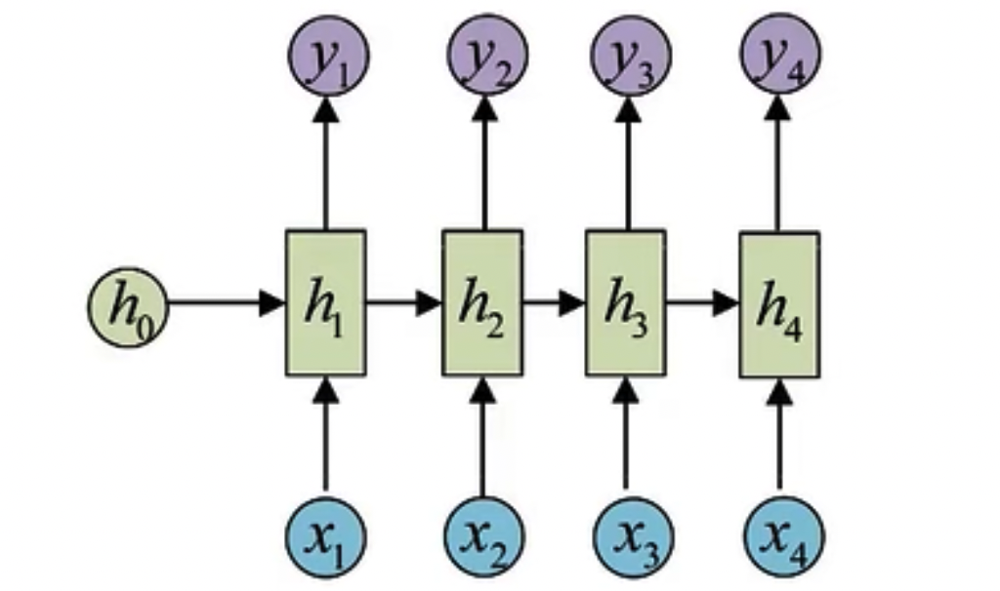

### N vs 1 - RNN

当我们需要处理输入是一个序列，而输出只是一个单值的时候，我们就需要在最后一个隐藏层输出h上进行线性变换。大部分情况下，为了得到更明确的结果，还会借助sigmoid和softmax进行处理，这种结构通常用在文本的分类问题上。

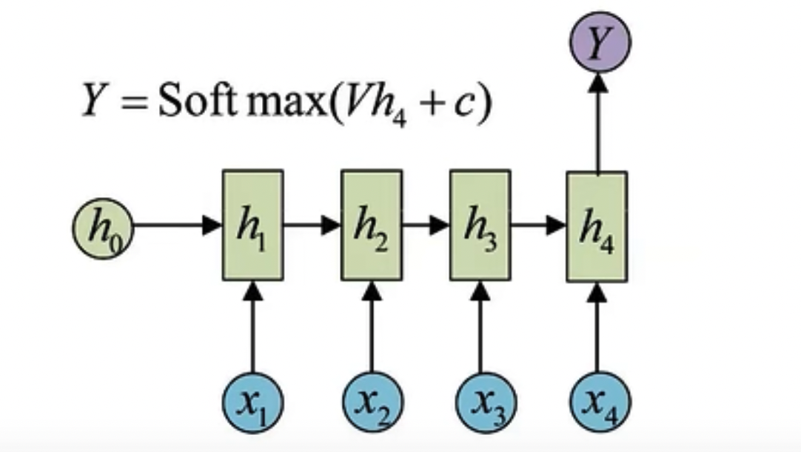

### 1 vs N - RNN

当需要处理输入某个单值而输出是一个序列的情况，我们就需要将输入作用在每次的输出之上。这种结构可用于将图片生成文字的任务。

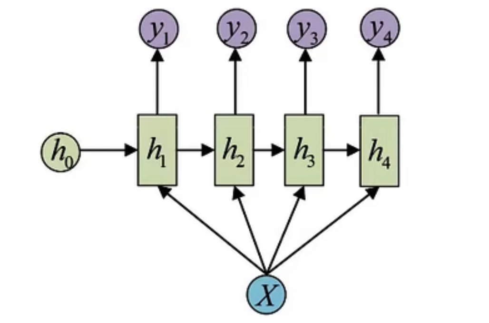

### N vs M - RNN

这是一种不限制输入输出长度的结构，它由编码器和解码器两部分组成，两者的内部结构都是某类RNN，它也被称为seq2seq架构。输入先通过解码器，得到一个隐含变量c，然后使用这个隐含变量c作用在解码器进行解码的每一步上，来确保输入信息被有效利用。

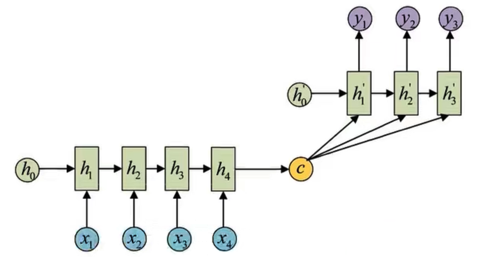


## LSTM神经网络

SimpleRNN不是唯一的RNN，只是一种最简单的实现，且有一定的局限性，比如虽然隐藏状态的参数量越多，原则上可以记住的前面的时间步的状态就会越多，但是因此也会带来梯度消失问题，导致无法让RNN记忆更早期的状态。

SimpleRNN相当于瞬时记忆，它对近期序列的内容记得最清晰，但是有时候，序列中前面的一些内容也需要记住，根据前面的公式可知，随着时间轴越来越往后延伸，前面的状态对后面权重的影响会变得越来越弱。

此时，LSTM网络出现了，是SimpleRNN的一个变体，全称为：Long Short-Term Memory，长-短期记忆，本质上还是短记忆网络，只是用某种方法把‘短记忆’尽可能延长了一些。能够有效捕捉长序列之间的语义关联，缓解梯度消失或爆炸现象。

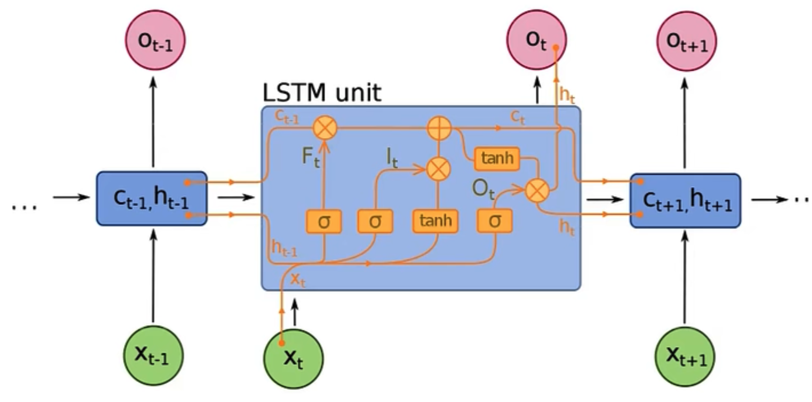

上图中σ表示sigmoid激活函数。通过对比发现，LSTM和经典RNN有如下区别：

1. 除了隐藏状态H，还多了一个C，即单元状态Cell
2. 每个循环网络的单元（Cell）变得复杂了，新增了门控机制（遗忘门“forget gate”，输入门“input gate”，输出门“output gate”）

LSTM的核心概念是单元状态，以及它的各种门。单元状态就像一条运输公路，将相对的信息一直传递到序列链中。你可以把它看作是网络的“存储器”。从理论上讲，单元状态可以在整个序列的处理过程中携带相关信息。因此，即便是较早的时间步骤的信息也可以进入以后的时间步骤，减少短期记忆的影响。在单元状态的旅程中，信息通过门被添加或删除到单元状态中。这些门是不同的神经网络，决定哪些信息可以在单元状态中留下。在训练过程中，门可以学习哪些信息是需要保留或遗忘的。

门控包含sigmoid激活函数，这对更新或遗忘数据很有帮助，因为任何数字乘以0都是0，导致数值消失或被遗忘。任何数字乘以1都是相同的值，因此该值保持不变或被保留。网络可以了解哪些数据不重要，因此可以被遗忘，或者哪些数据是重要的，可以保留。


### 遗忘门

遗忘门的核心作用是判断单元状态中哪些历史信息需要保留，哪些应被丢弃。在序列数据处理中，这一机制类似人类阅读时自动忽略无关细节、保留关键信息的过程。例如在机器翻译任务中，当处理长句时，遗忘门会选择性保留主语信息，而遗忘已处理的修饰成分。

遗忘门接收上一时刻隐藏状态和当前输入，通过Sigmoid激活函数输出一个0到1之间的权重F(t)：
$$
F_t = sigmoid(W[X_t,h_{t-1}]+b)
$$
输出值越接近1，表示对应位置的信息保留程度越高；接近0则表示该信息被遗忘。

**计算逻辑**：将X(t)与h(t-1)拼接后进行线性变换，再通过Sigmoid压缩至[0,1]区间。例如，当处理句子"猫追老鼠，老鼠钻进了洞"时，"猫"作为主语的信息会被遗忘门赋予较高权重（如0.9），而"追"这一动作的权重可能较低（如0.3）。


### 输入门

输入门负责决定当前时刻的新信息哪些应被添加到单元状态中。它包含两个子模块：**选择更新**（Sigmoid层）和**候选信息生成**（Tanh层），前者决定更新强度，后者提供待更新的候选内容。

1. **选择更新信号**：通过Sigmoid层输出更新权重
   $$
   I_t=sigmoid(W[X_t,h_{t-1}]+b)
   $$

2. **候选信息生成**：通过Tanh层生成新候选向量C(t)（值域[-1,1]）
   $$
   \overrightarrow{C_t}=tanh(W[X_t,h_{t-1}]+b)
   $$

3. **单元状态更新**：结合遗忘门输出与输入门输出，完成单元状态迭代
   $$
   C_t=V_{t}*C_{t-1}+I_t*\overrightarrow{C_t}
   $$

**实例解析**：在时间序列预测中，若当前输入为股票价格的突增数据，输入门的Sigmoid层会输出高权重（如0.8），Tanh层生成价格波动的候选向量，两者相乘后与经遗忘门过滤的历史趋势信息叠加，更新单元状态以反映最新市场动态。


### 输出门

输出门控制单元状态中哪些信息应被转化为当前隐藏状态h(t)，进而影响下一时刻的计算或最终输出。这一过程类似从记忆中提取与当前任务相关的信息。

1. **输出控制信号**：通过Sigmoid层确定输出比例O(t)
   $$
   O_t=sigmoid(W[X_t,h_{t-1}]+b)
   $$

2. **隐藏状态生成**：将单元状态经Tanh压缩后与输出控制信号相乘
   $$
   h_t=O_t*tanh(C_t)
   $$

**应用场景**：在情感分析任务中，当处理句子"这部电影画面精美，但剧情拖沓"时，输出门会重点提取"但"后的负面信息（输出权重0.7），而弱化"画面精美"的正面描述（权重0.2），使隐藏状态更准确反映整体负面情感。


## GRU神经网络

### 基本原理

GRU是较新的一代神经网络，与LSTM非常相似。GRU摆脱了单元状态，使用隐藏状态来传递信息。他只有两个门，复位门和更新门。

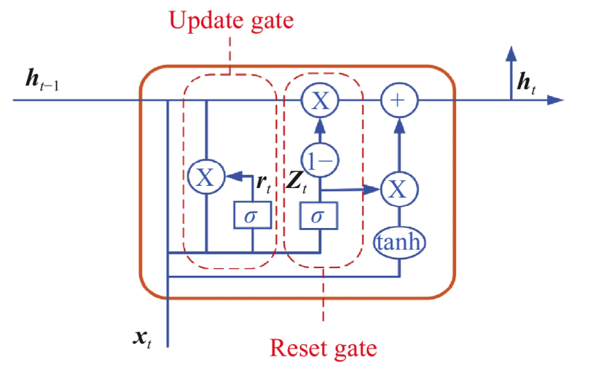

更新门的作用类似于LTSM的遗忘门和输入门，决定丢弃哪些信息，增加哪些信息。重置门用于决定遗忘多少过去的信息。


### 与LSTM对比

**参数数量：**GRU的参数数量相对LSTM来说更少，因为它将LSTM中的输入门、遗忘门和输出门合并为了一个门控单元，从而减少了模型参数的数量。

**LSTM中有三个门控单元：**输入门、遗忘门和输出门。每个门控单元都有自己的权重矩阵和偏置向量。这些门控单元负责控制历史信息的流入和流出。

**GRU中只有两个门控单元：**更新门和重置门。它们共享一个权重矩阵和一个偏置向量。更新门控制当前输入和上一时刻的输出对当前时刻的输出的影响，而重置门则控制上一时刻的输出对当前时刻的影响。

**计算速度：**由于参数数量更少，GRU的计算速度相对LSTM更快。

**长序列建模：**在处理长序列数据时，LSTM更加优秀。由于LSTM中引入了一个长期记忆单元（Cell State），使得它可以更好地处理长序列中的梯度消失和梯度爆炸问题。


**GRU适用于：**

1. 处理简单序列数据，如语言模型和文本生成等任务。
2. 处理序列数据时需要快速训练和推断的任务，如实时语音识别、语音合成等。
3. 对计算资源有限的场景，如嵌入式设备、移动设备等。


**LSTM适用于：**

1. 处理复杂序列数据，如长文本分类、机器翻译、语音识别等任务。
2. 处理需要长时依赖关系的序列数据，如长文本、长语音等。
3. 对准确度要求较高的场景，如股票预测、医学诊断等。


## 原生RNN训练

在TextCNN中，我们已经准备了训练需要的数据集，此处直接服用即可。但是RNN的模型类是需要重写的，代码如下：

```python
import json
import torch
import numpy as np
import torch.nn as nn
import torch.nn.functional as F
from gensim.models import KeyedVectors

from torch import optim
from torch.optim.lr_scheduler import ExponentialLR
from torch.utils.data import DataLoader, Dataset


class BKDataSet(Dataset):
    def __init__(self, data_type: str):
        super(BKDataSet, self).__init__()
        # 这里
        with open(f"./data/baike_tencent_{data_type}.json", "r", encoding="utf8") as f:
            self.lines = f.readlines()

    def __getitem__(self, item):
        line = json.loads(self.lines[item])

        y = torch.tensor(line[0], dtype=torch.long)
        x = torch.tensor(line[1:], dtype=torch.long)

        return x, y

    def __len__(self):
        return len(self.lines)


class RNNClassify(nn.Module):
    def __init__(self):
        """
        dim 表示词向量的维度
        """
        super(RNNClassify, self).__init__()

        word_vectors = KeyedVectors.load_word2vec_format("./data/tencent-ailab-embedding-zh-d100-v0.2.0.bin",
                                                         binary=True)
        # 向量维度和词汇表词语个数
        dim = word_vectors.vector_size
        self.vocab_size = len(word_vectors.index_to_key)

        # 定义词嵌入层，使用预训练数据
        self.embedding = nn.Embedding(num_embeddings=self.vocab_size, embedding_dim=dim, padding_idx=0)
        self.embedding.weight.data.copy_(torch.from_numpy(np.array(word_vectors.vectors)))
        self.embedding.weight.requires_grad = False

        # 定义rnn网络层
        # input_size 就是输入张量最后一维的元素个数
        # hidden_size 表示RNN中隐藏层节点的个数
        # num_layers 指定RNN的层数，通过堆叠多层提升模型复杂度和表达能力。增加层数可捕获更复杂的序列依赖关系，但过多层数可能导致训练困难或过拟合。
        # batch_first 决定输入/输出张量的维度顺序。
        #       为true时认为输入张量形状是 (batch_size, sequence_length, input_size)
        #             输出张量形状是 (batch_size, sequence_length, hidden_size)；
        #       为 false 时，则认为第一个是 sequence_length， 第二维是 batch_size
        self.hidden_size = 128
        self.rnn = nn.RNN(input_size=dim, hidden_size=self.hidden_size, num_layers=1, batch_first=True)

        # 定义全连接层
        # rnn 最后输出张量最后一维参数个数，就是隐藏层节点的个数
        self.full_conn = nn.Linear(self.hidden_size, 10)

        # 损失函数
        self.loss_func = nn.CrossEntropyLoss()

        # 优化器
        self.optimizer = optim.Adam(self.parameters(), lr=0.01)

        # 调度器，用于动态调节学习速率
        self.scheduler = ExponentialLR(optimizer=self.optimizer, gamma=0.8)

        # 数据集加载器
        # drop_last 丢弃最后一批数据，在最后一批数据不够时设为True。初始化隐藏层状态时是固定形状的，所以我们训练数据形状要与其保持一致
        self.batch_size = 250
        self.train_dl = DataLoader(BKDataSet("train"), batch_size=self.batch_size, shuffle=True, drop_last=False)
        self.test_dl = DataLoader(BKDataSet("valid"), batch_size=self.batch_size, shuffle=True, drop_last=False)

    def init_hidden(self):
        """
        初始化一个隐藏状态，用于首次计算使用
        形状是 (num_layers, batch_size, hidden_size)
        """

        return torch.zeros(self.rnn.num_layers, self.batch_size, self.hidden_size)

    def forward(self, inputs, hidden):
        """
        前向传播
        hidden 就是上一时间步的隐藏状态输出，首次需要初始化一个隐藏状态张量
        """
        # 词向量
        embedding_outputs = self.embedding(inputs)  # shape (sample_count=64, word_count=16, dimension=50)

        # rnn
        # rnn 网络输出两个值。
        # 一个是基于输入做运算，做后一维是hidden_size的张量，保存了所有样本所有节点的参数，形状 (batch_size, word_count, hidden_size)
        # 另一个是参数rnn根据顺序处理完最后一个词语之后，输出的隐藏状态，形状是 (num_layers, batch_size, hidden_size)
        # num_layers 就是rnn定义时指定的RNN层数。所以这里记录的就是RNN每一层，每个样本最后一次计算结束后的隐藏状态参数。
        # 也就是说第二个值的hidden_size中的内容，和第一个值中每个批次下，最后一个序列下的hidden_size是一样的
        outputs, h = self.rnn(embedding_outputs, hidden)

        # 全连接层
        # 需要注意的是，这里就不能直接使用outputs了，因为全连接层的输出结果需要跟实际结果做损失运算的
        # 实际结果形状应该是 (batch_size)
        # 所以全连接层输出结果形状必须匹配
        # 然后rnn因为按序列处理，我们去最后一次的隐藏装太参数即可
        x = outputs[:, -1, :]  # shape (batch_size, hidden_size)
        outputs = self.full_conn(x)

        return outputs

    def _train(self):
        self.train()

        train_loss, train_acc = 0, 0
        for x, y in self.train_dl:
            # 需要带上初始隐藏参数
            hidden = self.init_hidden()
            outputs: torch.Tensor = self(x, hidden)

            loss = self.loss_func(outputs, y)

            self.optimizer.zero_grad()
            loss.backward()
            self.optimizer.step()
            train_loss += loss.item()

            # 预测值
            # Tensor.argmax 是用于在张量中沿指定轴查找最大值索引的函数
            # 两个Tensor进行逻辑运算，返回满足条件的项组成的新的Tensor
            train_pred = outputs.argmax(dim=1)
            train_acc += (train_pred == y).sum().item()

        train_loss /= len(self.train_dl)  # 损失是按每个批次进行计算的
        train_acc /= len(self.train_dl.dataset)  # 精度按样本个数来计算

        return train_loss, train_acc

    def _test(self):
        self.eval()

        test_loss, test_acc = 0, 0
        for x, y in self.test_dl:
            # 需要带上初始隐藏参数
            hidden = self.init_hidden()
            outputs: torch.Tensor = self(x, hidden)
            # 计算损失
            loss = self.loss_func(outputs, y)
            test_loss += loss.item()

            # 预测值
            train_pred = outputs.argmax(dim=1)
            test_acc += (train_pred == y).sum().item()

        test_loss /= len(self.test_dl)  # 损失是按每个批次进行计算的
        test_acc /= len(self.test_dl.dataset)  # 精度按样本个数来计算

        return test_loss, test_acc

    def my_train(self, epochs=20):
        for i in range(epochs):
            train_loss, train_acc = self._train()
            print(f"当前是第 {i + 1} 轮 '训练'，损失为: {train_loss}  精度为: {train_acc}")

            test_loss, test_acc = self._test()
            print(f"当前是第 {i + 1} 轮 '测试'，损失为: {test_loss}  精度为: {test_acc}")

            # 每完成一轮全量训练就更一下学习速率
            self.scheduler.step()

        # 保存训练后的模型
        # torch.save(self.state_dict(), "./data/rnnclassify-bk.pth")
```

基于代码运行看看效果：

```python
if __name__ == '__main__':
    model = RNNClassify()
    model.my_train(50)
    """
    当前是第 48 轮 '训练'，损失为: 1.1710812091827392  精度为: 0.60575
    当前是第 48 轮 '测试'，损失为: 1.2898191809654236  精度为: 0.5708
    当前是第 49 轮 '训练'，损失为: 1.1710731282830238  精度为: 0.60575
    当前是第 49 轮 '测试'，损失为: 1.2898212015628814  精度为: 0.5708
    当前是第 50 轮 '训练'，损失为: 1.1710670486092567  精度为: 0.60575
    当前是第 50 轮 '测试'，损失为: 1.2898189961910247  精度为: 0.5708
    """
```


## 使用GRU训练

在代码层面和原生RNN几乎没区别，因为它也只使用隐藏状态来传递信息，和RNN是一样的。因此我们只需要实例化一个GRN的rnn即可。相较于原生RNN的效果会好不少，针对我们这样的小批量数据，GRU比LSTM更适合一些

```python
import json
import torch
import numpy as np
import torch.nn as nn
import torch.nn.functional as F
from gensim.models import KeyedVectors

from torch import optim
from torch.optim.lr_scheduler import ExponentialLR
from torch.utils.data import DataLoader, Dataset


class BKDataSet(Dataset):
    def __init__(self, data_type: str):
        super(BKDataSet, self).__init__()
        # 这里
        with open(f"./data/baike_tencent_{data_type}.json", "r", encoding="utf8") as f:
            self.lines = f.readlines()

    def __getitem__(self, item):
        line = json.loads(self.lines[item])

        y = torch.tensor(line[0], dtype=torch.long)
        x = torch.tensor(line[1:], dtype=torch.long)

        return x, y

    def __len__(self):
        return len(self.lines)


class RNNClassify(nn.Module):
    def __init__(self):
        """
        dim 表示词向量的维度
        """
        super(RNNClassify, self).__init__()

        word_vectors = KeyedVectors.load_word2vec_format("./data/tencent-ailab-embedding-zh-d100-v0.2.0.bin",
                                                         binary=True)
        # 向量维度和词汇表词语个数
        dim = word_vectors.vector_size
        self.vocab_size = len(word_vectors.index_to_key)

        # 定义词嵌入层，使用预训练数据
        self.embedding = nn.Embedding(num_embeddings=self.vocab_size, embedding_dim=dim, padding_idx=0)
        self.embedding.weight.data.copy_(torch.from_numpy(np.array(word_vectors.vectors)))
        self.embedding.weight.requires_grad = False

        # 定义rnn网络层 使用GRU
        self.hidden_size = 128
        self.rnn = nn.GRU(input_size=dim, hidden_size=self.hidden_size, num_layers=1, batch_first=True)

        # 定义全连接层
        self.full_conn = nn.Linear(self.hidden_size, 10)

        # 损失函数
        self.loss_func = nn.CrossEntropyLoss()

        # 优化器
        self.optimizer = optim.Adam(self.parameters(), lr=0.01)

        # 调度器，用于动态调节学习速率
        self.scheduler = ExponentialLR(optimizer=self.optimizer, gamma=0.8)

        # 数据集加载器
        self.batch_size = 250
        self.train_dl = DataLoader(BKDataSet("train"), batch_size=self.batch_size, shuffle=True, drop_last=False)
        self.test_dl = DataLoader(BKDataSet("valid"), batch_size=self.batch_size, shuffle=True, drop_last=False)

    def init_hidden(self):
        """
        初始化一个隐藏状态，用于首次计算使用
        形状是 (num_layers, batch_size, hidden_size)
        """

        return torch.zeros(self.rnn.num_layers, self.batch_size, self.hidden_size)

    def forward(self, inputs, hidden):
        """
        前向传播
        hidden 就是上一时间步的隐藏状态输出，首次需要初始化一个隐藏状态张量
        """
        # 词向量
        embedding_outputs = self.embedding(inputs)  # shape (sample_count=64, word_count=16, dimension=50)

        # rnn
        outputs, h = self.rnn(embedding_outputs, hidden)

        # 全连接层
        x = outputs[:, -1, :]  # shape (batch_size, hidden_size)
        outputs = self.full_conn(x)

        return outputs

    def _train(self):
        self.train()

        train_loss, train_acc = 0, 0
        for x, y in self.train_dl:
            # 需要带上初始隐藏参数
            hidden = self.init_hidden()
            outputs: torch.Tensor = self(x, hidden)

            loss = self.loss_func(outputs, y)

            self.optimizer.zero_grad()
            loss.backward()
            self.optimizer.step()
            train_loss += loss.item()

            train_pred = outputs.argmax(dim=1)
            train_acc += (train_pred == y).sum().item()

        train_loss /= len(self.train_dl)  # 损失是按每个批次进行计算的
        train_acc /= len(self.train_dl.dataset)  # 精度按样本个数来计算

        return train_loss, train_acc

    def _test(self):
        self.eval()

        test_loss, test_acc = 0, 0
        for x, y in self.test_dl:
            # 需要带上初始隐藏参数
            hidden = self.init_hidden()
            outputs: torch.Tensor = self(x, hidden)
            # 计算损失
            loss = self.loss_func(outputs, y)
            test_loss += loss.item()

            # 预测值
            train_pred = outputs.argmax(dim=1)
            test_acc += (train_pred == y).sum().item()

        test_loss /= len(self.test_dl)  # 损失是按每个批次进行计算的
        test_acc /= len(self.test_dl.dataset)  # 精度按样本个数来计算

        return test_loss, test_acc

    def my_train(self, epochs=20):
        for i in range(epochs):
            train_loss, train_acc = self._train()
            print(f"当前是第 {i + 1} 轮 '训练'，损失为: {train_loss}  精度为: {train_acc}")

            test_loss, test_acc = self._test()
            print(f"当前是第 {i + 1} 轮 '测试'，损失为: {test_loss}  精度为: {test_acc}")

            # 每完成一轮全量训练就更一下学习速率
            self.scheduler.step()

        # 保存训练后的模型
        # torch.save(self.state_dict(), "./data/rnnclassify-bk.pth")


if __name__ == '__main__':
    model = RNNClassify()
    model.my_train(50)
    """
    当前是第 48 轮 '训练'，损失为: 0.2861110592260957  精度为: 0.91785
    当前是第 48 轮 '测试'，损失为: 1.115638181567192  精度为: 0.7244
    当前是第 49 轮 '训练'，损失为: 0.28610194232314823  精度为: 0.91785
    当前是第 49 轮 '测试'，损失为: 1.1156564712524415  精度为: 0.7244
    当前是第 50 轮 '训练'，损失为: 0.2860951878130436  精度为: 0.9178
    当前是第 50 轮 '测试'，损失为: 1.115671518445015  精度为: 0.7244
    """
```


## 使用LSTM训练

从前面的理论知识可知，LSTM还有一个单元状态参数，在按序列处理的过程中也是不断传递的。在代码层面修改起来也很简单。

```python
import json
import torch
import numpy as np
import torch.nn as nn
import torch.nn.functional as F
from gensim.models import KeyedVectors

from torch import optim
from torch.optim.lr_scheduler import ExponentialLR
from torch.utils.data import DataLoader, Dataset


class BKDataSet(Dataset):
    def __init__(self, data_type: str):
        super(BKDataSet, self).__init__()
        # 这里
        with open(f"./data/baike_tencent_{data_type}.json", "r", encoding="utf8") as f:
            self.lines = f.readlines()

    def __getitem__(self, item):
        line = json.loads(self.lines[item])

        y = torch.tensor(line[0], dtype=torch.long)
        x = torch.tensor(line[1:], dtype=torch.long)

        return x, y

    def __len__(self):
        return len(self.lines)


class RNNClassify(nn.Module):
    def __init__(self):
        """
        dim 表示词向量的维度
        """
        super(RNNClassify, self).__init__()

        word_vectors = KeyedVectors.load_word2vec_format("./data/tencent-ailab-embedding-zh-d100-v0.2.0.bin",
                                                         binary=True)
        # 向量维度和词汇表词语个数
        dim = word_vectors.vector_size
        self.vocab_size = len(word_vectors.index_to_key)

        # 定义词嵌入层，使用预训练数据
        self.embedding = nn.Embedding(num_embeddings=self.vocab_size, embedding_dim=dim, padding_idx=0)
        self.embedding.weight.data.copy_(torch.from_numpy(np.array(word_vectors.vectors)))
        self.embedding.weight.requires_grad = False

        # 定义rnn网络层 使用GRU
        self.hidden_size = 128
        self.rnn = nn.LSTM(input_size=dim, hidden_size=self.hidden_size, num_layers=1, batch_first=True)

        # 定义全连接层
        self.full_conn = nn.Linear(self.hidden_size, 10)

        # 损失函数
        self.loss_func = nn.CrossEntropyLoss()

        # 优化器
        self.optimizer = optim.Adam(self.parameters(), lr=0.01)

        # 调度器，用于动态调节学习速率
        self.scheduler = ExponentialLR(optimizer=self.optimizer, gamma=0.8)

        # 数据集加载器
        # drop_last 丢弃最后一批数据，在最后一批数据不够时设为True。初始化隐藏层状态时是固定形状的，所以我们训练数据形状要与其保持一致
        self.batch_size = 250
        self.train_dl = DataLoader(BKDataSet("train"), batch_size=self.batch_size, shuffle=True, drop_last=False)
        self.test_dl = DataLoader(BKDataSet("valid"), batch_size=self.batch_size, shuffle=True, drop_last=False)

    def init_hidden(self):
        """
        初始化一个隐藏状态，用于首次计算使用
        形状是 (num_layers, batch_size, hidden_size)
        LSTM需要再初始化一个cell参数
        """
        h = torch.zeros(self.rnn.num_layers, self.batch_size, self.hidden_size)
        c = torch.zeros(self.rnn.num_layers, self.batch_size, self.hidden_size)

        return h, c

    def forward(self, inputs, hidden):
        """
        前向传播
        hidden 就是上一时间步的隐藏状态输出，首次需要初始化一个隐藏状态张量
        """
        # 词向量
        embedding_outputs = self.embedding(inputs)  # shape (sample_count=64, word_count=16, dimension=50)

        # rnn
        outputs, h = self.rnn(embedding_outputs, hidden)

        # 全连接层
        x = outputs[:, -1, :]  # shape (batch_size, hidden_size)
        outputs = self.full_conn(x)

        return outputs

    def _train(self):
        self.train()

        train_loss, train_acc = 0, 0
        for x, y in self.train_dl:
            # 需要带上初始隐藏参数
            hidden = self.init_hidden()
            outputs: torch.Tensor = self(x, hidden)

            loss = self.loss_func(outputs, y)

            self.optimizer.zero_grad()
            loss.backward()
            self.optimizer.step()
            train_loss += loss.item()

            train_pred = outputs.argmax(dim=1)
            train_acc += (train_pred == y).sum().item()

        train_loss /= len(self.train_dl)  # 损失是按每个批次进行计算的
        train_acc /= len(self.train_dl.dataset)  # 精度按样本个数来计算

        return train_loss, train_acc

    def _test(self):
        self.eval()

        test_loss, test_acc = 0, 0
        for x, y in self.test_dl:
            # 需要带上初始隐藏参数
            hidden = self.init_hidden()
            outputs: torch.Tensor = self(x, hidden)
            # 计算损失
            loss = self.loss_func(outputs, y)
            test_loss += loss.item()

            # 预测值
            train_pred = outputs.argmax(dim=1)
            test_acc += (train_pred == y).sum().item()

        test_loss /= len(self.test_dl)  # 损失是按每个批次进行计算的
        test_acc /= len(self.test_dl.dataset)  # 精度按样本个数来计算

        return test_loss, test_acc

    def my_train(self, epochs=20):
        for i in range(epochs):
            train_loss, train_acc = self._train()
            print(f"当前是第 {i + 1} 轮 '训练'，损失为: {train_loss}  精度为: {train_acc}")

            test_loss, test_acc = self._test()
            print(f"当前是第 {i + 1} 轮 '测试'，损失为: {test_loss}  精度为: {test_acc}")

            # 每完成一轮全量训练就更一下学习速率
            self.scheduler.step()

        # 保存训练后的模型
        # torch.save(self.state_dict(), "./data/rnnclassify-bk.pth")


if __name__ == '__main__':
    model = RNNClassify()
    model.my_train(50)
    """
    当前是第 48 轮 '训练'，损失为: 0.41628749929368497  精度为: 0.87595
    当前是第 48 轮 '测试'，损失为: 0.9618710845708847  精度为: 0.7394
    当前是第 49 轮 '训练'，损失为: 0.41627763472497464  精度为: 0.8759
    当前是第 49 轮 '测试'，损失为: 0.9618883728981018  精度为: 0.7394
    当前是第 50 轮 '训练'，损失为: 0.4162698835134506  精度为: 0.8759
    当前是第 50 轮 '测试'，损失为: 0.9618945568799973  精度为: 0.7396
    """
```

