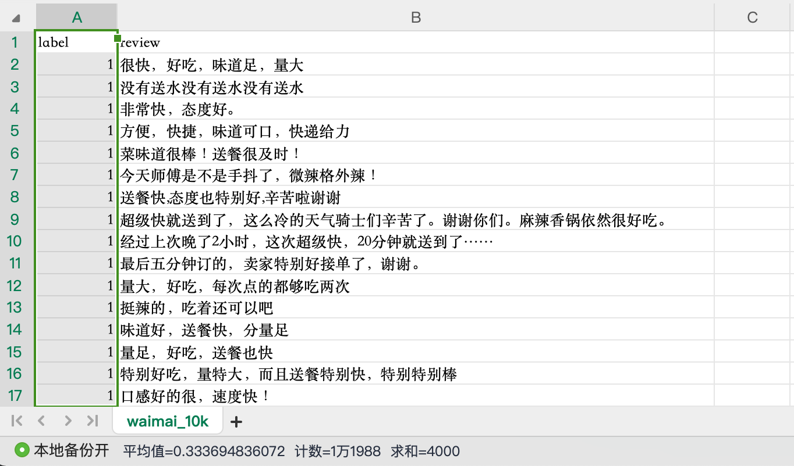
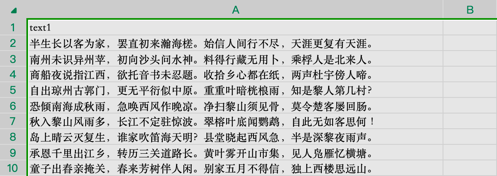
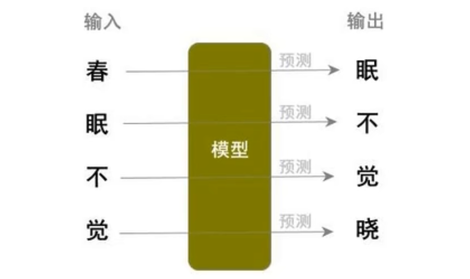

# 生成外面评论

## N-Gram

N-Gram语言模型是一种基于统计的语言模型，核心思想是通过**前N-1个词**预测下一个词出现的概率。它基于**马尔可夫假设**：假设一个词的出现仅与它前面的N-1个词相关，而与更早期的词无关。

N-Gram语言模型严格来说和机器学习没什么关联关系，本质就是基于概率进行预测。


**常见类型**

- **Unigram（1-Gram）**：仅考虑单个词的概率，与上下文无关。
- **Bigram（2-Gram）**：考虑前1个词对当前词的影响。
- **Trigram（3-Gram）**：考虑前2个词对当前词的影响。
- **高阶N-Gram（如4-Gram、5-Gram）**：需更大规模语料库支持


**优势**

- **原理直观**：基于统计频次，易于理解和实现。
- **计算快速**：可通过预计算N元频次表实现实时预测。
- **扩展性强**：支持并行化处理大规模语料库。

- **鲁棒性高**：对噪声数据不敏感，适合实际场景应用。
- **资源需求低**：无需复杂神经网络，硬件门槛低。
- **领域适配快**：在特定领域语料上微调即可快速适配。


**劣势**

- **数据稀疏性**：随着N增大，语料库中未出现的N元组合指数级增加，导致很多句子无法预测出来

- **短视性**：仅能捕捉局部上下文（N-1个词），无法理解长距离语义依赖（如“他说…他…”中的指代关系）。
- **语义缺失**：无法建模同义词、多义词等语义关联，如“银行”（金融机构/河岸）的歧义。

- **未登录词处理弱**：对训练语料中未出现的新词（OOV）无法预测，需依赖外部词典或分词工具辅助。

- **存储开销大**：高阶N-Gram需存储海量频次数据（如英文3-Gram模型可达TB级）。


## NPLM

NPLM的全称是"Neural Probabilistic Language Model"，即神经概率语言模型。这是一种基于神经网络的语言模型，用于生成自然语言 文本。最早是由Bengio在2003年的 "A Neural ProbabilisaticLanguage Model" 一文中提出来的，NPLM通过学习文本数据的概率分布，能够预测下一个单词或字符的概率，从而生成连贯的语句或段落。

NPLM是一个基于神经网络的模型，包括输入层、隐藏层(包含非线性激活函数)和输出层。和N-Gram模型一样，NPLM也是通过利用前N-1个词来预测第N个词，但是因为有神经网络的加持，NPLM能够更有效地处理稀疏数据和长距离依赖问题。也就是说NPLM在面对罕见词汇和捕捉距离较远的词之间的依赖关系时表现得更加出色，相较于N-Gram有着显著的优势。

其中NPLM主要由三部分组成:

- **输入层**: 将单词映射到连续的词向量空间，实际就是由文本的index转换成为embedding的过程。NPLM使用一个固定大小的上下文窗口来捕捉局部上下文信息。例如，如果上下文窗口大小为2，模型将使用当前单词的前两个单词作为输入来预测下一个单词。这个上下文窗口在训练过程中滑动，以覆盖整个文本序列。
- **隐藏层**: 通过非线性激活函数学习单词间的复杂关系，其中隐藏层可以自行调整。嵌入向量通过一个或多个隐藏层进行处理。隐藏层 通常包含非线性激活函数(如tanh或ReLU)，以捕捉更复杂的模式和关系。隐藏层的输出是一个固定大小的向量，它包含了上下文窗口中单词的组合信息。
- **输出层**: 隐藏层的输出通过一个线性变换(即全连接层)映射到词汇表的索引。输出层的输出是一个向量，其中每个元素对应词表中一个单词的概率。通常，使用softmax函数将这些输出转换为概率分布，使得所有输出值的总和为1。


### 原理理解

#### 语料准备

此处我们先手写几个文本用于演示训练的过程，同时直接用空格分词，便于快速理解其原理。

```python
class NPLMDataset(Dataset):
    
    def __init__(self, window_size=2):
        sentences = ["我 喜欢 学习 和 打篮球", "我 喜欢 去 旅游", "他 喜欢 去 骑行 和 打篮球", "我 热爱 骑行 以及 学习", "她 经常 去 旅游 和 拍照"]
        
        # 词汇表及索引映射构建
        words = []
        for sentence in sentences:
            words.extend(sentence.split())
        self.words = list(set(words))
        
        self.word2index = {word: index for index, word in enumerate(self.words)}
        self.index2word = {index: word for word, index in self.word2index.items()}
        
        # 构建数据集
        inputs = []
        targets = []
        for sentence in sentences:
            words = sentence.split()
            # 通过滑动来构建样本及标签
            for i in range(len(words) - window_size):
                inputs.append([self.word2index[word] for word in words[i:i + window_size]])
                targets.append(self.word2index[words[i + window_size]])
        
        self.inputs = torch.LongTensor(inputs)
        self.targets = torch.LongTensor(targets)

    def __getitem__(self, item):
        return self.inputs[item], self.targets[item]

    def __len__(self):
        return len(self.inputs)
```


#### 训练模型

基于上面的数据集，我们继续编写模型类：

```python
class NPLM(nn.Module):
    def __init__(self):
        """
        dim 表示词向量的维度
        """
        super(NPLM, self).__init__()

        self.dataset = NPLMDataset()

        # 定义词嵌入层 作为输入层
        dimension = 10
        self.vocab_size = self.dataset.words.__len__()
        self.embedding = nn.Embedding(num_embeddings=self.vocab_size, embedding_dim=dimension)

        # 定义一个线性层 作为隐藏层 隐藏层输出维度定位到20 ，输入维度定为 window_size * dimension（一个样本的单词数 * 词向量维度）
        # 输出输出大小都是可以改的，这里是为了计算方便
        self.hidden_size = 20
        self.hidden_layer = nn.Linear(self.dataset.window_size * dimension, self.hidden_size)

        # 定义一个线性层 作为输出层
        # 此时输入维度跟上一层输出保持一致，就可以不用转换shape了，输出维度则必须和词的个数保持一致，因为我们需要的是下一个词出现的概率，词汇表中的词都有可能
        # 输出维度大小就不像分类问题那样是固定的了
        self.output_layer = nn.Linear(self.hidden_size, self.vocab_size)

        # 损失函数
        # 使用 交叉熵 的损失函数，会自动让输出层使用softmax激活函数，否则我们在前向传播时，还是需要手动在调用一次如下的激活函数的
        # nn.Softmax(输出维度)
        self.loss_func = nn.CrossEntropyLoss()

        # 优化器 
        self.optimizer = optim.Adam(self.parameters(), lr=0.025)

        # 调度器，用于动态调节学习速率
        self.scheduler = ExponentialLR(optimizer=self.optimizer, gamma=0.85)

        # 数据集加载器 此处数据较少，每个批次就拿全部数据
        self.train_dl = DataLoader(self.dataset, batch_size=len(self.dataset), shuffle=True)

    def forward(self, inputs):
        """
        前向传播
        """
        # 词向量
        embedding_outputs: torch.Tensor = self.embedding(inputs)  # shape (batch_size, window_size, dimension)

        # 隐藏层
        # 构造函数中定义时，隐藏层输出维度是 window_size * dimension，所以要改变一下上一层输出的形状
        batch_size, window_size, dimension = embedding_outputs.shape
        outputs = embedding_outputs.reshape(batch_size, window_size * dimension)
        hidden_outputs = self.hidden_layer(outputs)

        # 输出层
        outputs = self.output_layer(hidden_outputs)

        return outputs

    def _train(self):
        self.train()

        train_loss, train_acc = 0, 0
        for x, y in self.train_dl:
            outputs: torch.Tensor = self(x)  # 前向传播
            loss = self.loss_func(outputs, y)  # 计算损失
            self.optimizer.zero_grad()  # 清空梯度
            loss.backward()  # 反向传播
            self.optimizer.step()  # 更新参数

            train_loss += loss.item()
            train_pred = outputs.argmax(dim=1)
            train_acc += (train_pred == y).sum().item()

        train_loss /= len(self.train_dl)  # 损失是按每个批次进行计算的
        train_acc /= len(self.train_dl.dataset)  # 精度按样本个数来计算

        return train_loss, train_acc

    def my_train(self, epochs=20):
        for i in range(epochs):
            train_loss, train_acc = self._train()
            print(f"当前是第 {i + 1} 轮，损失为: {train_loss}  精度为: {train_acc}")

            # 每完成一轮全量训练就更一下学习速率
            self.scheduler.step()
```

跑一下，看看损失和精度：

```python
if __name__ == '__main__':
    model = NPLM()
    model.my_train()
    """
    当前是第 10 轮，损失为: 0.6660164594650269  精度为: 0.75
    当前是第 11 轮，损失为: 0.621403157711029  精度为: 0.75
    当前是第 12 轮，损失为: 0.585934042930603  精度为: 0.875
    当前是第 13 轮，损失为: 0.5575916767120361  精度为: 0.875
    当前是第 14 轮，损失为: 0.5348514914512634  精度为: 0.875
    当前是第 15 轮，损失为: 0.5165199637413025  精度为: 0.875
    当前是第 16 轮，损失为: 0.5016577243804932  精度为: 0.875
    当前是第 17 轮，损失为: 0.48953160643577576  精度为: 0.875
    当前是第 18 轮，损失为: 0.4795757532119751  精度为: 0.875
    当前是第 19 轮，损失为: 0.47135525941848755  精度为: 0.875
    当前是第 20 轮，损失为: 0.46453484892845154  精度为: 0.875
    """
```


#### 结果预测

我们在写一个方法，根据我们的输入来预测一下个词：

```python
    def my_predict(self):
        input_words = ["我", "喜欢"]
        input_index = [self.dataset.word2index[word] for word in input_words]
        input_tensor = torch.LongTensor([input_index])  # 再套一层是因为再加一层批次

        # 预测结果
        predict_index = self(input_tensor)  # (batch_size, vocab_size)
        predict_word = self.dataset.index2word[predict_index.argmax(dim=1).item()]  # 因为batch_size为1，所以 dim=1 加不加都行
        print(predict_word)


if __name__ == '__main__':
    model = NPLM()
    model.my_train()
    model.my_predict()  # 去
```

现在我们只预测了一个词，我们可以多预测几个词，构成一个句子：

```python
    def my_predict(self):
        input_words = ["我", "喜欢"]
        content = "".join(input_words)
        for i in range(3):
            input_index = [self.dataset.word2index[word] for word in input_words]
            input_tensor = torch.LongTensor([input_index])  # 再套一层是因为再加一层批次

            # 预测结果
            predict_index = self(input_tensor)  # (batch_size, vocab_size)
            predict_word = self.dataset.index2word[predict_index.argmax(dim=1).item()]  # 因为batch_size为1，所以 dim=1 加不加都行

            # 拼接结果
            content += predict_word

            # 更新输入
            input_words.pop(0)
            input_words.append(predict_word)

        print(content)


if __name__ == '__main__':
    model = NPLM()
    model.my_train()
    model.my_predict()  # 我喜欢去旅游和
```

可以发现，因为我们训练预料的长度不一致，或者说当预料足够多时，某一句话的最后一个词很可能是其他句子开头的词，我们现在通过限制预测次数得到的结果，明显不是一个完整的句子。在预料足够多时，如果不限制次数，又会导致无限预测下去而不会自动停止。

基于这个问题，我们通常的思路是在每个训练样本的最后，都加上一个结束标志，让这个结束标志也作为一个训练集的一部分参与训练，当预测结果是这个结束标志时，就停止预测，然后输出结果。这时又有一个新问题了，就是当预料足够多时，挨个给样本添加结束标志显然是不现实的，因此，我们通过编码来灵活处理。

优化数据集：

```python
class NPLMDataset(Dataset):

    def __init__(self, window_size=2):
        sentences = ["我 喜欢 学习 和 打篮球", "我 喜欢 去 旅游", "他 喜欢 去 骑行 和 打篮球", "我 热爱 骑行 以及 学习", "她 经常 去 旅游 和 拍照"]

        self.window_size = window_size

        # 词汇表及索引映射构建
        words = ["END"]  # 在词汇表中直接先加上结束标志，让索引映射都带上
        for sentence in sentences:
            words.extend(sentence.split())
        self.words = list(set(words))
        
        self.word2index = {word: index for index, word in enumerate(self.words)}
        self.index2word = {index: word for word, index in self.word2index.items()}

        # 构建数据集
        inputs = []
        targets = []
        for sentence in sentences:
            words = sentence.split()
            words.append("END")  # 在每句话的最后加上标志词汇，构建的训练集也都带上
            # 通过滑动来构建样本及标签
            for i in range(len(words) - window_size):
                inputs.append([self.word2index[words[i]], self.word2index[words[i + 1]]])
                targets.append(self.word2index[words[i + 2]])

        self.inputs = torch.LongTensor(inputs)
        self.targets = torch.LongTensor(targets)

    def __getitem__(self, item):
        return self.inputs[item], self.targets[item]

    def __len__(self):
        return len(self.inputs)
```

修改预测方法：

```python
    def my_predict(self):
        input_words = ["我", "喜欢"]
        content = "".join(input_words)
        while True:
            input_index = [self.dataset.word2index[word] for word in input_words]
            input_tensor = torch.LongTensor([input_index])
            predict_index = self(input_tensor)
            predict_word = self.dataset.index2word[predict_index.argmax(dim=1).item()]
            
            if predict_word == "END":
                break
            
            content += predict_word
            input_words.pop(0)
            input_words.append(predict_word)

        print(content)
```

再来跑一次看看预测结果：

```python
if __name__ == '__main__':
    model = NPLM()
    model.my_train()
    model.my_predict()  # 我喜欢去旅游
```


### 实战训练

#### 数据准备

这里我们找了一份美团外卖评论的数据集，相对于百科数据，外卖评论的范围就比较集中了，对于小数据量的训练效果会更好一些。数据集构成如下：



差不多有1.2w条数据，然后第一列是标签，表示是否好评。但我们不是做分类，所以第一列是不需要的。另外，本次按照单个字来分词，这样其实相对于词语，其实词汇表会更小。基于现有AIGC实现的思路，我们本次也做一些调整：

1. 评论是有标点的，所以标点符号也需要保留到模型中，每个标点符号也算一个分词
2. 最好不提供开始的提示词，让系统随机生成一些评论
3. 生成一句完整的雨后能够自动停止，而不指定生成多少文字，让模型更加灵活
4. 滑动窗口大小可以灵活调整
5. 每句话的结束标识，也改成使用一个字符，前面的"END"是三个字符，本次使用"\n"


更新数据类：

```python
class NPLMDataset(Dataset):

    def __init__(self, window_size=5):  # 窗口越大效果越好，但也不能太大，会大大增加训练成本
        # 从csv加载数据
        data = pandas.read_csv("./data/waimai.csv")
        sentences = data.iloc[:, -1:].values
        self.sentences = [s[0] for s in sentences if len(s[0]) <= 30]  # 把多与30字的评论丢弃掉

        self.window_size = window_size

        # 结束标识改成换行符
        words = ["\n"]
        for sentence in self.sentences:
            words.extend([word for word in sentence])
        self.words = list(set(words))

        self.word2index = {word: index for index, word in enumerate(self.words)}
        self.index2word = {index: word for word, index in self.word2index.items()}

        # 构建数据集
        inputs = []
        targets = []
        for sentence in self.sentences:
            # 遍历每个字
            words = [word for word in sentence]
            # 结束标识改成换行符
            words.append("\n")

            for i in range(len(words) - window_size):
                inputs.append([self.word2index[word] for word in words[i:i + window_size]])
                targets.append(self.word2index[words[i + window_size]])

        self.inputs = torch.LongTensor(inputs)
        self.targets = torch.LongTensor(targets)

    def __getitem__(self, item):
        return self.inputs[item], self.targets[item]

    def __len__(self):
        return len(self.inputs)
```


#### 训练及预测

现在的数据量上去了，模型类也要做一些调整了。

构造方法中，词向量维度10维有点小了，改成50维，隐藏层输入维度会随着 window_size 和 dimension 动态调整，输出维度也和输入保持一致。每个批次的数据不能把整个数据集一起给过去了，每个批次给150个样本。

```python
class NPLM(nn.Module):
    def __init__(self):
        """
        dim 表示词向量的维度
        """
        super(NPLM, self).__init__()

        self.dataset = NPLMDataset()

        # 调整维度
        dimension = 50
        self.vocab_size = self.dataset.words.__len__()
        self.embedding = nn.Embedding(num_embeddings=self.vocab_size, embedding_dim=dimension)

        # 调整隐藏层、输出层维度
        self.hidden_layer = nn.Linear(self.dataset.window_size * dimension, self.dataset.window_size * dimension)
        self.output_layer = nn.Linear(self.dataset.window_size * dimension, self.vocab_size)

        self.loss_func = nn.CrossEntropyLoss()
        self.optimizer = optim.Adam(self.parameters(), lr=0.01)
        self.scheduler = ExponentialLR(optimizer=self.optimizer, gamma=0.9)

        # 调整批次大小
        self.train_dl = DataLoader(self.dataset, batch_size=200, shuffle=True, drop_last=True)
```

同时，当数据量大了之后，每训练一个轮次的时间会大幅增加。我们可以尝试没训练一轮就预测一次看看效果。通常在实际业务中，可能到达一轮训练轮次后，每完成一轮训练，就会保存一次模型，用于效果测试了。

这次我们预测，从随机样本中截取前五个字作为预测的起始样本。训练及预测方法修改如下：

```python
    def my_train(self, epochs=20):
        for i in range(epochs):
            train_loss, train_acc = self._train()

            print(f"第 {i + 1} 轮，损失: {train_loss}  精度: {train_acc}" + "  " + self.my_predict())

            # 每完成一轮全量训练就更一下学习速率
            self.scheduler.step()

            # 大于20轮之后才开始保存
            # if i > 40:
                # torch.save(self.state_dict(), f"./data/waimai-{epochs}.pth")

    def my_predict(self):
        # 随机拿一个样本截取前三个字
        while True:
            sentence = random.choice(self.dataset.sentences)
            if len(sentence) >= self.dataset.window_size:
                break

        sentence = sentence[:self.dataset.window_size]
        input_words = [word for word in sentence]
        while True:
            input_index = [self.dataset.word2index[word] for word in input_words]
            input_tensor = torch.LongTensor([input_index])
            predict_index = self(input_tensor)
            predict_word = self.dataset.index2word[predict_index.argmax(dim=1).item()]

            if predict_word == "\n":
                break

            sentence += predict_word

            # 避免无限生成
            if len(sentence) >= 30:
                break

            input_words.pop(0)
            input_words.append(predict_word)

        return sentence
```

跑跑看：

```python
if __name__ == '__main__':
    model = NPLM()
    model.my_train(50)
```

后10轮结果如下：

```shell
第 41 轮，损失: 1.5286648940272494  精度: 0.5987941516354318  味道很好，送餐员态度很好，赞一个
第 42 轮，损失: 1.5245028158548612  精度: 0.600050243681857  你给我放了？罐装的可以，就是送餐太慢了，两个小时才送到，而且
第 43 轮，损失: 1.5213856567559347  精度: 0.6010953122644828  感觉没有在店里吃的感觉猪红烧肉，好吃完美味
第 44 轮，损失: 1.518061885171733  精度: 0.6019996985379089  如果是肉片就更好吃了
第 45 轮，损失: 1.5159874535662308  精度: 0.6025925739838215  饺子到了都烂了，粥全撒了；卷油根本没吃饱
第 46 轮，损失: 1.513240455381827  精度: 0.6031754006933628  油撒的哪哪都是，除此以外送来问地址，真是无语了
第 47 轮，损失: 1.511128709109976  精度: 0.6030950108023916  就是送的太慢了，等了两个小时，送来的时候都凉了
第 48 轮，损失: 1.5087656658180282  精度: 0.6036275938300759  花钱了，少给我也不好吃
第 49 轮，损失: 1.5073310407834273  精度: 0.6043712003215596  根本没减单,该5块排骨
第 50 轮，损失: 1.5055741090889667  精度: 0.6046023212581018  送餐的师傅，服务态度很好，赞一个
```


#### 总结

NPLM虽然使用了神经网络，但是仍然是基于概率的，依赖预测词的前N个词语，对于更靠前的词就没法感知。因此对于生成的一句话，整体的语义其实还是很有问题的。


## 基于GRU

我们知道RNN通过隐藏状态，可以更好的理解语义。上面我们的数据集大概在一万条左右，数据量比较小，因此我们使用GRU模型来训练，看看外卖评论生成的效果。

对于数据集部分，我们直接复用NPLM部分的数据集就可以了，是完全一样的。

对于模型部分，我们需要做一些改造，完整模型类的代码如下：

```python
class RNNWaiMai(nn.Module):
    def __init__(self):
        """
        dim 表示词向量的维度
        """
        super(RNNWaiMai, self).__init__()

        self.dataset = NPLMDataset()

        # 输入层 词向量
        self.dimension = 50
        self.vocab_size = self.dataset.words.__len__()
        self.embedding = nn.Embedding(num_embeddings=self.vocab_size, embedding_dim=self.dimension)

        # GRU
        self.hidden_size = 300
        self.rnn = nn.GRU(input_size=self.dimension, hidden_size=self.hidden_size, num_layers=1, batch_first=True)

        # 输出层
        self.output_layer = nn.Linear(self.hidden_size, self.vocab_size)

        self.loss_func = nn.CrossEntropyLoss()
        self.optimizer = optim.Adam(self.parameters(), lr=0.01)
        self.scheduler = ExponentialLR(optimizer=self.optimizer, gamma=0.9)

        # 调整批次大小
        self.batch_size = 200
        self.train_dl = DataLoader(self.dataset, batch_size=self.batch_size, shuffle=True, drop_last=True)

    def init_hidden(self):
        return torch.zeros(self.rnn.num_layers, self.batch_size, self.hidden_size)

    def forward(self, inputs, hidden):
        """
        前向传播
        hidden 就是上一时间步的隐藏状态输出，首次需要初始化一个隐藏状态张量
        """
        # 词向量
        embedding_outputs: torch.Tensor = self.embedding(inputs)  # shape (batch_size, window_size, dimension)

        # rnn
        # (batch_size, window_size, hidden_size), (num_layers, batch_size, hidden_size)
        hidden_outputs, h = self.rnn(embedding_outputs, hidden)

        # 输出层
        outputs = self.output_layer(hidden_outputs[:, -1, :])

        return outputs, h

    def _train(self):
        self.train()  # 切换到训练模式

        train_loss, train_acc = 0, 0
        for x, y in self.train_dl:
            hidden = self.init_hidden()  # 初始化隐状态
            outputs, _ = self(x, hidden)  # 前向传播
            loss = self.loss_func(outputs, y)  # 计算损失
            self.optimizer.zero_grad()  # 清空梯度
            loss.backward()  # 反向传播
            self.optimizer.step()  # 更新参数

            train_loss += loss.item()
            train_pred = outputs.argmax(dim=1)
            train_acc += (train_pred == y).sum().item()

        train_loss /= len(self.train_dl)  # 损失是按每个批次进行计算的
        train_acc /= len(self.train_dl.dataset)  # 精度按样本个数来计算

        return train_loss, train_acc

    def my_train(self, epochs=20):
        for i in range(epochs):
            train_loss, train_acc = self._train()

            print(f"第 {i + 1} 轮，损失: {train_loss}  精度: {train_acc}" + "  " + self.my_predict())

            # 每完成一轮全量训练就更一下学习速率
            self.scheduler.step()

            # 大于20轮之后才开始保存
            # if i > 40:
                # torch.save(self.state_dict(), f"./data/waimai-{epochs}.pth")

    def my_predict(self):
        # 随机拿一个样本截取前三个字
        while True:
            sentence = random.choice(self.dataset.sentences)
            if len(sentence) >= self.dataset.window_size:
                break

        # 切换到推理模式
        self.eval()

        sentence = sentence[:self.dataset.window_size]
        input_words = [word for word in sentence]
        while True:
            input_index = [self.dataset.word2index[word] for word in input_words]
            input_tensor = torch.LongTensor([input_index])
            # 预测时也需要，但是封装的方法是按批次生成的，预测是每个批次就一个样本，所以这里直接手动写了
            hidden = torch.zeros(self.rnn.num_layers, 1, self.hidden_size)
            predict_index, _ = self(input_tensor, hidden)
            predict_word = self.dataset.index2word[predict_index.argmax(dim=1).item()]

            if predict_word == "\n":
                break

            sentence += predict_word

            # 避免无限生成
            if len(sentence) >= 30:
                break

            input_words.pop(0)
            input_words.append(predict_word)

        return sentence
```

还是50轮，结果如下：

```python
if __name__ == '__main__':
    model = RNNWaiMai()
    model.my_train(50)
```

```shell
第 41 轮，损失: 0.2521218158589522  精度: 0.9050092950811436  味道一般，不是很好，感觉菜上撒的酱
第 42 轮，损失: 0.24991151369673387  精度: 0.9055016831633422  太腻了，口感不好，其他还可以。
第 43 轮，损失: 0.24806473540588164  精度: 0.9054112445359996  味道还不错，但是送餐太慢了，等了一个半小时才送到，送餐员态度
第 44 轮，损失: 0.2461352677832187  精度: 0.9052504647540571  服务真是没话说！小伙子继续加油！
第 45 轮，损失: 0.24455358687660825  精度: 0.906797970155253  太慢！！鱼香肉丝没见几根肉丝
第 46 轮，损失: 0.2431258844657683  精度: 0.9068884087825956  煎饼很给力
第 47 轮，损失: 0.2418728510378832  精度: 0.906898457518967  看着很干净
第 48 轮，损失: 0.2405794847239431  精度: 0.9078832336833643  送饭太慢了
第 49 轮，损失: 0.23952211757421013  精度: 0.9080038185198211  垃圾百度送餐，多近的地方就没有一个小时内送到的
第 50 轮，损失: 0.23854760710202472  精度: 0.9083957192383058  米饭太硬了，有点辣
```

可以看到，GRU跑出来的结果确实好很多了。


# 生成古诗


## 数据准备

### 思路分析

要使用大模型生成诗句，首先得准备诗集用于训练。这里从网上找到一个训练集，总共包含近40万首诗。数据集文件形式如下：



有了原始数据集，我们就需要整理数据用于训练了。本次就使用其中的五言诗来训练，然后来生成五言诗。本次狗年数据集的思路要有一些改变：

- 此处需要构建一个 N vs N 的数据集，才能更好的满足训练要求，也就是说，X=[1, 2, 3, 4, 5, 6] Y=[2, 3, 4, 5, 6, 7]，在经过LSTM的记忆之后，才可以生成更加工整且字数为6的诗
- 训练集中的中文逗号和句号同样需要作为数据本身的一部分参与训练，同时仍然需要为每首诗的结尾加上一个结束标志，使得在推理的时候可以正常结束

因此，生成唐诗的核心就在于构建数据集上的区别，这很关键。RNN系列的模型是根据样本顺序逐词训练的，并具有记忆能力，因此此处训练的过程思路大致如下：



本次训练需要具备更强记忆能力的LSTM网络，并设置网络层数为3层，来获得更好的效果。


### 数据集构造

基于前面的思路，我们直接构建数据类。需要注意的是，本次我们将先单独训练模型在进行预测，所以需要保证数据集中数据的一致性、词汇表索引的一致性。

```python
class PoemDataset(Dataset):
    def __init__(self, window_size=6):  # 五言诗加上符号共六个字符
        # 从csv加载数据
        data = pandas.read_csv("./data/chinese_poems.csv")
        sentences = data.values  # 因为只有1列，所有直接取values就可以了

        self.window_size = window_size

        # 只使用五言诗作为训练集
        # 由于数据集中光五言诗都有17万多条，为了加快训练速度，我们取前1万条作为训练集就可以了
        poems = []
        sentence: str
        for sentence in sentences:
            # 第一个中文逗号在索引5的地方，说明是五言诗
            try:
                index = sentence[0].index("，")
            except:
                continue
            if index == 5:
                poems.append(sentence[0])

            if len(poems) == 10000:
                break

        # 结束标识改成换行符
        self.words = ["\n"]
        for poem in poems:
            for word in poem:
                if word not in self.words:
                    self.words.append(word)

        self.word2index = {word: index for index, word in enumerate(self.words)}
        self.index2word = {index: word for word, index in self.word2index.items()}

        # 构建数据集
        inputs = []
        targets = []
        for poem in poems:
            # 结束标识改成换行符
            words = [word for word in poem]
            words.append("\n")

            # 样本标签只需往后移一个就可以
            for i in range(len(words) - window_size):
                inputs.append([self.word2index[word] for word in words[i:i + window_size]])
                targets.append([self.word2index[word] for word in words[i + 1:i + window_size + 1]])

        self.inputs = torch.LongTensor(inputs)
        self.targets = torch.LongTensor(targets)

    def __getitem__(self, item):
        return self.inputs[item], self.targets[item]

    def __len__(self):
        return len(self.inputs)
```


## 基于LSTM

前面已经说过，我们将使用具有更强记忆能力的LSTM网络来训练。另外还有一个点，就是输出层（softmax）的输入参数数量保持大于词汇表的长度，这样进行多分类的效果相对更好一些，在lstm网络层后面，我们可以加几个全连接层来放大参数。

### 定义模型

```python
class Poem(nn.Module):
    def __init__(self):
        """
        dim 表示词向量的维度
        """
        super(Poem, self).__init__()

        self.dataset = PoemDataset()

        # 定义词向量层
        dimension = 100
        self.vocab_size = self.dataset.words.__len__()
        self.embedding = nn.Embedding(num_embeddings=self.vocab_size, embedding_dim=dimension)

        # LSTM
        # bidirectional 表示是否启用双向模式
        self.layers = 3
        self.hidden_size = 1024
        self.rnn = nn.LSTM(input_size=dimension, hidden_size=self.hidden_size, num_layers=self.layers, batch_first=True, bidirectional=False)

        # 多个全连接层逐步扩大参数
        self.full1 = nn.Linear(self.hidden_size, self.hidden_size * 2)
        self.full2 = nn.Linear(self.hidden_size * 2, self.hidden_size * 4)
        self.full3 = nn.Linear(self.hidden_size * 4, self.vocab_size)

        # 下面的学习速率是经过多次调整之后确定的经验值，以下取值肯定不是最优的
        # 由于训练速度很慢，所以尝试了几次把几次中第一次损失最小的lr保留下来了
        self.loss_func = nn.CrossEntropyLoss()
        self.optimizer = optim.Adam(self.parameters(), lr=0.001)
        self.scheduler = ExponentialLR(optimizer=self.optimizer, gamma=0.95)

        self.batch_size = 200
        self.train_dl = DataLoader(self.dataset, batch_size=self.batch_size, shuffle=True, drop_last=True)

    def init_hidden(self):
        """
        LSTM还有一个单元状态
        """
        hidden = torch.zeros(self.rnn.num_layers, self.batch_size, self.hidden_size)
        cell = torch.zeros(self.rnn.num_layers, self.batch_size, self.hidden_size)

        return hidden, cell

    def forward(self, inputs, hidden):
        """
        前向传播
        """
        # 词向量
        embedding_outputs: torch.Tensor = self.embedding(inputs)  # shape (batch_size, window_size, dimension)

        # LSTM
        # 返回结果第二个是隐藏状态及单元状态参数的元组
        hidden_outputs, hc = self.rnn(embedding_outputs, hidden)

        # 三个全连接层，前两层要使用激活函数处理一下，最后一层作在计算损失时，交叉熵损失函数会对最后一维应用softmax
        # 因为本次我们标签也是六个值，所以就不能只取最后一个字的结果参数了，每个字都需要保留，每个字都需要预测一个结果
        outputs = self.full1(hidden_outputs)
        outputs = torch.tanh(outputs)
        outputs = self.full2(outputs)
        outputs = torch.tanh(outputs)
        outputs = self.full3(outputs)  # shape (batch_size, window_size, vocab_size)

        return outputs, hc

    def _train(self):
        self.train()

        train_loss, train_acc = 0, 0
        for x, y in self.train_dl:
            outputs, _ = self(x, self.init_hidden())  # 前向传播

            # 计算损失
            # 交叉熵会对最后一维应用softmax，第一个参数是预测值，预测值的最后一维就是各个词出现的概率，其大小是vocab_size
            # 所以预测结果通常会比实际值多一维，多出来的那一维应用softmax后和实际值计算损失
            # 交叉熵又最多只能接受二维的参数，所以预测结果必须是二维，实际结果则必须是一维，所以这里进行一下reshape
            outputs = outputs.reshape(self.batch_size * self.dataset.window_size, -1)
            y = y.reshape(self.batch_size * self.dataset.window_size)
            loss = self.loss_func(outputs, y)

            self.optimizer.zero_grad()  # 清空梯度
            loss.backward()  # 反向传播
            self.optimizer.step()  # 更新参数

            train_loss += loss.item()
            train_pred = outputs.argmax(dim=1)
            train_acc += (train_pred == y).sum().item()

        train_loss /= len(self.train_dl)  # 损失是按每个批次进行计算的
        train_acc /= len(self.train_dl.dataset)  # 精度按样本个数来计算

        return train_loss, train_acc
```


### 模型训练

要提前说明的是，RNN类型的网络都是按序列逐个词进行训练的，正是因为这样，它才能具备记忆样本前后词关联关系的能力。

实现训练方法：

```python
    def my_train(self, epochs=30):
        for i in range(epochs):
            train_loss, train_acc = self._train()

            print(f"第 {i + 1} 轮，损失: {train_loss}  精度: {train_acc}")

            # 每完成一轮全量训练就更一下学习速率
            self.scheduler.step()

        # 跑完所有轮次后保存模型
        torch.save(self.state_dict(), f"./models/poems-{epochs}.pth")
```

现在LSTM的训练就会比之前慢很多了，一个是因为算法本身的复杂度增加，我们也增加了多个网络层。因此，实际训练时推荐使用GPU机器。由于当前没有GPU就先训练30轮，把模型保存下来在做预测。

```python
if __name__ == '__main__':
    model = Poem()
    model.my_train()
```

训练过程的损失集精度如下，可以看到精度其实还很低，可以尝试继续调整lr并增加训练轮次：

```shell
第 21 轮，损失: 1.367857505440187  精度: 4.38349895289543
第 22 轮，损失: 1.3545805580159116  精度: 4.386234358789487
第 23 轮，损失: 1.3427078115388686  精度: 4.387734153771641
第 24 轮，损失: 1.3311201872279466  精度: 4.389643984446163
第 25 轮，损失: 1.3199921556900251  精度: 4.390794285918714
第 26 轮，损失: 1.309558543864851  精度: 4.391862029869311
第 27 轮，损失: 1.2999115717568586  精度: 4.392660085914861
第 28 轮，损失: 1.2908858705459711  精度: 4.392949037241698
第 29 轮，损失: 1.2819984144313745  精度: 4.393521436060575
第 30 轮，损失: 1.2736079844477943  精度: 4.394358018949704
```


### 模型推理

基于已有的模型，实现一个函数，接收起始的第一个字符，然后生成诗句。这里有一个重要的点，我们基于LSTM是具有记忆功能的，也就是说，从我们给定的首个字符开始，以及后续每次生成的新字符，在推理过程中的隐藏状态和单元状态都是需要延续下来的，而不是每生成一个字就初始化一个新的隐藏状态和单元状态，这和之前外卖评论的推理是有区别的。

```python
def my_predict(model: Poem, ds: PoemDataset, start_word: str):
    # 切换到推理模式
    model.eval()

    # 为每个其实字符都生成一首诗
    with torch.no_grad():
        # 预测时也需要，但是封装的方法是按批次生成的，预测是每个批次就一个样本
        hidden = torch.zeros(model.layers, 1, model.hidden_size)
        cell = torch.zeros(model.layers, 1, model.hidden_size)
        status = (hidden, cell)

        # 避免无限生成
        for i in range(24):
            word = start_word[-1]

            input_index = [ds.word2index[word]]
            input_tensor = torch.LongTensor([input_index])

            # status 是随着推理进行不断更新的
            predict_index, status = model(input_tensor, status)  # (batch_size, window_size, vocab_size)

            # 在输入文本最后一个字时，才开始保存预测的结果
            if i == len(start_word) - 1:
                # 因为这里按每个批次只有1个样本，且每个样本里面就1个词，所以我们直接拿最后一维中，概率值最大的那个值的索引。也就是预测词对应词汇表的索引
                predict_word = ds.index2word[predict_index.argmax(dim=2).item()]

                if predict_word == "\n":
                    break

                start_word += predict_word

    return start_word
```

给定单个或多个字符，来推理结果：

```python
if __name__ == '__main__':
    # 加载模型参数
    model = Poem()
    model.load_state_dict(torch.load("./models/poems-30.pth"))

    # 数据集
    ds = PoemDataset()

    r1 = my_predict(model, ds, "胡")
    print(r1)  # 胡为久不安？强行时拓翼，攲立欲遗丹。谁药相如渴，独

    r2 = my_predict(model, ds, "雨")
    print(r2)  # 雨，江上有歌声。

    r3 = my_predict(model, ds, "百丈门")
    print(r3)  # 百丈门者，相送白云汀。
```


