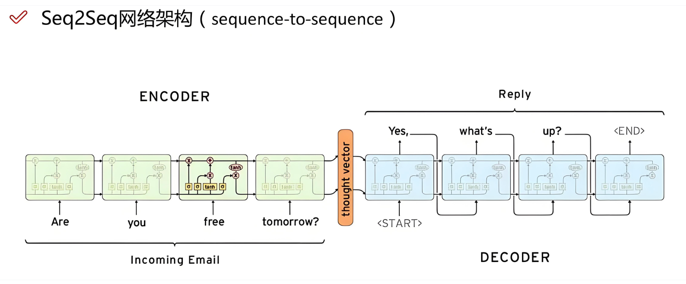
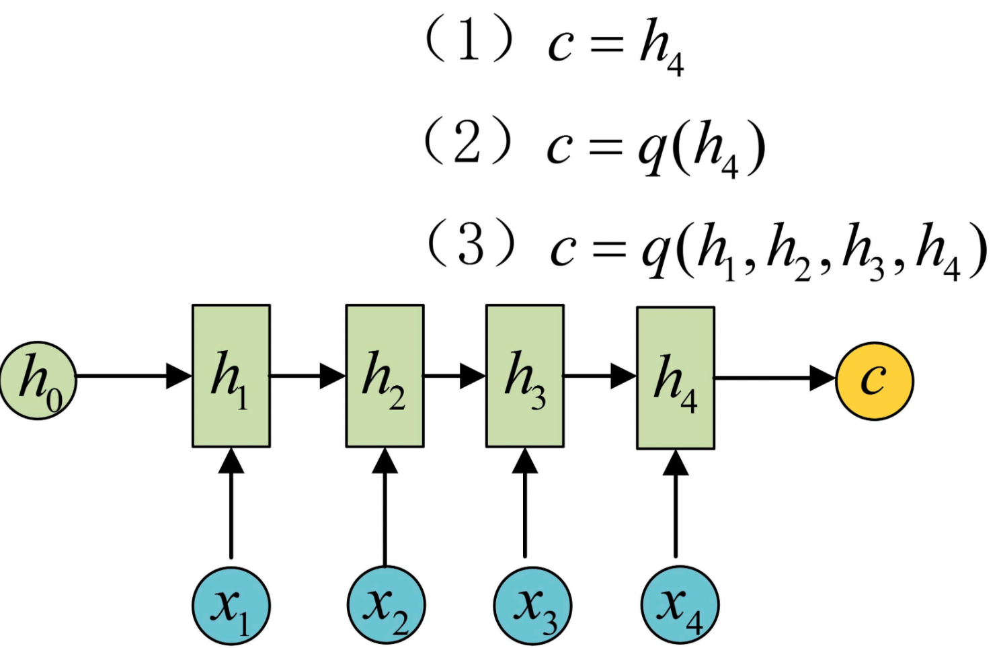
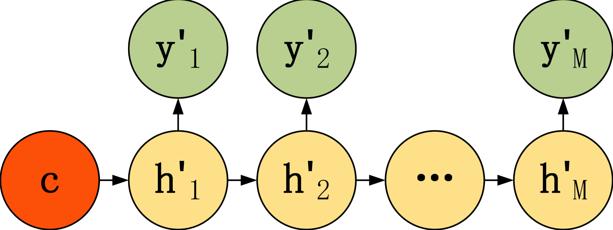
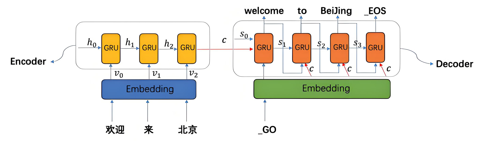
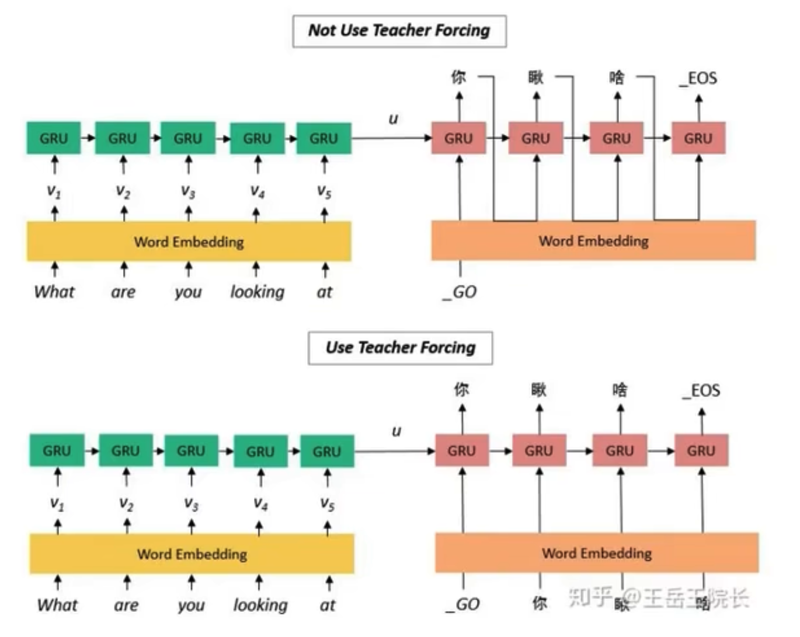
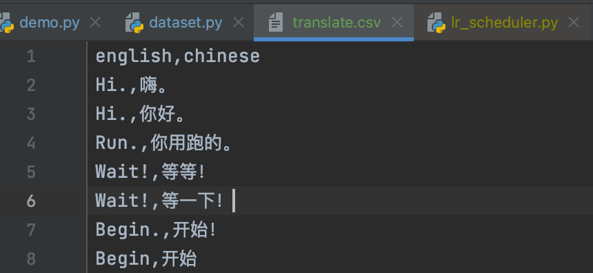
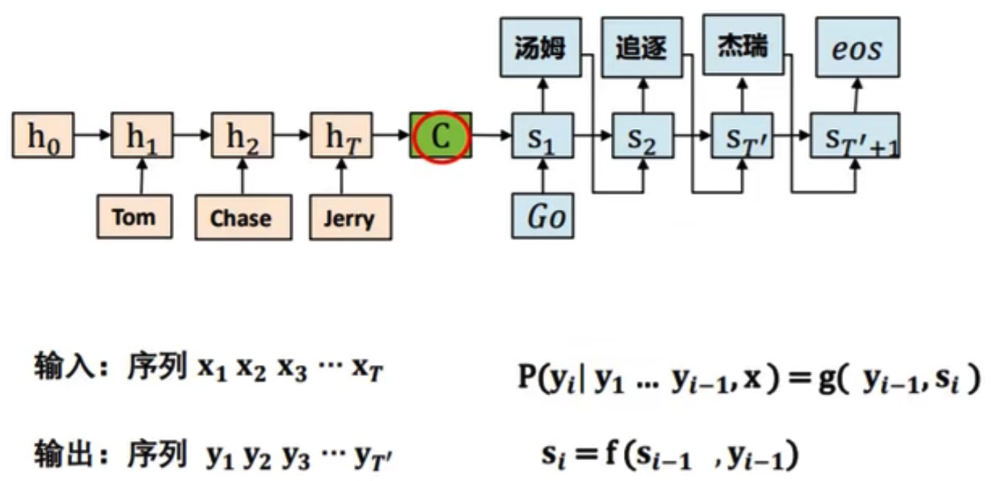
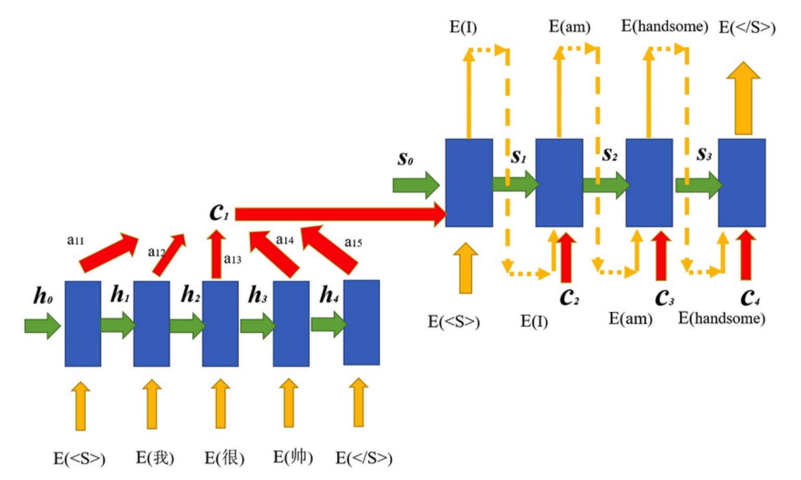

## seq2seq

### 概述

序列到序列模型（Sequence To Sequence Model，简称seq2seq）是一种广泛应用于自然语言处理（NLP）任务重的深度学习模型架构。它能够将一个输入序列转换为一个输出序列，常用于机器翻译、文本摘要、对话系统等应用场景。

seq2seq模型的核心思想是使用两个神经网络，一个用于编码输入序列（Encoder），另一个用于解码输出序列（Decoder）。编码器将输入序列转换为一个固定长度的上下文向量（Context Vector），解码器根据这个上下文向量生成输出序列。

上下文向量C可以直接使用最后一个神经元的隐藏状态h_n表示；也可以在最后一个神经元的隐藏状态上进行某种变换而得到；也可以使用所有神经元的隐藏状态 h_1, h_2, ... , h_n 计算得到。




**Encoder（编码器）**

- 编码器是seq2seq模型中的一部分，负责将输入序列转换为固定长度的上下文向量
- 它使用循环神经网络（RNN）或其变体（LSTM、GRU）来实现这一转换过程
- 在编码过程中，编码器逐个读取输入序列中的元素，并更新其内部隐藏状态
- 编码完成后，编码器将最终的隐藏状态或经过某种变换的隐藏状态作为上下文向量传递给解码器


**Decoder（解码器）**

- 解码器是seq2seq模型中的另一部分，负责从上下文向量中生成输出序列
- 它同样使用循环神经（RNN）或其变体（LSTM、GRU）来实现这一转换过程
- 在每个时间步，解码器根据上一个时间步的输出、当前的隐藏状态和上下文向量来生成当前时间步的输出
- 解码器通过逐步生成输出序列中的每个元素，最终完成整个序列的生成任务


### 解析

seq2seq模型是输出的长度不确定时采用的模型，这种情况一般是在机器翻译的任务中出现，将一句中文翻译成英文，翻译出来的结果长度相对于原文长度是可长可短不确定的。

seq2seq属于Encoder-Decoder结构的一种，基本思想就是利用两个RNN分别作为Encoder和Decoder。

Encoder负责将输入序列转换成指定长度的向量，这个向量就可以看成这个序列的语义，这个过程称为编码，获取语义向量最近单的方式就是直接将最后一个输出的隐藏状态作为语义向量C。也可以对最后一个隐藏状态做一个变换后得到语义向量，还可以将输入序列的所有隐藏状态做一个变换得到语义向量。



上面描述的编码器是一个单向的循环神经网络，每个时间步的隐藏状态只取决于该时间步及之前的输入子序列。我们也可以使用双向循环神经网络构造编码器（LSTM类初始化参数bidirectional=True）。编码器每个时间步的隐藏状态同时取决于该时间步之前和之后的子序列（包括当前时间步的输入），并编码了整个序列的信息。


Decoder则负责根据语义向量生成指定的序列，这个过程也称为解码。最简单的方式是将Encoder得到的语义向量作为初始状态输入到Decoder的RNN中，得到输出序列。可以看到，上一时间步的输出会作为当前时间步的输入，而且语义向量C只作为初始状态参与运算，后面的运算都与语义向量C无关。



Decoder还有另一种处理方式，就是语义向量C参与所有时间步的运算，如下图，上一时间步的输出仍然作为当前时间步的输入，但语义向量C会参与所有时间步的运算。




seq2seq模型通过端到端的训练方式，将输入序列和目标序列直接关联起来，避免了传统方法中繁琐的特征工程和手工设计的对齐步骤。这使得模型能够自动学习从输入到输出的映射关系，提高了序列转换任务的性能和效率。


### 教师强制

通常为了更好的进行训练，Decoder除了接收来自于Encoder的源语言上下文向量外，也会有自己的输入。通常以  `<SOS>`（start of sequence）+目标语言 开始，这样模型就能够以正确的单词为基础来生成下一个单词，直到生成最后的结束标识符`<EOS>`（end of sequence）。这样不仅可以提升训练速度，减少误差，也可以确保文本生成的准确性。这种做法称为：教师强制（Teacher Forcing）。

但教师强制也存在缺点，在训练时Decoder的输入是真实的目标序列中的词，而在实际推理时，Decoder只能依赖其自身预测生成的词（Decoder的输入只有一个`<SOS>`标记开始，并不存在目标序列，因为预测的目的就是生成目标序列），这将会导致**曝光偏差问题**（即训练和预测阶段的数据分布不匹配，从而影响模型的泛化能力）。通常为了解决这个问题，会使用**计划采样**（Scheduled Smapling）技术，在训练过程中使用一定比例的Decoder自身预测结果作为输入。




## 实现思路

到目前为止，我们了解seq2seq模型的基本概念和一些实现方式，可以看到sq2seq模型可以很好的处理多对多的输入输出场景，而翻译正好是多对多文本转换的一个经典场景。基于前面介绍的知识，下面来梳理一下，翻译模型实现的思路：

1. 翻译训练数据集需要有原文本和目标文本
2. Encoder的输入是 原文本 + `<EOS>`，输出语义向量C；Decoder输入是 `<SOS>` + 目标文本（教师强制），输出是 目标文本 + `<EOS>`
3. 输入输出样本的要使用`<PAD>`占位符填充，使得每个样本的长度是一致的，为了方便 Encoder和Decoder的输入输出使用一样的长度（Encoder和Decoder分别是两个不同的RNN网络，各自的输入输出长度可以不一样）
4. 翻译模型在推理时，输出同样是多个结果，和我们之前推理都是输出单个字符是有差异的，所以在推理时的处理逻辑和以前也是有差异的，需要拿到多个预测结果的索引逐个转换成真实字符


## 数据准备

在kaggle上找到一份中英翻译的数据集，大概有2.5w个样本，其中样本长短句都有。我们为了快速学习训练，我们取5000条，文本长度适中样本。同时，我们把文本中的中英文符号都替换成空字符串，降低一下数据处理的复杂度。

原始数据如下：



先从原始数据集中抽取我们需要的样本，并完成字符替换，然后分词处理：

```python
import re
import jieba
import pandas

data = pandas.read_csv("./data/translate.csv")

# 获取列名
en_name, zh_name = data.columns.values

# 处理数据
rows = []
for line in data.values:
    en_sentence, zh_sentence = line

    # 替换英文句子中的符号
    # 英文直接按空格分词，并只取分词后词语数量大于5小于等于8的样本
    en_sentence = re.sub(r"[\",!.?，！。“”？​]", "", en_sentence)
    en_words = [word for word in en_sentence.split() if word.strip()]

    # 处理中文
    zh_sentence = re.sub(r"[\",!.?，！。“”？​]", "", zh_sentence)
    zh_words = jieba.lcut(zh_sentence)

    if 5 < len(en_words) <= 8 and 5 < len(zh_words) <= 8:
        rows.append([" ".join(zh_words), " ".join(en_words)])

    if len(rows) == 5000:
        break

df = pandas.DataFrame(rows, columns=[zh_name, en_name])
df.to_csv("./data/translate2.csv", index=False)
```

至此我们得到了一个新的数据集文件，我们已经处理了其中的特殊符号，清除了多余的空格，并且源语言和目标语言的词语都按空格分开。那么接下来我们要准备数据集，这里也和以前的数据集有些差异：

1. 这里需要构建两个词汇表，即源语言和目标语言的词汇表，并分别为两种语言的单词和索引的相互映射
2. 数据集每次返回要返回三个数据分别是Encoder的输入，Decoder的输入和Decoder的输出（Decoder的输入是因为教师强制才使用的）

根据以上两点，我们先把要使用的词汇表以及各种映射关系都处理好并保存起来，便于后续复用：

```python
import numpy
import pandas

data = pandas.read_csv("./data/translate2.csv")

zh_words = []
en_words = []
samples = []

for line in data.values:
    zh_sentence, en_sentence = line

    ens_words = en_sentence.split()
    zhs_words = zh_sentence.split()

    # 分别保存中英文词汇
    for zh_word in zhs_words:
        if zh_word not in zh_words:
            zh_words.append(zh_word)

    for en_word in ens_words:
        if en_word not in en_words:
            en_words.append(en_word)

    # 把分词后的样本也保存起来
    samples.append([zhs_words, ens_words])

# 构建中英文的词汇索引映射
# 这里同时加入 占位符、开始标识符、结束标识符
zh_word2index = {"<PAD>": 0, "<SOS>": 1, "<EOS>": 2}
zh_word2index.update({word: index for index, word in enumerate(zh_words, start=3)})
zh_index2word = {index: word for word, index in zh_word2index.items()}
en_word2index = {"<PAD>": 0, "<SOS>": 1, "<EOS>": 2}
en_word2index.update({word: index for index, word in enumerate(en_words, start=3)})
en_index2word = {index: word for word, index in en_word2index.items()}

# 把样本转换成各自的索引
# 这里还要做一件事，就是把所有样本的长度都填充为相同长度
# 前面从原始数据获取的英文样本最多8个，通常中文分词结果不会比这个多，以防万一，我们在加上标识符的基础上，保持样本词语长度为10
sample_len = 10
encoder_inputs = []
decoder_inputs = []  # 教师强制需要的解码器输入
decoder_outputs = []

for sample in samples:
    zhs_words, ens_words = sample

    encoder_inputs.append([zh_word2index[word] for word in zhs_words] + [zh_word2index["<PAD>"]] * (sample_len - len(zhs_words) - 1) + [zh_word2index["<EOS>"]])
    decoder_inputs.append([en_word2index["<SOS>"]] + [en_word2index[word] for word in ens_words] + [en_word2index["<PAD>"]] * (sample_len - len(ens_words) - 1))
    decoder_outputs.append([en_word2index[word] for word in ens_words] + [en_word2index["<PAD>"]] * (sample_len - len(ens_words) - 1) + [en_word2index["<EOS>"]])

# 使用numpy的savez来存储这些数据
# 存储为一个对象，使用时按对应的key加载即可
numpy.savez("./data/translate-data.npz", zh_word2index=zh_word2index, zh_index2word=zh_index2word,
            en_word2index=en_word2index, en_index2word=en_index2word, encoder_inputs=encoder_inputs,
            decoder_inputs=decoder_inputs, decoder_outputs=decoder_outputs,
            zh_vocab_size=len(zh_word2index), en_vocab_size=len(en_word2index), sample_len=sample_len)
```

构建Dataset类：

```python
class TranslateDataset(Dataset):
    def __init__(self):
        # 从npz加载
        data = numpy.load("./data/translate-data.npz", allow_pickle=True)

        self.zh_word2index = data["zh_word2index"].item()  # 转成字典，默认是 ndarray 实例
        self.zh_index2word = data["zh_index2word"].item()
        self.en_word2index = data["en_word2index"].item()
        self.en_index2word = data["en_index2word"].item()
        self.encoder_inputs = torch.LongTensor(data["encoder_inputs"])
        self.decoder_inputs = torch.LongTensor(data["decoder_inputs"])
        self.decoder_outputs = torch.LongTensor(data["decoder_outputs"])
        self.zh_vocab_size = data["zh_vocab_size"]
        self.en_vocab_size = data["en_vocab_size"]
        self.sample_len = data["sample_len"]

    def __getitem__(self, item):
        return self.encoder_inputs[item], self.decoder_inputs[item], self.decoder_outputs[item]

    def __len__(self):
        return len(self.encoder_inputs)
```


## 模型定义

现在开始定义模型，我们先按照最简单的思路完成模型的定义，至于效果，后面再逐步进行优化，先跑起来。

```python
class Seq2Seq(nn.Module):
    def __init__(self):
        super(Seq2Seq, self).__init__()

        self.dataset = TranslateDataset()

        # 定义词嵌入
        dimension = 24
        self.encoder_embedding = nn.Embedding(num_embeddings=self.dataset.zh_vocab_size, embedding_dim=dimension)
        self.decoder_embedding = nn.Embedding(num_embeddings=self.dataset.en_vocab_size, embedding_dim=dimension)

        # 定义编码器和解码器两个RNN网络，由于此处文本都不太长，所以我们直接使用GRU
        self.hidden_size = 1024
        self.num_layers = 1
        self.encoder = nn.GRU(dimension, self.hidden_size, self.num_layers, batch_first=True)
        self.decoder = nn.GRU(dimension, self.hidden_size, self.num_layers, batch_first=True)

        # 定义全连接层控制输出参数个数
        # 因为目标语言是英文，所以输出参数个数就应该是英文单词的数量
        self.fc = nn.Linear(self.hidden_size, self.dataset.en_vocab_size)

        # 损失函数、参数优化器、动态学习速率
        self.loss_func = nn.CrossEntropyLoss()
        self.optimizer = optim.Adam(self.parameters(), lr=0.001)
        self.scheduler = ExponentialLR(optimizer=self.optimizer, gamma=0.9)

        # 这里是整数，最后一批数据刚好100，就可以不丢弃了
        self.batch_size = 100
        self.train_dl = DataLoader(self.dataset, batch_size=self.batch_size, shuffle=True, drop_last=False)

    def init_hidden(self, batch_size=0):
        if batch_size == 0:
            batch_size = self.batch_size

        return torch.zeros(self.num_layers, batch_size, self.hidden_size)

    def forward(self, encoder_input, decoder_input, hidden):
        """
        注意这里入参，我们要为编码器准备输入及初始的隐藏状态
        为解码器也要准备输入
        """
        # 词向量
        # shape (batch_size, sample_len, dimension)
        encoder_embedding: torch.Tensor = self.encoder_embedding(encoder_input)

        # 对于编码器我们只要它最后返回的隐藏状态参数，也就是语义向量C
        # context shape (num_layers, batch_size, hidden_size)
        _, context = self.encoder(encoder_embedding, hidden)

        # 解码器
        # outputs shape (batch_size, sample_len, en_vocab_size)
        decoder_embedding = self.decoder_embedding(decoder_input)
        outputs, _ = self.decoder(decoder_embedding, context)

        # 全连接层
        outputs = self.fc(outputs)

        return outputs

    def _train(self):
        self.train()

        train_loss, train_acc = 0, 0
        for encoder_input, decoder_input, decoder_output in self.train_dl:
            outputs = self(encoder_input, decoder_input, self.init_hidden())  # 前向传播

            # 计算损失
            # 预测结果把前两维合并，整个预测结果转换成2维；预期结果转换成1维
            outputs = outputs.reshape(self.batch_size * self.dataset.sample_len, -1)
            decoder_output = decoder_output.reshape(self.batch_size * self.dataset.sample_len)
            loss = self.loss_func(outputs, decoder_output)

            self.optimizer.zero_grad()  # 清空梯度
            loss.backward()  # 反向传播
            self.optimizer.step()  # 更新参数

            train_loss += loss.item()
            train_pred = outputs.argmax(dim=1)
            train_acc += (train_pred == decoder_output).sum().item()

        train_loss /= len(self.train_dl)  # 损失是按每个批次进行计算的
        train_acc /= len(self.train_dl.dataset)  # 精度按样本个数来计算

        return train_loss, train_acc
```


## 训练推理

本次还是没训练一轮就预测一次，可以动态的看到效果，为了方便，预测时直接从`translate2.csv`文件中复制三句中文用于预测，来看看效果。**注意：推理时解码器是没有目标样本作为输入的，只能提供一个 `<SOS>` + `<PAD>` 组成的输入。训练时因为教师强制的原因，才把真实样本作为解码器的输入。**

下面来实现训练和预测方法：

```python
    def my_train(self, epochs=20):
        for i in range(epochs):
            train_loss, train_acc = self._train()

            print(f"第 {i + 1} 轮，损失: {train_loss}  精度: {train_acc}")

            # 预测一下
            self.my_predict()

            # 每完成一轮全量训练就更一下学习速率
            self.scheduler.step()

        # 跑完所有轮次后保存模型
        torch.save(self.state_dict(), f"./models/translate-s2s-{epochs}.pth")

    def my_predict(self):
        # 切换到推理模式
        self.eval()

        # 三个预测样本
        texts = ["那个 男孩 否认 偷 了 自行车", "我 的 妹妹 有時 為 我們 做 晚餐", "您 能 把 收音机 开 小声 一点 吗"]

        for text in texts:
            # 分词并填充
            words = text.split()
            words += ["<PAD>"] * (self.dataset.sample_len - len(words) - 1) + ["<EOS>"]

            # 编码器输入
            encoder_input = torch.LongTensor([self.dataset.zh_word2index[word] for word in words])
            encoder_input = encoder_input.reshape(1, -1)  # 增加一个维度，表示1批次
            hidden = self.init_hidden(1)  # 此处就一个批次

            # 解码器输入
            decoder_input = torch.LongTensor([self.dataset.en_word2index["<SOS>"]] + (self.dataset.sample_len - 1) * [
                self.dataset.en_word2index["<PAD>"]])
            decoder_input = decoder_input.reshape(1, -1)

            # 推理
            outputs = self(encoder_input, decoder_input, hidden)

            # 预测结果是多个字符，要把每个预测结果都转成真是字符
            # 因为outputs shape (batch_size, sample_len, en_vocab_size)， 所以直接算最后一维最大值的索引
            results = []
            outputs = outputs.argmax(dim=-1)

            # 遍历第二维，拿到每个字符的索引
            for tensor in torch.unbind(outputs, dim=1):
                index = tensor.item()
                predict_word = self.dataset.en_index2word[index]
                if predict_word not in ("<EOS>", "<SOS>", "<PAD>"):
                    results.append(predict_word)

            print(text.replace(" ", ""), " -> ", " ".join(results))
```

训练20轮，看看翻译效果：

```python
if __name__ == '__main__':
    model = Seq2Seq()
    model.my_train()
```

最后两轮输出结果如下：

```python
第 19 轮，损失: 1.2527294850349426  精度: 7.1832
那个男孩否认偷了自行车  ->  The was a a a a a
我的妹妹有時為我們做晚餐  ->  My My been a a a a
您能把收音机开小声一点吗  ->  Can you you you you the
第 20 轮，损失: 1.2060777282714843  精度: 7.2892
那个男孩否认偷了自行车  ->  The Tom a a a a a
我的妹妹有時為我們做晚餐  ->  My My been a a a a
您能把收音机开小声一点吗  ->  Can you you you you the
```


## 模型优化

从上面的结果看，翻译的效果很不理想，现在我们从能想到的几个方面着手优化一下：

1. 我们本次使用了填充字符，在词嵌入时我们可以申明填充索引来减小填充字符对其他正常字符的影响。在计算损失时，也可以忽略掉填充字符
2. 我们RNN网络的层数可以增加，并开启Encoder的双向循环（注意：开启双向循环RNN的网络层数会翻一倍，初始化隐藏状态时层数也要翻倍）
3. 还可以在增加一层全连接层，增加一次非线性变换，同时将部分神经元参数置为0，减少过拟合

改进后的模型定义如下：

```python
class Seq2Seq(nn.Module):
    def __init__(self):
        super(Seq2Seq, self).__init__()

        self.dataset = TranslateDataset()

        dimension = 24
        self.encoder_embedding = nn.Embedding(num_embeddings=self.dataset.zh_vocab_size, embedding_dim=dimension,
                                              padding_idx=0)  # 指定填充字符的索引
        self.decoder_embedding = nn.Embedding(num_embeddings=self.dataset.en_vocab_size, embedding_dim=dimension,
                                              padding_idx=0)

        self.hidden_size = 1024
        self.num_layers = 2
        # 编码器（bidirectional=True）开启双向循环，会自动将层数翻倍，所以解码器层数我们手动翻个倍
        self.encoder = nn.GRU(dimension, self.hidden_size, self.num_layers, batch_first=True, bidirectional=True)
        self.decoder = nn.GRU(dimension, self.hidden_size, self.num_layers * 2, batch_first=True)

        # 改为两个全连接层
        self.fc1 = nn.Linear(self.hidden_size, self.hidden_size * 2)
        self.fc2 = nn.Linear(self.hidden_size * 2, self.dataset.en_vocab_size)

        # 损失函数、参数优化器、动态学习速率
        self.loss_func = nn.CrossEntropyLoss(ignore_index=0)  # 忽略填充字符
        self.optimizer = optim.Adam(self.parameters(), lr=0.001)
        self.scheduler = ExponentialLR(optimizer=self.optimizer, gamma=0.9)

        # 这里是整数，最后一批数据刚好100，就可以不丢弃了
        self.batch_size = 100
        self.train_dl = DataLoader(self.dataset, batch_size=self.batch_size, shuffle=True, drop_last=False)

    def init_hidden(self, batch_size=0):
        if batch_size == 0:
            batch_size = self.batch_size

        # 注意，这里初始化隐藏状态的layer也应该翻倍
        return torch.zeros(self.num_layers * 2, batch_size, self.hidden_size)

    def forward(self, encoder_input, decoder_input, hidden):
        """
        注意这里入参，我们要为编码器准备输入及初始的隐藏状态
        为解码器也要准备输入
        """
        # 词向量
        # shape (batch_size, sample_len, dimension)
        encoder_embedding: torch.Tensor = self.encoder_embedding(encoder_input)

        # 对于编码器我们只要它最后返回的隐藏状态参数，也就是语义向量C
        # encoder_outputs shape (batch_size, sample_len, 2*hidden_size)  # 隐藏参数因为双向而翻倍（正向、反向）
        # context shape (num_layers*2, batch_size, hidden_size)  # 隐藏状态层数因为双向而翻倍（正向、反向）
        encoder_outputs, context = self.encoder(encoder_embedding, hidden)

        # 解码器
        # outputs shape (batch_size, sample_len, en_vocab_size)
        decoder_embedding = self.decoder_embedding(decoder_input)
        outputs, _ = self.decoder(decoder_embedding, context)

        # 全连接层
        # 第一层进行非线性变换，并将部分神经元输出置为 0，以减少模型对训练数据的过拟合，提升泛化能力。
        outputs = self.fc1(outputs)
        outputs = torch.tanh(outputs)
        outputs = torch.dropout(outputs, 0.2, train=True)

        outputs = self.fc2(outputs)

        return outputs

    def _train(self):
        self.train()

        train_loss, train_acc = 0, 0
        for encoder_input, decoder_input, decoder_output in self.train_dl:
            outputs = self(encoder_input, decoder_input, self.init_hidden())  # 前向传播

            # 计算损失
            # 预测结果把前两维合并，整个预测结果转换成2维；预期结果转换成1维
            outputs = outputs.reshape(self.batch_size * self.dataset.sample_len, -1)
            decoder_output = decoder_output.reshape(self.batch_size * self.dataset.sample_len)
            loss = self.loss_func(outputs, decoder_output)

            self.optimizer.zero_grad()  # 清空梯度
            loss.backward()  # 反向传播
            self.optimizer.step()  # 更新参数

            train_loss += loss.item()
            train_pred = outputs.argmax(dim=1)
            train_acc += (train_pred == decoder_output).sum().item()

        train_loss /= len(self.train_dl)  # 损失是按每个批次进行计算的
        train_acc /= len(self.train_dl.dataset)  # 精度按样本个数来计算

        return train_loss, train_acc
```

再跑20轮，看看结果：

```python
第 19 轮，损失: 0.06492864094674587  精度: 9.9288
那个男孩否认偷了自行车  ->  That boy denies denies the the
我的妹妹有時為我們做晚餐  ->  My sister sometimes makes makes dinner
您能把收音机开小声一点吗  ->  Could you turn down down down
第 20 轮，损失: 0.05800787180662155  精度: 9.9316
那个男孩否认偷了自行车  ->  That boy denies denies the the
我的妹妹有時為我們做晚餐  ->  My sister I makes makes dinner
您能把收音机开小声一点吗  ->  Could you you down down down
```

可以看到整体的损失、精度和翻译结果都有明显的改善。但是，最终效果还不是很好，最主要的原因还是我们使用了教师强制，使得模型失去了很多泛化的能力，显得比较刻板。

因此，我们要再做一个优化，就是使用前面提到的计划采样，我们让Decoder只使用50%比例的教师强制输入，其他50%则使用填充数据。


## 计划采样

前面有提到不使用教师强制时，我们应该是使用一个开始标识符（`<SOS>`）的输入作为起始输入，然后再把预测结果作为下一个时间步的输入，知道序列处理完成。这个过程说起来挺简单，但其实不太好实现，因为RNN处理序列中的每一样是内部代码了，不太好改，我们这里实现一个简化版，直接提供 开始标识符 + 填充字符（`<SOS>`+`<PAD>`）作为输入，相关特征其内部的隐藏状态会进行传递。

这部分逻辑在forward方法中实现，注意把预测方法中 inference参数改成True：

```python
    def forward(self, encoder_input, decoder_input, hidden, inference=False):
        """
        注意这里入参，我们要为编码器准备输入及初始的隐藏状态
        为解码器也要准备输入
        """
        # 词向量
        encoder_embedding: torch.Tensor = self.encoder_embedding(encoder_input)
        _, context = self.encoder(encoder_embedding, hidden)

        # 推理的时候就不需要了，因为批次只有1批次，decoder输入数据也是专门构造的
        if not inference:
            # 50%概率修改Decoder的输入
            rate = random.random()
            if rate < 0.5:
                decoder_input = torch.zeros((self.batch_size, self.dataset.sample_len)).long()  # 占位符的索引是0
                decoder_input[:, 0] = self.dataset.en_word2index["<SOS>"]  # 把每个样本开头的索引改成 其实标识符 的索引

        decoder_embedding = self.decoder_embedding(decoder_input)
        outputs, _ = self.decoder(decoder_embedding, context)

        # 全连接层
        outputs = self.fc1(outputs)
        outputs = torch.tanh(outputs)
        outputs = torch.dropout(outputs, 0.2, train=True)

        outputs = self.fc2(outputs)

        return outputs
```

再跑20轮，可以看到最后两轮训练的结果基本是全部正确了：

```python
第 19 轮，损失: 0.15408543840050698  精度: 9.7176
那个男孩否认偷了自行车  ->  That boy denies stealing the bicycle
我的妹妹有時為我們做晚餐  ->  My sister sometimes makes our dinner
您能把收音机开小声一点吗  ->  Could you turn down the radio
第 20 轮，损失: 0.12619921877980234  精度: 9.7786
那个男孩否认偷了自行车  ->  That boy denies stealing the bicycle
我的妹妹有時為我們做晚餐  ->  My sister sometimes makes our dinner
您能把收音机开小声一点吗  ->  Could you turn down the radio
```


## 模型定义改进

前面我们将Encoder和Decoder都定义到了seq2seq类中，我们也可以把Encoder和Decoder单独抽象出来定义成各自独立的类，可以被其他模型服用，下面是完整的模型类定义：

```python
class Encoder(nn.Module):
    def __init__(self, dimension, hidden_size, num_layers, dataset: TranslateDataset):
        super(Encoder, self).__init__()

        self.hidden_size = hidden_size
        self.num_layers = num_layers
        self.dataset = dataset

        self.embedding = nn.Embedding(num_embeddings=self.dataset.zh_vocab_size, embedding_dim=dimension, padding_idx=0)
        self.encoder = nn.GRU(dimension, self.hidden_size, self.num_layers, batch_first=True, bidirectional=True)

    def forward(self, encoder_input, hidden):
        embeddings = self.embedding(encoder_input)
        _, context = self.encoder(embeddings, hidden)

        return context


class Decoder(nn.Module):
    def __init__(self, dimension, hidden_size, num_layers, batch_size, dataset: TranslateDataset):
        super(Decoder, self).__init__()

        self.hidden_size = hidden_size
        self.num_layers = num_layers
        self.batch_size = batch_size
        self.dataset = dataset
				
        # 注意num_embeddings是英文单词的词汇数量
        self.embedding = nn.Embedding(num_embeddings=self.dataset.en_vocab_size, embedding_dim=dimension, padding_idx=0)
        self.decoder = nn.GRU(dimension, self.hidden_size, self.num_layers * 2, batch_first=True)

        # 两个全连接层
        self.fc1 = nn.Linear(self.hidden_size, self.hidden_size * 2)
        self.fc2 = nn.Linear(self.hidden_size * 2, self.dataset.en_vocab_size)

    def forward(self, decoder_input, context, inference=False):
        # 解码器的计划采样
        if not inference:
            rate = random.random()
            if rate < 0.5:
                decoder_input = torch.zeros((self.batch_size, self.dataset.sample_len)).long()
                decoder_input[:, 0] = self.dataset.en_word2index["<SOS>"]

        embeddings = self.embedding(decoder_input)
        outputs, _ = self.decoder(embeddings, context)

        # 全连接层
        outputs = self.fc1(outputs)
        outputs = torch.tanh(outputs)
        outputs = torch.dropout(outputs, 0.2, train=True)
        outputs = self.fc2(outputs)

        return outputs


class Seq2Seq(nn.Module):
    def __init__(self):
        super(Seq2Seq, self).__init__()

        self.dataset = TranslateDataset()

        dimension = 24
        self.num_layers = 2
        self.batch_size = 100
        self.hidden_size = 1024

        # 添加编码器解码器
        self.encoder = Encoder(dimension, self.hidden_size, self.num_layers, self.dataset)
        self.decoder = Decoder(dimension, self.hidden_size, self.num_layers, self.batch_size, self.dataset)

        # 损失函数、参数优化器、动态学习速率
        self.loss_func = nn.CrossEntropyLoss()
        self.optimizer = optim.Adam(self.parameters(), lr=0.001)
        self.scheduler = ExponentialLR(optimizer=self.optimizer, gamma=0.9)

        # 这里是整数，最后一批数据刚好100，就可以不丢弃了
        self.train_dl = DataLoader(self.dataset, batch_size=self.batch_size, shuffle=True, drop_last=False)

    def init_hidden(self, batch_size=0):
        if batch_size == 0:
            batch_size = self.batch_size

        # 注意，这里初始化隐藏状态的layer也应该翻倍
        return torch.zeros(self.num_layers * 2, batch_size, self.hidden_size)

    def forward(self, encoder_input, decoder_input, hidden, inference=False):
        context = self.encoder(encoder_input, hidden)
        outputs = self.decoder(decoder_input, context, inference)
        return outputs

    def _train(self):
        self.train()

        train_loss, train_acc = 0, 0
        for encoder_input, decoder_input, decoder_output in self.train_dl:
            outputs = self(encoder_input, decoder_input, self.init_hidden())  # 前向传播

            # 计算损失
            # 预测结果把前两维合并，整个预测结果转换成2维；预期结果转换成1维
            outputs = outputs.reshape(self.batch_size * self.dataset.sample_len, -1)
            decoder_output = decoder_output.reshape(self.batch_size * self.dataset.sample_len)
            loss = self.loss_func(outputs, decoder_output)

            self.optimizer.zero_grad()  # 清空梯度
            loss.backward()  # 反向传播
            self.optimizer.step()  # 更新参数

            train_loss += loss.item()
            train_pred = outputs.argmax(dim=1)
            train_acc += (train_pred == decoder_output).sum().item()

        train_loss /= len(self.train_dl)  # 损失是按每个批次进行计算的
        train_acc /= len(self.train_dl.dataset)  # 精度按样本个数来计算

        return train_loss, train_acc

    def my_train(self, epochs=20):
        for i in range(epochs):
            train_loss, train_acc = self._train()

            print(f"第 {i + 1} 轮，损失: {train_loss}  精度: {train_acc}")

            # 预测一下
            self.my_predict()

            # 每完成一轮全量训练就更一下学习速率
            self.scheduler.step()

        # 跑完所有轮次后保存模型
        # torch.save(self.state_dict(), f"./data/translate-s2s-{epochs}.pth")

    def my_predict(self):
        # 切换到推理模式
        self.eval()

        # 三个预测样本
        texts = ["那个 男孩 否认 偷 了 自行车", "我 的 妹妹 有時 為 我們 做 晚餐", "您 能 把 收音机 开 小声 一点 吗"]

        for text in texts:
            # 分词并填充
            words = text.split()
            words += ["<PAD>"] * (self.dataset.sample_len - len(words) - 1) + ["<EOS>"]

            # 编码器输入
            encoder_input = torch.LongTensor([self.dataset.zh_word2index[word] for word in words])
            encoder_input = encoder_input.reshape(1, -1)  # 增加一个维度，表示1批次
            hidden = self.init_hidden(1)  # 此处就一个批次

            # 解码器输入
            decoder_input = torch.LongTensor([self.dataset.en_word2index["<SOS>"]] + (self.dataset.sample_len - 1) * [
                self.dataset.en_word2index["<PAD>"]])
            decoder_input = decoder_input.reshape(1, -1)

            # 推理
            outputs = self(encoder_input, decoder_input, hidden, True)

            # 预测结果是多个字符，要把每个预测结果都转成真是字符
            # 因为outputs shape (batch_size, sample_len, en_vocab_size)， 所以直接算最后一维最大值的索引
            results = []
            outputs = outputs.argmax(dim=-1)

            # 遍历第二维，拿到每个字符的索引
            for tensor in torch.unbind(outputs, dim=1):
                index = tensor.item()
                predict_word = self.dataset.en_index2word[index]
                if predict_word not in ("<EOS>", "<SOS>", "<PAD>"):
                    results.append(predict_word)

            print(text.replace(" ", ""), " -> ", " ".join(results))
```

这样的修改对效果无影响，只是演示torch模型类的不同使用方法。


## 注意力机制

> 从这里开始，后面后续对于分词数量，逐步使用Token数量来表示，即一个文本分词之后的词汇数量，就用Token数量来表示

### 矩阵乘法

这里介绍的矩阵乘法，不是单纯的的来讲怎么计算，是要从神经网络训练过程中来分析一下与矩阵乘法相关的一些结论：

1. 在训练过程中RNN网络输入数据的形状通常是 (batch_size，tokens，dimension) ，输出的形状是 (batch_size, tokens, hidden_size)，隐藏状态的形状是（num_layers, batch_size, hidden_size）
2. 从1中的输入可以看，第一维表示批次，即有多少个样本；第二维表示每个样本分词后的token数量（不同样本会使用填充字符补齐为相同数量的token）；第三位则是每个token的词向量（经Embedding层输出）
3. 矩阵乘法中，两个矩阵相乘的过程是 第一个矩阵逐行依次与第二个矩阵的列做点积运算，每做一次点积就得到新矩阵中的一个值。根据点积相似度，计算结果越大的值，说明进行点积运算的 行 和 列 相似度越高
4. 像1中三维数组，要如何进行矩阵乘法呢，其实很简单，忽略第一维，第二维第三位就是一个矩阵。比如输入数据就是有 batch_size 个矩阵，每个矩阵其实就表示了一个样本，而矩阵中的每一行就是一个token的词向量。**一个关键的点，如果使用另外一个 token的词向量（转成二维，每行只有一个元素），来与样本矩阵来做矩阵乘法，根据点积相似度，我们就可以知道这另外的toekn与我们样本中哪个词更相似，或者说关联关系更密切。**


### seq2seq的局限性

在seq2seq模型中，编码器将整个输入序列压缩成一个固定长度的向量，这会导致信息丢失，尤其是在处理长序列时。解码器只能依赖于这个单一的上下文向量来生成输出序列，这限制了模型的表达能力。


从前面的这张图中可以看到，在解码器中生成预测值时，针对每个词的生成，所使用的C是完全一样的。而语义向量C是有输入序列每个token按顺序经编码器处理得到，这意味着在解码器中不论生成哪个结果（welcome、to、beijing）时，输入序列中的所有token对输出的任一token的影响力是相同的，这也使得在推理结果的时候没有侧重点。就像人类在发呆时，注意力不集中，眼睛观察到的画面是没有焦点的（也叫分心模型）。

比如输入一个英文句子：Tom chase Jerry，seq2seq模型将逐步生成单词：“汤姆”、“追逐”、“杰瑞”，在翻译“杰瑞”这个中文单词的时候分心模型里面的每个单词对于翻译目标单词“杰瑞”的贡献是相同的，这很明显不合理，显然“Jerry”对于翻译成“杰瑞”更为重要，但是分心模型是无法体现这一点的，这也就是引入**注意力机制**的原因。



在没有注意力机制的模型中，当输入序列token较少时影响不大，但如果输入序列token很多，所有的语义完全通过一个中间语义向量来表示，那么token自身的信息就会严重丢失，从而严重影响到模型推理的效果。


### 什么是注意力机制

为了解决传统seq2seq模型的局限性，注意力机制（Attention Mechanism）就出现了。注意力机制允许解码器在生成每个目标时，动态关注输入序列中的不同部分，从而捕捉到更丰富的上下文信息。比如上面的例子，如果引入注意力机制的话，那么在翻译“杰瑞”的时候，输入序列中的“Jerry”应该是影响最大的。

因此，目标句子中的每个token都应该学会其对应的源句子中每个token的注意里分配的概率信息。这意味着在生成每个单词Yi的时候，由原来都是相同的中间语义向量C，替换成根据当前生成token而不断变化的Ci。这里也是注意力机制的关键，引入了注意力机制后的Encoder-Decoder框架如下图所示：



如图中的Ci就可能包含，源序列中每个token对当前推理影响大小的注意力信息。

那么在生成目标序列中的某个token时，要如何知道Attention模型所需要的输入序列中每个token的注意力分布概率值呢？比如前面“Tom chase Jerry”的例子，假设输入序列中每个token对于生成“汤姆”时，各输入token的注意力分布概率是: (Tom, 0.6) (chase, 0.2) (Jerry, 0.2)，现在就是要弄明白如何计算得到这样的概率值。

以上图来说，在时刻 i，Decoder生成结果 Yi，要获得输入序列中每个token对 Yi 来说的注意力分配概率分布，那么可以用上一时刻 i-1 时Decoder推理 Yi-1 时输出的隐藏状态 Si-1（初始隐藏状态S0是Encoder最后输出的隐藏状态），去和输入序列中Encoder中的每个token输出的隐藏状态进行对比，即通过 F(hj, Si-1) 函数来获得目标结果 Yi 和每个输入token对应的对齐可能性。函数F根据注意力的类别不同，算法会有所差异，但原理都是相同的。然后把函数F的输出经过Softmax进行归一化就得到了符合概率分布取值区间的注意力分配概率分布熟知。

上图中为了生成 handsome，则需要利用输出序列中 S2 与 输入序列中每一个隐藏状态进行计算，并使用Softmax计算得到注意力的分布概率。


## 注意力机制实现

通常情况可以将模型分成四部分：Encoder、Attention、Decoder、Seq2Seq，它们的分工如下：

1. Encoder层负责输出 [h1, h2, ..., hm] 和 s0
2. Attention层负责根据Encoder的输出，生成 [a1, a2, ..., am]及上下文向量
3. Decoder层则负责处理Attention层的输出，求解出最后的输出结果
4. Seq2Seq则扮演程序调度的角色，组织各层之间的调用关系

数据部分可以直接复用前面的代码，没有变化。


### Encoder

编码器和传统seq2seq的编码器有一点差异，因为我们使用注意力机制直接建模输入序列中元素间的依赖关系，不再需要通过隐藏状态隐式学习序列的顺序，同时也降低参数量和计算的复杂度，就不再需要初始的隐藏状态了。

同时，要考虑RNN网络设置多层、开启双向循环时的处理逻辑，便于Decoder中使用输出的产物。

```python
class Encoder(nn.Module):
    def __init__(self, dimension, hidden_size, num_layers, vocab_size, bidirectional: bool = False):
        super(Encoder, self).__init__()

        self.embedding = nn.Embedding(num_embeddings=vocab_size, embedding_dim=dimension, padding_idx=0)
        self.encoder = nn.GRU(dimension, hidden_size, num_layers, batch_first=True, bidirectional=bidirectional)

    def forward(self, encoder_input):
        """
        encoder_input shape (batch_size, token_num)
        """
        # outputs shape (batch_size, token_num, hidden_size * [1 / 2(双向循环)])
        # hidden shape (num_layers  * [1 / 2(双向循环), batch_size, hidden_size)
        embeddings = self.embedding(encoder_input)
        outputs, hidden = self.encoder(embeddings)

        # 为了确保最后输出的最后一维能对齐便于后续计算，先根据encoder是否双向循环做一下hidden的形状变换
        if self.encoder.bidirectional:
            num_layers, batch_size, hidden_size = hidden.shape
            hidden = hidden.reshape((int(num_layers / 2), batch_size, hidden_size * 2))

        # 把hidden的批次放到第一维，然后把可能的多层网络加权平均为一层
        hidden = hidden.permute([1, 0, 2])
        hidden = hidden.mean(dim=1)  # (batch_size, hidden_size * [1 / 2(双向循环))

        # outputs 抛开批次不看，保存的就是每个token的隐藏状态
        # hidden 将作为 Decoder的初始隐藏状态 s0
        return outputs, hidden
```


### Attention

Attention部分其实就是计算出Decoder当前时间步的隐藏状态与Encoder的输出每个token隐藏状态的注意力权重，就是说哪个token的状态信息占比应该更高，然后根据权重分配，得到包含注意力权重的新的上下文向量。

Attention可以用一个函数来封装，为了保持一致性，也将其封装为模型类。

```python
class Attention(nn.Module):
    def __init__(self):
        super(Attention, self).__init__()

    def forward(self, decoder_state: torch.Tensor, encoder_outputs: torch.Tensor):
        """
        decoder_state 就是解码器当前时间步输出的隐藏状态，shape (batch_size, hidden_size)
        encoder_outputs shape (batch_size, token_num, hidden_size)
        """

        # 为了能跟outputs做计算，我们做一下以下变形，形状变成 (batch_size, hidden_size, 1)
        decoder_state = decoder_state.unsqueeze(dim=-1)

        # 现在来计算 decoder_state 与 outputs中每个token的相似度
        # 最后一维中的一个元素就是Encoder中样本每个token与Decoder当前时间步的点积，值越大表示相似度越高
        scores = torch.matmul(encoder_outputs, decoder_state)  # scores shape (batch_size, token_num, 1)

        # 使用Softmax计算decoder_state 与 outputs中每个token的相似度，也就是注意力分布概率
        batch_size, token_num, _ = scores.shape
        scores = scores.reshape((batch_size, -1))
        scores = torch.softmax(scores, dim=-1)  # 计算最后一维，scores shape (batch_size, token_num, 1)
        scores = scores.reshape((batch_size, token_num, -1))  # 得到注意力概率后，再变形回去用于后续计算

        # 得到每个注意力分布概率，那么我们就使用每个token的概率值，与对应对应token的隐藏状态做内积运算
        encoder_outputs = scores * encoder_outputs  # 简单说就是把隐藏状态都按注意力权重做缩放

        # 然后把输入序列所有token的隐藏状态加权平均（也可以求和，平均值小一点，降低运算量）得到当前时间步的上下文向量
        # 第二维因为加权平均变成只有一个元素了，shape 变为 (batch_size, hidden_size)
        context = encoder_outputs.mean(dim=1)

        return context
```


### Decoder

在计划采样的部分，当时实现了一个简化的推理输入，使用 开始标识符 + 填充字符（`<SOS>`+`<PAD>`）作为输入，但真正的计划采样，只需要给一个开始标识符作为起始输入，然后在推理下一个目标时，使用上一次推理输出的结果来作为输入，这和注意力机制的处理过程是相契合的，所以这里一并实现真正的计划采样逻辑。

需要注意的是，前面解码器中我们是一口气将整个目标序列都推理出来，是没办法处理这里逐个处理序列元素的需求的，所以这里的decoder将不能再使用GRU类了，要使用GRUCell类。

```python
class Decoder(nn.Module):
    def __init__(self, dimension, hidden_size, num_layers, vocab_size):
        super(Decoder, self).__init__()

        # 词嵌入
        self.embedding = nn.Embedding(num_embeddings=vocab_size, embedding_dim=dimension, padding_idx=0)

        # 使用GRUCell类，每次就处理批次中所有序列的某一个元素，所以输出结果形状是 (batch_size, hidden_size)
        self.decoder = nn.GRUCell(dimension, hidden_size, num_layers)

        # attention层
        self.attention = Attention()

        # dropout层，按比例丢弃一些参数，防止过拟合
        self.dropout = nn.Dropout(0.3)

        # 全连接层，这里就搞一个就可以了
        # 输入的维度因为要拼接 上下文和当前时间步的状态，所以要加倍
        self.fc = nn.Linear(hidden_size * 2, vocab_size)

    def forward(self, decoder_input, pre_state, encoder_outputs, inference=False):
        embeddings = self.embedding(decoder_input)

        # 手动保存推理结果
        decoder_outputs = []

        # 解码器的计划采样
        teacher_forcing = False
        if not inference:
            rate = random.random()
            if rate < 0.5:
                teacher_forcing = True

        # 逐个推理
        # decoder推理的输入序列第一个元素都是开始标识符，在样本序列的索引0处
        pre_input = embeddings[:, 0, :]

        for i in range(decoder_input.shape[1]):  # 推理目标的个数和输入序列长度一样
            # 推理，首次使用的就是encoder输出的hidden，然后得到一个新的hidden
            pre_state = self.decoder(pre_input, pre_state)
            pre_state = self.dropout(pre_state)  # (batch_size, hidden_size)

            # 获取注意力权重处理后的上下文向量
            context = self.attention(pre_state, encoder_outputs)

            # 将当前时间步的上下文向量和隐藏状态进行拼接，然后经全连接层来预测
            # pred shape (batch_size, vocab_size)
            pred = self.fc(torch.cat((context, pre_state), dim=-1))
            decoder_outputs.append(pred)

            # 最后一次不需要在准备输入了
            if i == decoder_input.shape[1] - 1:
                break

            # 根据是否使用教师强制决定下一次的输入
            if teacher_forcing:
                pre_input = embeddings[:, i + 1, :]
            else:
                # 获取预测结果的下标
                pred_indexes = pred.argmax(dim=-1)
                pre_input = self.embedding(pred_indexes)

        # 把收集到的推理结果转成tensor，并处理成以批次开头
        decoder_outputs = torch.stack(decoder_outputs, dim=0)  # 将每个时间步的预测结果，沿新的第一维拼接诚心的张量
        decoder_outputs = decoder_outputs.transpose(0, 1)  # 交换两个维度的位置，和 permute 类似，(batch_size, token_num, vocab_size)

        return decoder_outputs
```


### seq2seq

Seq2seq 和前面的定义差别不大，主要是此处不再需要为Encoder生成初始隐藏状态。这里要注意一下，如果Encoder开启双向循环，那么Decoder的hid den_size是需要翻倍的。

```python
class Seq2Seq(nn.Module):
    def __init__(self):
        super(Seq2Seq, self).__init__()

        self.dataset = TranslateDataset()

        dimension = 24
        self.num_layers = 2
        self.batch_size = 100
        self.hidden_size = 1024

        # 注意编码器解码器的词汇表大小各是各的
        self.encoder = Encoder(dimension, self.hidden_size, self.num_layers, self.dataset.zh_vocab_size)
        self.decoder = Decoder(dimension, self.hidden_size, self.num_layers, self.dataset.en_vocab_size)

        # 损失函数、参数优化器、动态学习速率
        self.loss_func = nn.CrossEntropyLoss(ignore_index=0)
        self.optimizer = optim.Adam(self.parameters(), lr=0.001)
        self.scheduler = ExponentialLR(optimizer=self.optimizer, gamma=0.9)

        # 这里是整数，最后一批数据刚好100，就可以不丢弃了
        self.train_dl = DataLoader(self.dataset, batch_size=self.batch_size, shuffle=True, drop_last=False)

    def forward(self, encoder_input, decoder_input, inference=False):
        encoder_outputs, hidden = self.encoder(encoder_input)
        outputs = self.decoder(decoder_input, hidden, encoder_outputs, inference)
        return outputs

    def _train(self):
        self.train()

        train_loss, train_acc = 0, 0
        for encoder_input, decoder_input, decoder_output in self.train_dl:
            # 前向传播
            pred_outputs = self(encoder_input, decoder_input)

            # 计算损失
            # sample_len 就是 token_num，都表示一个样本中有几个分词，也就是token
            pred_outputs = pred_outputs.reshape(self.batch_size * self.dataset.sample_len, -1)
            decoder_output = decoder_output.reshape(self.batch_size * self.dataset.sample_len)
            loss = self.loss_func(pred_outputs, decoder_output)

            self.optimizer.zero_grad()  # 清空梯度
            loss.backward()  # 反向传播
            self.optimizer.step()  # 更新参数

            train_loss += loss.item()
            train_pred = pred_outputs.argmax(dim=-1)
            train_acc += (train_pred == decoder_output).sum().item()

        train_loss /= len(self.train_dl)  # 损失是按每个批次进行计算的
        train_acc /= len(self.train_dl.dataset)  # 精度按样本个数来计算

        return train_loss, train_acc
```

继续编写训练和预测方法，和之前的代码只有很小的差别，预测方法中Decoder的输入其实只需要输入一个开始标识符，这里仍然保留占位符是用于控制Decoder中的循环次数：

```python
    def my_train(self, epochs=20):
        for i in range(epochs):
            train_loss, train_acc = self._train()

            print(f"第 {i + 1} 轮，损失: {train_loss}  精度: {train_acc}")

            # 预测一下
            self.my_predict()

            # 每完成一轮全量训练就更一下学习速率
            self.scheduler.step()

        # 跑完所有轮次后保存模型
        torch.save(self.state_dict(), f"./models/translate-s2s-{epochs}.pth")

    def my_predict(self):
        # 切换到推理模式
        self.eval()

        # 三个预测样本
        texts = ["那个 男孩 否认 偷 了 自行车", "我 的 妹妹 有時 為 我們 做 晚餐", "您 能 把 收音机 开 小声 一点 吗"]

        for text in texts:
            # 分词并填充
            words = text.split()
            words += ["<PAD>"] * (self.dataset.sample_len - len(words) - 1) + ["<EOS>"]

            # 编码器输入
            encoder_input = torch.LongTensor([self.dataset.zh_word2index[word] for word in words])
            encoder_input = encoder_input.reshape(1, -1)  # 增加一个维度，表示1批次

            # 解码器输入
            # 推理时只会使用到第一个开始标识符，这里仍然加上占位符的原因是确保推理的此处，因为现在是按单个token进行推理的
            decoder_input = [self.dataset.en_word2index["<SOS>"]] + (self.dataset.sample_len - 1) * [self.dataset.en_word2index["<PAD>"]]
            decoder_input = torch.LongTensor(decoder_input)
            decoder_input = decoder_input.reshape(1, -1)

            # 推理
            outputs = self(encoder_input, decoder_input, True)

            # 预测结果是多个字符，要把每个预测结果都转成真是字符
            # 因为outputs shape (batch_size, sample_len, en_vocab_size)， 所以直接算最后一维最大值的索引
            results = []
            outputs = outputs.argmax(dim=-1)

            # 遍历第二维，拿到每个字符的索引
            for tensor in torch.unbind(outputs, dim=1):
                index = tensor.item()
                predict_word = self.dataset.en_index2word[index]
                if predict_word not in ("<EOS>", "<SOS>", "<PAD>"):
                    results.append(predict_word)

            print(text.replace(" ", ""), " -> ", " ".join(results))
```


### 训练调试

现在基于上面的代码先做一次训练推理。

```python
if __name__ == '__main__':
    model = Seq2Seq()
    model.my_train()
```

看起来损失下降有点慢：

```python
第 19 轮，损失: 3.601940245628357  精度: 2.3568
那个男孩否认偷了自行车  ->  The is is to to the here time
我的妹妹有時為我們做晚餐  ->  My father is me a yours me me
您能把收音机开小声一点吗  ->  Do you you to the me me me
第 20 轮，损失: 3.5565565538406374  精度: 2.3888
那个男孩否认偷了自行车  ->  The is is to to the to time
我的妹妹有時為我們做晚餐  ->  My father is me my my brother me
您能把收音机开小声一点吗  ->  Do you you to the me this quit
```

开启Encoder的双向循环，注意Decoder的hidden_size要加倍。调整一些其他参数，并调整训练轮次为50轮：

```python
class Seq2Seq(nn.Module):
    def __init__(self):
        super(Seq2Seq, self).__init__()

        self.dataset = TranslateDataset()

        dimension = 50
        self.num_layers = 2
        self.batch_size = 50
        self.hidden_size = 1024

        # 注意编码器解码器的词汇表大小各是各的
        self.encoder = Encoder(dimension, self.hidden_size, self.num_layers, self.dataset.zh_vocab_size, True)
        self.decoder = Decoder(dimension, self.hidden_size * 2, self.num_layers, self.dataset.en_vocab_size)

        # 损失函数、参数优化器、动态学习速率
        self.loss_func = nn.CrossEntropyLoss(ignore_index=0)
        self.optimizer = optim.Adam(self.parameters(), lr=0.003)
        self.scheduler = ExponentialLR(optimizer=self.optimizer, gamma=0.95)

        # 这里是整数，最后一批数据刚好100，就可以不丢弃了
        self.train_dl = DataLoader(self.dataset, batch_size=self.batch_size, shuffle=True, drop_last=False)
```

最后两轮预测结果如下：

```python
第 49 轮，损失: 0.05466728831641376  精度: 7.4822
那个男孩否认偷了自行车  ->  That boy denies stealing the bicycle out
我的妹妹有時為我們做晚餐  ->  My sister sometimes makes our dinner dinner today
您能把收音机开小声一点吗  ->  Could you turn down the radio radio down
第 50 轮，损失: 0.059101974023506046  精度: 7.477
那个男孩否认偷了自行车  ->  That boy denies stealing the bicycle out
我的妹妹有時為我們做晚餐  ->  My sister sometimes makes our dinner dinner today
您能把收音机开小声一点吗  ->  Could you turn down the radio radio down
```


### 模型推理

上面训练过程中，预测的结果文本都是从训练文本中随机挑选的，下面随机组合两个文本来看一下效果。

```python

if __name__ == '__main__':
    model = Seq2Seq()
    model.load_state_dict(torch.load("./models/translate-s2s-50.pth"))

    # 切换到推理模式
    model.eval()

    # 预测样本
    texts = ["小 男孩 把 收音机 开 小声 了", "我 姐姐 匆忙 地 离开"]

    with torch.no_grad():
        for text in texts:
            # 分词并填充
            words = text.split()
            words += ["<PAD>"] * (model.dataset.sample_len - len(words) - 1) + ["<EOS>"]

            # 编码器输入
            encoder_input = torch.LongTensor([model.dataset.zh_word2index[word] for word in words])
            encoder_input = encoder_input.reshape(1, -1)  # 增加一个维度，表示1批次

            # 解码器输入
            # 推理时只会使用到第一个开始标识符，这里仍然加上占位符的原因是确保推理的此处，因为现在是按单个token进行推理的
            decoder_input = [model.dataset.en_word2index["<SOS>"]] + \
                            (model.dataset.sample_len - 1) * [model.dataset.en_word2index["<PAD>"]]
            decoder_input = torch.LongTensor(decoder_input)
            decoder_input = decoder_input.reshape(1, -1)

            # 推理
            outputs = model(encoder_input, decoder_input, True)

            # 预测结果是多个字符，要把每个预测结果都转成真是字符
            # 因为outputs shape (batch_size, sample_len, en_vocab_size)， 所以直接算最后一维最大值的索引
            results = []
            outputs = outputs.argmax(dim=-1)

            # 遍历第二维，拿到每个字符的索引
            for tensor in torch.unbind(outputs, dim=1):
                index = tensor.item()
                predict_word = model.dataset.en_index2word[index]
                if predict_word not in ("<EOS>", "<SOS>", "<PAD>"):
                    results.append(predict_word)

            print(text.replace(" ", ""), " -> ", " ".join(results))
```

结果如下：

```python
小男孩把收音机开小声了  ->  The boy took the radio apart apart
我姐姐匆忙地离开  ->  My sister has to study in Australia pool
```


