## 概念

此前的Seq2Seq模型通过注意力机制取得了一定提升，但由于整体结构仍依赖 RNN，依然存在计算效率低、难以建模长距离依赖等结构性限制。

为了解决这些问题，Google在2017 年发表一篇论文《[Attention Is All You Need》，提出了一种全新的模型架构-Transformer。该模型完全摒弃了 RNN 结构，转而使用注意力机制直接建模序列中各位置之间的关系。通过这种方式，Transformer不仅显著提升了训练效率，也增强了模型对长距离依赖的建模能力。


### 核心思想

在 Seq2Seq 模型中，注意力机制的引入显著增强了模型的表达能力。它允许解码器在生成每一个目标词时，根据当前解码状态动态选择源序列中最相关的位置，并据此融合信息。这一机制有效缓解了将整句信息压缩为固定向量所带来的信息瓶颈，显著提升了翻译等任务中的建模效果。进一步分析可以发现，注意力机制不仅是信息提取的工具，其本质是在每一个目标位置上，显式建模该位置与源序列中各位置之间的依赖关系。

与此同时，循环神经网络（RNN）作为 Seq2Seq 模型的核心结构，其作用也在于建模序列中的依赖关系。通过隐藏状态的递归传递，RNN 使当前位置的表示能够整合前文信息，从而隐式捕捉上下文依赖。从功能角度看，RNN 与注意力机制完成的是同一类任务：建立序列中不同位置之间的依赖联系。

既然注意力机制也具备建模依赖关系的能力，那么理论上，它就可以在功能上替代 RNN。

此外，相比 RNN，注意力机制在结构上具备明显优势：无需顺序计算，便于并行处理；任意位置间可直接建立联系，更适合捕捉长距离依赖。因此，它不仅具备替代的可能，也在效率与效果上表现更优。既然如此，是否可以将 Seq2Seq 中的 RNN 结构全部替换为注意力机制呢？

Transformer 模型正是在这一思路下诞生的。它摒弃了传统的循环结构，仅依靠注意力机制完成输入序列和输出序列中所有位置之间的依赖建模任务。这一结构上的彻底变革，也正是论文标题 Attention is All You Need 所体现的核心理念。


### 整体结构

Transformer 的整体结构延续了 Seq2Seq 模型中 “编码器-解码器” 的设计理念，其中，编码器（Encoder）负责对输入序列进行理解和表示，而解码器（Decoder）则根据编码器的输出逐步生成目标序列。

与基于 RNN 的 Seq2Seq 模型一样，Transformer 的解码器采用自回归方式生成目标序列。不同之处在于，每一步的输入会带上已经生成的全部结果，模型会输出一个长度与输入序列长度相同的结果，但我们只取最后一个位置的结果作为当前预测。这个过程不断重复，直到生成结束标记 `<EOS>`。

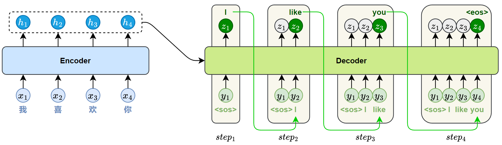

此外，Transformer 的编码器和解码器模块分别由多个结构相同的层堆叠而成。通过层层堆叠，模型能够逐步提取更深层次的语义特征，从而增强对复杂语言现象的建模能力。标准的 Transformer 模型通常包含 6个编码器层和 6 个解码器层。

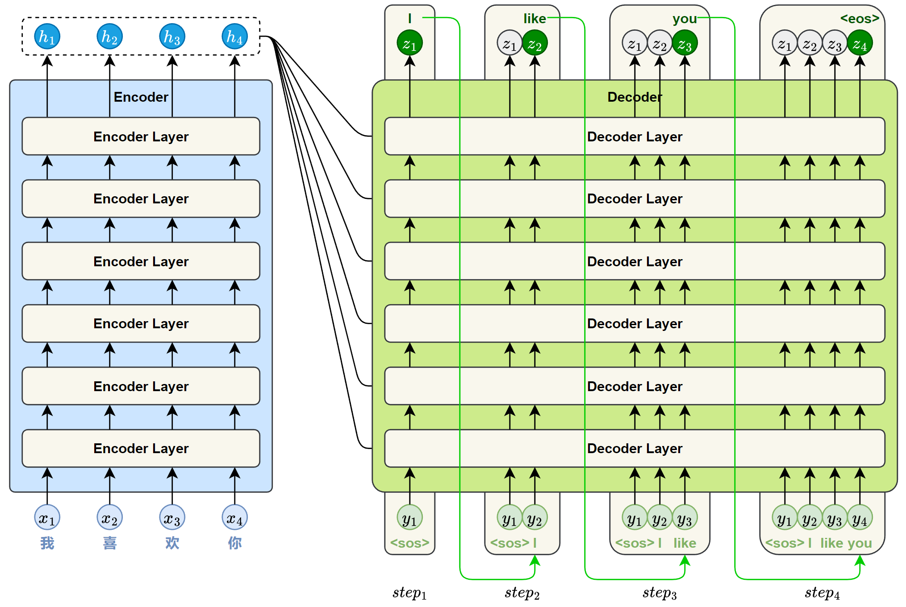


### 编码器

Transformer 的编码器用于**理解输入序列的语义信息，并生成每个token的上下文表示**，为解码器生成目标序列提供基础。

编码器由多个结构相同的编码器层（Encoder Layer）堆叠而成。每个 Encoder Layer的主要任务都是对其输入序列进行上下文建模，使每个位置的表示都能融合来自整个序列的全局信息。每个 Encoder Layer都包含两个子层（sublayer），分别是自注意力子层（Self-Attention Sublayer）和前馈神经网络子层（Feed-Forward Sublayer）。

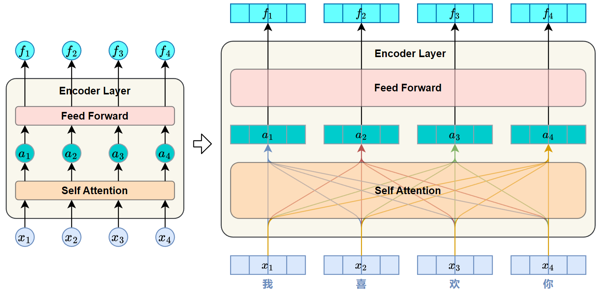

各层作用如下：

- **Self-Attention** 用于捕捉序列中各位置之间的依赖关系。

- **Feed-Forward** 用于对每个位置的表示进行非线性变换，从而提升模型的表达能力。


#### 自注意力层

自注意力机制（Self-Attention）是 Transformer 编码器的核心结构之一，它的作用是在序列内部建立各位置之间的依赖关系，使模型能够为每个位置生成融合全局信息的表示。之所以被称为“自”注意力，是因为模型在计算每个位置的表示时，所参考的信息全部来自同一个输入序列本身，而不是来自另一个序列。


##### 自注意力计算过程

- **生成Query、Key、Value向量**

  自注意力机制的第一步，是将输入序列中的每个位置表示映射为三个不同的向量，分别是 查询（Query）、键（Key） 和 值（Value）。

  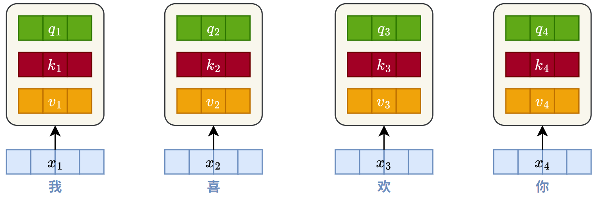

  这些向量的作用如下：

  Query：表示当前词的用于发起注意力匹配的向量；

  Key：表示序列中每个位置的内容标识，用于与 Query 进行匹配；

  Value：表示该位置携带的信息，用于加权汇总得到新的表示。

  自注意力的核心思想是：每个位置用自身的 Query 向量，与整个序列中所有位置的 Key 向量进行相关性计算，从而得到注意力权重，并据此与对应的 Value 向量加权汇总，形成新的表示。

  三个向量的计算公式如下：

  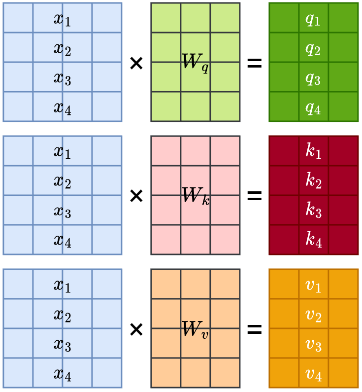

  其中 Wq、Wk、Wv 均为可学习的参数矩阵。

- **计算位置间相关性**

  完成 Query、Key、Value 向量的生成后，模型会使用每个位置的 Query 向量与所有位置的 Key 向量进行相关性评分。

  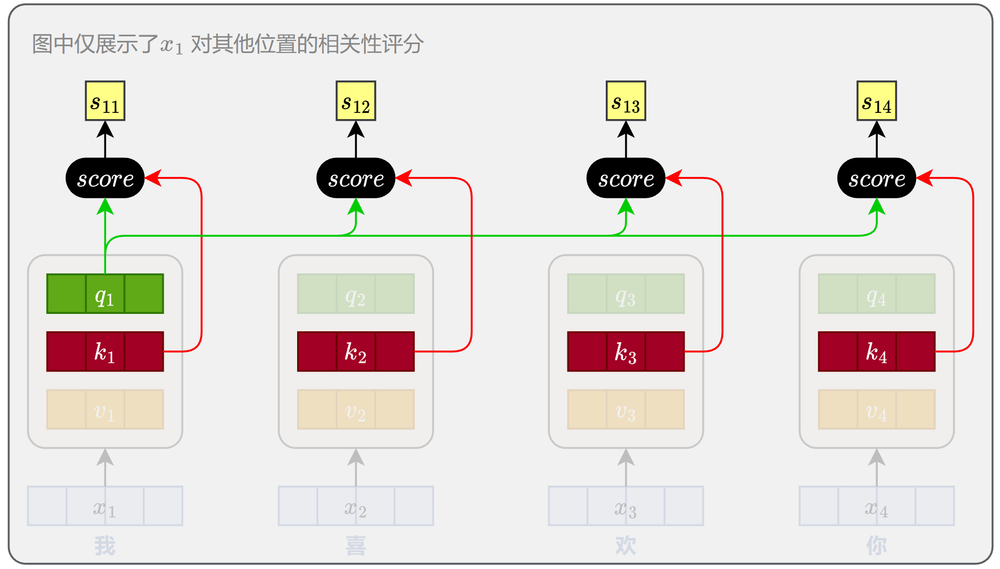

  评分函数采用向量点积形式。由于在高维空间中，点积的数值可能过大，会影响 softmax 的稳定性，因此在实际计算中对结果进行了缩放。最终的评分函数为：
  $$
  score(i, j)=\frac{q_i*k_j}{\sqrt{d_k}}
  $$
  其中 dk 是key向量的维度，用于缩放点积的幅度。这个分数越大，表示第 i 个位置越应该关注第 j 个位置的信息。对于整个序列，可以通过矩阵运算一次性计算所有位置之间的评分，计算公式如下图所示：

  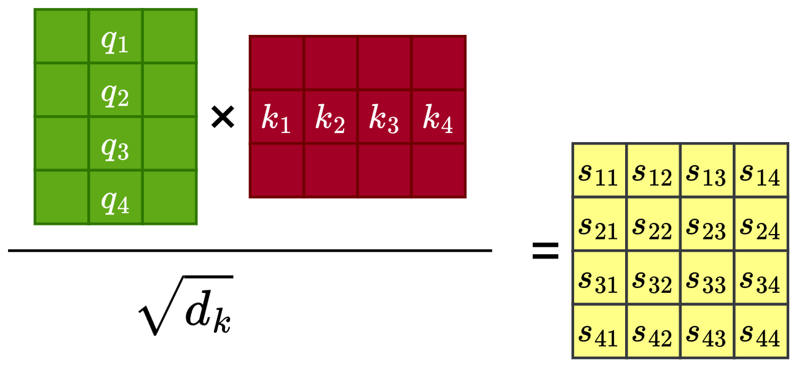

- **计算注意力权重**

  在得到每个位置与所有位置之间的相关性评分后，模型会使用 softmax 函数进行归一化，确保每个位置对所有位置的关注程度之和为 1，从而形成一个有效的加权分布。对于整个序列，模型要做的是对之前得到的注意力评分矩阵的**每一行**进行softmax归一化。

  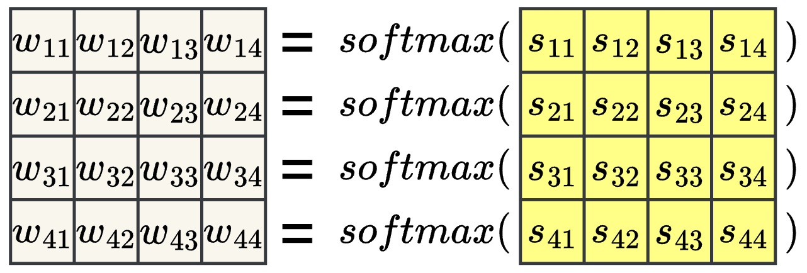

- **加权汇总生成输出**

  最后，模型会根据注意力权重对所有位置的 Value 向量进行加权求和，得到每个位置融合全局信息后的新表示。对于整个序列，同样可以通过矩阵运算一次性计算所有位置的输出，如下图所示:

  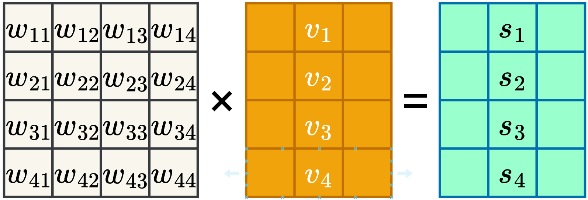

综上所述，可得整个自注意力机制的完整的计算公式如下:

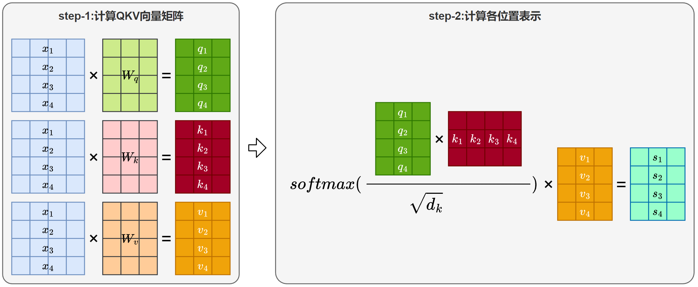

对应原始论文中的：
$$
Attention(Q,K,V)=softmax(\frac{QK^T}{\sqrt{d_k}})V
$$


##### 多头自注意力计算过程

自注意力机制通过 Query、Key 和 Value 向量计算每个位置与其他位置之间的依赖关系，使模型能够有效捕捉序列中的全局信息。然而，自然语言本身具有高度的语义复杂性，一个句子往往同时包含多种类型的语义关系。例如，句子“那只动物没有过马路，因为它太累了”中就涉及多个层面的语言关系：

- “它”指代“那只动物”，属于跨句的代指关系；
- “因为”连接前后两个分句，体现语义上的因果逻辑；
- “过马路”构成动词短语，属于固定的动宾结构。

要准确理解这类句子，模型需要同时识别并建模多种层次和类型的依赖关系。但这些信息很难通过单一视角或一套注意力机制完整捕捉。为此，Transformer 引入了**多头注意力机制（Multi-Head Attention）**。其核心思想是通过多组独立的 Query、Key、Value 投影，让不同注意力头分别专注于不同的语义关系，最后将各头的输出拼接融合。

先分别计算各头注意力：

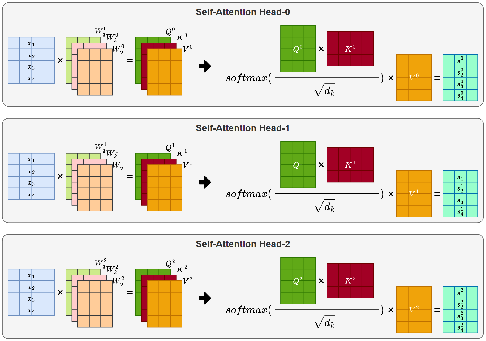

然后把多个输出矩阵按维度拼接，再乘以 W0 得到最终多头注意力的输出。

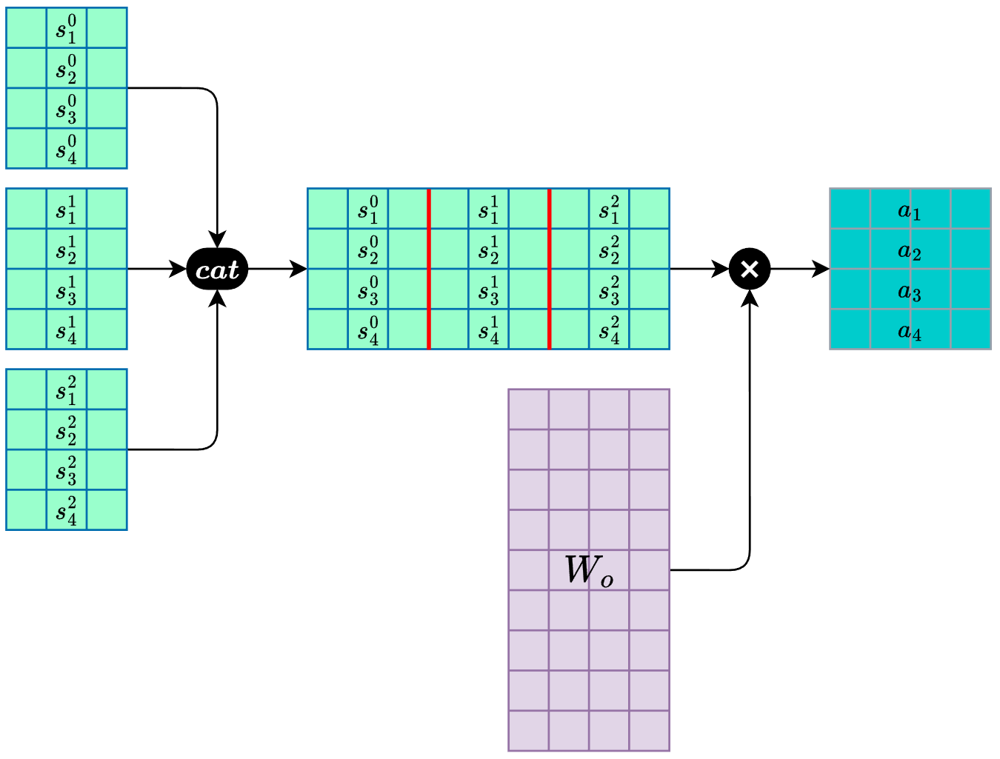

#### 前馈神经网络层

前馈神经网络（Feed-Forward Network，简称 FFN）是 Transformer 编码器中每个子层的重要组成部分，紧接在多头注意力子层之后。它通过对每个位置的表示进行**逐位置**、**非线性**的特征变换，进一步提升模型对复杂语义的建模能力。

一个标准的 FFN 子层包含两个线性变换和一个非线性激活函数，中间通常使用 ReLU激活。

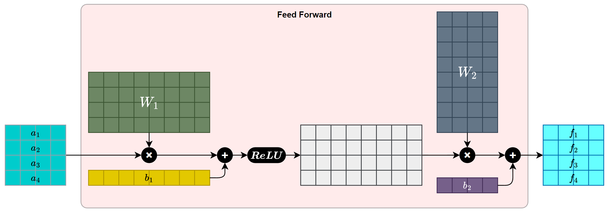

公式如下：
$$
FFN(x)=Linear_2(ReLU(Linear_1(x)))=W_2*ReLU(W_{1}x+b_1)+b_2
$$


#### 残差连接与层归一化

在 Transformer 的每个编码器层中，每个子层，包括自注意力子层和前馈神经网络子层，其输出都要经过残差连接（Residual Connection）和层归一化（Layer Normalization）处理。这两者是深层神经网络中常用的结构，用于缓解模型训练中的梯度消失、收敛困难等问题，对于Transformer能够堆叠多层至关重要。

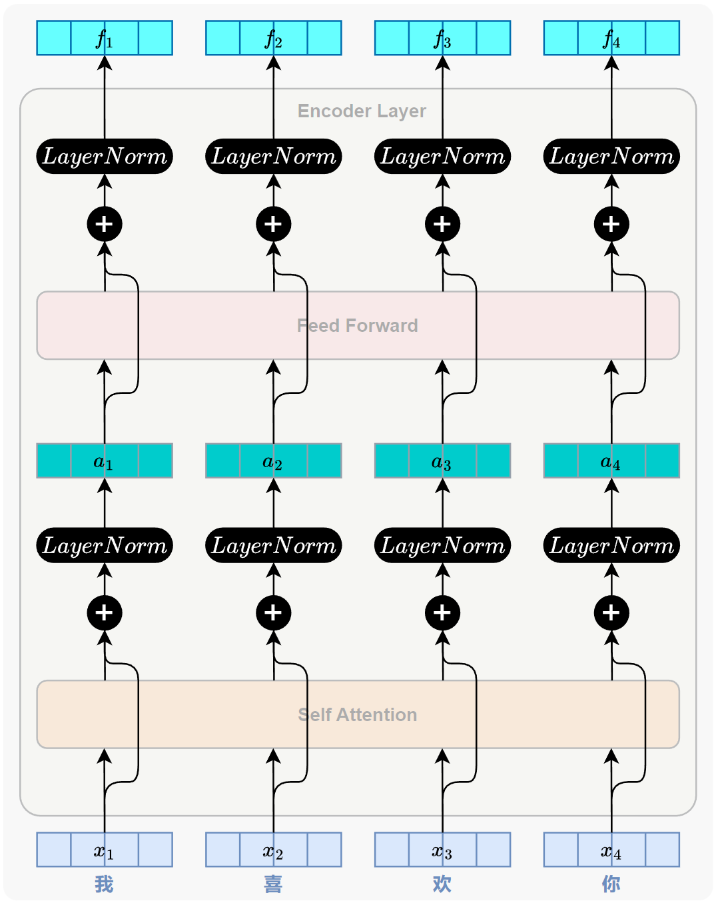

**残差连接**

残差连接（Residual Connection，也称“跳跃连接”或“捷径连接”）最初在计算机视觉领域被提出，用于缓解深层神经网络中的梯度消失问题。其核心思想是：将子层的输入直接与其输出相加，形成一条跨越子层的“捷径”，其数学形式为：
$$
y=x+SubLayer(x)
$$
残差连接确保反向传播时，梯度至少有一条稳定通路可回传，是深层网络可稳定训练的关键结构。


**层归一化**

每个子层在残差连接之后都会进行**层归一化（Layer Normalization，简称 LayerNorm）**。它的主要作用是规范输入序列中每个token的特征分布（某个token的表示可能在不同维度上有较大数值差异），提升模型训练的稳定性。该操作会将每个token的向量调整为均值为 0、方差为 1 的规范分布，具体效果如下图所示：

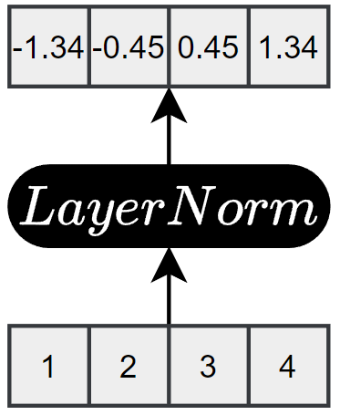

计算过程如下：

1. 计算该向量在所有特征维度上的平均值
   $$
   \mu=\frac{1}{N}\sum^n_{i=1}{x_i}
   $$

2. 计算向量各维度的标准差
   $$
   \sigma=\sqrt{\frac{1}{N}\sum^n_{i=1}{(x_i-\mu)^2}}
   $$

3. 将每个特征值转换为均值为0、方差为1的标准正态分布（ε 为一个小的常数，防止出现除以0的情况）
   $$
   \hat{x_i}=\frac{x_i-u}{\sigma+\epsilon}
   $$

4. 缩放和平移。让模型可以学习在归一化后的基础上进行适当的调整，保证归一化不会限制模型的表示能力
   $$
   LayerNorm(x_i)=\gamma_i*\hat{x_i}+\beta_i
   \\
   \gamma、\beta是可学习参数
   $$


#### 位置编码

Transformer 模型完全摒弃了 RNN 结构，意味着它不再按顺序处理序列，而是可以并行处理所有位置的信息。尽管这带来了显著的计算效率提升，却也引发了一个问题：Transformer 无法像 RNN 那样天然地捕捉词语之间的顺序关系。换句话说，在没有额外机制的情况下，Transformer 无法区分“猫吃鱼”和“鱼吃猫”这类语序不同但词汇相同的句子。

为了解决这一问题，Transformer 引入了一个关键机制-位置编码（Positional Encoding）。该机制为每个词引入一个表示其位置信息的向量，并将其与对应的词向量相加，作为模型输入的一部分。这样一来，模型在处理每个词时，既能获取词义信息，也能感知其在句子中的位置，从而具备对基本语序的理解能力。

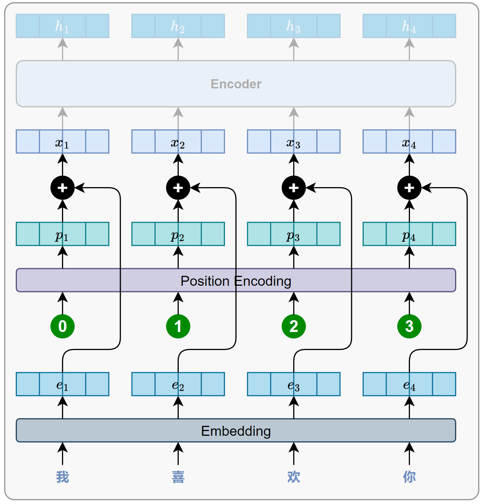

位置编码最直接的方式是使用**绝对位置编号**来表示每个词的位置，例如第一个词用 0，第二个词用 1，依此类推：

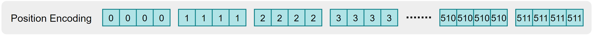

这样做虽然简单，但有一个明显的问题，越靠后的 token 位置编码就越大，若直接与词向量相加，会造成**数值倾斜**，让模型更关注位置，而忽视词义。为缓解这一问题，可以考虑将位置编号归一化为[0, 1]区间，例如用 pos/T 表示位置，其中T是句子长度。

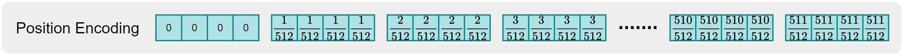

这种方式虽然使数值范围更平稳，但也引入了一个严重的问题：**相同位置的词在不同长度句子中的位置编码不再一致**。

例如：位置 5 在长度为 10 的句子中被编码为 5/10， 在长度为 1000 的句子中则为 5/1000。这种依赖输入长度的表示方式会导致模型难以形成稳定的位置感知能力。理想的做法是：每个位置都拥有一个唯一且一致的编码，与句子长度无关。

为了解决上述问题，Transformer 使用了一种基于正弦（sin）和余弦（cos）函数的位置编码方式，具体定义如下：
$$
PE_{(2i)}=sin(\frac{pos}{10000^{\frac{2i}{d_{model}}}})
\\
PE_{(2i+1)}=cos(\frac{pos}{10000^{\frac{2i}{d_{model}}}})
$$
其中：

- pos是当前词在序列中的位置
- i 用于表示位置编码向量的维度索引，2i 表示偶数维，2i+1 表示奇数维
- d_model 是词向量的维度大小

序列中每个位置pos对应一个长度为d_model的位置编码向量（即位置编码向量的维度和词向量的维度保持一致）。该向量的偶数维度通过正弦函数生成，奇数维度通过余弦函数生成。比如一个序列中位置在256，词向量维度为16的token，它所对应位置编码向量计算就如下图所示：

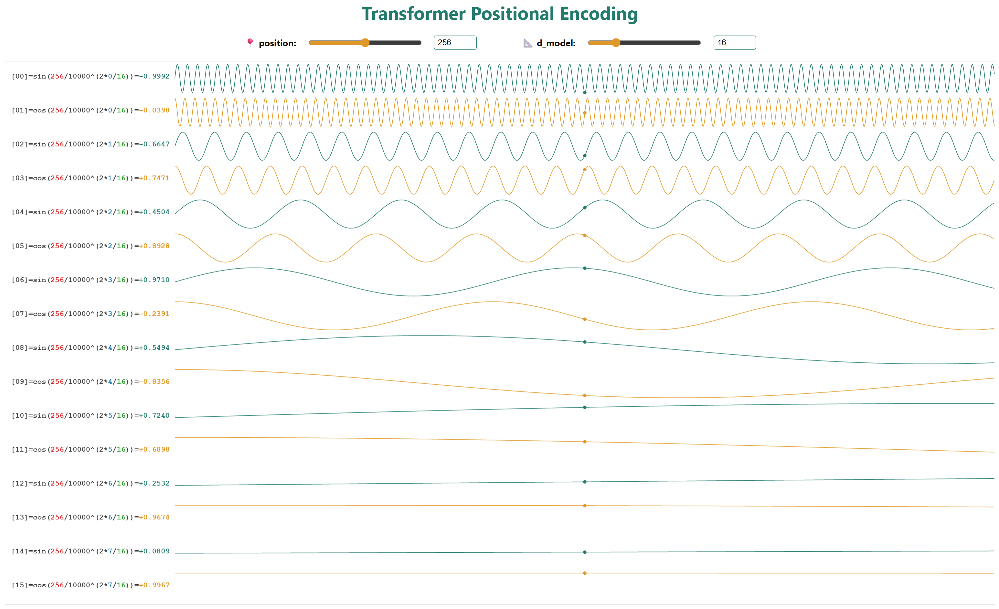

Transformer提出的这种编码方式不依赖任何可学习参数，数值稳定，并具备以下优势：

- 所有值都在[−1,1]范围内，数值稳定
- 编码方式固定、可预计算，无需训练
- 相同位置的编码在不同句子中保持一致
- 编码之间具有数学规律，便于模型在注意力机制中感知词语之间的相对位置关系


### 解码器

Transformer 解码器的主要功能是根据编码器的输出，逐步生成目标序列中的每一个词。其生成方式采用自回归机制(autoregressive)：每一步的输入由此前已生成的所有词组成，模型将输出一个与当前输入长度相同的序列表示。我们只取最后一个位置的输出，作为当前步的预测结果。这一过程会不断重复，直到生成特殊的结束标记`<EOS>`，表示序列生成完成。

解码器也由多个结构相同的解码器层堆叠组成。每个Decoder Layer都包含三个子层，分别是Masked自注意力子层、编码器-解码器注意力子层（Encoder-Decoder Attention）和前馈神经网络子层（Feed-Forward Network）。

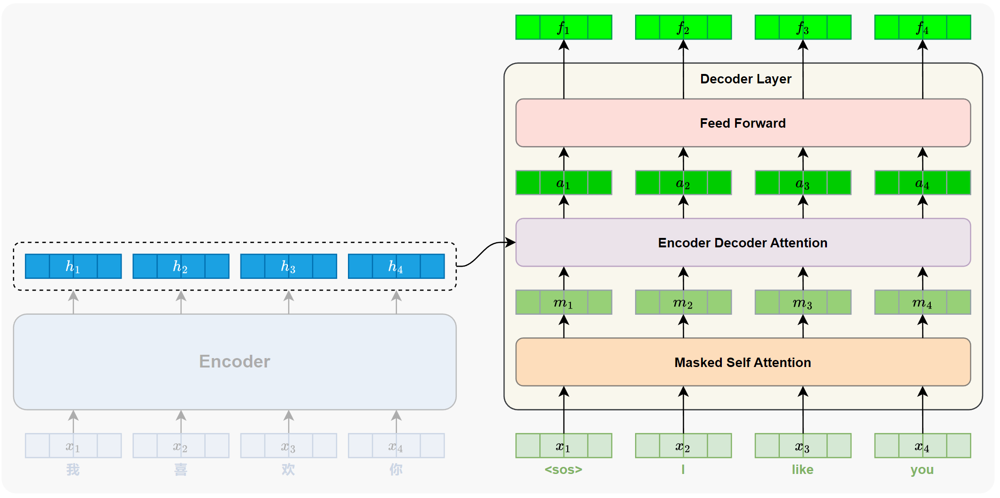


#### Masked自注意力子层

该子层的主要作用是：建模目标序列中当前位置与前文之间的依赖关系，为当前词的生成提供上下文语义支持。由于 Transformer 不具备像 RNN 那样的隐藏状态传递机制，无法在序列生成过程中保留上下文信息，因此在生成每一个词时，必须将此前已生成的所有词作为输入，通过自注意力机制重新建模上下文关系，以预测下一个词。

此外，从结构上看，Transformer 解解码器都具有一个典型特性：**输入多少个词，就输出多少个表示**。需要注意的是，在推理阶段，我们只使用解码器**最后一个位置的输出**作为当前步的预测结果。如果训练阶段也完全按照推理流程进行，就必须将每个目标序列拆分成多个训练样本，每个样本输入一段前文，只预测一个词。如下图所示：

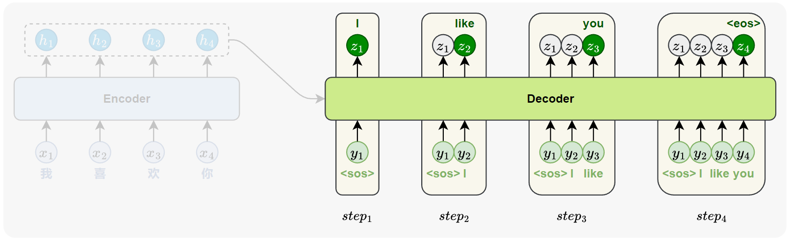

这种方式虽然逻辑合理，但训练效率极低，完全无法利用 Transformer 并行计算的优势。为提升效率，Transformer 采用了**并行训练策略**：一次性输入完整目标序列，同时预测每个位置的词。如下图所示：


但如果不加限制，这种方式会让模型在预测每个位置时“看到”后面的词，即提前访问未来信息，破坏生成任务的因果结构。为解决这个问题，解码器在自注意力机制中引入了**遮盖机制（Mask）**。该机制会在计算注意力时，**阻止模型访问当前位置之后的词**，只允许它依赖自身及前文的信息。这样，即使在并行训练时，模型也只能像逐词生成一样“看见”它应该看到的内容，从而保持训练与推理阶段的一致性。如下图所示：

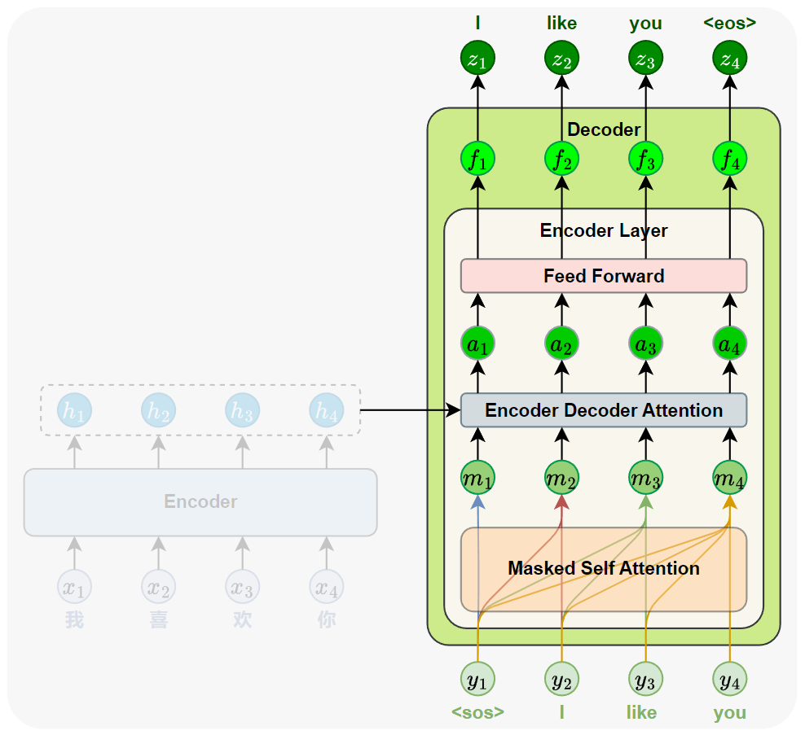

Mask 机制的实现非常简单：只需将注意力得分矩阵中**当前位置的后续位置的评分设置为 −∞**，如下图所示：

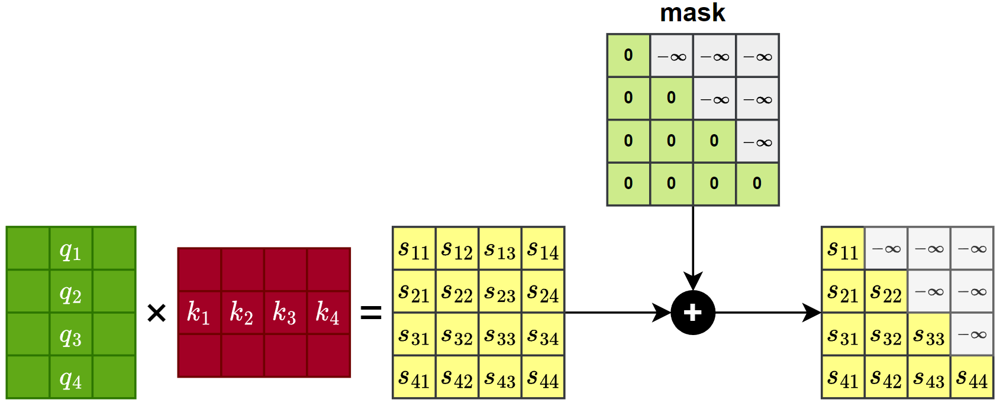

这样，在经过 softmax 运算后，这些位置的权重会趋近于 0。最终在加权求和时，来自未来位置的信息几乎不会参与计算，从而实现了“**当前词只能看到它前面的词**”的约束。如下图所示：

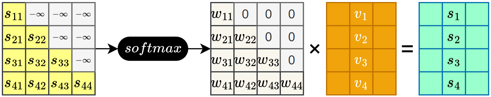


#### 编码器-解码器注意力子层

该子层的主要作用是：**建模当前解码位置与源语言序列中各位置之间的依赖关系**，帮助模型在生成目标词时有效地参考输入内容，相当于Seq2Seq模型中的注意力机制。编码器-解码器注意力的核心机制与前面讲过的自注意力机制完全一致，区别仅在于：

- Query 来自解码器当前的输入表示，即当前生成状态；

- Key和Value 来自编码器的输出表示，即整个源序列的上下文。

也就是说，当前生成位置使用自己的Query，去“询问”编码器输出中的哪些位置最相关。注意力机制会根据 Query 与所有 Key 的相似度，为每个源位置分配一个权重，然后用这些权重对 Value 进行加权求和，得到当前生成词所需的上下文信息。


### 训练及推理机制

**训练**

训练时，Transformer 将目标序列整体输入解码器，并在每个位置同时进行预测。为防止模型“看到”后面的词，破坏因果顺序，解码器在自注意力机子层中引入了 遮盖机制（Mask），限制每个位置只能关注它前面的词。这种机制让模型在结构上模拟逐词生成，但在实现上能充分利用并行计算，大幅提升训练效率。


**推理**

推理时，解码器的每一步都要重新输入整个已生成序列，模型需要基于全量前文重新计算注意力分布，决定下一个词的输出。整个过程必须顺序执行，无法并行。

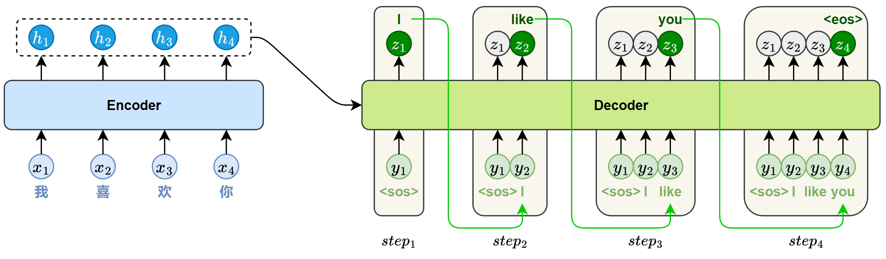


## 实战

基于对transformer理解，继续使用中英翻译的数据集，来实现一下中英翻译。PyTorch 已提供了 nn.Transformer 模块，包含完整的编码器-解码器结构，因此我们可以直接使用其核心组件来搭建模型。


### 数据准备

复用seq2seq的的数据类。

```python
class TranslateDataset(Dataset):
    def __init__(self):
        # 从npz加载
        data = numpy.load("./data/translate-data.npz", allow_pickle=True)

        self.zh_word2index = data["zh_word2index"].item()  # 转成字典，默认是 ndarray 实例
        self.zh_index2word = data["zh_index2word"].item()
        self.en_word2index = data["en_word2index"].item()
        self.en_index2word = data["en_index2word"].item()
        self.encoder_inputs = torch.LongTensor(data["encoder_inputs"])
        self.decoder_inputs = torch.LongTensor(data["decoder_inputs"])
        self.decoder_outputs = torch.LongTensor(data["decoder_outputs"])
        self.zh_vocab_size = data["zh_vocab_size"]
        self.en_vocab_size = data["en_vocab_size"]
        self.sample_len = data["sample_len"]

    def __getitem__(self, item):
        return self.encoder_inputs[item], self.decoder_inputs[item], self.decoder_outputs[item]

    def __len__(self):
        return len(self.encoder_inputs)
```


### 模型定义

PyTorch中还没有位置编码相关的方法封装，下面先来实现这部分。

位置编码类：

```python
class PositionEncoding(nn.Module):

    def __init__(self, dim, length):
        """
        :param dim: 词向量维度
        :param length: token序列长度
        """
        super(PositionEncoding, self).__init__()

        # 生成位置索引
        pos_index = torch.arange(0, length, dtype=torch.float)

        # 生成维度索引，这里只需要生成偶数的索引就可以
        dim_index = torch.arange(0, dim, step=2, dtype=torch.float)

        # 分母
        div_term = torch.pow(10000, dim_index / dim)

        # 使用所有位置索引除以分母
        # pos_index 需要改以一下形状，让每个位置信息，逐个除以每个分母，最后一维必须只有一个元素，参能像下面代码这样操作，省去手动遍历
        div_result = pos_index.reshape(-1, 1) / div_term  # shape (length, dim/2)

        # 对上面的结果分别进行sin、cos运算，就可以得到奇数位置和偶数位置的编码
        sin_result = torch.sin(div_result)
        cos_result = torch.cos(div_result)

        # 将sin和cos结果交叉拼接起来，得到最终的位置编码
        result = torch.zeros((length, dim))

        result[:, 0::2] = sin_result  # 填充所有行，列从0开始到最后，步长为2的方式进行填充
        result[:, 1::2] = cos_result

        # 把结果放到缓存
        self.register_buffer("PE", result)

    def forward(self, embeddings: torch.Tensor):
        """
        为词向量加上位置编码
        """
        seq_len = embeddings.size(1)
        # embeddings shape (batch_size, seq_len, dim)
        # 计算时，会直接把位置编码加到每个批次的每个序列的每个词向量上，相当于忽略batch_size这个维度
        return embeddings + self.PE[:seq_len, :]
```

继续定义翻译模型类，在encoder部分对于训练和推理的逻辑是相同的，但在decoder部分中推理逻辑和训练的逻辑是有较大差异的。

```python
class TranslateModel(nn.Module):
    def __init__(self):
        super(TranslateModel, self).__init__()

        self.dim = 48
        self.nheads = 8  # 自注意力头数
        self.num_layers = 6  # 编码器和解码器内部堆叠的子层层数
        self.batch_size = 50
        self.dataset = TranslateDataset()
        self.zh_vocab_size = self.dataset.zh_vocab_size
        self.en_vocab_size = self.dataset.en_vocab_size
        self.seq_len = self.dataset.sample_len.item()

        # 词嵌入，源文本和目标文本各一个
        self.src_embedding = nn.Embedding(num_embeddings=self.zh_vocab_size, embedding_dim=self.dim, padding_idx=0)
        self.tgt_embedding = nn.Embedding(num_embeddings=self.en_vocab_size, embedding_dim=self.dim, padding_idx=0)

        # 位置编码
        self.pos_encoding = PositionEncoding(self.dim, self.seq_len)

        # transformer
        # nhead 多头自注意力的头数，需能整除d_model
        # num_encoder_layers/num_decoder_layers 编码器和解码器的子层层数
        # dim_feedforward 前馈神经网络隐藏层维度，通常是d_model的2-4倍
        self.transformer = nn.Transformer(d_model=self.dim, nhead=self.nheads,
                                          num_encoder_layers=self.num_layers, num_decoder_layers=self.num_layers,
                                          dim_feedforward=self.dim * 4, activation='relu', batch_first=True)

        # 全连接层
        # 输入维度和transformer.decoder层的输出维度要保持一致，输出张量最后一维也是词向量维度
        self.fc = nn.Linear(self.dim, self.en_vocab_size)

        # 损失函数、参数优化器
        self.loss_func = nn.CrossEntropyLoss()
        self.optimizer = optim.Adam(self.parameters(), lr=0.001)

        # 丢弃最后一批
        self.train_dl = DataLoader(self.dataset, batch_size=self.batch_size, shuffle=True, drop_last=False)

    def encoder(self, src_inputs):
        # 获得编码器输入序列中的元素是否是填充字符的矩阵
        src_pad_mask = (src_inputs == self.src_embedding.padding_idx)  # 矩阵中每个元素与idx做逻辑运算，得到相同形状的bool矩阵

        # 词向量
        src_embedded = self.src_embedding(src_inputs)

        # 加上位置编码信息
        src_embedded = self.pos_encoding(src_embedded)

        # 编码器计算经自注意力权重重新计算的token向量
        memory = self.transformer.encoder(src=src_embedded, src_key_padding_mask=src_pad_mask)

        return src_pad_mask, memory

    def decoder(self, tgt_inputs, src_pad_mask, encoder_outputs, inference=False):
        # 训练逻辑
        if not inference:
            # 词向量 加 位置编码信息
            tgt_embedded = self.tgt_embedding(tgt_inputs)
            tgt_embedded = self.pos_encoding(tgt_embedded)

            # 获得解码器输入序列中的元素是否是填充字符的矩阵
            tgt_pad_mask = (tgt_inputs == self.tgt_embedding.padding_idx)

            # 训练时要生成解码输入的遮盖矩阵，即只让当前token关注它和它之前的词
            tgt_mask = self.transformer.generate_square_subsequent_mask(tgt_inputs.size(1))

            # 解码器预测
            outputs = self.transformer.decoder(tgt=tgt_embedded, memory=encoder_outputs,
                                               tgt_mask=tgt_mask, tgt_key_padding_mask=tgt_pad_mask,
                                               memory_key_padding_mask=src_pad_mask)

            # 全连接层把维度大小映射为目标词汇表大小
            outputs = self.fc(outputs)

            return outputs
        # 推理逻辑
        else:
            decoder_outputs = []

            # decoder推理的输入序列第一个元素都是开始标识符，在样本序列的索引0处
            pre_input_index = tgt_inputs[:, 0]
            pre_input_index = pre_input_index.unsqueeze(dim=0)  # 增加一个批次维度

            for i in range(tgt_inputs.shape[1]):
                # 获得解码器输入序列中的元素是否是填充字符的遮蔽矩阵
                tgt_pad_mask = (pre_input_index == self.tgt_embedding.padding_idx)

                pre_input: torch.Tensor = self.tgt_embedding(pre_input_index)
                pre_input = self.pos_encoding(pre_input)

                # 解码器预测，因为是逐字预测，所以就不需要遮盖矩阵了
                outputs = self.transformer.decoder(tgt=pre_input, memory=encoder_outputs,
                                                   tgt_key_padding_mask=tgt_pad_mask,
                                                   memory_key_padding_mask=src_pad_mask)

                # 全连接层把维度大小映射为目标词汇表大小
                outputs = self.fc(outputs)

                # 获取预测序列最后一个词作为预测结果
                pred_indexes = outputs[:, -1, :].argmax(dim=-1)
                pred_indexes = pred_indexes.unsqueeze(dim=0)

                # 把预测结果与之前的输入加到一起
                pre_input_index = torch.cat((pre_input_index, pred_indexes), dim=1)

                decoder_outputs.append(outputs[:, -1, :])

            # 把收集到的推理结果转成tensor，并处理成以批次开头
            # 将每个时间步的预测结果，沿新的第一维拼接成新的张量
            decoder_outputs = torch.stack(decoder_outputs, dim=0)
            # 交换两个维度的位置，和 permute 类似，(batch_size, token_num, vocab_size)
            decoder_outputs = decoder_outputs.transpose(0, 1)

            return decoder_outputs

    def forward(self, src_inputs, tgt_inputs, inference=False):
        src_pad_mask, memory = self.encoder(src_inputs)
        outputs = self.decoder(tgt_inputs, src_pad_mask, memory, inference)

        return outputs

    def _train(self):
        self.train()

        train_loss, train_acc = 0, 0
        for encoder_input, decoder_input, decoder_output in self.train_dl:
            # 前向传播
            pred_outputs = self(encoder_input, decoder_input)

            # 计算损失
            # sample_len 就是 token_num，都表示一个样本中有几个分词，也就是token
            pred_outputs = pred_outputs.reshape(self.batch_size * self.dataset.sample_len, -1)
            decoder_output = decoder_output.reshape(self.batch_size * self.dataset.sample_len)
            loss = self.loss_func(pred_outputs, decoder_output)

            self.optimizer.zero_grad()  # 清空梯度
            loss.backward()  # 反向传播
            self.optimizer.step()  # 更新参数

            train_loss += loss.item()
            train_pred = pred_outputs.argmax(dim=-1)
            train_acc += (train_pred == decoder_output).sum().item()

        train_loss /= len(self.train_dl)  # 损失是按每个批次进行计算的
        train_acc /= len(self.train_dl.dataset)  # 精度按样本个数来计算

        return train_loss, train_acc

    def my_train(self, epochs=20):
        for i in range(epochs):
            train_loss, train_acc = self._train()

            print(f"第 {i + 1} 轮，损失: {train_loss}  精度: {train_acc}")

        # 跑完所有轮次后保存模型
        torch.save(self.state_dict(), f"./models/translate-tf-{epochs}.pth")
```


### 模型训练

transformer的训练速度相较于RNN是更快的，我们在前面已经有介绍。

```python
if __name__ == '__main__':
    model = TranslateModel()
    model.my_train(100)
```

损失及精确度：

```shell
第 95 轮，损失: 0.2524492159485817  精度: 9.2136
第 96 轮，损失: 0.2427247206866741  精度: 9.2428
第 97 轮，损失: 0.24640452608466148  精度: 9.2184
第 98 轮，损失: 0.2356495453417301  精度: 9.2426
第 99 轮，损失: 0.23354141294956207  精度: 9.2586
第 100 轮，损失: 0.23731018528342246  精度: 9.2512
```


### 模型推理

这部分代码和seq2seq部分一样，因为训练和推理的逻辑我们都在模型类中实现好了。

下面先使用原文作为推理输入来看看效果：

```python
if __name__ == '__main__':
    model = TranslateModel()
    # model.my_train(100)

    model.load_state_dict(torch.load("./models/translate-tf-100.pth"))

    # 切换到推理模式
    model.eval()

    # 三个预测样本
    texts = ["那个 男孩 否认 偷 了 自行车", "我 的 妹妹 有時 為 我們 做 晚餐", "您 能 把 收音机 开 小声 一点 吗"]

    with torch.no_grad():
        for text in texts:
            # 分词并填充
            words = text.split()
            words += ["<PAD>"] * (model.dataset.sample_len - len(words) - 1) + ["<EOS>"]

            # 编码器输入
            encoder_input = torch.LongTensor([model.dataset.zh_word2index[word] for word in words])
            encoder_input = encoder_input.reshape(1, -1)  # 增加一个维度，表示1批次

            # 解码器输入
            # 推理时只会使用到第一个开始标识符，这里仍然加上占位符的原因是确保推理的此处，因为现在是按单个token进行推理的
            decoder_input = [model.dataset.en_word2index["<SOS>"]] + \
                            (model.dataset.sample_len - 1) * [model.dataset.en_word2index["<PAD>"]]
            decoder_input = torch.LongTensor(decoder_input)
            decoder_input = decoder_input.reshape(1, -1)

            # 推理
            outputs = model(encoder_input, decoder_input, True)

            # 预测结果是多个字符，要把每个预测结果都转成真是字符
            # 因为outputs shape (batch_size, seq_len, en_vocab_size)， 所以直接算最后一维最大值的索引
            results = []
            outputs = outputs.argmax(dim=-1)

            # 遍历第二维，拿到每个字符的索引
            for tensor in torch.unbind(outputs, dim=1):
                index = tensor.item()
                predict_word = model.dataset.en_index2word[index]
                if predict_word not in ("<EOS>", "<SOS>", "<PAD>"):
                    results.append(predict_word)

            print(text.replace(" ", ""), " -> ", " ".join(results))
```

```shell
那个男孩否认偷了自行车  ->  That boy denies stealing the bicycle
我的妹妹有時為我們做晚餐  ->  My sister sometimes makes our dinner
您能把收音机开小声一点吗  ->  Could you turn down the radio
```


和seq2seq一样，也使用非训练文本来翻译一下结果。

原文本如下：

```text
texts = ["小 男孩 把 收音机 开 小声 了", "我 姐姐 匆忙 地 离开"]
```

seq2seq训练50轮得到的结果：

```shell
小男孩把收音机开小声了  ->  The boy took the radio apart apart
我姐姐匆忙地离开  ->  My sister has to study in Australia pool
```

transformer训练100轮结果如下：

```shell
小男孩把收音机开小声了  ->  A bicycle fell off of the book
我姐姐匆忙地离开  ->  I usually take a bath in Sundays
```


