## 概述

早期的自然语言处理方法通常针对每个具体任务单独训练模型，且严重依赖大量人工标注数据。虽然在部分场景下效果可观，但也暴露出显著局限：

- 语言知识难以复用：每个模型都需从零开始训练，导致训练成本高、效率低；
- 强依赖高质量标注：在医疗、法律等专业领域，标注数据获取困难且代价高昂。

为解决这些问题，研究者提出了新的建模范式-“预训练 + 微调”：

- 预训练阶段：在大规模未标注语料上训练语言模型，学习词汇、句法和上下文等通用语言规律；
- 微调阶段：将预训练模型迁移至具体任务，仅需少量标注数据即可完成任务适配。

这一方法显著提升了模型的通用性和开发效率，已成为当前 NLP 的主流技术路线，并广泛应用于文本分类、问答系统、翻译、对话等任务中。


**预训练模型分类**

预训练语言模型几乎都构建在 Transformer 架构之上。相较于传统的循环神经网络，Transformer具有以下优势：

- 并行计算效率高，适合大规模训练；
- 上下文建模能力强，可捕捉长距离依赖；
- 结构通用灵活，可适配多种任务类型；
- 易于扩展与迁移，支持参数堆叠与多任务学习。

因此，Transformer 成为预训练模型的主流基础架构。根据 Transformer 的使用方式不同，预训练模型大致可分为以下三类：

- **解码器（Decoder-only）模型**

  仅使用Transformer解码器，代表模型为GPT（Generative Pre-trained Transformer），其由 OpenAI于2018年6月提出。

- **编码器（Encoder-only）模型**

  仅使用Transformer 编码器，代表模型为BERT（Bidirectional Encoder Representations from Transformers），由Google于2018年10月提出。

- **编码器-解码器（Encoder-Decoder）模型**

  同时使用Transformer编码器和解码器，代表模型为T5（Text-to-Text Transfer Transformer），由Google于2019年10月提出。

自 GPT、BERT 和 T5 等模型发布以来，基于 Transformer 的预训练模型不断涌现，模型架构和能力持续演进。下图总结了 2018 年至 2023 年间具有代表性的模型及其发展脉络。

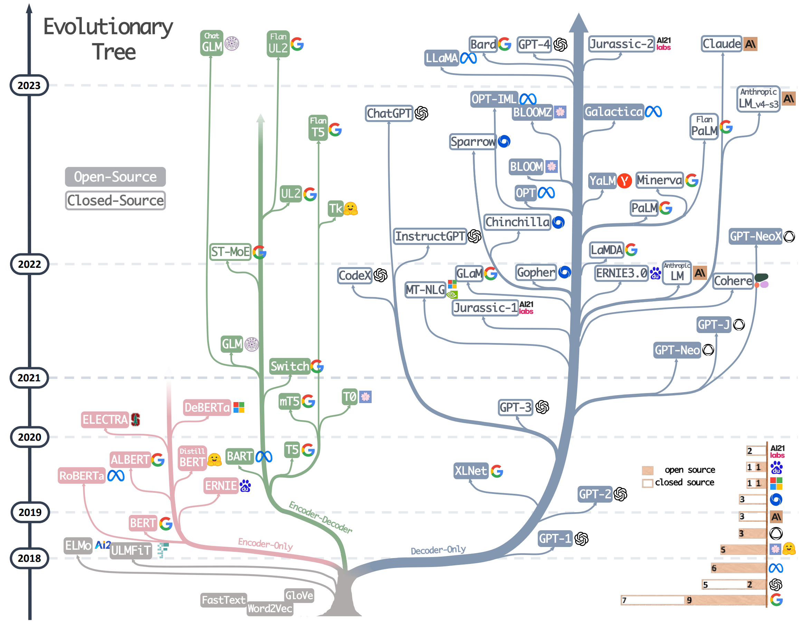


## GPT

### 概述

GPT（Generative Pre-trained Transformer）是第一个系统性提出“预训练 + 微调”范式的语言模型。其核心思想是通过大规模无监督语料进行 *生成式语言建模* 预训练，即训练模型根据左侧上下文预测下一个词，从而让模型学习自然语言的通用语法、语义和上下文依赖能力。完成预训练后，再通过微调适应具体的下游任务。

GPT首次展示了生成式语言模型在自然语言理解任务中的广泛迁移能力，为后续 GPT 系列及整个预训练语言模型的发展奠定了基础。


### 模型结构

GPT基于Transformer的解码器结构，但与标准的Transformer解码器并不完全相同，GPT具体结构如下图所示：

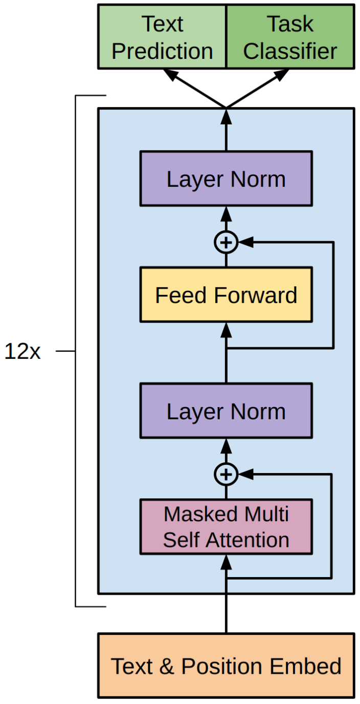

**输入嵌入层（Text & Position Embedding）**

与原始Transformer一样，每个输入 token 的表示也由两部分组成：

- Text Embedding：将词或子词映射为向量；
- Position Embedding：提供词在序列中的位置信息。

GPT不同于原始Transformer的一点在于：位置编码采用的是可学习的位置嵌入（learnable positional embedding）。这意味着每个位置对应一个可训练的向量，模型可以在训练过程中自动优化这些向量，而非使用不可训练的三角函数编码（如正弦/余弦函数）。每个token的最终表示是词嵌入与位置嵌入的向量和，向量维度为 768。


**解码器**

解码器部分由12个结构相同的解码器层堆叠而成，每个解码器层包含如下两个子层：

- 掩码多头自注意力层
- 前馈网络层

每个子层都会使用 残差连接 和 层归一化。


**输出层**

根据任务不同，GPT模型的输出可以接入不同的任务头：

- **Text Prediction（文本预测）**：用于下一个词的生成，输出是词表大小的概率分布，经过Softmax获得，预训练阶段使用的便是该任务头。
- **Task Classifier（任务分类器）**：该任务头多用于模型微调阶段，以适配具体的下游任务。通过提取特定位置的表示（如最后一个token）对整个输入文本进行分类（如情感分析、话题识别等）。


### 预训练

GPT 的预训练阶段采用生成式语言建模（Generative Language Modeling）作为训练目标，在大规模无监督文本上进行自监督学习。具体而言，模型的任务是基于已观察到的前文上下文，预测当前词的位置应出现的词，从而学习自然语言的统计规律与上下文依赖关系。这种自回归语言建模方式不依赖人工标注，训练样本可以直接从原始文本中自动构建，极大地降低了构建数据的成本。

GPT 使用 Transformer 架构，具备全局自注意力机制，能够有效建模长距离依赖信息。同时，Transformer 的并行计算特性使得模型能够高效处理长文本序列，相较于传统的 RNN 架构，训练效率显著提升，也使得在大规模语料上进行预训练成为可能。

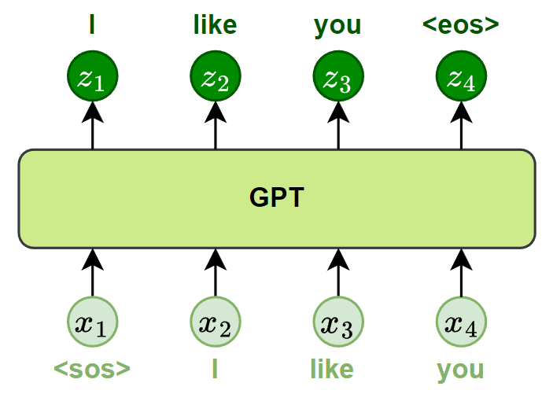

在实践中，GPT-1 使用了一个名为 BooksCorpus 的英文语料库，包含来自 7000 多本小说的完整书籍文本，总规模约 8 亿词。该语料语言自然、上下文完整，非常适合训练具备长距离依赖建模能力的语言模型。


### 微调

GPT的微调阶段是在完成无监督语言建模预训练之后，使用有监督的任务数据对模型进行进一步训练，使其适应具体的下游任务。微调的核心思路是：**在保留预训练语言建模能力的基础上，利用标注数据对整个模型进行端到端优化，从而实现知识迁移。**

具体实践中，GPT采用了如下两个关键措施：

- **添加任务输出层**

  在预训练模型顶部引入一个线性输出层（Linear Head），用于将 GPT 的隐藏状态映射为下游任务所需的标签或输出。

- **统一输入格式设计**

  GPT 作为自回归语言模型，其输入需为连续的文本序列。因此，在微调过程中需将各种下游任务转化为统一的文本输入格式。

下图展示了不同任务的微调逻辑：

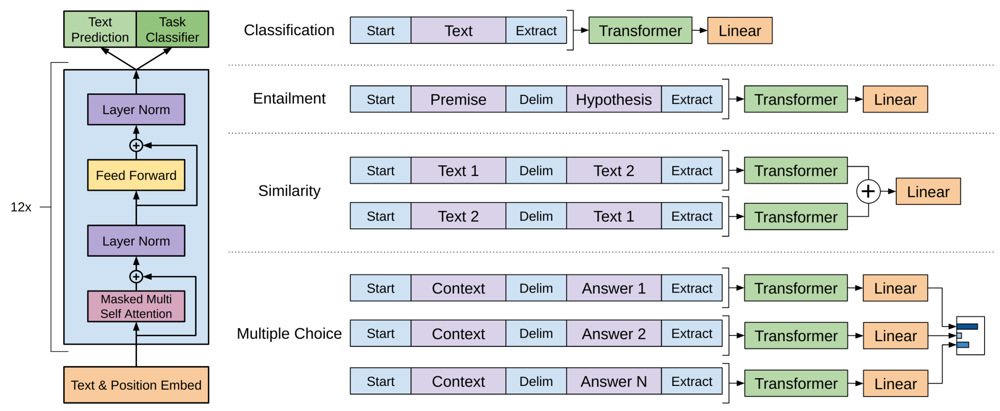

以图中的***\*文本分类任务\****为例，假设我们有一个带标注的微调数据集如下：

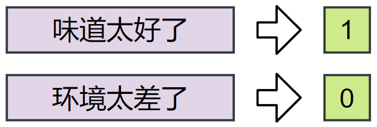

首先，将每条评论转为 token 序列，并添加特殊标记 [Start] 与 [Extract]，形成模型标准输入格式：

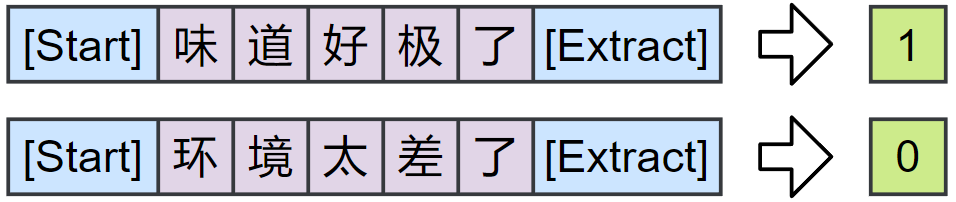

然后，将转换后的序列送入 GPT 模型。模型逐层处理后，输出每个位置的预测。我们只提取序列中最后一个位置 [Extract] 对应的输出，再通过新添加的线性输出层完成分类预测，最中输出标签“0”或“1”。如下图所示：

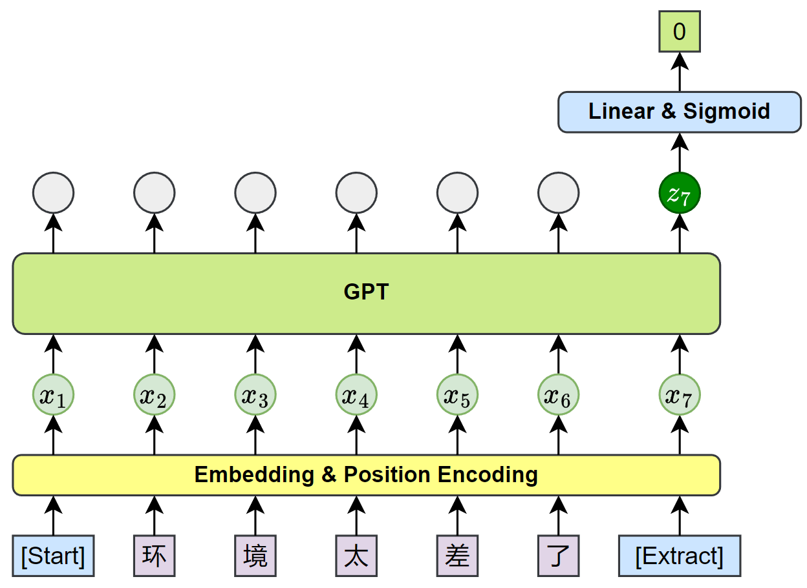

通过这种方式，GPT 在保留预训练模型结构和参数的基础上，仅添加极少量新参数（如线性层），便可高效完成从语言建模到多种下游任务的迁移。此外，统一的输入格式设计进一步简化了多任务处理流程，使 GPT 能以一致的方式应对多种 NLP 任务，从而展现出强大的通用性与扩展性。


## BERT

### 概述

BERT（Bidirectional Encoder Representations from Transformers）是由 Google 于 2018 年提出的一种语言预训练模型。其核心创新在于采用 Transformer 的**编码器（Encoder）**结构，通过双向自注意力机制，在建模每个 token 表示时同时整合左右两个方向的上下文信息，从而获得更准确、更丰富的语义表示。

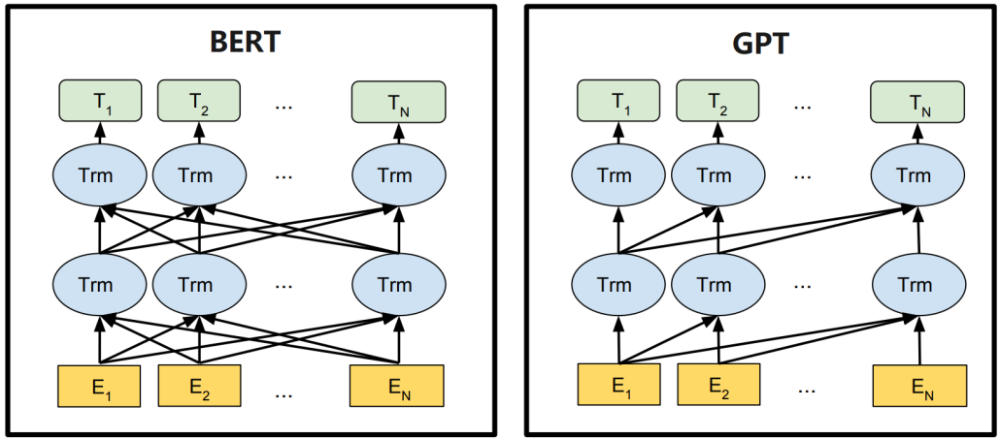

在得到每个 token 的表示后，BERT可通过添加简单的任务特定层，适配不同类型的下游任务。

BERT 的设计更侧重于自然语言理解类任务，广泛应用于文本分类、序列标注、句子匹配等场景。模型发布后，在多个语言理解基准测试中取得了前所未有的领先成绩，推动 NLP 研究全面转向“预训练 + 微调”的通用建模范式。


### 模型结构

BERT 基于**标准的 Transformer 编码器**构建，其提供了两种模型规模，分别是BERT-base和BERT-large。具体参数规格如下：

| **模型版本**   | 层数（Layers） | 模型维度（d_model） | 注意力头数（Heads） | **参数量** |
| -------------- | -------------- | ------------------- | ------------------- | ---------- |
| **BERT-base**  | 12             | 768                 | 12                  | 1.1 亿     |
| **BERT-large** | 24             | 1024                | 16                  | 3.4 亿     |

BERT模型各部分的结构细节如下：

**输入表示层**

BERT 的每个输入 token 表示由三部分嵌入相加组成：

- **Token Embedding**：词本身的语义表示；
- **Position Embedding**：表示 token 在序列中的位置，为可学习向量；
- **Segment Embedding**：用于区分不同句子，例如在问答任务中区分问题和答案。

如下图所示：

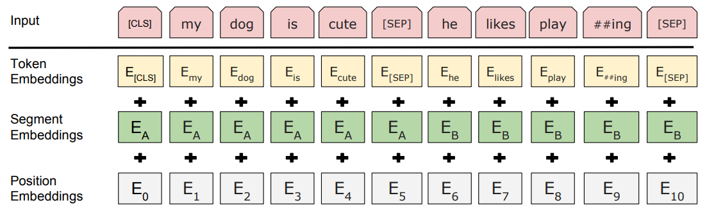

此外，BERT 输入中通常包含两个特殊符号：

[CLS]：句首标志，其输出向量常用于下游的文本分类任务；

[SEP]：句间分隔符，出现在每个句子末尾。


**编码层**

编码器结构同原始Transformer相同，不再赘述。


**输出层**

根据下游任务的类型，BERT 可以接入不同的任务输出头：

Token-Level 任务（如命名实体识别）：使用每个位置的输出表示；

Sequence-Level 任务（如文本分类、句子对分类）：使用特殊 token [CLS] 的输出表示，输入时被加在序列开头，专门用于汇总整个序列的语义信息。


### 预训练

BERT 的预训练阶段包含两个核心任务：**掩码语言模型（Masked Language Modeling, MLM）** 和 **下一句预测（Next Sentence Prediction, NSP）**，分别用于学习词级语义和句间逻辑关系。

- **掩码语言模型（MLM）**

  为实现双向语言建模，BERT 不采用传统的从左到右或从右到左预测方式，而是引入了掩码语言模型。在训练中，BERT 会随机遮盖输入序列中约 15% 的 token，并训练模型根据上下文预测被遮盖的词。

  遮盖策略如下：

  - 80% 的被遮盖 token 替换为 [MASK]；
  - 10% 替换为随机词；
  - 10% 保持原词不变。

  这种机制让模型在预训练时既能看到左侧上下文，也能看到右侧上下文，真正实现深度双向建模。

  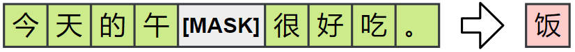

- **下一句预测（NSP）**

  为了提升模型理解句间关系的能力，BERT 引入了“下一句预测”任务。训练时模型接收两个句子，判断第二句是否是第一句的真实后续句，其中：50% 的训练样本是上下文中真实相邻的句子（正例）；50% 是从语料中随机采样的非相邻句子（反例）。

  正例: A：我今天很忙。B：所以没去上班。

  反例: A：我今天很忙。B：天气很好。


在预训练时，BERT 同时优化 MLM 和 NSP 两个目标，具体操作如下图所示：

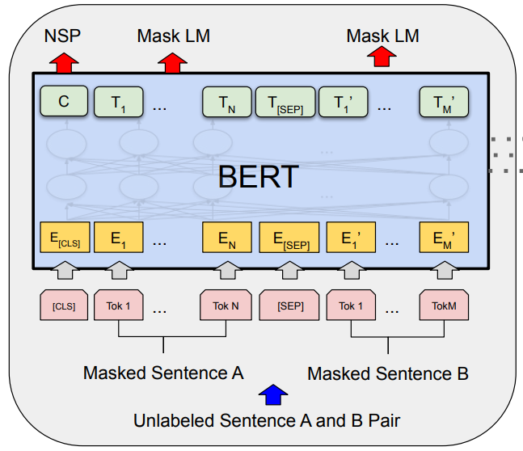


### 微调

在预训练完成后，BERT 可通过少量微调适配多种下游任务，如文本分类、句子匹配、问答系统、序列标注等。微调时，模型主体结构保持不变，仅在顶部添加一个任务特定的输出层，并使用下游任务数据对整个模型进行训练。

BERT 的输入格式在微调阶段基本保持与预训练一致，仍以 token 序列为输入，使用 [CLS] 和 [SEP] 等特殊符号。不同任务的差异主要体现在输出层设计，以及从模型输出中提取哪些表示进行预测。

下面分别介绍 BERT 在四类典型任务中的微调方式：

- **句子对分类任务**

  输入格式：[CLS] 句子1 [SEP] 句子2 [SEP]

  输出方式：使用 [CLS] 的输出向量接入线性层进行分类，用于判断两个句子之间是否存在重复、蕴含、矛盾等关系。

  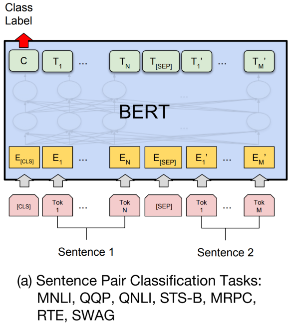

  注：

  - MNLI：Multi-Genre Natural Language Inference，多类别句子蕴含判断
  - QQP: Quora Question Pairs，问句语义重复判断
  - QNLI: Question Natural Language Inference ，判断句子是否为问题的答案
  - STX-B: Semantic Textual Similarity Benchmark，语义相似度回归
  - MRPC: Microsoft Research Paraphrase Corpus，句子复述判断
  - RTE: Recognizing Textual Entailment，二分类蕴含判断
  - SWAG: Situations With Adversarial Generations，多项选择填句任务


- **单句分类任务**

  输入格式：[CLS] 句子 [SEP]

  输出方式：同样使用 [CLS] 的输出向量，经过线性层用于情感极性判断、语法可接受性判断等。

  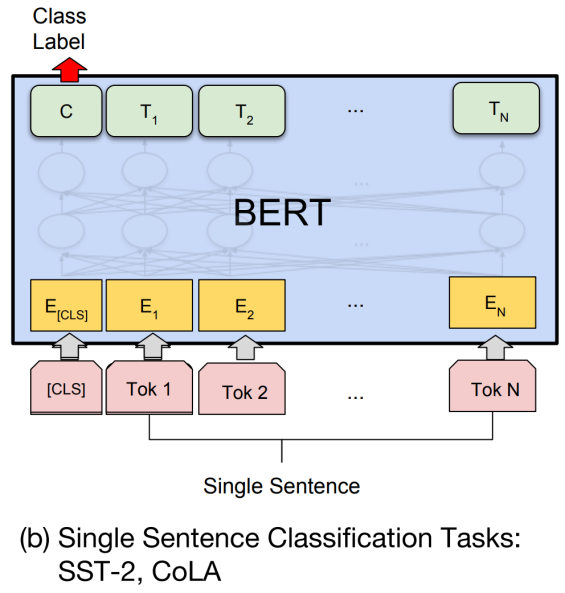

  注：

  - SST-2: Stanford Sentiment Treebank (binary)，情感极性判断（二分类）
  - CoLA: Corpus of Linguistic Acceptability，语法可接受性判断（二分类）

- **问答任务**

  输入格式：[CLS] 问题 [SEP] 段落 [SEP]

  输出方式： 模型不会使用 [CLS] 向量，而是对每个 token 分别预测其作为答案起始位置和结束位置的概率。最终根据得分确定答案在段落中的位置范围，从中直接抽取连续的答案文本。

  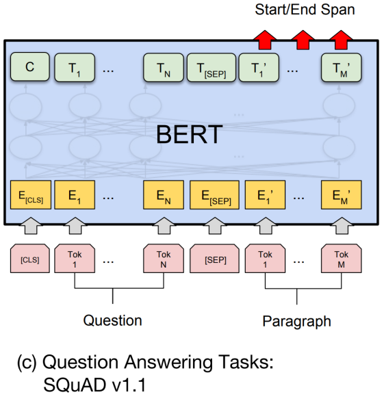

  注：

  - SQuAD v1.1：Stanford Question Answering Dataset 抽取式问答（起止定位）

- **序列标注任务**

  输入格式：[CLS] 句子 [SEP]

  输出方式：对每个 token 的输出向量单独进行分类，例如判断是否为人名（B-PER）、地名（B-LOC）等。

  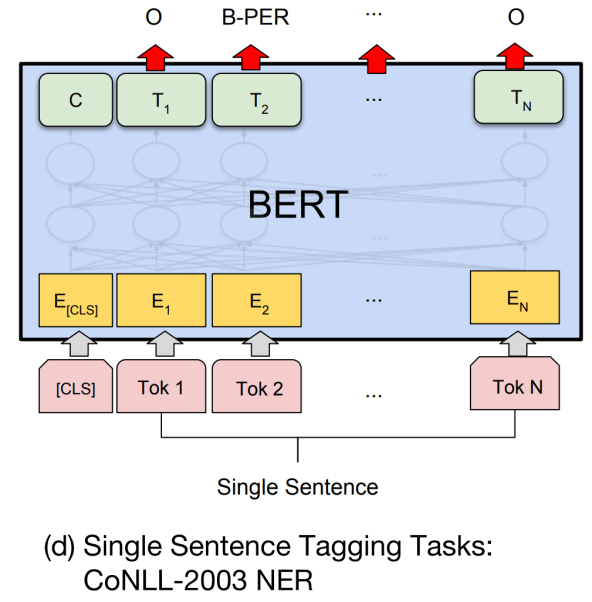

  注：

  - NER：Named Entity Recognition，命名实体识别


## T5

### 概述

T5（Text-to-Text Transfer Transformer）是 Google Research 于 2020 年提出的一种统一预训练框架，它首次在完整的 Transformer 编码器-解码器结构（Encoder-Decoder）上实现了预训练语言模型。

T5的核心思想是将所有自然语言处理任务统一表示为“文本到文本”的转换问题（Text-to-Text Framework），即无论输入是文本分类、问答还是翻译，模型的输入输出均是自然语言形式的字符串，如下图所示：

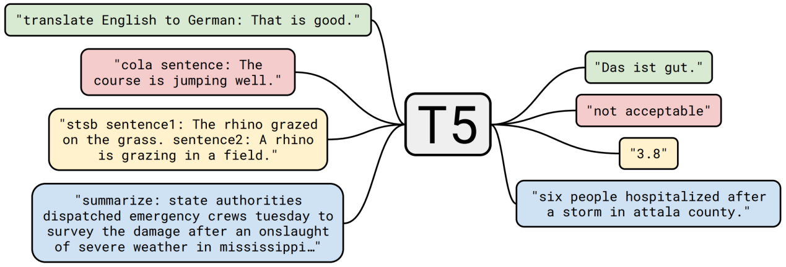

这一设计使得 T5 可以通过同一个模型架构、同一套预训练机制完成多种任务，具备极强的统一性与迁移能力。


### 模型结构

T5模型大体遵循原始的Transformer架构，此处不再赘述。


### 预训练

T5模型的预训练目标被称为Corrupted span prediction，具体过程如下：

- **随机遮盖输入文本中的若干连续片段（span）；**
- **将每个被遮盖的连续片段替换为一个个特殊token；**
- **令模型学习生成这些遮盖片段的内容，作为输出序列。**

如下图所示：

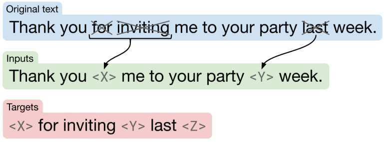

这种方式既保留了模型的双向建模能力，又为训练提供了明确的“生成式”学习信号，使模型可以更自然的适配下游任务。


### 微调

T5微调阶段需要将所有任务转换为文本到文本的形式，例如：

| 任务类型     | 输入形式                                                     | 目标输出     |
| ------------ | ------------------------------------------------------------ | ------------ |
| **翻译**     | translate English to German: That is good.                   | Das ist gut. |
| **情感分类** | sentiment: This movie was great.                             | positive     |
| **问答**     | question: What is the capital of France? context: France is a country... | Paris        |


## Hugging Face

Hugging Face 是一家提供开源 AI 工具和平台的公司，致力于简化预训练模型的使用，加速机器学习项目的开发与落地。最初以 Transformers 库闻名，该库极大地降低了使用 BERT、GPT、T5 等模型的门槛。如今，Hugging Face 已发展成为一个完整的 AI 开发生态系统，支持自然语言处理、计算机视觉、语音处理、多模态任务等多个领域。

Hugging Face 的生态系统主要由两个核心部分组成：

- **Hugging Face Hub**

  Hugging Face提供了一个集中式的开源平台，用于托管和分享模型、数据集和应用。

  

- **工具链**

  Hugging Face 提供了一套围绕预训练模型构建的工具库。这些组件彼此独立，又可以协同工作，覆盖了从数据处理到模型训练与推理的完整流程。

  **Datasets**

  Datasets 是用于加载和处理数据集的工具库。支持从在线仓库或本地文件（如 CSV、JSON）加载文本数据，并支持清洗、编码、切分等预处理操作。处理后的数据可直接用于模型训练，是连接原始数据与模型输入的重要桥梁。

  **Tokenizers**

  Tokenizers 是用于将文本转换为模型输入的工具。它支持文本分词、编码为 token ID，同时自动处理特殊符号、填充（padding）、attention mask 和句子对标记（token type ID）。分词器通常与模型配套使用，可通过统一接口加载。

  **Transformers**

  Transformers 是 Hugging Face 最核心的库，用于加载、使用和微调各种预训练模型。该库统一了模型接口，支持数百种模型结构，如 BERT、GPT 等，用户可以通过一行代码 from_pretrained()直接加载公开模型，快速用于推理或训练。


## 微调实战

### 需求说明

基于预训练BERT模型实现评论的情感分析任务。本次联系使用Hugging Face生态提供的能力库完成。先进行如下依赖库的安装：

```shell
pip install -i https://pypi.tuna.tsinghua.edu.cn/simple/ datasets transformers
```


### 数据准备

我们从Hugging Face上找到一个数据集，如下：

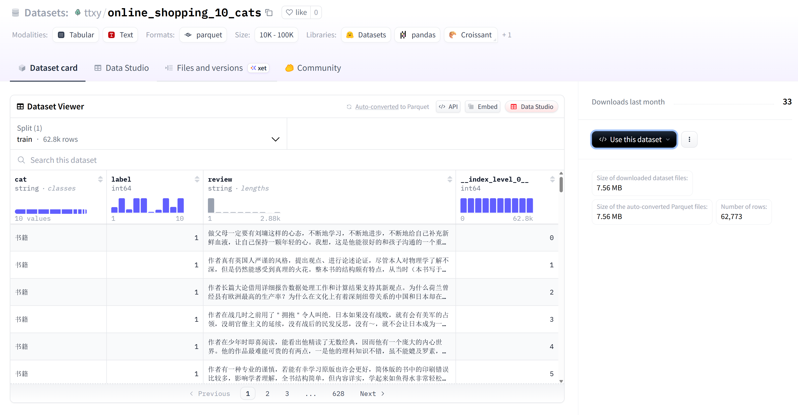

HF上的数据集是支持在线直接加载的，上图中右上角使用数据集，选择Datasets就可以直接复制代码：

```python
from datasets import load_dataset

ds = load_dataset("ttxy/online_shopping_10_cats")
```

一些数据的摘要信息：

```python
from datasets import load_dataset

ds = load_dataset("ttxy/online_shopping_10_cats")

# 获取原始数据
# 这里之所以使用 train 这个键，是因为数据集就拆分成这么一个字数据集了。上图中可以看到
data = ds.data.get('train')

# 行数和列数
print(data.num_rows)  # 62773
print(data.num_columns)  # 4  实际只有三列，会默认在最后加上一个索引列

# 列名
print(data.column_names)  # ['cat', 'label', 'review', '__index_level_0__']

# 获取第4列数据
# 当数据较多时，会把每列的数据按1000个一组做二次拆分
print(data.column(3))
```

数据集也可以从本地加载，这里已经把上面的csv文件下载下来了。现在来预处理数据：

```python
def tokenize(data: Dataset, max_length=64):
    """
    分词编码
    """
    # 加载分词器
    # 这里直接从transformers库中加载预训练的分词器
    tokenizer = AutoTokenizer.from_pretrained("google-bert/bert-base-chinese")

    # max_length 规定每条文本最终转换后的 “最大长度”
    # padding 规定如果文本长度不足 max_length，则用特殊符号填充
    # truncation 规定如果文本长度超过 max_length，则进行截断
    encoded = tokenizer(data["review"], max_length=max_length, padding="max_length", truncation=True)

    # 返回处理后的文本转成索引的序列，以及每个序列对应的遮盖矩阵
    result = {'input_ids': encoded['input_ids'], 'attention_mask': encoded['attention_mask']}

    return result


def process_data():
    # 加载原始数据
    dataset = load_dataset(path="csv", data_files="./data/online_shopping_10_cats.csv").get("train")

    # 过滤空评论和非二分类标签
    dataset = dataset.filter(lambda x: (x['review'] is not None and x['review'].strip() != "" and x['label'] in (0, 1)))
    
    # 这里数据总共可用的有6万多条，这里取1万条作为演示
    dataset = dataset.select(range(10000))

    # 申明分类标签，并为标签值映射具有含义的名字
    dataset = dataset.cast_column("label", ClassLabel(names=["neg", "pos"]))
    
    # 数据集编码
    # 分词编码之后的结果为字典，包含input_ids和attention_mask两个键，会映射到数据集中作为新的列
    dataset = dataset.map(tokenize, batched=True)
    
    # 删掉不需要的列
    dataset = dataset.remove_columns(["review", "cat"])

    # 拆分测试集和训练集
    # test_size 测试及数据的比例
    # shuffle 打乱源数据集
    # seed 随机种子，固定的整数每次拆出来的结果是一样的
    # stratify_by_column 根据标签列进行分层抽样，目的是为了保证训练集和测试集中正负样本的比例一致
    data = dataset.train_test_split(test_size=0.2, shuffle=True, seed=10, stratify_by_column="label")

    # 保存预处理之后的数据
    data["train"].save_to_disk("./data/train")
    data["test"].save_to_disk("./data/test")
```

处理数据的过程是有一点慢的，把处理结果保存起来便于后续复用。然后封装一个函数，把我们处理好的数据转换成torch.Tensor，然后返回一个数据加载器，便于分批次获取数据：

```python
def get_dataloader(train: bool = True, batch_size: int = 50):
    """
    获取数据加载器
    """
    dataset = load_from_disk("./data/train") if train else load_from_disk("./data/test")

    # 设置为pytorch格式，转换后，当你从数据集中取样本时（比如dataset[0]），这三个列的值会直接以 PyTorch Tensor 的形式返回
    dataset.set_format(type='torch', columns=['input_ids', 'attention_mask', 'label'])
    
    return DataLoader(dataset, batch_size=batch_size, shuffle=True, drop_last=False)
```


### 模型定义

微调预训练的模型，可以像前面分词的时候一样在线加载，但是可能会比较慢，因此可以先把预训练模型下载下来，网址如下：

```shell
https://huggingface.co/google-bert/bert-base-chinese/tree/main
```

主要下载 config.json、model.safetensors、tokenizer.json、tokenizer_config.json、vocab.txt 几个文件即可。tokenizer的文件用于本地加载分词器。

另外，此处模型定义相较于之前的模型训练时有两点值得注意的地方：

1. 损失函数这里要使用sigmoid二分类函数
2. 二分类问题中因为预测结果是概率值，和实际值0和1没有计算精度的价值。在预测时，我们需要手动根据预测的概率，转为0和1的实际值，就像把词向量转成词表索引然后映射成实际词汇的过程一样。

```python
class EmotionAnalyzeModel(nn.Module):
    def __init__(self, freeze: bool = False):
        super(EmotionAnalyzeModel, self).__init__()

        # 加载预训练的模型
        # 此处使用的预训练模型需要和数据处理时分词器加载的预训练模型保持一致
        # 现来下载会比较慢，可以提前把模型文件下载下来
        self.bert: transformers.models.distilbert.modeling_distilbert.DistilBertModel \
            = AutoModel.from_pretrained("./data/bert-base-chinese")

        # 是否冻结bert的参数更新
        if freeze:
            for param in self.bert.parammeters():
                param.requires_grad = False

        # 分类器
        # 把输入转换为二分类的得分，输入的维度大小由预训练的模型决定
        self.classifier = nn.Linear(self.bert.config.hidden_size, 1)

        # 损失函数使用带sigmoid的二分类交叉熵损失函数
        self.loss_func = nn.BCEWithLogitsLoss()
        self.optimizer = optim.Adam(self.parameters(), lr=1e-5)

        # 数据集
        self.train_dl = get_dataloader()

    def forward(self, input_ids, attention_mask):
        # BERT输出是命名元组，包含多个字段,其中last_hidden_state是最后一层所有token的输出
        # outputs shape (batch_size, seq_len, hidden_size)
        outputs = self.bert(input_ids=input_ids, attention_mask=attention_mask)

        # 获取 [cls] 开始标识符的输出
        cls_output = outputs.last_hidden_state[:, 0, :]  # (batch_size, hidden_size)

        # 根据[cls]的输出进行线性变换
        outputs = self.classifier(cls_output)

        return outputs

    def _train(self):
        self.train()

        train_loss = 0
        for batch_data in self.train_dl:
            # 从数据集中获取输入、注意力掩码和标签
            input_ids = batch_data["input_ids"]
            attention_mask = batch_data["attention_mask"]
            labels: torch.Tensor = batch_data["label"]

            # 清空历史梯度
            self.optimizer.zero_grad()

            # 前向传播
            # 此处时二分类问题预测结果shape为 (batch_size, 1)
            # 需要把形状改成和标签的形状一样
            pred_outputs = self(input_ids, attention_mask)
            pred_outputs = pred_outputs.squeeze(-1)  # 移除最后一维

            # 计算损失
            # 预测结果是float的概率，实际值是long，所以计算时还需要把两个张量的数据类型对齐
            loss = self.loss_func(pred_outputs, labels.float())

            # 反向传播及更新参数
            loss.backward()
            self.optimizer.step()

            train_loss += loss.item()

        # 按每个批次进行计算损失
        # 这里不用计算精度，因为二分类标签是0和1，预测值是概率值，所以预测值几乎不可能和实际值相等，就没有意义
        train_loss /= len(self.train_dl)

        return train_loss

    def my_train(self, epochs=20):
        for i in range(epochs):
            train_loss = self._train()

            print(f"第 {i + 1} 轮，损失: {train_loss} ")

        # 跑完所有轮次后保存模型
        # 模型文件后缀在新版本中建议使用 pt
        torch.save(self.state_dict(), f"./models/emotion-{epochs}.pth")


if __name__ == '__main__':
    model = EmotionAnalyzeModel()
    model.my_train(30)
```

定义好模型之后，就可以开始训练了。最后10轮损失如下：

```shell
第 21 轮，损失: 0.03215579113457352 
第 22 轮，损失: 0.02446002579981723 
第 23 轮，损失: 0.028982494035881247 
第 24 轮，损失: 0.03484442693115852 
第 25 轮，损失: 0.020034070933252223 
第 26 轮，损失: 0.022720526305784007 
第 27 轮，损失: 0.023843717158433718 
第 28 轮，损失: 0.015685125402524137 
第 29 轮，损失: 0.014626653209506912 
第 30 轮，损失: 0.016077089373266063 
```


### 模型评估

前面准备数据时，我们同步准备了测试数据，下面就用测试数据来评估一下模型预测结果的准确率。基于模型的定义，我们先实现一个模型推理的方法，便于在评估和推理时复用：

```python
def predict(model, input_ids, attention_mask):
    """
    批量预测结果
    """
    # 切换到推理模式
    model.eval()

    with torch.no_grad():
        pred_outputs = model(input_ids, attention_mask)
        pred_outputs = pred_outputs.squeeze(-1)  # 移除最后一维

        # 使用sigmoid转换为[0,1]的概率值
        # shape (batch_size)  每个值就是每个样本的预测结果概率
        odds = torch.sigmoid(pred_outputs)

        # 把概率转成0和1
        for i in range(len(odds)):
            if odds[i] <= 0.5:
                odds[i] = 0
            else:
                odds[i] = 1

        return odds
```

使用前面拆分出来的测试集数据进行准确度评估：

```python
if __name__ == '__main__':
    # 模型加载
    model = EmotionAnalyzeModel()
    model.load_state_dict(torch.load("models/emotion-30.pth"))

    # 测试数据
    test_data = get_dataloader(False)
    hits = 0
    for batch_data in test_data:
        # 从数据集中获取输入、注意力掩码和标签
        input_ids = batch_data["input_ids"]
        attention_mask = batch_data["attention_mask"]
        labels: torch.Tensor = batch_data["label"]

        pred = predict(model, input_ids, attention_mask)

        # 计算匹配的预测结果
        # 两个张量直接进行逻辑运算，求和时为真的是1，为假的是0
        hits += (pred == labels).sum().item()

    # 用命中的数量除以测试集总样本数，就得到了准确率
    accuracy_rate = hits / len(test_data.dataset)
    print(accuracy_rate)  # 0.8845
```


### 模型推理

前面是用测试集进行了评估，下面手动构造两个文本，让模型来进行情感分析。

```python
if __name__ == '__main__':
    # 模型加载
    model = EmotionAnalyzeModel()
    model.load_state_dict(torch.load("models/emotion-30.pth"))

    # 自定义文本用于情绪分析
    texts = ["这段时间认真看了这本书，其中对人生哲理的感悟非常的通透，达到了超然物外不受世事困扰的境界，非常值得现在忙碌的职场人好好学习",
             "今天中午本来是很开心的到一家新开张的店里吃饭，可是竟然在菜里吃出了一张卫生纸，可气的是老板的态度很不好，以后不会再来了"]

    # 加载分词器
    tokenizer = AutoTokenizer.from_pretrained("google-bert/bert-base-chinese")

    # 分词并编码
    encoded = tokenizer(texts, max_length=64, padding="max_length", truncation=True)

    # 预测结果，预期第一个是1第二个是0
    pred = predict(model, torch.Tensor(encoded["input_ids"]).long(), torch.Tensor(encoded["attention_mask"]).long())

    print(pred)  # tensor([1., 0.])
```


## 预训练实战

实际的预训练会使用到巨量的训练数据，此处仅使用少量数据演示整个训练的过程。下面先安装必要的依赖：

```shell
pip install -i https://pypi.tuna.tsinghua.edu.cn/simple/ tf-keras accelerate>=0.26.0
```

代码如下：

```python
from datasets import load_dataset, Dataset
from transformers import AutoTokenizer, BertConfig, BertForPreTraining, DataCollatorForLanguageModeling, \
    TrainingArguments, Trainer, BertForMaskedLM

# 处理告警
import os

os.environ["TOKENIZERS_PARALLELISM"] = "false"


class BertPreTrain:
    def __init__(self):
        # 加载分词器
        self.tokenizer = AutoTokenizer.from_pretrained("google-bert/bert-base-chinese")

        # bert config
        self.bert_config = BertConfig(
            vocab_size=self.tokenizer.vocab_size,  # 与分词器匹配
            hidden_size=768,  # base模型的隐藏层维度通常是768，隐藏层数和注意力头数都是12
            num_hidden_layers=12,
            num_attention_heads=12,
            max_position_embeddings=512)  # 指定模型中位置编码（如Rope、Alibi）能覆盖的最大序列长度（通常为512、1024或2048）

        # 包含MLM和NSP的预训练模型
        # self.model = BertForPreTraining(self.bert_config)

        # NSP任务需要对数据特殊处理，需要准备下一个文本，构建文本对。另外NSP对中文的任务的提升有限，所以此处只运行MLM任务
        self.model = BertForMaskedLM(self.bert_config)

        # 处理MLM掩码
        self.data_collator = DataCollatorForLanguageModeling(
            tokenizer=self.tokenizer,
            mlm=True,  # 启用掩码语言模型
            mlm_probability=0.15)  # 15%的token被掩码

        # 训练参数
        self.training_args = TrainingArguments(
            output_dir='./data/bert_base_pretrain',  # 输出目录
            overwrite_output_dir=True,  # 是否覆盖输出目录
            do_train=True,  # 若设为True，则在训练过程中进行模型权重更新；若设为False，则跳过训练阶段
            per_device_train_batch_size=20,  # 每个设备上的每个批次的样本数量（训练）
            num_train_epochs=10,  # 训练轮数
            gradient_accumulation_steps=2,  # 模型会先累积2  个小批次的梯度，再执行一次反向传播更新参数，相当于单次更新使用了2倍的批量大小
            learning_rate=5e-5,
            weight_decay=0.01,  # 通过惩罚模型权重的大小来防止过拟合，使模型更稳定
            logging_dir="./pretrain_logs",
            logging_steps=100,
            save_steps=1000,
            fp16=False,  # 混合精度训练（需GPU支持）
            dataloader_num_workers=2,  # 利用多喝CPU加速数据读取
            dataloader_pin_memory=False,  # 是否将数据加载到固定内存中，以加速数据传输，需要GPU
            dataloader_drop_last=False)

    def data_preprocess(self):
        """
        数据预处理
        """
        # 使用hugging face上的数据集
        # 仅保留文本列，用于预训练。这里数据集的抽样名称是 test
        ds = load_dataset("SUSTech/ChineseSafe").get("test")

        # 一共有 text、label、subject 三个列，删掉不要的列
        # 另外，我们此处主要是演示预训练的过程，所以使用前200条就可以了，正常是需要很多数据的
        ds = ds.remove_columns(column_names=["label", "subject"])
        ds = ds.select(range(200))

        # 分词编码
        # keys ['text', 'input_ids', 'token_type_ids', 'attention_mask']
        dataset = ds.map(self._tokenize, batched=True)

        return dataset

    def _tokenize(self, data: Dataset, max_length: int = 64):
        """
        分词编码
        """
        # return_overflowing_tokens 功能是将超出模型最大长度的文本分割为多个块（tokens），并保留部分重叠的上下文以减少信息丢失。
        # 如果设置为True，在文本分词结果超过最大长度时，会把超出长度的部分作为新的文本继续处理，并且会保留一定长度的上下文以保留关联信息
        # 保留长度由truncation控制。例如，若truncation='longest_first'，重叠部分会包含截断序列末尾的tokens。
        encoded = self.tokenizer(data["text"], max_length=max_length, padding="max_length", truncation=True,
                                 return_overflowing_tokens=False)

        return encoded

    def train(self):
        # 数据预处理
        dataset = self.data_preprocess()

        # 定义训练器
        trainer = Trainer(
            model=self.model,
            args=self.training_args,
            data_collator=self.data_collator,
            train_dataset=dataset)

        # 开始训练
        trainer.train()

        # 保存模型和分词器
        trainer.save_model("./data/bert_base_pretrain")
        self.tokenizer.save_pretrained("./data/bert_base_pretrain")


if __name__ == '__main__':
    train = BertPreTrain()
    train.train()
```

训练完成日志如下：

```shell
100%|██████████| 50/50 [05:56<00:00,  7.12s/it]
{'train_runtime': 356.2389, 'train_samples_per_second': 5.614, 'train_steps_per_second': 0.14, 'train_loss': 8.816163330078124, 'epoch': 10.0}
```

因为同时保存了模型文件和分词模型文件，所以预训练结束后，目标文件夹中有如下类容：

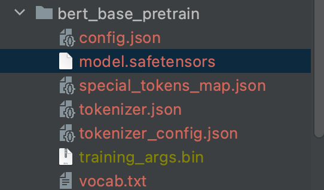
