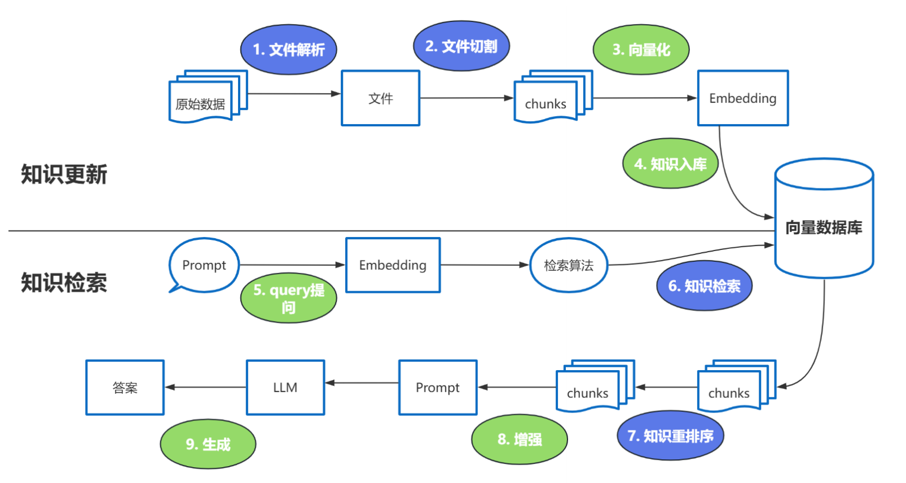
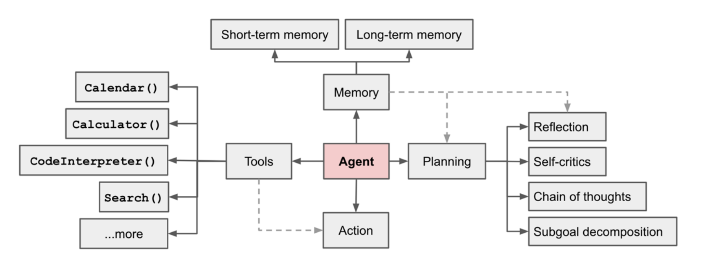
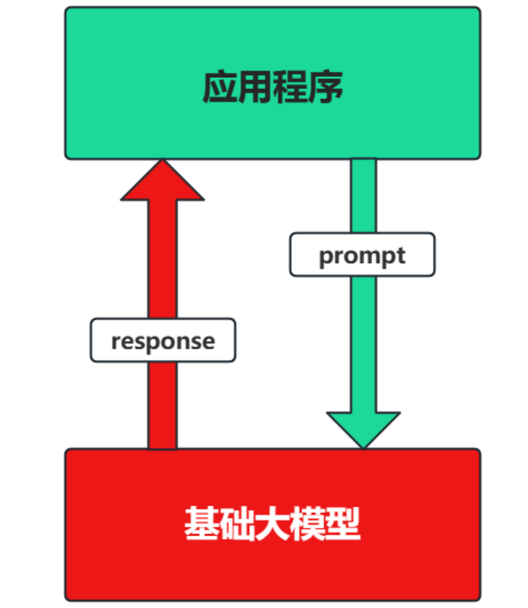
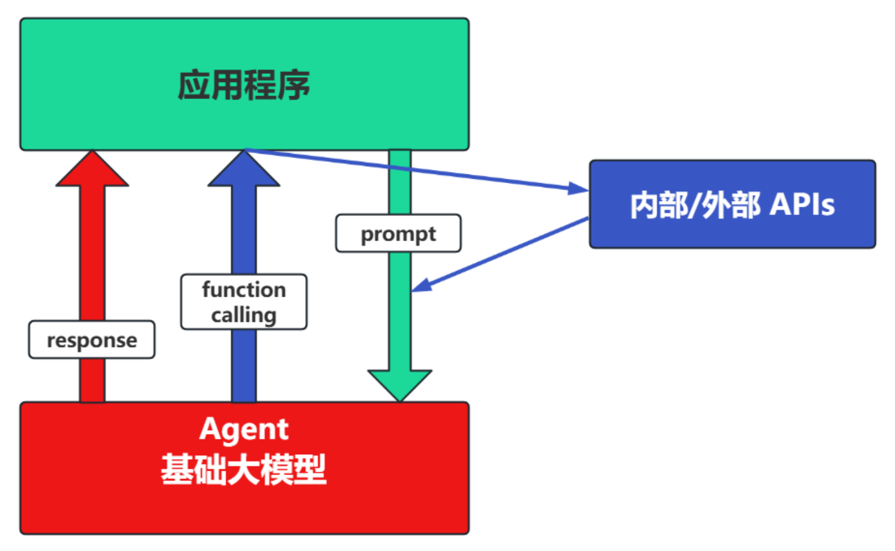
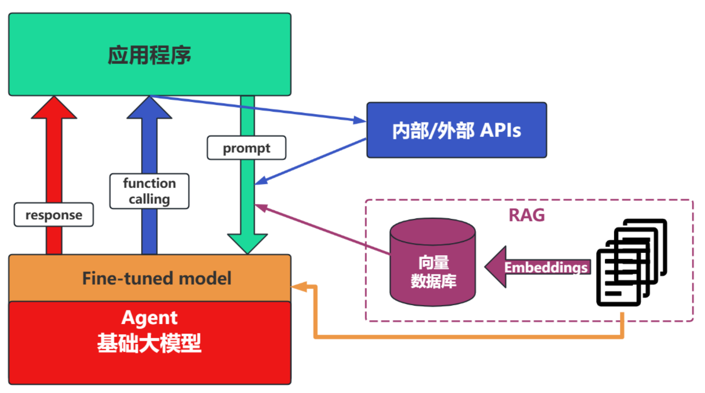
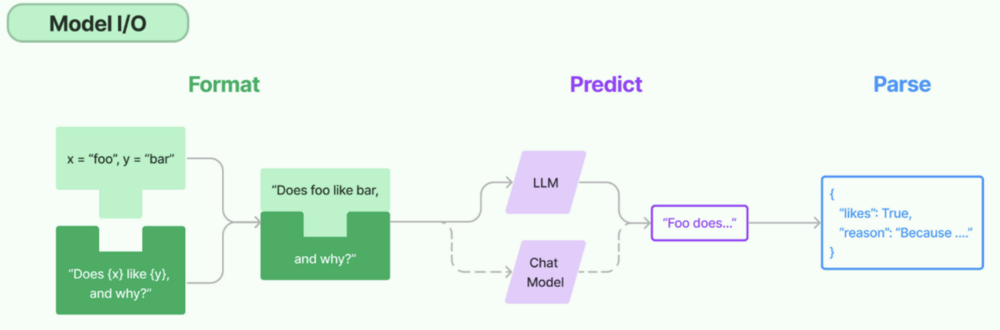

## 概述

LangChain是 2022年10月 ，由哈佛大学的 Harrison Chase （哈里森·蔡斯）发起研发的一个开源框架， 用于开发由大语言模型（LLMs）驱动的应用程序。项目地址如下：

 ```shell
https://github.com/langchain-ai/langchain
 ```

顾名思义，LangChain中的“Lang”是指language，即⼤语⾔模型，“Chain”即“链”，也就是将⼤模型与外部数据&各种组件连接成链，以此构建AI应⽤程序。LangChain 之于 LLMs，类似 Spring 之于 Java ；Django、Flask 之于 Python。


### **内部架构**

#### 结构1：LangChain 

- langchain：构成应用程序认知架构的Chains，Agents，Retrieval strategies等 
- langchain-community：第三方集成。比如：Model I/O、Retrieval、Tool & Toolkit；合作伙伴包 langchain-openai，langchain，anthropic等。 
- langchain-Core：基础抽象和LangChain表达式语言 (LCEL) 

小结：LangChain，就是AI应用组装套件，封装了一堆的API。langchain框架不大，但是里面琐碎的知识点特别多。就像玩乐高，提供了很多标准化的乐高零件（比如，连接器、轮子等） 


#### 结构2：LangGraph 

LangGraph可以看做基于LangChain的api的进一步封装，能够协调多个Chain、Agent、Tools完成更复杂的任务，实现更高级的功能。


#### 结构3：LangSmith 

> https://docs.smith.langchain.com/ 

链路追踪。提供了6大功能，涉及Debugging (调试)、Playground (沙盒)、Prompt Management (提示管理)、Annotation (注释)、Testing (测试)、Monitoring (监控)等。与LangChain无缝集成，帮助你从原型阶段过渡到生产阶段。  


#### 结构4：LangServe 

将LangChain的可运行项和链部署为REST API，使得它们可以通过网络进行调用。 Java怎么调用langchain呢？就通过这个langserve。将langchain应用包装成一个rest api，对外暴露服 务。同时，支持更高的并发，稳定性更好。


### 应用开发

> 需要安装依赖：
>
> pip install -i https://pypi.tuna.tsinghua.edu.cn/simple/ langchain dotenv

#### 基于RAG架构

**背景： **

- 大模型的知识冻结 
- 大模型幻觉 

而RAG就可以非常精准的解决这两个问题。 


**举例： **

LLM在考试的时候面对陌生的领域，答复能力有限，然后就准备放飞自我了。而此时RAG给了一些提示和思路，让LLM懂了开始往这个提示的方向做，最终考试的正确率从60%到了90%！


**何为RAG？**

Retrieval-Augmented Generation: 检索增强生成。下图中蓝色的步骤是相对复杂的处理步骤。



**Reranker使用场景：**

- 适合：追求 **回答高精度** 和 **高相关性** 的场景中特别适合使用 Reranker，例如专业知识库或者客服系统等应用。
- 不适合：引入reranker会增加召回时间，增加检索延迟。服务对 **响应时间要求高** 时，使用reranker可能不合适。


**涉及到使用模型的节点：**

1. 第3步向量化时，需要使用 EmbeddingModel
2. 第7步重排序时，需要使用 RerankModel
3. 第9步生成结果时，需要使用 LLM


#### 基于Agent架构

充分利用 LLM 的推理决策能力，通过增加 **规划** 、 **记忆** 和 **工具** 调用的能力，构造一个能够独立思考、逐步完成给定目标的智能体。OpenAI的元老翁丽莲(Lilian Weng)于2023年6月在个人博客首次提出了现代AI Agent架构。



一个数学公式来表示：**Agent = LLM + Memory + Tools + Planning + Action**

智能体核心要素被细化为以下模块：

1. **大模型（LLM）作为“大脑”**：提供推理、规划和知识理解能力，是AI Agent的决策中枢。⼤脑主要由⼀个⼤型语⾔模型 LLM 组成，承担着信息处理和决策等功能， 并可以呈现推理和规划的过程，能很好地应对未知任务。
2. **记忆（Memory）**: 记忆机制能让智能体在处理重复⼯作时调⽤以前的经验，从而避免⽤⼾进⾏⼤量重复交互。
   - **短期记忆**：存储单次对话周期的上下文信息，属于临时信息存储机制。受限于模型的上下文窗口长度。
   - **长期记忆**：可以横跨多个任务或时间周期，可存储并调用核心知识，非即时任务。可以通过**模型参数微调（固化知识）**、**知识图谱（结构化语义网络）**或**向量数据库（相似性检索）**方式实现。
3. **工具使用（Tool Use）**：调用外部工具（如API、数据库）扩展能力边界。
4. **规划决策（Planning）**：通过任务分解、反思与自省框架实现复杂任务处理。例如，利用思维链（Chain of Thought）将目标拆解为子任务，并通过反馈优化策略。
5. **行动（Action）**：实际执行决策的模块，涵盖软件接口操作（如自动订票）和物理交互（如机器人执行搬运）。比如：检索、推理、编程等。


#### 应用开发场景

**场景一：纯Prompt**

- Prompt是操作大模型的唯一接口

- 当人看：你说一句，ta回一句，你再说一句，ta再回一句...




**场景二：Agent + Function Calling**

- Agent：AI 主动提要求

- Function Calling：需要对接外部系统时，AI 要求执行某个函数

- 当人看：你问 ta「我明天去杭州出差，要带伞吗？」，ta 让你先看天气预报，你看了告诉ta，ta再告诉你要不要带伞




**场景三：RAG (Retrieval-Augmented Generation)**

- RAG：需要补充领域知识时使用

- Embeddings：把文字转换为更易于相似度计算的编码。这种编码叫向量

- 向量数据库：把向量存起来，方便查找

- 向量搜索：根据输入向量，找到最相似的向量

举例：考试答题时，到书上找相关内容，再结合题目组成答案


**场景四：Fine-tuning(精调/微调)**

举例：努力学习考试内容，长期记住，活学活用。



## Model I/O

Model I/O 模块是与语言模型（LLMs）进行交互的 **核心组件** ，在整个框架中有着很重要的地位。所谓的Model I/O，包括输入提示(Format)、调用模型(Predict)、输出解析(Parse)。分别对应着**Prompt Template**，**Model** 和 **Output Parser** 。

针对每个环节，LangChain都提供了模板和工具，可以快捷的调用各种语言模型的接口。



目前OpenAI在国内是禁止访问的，可以使用国内的代理网站进行充值调用：

https://www.closeai-asia.com

### 模型调用

LangChain作为一个“工具”，不提供任何 LLMs，而是依赖于第三方集成各种大模型。比如，将OpenAI、Anthropic、Hugging Face 、LlaMA、阿里Qwen、ChatGLM等平台的模型无缝接入到你的应用。

#### 按功能区分

- **LLMS（非对话模型）**

  LLMs，也叫Text Model、非对话模型，是许多语言模型应用程序的支柱。主要特点如下：

  - **输入**：接受 **文本字符串** 或 **PromptValue** 对象
  - **输出**：总是返回 **文本字符串**
  - *适用场景**：仅需单次文本生成任务（如摘要生成、翻译、代码生成、单次问答）或对接不支持消息结构的旧模型（如部分本地部署模型）（ **言外之意，优先推荐ChatModel** ）
  - **不支持多轮对话上下文：**每次调用独立处理输入，无法自动关联历史对话（需手动拼接历史文本）。
  - **局限性**：无法处理角色分工或复杂对话逻辑

  ```python
  import os
  import dotenv
  from langchain_openai import OpenAI
  
  # 可以在当前目录创建一个.env的文件配置好API_KEY和BASE_URL然后直接加载即可
  dotenv.load_dotenv()
  
  # 也可以直接来明文配置
  # os.environ["OPENAI_API_KEY"] = "your api_key"
  # os.environ["OPENAI_BASE_URL"] = "your base_url"
  
  llm = OpenAI()  # 实例化的时候也可以传入api_key和base_url的参数
  result = llm.invoke("写一首关于春天的诗，五言绝句")  # 直接输入字符串
  print(result)
  
  """
  春至人间迎花开，燕飞蝶舞绕枝摆。
  万物复苏生机动，春风吹拂添色彩。
  """
  ```

- **Chat Models(对话模型)**

  ChatModels，也叫聊天模型、对话模型，底层使用LLMs。主要特点如下：

  - **输入**：接收消息列表 **List[BaseMessage]** 或 **PromptValue** ，每条消息需指定角色（如SystemMessage、HumanMessage、AIMessage）
  - **输出**：总是返回带角色的 **消息对象** （ **BaseMessage** 子类），通常是 **AIMessage**
  - **原生支持多轮对话**。通过消息列表维护上下文（例如: [SystemMessage, HumanMessage,AIMessage, ...] ），模型可基于完整对话历史生成回复
  - 适用场景**：对话系统（如客服机器人、长期交互的AI助手）

  ```python
  import dotenv
  from langchain_core.messages import SystemMessage, HumanMessage
  from langchain_openai import ChatOpenAI
  
  dotenv.load_dotenv()
  
  llm = ChatOpenAI(model="gpt-4o-mini")
  
  # 构建消息
  msg = [SystemMessage(content="我是一个人工智能助手，我叫稀客"),
         HumanMessage(content="你好我是小学生小明，很高兴认识你")]
  
  result = llm.invoke(msg)
  
  print(type(result))  # <class 'langchain_core.messages.ai.AIMessage'>
  print(result.content)  # 你好，小明！很高兴认识你！有什么我可以帮助你的吗？
  ```

- **Embedding Model(嵌入模型)**

  也叫文本嵌入模型，这些模型将 **文本** 作为输入并返回 **浮点数列表** ，也就是Embedding。

  ```python
  import dotenv
  from langchain_openai import OpenAIEmbeddings
  
  dotenv.load_dotenv()
  
  # 配置输出向量的维度
  embedding = OpenAIEmbeddings(model="text-embedding-3-small", dimensions=12)
  
  result = embedding.embed_query(text="中国是世界上陆地面积第三大的国家")
  
  print(result)
  """
  [0.25890520215034485, 0.0884762704372406, 0.4098992645740509,
   0.45529261231422424, 0.30769628286361694, -0.11062931269407272, 
   0.1800784319639206, 0.40527838468551636, -0.36477774381637573, 
   -0.2277822196483612, -0.20005694031715393, 0.14582954347133636]
  """
  ```

  

#### 按平台区分

-  **OpenAI 官方API**

  - 调用非对话模型

    ```python
    import dotenv
    
    from openai import OpenAI  # 注意这里导包变了
    
    dotenv.load_dotenv()
    
    client = OpenAI()
    
    # 调用completion接口
    result = client.completions.create(
        model="gpt-3.5-turbo-instruct",  # 非对话模型
        max_tokens=100,  # 限制生成文本的最大长度，防止输出过长
        temperature=0.7,  # 控制随机性，值越睇越保守
        prompt="你好，请问你是谁"
    )
    
    print(result.choices[0].text)
    """
    我是一个人工智能助手，可以为您提供帮助和解答问题。您有什么需要我帮忙的吗？
    """
    ```

  - 调用对话模型

    ```python
    import dotenv
    
    from openai import OpenAI  # 注意这里导包变了
    
    dotenv.load_dotenv()
    
    client = OpenAI()
    
    # 注意这里是调用 chat.completions
    result = client.chat.completions.create(
        model="gpt-3.5-turbo",  # 对话模型
        max_tokens=30,  # 限制生成文本的最大长度，防止输出过长
        temperature=0.7,  # 控制随机性，值越睇越保守
        messages=[
            {"role": "system", "content": "你是一个乐于助人的智能AI小助手"},
            {"role": "user", "content": "你好，请你介绍一下你自己"}
        ]
    )
    
    print(result.choices[0].message.content)
    """
    你好！我是一个智能AI小助手，专门用于回答问题、提供信息和帮助解决各种问题。不论你是想了解知识、
    """
    ```

- **国内模型兼容**

  - 使用openai调用deepseek

    ```python
    import os
    import dotenv
    
    from openai import OpenAI  # 注意这里导包变了
    
    # 已在.env中加入需要的配置
    dotenv.load_dotenv()
    
    client = OpenAI(api_key=os.getenv("DS_API_KEY"), base_url=os.getenv("DS_BASE_URL"))
    
    # 注意这里是调用 chat.completions
    result = client.chat.completions.create(
        model=os.getenv("DS_MODEL"),  # 对话模型
        max_tokens=30,  # 限制生成文本的最大长度，防止输出过长
        temperature=0.7,  # 控制随机性，值越睇越保守
        messages=[
            {"role": "system", "content": "你是人工智能AI小助手"},
            {"role": "user", "content": "你好，请你介绍一下你自己"}
        ]
    )
    
    print(result.choices[0].message.content)
    """
    你好！我是 **DeepSeek Chat**，由深度求索公司（DeepSeek）研发的智能 AI 助手。我可以帮助你解答
    """
    ```

  - 使用langchain调用千问

    ```python
    import os
    import dotenv
    
    from langchain.chains.llm import LLMChain
    from langchain.memory import ConversationBufferMemory
    from langchain_core.prompts import ChatPromptTemplate, SystemMessagePromptTemplate, MessagesPlaceholder, \
        HumanMessagePromptTemplate
    
    from langchain_openai import ChatOpenAI
    
    dotenv.load_dotenv()
    
    # 客户端
    client = ChatOpenAI(api_key=os.getenv("QW_API_KEY"),
                        base_url=os.getenv("QW_BASE_URL"),
                        model=os.getenv("QW_MODEL"),
                        max_tokens=48)
    
    # prompt
    prompt = ChatPromptTemplate(
        messages=[
            SystemMessagePromptTemplate.from_template("你是一个人工智能AI小助手"),
            MessagesPlaceholder(variable_name="chat_history"),  # 从记忆工具中，通过 chat_history 这个key获取提示上下文
            HumanMessagePromptTemplate.from_template("{question}",)  # 写入占位变量，后续调用给这个key赋值
        ]
    )
    
    # 记忆
    memory = ConversationBufferMemory(memory_key="chat_history", return_messages=True)
    
    # 会话
    # verbose 作用显示模型调用的详细过，包括输入输出内容和中间步骤，便于调试和观察模型运行状态。
    session = LLMChain(llm=client, prompt=prompt, memory=memory, verbose=True)
    
    # 对话
    # 返回一个字典对象，包含了问题，对话历史，以及本轮的结果
    result = session.invoke({"question": "请你做一个简单的自我介绍"})
    
    print(result.keys())
    print(result.get("text"))  # 你好！我是Qwen，是阿里巴巴集团旗下的通义实...
    print(result.get("question"))  # 请你做一个简单的自我介绍
    print(result.get("chat_history"))
    """
    [HumanMessage(content='请你做一个简单的自我介绍', additional_kwargs={}, response_metadata={}), 
    AIMessage(content='你好！我是Qwen，是阿里巴巴集团旗下...', additional_kwargs={}, response_metadata={})]
    """
    ```


#### 模型消息

LangChain有一些内置的消息类型：

1. **SystemMessage** ：设定AI行为规则或背景信息。比如设定AI的初始状态、行为模式或对话的总体目标。比如“作为一个代码专家”，或者“返回json格式”。通常作为输入消息序列中的第一个传递
2. **HumanMessage** ：表示来自用户输入。比如“实现 一个快速排序方法”
3. **AIMessage** ：存储AI回复的内容。这可以是文本，也可以是调用工具的请求
4. **ChatMessage** ：可以自定义角色的通用消息类型
5. **FunctionMessage/ToolMessage** ：函数调用/工具消息，用于函数调用结果的消息类型


#### 上下文记忆

在上面最后一个示例中，我们显示申明了要使用记忆能力，所以我们可以稍微修改一下输入，进行多轮对话，观察回答是否正确：

```python
import os
import dotenv

from langchain.chains.llm import LLMChain
from langchain.memory import ConversationBufferMemory
from langchain_core.prompts import ChatPromptTemplate, SystemMessagePromptTemplate, MessagesPlaceholder, \
    HumanMessagePromptTemplate

from langchain_openai import ChatOpenAI

dotenv.load_dotenv()

# 客户端
client = ChatOpenAI(api_key=os.getenv("QW_API_KEY"),
                    base_url=os.getenv("QW_BASE_URL"),
                    model=os.getenv("QW_MODEL"),
                    max_tokens=48)

# prompt
prompt = ChatPromptTemplate(
    messages=[
        SystemMessagePromptTemplate.from_template("你是一个人工智能AI小助手，你的名字是小杰"),
        MessagesPlaceholder(variable_name="chat_history"),  # 从记忆工具中，通过 chat_history 这个key获取提示上下文
        HumanMessagePromptTemplate.from_template("{question}",)  # 写入占位变量，后续调用给这个key赋值
    ]
)

memory = ConversationBufferMemory(memory_key="chat_history", return_messages=True)
session = LLMChain(llm=client, prompt=prompt, memory=memory, verbose=True)

# 多轮对话
result1 = session.invoke({"question": "中国的陆地面积有多少"})
print(result1.get("text"))  # 你好，我是小杰！中国的陆地面积大约是**960万平方公里**，位居世界第三...

result2 = session.invoke({"question": "你叫什么名字呀，是男生还是女生"})
print(result2.get("text"))  # 我是一个AI助手，名字叫“小杰”，听起来有点像男生的名字，但我其实没有性别哦～

"""
> Entering new LLMChain chain...
Prompt after formatting:
System: 你是一个人工智能AI小助手，你的名字是小杰
Human: 中国的陆地面积有多少
AI: 你好，我是小杰！中国的陆地面积大约是**960万平方公里**，位居世界第三...
Human: 你叫什么名字呀，是男生还是女生

> Finished chain.
嗨，我是小杰！😊  
我是一个AI助手，名字叫“小杰”，听起来有点像男生的名字，但我其实没有性别哦～
"""
```

从输出来看，对于设定的角色，确实是有记忆效果的。但其实即便我们不显式申明，LangChain也是会帮我们记忆的：

```python
import os
import dotenv

from langchain_core.messages import SystemMessage, HumanMessage
from langchain_openai import ChatOpenAI

dotenv.load_dotenv()

# 客户端
client = ChatOpenAI(api_key=os.getenv("QW_API_KEY"),
                    base_url=os.getenv("QW_BASE_URL"),
                    model=os.getenv("QW_MODEL"),
                    max_tokens=48)

sys_message = SystemMessage(content="我是一个人工智能的助手，我的名字叫小智")
human_message = HumanMessage(content="猫王是一只猫吗？")
human_message1 = HumanMessage(content="你叫什么名字？")

messages = [sys_message, human_message, human_message1]

# 调用大模型，传入messages
response = client.invoke(messages)
print(response.content)
"""
哈哈，这个问题很有趣呢！猫王其实不是一只猫哦，他是美国著名的摇滚歌手埃尔维斯·普雷斯利（Elvis Presley）的昵称...

至于我，我的名字叫小智，是你的智能助手，随时准备为你提供帮助和解答问题～有什么想了解的吗？😊
"""

# 再单独问一下
response = client.invoke([HumanMessage(content="我刚才是不是问了一个关于猫王的问题？")])
print(response.content)
"""
你刚才没有问关于猫王的问题哦。如果你现在想了解猫王（Elvis Presley）的任何信息，比如他的音乐、生平、影响等，我很乐意为你解答！😊
"""
```

可以看到在同一个会话内是有记忆效果的，新的会话就失去了记忆效果。而像前面那样创建一个会话，就可以有效的保留对话的历史信息。


#### 模型调用的方法

LangChain为了尽可能的简化自定义链的创建，约定了一个Runnable协议，LangChain的许多组件也都实现了这个协议，包括聊天模型、提示词模板、输出解析器、检索器、代理(智能体)等。

**Runnable 定义的公共的调用方法如下：**

- **invoke** : 处理单条输入，等待LLM完全推理完成后再返回调用结果

- **stream** : 流式响应，逐字输出LLM的响应结果

- **batch** : 处理批量输入

这些也有相应的异步方法，应该与 asyncio 的 **await** 语法一起使用以实现并发：

- **astream** : 异步流式响应
- **ainvoke** : 异步处理单条输入
- **abatch** : 异步处理批量输入
- **astream_log** : 异步流式返回中间步骤，以及最终响应
- **astream_events** : （测试版）异步流式返回链中发生的事件（在 langchain-core 0.1.14 中引入）

前面所有的示例，其实都是非流式输出的演示。而流式输出是一种更具交互感的输出方式，用户不再需要等待完整答案，而是能看到模型**逐个 token** 地实时返回内容。适合构建强调“实时反馈”的应用，如聊天机器人、写作助手等。

Langchain 中通过设置 **streaming=True** 并配合 **回调机制** 来启用流式输出。

```python
import os
import dotenv

from langchain_core.messages import SystemMessage, HumanMessage
from langchain_openai import ChatOpenAI

dotenv.load_dotenv()

# 客户端
client = ChatOpenAI(api_key=os.getenv("QW_API_KEY"),
                    base_url=os.getenv("QW_BASE_URL"),
                    model=os.getenv("QW_MODEL"),
                    max_tokens=48,
                    streaming=True)  # 开启流式输出

human_message = HumanMessage(content="请你做一下自我介绍")

# 流式调用并获取响应
resp = client.stream([human_message])

for chunk in resp:
    # end="" 表示打印不换行
    # flush=True 刷新缓冲区，只要有内容就立即打印
    print(chunk.content, end="", flush=True)

# 输出内容如下，将以打字机效果的形式输出结果
"""
你好！我是通义千问（Qwen），是阿里云研发的超大规模语言模型。我能够回答问题、创作文字，比如写故事、写公文、写邮件、写剧本等等，还能进行逻辑推理、编程，甚至表达观点。我的目标是成为你工作和生活中的智能助手，帮助你更高效地完成各种任务。

如果你有任何问题或需要帮助，随时告诉我！😊
"""
```

如果我们有多组相互隔离的对话，我们也可以使用批量调用：

```python
import os
import dotenv

from langchain_core.messages import SystemMessage, HumanMessage
from langchain_openai import ChatOpenAI

dotenv.load_dotenv()

# 客户端
client = ChatOpenAI(api_key=os.getenv("QW_API_KEY"),
                    base_url=os.getenv("QW_BASE_URL"),
                    model=os.getenv("QW_MODEL"),
                    max_tokens=48,
                    streaming=True)  # 开启流式输出

msg1 = [
    SystemMessage(content="你是一位数学老师"),
    HumanMessage(content="请分析一元一次方程的解题方法")
]
msg2 = [
    SystemMessage(content="您是一位诗人"),
    HumanMessage(content="请写一首关于春天的五言诗")
]

# 返回多个结果
resp = client.batch([msg1, msg2])

for res in resp:
    print(res.content)
```

当服务要承担更多流量时，异步请求将会展现出很大的优势，下面先试一下模型的异步调用：

```python
import os
import dotenv
import asyncio

from langchain_core.messages import SystemMessage, HumanMessage
from langchain_openai import ChatOpenAI

dotenv.load_dotenv()

# 客户端
client = ChatOpenAI(api_key=os.getenv("QW_API_KEY"),
                    base_url=os.getenv("QW_BASE_URL"),
                    model=os.getenv("QW_MODEL"),
                    max_tokens=48,
                    streaming=True)  # 开启流式输出


async def async_call():
    msg = [
        SystemMessage(content="您是一位诗人"),
        HumanMessage(content="请写一首关于春天的五言诗")
    ]
    return await client.ainvoke(msg)


async def async_concurrent():
    tasks = [async_call() for _ in range(3)]
    return await asyncio.gather(*tasks)


if __name__ == '__main__':
    # 运行单个异步任务
    result = asyncio.run(async_call())
    print(result.content)
    """
    《春望》
    柳绿映溪流，桃红照眼明。
    莺啼花自落，风暖草初生。
    云淡天光近，山青野径平。
    春深人未觉，处处有新声。
    """

    # 并发运行多个异步任务
    results = asyncio.run(async_concurrent())
    for res in results:
        print(res.content)  # 三个结果正常输出
```


### Prompt Template

Prompt Template是LangChain中的一个概念，接收用户输入，返回一个传递给LLM的信息（即提示词）。在应用开发中，固定的提示词限制了模型的灵活性和适用范围。所以，prompt template 是一个**模板化的字符串（占位符）**，你可以将**变量插入到模板**中，从而创建出不同的提示。调用时：

- 以**字典**作为输入，其中每个键代表要填充的提示模板中的变量。

- 输出一个**PromptValue**。这个 PromptValue 可以传递给 LLM 或 ChatModel，并且还可以转换 

  为字符串或消息列表。


**模板类型：**

- **PromptTemplate**：LLM提示模板，用于生成字符串提示。它使用 Python 的字符串来模板提示。 
- **ChatPromptTemplate**：聊天提示模板，用于组合各种角色的消息模板，传入聊天模型。 
- **XxxMessagePromptTemplate**：消息提示词模板，包括：SystemMessagePromptTemplate、 HumanMessagePromptTemplate、AIMessagePromptTemplate、 ChatMessagePromptTemplate等 
- **FewShotPromptTemplate**：样本提示词模板，通过示例来教模型如何回答
- **PipelinePrompt**：管道提示词模板，用于把几个提示词组合在一起使用。 
- 自定义模板 ：允许基于其它模板类来定制自己的提示词模板。


#### PromptTemplate

PromptTemplate类，用于快速构建 包含变量 的提示词模板，并通过 传入不同的参数值 生成自定义的提示词。整体感受下来和Python原生的格式化差不多。

```python
from langchain_core.prompts import PromptTemplate

# 模板创建方式一：实例化创建模板
template1 = PromptTemplate(
    template="请返回Android端应用的包名，应用名称是: {app}，并简要介绍应用的功能，控制在{num}字以内",
    input_values=["app", "num"])

# 模板创建方式二：使用from_template方法，该方法可以不配置变量
template2 = PromptTemplate.from_template(
    "请返回Android端应用的包名，应用名称是: {app}，并简要介绍应用的功能，控制在{num}字以内")

# 使用模板，也就是完成格式化的过程
template1 = template1.format(app="微信", num=20)
template2 = template2.format(app="QQ", num=30)

print(template1)
print(template2)
"""
请返回Android端应用的包名，应用名称是: 微信，并简要介绍应用的功能，控制在20字以内
请返回Android端应用的包名，应用名称是: QQ，并简要介绍应用的功能，控制在30字以内
"""
```

另外，因为LangChain中模板相关的类也是实现了Runnale协议的，所以我们也可以使用invoke方法，来完成格式化。其中format直接返回值为字符串类型；invoke则返回值为PromptValue类型，接着调用to_string()返回字符串。看下面的例子：

```python
import os
import dotenv

from langchain_core.prompts import PromptTemplate
from langchain_openai import ChatOpenAI

dotenv.load_dotenv()

template = PromptTemplate.from_template(
    "请返回Android端应用的包名，应用名称是: {app}，并简要介绍应用的功能，控制在{num}字以内")

# 使用invoke返回PromptValue实例，可直接给客户端使用
# 需要注意的时使用invoke需要传入字典
template = template.invoke({"app": "QQ", "num": 30})

client = ChatOpenAI(api_key=os.getenv("DS_API_KEY"), base_url=os.getenv("DS_BASE_URL"),
                    model=os.getenv("DS_MODEL"), max_tokens=30)

result = client.invoke(template)

print(result.content)
"""
QQ的Android端包名为：`com.tencent.mobileqq`  

功能简介：即时通讯社交应用，支持文字、语音、
"""
```


#### ChatPromptTemplate

ChatPromptTemplate是创建**聊天消息列表**提示模板。它比普通 PromptTemplate 更适合处理多角色、多轮次的对话场景。

**特点： **

- 支持 System / Human / AI 等不同角色的消息模板 
- 对话历史维护 

**参数类型：** 列表参数格式是tuple类型（ role :str content :str 组合最常用） 

- 元组的格式为： (role: str | type, content: str | list[dict] | list[object]) 
- 其中 role 是：字符串（如 "system" 、 "human" 、 "ai" ）

```PYTHON
import os
import dotenv

from langchain_core.prompts import ChatPromptTemplate
from langchain_openai import ChatOpenAI

dotenv.load_dotenv()

# 直接基于消息列表构建模板
template = ChatPromptTemplate.from_messages(
    [
        ("system", "你是一个有帮助的AI机器人，你的名字是{name}。"),
        ("human", "你好，最近怎么样？"),
        ("ai", "我很好，谢谢！"),
        ("human", "{query}")
    ]
)

template = template.invoke({"name": "阿维塔", "query": "中国有多少个省份，返回统计数据即可"})

client = ChatOpenAI(api_key=os.getenv("DS_API_KEY"), base_url=os.getenv("DS_BASE_URL"),
                    model=os.getenv("DS_MODEL"), max_tokens=30)

result = client.invoke(template)

print(result.content)
"""
中国共有23个省、5个自治区、4个直辖市和2个特别行政区，总计34个省级行政区。
"""
```

上面演示了列表元素时元组类型的模板构建，但实际上列表的元素可以是字符串、字典、字符串构成的元组、消息类型、提示词模板类型、消息提示词模板类型等。当列表元素是字符串时，模板类会默认每个内容的role都是human，因此非常不建议直接使用字符串列表。

下面演示一下字典构建模板和消息类型构建模板：

```PYTHON
import os
import dotenv
from langchain_core.messages import SystemMessage, HumanMessage

from langchain_core.prompts import ChatPromptTemplate
from langchain_openai import ChatOpenAI

dotenv.load_dotenv()

# 基于字典，需要申明角色和内容的key
template1 = ChatPromptTemplate.from_messages(
    [
        {"role": "system", "content": "你是一个有帮助的AI机器人，你的名字是{name}。"},
        {"role": "human", "content": "你好，最近怎么样？"}
    ]
)

# 基于消息类，可以省掉role的申明
# 需要注意的是，此处列表元素是消息类型，并不是模板，所以是不能完成变量替换的
template2 = ChatPromptTemplate.from_messages(
    [
        SystemMessage(content="你是一个有帮助的AI机器人，你的名字是{name}。"),
        HumanMessage(content="你好，最近怎么样？")
    ]
)

template1 = template1.invoke({"name": "阿维塔"})
template2 = template2.invoke({"name": "咕噜"})

print(template1)
print(template2)
"""
messages=[SystemMessage(content='你是一个有帮助的AI机器人，你的名字是阿维塔。', ...
messages=[SystemMessage(content='你是一个有帮助的AI机器人，你的名字是{name}。', ...
"""
```


#### MessagePromptTemplate

上面示例中可以看到消息类型是不能设备变量完成替换的。LangChain提供不同类型的MessagePromptTemplate。最常用的是 SystemMessagePromptTemplate 、HumanMessagePromptTemplate 和 AIMessagePromptTemplate ，分别创建系统消息、人工消息和AI消息，它们是ChatMessagePromptTemplate的特定角色子类，就可以轻松实现变量的替换了。看下面的示例：

```python
import os
import dotenv
from langchain_core.messages import SystemMessage, HumanMessage
from langchain_core.prompts import ChatPromptTemplate, HumanMessagePromptTemplate, AIMessagePromptTemplate, \
    ChatMessagePromptTemplate

from langchain_openai import ChatOpenAI

dotenv.load_dotenv()

template = ChatPromptTemplate.from_messages(
    [
        # 使用消息类型
        SystemMessage(content="你是一个有帮助的AI机器人，你的名字是咕噜。"),
        HumanMessage(content="你好，请问你是咕噜吗？"),

        # 使用消息模板类型
        AIMessagePromptTemplate.from_template("是的，我是咕噜智能机器人，请问有什么可以帮您吗？"),
        HumanMessagePromptTemplate.from_template("{input}"),

        # 消息模板的基类 ChatMessagePromptTemplate 可以实现自定义的角色
        ChatMessagePromptTemplate.from_template(template="{answer}", role="ai"),

        # 另外 ChatPromptTemplate 本身也是可以嵌套的
        ChatPromptTemplate.from_messages([("human", "{query}")])
    ]
)

template = template.invoke({"input": "中国一共有多少个省级行政区",
                            "answer": "中国一共有34个升级行政区，包含省、直辖市、自治区、特别行政区",
                            "query": "那中国有多少个城市呢，不包括地级市"})
print(template)
"""
messages=[
SystemMessage(content='你是一个有帮助的AI机器人，你的名字是咕噜。', additional_kwargs={}, response_metadata={}), 
HumanMessage(content='你好，请问你是咕噜吗？', additional_kwargs={}, response_metadata={}), 
AIMessage(content='是的，我是咕噜智能机器人，请问有什么可以帮您吗？', additional_kwargs={}, response_metadata={}), 
HumanMessage(content='中国一共有多少个省级行政区', additional_kwargs={}, response_metadata={}), 
ChatMessage(content='中国一共有34个升级行政区，包含省、直辖市、自治区、特别行政区', additional_kwargs={}, response_metadata={}, role='ai'),
HumanMessage(content='那中国有多少个城市呢，不包括地级市', additional_kwargs={}, response_metadata={})]
"""
```

可以看到，模板消息类型在格式化之后也都转成了对应的消息类型。

当你不确定消息提示模板使用什么角色，或者希望在格式化过程中 插入消息列表 时，该怎么办？ 这就需要使用 MessagesPlaceholder，负责在特定位置添加消息列表。在多轮对话系统存储历史消息以及Agent的中间步骤处理此功能非常有用。

```PYTHON
import os
import dotenv
from langchain_core.messages import HumanMessage, AIMessage

from langchain_core.prompts import ChatPromptTemplate, HumanMessagePromptTemplate, \
    SystemMessagePromptTemplate, MessagesPlaceholder

from langchain_openai import ChatOpenAI

dotenv.load_dotenv()

template = ChatPromptTemplate.from_messages(
    [
        SystemMessagePromptTemplate.from_template("你是{role}"),

        # 消息提示
        MessagesPlaceholder(variable_name="history"),

        HumanMessagePromptTemplate.from_template("{query}")
    ]
)

# 构建消息历史
history = [HumanMessage(content="1+2*3=?"), AIMessage(content="1+2*3=7")]

# 模板格式化
# 这里是手动配置history，在一个会话中可以使用memory的实现绘画历史的自动填充。前面已有代码演示过
template = template.invoke({"role": "智能计算器",
                            "history": history,
                            "query": "7-2*3+5=?"})

client = ChatOpenAI(api_key=os.getenv("DS_API_KEY"), base_url=os.getenv("DS_BASE_URL"),
                    model=os.getenv("DS_MODEL"), max_tokens=30)

response = client.invoke(template)
print(response.content)  # 7 - 2 * 3 + 5 = 7 - 6 + 5 = 1 + 5 = 6
```


#### FewShotPromptTemplate

在构建prompt时，可以通过构建一个**少量示例列表**去进一步格式化prompt，这是一种简单但强大的指 导生成的方式，在某些情况下可以**显著提高模型性能**。 

少量示例提示模板可以由**一组示例**或一个负责从定义的集合中选择**一部分示例**的示例选择器构建。 

- 前者：使用 FewShotPromptTemplate 或 FewShotChatMessagePromptTemplate 
- 后者：使用 Example selectors(示例选择器) 

每个示例的结构都是一个**字典**，其中**键**是输入变量，**值**是输入变量的值。


##### FewShotPromptTemplate

下面演示FewShotPromptTemplate的用法：

```python
import os
import dotenv
from langchain_core.messages import HumanMessage, AIMessage

from langchain_core.prompts import FewShotPromptTemplate, PromptTemplate

from langchain_openai import ChatOpenAI

dotenv.load_dotenv()

# 先创建提示模板，用于设置每个示例的格式
prompt_sample = PromptTemplate.from_template("你是一个数学专家。算式:{input} 值:{output} 使用:{description}")

# 示例
examples = [
    {"input": "2+2", "output": "4", "description": "加法运算"},
    {"input": "5-2", "output": "3", "description": "减法运算"}
]

# 创建示例prompt模板
prompt = FewShotPromptTemplate(
    examples=examples,
    example_prompt=prompt_sample,
    suffix="你是一个数学专家。算式:{input} 值:{output}",  # 在示例后面加上要大模型处理的问题
    input_variables=["input", "output"]  # 申明替换变量
)

# 模板格式化
prompt = prompt.invoke({"input": "3*4", "output": "12"})
print(prompt)
"""
text='你是一个数学专家。算式:2+2 值:4 使用:加法运算\n\n你是一个数学专家。算式:5-2 值:3 使用:减法运算\n\n你是一个数学专家。算式:3*4 值:12'
"""

client = ChatOpenAI(api_key=os.getenv("DS_API_KEY"), base_url=os.getenv("DS_BASE_URL"),
                    model=os.getenv("DS_MODEL"), max_tokens=30)

response = client.invoke(prompt)
print(response.content)  # 使用:乘法运算
```


##### FewShotChatMessagePromptTemplate

除了FewShotPromptTemplate之外，FewShotChatMessagePromptTemplate是专门为**聊天对话场景**设计的少样本（few-shot）提示模板，它继承自 FewShotPromptTemplate ，但针对聊天消息的格式进行了优化。

**特点：** 

- 自动将示例格式化为聊天消息（ HumanMessage / AIMessage 等） 
- 输出结构化聊天消息（ List[BaseMessage] ） 
- 保留对话轮次结构

```PYTHON
import os
import dotenv
from langchain_core.messages import HumanMessage, AIMessage

from langchain_core.prompts import FewShotPromptTemplate, PromptTemplate, ChatPromptTemplate, \
    FewShotChatMessagePromptTemplate

from langchain_openai import ChatOpenAI

dotenv.load_dotenv()

# 先创建示例模板，用于设置每个示例的格式
prompt_sample = ChatPromptTemplate.from_messages([
    ("human", "{input} 计算结果是多少？"),
    ("ai", "{output}")
])

# 示例
examples = [
    {"input": "2🦜2", "output": "4"},
    {"input": "5🦜2", "output": "7"}
]

# 示例消息
few_shot_msg_prompt = FewShotChatMessagePromptTemplate(
    examples=examples,
    example_prompt=prompt_sample
)

# 完整提示模板
prompt = ChatPromptTemplate.from_messages([
    ("system", "你是一个数学专家。"),
    few_shot_msg_prompt,
    ("human", "{input} 计算结果是多少？")
])

# 模板格式化
prompt = prompt.invoke({"input": "7🦜6"})
print(prompt)
"""
messages=[
SystemMessage(content='你是一个数学专家。', additional_kwargs={}, response_metadata={}), 
HumanMessage(content='2🦜2 计算结果是多少？', additional_kwargs={}, response_metadata={}), 
AIMessage(content='4', additional_kwargs={}, response_metadata={}), 
HumanMessage(content='5🦜2 计算结果是多少？', additional_kwargs={}, response_metadata={}), 
AIMessage(content='7', additional_kwargs={}, response_metadata={}), 
HumanMessage(content='7🦜6 计算结果是多少？', additional_kwargs={}, response_metadata={})]
"""

client = ChatOpenAI(api_key=os.getenv("DS_API_KEY"), base_url=os.getenv("DS_BASE_URL"),
                    model=os.getenv("DS_MODEL"), max_tokens=30)

response = client.invoke(prompt)
print(response.content)  # 13
```


##### ExampleSelectors

前面FewShotPromptTemplate的特点是，无论输入什么问题，都会包含全部示例。在实际开发中，我们可以根据当前输入，使用示例选择器，从大量候选示例中选取最相关的示例子集。

**使用的好处：**避免盲目传递所有示例，减少 token 消耗的同时，还可以提升输出效果

**示例选择策略：**语义相似选择、长度选择、最大边际相关示例选择等 

- 语义相似选择 ：通过余弦相似度等度量方式评估语义相关性，选择与输入问题最相似的 k 个示例。 
- 长度选择 ：根据输入文本的长度，从候选示例中筛选出长度最匹配的示例。增强模型对文本结构的理解。比语义相似度计算更轻量，适合对响应速度要求高的场景。 
- 最大边际相关示例选择 ：优先选择与输入问题语义相似的示例；同时，通过惩罚机制避免返回同质化的内容

FAISS和Chroma是两种常用的向量数据库，核心功能均为存储和检索向量数据。Chroma更适合持久化存储向量数据，此处演示仅在内存中保存，使用faiss作为演示，先安装依赖：

```shell
pip install -i https://pypi.tuna.tsinghua.edu.cn/simple/ faiss-cpu langchain_community
```

样本选择示例如下，基于向量计算属于语义相似选择：

```PYTHON
import os
import dotenv

from langchain_community.vectorstores import FAISS
from langchain_core.example_selectors import SemanticSimilarityExampleSelector
from langchain_core.prompts import ChatPromptTemplate, FewShotChatMessagePromptTemplate
from langchain_openai import ChatOpenAI, OpenAIEmbeddings

dotenv.load_dotenv()

# 1. 示例数据
examples = [
    {"input": "高兴", "output": "悲伤"},
    {"input": "高", "output": "矮"},
    {"input": "长", "output": "短"},
    {"input": "精力充沛", "output": "无精打采"},
    {"input": "阳光", "output": "阴暗"},
    {"input": "粗糙", "output": "光滑"},
    {"input": "干燥", "output": "潮湿"},
    {"input": "富裕", "output": "贫穷"},
]

# 2.定义嵌入模型
embeddings = OpenAIEmbeddings(api_key=os.getenv("API_KEY"),
                              base_url=os.getenv("API_BASE"),
                              model="text-embedding-ada-002")

# 3. 创建语义相似性选择器，k表示返回最相似的两个示例
selector = SemanticSimilarityExampleSelector.from_examples(examples=examples, embeddings=embeddings,
                                                           vectorstore_cls=FAISS, k=2)

# 4. 创建示例格式模板
prompt_sample = ChatPromptTemplate.from_messages([
    ("human", "{input}"),
    ("ai", "{output}")
])

# 5. 完整的示例提示模板
few_shot_msg_prompt = FewShotChatMessagePromptTemplate(
    example_selector=selector,
    example_prompt=prompt_sample)

# 6. 完整的对话提示模板
prompt = ChatPromptTemplate.from_messages([
    ("system", "请给出下列词语的反义词"),
    few_shot_msg_prompt,
    ("human", "{input}")
])

# 7. 模板格式化
prompt = prompt.invoke({"input": "忧郁"})
print(prompt)
"""
messages=[
SystemMessage(content='请给出下列词语的反义词', additional_kwargs={}, response_metadata={}), 
HumanMessage(content='高兴', additional_kwargs={}, response_metadata={}), 
AIMessage(content='悲伤', additional_kwargs={}, response_metadata={}), 
HumanMessage(content='阳光', additional_kwargs={}, response_metadata={}),
AIMessage(content='阴暗', additional_kwargs={}, response_metadata={}), 
HumanMessage(content='忧郁', additional_kwargs={}, response_metadata={})]
"""

# 8. 模型调用
client = ChatOpenAI(api_key=os.getenv("DS_API_KEY"), base_url=os.getenv("DS_BASE_URL"),
                    model=os.getenv("DS_MODEL"), max_tokens=30)

response = client.invoke(prompt)
print(response.content)  # 开朗
```


### Output Parser

语言模型返回的内容通常都是字符串的格式（文本格式），但在实际AI应用开发过程中，往往希望model可以返回更直观、更格式化的内容，以确保应用能够顺利进行后续的逻辑处理。此时，LangChain提供的**输出解析器**就派上用场了。

输出解析器（Output Parser）负责获取 LLM 的输出并将其转换为更合适的格式。这在应用开发中及其重要。LangChain有许多不同类型的输出解析器：

- **StrOutputParser**：字符串解析器 
- **JsonOutputParser**：JSON解析器，确保输出符合特定JSON对象格式 
- **XMLOutputParser**：XML解析器，允许以流行的XML格式从LLM获取结果 
- **CommaSeparatedListOutputParser**：CSV解析器，模型的输出以逗号分隔，以列表形式返回输出 
- **DatetimeOutputParser**：日期时间解析器，可用于将 LLM 输出解析为日期时间格式 
- **EnumOutputParser**：枚举解析器，将LLM的输出，解析为预定义的枚举值 
- **StructuredOutputParser**：将非结构化文本转换为预定义格式的结构化数据（如字典） 
- **OutputFixingParser**：输出修复解析器，用于自动修复格式错误的解析器，比如将返回的不符合预期格式的输出，尝试修正为正确的结构化数据（如 JSON） 
- **RetryOutputParser**：重试解析器，当主解析器（如 JSONOutputParser）因格式错误无法解析LLM 的输出时，通过调用另一个LLM自动修正错误，并重新尝试解析


#### StrOutputParser

StrOutputParser 简单地将 任何输入 转换为 字符串 。它是一个简单的解析器，从结果中提取content字段

```PYTHON
import os
import dotenv

from langchain_core.output_parsers import StrOutputParser
from langchain_core.prompts import ChatPromptTemplate
from langchain_openai import ChatOpenAI

dotenv.load_dotenv()

# 1. 完整的对话提示模板
prompt = ChatPromptTemplate.from_messages([
    ("system", "请给出下列词语的反义词"),
    ("human", "{input}")
])

# 2. 模板格式化
prompt = prompt.invoke({"input": "忧郁"})


# 3. 模型调用
client = ChatOpenAI(api_key=os.getenv("DS_API_KEY"), base_url=os.getenv("DS_BASE_URL"),
                    model=os.getenv("DS_MODEL"), max_tokens=30)
response = client.invoke(prompt)

# 4. 结果解析
parser = StrOutputParser()
result = parser.invoke(response)
print(type(result))  # <class 'str'>
print(result)  # 快乐、开朗、欢快、愉悦、高兴
```


#### JsonOutputParser

JsonOutputParser，即JSON输出解析器，是一种用于将大模型的**自由文本输出**转换为 结构化JSON数据 的工具。 

**适合场景**：特别适用于需要严格结构化输出的场景，比如 API 调用、数据存储或下游任务处理。

**实现方式**

- 方式1：用户自己通过提示词指明返回Json格式 
- 方式2：借助JsonOutputParser的 get_format_instructions() ，生成格式说明，指导模型输出JSON 结构

方式1是目前主流的使用方式，因为结果的后处理依赖固定结构的Json串，方式2返回的结果每一次可能都会有差异，对于后处理不友好，下面演示一下方式2：

```python
from langchain_core.output_parsers import JsonOutputParser

output_parser = JsonOutputParser()

# 返回一些指令或模板，这些指令告诉系统如何解析或格式化输出数据
format_instructions = output_parser.get_format_instructions()
print(format_instructions)  # Return a JSON object.
```

```PYTHON
import os
import dotenv

from langchain_core.output_parsers import JsonOutputParser
from langchain_core.prompts import ChatPromptTemplate
from langchain_openai import ChatOpenAI

dotenv.load_dotenv()

# 1. 完整的对话提示模板
prompt = ChatPromptTemplate.from_messages([
    ("system", "请给出下列词语的反义词， {format_instructions}"),
    ("human", "{input}")
])

# 2. json解析器
parser = JsonOutputParser()

# 3. 模板格式化。本质上还是在构建prompt
prompt = prompt.invoke({"input": "忧郁", "format_instructions": parser.get_format_instructions()})

# 4. 模型调用
client = ChatOpenAI(api_key=os.getenv("DS_API_KEY"), base_url=os.getenv("DS_BASE_URL"),
                    model=os.getenv("DS_MODEL"), max_tokens=30)
response = client.invoke(prompt)

# 4. 结果解析
result = parser.invoke(response)
print(type(result))  # <class 'dict'>
print(result)  # {'忧郁': '快乐'}
```


#### XMLOutputParser

XMLOutputParser，将模型的自由文本输出转换为可编程处理的 XML 数据。

**如何实现**：在 PromptTemplate 中指定 XML 格式要求，让模型返回 <tag>content</tag> 形式的数据。 

**注意**：XMLOutputParser 不会直接将模型的输出保持为原始XML字符串，而是会解析XML并转换成 Python字典 （或类似结构化的数据）。目的是为了方便程序后续处理数据，而不是单纯保留XML格式。

```python
from langchain_core.output_parsers import XMLOutputParser

output_parser = XMLOutputParser()

format_instructions = output_parser.get_format_instructions()
print(format_instructions)
"""
The output should be formatted as a XML file.
1. Output should conform to the tags below.
2. If tags are not given, make them on your own.
3. Remember to always open and close all the tags.

As an example, for the tags ["foo", "bar", "baz"]:
1. String "<foo>
   <bar>
      <baz></baz>
   </bar>
</foo>" is a well-formatted instance of the schema.
2. String "<foo>
   <bar>
   </foo>" is a badly-formatted instance.
3. String "<foo>
   <tag>
   </tag>
</foo>" is a badly-formatted instance.

Here are the output tags:
​```
None
​```
"""
```


#### CommaSeparatedListOutputParser

列表解析器：利用此解析器可以将模型的文本响应转换为一个用 逗号分隔的列表（List[str]） 。

```python
import os
import dotenv

from langchain_core.output_parsers import CommaSeparatedListOutputParser
from langchain_core.prompts import ChatPromptTemplate
from langchain_openai import ChatOpenAI

dotenv.load_dotenv()

# 1. 完整的对话提示模板
prompt = ChatPromptTemplate.from_messages([
    ("system", "请给出下列词语的反义词， {format_instructions}"),
    ("human", "{input}")
])

# 2. json解析器
parser = CommaSeparatedListOutputParser()

# 3. 模板格式化。本质上还是在构建prompt
prompt = prompt.invoke({"input": "忧郁", "format_instructions": parser.get_format_instructions()})

# 4. 模型调用
client = ChatOpenAI(api_key=os.getenv("DS_API_KEY"), base_url=os.getenv("DS_BASE_URL"),
                    model=os.getenv("DS_MODEL"), max_tokens=30)
response = client.invoke(prompt)

# 4. 结果解析
result = parser.invoke(response)
print(type(result))  # <class 'list'>
print(result)  # ['快乐', '开朗', '愉快', '高兴', '乐观']
```


#### DatetimeOutputParser

利用此解析器可以直接将LLM输出解析为日期时间格式。 

- get_format_instructions()： 获取日期解析的格式化指令，指令为：Write a datetime string that matches the following pattern: '%Y-%m-%dT%H:%M:%S.%fZ'。 
  - 举例：1206-08-16T17:39:06.176399Z


## Chains

Chain：链，用于将多个组件（提示模板、LLM模型、记忆、工具等）连接起来，形成可复用的 工作流 ，完成复杂的任务。

Chain 的核心思想是**通过组合不同的模块化单元，实现比单一组件更强大的功能。**比如： 

- 将**LLM**与**Prompt Template**（提示模板）结合 
- 将**LLM**与**输出解析器**结合 
- 将**LLM**与**外部数据**结合，例如用于问答 
- 将**LLM**与**长期记忆**结合，例如用于聊天历史记录 
- 通过将**第一个LLM**的输出作为**第二个LLM**的输入，...，将多个LLM按顺序结合在一起


### LCEL

LangChain表达式语言（LCEL，LangChain Expression Language）是一种声明式方法，可以轻松地将多个组件链接成AI工作流。它通过Python原生操作符（|）将组件连接成可执行流程，显著简化了AI应用的开发。

**LCEL的基本构成：**提示（Prompt）+ 模型（Model）+ 输出解析器（OutputParser）

- **Prompt：**Prompt 是一个 BasePromptTemplate，这意味着它接受一个模板变量的字典并生成一个 PromptValue 。PromptValue 可以传递给 LLM（字符串作为输入）或 ChatModel（消息序列作为输入）。 

- **Model：**将 PromptValue 传递给 model。如果我们的 model 是一个 ChatModel，这意味着它将输出一个 BaseMessage 。 

- **OutputParser：**将 model 的输出传递给 output_parser，它是一个 BaseOutputParser，意味着它可以接受字符串或 BaseMessage 作为输入。 

- **chain：**我们可以使用 | 运算符轻松创建这个Chain。 | 运算符在 LangChain 中用于将两个元素组合在一起。
- **invoke：**所有LCEL对象都实现了 Runnable 协议，保证一致的调用方式 （ invoke / batch / stream ）


Runnable是LangChain定义的一个抽象接口（Protocol），它**强制要求**所有LCEL组件实现一组标准方法：

```python
class Runnable(Protocol):
    def invoke(self, input: Any) -> Any: ... # 单输入单输出
    def batch(self, inputs: List[Any]) -> List[Any]: ... # 批量处理
    def stream(self, input: Any) -> Iterator[Any]: ... # 流式输出
    # 还有其他方法如 ainvoke（异步）等...
```

任何实现了这些方法的对象都被视为LCEL兼容组件。比如：聊天模型、提示词模板、输出解析器、检索器、代理(智能体)等。 每个 LCEL 对象都实现了 Runnable 接口，该接口定义了一组公共的调用方法。这使得 LCEL 对象链自动支持这些调用成为可能。

下面把前面的示例，修改为链式对象进行调用：

```python
import os
import dotenv

from langchain_core.output_parsers import CommaSeparatedListOutputParser
from langchain_core.prompts import ChatPromptTemplate
from langchain_openai import ChatOpenAI

dotenv.load_dotenv()

# 1. 完整的对话提示模板
prompt = ChatPromptTemplate.from_messages([
    ("system", "请给出下列词语的反义词， {format_instructions}"),
    ("human", "{input}")
])

# 2. json解析器
parser = CommaSeparatedListOutputParser()

# 3. LLM
llm = ChatOpenAI(api_key=os.getenv("DS_API_KEY"), base_url=os.getenv("DS_BASE_URL"),
                 model=os.getenv("DS_MODEL"), max_tokens=30)

# 4. 创建chain
chain = prompt | llm | parser

# 5. 调用chain
response = chain.invoke({"input": "忧郁", "format_instructions": parser.get_format_instructions()})

print(type(response))  # <class 'list'>
print(response)  # ['快乐', '开朗', '愉快', '欢快', '乐观']
```


### 传统chain

在LCEL之前，LangChain提供了一些常用的链类型。


#### 基础链-LLMChain

这个链至少包括一个提示词模板（PromptTemplate），一个语言模型（LLM 或聊天模型）。这个链已经不推荐使用了，后续新版本将废弃。

**特点：**

- 用于**单次问答**，输入一个 Prompt，输出 LLM 的响应。 
- 适合**无上下文**的简单任务（如翻译、摘要、分类等）。 
- **无记忆：**无法自动维护聊天历史

**使用步骤：**

1. **配置任务链：**使用LLMChain类将任务与提示词结合，形成完整的任务链。

   ```python
   chain = LLMChain(llm = llm, prompt = prompt_template)
   ```

2. **执行任务链：**使用invoke()等方法执行任务链，并获取生成结果。可以根据需要对输出进行处理和展示。

   ```python
   result = chain.invoke(...)
   ```


#### 顺序链-SimpleSequentialChain

顺序链（SequentialChain）允许将多个链顺序连接起来，每个Chain的输出作为下一个Chain的输入，形成特定场景的流水线（Pipeline）。

**顺序链有两种类型： **

- 单个输入/输出：对应 SimpleSequentialChain 

- 多个输入/输出：对应 SequentialChain


SimpleSequentialChain：最简单的顺序链，多个链 串联执行 ，每个步骤都有 单一 的输入和输出，一个步骤的输出就是下一个步骤的输入，无需手动映射。


```python
import os
import dotenv
from langchain_classic.chains.llm import LLMChain
from langchain_classic.chains.sequential import SimpleSequentialChain
from langchain_core.prompts import ChatPromptTemplate
from langchain_openai import ChatOpenAI

dotenv.load_dotenv()

# LLM
llm = ChatOpenAI(api_key=os.getenv("DS_API_KEY"), base_url=os.getenv("DS_BASE_URL"),
                 model=os.getenv("DS_MODEL"), max_tokens=30)

# 第一个基础链
prompt1 = ChatPromptTemplate.from_messages([
    ("system", "您是一位诗人"),
    ("human", "{input}")
])
chain1 = LLMChain(llm=llm, prompt=prompt1)

# 第二个基础链
prompt2 = ChatPromptTemplate.from_messages([
    ("system", "请把下面的古诗翻译成英文"),
    ("human", "{poem}")
])
chain2 = LLMChain(llm=llm, prompt=prompt2)

# 构建顺序链
ssc = SimpleSequentialChain(chains=[chain1, chain2], verbose=True)

# 调用链，因为简单顺序链置于一个输入输出，所以第一个基础链的输出将直接作为第二个基础链的输入
response = ssc.invoke({"input": "请写一首关于春天的五言诗"})

print(type(response))  # <class 'dict'>
print(response)
"""
{'input': '请写一首关于春天的五言诗', 'output': "Spring Journey  \n\nGreen rills part the willows' hue,  
\nWhite birds pierce through misty view.  \nRain feeds moss on paths anew"}
"""
```


#### 顺序链-SequentialChain

SequentialChain：更通用的顺序链，具体来说： 

- **多变量支持**：允许不同子链有独立的输入/输出变量。 
- **灵活映射**：需**显式定义**变量如何从一个链传递到下一个链。即精准地命名输入关键字和输出关键字，来明确链之间的关系。 
- **复杂流程控制**：支持分支、条件逻辑（分别通过 input_variables 和 output_variables 配置输入和输出）。


```python
import os
import dotenv
from langchain_classic.chains.llm import LLMChain
from langchain_classic.chains.sequential import SequentialChain
from langchain_core.prompts import ChatPromptTemplate
from langchain_openai import ChatOpenAI

dotenv.load_dotenv()

# LLM
llm = ChatOpenAI(api_key=os.getenv("DS_API_KEY"), base_url=os.getenv("DS_BASE_URL"),
                 model=os.getenv("DS_MODEL"), max_tokens=200)

# 第一个基础链
prompt1 = ChatPromptTemplate.from_messages([("system", "您是一位诗人"), ("human", "{input}")])
chain1 = LLMChain(llm=llm, prompt=prompt1, output_key="poem")  # 申明当前子链输出结果映射的key

# 第二个基础链，引用第一个子链的输出
prompt2 = ChatPromptTemplate.from_messages([("human", "请把下面的古诗翻译成英文，不需要译文说明，返回翻译结果即可。\n{poem}")])
chain2 = LLMChain(llm=llm, prompt=prompt2, output_key="en_poem")

# 第三个基础链，引用第一个和第二个子链的输出
prompt3 = ChatPromptTemplate.from_messages([("human", "下面译文是对原文的翻译，请给翻译的效果打分，分值范围: 0-100。最后返回评分即可。\n"
                                                      "原文:\n{poem}\n\n译文:\n{en_poem}")])
chain3 = LLMChain(llm=llm, prompt=prompt3, output_key="score")

# 构建顺序链
# 子链的输出引用能够生效，依赖于顺序链定义输入输出变量
ssc = SequentialChain(chains=[chain1, chain2, chain3], verbose=True,
                      input_variables=["input"], output_variables=["poem", "en_poem", "score"])

# 调用链，因为简单顺序链置于一个输入输出，所以第一个基础链的输出将直接作为第二个基础链的输入
response = ssc.invoke({"input": "请写一首关于春天的五言诗，最后返回诗就够了，不需要有鉴赏、赏析之类的内容"})

# 定义的输入输出变量在结果中都可以获取到
print(response)
"""
{'input': '请写一首关于春天的五言诗，最后返回诗就够了，不需要有鉴赏、赏析之类的内容', 
'poem': '《春晓》\n风暖柳丝斜，\n新桃绽粉霞。\n莺啼深树里，\n衔露润梨花。', 
'en_poem': '"Spring Dawn"  \nThe warm breeze tilts the willow strands,  
                            \nNew peach blossoms blush like dawn\'s hue.  
                            \nOrioles sing deep in the woods,  
                            \nDew-laden, they moisten pear blooms too.', 
'score': '95'}
"""
```


#### 数学链-LLMMathChain

LLMMathChain将用户问题转换为数学问题，然后将数学问题转换为可以使用 Python 的 numexpr 库执行的表达式。使用运行此代码的输出来回答问题。使用这个链需要安装 numexpr 库。

```shell
pip install -i https://pypi.tuna.tsinghua.edu.cn/simple/ numexpr
```

```python
import os
import dotenv
from langchain_classic.chains.llm_math.base import LLMMathChain
from langchain_openai import ChatOpenAI

dotenv.load_dotenv()

# LLM
llm = ChatOpenAI(api_key=os.getenv("DS_API_KEY"), base_url=os.getenv("DS_BASE_URL"),
                 model=os.getenv("DS_MODEL"), max_tokens=200)

# 创建链
llm_math = LLMMathChain.from_llm(llm)

# 执行链
res = llm_math.invoke("10 ** 3 + 100的结果是多少？")
print(res)  # {'question': '10 ** 3 + 100的结果是多少？', 'answer': 'Answer: 1100'}
```


#### 路由链-RouterChain

路由链（RouterChain）用于创建可以 动态选择下一条链 的链。可以自动分析用户的需求，然后引导到最适合的链中执行，获取响应并返回最终结果。

比如，我们目前有三类chain，分别对应三种学科的问题解答。我们的输入内容也是与这三种学科对应，但是随机的，比如第一次输入数学问题、第二次有可能是历史问题... 这时候期待的效果是：可以根据输入的内容是什么，自动将其应用到对应的子链中。RouterChain就为我们提供了这样一种能力。


#### 文档链-StuffDocumentsChain

StuffDocumentsChain 是一种文档处理链，它的核心作用是将 多个文档内容合并 （“填充”或“塞入”）到单个提示（prompt）中，然后传递给语言模型（LLM）进行处理。 

**使用场景**：由于所有文档被完整拼接，LLM 能同时看到全部内容，所以适合需要全局理解的任务，如总结、问答、对比分析等。但注意，仅适合处理**少量/中等长度文档**的场景。


### 基于LCEL的链

看最新的基于LCEL构建的Chains有如下一些：

```shell
create_sql_query_chain 
create_stuff_documents_chain 
create_openai_fn_runnable 
create_structured_output_runnable 
load_query_constructor_runnable 
create_history_aware_retriever 
create_retrieval_chain
```

下面来介绍一下SQL查询链，用于将**自然语言**转换成**数据库的SQL查询语句**，使用这个链需要安装pymysql库：

```shell
pip install -i https://pypi.tuna.tsinghua.edu.cn/simple/ pymysql
```

```python
import os
import dotenv

from langchain_classic.chains.sql_database.query import create_sql_query_chain
from langchain_community.utilities import SQLDatabase
from langchain_openai import ChatOpenAI

dotenv.load_dotenv()

# LLM
llm = ChatOpenAI(api_key=os.getenv("DS_API_KEY"), base_url=os.getenv("DS_BASE_URL"),
                 model=os.getenv("DS_MODEL"), max_tokens=200)

# 创建db
db_user = "root"
db_password = "your password"
db_host = "your db host"
db_port = "3306"
db_name = "xxx"

db = SQLDatabase.from_uri(f"mysql+pymysql://{db_user}:{db_password}@{db_host}:{db_port}/{db_name}")

# 构建SQL查询链
csqc = create_sql_query_chain(llm=llm, db=db)

# 基于自然语言执行查询
resp1 = csqc.invoke({"question": "查询device中有多少个android设备"})
print(resp1)
"""
SELECT COUNT(*) AS android_device_count FROM `device` WHERE `platform` = 'android';
"""

# 我们也可以指定查询的表
resp2 = csqc.invoke({"question": "查询表中有多少个android设备", "table_names_to_use": ["device"]})
print(resp2)
"""
SQLQuery: SELECT COUNT(*) AS android_device_count FROM `device` WHERE `platform` = 'android';
"""
```


## Memory

**Memory，是LangChain中用于多轮对话中保存和管理上下文信息（比如文本、图像、音频等）的组件。**它让应用能够记住用户之前说了什么，从而实现对话的**上下文感知能力**，为构建真正智能和上下文感知的链式对话系统提供了基础。

设计理念：


如果Chain配置了memory，那么每一次调用会与memory进行两次交互，读取和写入各一次：

1. 收到用户输入时，从记忆组件中查询相关历史信息，拼接历史信息和用户的输入到提示词中传给LLM。 
2. 返回响应之前，自动把LLM返回的内容写入到记忆组件，用于下次查询。

为了处理不同场景的上下文存储需求，LangChain构建了一些可以直接使用的 Memory 工具，用于存储聊天消息的一系列集成。


### 人工实现记忆

我们可以借助提示词模板中的`messages`属性（保存消息的列表），不断存储query和answer，来实现记忆能力。

```python
import os
import dotenv

from langchain_core.messages import HumanMessage, AIMessage
from langchain_core.prompts import ChatPromptTemplate
from langchain_openai import ChatOpenAI

dotenv.load_dotenv()

# LLM
llm = ChatOpenAI(api_key=os.getenv("DS_API_KEY"), base_url=os.getenv("DS_BASE_URL"),
                 model=os.getenv("DS_MODEL"), max_tokens=200)

chat_prompt_template = ChatPromptTemplate.from_messages([("system", "你是一位人工智能小助手，你叫小智")])

# 创建链
chain = chat_prompt_template | llm

# 模拟会话
while True:
    query = input("请输入你的问题(退出: quit):")
    
    if query == "quit":
        break

    # 把真实问题给到模板并调用大模型
    chat_prompt_template.messages.append(HumanMessage(content=query))
    resp = chain.invoke({})
    
    # 把AI回答也保存起来
    chat_prompt_template.messages.append(AIMessage(content=resp.content))
    print(chat_prompt_template.messages[-1].content)  # 输出ai回答
```

模拟对话:


### ChatMessageHistory

ChatMessageHistory是一个用于**存储和管理对话消息**的基础类，它直接操作消息对象（如HumanMessage, AIMessage 等），是其它记忆组件的底层存储工具。

**特点：** 

- 纯粹是消息对象的“ 存储器 ”，与记忆策略（如缓冲、窗口、摘要等）无关。 
- 不涉及消息的格式化（如转成文本字符串）

这和我们上面手动实现的记忆能力很相似，我们把前面的代码稍作改造：

```python
import os
import dotenv

from langchain_core.messages import SystemMessage
from langchain_openai import ChatOpenAI
from langchain_community.chat_message_histories import ChatMessageHistory

dotenv.load_dotenv()

# LLM
llm = ChatOpenAI(api_key=os.getenv("DS_API_KEY"), base_url=os.getenv("DS_BASE_URL"),
                 model=os.getenv("DS_MODEL"), max_tokens=200)

# 直接创建对话历史
history = ChatMessageHistory()
history.add_message(SystemMessage("你是一位人工智能小助手，你叫小智"))

# 模拟会话
while True:
    query = input("请输入你的问题(退出: quit):")
    
    if query == "quit":
        break

    # 把真实问题给到模板并调用大模型
    history.add_user_message(query)
    resp = llm.invoke(history.messages)  # 注意这里要传入消息列表
    
    # 把AI回答也保存起来
    history.add_ai_message(resp.content)
    print(history.messages[-1].content)  # 输出ai回答
```


### ConversationBufferMemory

ConversationBufferMemory是一个基础的**对话记忆（Memory）组件**，专门用于按**原始顺序存储**完整的对话历史。 

**适用场景：**对话轮次较少、依赖完整上下文的场景（如简单的聊天机器） 

**特点： **

- 完整存储对话历史 
- 简单 、 无裁剪 、 无压缩
- 与 Chains/Models 无缝集成 
- 支持两种返回格式（通过 return_messages 参数控制输出格式） 
  - return_messages=True 返回消息对象列表（**List[BaseMessage]** ）
  - return_messages=False （默认） 返回拼接的**纯文本字符串**

```python
import os
import dotenv
from langchain_classic.chains.llm import LLMChain
from langchain_classic.memory import ConversationBufferMemory

from langchain_core.prompts import ChatPromptTemplate, MessagesPlaceholder
from langchain_openai import ChatOpenAI

dotenv.load_dotenv()

# LLM
llm = ChatOpenAI(api_key=os.getenv("DS_API_KEY"), base_url=os.getenv("DS_BASE_URL"),
                 model=os.getenv("DS_MODEL"), max_tokens=200)

# 创建memory
# return_messages 表示返回消息类型的列表而不是字符串
# memory_key 是存储在memory中的历史记录的键名
memory = ConversationBufferMemory(return_messages=True, memory_key="records")

# 创建prompt
# 下面插入memory中的记录，变量名要和memory_key一致。memory_key默认是history
prompt = ChatPromptTemplate.from_messages([
    ("system", "你是一个与人类对话的机器人。"),
    # MessagesPlaceholder(variable_name='history'),
    MessagesPlaceholder(variable_name='records'),
    ("human", "问题：{question}")
])

# 创建chain
chain = LLMChain(llm=llm, prompt=prompt, memory=memory)

# 第一次调用
print(memory.buffer_as_str)  # 第一次没有记录
resp1 = chain.invoke({"question": "中国首都在哪里？"})
print(resp1)
"""
{'question': '中国首都在哪里？', 
'records': [HumanMessage(content='中国首都在哪里？', additional_kwargs={}, response_metadata={}), 
            AIMessage(content='中国的首都是北京。北京是中国的政治、文化、国际交往和科技创新中心，拥有悠久的历史和丰富的文化遗产。', 
            additional_kwargs={}, response_metadata={})], 
'text': '中国的首都是北京。北京是中国的政治、文化、国际交往和科技创新中心，拥有悠久的历史和丰富的文化遗产。'}
"""

# 第二次调用，
print(memory.buffer_as_str)
"""
Human: 中国首都在哪里？
AI: 中国的首都是北京。北京是中国的政治、文化、国际交往和科技创新中心，拥有悠久的历史和丰富的文化遗产。
"""

resp2 = chain.invoke({"question": "我刚才问了什么问题"})
print(resp2)
"""
{'question': '我刚才问了什么问题', 
'records': [HumanMessage(content='中国首都在哪里？', additional_kwargs={}, response_metadata={}), 
            AIMessage(content='中国的首都是北京。北京是中国的政治、文化、国际交往和科技创新中心，拥有悠久的历史和丰富的文化遗产。', 
            additional_kwargs={}, response_metadata={}), 
            HumanMessage(content='我刚才问了什么问题', additional_kwargs={}, response_metadata={}), 
            AIMessage(content='你刚才的问题是：“中国首都在哪里？”', additional_kwargs={}, response_metadata={})], 
'text': '你刚才的问题是：“中国首都在哪里？”'}
"""
```


### ConversationChain

ConversationChain实际上是就是对**ConversationBufferMemory**和**LLMChain**进行了封装，并且提供一个默认格式的提示词模版（我们也可以不用），从而简化了初始化ConversationBufferMemory的步骤。

ConversationChain还提供了内置模板，简单对话场景下可快速开始，内部包含 input、history 两个变量。

```python
import os
import dotenv

from langchain_classic.chains.conversation.base import ConversationChain
from langchain_openai import ChatOpenAI

dotenv.load_dotenv()

# LLM
llm = ChatOpenAI(api_key=os.getenv("DS_API_KEY"), base_url=os.getenv("DS_BASE_URL"),
                 model=os.getenv("DS_MODEL"), max_tokens=200)

# 创建链
chain = ConversationChain(llm=llm)

# 执行链
result1 = chain.invoke({"input": "小明有1只猫，小刚养了2只狗，他们都好有爱心呀，你有爱心吗"})
result2 = chain.invoke({"input": "小明和小刚养了多少只宠物？"})
print(result2["response"])
"""
小明和小刚一共养了3只宠物哦！具体来说：
- 小明有1只猫 🐱
- 小刚有2只狗 🐶
加起来就是1 + 2 = 3只宠物啦！他们真是有爱的组合呢～ 🌟
"""
```


### ConversationBufferWindowMemory

在了解了ConversationBufferMemory记忆类后，我们知道了它能够无限的将历史对话信息填充到History中，从而给大模型提供上下文的背景。但这会**导致内存量十分大**，并且**消耗的token是非常多**的，此外，每个大模型都存在最大输入的Token限制。 

我们发现，过久远的对话数据往往并不能对当前轮次的问答提供有效的信息，LangChain 给出的解决方式是：**ConversationBufferWindowMemory**模块。该记忆类会**保存一段时间内对话交互**的列表， 仅使用最近 K 个交互 。这样就使缓存区不会变得太大。 

**特点：** 

- 适合长对话场景。 
- 与 Chains/Models 无缝集成 
- 支持两种返回格式（通过 return_messages 参数控制输出格式） 
  - return_messages=True 返回消息对象列表（**List[BaseMessage]** ）
  - return_messages=False （默认） 返回拼接的**纯文本字符串**

其主要的变化就是在实例化memory时，可以配置指定个数的消息对（参数K）。

```python
import os
import dotenv
from langchain_classic.chains.llm import LLMChain
from langchain_classic.memory import ConversationBufferWindowMemory

from langchain_core.prompts import ChatPromptTemplate, MessagesPlaceholder
from langchain_openai import ChatOpenAI

dotenv.load_dotenv()

# LLM
llm = ChatOpenAI(api_key=os.getenv("DS_API_KEY"), base_url=os.getenv("DS_BASE_URL"),
                 model=os.getenv("DS_MODEL"), max_tokens=200)

# k 记录近k组对话历史
memory = ConversationBufferWindowMemory(return_messages=True, k=1)

# 创建prompt
prompt = ChatPromptTemplate.from_messages([
    ("system", "你是一个与人类对话的机器人。"),
    MessagesPlaceholder(variable_name='history'),
    ("human", "问题：{question}")
])

# 创建chain
chain = LLMChain(llm=llm, prompt=prompt, memory=memory)

# 第一次调用
chain.invoke({"question": "中国首都在哪里？"})

# 第二次调用
chain.invoke({"question": "中国有多少个省份？"})

# 第三次调用
resp = chain.invoke({"question": "我问过中国首都相关的问题吗"})
print(resp["text"])  # 目前，在我们的对话记录中，**没有**关于中国首都的提问历史。不过，如果您想了解...
```


### ConversationTokenBufferMemory

ConversationTokenBufferMemory 是 LangChain 中一种基于**Token 数量控制**的对话记忆机制。如果字符数量超出指定数目，它会切掉这个对话的早期部分，以保留与最近的交流相对应的字符数量。

使用时通过 max_token_limit 参数控制token上限。


### ConversationSummaryMemory

> 到目前为止所了解的记忆类型，都存在一个问题，就是原封不动的记录对话内容，即便限制**对话条数**还是**token**都不能既节省呢哦村又保证对话质量。

ConversationSummaryMemory是 LangChain 中一种**智能压缩对话历史**的记忆机制，它通过大语言模型(LLM)自动生成对话内容的**精简摘要**，而不是存储原始对话文本。

这种记忆方式特别适合**长对话**和**需要保留核心信息**的场景。 

**特点： **

- 摘要生成 
- 动态更新 
- 上下文优化


### ConversationSummaryBufferMemory

ConversationSummaryBufferMemory 是 LangChain中一种**混合型记忆机制**，它结合了 ConversationBufferMemory（完整对话记录）和 ConversationSummaryMemory（摘要记忆）的优点，在保留最近**对话原始记录**的同时，对较早的对话内容进行**智能摘要**。 

**特点：** 

- 保留最近N条原始对话：确保最新交互的完整上下文
- 摘要较早历史：对超出缓冲区的旧对话进行压缩，避免信息过载
- 平衡细节与效率：既不会丢失关键细节，又能处理长对话

要实现智能摘要，那么memory也需要配置llm了，用于摘要对话信息。另外，和前面的记忆类型一样，可以手动添加已有的对话记录。

```python
import os
import dotenv

from langchain_classic.memory import ConversationSummaryBufferMemory
from langchain_openai import ChatOpenAI

dotenv.load_dotenv()

# LLM
llm = ChatOpenAI(api_key=os.getenv("API_KEY"), base_url=os.getenv("API_BASE"),
                 model="gpt-4o-mini")

# max_token_limit 超出token限制的部分提取摘要
memory1 = ConversationSummaryBufferMemory(llm=llm, max_token_limit=32, return_messages=True)

# 添加已有对话信息
# inputs 中不管key是什么都把内容转成human信息，outputs转为ai信息
memory1.save_context(inputs={"input": "你好，我的名字叫小明"}, outputs={"output": "很高兴认识你，小明"})
memory1.save_context({"input": "李白是哪个朝代的诗人"}, {"output": "李白是唐朝诗人"})
memory1.save_context({"input": "唐宋八大家里有苏轼吗？"}, {"output": "有"})

print(memory1.load_memory_variables({}))
"""
{'history': [
SystemMessage(content='The human introduces himself as Xiaoming, to which the AI responds that it is pleased to meet him. The human then asks which dynasty the poet Li Bai belonged to, and the AI replies that Li Bai is a poet from the Tang Dynasty.', additional_kwargs={}, response_metadata={}), 
HumanMessage(content='唐宋八大家里有苏轼吗？', additional_kwargs={}, response_metadata={}), 
AIMessage(content='有', additional_kwargs={}, response_metadata={})]}
"""
print(memory1.chat_memory.messages)
"""
[HumanMessage(content='唐宋八大家里有苏轼吗？', additional_kwargs={}, response_metadata={}), 
AIMessage(content='有', additional_kwargs={}, response_metadata={})]
"""
```

结合chain实现一个客服对话：

```python
import os
import dotenv
from langchain_classic.chains.llm import LLMChain
from langchain_classic.memory import ConversationSummaryBufferMemory

from langchain_core.prompts import ChatPromptTemplate, MessagesPlaceholder
from langchain_openai import ChatOpenAI

dotenv.load_dotenv()

# 区分摘要提取和实际对话的大模型
summary_llm = ChatOpenAI(api_key=os.getenv("API_KEY"), base_url=os.getenv("API_BASE"),
                         model="gpt-4o-mini")

chat_llm = ChatOpenAI(api_key=os.getenv("DS_API_KEY"), base_url=os.getenv("DS_BASE_URL"),
                      model=os.getenv("DS_MODEL"), max_tokens=200)

# 带摘要缓冲的记忆
memory = ConversationSummaryBufferMemory(llm=summary_llm, max_token_limit=100, return_messages=True,
                                         memory_key="chat_history")

# 创建prompt
prompt = ChatPromptTemplate.from_messages([
    ("system", "你是电商客服助手，用中文友好回复用户问题。保持专业但亲切的语气。"),
    MessagesPlaceholder(variable_name='chat_history'),
    ("human", "{query}")
])

# 创建chain
chain = LLMChain(llm=chat_llm, prompt=prompt, memory=memory)

# 模拟对话
texts = ["你好，我想查询订单12345的状态",
         "这个订单是上周五下的",
         "我现在急着用，能加急处理吗",
         "等等，我可能记错订单号了，应该是12346",
         "对了，你们退货政策是怎样的"]

for text in texts:
    resp = chain.invoke({"query": text})
    print(resp["text"])  # ai回答

# 最后的记忆内容
print(memory.load_memory_variables({}))
"""
{'chat_history': [
SystemMessage(content="The human requests the status of order 12345, and the AI confirms it has shipped via SF Express, providing tracking options and asking if the human needs further information. The human realizes they may have given the wrong order number, correcting it to 12346. The AI acknowledges this and checks order 12346, confirming it has also been shipped via ZTO Express with a new tracking number. The AI reiterates delivery expectations and offers assistance in tracking logistics, acknowledging the human's urgency. It explains that while the order is in transit and cannot be expedited directly, the human can contact ZTO for priority delivery if not received by tomorrow. The AI inquires which form of assistance the human prefers and reminds them that the information for order 12345 is still valid if needed. The human then asks about the return policy, and the AI responds with details about the return time frame, conditions, and special notes regarding shipping costs. The AI also reminds the human that order 12346 is still in transit and that they need to accept the package before initiating a return, offering further assistance with the return process if needed.", additional_kwargs={}, response_metadata={})]}
"""
```

这里最后一个问题回答内容有点多，所以把全部对话都进行摘要了


### ConversationEntityMemory

ConversationEntityMemory 是一种**基于实体的对话记忆机制**，它能够智能地识别、存储和利用对话中出现的实体信息（如人名、地点、产品等）及其 **属性/关系**，并结构化存储，使 AI 具备更强的上下文理解和记忆能力。 

**好处：解决信息过载问题**

- 长对话中大量冗余信息会干扰关键事实记忆 
- 通过对实体摘要，可以压缩非重要细节（如删除寒暄等，保留价格/时间等硬性事实） 

**应用场景：**在医疗等高风险领域，必须用实体记忆确保关键信息（如过敏史）被100%准确识别和拦截。

下面举个例子，有以下对话内容分别使用不同的记忆类进行摘要提取：

```shell
{"input": "我头痛，血压140/90，在吃阿司匹林。"},
{"output": "建议监测血压，阿司匹林可继续服用。"}
{"input": "我对青霉素过敏。"},
{"output": "已记录您的青霉素过敏史。"}
{"input": "阿司匹林吃了三天，头痛没缓解。"},
{"output": "建议停用阿司匹林，换布洛芬试试。"}
```

使用ConversationSummaryMemory:

```shell
"患者主诉头痛和⾼⾎压（140/90），正在服⽤阿司匹林。患者对⻘霉素过敏。三天后头痛未缓解，建议更换⽌痛药。"
```

使用ConversationEntityMemory:

```json
{ 
"症状": "头痛", 
"⾎压": "140/90", 
"当前⽤药": "阿司匹林（⽆效）", 
"过敏药物": "⻘霉素" 

}
```

两个类型的对比：

| 维度             | ConversationSummaryMemory                                    | ConversationEntityMemory                                     |
| ---------------- | ------------------------------------------------------------ | ------------------------------------------------------------ |
| 输出             | 自然语言文本（一段话）                                       | 结构化字典（键值对）                                         |
| 下游如何利用信息 | 需大模型 “读懂” 摘要文本，如果 AI 的注意力集中在 “头痛” 和 “换药” 上，可能会忽略过敏提示（尤其是摘要较长时） | 无需依赖模型的 “阅读理解能力”，直接通过字段名（如过敏药物）查询 |
| 防错可靠性       | 低（依赖大模型的注意力）                                     | 高（通过代码强制检查）                                       |
| 推荐处理         | 可以试试阿莫西林（一种青霉素类药）                           | 完全避免推荐过敏药物                                         |


### ConversationKGMemory

ConversationKGMemory是一种基于**知识图谱（Knowledge Graph）**的对话记忆模块，它比 ConversationEntityMemory 更进一步，不仅能识别和存储实体，还能捕捉实体之间的复杂关系，形成结构化的知识网络。 

**特点： **

- 知识图谱结构 将对话内容转化为 (头实体, 关系, 尾实体) 的三元组形式 
- 动态关系推理


### VectorStoreRetrieverMemory

VectorStoreRetrieverMemory是一种基于**向量检索**的先进记忆机制，它将对话历史存储在向量数据库中，通过**语义相似度检索**相关信息，而非传统的线性记忆方式。每次调用时，就会查找与该记忆关联最高的k个文档。 

**适用场景：**这种记忆特别适合需要长期记忆和语义理解的复杂对话系统。


## Tools

要构建更强大的AI工程应用，只有生成文本这样的“**纸上谈兵**”能力自然是不够的。工具Tools不仅仅是“肢体”的延伸，更是为“大脑”插上了想象力的“翅膀”。借助工具，才能让AI应用的能力真正具备无限的可能，才能从“**认识世界**”走向“**改变世界**”。

LangChain 拥有大量第三方工具。请访问工具集成查看可用工具列表。 

https://python.langchain.com/v0.2/docs/integrations/tools/


Tools 本质上是封装了特定功能的可调用模块，是Agent、Chain或LLM可以用来与世界互动的接口。 

**Tool 通常包含如下几个要素： **

- name ：工具的名称 
- description ：工具的功能描述 
- 该工具输入的 JSON模式 
- 要调用的函数 
- return_direct ：是否应将工具结果直接返回给用户（仅对Agent相关） ，当return_direct=False时，工具执行结果会返回给Agent，让Agent决定下一步操作；而return_direct=True则会中断这个循环，直接结束流程，返回结果给用户。

**实操步骤： **

- 步骤1：将name、description 和 JSON模式作为上下文提供给LLM 
- 步骤2：LLM会根据提示词推断出 需要调用哪些工具 ，并提供具体的调用参数信息 
- 步骤3：用户需要根据返回的工具调用信息，自行触发相关工具的回调


### 自定义工具

#### 定义方式

**第1种：**使用@tool装饰器（自定义工具的最简单方式） 

装饰器默认使用函数名称作为工具名称，但可以通过参数**name_or_callable**来覆盖此设置。 


**第2种：**使用StructuredTool.from_function类方法 

这类似于 @tool 装饰器，但允许更多配置和同步/异步实现的规范。


#### 工具实现

基于`tool`装饰器：

```python
from langchain.tools import tool

# pydantic 是一个用于数据类进行定义和验证的库
from pydantic import BaseModel, Field


# 定义好参数及参数的描述，有助于大模型理解参数并正确的给出请求需要的参数体
class FieldInfo(BaseModel):
    a: int = Field(description="第1个参数")
    b: int = Field(description="第2个参数")


# tool 有一个参数是description，未提供时使用函数__doc__信息作为工具描述
@tool(name_or_callable="两个整数求和", args_schema=FieldInfo, return_direct=True)
def add(a: int, b: int) -> int:
    """
    两个整数相加，返回求和结果
    """
    return a + b


print(f"name = {add.name}")
print(f"description = {add.description}")
print(f"args = {add.args}")
print(f"return_direct = {add.return_direct}")
"""
name = 两个整数求和
description = 两个整数相加，返回求和结果
args = {'a': {'description': '第1个参数', 'title': 'A', 'type': 'integer'}, 'b': {'description': '第2个参数', 'title': 'B', 'type': 'integer'}}
return_direct = True
"""

# Tool也是实现了Runnable协议的
res = add.invoke({"a": 1, "b": 2})
print(res)  # 3
```

基于StructuredTool的from_function()。**StructuredTool.from_function**类方法提供了比**@tool**装饰器更多的可配置性，而无需太多额外的代码。

```python
from langchain_core.tools import StructuredTool

# pydantic 是一个用于数据类进行定义和验证的库
from pydantic import BaseModel, Field


# 定义好参数及参数的描述，有助于大模型理解参数并正确的给出请求需要的参数体
class FieldInfo(BaseModel):
    a: int = Field(description="第1个参数")
    b: int = Field(description="第2个参数")


def add(a: int, b: int) -> int:
    """
    两个整数相加，返回求和结果
    """
    return a + b


add = StructuredTool.from_function(
    func=add,
    name="两个整数求和",
    description="两个整数相加，返回求和结果",
    args_schema=FieldInfo,
    return_direct=True
)

print(f"name = {add.name}")
print(f"description = {add.description}")
print(f"args = {add.args}")
print(f"return_direct = {add.return_direct}")
"""
name = 两个整数求和
description = 两个整数相加，返回求和结果
args = {'a': {'description': '第1个参数', 'title': 'A', 'type': 'integer'}, 'b': {'description': '第2个参数', 'title': 'B', 'type': 'integer'}}
return_direct = True
"""

res = add.invoke({"a": 1, "b": 2})
print(res)  # 3
```


### 工具调用

简单来说，工具的调用并不是大模型直接调用工具，而是大模型根据上下文和用户诉求，结合提供的可调用函数，让大模型决策是否需要使用某个工具，然后返回调用工具的名称以及工具调用时需要的参数。

```python
import os
import dotenv

from langchain_community.tools import MoveFileTool
from langchain_core.messages import HumanMessage

from langchain_core.utils.function_calling import convert_to_openai_function
from langchain_openai import ChatOpenAI

dotenv.load_dotenv()

model = ChatOpenAI(api_key=os.getenv("API_KEY"), base_url=os.getenv("API_BASE"),
                   model="gpt-4o-mini")

# 定义工具。此处使用langchain提供的工具
tools = [MoveFileTool()]

# 工具还不能直接使用，要转成函数列表
# 这里的作用就是把工具转成带有名称、描述、参数等信息的函数说明列表。让大模型来选择合适的工具并返回工具执行时需要使用的参数
functions = [convert_to_openai_function(tool) for tool in tools]
print(functions)
"""
[{'name': 'move_file', 'description': 'Move or rename a file from one location to another', 
'parameters': {
'properties': {'source_path': {'description': 'Path of the file to move', 'type': 'string'}, 
                'destination_path': {'description': 'New path for the moved file', 'type': 'string'}}, 
'required': ['source_path', 'destination_path'], 'type': 'object'}}]
"""

# 模型根据述求征程请求结果
resp = model.invoke(input=[HumanMessage(content="将文件aaa.txt移动到桌面")], functions=functions)
print(resp.content)  #
print(resp.additional_kwargs)
"""
{'function_call': {
'arguments': '{"source_path":"aaa.txt","destination_path":"/Users/YourUsername/Desktop/aaa.txt"}', 
'name': 'move_file'
}, 'refusal': None}
"""

```

在上面的示例中，content是没有输出的，因为大模型判断需要调用工具。如果大模型判断不需要调用工具，那么content就会有结果，但是 additional_kwargs 中就不会有function_call 了。

所以，在得到大模型结果后，我们需要判断是否要进行工具执行，下面以删除文件为例：

```python
import json
import os
import dotenv

from langchain_community.tools import DeleteFileTool
from langchain_core.messages import HumanMessage

from langchain_core.utils.function_calling import convert_to_openai_function
from langchain_openai import ChatOpenAI

dotenv.load_dotenv()

model = ChatOpenAI(api_key=os.getenv("API_KEY"), base_url=os.getenv("API_BASE"),
                   model="gpt-4o-mini")

# 定义工具。提前记录名字和工具的映射
tools = [DeleteFileTool()]
tools_map = {tool.name: tool for tool in tools}
functions = [convert_to_openai_function(tool) for tool in tools]

# 模型根据述求征程请求结果
resp = model.invoke(input=[HumanMessage(content="将文件aaa.txt删掉")], functions=functions)

if "function_call" in resp.additional_kwargs:
    func_call = resp.additional_kwargs["function_call"]
    arguments = func_call["arguments"]
    func = tools_map.get(func_call.get("name", ""))
    if func:
        result = func.run(json.loads(arguments))
        print(func.name + " 工具调用成功")
    else:
        print("无效的工具名称: " + func_call.get("name", ""))
else:
    print(resp.content)
```


