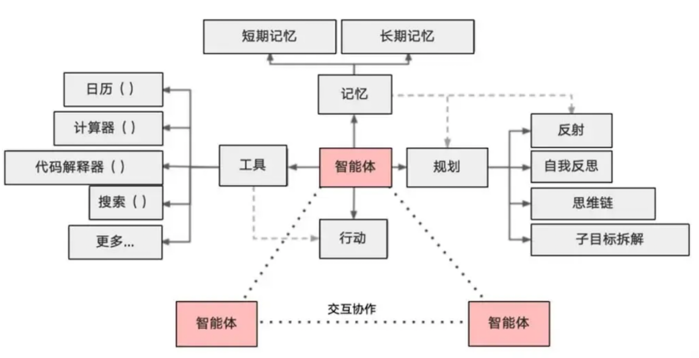
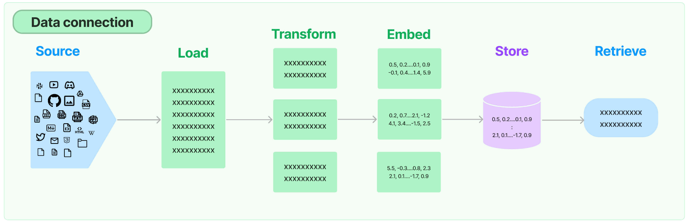
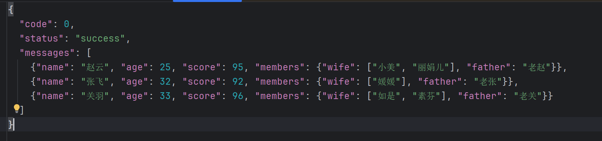
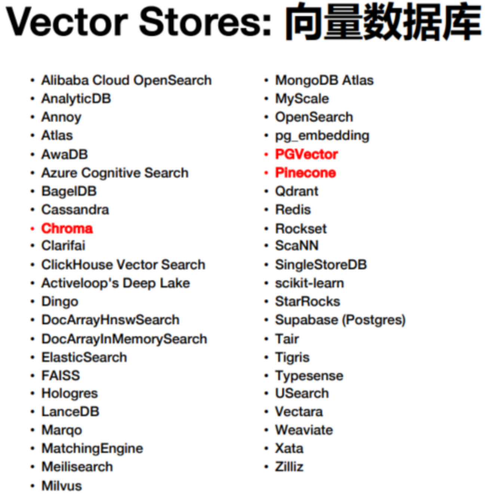

## Agent

### 概述

通用人工智能（AGI）将是AI的终极形态，几乎已成为业界共识。同样，构建智能体（Agent）则是AI工程应用当下的“终极形态”。

Agent（智能体） 是一个通过动态协调 **大语言模型（LLM）** 和 **工具（Tools）** 来完成复杂任务的智能系统。它让LLM充当"决策大脑"，根据用户输入自主选择和执行工具（如搜索、计算、数据库查询等），最终生成精准的响应。

在Chain中行动序列是 **硬编码的、固定流程的** ，像是“线性流水线”，而Agent则采用语言模型作为 **推理引擎** ，具备一定的 **自主决策** 能力，来确定以什么样的顺序采取什么样的行动，像是“拥有大脑的机器工人”。

它可以根据任务 **动态决定** ：

- 如何 **拆解任务**
- 需要 **调用哪些工具**
- 以 **什么顺序调用**
- 如何利用好 **中间结果** 推进任务


**Agent核心能力如下：**



1. **大模型(LLM)**：作为大脑，提供推理、规划和知识理解能力
2. **记忆(Memory)**：具备短期记忆（上下文）和长期记忆（向量存储），支持快速知识检索
3. **工具(Tools)**：调用外部工具（如API、数据库）的执行单元
4. **规划(Planning)**：任务分解、反思与自省框架实现复杂任务处理
5. **行动(Action)**：实际执行决策的能力
6. **协作**：通过与其他智能体交互合作，完成更复杂的任务目标


### 入门介绍

> 使用Agent还需要用到AgentExecutor组件。
>
> 智能体/代理（agent）可以协助我们做出决策，调用相应的 API。底层的实现方式是通过 LLM 来决定下一步执行什么动作。
>
> AgentExecutor本质上是代理的运行时，负责协调智能体的决策和实际的工具执行。

Agents的核心类型有两种模式： 

- **Funcation Call模式**
  - 基于 结构化函数调用 （如 OpenAI Function Calling）
  - 直接生成工具调用参数（ JSON 格式 ）
  - 效率更高，适合工具明确的场景

- **ReAct 模式**
  - 基于**文本推理**的链式思考（Reasoning + Acting），具备反思和自我纠错能力
    - 推理（Reasoning）：分析当前状态，决定下一步行动
    - 行动（Acting）：调用工具并返回结果
  - 通过 自然语言描述决策过程
  - 适合需要明确推理步骤的场景。例如智能客服、问答系统、任务执行等


AgentExecutor的两种创建方式：

- **传统方式：initialize_agent()**

  - 特点： 使用AgentType内置一些标准化模板（如 ZERO_SHOT_REACT_DESCRIPTION ） 

  - 优点：快速上手（3行代码完成配置） 

  - 缺点：定制化能力较弱（如提示词固定）

  - 示例：

    ```python
    from langchain.agents import initialize_agent
    
    agent_executor = initialize_agent(
        llm=llm,
        agent=AgentType.ZERO_SHOT_REACT_DESCRIPTION,
        tools=[search_tool],
        verbose=True)
    ```

- **通用方式：AgentExecutor构造方法**

  - 特点： 使用create_xxx_agent

  - 优点： 可自定义提示词（如从远程hub获取或本地自定义） ，清晰分离Agent逻辑与执行逻辑 

  - 缺点： 需要更多代码；需理解底层组件关系 

  - 示例：

    ```python
    prompt = hub.pull("hwchase17/react")
    tools = [search_tool]
    
    #第1步：创建Agent实例
    agent = create_react_agent(
        llm=llm,
        prompt=prompt,
        tools=tools
    )
    #第2步：创建AgentExecutor实例
    agent_executor = AgentExecutor(
        agent=agent,
        tools=tools
    )
    #第3步：执行
    agent_executor.invoke({"input":"xxxxx"})
    ```


### 基本使用

#### 传统方式使用工具

**需求：**今天北京的天气怎么样? 

**依赖：**

- 使用Tavily搜索工具，Tavily是一个专门为人工智能Agent(或LLM)构建的搜索引擎，可以快速提供实时、 准确和真实的结果。 
- LangChain 中有一个内置工具，可以轻松使用 Tavily 搜索引擎 作为工具。TAVILY_API_KEY申请：https://tavily.com/，注册账号并登录，创建 API 密钥。

在LangChain的新版本中，已经不推荐使用传统方式构建AgentExecutor了，尤其是Function Call模式的Agent类型，在新版本中已经出现不兼容的情况，下面仅演示ReAct类型的Agent。

##### 单个工具

ReAct模式有一个推理并执行的过程。下面是用到的`ZERO_SHOT_REACT_DESCRIPTION ` Agent类型要求LLM输入结果个是固定，所以推荐使用较新的深度思考模型，否则可能出现结果解析失败的问题。

```python
import os
import dotenv

from langchain_classic.agents import initialize_agent, AgentType
from langchain_community.tools import TavilySearchResults
from langchain_core.tools import Tool
from langchain_openai import ChatOpenAI

dotenv.load_dotenv()

# 初始化搜索工具
search = TavilySearchResults(tavily_api_key=os.getenv("TAVILY_KEY"), max_results=2)

# 使用Tool包装一下原生工具，统一调用方式、异常捕获等，方便框架识别调用
# 此处省略当前步骤是可以的
search_tool = Tool(name="Search", func=search.run, description="用于互联网搜索并获取搜索结果")

# 大模型
llm = ChatOpenAI(api_key=os.getenv("DS_API_KEY"), base_url=os.getenv("DS_BASE_URL"),
                 model=os.getenv("DS_MODEL"))

# 创建AgentExecutor
# 使用AgentType内部的模板
executor = initialize_agent(tools=[search_tool], llm=llm, agent=AgentType.ZERO_SHOT_REACT_DESCRIPTION, verbose=True,
                            handle_parsing_errors=True)

# 运行agent查询天气
result = executor.invoke("今天成都天气怎么样")
print(result)
"""
> Entering new AgentExecutor chain...
我需要查询成都今天的天气情况，可以通过互联网搜索获取最新的天气信息。

Action: Search
Action Input: "今天成都天气"

...

> Finished chain.
{'input': '今天成都天气怎么样', 'output': '根据最新的天气信息，成都今天的天气情况如下：\n\n- **天气状况**: 晴  \n- **当前温度**: 约17°C（体感温度21°C）  \n- **风力**: 东北偏北风，风速约6公里/小时  \n- **空气质量**: 很不健康（建议佩戴口罩）  \n- **今日气温范围**: 最高19°C / 最低9°C  \n\n**注意事项**：  \n1. 昼夜温差较大，注意及时增减衣物。  \n2. 空气质量较差，敏感人群减少户外活动。  \n\n如需实时更新，可参考专业天气平台（如中国天气网或AccuWeather）。'}
"""
```


##### 多个工具

多个工具就是在agent运行的过程中，给到多个工具给大模型使用。下面的示例中，因为大模型自己也具备一定的计算能力，所以实际上只使用了Search工具，没有使用Calculator工具。

```python
import os
import dotenv

from langchain_classic.agents import initialize_agent, AgentType
from langchain_community.tools import TavilySearchResults
from langchain_core.tools import Tool
from langchain_experimental.utilities import PythonREPL
from langchain_openai import ChatOpenAI

dotenv.load_dotenv()

# 搜索工具
search = TavilySearchResults(tavily_api_key=os.getenv("TAVILY_KEY"), max_results=2)
search_tool = Tool(name="Search", func=search.run, description="用于互联网搜索并获取搜索结果")

# 计算工具
calculator = PythonREPL()
calc_tool = Tool(name="Calculator", func=calculator.run, description="用于执行数学运算")

# 大模型
llm = ChatOpenAI(api_key=os.getenv("QW_API_KEY"), base_url=os.getenv("QW_BASE_URL"),
                 model=os.getenv("QW_MODEL"))

# 创建AgentExecutor，使用函数调用的模板
executor = initialize_agent(tools=[search_tool, calc_tool], llm=llm,
                            agent=AgentType.ZERO_SHOT_REACT_DESCRIPTION, verbose=True)

# 运行agent查询天气
result = executor.invoke({"input": "小米当前股价是多少？比去年上涨了百分之几？"})
print(result)
"""
Thought: 我需要查找小米当前的股价以及去年的股价，然后计算涨幅百分比。
Action: Search
Action Input: 小米当前股价 去年股价 涨幅
Observation: [{'title': '1810股價和圖表— HKEX:1810 - TradingView', 'url': 'https://tw.tradingview.com/symbols/HKEX-1810/', 'content': '1810目前的價格是40.16 HKD— 在過去24小時內下跌了−1.51%。 在圖表上更密切地關注Xiaomi Corporation Class B股票價格表現。\n\n根據交易所的不同，股票代碼可能會有所不同。例如：在 HKEX交易所Xiaomi Corporation Class B股票以股票代號 1810進行交易。\n\n與前一週相比，1810的股價上漲了4.12%， 月變動為−7.34%的下跌， 在過去一年中，Xiaomi Corporation Class B表現出44.20%的上漲。\n\n我們收集了分析師對Xiaomi Corporation Class B未來價格的看法：根據他們的說法，1810價格的最高預估值為77.26 HKD，最低預估為36.09 HKD。 查看1810圖表，並閱讀更詳細的Xiaomi Corporation Class B股票預測：看看分析師們對Xiaomi Corporation Class B有什麼看法，並建議您對其股票採取什麼看法行動。 [...] 1810在2025年6月27日達到了歷史最高價，價格為61.46 HKD，而歷史最低價為8.28 HKD，達到時間為2019年9月2日。在1810圖表上查看更多價格動態。  \n查看其他股票達到它們的最高和最低價格。\n\n1810股票的波動率為3.61%，beta係數為1.34。在圖表上追蹤Xiaomi Corporation Class B的股價，並查看最波動性股票列表 — Xiaomi Corporation Class B是否在其中？\n\n今天，Xiaomi Corporation Class B的市值為 \u202a1.07\u202fT\u202c，較上週增加了 7.93%。\n\n是的，您可以在TradingView上追蹤Xiaomi Corporation Class B的財務報表，包括年度和季度報告。\n\nXiaomi Corporation Class B將於2026年3月24日發佈下一份收益報告。透過我們的財報日曆追蹤即將發生的活動。 [...] 小米(1810.HK)近期股价走高，有多重因素推动。海外市场发展态势良好 小米集团国际部总裁周受资在世界经济论坛第 50 届年会期间表示，目前，小米在海外发展态势良好，以西欧为例，小米已经成为排名第 4 的智能手机厂商，增速高达90%。 除了手机之外，小米滑板车和可穿戴设备在西欧市场也颇受青睐。其中，其中，小米滑板车在西欧市占率为17%，可穿戴设备在西欧也成为第二大品牌。 全球首发骁龙720G 昨日下午，高通在印度新德里举行发布会，带来了三款全新的移动平台——骁龙 720G、骁龙662 和 骁龙460，这三款平台均最高支持 4G 网络。 据悉，搭载骁龙720G的终端预计将于今年第一季度面市，搭载骁龙 662、骁龙 460 的终端预\n\n看多\n\n由DevilTrader168提供\n\n查看所有想法\n\n## 技術\ufeff\n\n\ufeff\n\n總結指標的建議。\n\n中立\n\n賣出買入\n\n強力賣出強力買入\n\n強力賣出賣出中立買入強力買入\n\n中立\n\n賣出買入\n\n強力賣出強力買入\n\n強力賣出賣出中立買入強力買入\n\n中立\n\n賣出買入\n\n強力賣出強力買入\n\n強力賣出賣出中立買入強力買入\n\n## 分析師評級\ufeff\n\n\ufeff', 'score': 0.99938333}, {'title': '小米集团－W(1810)股票历史数据 - 英为财情', 'url': 'https://cn.investing.com/equities/xiaomi-historical-data', 'content': '免费获取小米集团－Ｗ（1810）股票历史数据，用于小米集团－Ｗ股票投资参考。此历史数据包括近期和往年小米集团－Ｗ（1810）股票的历史行情，每日股价和价格涨跌走势图表。选择日期范围，可按每日、每周或每月周期查询小米集团－Ｗ股票的收盘价、开盘价、最高价、最低价、价格变动、涨跌幅和股票收益率。\n\n时间范围\n\n1日\n\n下载\n\n2025-10-28 - 2025-11-28 [...] 最高:\n\n45.48\n\n涨跌幅:\n\n-10.79\n\n平均:\n\n41.86\n\n差价:\n\n8.86\n\n最低:\n\n36.62\n\n## 常见问题\n\n### 小米集团－Ｗ(1810)的历史股价表现如何？\n\n过去一年间，小米集团－Ｗ (1810)实现了47.32%的涨跌幅，其52周股价波动区间为27.25至61.45。\n\n### 小米集团－Ｗ(1810)的平均日成交量是多少？\n\n小米集团－Ｗ(1810)的平均日成交量为48,097,254。\n\n### 小米集团－Ｗ进行过多少次拆股？\n\n小米集团－Ｗ共进行过0次拆股。\n\n### 小米集团－Ｗ(1810)的每日股价波动范围是多少？\n\n今日小米集团－Ｗ(1810)的股价波动范围为40.00至41.30元。\n\n### 今日小米集团－Ｗ的开盘价是多少？\n\n今日小米集团－Ｗ的开盘价为41.18。\n\n查找股票交易商\n\n上证指数\n\n3,882.46\n\n+7.20\n\n+0.19%\n\n富时中国A50指数\n\n15,088.29\n\n-34.97\n\n-0.23%\n\n香港恒生指数")\n\n25,897.00\n\n-48.93\n\n-0.19%\n\n日经225") [...] | 名称 | 最新价 | 涨跌幅 | 交易量 |\n ---  --- |\n| 阿里巴巴-SW | 151.30 | +0.46% | 36.34M |\n| 小米集团－Ｗ | 40.86 | -0.58% | 48.04M |\n| 云顶集团 | 3.26 | -1.81% | 4.00M |\n| 云顶新加坡Genting Sing | 0.755 | 0.00% | 17.84M |\n| Farm Fresh Bhd | 2.73 | +1.11% | 7.68M |\n\n显示更多\n\n最被低估股票', 'score': 0.9976949}]
Thought:Thought: 我现在知道了小米当前的股价是40.16 HKD，过去一年的涨幅为44.20%。根据这些信息，我可以回答问题。

Final Answer: 小米当前股价为40.16港元，比去年上涨了44.20%。

> Finished chain.
{'input': '小米当前股价是多少？比去年上涨了百分之几？', 'output': '小米当前股价为40.16港元，比去年上涨了44.20%。'}
"""
```


#### 通用方式使用工具

通用方式申明agent时，提示词模板需要自定义了。模板中除了定义调用需要的参数意外，还必须申明`agent_scratchpad`参数，它用于存储和传递Agent的思考过程。


##### Function Call 模式

函数调用模式会更加简洁，没有推理的过程，直接返回工具调用的相关参数进行工具调用。

```python
import os
import dotenv

from langchain_classic.agents import create_tool_calling_agent, AgentExecutor
from langchain_community.tools import TavilySearchResults
from langchain_core.prompts import ChatPromptTemplate
from langchain_openai import ChatOpenAI

dotenv.load_dotenv()

# 搜索工具
search = TavilySearchResults(tavily_api_key=os.getenv("TAVILY_KEY"), max_results=2)

# 大模型
llm = ChatOpenAI(api_key=os.getenv("QW_API_KEY"), base_url=os.getenv("QW_BASE_URL"),
                 model=os.getenv("QW_MODEL"))

# 创建agent
prompt = ChatPromptTemplate.from_messages([
    ("system", "你是一位智能天气助手"),
    ("human", "{input}"),
    ("placeholder", "{agent_scratchpad}"),
])
agent = create_tool_calling_agent(tools=[search], llm=llm, prompt=prompt)

# 创建执行器
executor = AgentExecutor(agent=agent, tools=[search], verbose=True)

# 运行agent查询天气
result = executor.invoke({"input": "成都今天天气如何"})
print(result)
"""
Invoking: `tavily_search_results_json` with `{'query': '成都今天天气'}`
[{'title': '成都 - 中国气象局-天气预报-城市预报', 'url': 'https://weather.cma.cn/web/weather/S1003.html', 'content': ...
Invoking: `tavily_search_results_json` with `{'query': '成都今天天气如何'}`
[{'title': '成都 - 中国气象局-天气预报-城市预报', 'url': 'https://weather.cma.cn/web/weather/S1003.html', 'content': ...

- **当前时间**：下午1:41
- **气温**：61°F（约16°C）
...
- **降水概率**：2%

总体来看，今天成都天气晴好，气温适中，适合户外活动。但早晚温差较大，请注意保暖。

> Finished chain.
{'input': '成都今天天气如何', 'output': '根据最新的天气信息，成都今天的天气情况如下：\n\n- **当前时间**：下午1:41\n- **气温**：61°F（约16°C）\n- **天气状况**：晴\n- **体感温度**：RealFeel® 68°F（约20°C），感觉宜人\n- **风速**：北风 4英里/小时（约1.8米/秒）\n- **湿度**：54%\n- **露点**：44°F（约7°C）\n- **气压**：30.39英寸汞柱（约1028.5 hPa）\n- **云量**：10%，天空晴朗\n- **能见度**：3英里（约4.8公里）\n\n### 白天天气预报：\n- **最高气温**：65°F（约18°C）\n- **天气**：晴，可能有薄雾\n- **紫外线指数**：3.2（温和）\n- **风向**：南风 5英里/小时\n\n### 夜晚天气预报：\n- **最低气温**：45°F（约7°C）\n- **天气**：晴朗\n- **风向**：东南偏东风 2英里/小时\n- **降水概率**：2%\n\n总体来看，今天成都天气晴好，气温适中，适合户外活动。但早晚温差较大，请注意保暖。'}
"""
```


##### ReAct 模式

提示词要体现可以使用的工具、用户输入和agent_scratchpad。

远程的提示词模版通过https://smith.langchain.com/hub/hwchase17获取，https://smith.langchain.com/hub/hwchase17/react，这个模板是专为ReAct模式设计的提示模板。这个模板中已经有聊天对话键**tools**、**tool_names**、**agent_scratchpad**。

```python
import os
import dotenv

from langchain_classic import hub
from langchain_classic.agents import AgentExecutor, create_react_agent
from langchain_community.tools import TavilySearchResults
from langchain_openai import ChatOpenAI

dotenv.load_dotenv()

# 搜索工具
search = TavilySearchResults(tavily_api_key=os.getenv("TAVILY_KEY"), max_results=2)

# 大模型
llm = ChatOpenAI(api_key=os.getenv("QW_API_KEY"), base_url=os.getenv("QW_BASE_URL"),
                 model=os.getenv("QW_MODEL"))

# 获取远程prompt模板，pull下来后直接就是一个PromptTemplate对象
prompt = hub.pull("hwchase17/react")

# 创建agent
agent = create_react_agent(tools=[search], llm=llm, prompt=prompt)

# 创建执行器
executor = AgentExecutor(agent=agent, tools=[search], verbose=True)

# 运行agent查询天气
result = executor.invoke({"input": "成都今天天气如何"})
```

上面使用的在线模板时英文版的，下面是用中文模板并结合到ChatPromptTemplate模板使用：

```python
import os
import dotenv

from langchain_classic import hub
from langchain_classic.agents import AgentExecutor, create_react_agent
from langchain_community.tools import TavilySearchResults
from langchain_core.prompts import ChatPromptTemplate
from langchain_openai import ChatOpenAI

dotenv.load_dotenv()

# 搜索工具
search = TavilySearchResults(tavily_api_key=os.getenv("TAVILY_KEY"), max_results=2)

# 大模型
llm = ChatOpenAI(api_key=os.getenv("QW_API_KEY"), base_url=os.getenv("QW_BASE_URL"),
                 model=os.getenv("QW_MODEL"))

# 中文版
prompt = hub.pull("captain/react")

# 构建对话提示词模板
chat_prompt = ChatPromptTemplate.from_messages([
    ("system", "你是一位AI天气助手"),
    ("system", prompt.template),
    ("placeholder", "{agent_scratchpad}"),
    ("human", "{input}")
])

# 创建agent
agent = create_react_agent(tools=[search], llm=llm, prompt=prompt)

# 创建执行器
# handle_parsing_errors 表示解析结果失败时抛出异常，True时捕获异常不抛出
# max_iterations 限制最大迭代次数，防止无限循环
executor = AgentExecutor(agent=agent, tools=[search], verbose=True, handle_parsing_errors=False, max_iterations=3)

# 运行agent查询天气
result = executor.invoke({"input": "成都今天天气如何"})
print(result)
```


### 嵌入记忆组件

要实现多轮对话，必然要使用记忆组件。另外传统方式构建Agent就不再介绍如何使用了，直接基于通用方式来构建。


#### Function Call模式

如果使用FunctionCall的模式，那么推荐使用ChatPromptTemplate模板类型。

```python
import os
import dotenv

from langchain_classic.agents import initialize_agent, AgentType, create_tool_calling_agent, AgentExecutor
from langchain_classic.memory import ConversationBufferMemory
from langchain_community.tools import TavilySearchResults
from langchain_core.prompts import ChatPromptTemplate
from langchain_openai import ChatOpenAI

dotenv.load_dotenv()

# 搜索工具
search = TavilySearchResults(tavily_api_key=os.getenv("TAVILY_KEY"), max_results=2)
tools = [search]

# 大模型
llm = ChatOpenAI(api_key=os.getenv("QW_API_KEY"), base_url=os.getenv("QW_BASE_URL"),
                 model=os.getenv("QW_MODEL"))

# 提示词模板
prompt = ChatPromptTemplate.from_messages([
    ("system", "你是一位AI天气助手"),
    ("placeholder", "{chat_history}"),
    ("human", "{query}"),
    ("placeholder", "{agent_scratchpad}"),
])

# 记忆组件
memory = ConversationBufferMemory(memory_key="chat_history", return_messages=True)

# agent
agent = create_tool_calling_agent(tools=tools, llm=llm, prompt=prompt)

# agent executor
executor = AgentExecutor(agent=agent, tools=tools, memory=memory, verbose=True, max_iterations=3)

# 第一个查询
result1 = executor.invoke({"query": "成都今天的天气怎么样"})
print(f"查询结果: {result1["output"]}")

# 继续
result2 = executor.invoke({"query": "上海呢"})
print(f"分析结果: {result2["output"]}")
```


#### ReAct模式

ReAct模式下，创建Agent时，可以使用ChatPromptTemplate、PromptTemplate，只需要确保模板中替换变量都正确配置即可。同样，远程的模板也可以配合memory一起使用，前面手动构造了chat模板，也有直接可以使用的chat模板。

```python
import os
import dotenv

from langchain_classic import hub
from langchain_classic.agents import AgentExecutor, create_react_agent
from langchain_classic.memory import ConversationBufferMemory
from langchain_community.tools import TavilySearchResults
from langchain_openai import ChatOpenAI

dotenv.load_dotenv()

# 搜索工具
search = TavilySearchResults(tavily_api_key=os.getenv("TAVILY_KEY"), max_results=2)
tools = [search]

# 大模型
llm = ChatOpenAI(api_key=os.getenv("QW_API_KEY"), base_url=os.getenv("QW_BASE_URL"),
                 model=os.getenv("QW_MODEL"))

# 中文版
# 已经定义变量 tools、tool_names、chat_history、input、agent_scratchpad
prompt = hub.pull("bluesky4cn/react-chat")

# 创建agent
agent = create_react_agent(tools=[search], llm=llm, prompt=prompt)

# 记忆组件
memory = ConversationBufferMemory(memory_key="chat_history", return_messages=True)

# agent executor
executor = AgentExecutor(agent=agent, tools=tools, memory=memory, verbose=True, max_iterations=5)

# 第一个查询
result1 = executor.invoke({"input": "成都今天的天气怎么样"})
print(f"查询结果: {result1["output"]}")

# 继续
result2 = executor.invoke({"input": "上海呢"})
print(f"分析结果: {result2["output"]}")
```


## Retrieval

### 背景

拥有记忆后，确实扩展了AI工程的应用场景。但是在专有领域，LLM无法学习到所有的专业知识细节，因此在**面向专业领域知识**的提问时，无法给出可靠准确的回答，甚至会“胡言乱语”，这种现象称之为**LLM的“幻觉”**。 

大模型生成内容的不可控，尤其是在金融和医疗领域等领域，**一次金额评估的错误，一次医疗诊断的失误，哪怕只出现一次都是致命的。**且对于非专业人士来说可能难以辨识。目前还没有能够百分之百解决这种情况的方案。

**当前大家普遍达成共识的一个方案： **

首先，为大模型提供一定的上下文信息，让其输出会变得更稳定。 其次，利用本章的RAG，将检索出来的**文档和提示词**输送给大模型，生成更可靠的答案。


#### RAG

> 如果说LangChain相当于给LLM这个“⼤脑”安装了“四肢和躯⼲”，RAG则是为LLM提供了接⼊“⼈类知识图书馆”的能⼒。

当应用需求集中在利用大模型去**回答特定私有领域的知识**，且知识库足够大，那么除了**微调大模型**外，**RAG**就是非常有效的一种缓解大模型推理的“幻觉”问题的解决方案。

**RAG的优点**

1. 相比提示词工程，RAG有 更丰富的上下文和数据样本 ，可以不需要用户提供过多的背景描述，就能生成比较符合用户预期的答案。 

2）相比于模型微调，RAG可以提升问答内容的 时效性 和 可靠性 

3）在一定程度上保护了业务数据的 隐私性 。 

RAG的缺点 

1）由于每次问答都涉及外部系统数据检索，因此RAG的 响应时延 相对较高。 

2）引用的外部知识数据会 消耗大量的模型Token 资源。


#### Retrieval流程



1. **Source（数据源）**

   指的是RAG架构中所外挂的知识库。说明：

   - 原始数据源类型多样：如：视频、图片、文本、代码、文档等 
   - 形式的多样性：
     - 可以是上百个.csv文件，可以是上千个.json文件，也可以是上万个.pdf文件
     - 可以是某一个业务流程外放的API，可以是某个网站的实时数据等

2. **Load（加载）**

   文档加载器（Document Loaders）负责将来自不同数据源的非结构化文本，加载到 内存 ，成为**文档 (Document)对象**。文档对象包含**文档内容**和相关**元数据信息**，例如TXT、CSV、HTML、JSON、Markdown、PDF，甚至YouTube 视频转录等。

   文档加载器还支持**延迟加载 **模式，以缓解处理大文件时的内存压力。文档加载器的编程接口使用起来非常简单，以下给出加载PDF格式文档的例子。

   ```python
   from langchain_community.document_loaders import PyPDFLoader
   
   loader = PyPDFLoader(r"D:\downloads\123.pdf")
   
   # 一次性加载文档，返回list[Document]
   # 会把文件拆解为多个Document对象，每个Document对象代表一个页面
   docs = loader.load()
   print(len(docs))
   for doc in docs:
       print(doc.page_content)
   
   # 懒加载，每次迭代一个
   # for page in loader.lazy_load():
   #     print(page)
   ```

3. **Transform（转换）**

   文档转换器(Document Transformers) 负责对加载的文档进行转换和处理，以便更好地适应下游任务的需求。 文档转换器提供了一致的接口（工具）来操作文档，主要包括以下几类： 

   - 文本拆分器(Text Splitters) ：将长文本拆分成语义上相关的小块，以适应语言模型的上下文窗口限制。 

   - 冗余过滤器(Redundancy Filters) ：识别并过滤重复的文档。 

   - 元数据提取器(Metadata Extractors) ：从文档中提取标题、语调等结构化元数据。 

   - 多语言转换器(Multi-lingual Transformers) ：实现文档的机器翻译。 

   - 对话转换器(Conversational Transformers) ：将非结构化对话转换为问答格式的文档。

   文档转换器是 LangChain 处理管道中非常重要的一个组件，它丰富了框架对文档的表示和操作能力。在这些功能中，文档拆分器是必须的操作。

   - **拆分/分块的必要性**：前一个环节加载后的文档对象可以直接传入文档拆分器进行拆分，而文档切块后才能**向量化**并存入数据库中。 
   - **文档拆分器的多样性**：LangChain提供了丰富的文档拆分器，不仅能够切分普通文本，还能切分 Markdown、JSON、HTML、代码等特殊格式的文本。 
   - 拆分/分块的挑战性 ：实际拆分操作中需要处理许多细节问题，**不同类型的文本**、**不同的使用场景**都需要采用不同的分块策略。 
     - 可以按照**数据类型**进行切片处理，比如针对文本类数据 ，可以直接按照字符、段落进行切片； 代码类数据则需要进一步细分以保证代码的功能性； 
     - 可以直接根据 token 进行切片处理

   **在构建RAG应用程序的整个流程中，拆分/分块是最具挑战性的环节之一，它显著影响检索效果。**目前还没有通用的方法可以明确指出哪一种分块策略最为有效。不同的使用场景和数据类型都会影响分块策略的选择。

4. **Embed（嵌入）**

   文档嵌入模型（Text Embedding Models）负责将**文本**转换为**向量表示**，即**模型赋予了文本计算机可理解的数值表示**，使文本可用于向量空间中的各种运算，大大拓展了文本分析的可能性，是自然语言处理领域非常重要的技术。

   文本嵌入为 LangChain 中的问答、检索、推荐等功能提供了重要支持。具体为： 

   - **语义匹配**：通过计算两个文本的向量余弦相似度，判断它们在语义上的相似程度，实现语义匹配。 
   - **文本检索**：通过计算不同文本之间的向量相似度，可以实现语义搜索，找到向量空间中最相似的文本。 
   - **信息推荐**：根据用户的历史记录或兴趣嵌入生成用户向量，计算不同信息的向量与用户向量的相似度，推荐相似的信息。 
   - **知识挖掘**：可以通过聚类、降维等手段分析文本向量的分布，发现文本之间的潜在关联，挖掘知识。 
   - **自然语言处理**：将词语、句子等表示为稠密向量，为神经网络等下游任务提供输入。

5. **Store（存储）**

   LangChain 还支持把文本嵌入存储到向量存储或临时缓存，以避免需要重新计算它们。这里就出现了数据库，支持这些嵌入的高效**存储**和**搜索**的需求。

6. **Retrieve（检索）**

   检索器（Retrievers）是一种用于**响应非结构化查询**的接口，它可以返回符合查询要求的文档。

   LangChain 提供了一些常用的检索器，如**向量检索器**、**文档检索器**、**网站研究检索器**等。通过配置不同的检索器，LangChain 可以灵活地平衡检索的精度、召回率与效率。检索结果将为后续的问答生成提供信息支持，以产生更加准确和完整的回答。


### 文档加载器

#### 加载txt

txt文档加载的结果列表中通常只会有1个Document对象，因为txt本身没有分页的概念。

```python
from langchain_community.document_loaders import TextLoader

loader = TextLoader(r"D:\downloads\123.txt", "utf8")
docs = loader.load()

print(len(docs))  # 1  txt文档比较纯粹，没有分页的概念
print(docs[0].page_content)  # 文档内容
print(docs[0].metadata)  # {'source': 'D:\\downloads\\123.txt'}
```


#### 加载pdf

加载PDF需要使用到`pypdf`库，需要安装：

```shell
pip install -i https://pypi.tuna.tsinghua.edu.cn/simple/ pypdf
```

在前面我们已经演示过一个pdf文件的加载过程，下面使用`load_and_split`方法再试试。

```python
from langchain_community.document_loaders import PyMuPDFLoader

loader = PyMuPDFLoader(r"D:\downloads\123.pdf")

# text_splitter 默认使用递归字符文本切分器
docs = loader.load_and_split()

print(len(docs))  # 34 每个页面封装为一个Document对象
print(docs[0].page_content)  # 文档内容
print(docs[0].metadata)  # {'producer': 'Typora', 'creator': 'Typora', 'creationdate': '20250912085904', 'source': 'D:\\downloads\\123.pdf', 'file_path': 'D:\\downloads\\123.pdf', 'total_pages': 34, 'format': 'PDF 1.4', 'title': '', 'author': '', 'subject': '', 'keywords': '', 'moddate': '20250912085904', 'trapped': '', 'modDate': '20250912085904', 'creationDate': '20250912085904', 'page': 0}
```


#### 加载csv

```PYTHON
from langchain_community.document_loaders import CSVLoader

loader = CSVLoader(r"D:\downloads\123.csv")
docs = loader.load()

print(len(docs))  # 4 每一行封装为一个Document对象
print(docs[1].page_content)  # 文档内容会自动带上列名
"""
name: 张飞
age: 32
score: 93
"""
print(docs[1].metadata)  # {'source': 'D:\\downloads\\123.csv', 'row': 1}
```

对于csv文件，我们还可以仅加载指定的列：

```python
from langchain_community.document_loaders import CSVLoader

loader = CSVLoader(r"D:\downloads\123.csv", content_columns=["name", "score"])
docs = loader.load()

print(docs[1].page_content)  # 文档内容会自动带上列名
"""
name: 张飞
score: 93
"""
```


#### 加载json

在实际应用场景中，JSON格式的数据占有很大比例，而且JSON的形式也是多样的。我们需要特别关注。的JSON格式的文档加载器是**JSONLoader**，底层依赖`jq`库，需要我们提前安装。

```shell
 pip install -i https://pypi.tuna.tsinghua.edu.cn/simple/ jq
```

需要说明的是，通常情况下我们需要的是json结构中某些字段的值。

此处准备如下一个json文件用于演示：



提取某个字段的值：

```PYTHON
from langchain_community.document_loaders import JSONLoader

# 获取人物名字
loader = JSONLoader(r"D:\downloads\123.json", jq_schema=".messages[].name")
docs = loader.load()

print(docs[1].page_content)  # 张飞
```

可以看到，jq_schema其实就是jsonpath，用于定位到具体的key。但如果我们需要获取多个不同层级的key，比如这里要获取每个人的名字及对应第一任妻子的名字，就可以使用**content_key**配合**is_content_key_jq_parsable=True**来实现：

```PYTHON
from langchain_community.document_loaders import JSONLoader

# 获取人物名字
loader = JSONLoader(r"D:\downloads\123.json", 
                    jq_schema=".messages[]",  # 先定位到消息列表
                    content_key='.name + "的妻子是: " + .members.wife[0]',  # 可以写入多个基于jq_schema的数据定位，且可以直接拼接其他内容
                    is_content_key_jq_parsable=True)  # 是否支持content_key的jq解析
docs = loader.load()

print(docs[1].page_content)  # 张飞的妻子是: 媛媛
```

另外，我们还可以基于当前json重构我们需要的json内容：

```python
import json

from langchain_community.document_loaders import JSONLoader

# 获取人物名字
loader = JSONLoader(r"D:\downloads\123.json",
                    # | 是管道符
                    # name, age 是保留的现有json字段
                    # family 是新字段，它的值也可以通过jq表达式获取
                    # // 表示前面没有值的时候兜底的值
                    jq_schema='.messages[] | {name, age, family:("小妾是" + (.members.wife[1] // "没有"))}',  # 先定位到消息列表
                    is_content_key_jq_parsable=True,  # 是否支持content_key的jq解析
                    text_content=False)  # 默认为True，如果结果不是文本，需要False，此处就是一个json串
docs = loader.load()

for doc in docs:
    print(json.loads(doc.page_content))
"""
{'name': '赵云', 'age': 25, 'family': '小妾是丽娟儿'}
{'name': '张飞', 'age': 32, 'family': '小妾是没有'}
{'name': '关羽', 'age': 33, 'family': '小妾是素芬'}
"""
```

重构之后的json，可以继续使用content_key从重构之后的json中匹配需要的结果。


#### 加载html

加载html依赖`unstructured`库，先安装下：

```shell
pip install -i https://pypi.tuna.tsinghua.edu.cn/simple/ unstructured
```

下面使用百度首页的源码做一下演示：

```PYTHON
from langchain_community.document_loaders import UnstructuredHTMLLoader

# strategy:
#  "fast" 解析加载html文件速度是比较快（但可能丢失部分结构或元数据）
#  "hi_res": (高分辨率解析) 解析精准（速度慢一些）
#  "ocr_only" 强制使用ocr提取文本，仅仅适用于图像（对HTML无效）
# mode: one of `{'paged', 'elements', 'single'}
#  "elements" 按语义元素（标题、段落、列表、表格等）拆分成多个独立的小文档
loader = UnstructuredHTMLLoader(r"D:\downloads\123.html", mode="elements", strategy="fast") 
docs = loader.load()

print(len(docs))  # 90
```


#### 加载markdown

加载md的文档，除了`unstructured`模块外，还需要安装`markdown`库：

```shell
pip install -i https://pypi.tuna.tsinghua.edu.cn/simple/ markdown
```

使用方式和html类似，如果mode参数保持默认，将之会返回一个文档，指定为'elements'后，可以将Markdown文档按语义元素（标题、段落、列表、表格等）拆分成多个独立的小文档（**Element**对象）：

```python
from langchain_community.document_loaders import UnstructuredMarkdownLoader

loader = UnstructuredMarkdownLoader(r"D:\讯飞\个人文档\NLP\8-模型预训练.md", mode="elements", strategy="fast")
docs = loader.load()

print(len(docs))  # 126
print(type(docs[0]))  # <class 'langchain_core.documents.base.Document'>
print(docs[0].page_content)  # BERT 第一个标题的文本
print(docs[0].metadata)
"""
{'source': 'D:\\讯飞\\个人文档\\NLP\\8-模型预训练.md', 'category_depth': 2, 'languages': ['eng'], 'file_directory': 'D:\\讯飞\\个人文档\\NLP', 'filename': '8-模型预训练.md', 'filetype': 'text/markdown', 'last_modified': '2025-11-18T21:01:51', 'category': 'Title', 'element_id': 'aa3beb19a1b929e01dba7c872e706178'}
"""
```


#### 加载目录

除了上述的单个文件加载，我们也可以批量加载一个文件夹内的所有文件。

```python
from pprint import pprint

from langchain_community.document_loaders import PythonLoader, DirectoryLoader

# 定义DirectoryLoader对象,指定要加载的文件夹路径、要加载的文件类型和是否使用多线程
directory_loader = DirectoryLoader(
    path="./asset/load",
    glob="*.py",
    use_multithreading=True,
    show_progress=True,
    loader_cls=PythonLoader)
docs = directory_loader.load()

print(len(docs))
for doc in docs:
    pprint(doc)
```


### 文档拆分器

chunking拆分的策略：

- **根据句子切分**：这种方法按照自然句子边界进行切分，以保持语义完整性。

- **按照固定字符数来切分**：这种策略根据特定的字符数量来划分文本，但可能会在不适当的位置切断句子。

- **按固定字符数来切分，结合重叠窗口（overlapping windows）**：此方法与按字符数切分相似，但通过重叠窗口技术避免切分关键内容，确保信息连贯性。

- **递归字符切分方法**：通过递归字符方式动态确定切分点，这种方法可以根据文档的复杂性和内容密度来调整块的大小。

- **根据语义内容切分**：这种 **高级策略** 依据文本的语义内容来划分块，旨在保持相关信息的集中和完整，适用于需要高度语义保持的应用场景。

> 第2种⽅法（按照字符数切分）和第3种⽅法（按固定字符数切分结合重叠窗口）主要基于字符进⾏⽂本的切分，而不考虑⽂章的实际内容和语义。这种⽅式虽简单，但可能会导致**主题或语义上的断裂** 。
>
> 相对而⾔，第4种递归⽅法更加灵活和⾼效，它结合了固定⻓度切分和语义分析。通常是**首选策略** ，因为它能够更好地确保每个段落包含⼀个完整的主题。
>
> 而第5种⽅法，基于语义的分割虽然能精确地切分出完整的主题段落，但这种⽅法效率较低。它需要运⾏复杂的分段算法（segmentation algorithm），**处理速度较慢** ，并且**段落长度可能极不均匀** （有的主题段落可能很⻓，而有的则较短）。因此，尽管它在某些需要⾼精度语义保持的场景下有其应⽤价值，但并**不适合所有情况** 。


#### CharacterTextSplitter

通过字符长度来切分，常用参数如下：

- **chunk_size** ：每个切块的最大token数量，默认值为4000。

- **chunk_overlap** ：相邻两个切块之间的最大重叠token数量，默认值为200。

- **separator** ：分割使用的分隔符，默认值为"\n\n"。

- **length_function** ：用于计算切块长度的方法。默认赋值为父类TextSplitter的len函数。

```python
from langchain.text_splitter import CharacterTextSplitter

text = """
LangChain 是一个用于开发由语言模型驱动的应用程序的框架的。它提供了一套工具和抽象，使开发者能够更容易地构建复杂的应用程序。
"""

# 此处分隔符设置为空字符串，表示禁用分隔符优先
splitter = CharacterTextSplitter(chunk_size=30, chunk_overlap=5, separator="")

texts = splitter.split_text(text)
print(texts)
"""
['LangChain 是一个用于开发由语言模型驱动的应用程序', 
'的应用程序的框架的。它提供了一套工具和抽象，使开发者能够更容', 
'者能够更容易地构建复杂的应用程序。']
"""
```

**separator优先原则**：当设置了 **separator** （如"。"），分割器会首先尝试在分隔符处分割，然后再考虑 chunk_size。这是为了避免在句子中间硬性切断。这种设计是为了：

1. 优先保持语义完整性（不切断句子）

2. 避免产生无意义的碎片（如半个单词/不完整句子）

3. 如果 **chunk_size** 比片段小，无法拆分片段，导致 overlap失效。

4. chunk_overlap仅在合并后的片段之间生效（如果 **chunk_size** 足够大）。如果没有合并的片段，则 overlap失效。

```python
from langchain.text_splitter import CharacterTextSplitter

text = """
LangChain 是一个用于开发由语言模型驱动的应用程序的框架的。它提供了一套工具和抽象，使开发者能够更容易地构建复杂的应用程序。
"""

# 此处分隔符设置为空字符串，表示禁用分隔符优先
splitter = CharacterTextSplitter(chunk_size=30, chunk_overlap=5, separator="。")

texts = splitter.split_text(text)
print(texts)
"""
['LangChain 是一个用于开发由语言模型驱动的应用程序的框架的', 
'它提供了一套工具和抽象，使开发者能够更容易地构建复杂的应用程序']
"""
```

拆解结果以分隔符为准，但拆分的句子最后都没有了句号，可以使用`keep_separator=True`来让拆分的文本最后有句号。


#### RecursiveCharacterTextSplitter

文档切分器中较常用的是 **RecursiveCharacterTextSplitter (递归字符文本切分器)** ，遇到 **特定字符** 时进行分割。默认情况下，它尝试进行切割的字符包括 **["\n\n", "\n", " ", ""]** 。

具体为：根据第一个字符进行切块，但如果任何切块太大，则会继续移动到下一个字符继续切块，以此类推。此外，还可以考虑添加，。等分割字符。

**特点：**

- **保留上下文**：优先在自然语言边界（如段落、句子结尾）处分割， **减少信息碎片化** 。
- **智能分段**：通过递归尝试多种分隔符，将文本分割为大小接近chunk_size的片段。
- **灵活适配**：适用于多种文本类型（代码、Markdown、普通文本等），是LangChain中 **最通用** 的文本拆分器。

```python
from langchain.text_splitter import RecursiveCharacterTextSplitter

text = """LangChain框架特性\n\n多模型集成(GPT/Claude)\n记忆管理功能\n链式调用设计。文档分析场景示例：需要处理PDF/Word等格式。"""

# add_start_index 在元数据中加上分段的索引
splitter = RecursiveCharacterTextSplitter(chunk_size=10, chunk_overlap=5, add_start_index=True)

texts = splitter.split_text(text)
print(texts)
"""
['LangChain框', 'hain框架特性', '多模型集成(GPT', '成(GPT/Clau', '/Claude)', '记忆管理功能', '链式调用设计。文档', 
'设计。文档分析场景示', '分析场景示例：需要处', '例：需要处理PDF/', '理PDF/Word等', 'Word等格式。']
"""

# 还可以吧分段的结果转换为Document对象，那么 add_start_index 的设置就生效了
# 要注意这里入参是一个列表
docs = splitter.create_documents([text])
print(docs)
"""
[Document(metadata={'start_index': 0}, page_content='LangChain框'), 
Document(metadata={'start_index': 5}, page_content='hain框架特性'), 
Document(metadata={'start_index': 15}, page_content='多模型集成(GPT'), 
Document(metadata={'start_index': 19}, page_content='成(GPT/Clau'), 
...
"""
```

结合前面的文档加载器，我们可以直接分割加载的文档：

```python
from langchain.text_splitter import RecursiveCharacterTextSplitter
from langchain_community.document_loaders import PyPDFLoader

# 加载文档
loader = PyPDFLoader("../../PDF/Java 简约教程.pdf")
docs = loader.load()

# add_start_index 在元数据中加上分段的索引
splitter = RecursiveCharacterTextSplitter(chunk_size=200, chunk_overlap=20, add_start_index=True)

# 此时要使用文档分割的方法
# 返回的每个片段也会包装成Document对象
texts = splitter.split_documents(docs)

for text in texts[:3]:
    print(text.page_content)
```

根据文档内容的特性，我们还可以自己指定一些分隔符，分隔符默认列表使用 **["\n\n", "\n", " ", ""]** ，在我看来就不够好， **["\n\n", "。", "？", "！", "，", "\n"]**个人感觉会更合适，切分得到的文本片段完整性上会更好一些。

```python
from langchain.text_splitter import RecursiveCharacterTextSplitter

# 加载文档
text="LangChain框架特性\n\n多模型集成(GPT/Claude)\n记忆管理功能\n链式调用设计。文档分析场景示例：需要处理PDF/Word等格式。"

# add_start_index 在元数据中加上分段的索引
splitter = RecursiveCharacterTextSplitter(chunk_size=30, chunk_overlap=5, add_start_index=True,
                                          separators=["\n\n", "。", "？", "！", "，", "\n"])

texts = splitter.split_text(text)

for text in texts[:3]:
    print(">>>" + text)
"""
>>>LangChain框架特性
>>>多模型集成(GPT/Claude)\n记忆管理功能
>>>链式调用设计
"""
```


#### ToeknTextSplitter

当我们将文本拆分为块时，除了字符以外，还可以： **按Token的数量分割** （而非字符或单词数），将长文本切分成多个小块。

**为什么按Token分割？**

- 语言模型对输入长度的限制是基于Token数（如GPT-4的8k/32k Token上限），直接按字符或单词分割可能导致实际Token数超限。（确保每个文本块不超过模型的Token上限）
- 大语言模型(LLM)通常是以token的数量作为其计量(或收费)的依据，所以采用token分割也有助于我们在使用时更方便的控制成本。

**TokenTextSplitter 使用说明：**

- 核心依据：Token数量 + 自然边界。（TokenTextSplitter 严格按照 token 数量进行分割，但同时会优先在自然边界（如句尾）处切断，以尽量保证语义的完整性。）
- 优点：与LLM的Token计数逻辑一致，能尽量保持语义完整
- 缺点：对非英语或特定领域文本，Token化效果可能不佳
- 典型场景：需要精确控制Token数输入LLM的场景

```python
from langchain.text_splitter import TokenTextSplitter

# 加载文档
text = "人工智能是一个强大的开发框架。它支持多种语言模型和工具链。人工智能是指通过计算机程序模拟人类智能的一门科学。自20世纪50年代诞生以来，人工智能经历了多次起伏。"

# chunk_size 仍然表示字符数量
# encoding_name 使用 OpenAI 的编码器,将文本转换为 token 序列
splitter = TokenTextSplitter(chunk_size=33, chunk_overlap=0, encoding_name="cl100k_base")

texts = splitter.split_text(text)

for text in texts:
    print(">>>" + text)
"""
>>>人工智能是一个强大的开发框架。它支持多种语言模型和工具链。
>>>人工智能是指通过计算机程序模拟人类智能的一门科学。自20世纪50
>>>年代诞生以来，人工智能经历了多次起伏。
"""
```

前面已经介绍过的CharacterTextSplitter也是可以实现按token来切分的。

```python
from langchain.text_splitter import CharacterTextSplitter

# 加载文档
text = "人工智能是一个强大的开发框架。它支持多种语言模型和工具链。人工智能是指通过计算机程序模拟人类智能的一门科学。自20世纪50年代诞生以来，人工智能经历了多次起伏。"
splitter = CharacterTextSplitter.from_tiktoken_encoder(chunk_size=33, chunk_overlap=0, encoding_name="cl100k_base",
                                                       separator="。", keep_separator=False)

texts = splitter.split_text(text)

for text in texts:
    print(">>>" + text)
"""
>>>人工智能是一个强大的开发框架。它支持多种语言模型和工具链
>>>人工智能是指通过计算机程序模拟人类智能的一门科学
>>>自20世纪50年代诞生以来，人工智能经历了多次起伏
"""
```

因为分隔符的加入，使得拆分效果更好了。


#### SemanticChunker

SemanticChunking（语义分块）是 LangChain 中一种更高级的文本分割方法，它超越了传统的基于字符或固定大小的分块方式，而是根据 **文本的语义结构** 进行智能分块，使每个分块保持 **语义完整性** ，从而提高检索增强生成(RAG)等应用的效果。

根据语义分割，就意味着需要使用词嵌入模型来理解其语义。

```python
import os
import dotenv

from langchain_experimental.text_splitter import SemanticChunker
from langchain_openai import OpenAIEmbeddings

dotenv.load_dotenv()

# 加载词嵌入模型
embeds = OpenAIEmbeddings(api_key=os.getenv("OPENAI_API_KEY"), base_url=os.getenv("OPENAI_BASE_URL"),
                          model="text-embedding-3-large")

# 加载文档
text = "人工智能是一个强大的开发框架。它支持多种语言模型和工具链。人工智能是指通过计算机程序模拟人类智能的一门科学。自20世纪50年代诞生以来，人工智能经历了多次起伏。"

# breakpoint_threshold_type 断点判断方式，可选 percentile（百分位数）、standard_deviation（标准差）或 iqr（四分位距）
# breakpoint_threshold_amount 阈值百分比或倍数
splitter = SemanticChunker(embeddings=embeds, breakpoint_threshold_type="percentile",
                           breakpoint_threshold_amount=65.0)

texts = splitter.split_text(text)

for text in texts:
    print(">>>" + text)
```


#### 其他拆分器

**HTMLHeaderTextSplitter**

HTMLHeaderTextSplitter是一种专门用于处理HTML文档的文本分割方法，它根据HTML的 **标题标签（如<h1>、<h2>等）** 将文档划分为逻辑分块，同时保留标题的层级结构信息。


**CodeTextSplitter**

CodeTextSplitter是一个 **专为代码文件** 设计的文本分割器（Text Splitter），支持代码的语言包括['cpp','go', 'java', 'js', 'php', 'proto', 'python', 'rst', 'ruby', 'rust', 'scala', 'swift', 'markdown', 'latex', 'html','sol']。它能够根据编程语言的语法结构（如函数、类、代码块等）智能地拆分代码，保持代码逻辑的完整性。

与递归文本分割器（如RecursiveCharacterTextSplitter）不同，CodeTextSplitter 针对代码的特性进行了优化， **避免在函数或类的中间截断** 。


**MarkdownTextSplitter**

因为Markdown格式有特定的语法，一般整体内容由 **h1、h2、h3** 等多级标题组织，所以MarkdownHeaderTextSplitter的切分策略就是根据 **标题来分割文本内容** 。


### 文档嵌入模型

**Text Embedding Models**：文档嵌入模型，提供将文本编码为向量的能力，即 **文档向量化** 。 **文档写入**和 **用户查询匹配** 前都会先执行文档嵌入编码，即向量化。

LangChain提供了 **超过25种** 不同的嵌入提供商和方法的集成，从开源到专有API，总有一款适合你。

Hugging Face等开源社区提供了一些文本向量化模型（例如BGE），效果比闭源且调用API的向量化模型效果好，并且**向量化模型参数量小，在CPU上即可运行**。所以，这里推荐在开发RAG应用的过程中，使用 **开源的文本向量化模型** 。此外，开源模型还可以根据应用场景下收集的数据对模型进行微调，提高模型效果。

LangChain中针对向量化模型的封装提供了两种接口，一种针对 **文档的向量化(embed_documents)** ，一种针对 **句子的向量化embed_query** 。

```python
import os
import dotenv

from langchain_openai import OpenAIEmbeddings
from langchain_text_splitters import RecursiveCharacterTextSplitter

dotenv.load_dotenv()

# 加载词嵌入模型
# dimensions 文本向量化后的向量维度
embeds = OpenAIEmbeddings(api_key=os.getenv("OPENAI_API_KEY"), base_url=os.getenv("OPENAI_BASE_URL"),
                          model="text-embedding-3-large", dimensions=5)

# 演示文本
text = "人工智能是一个强大的开发框架。它支持多种语言模型和工具链。人工智能是指通过计算机程序模拟人类智能的一门科学。自20世纪50年代诞生以来，人工智能经历了多次起伏。"

# 文本分片
splitter = RecursiveCharacterTextSplitter(chunk_size=30, chunk_overlap=0,
                                          separators=["\n\n", "。", "？", "！", "，", "\n"],
                                          keep_separator=False)
texts = splitter.split_text(text)

# 将其中一个句子进行向量化处理
vector = embeds.embed_query(texts[0])
print(vector)
"""
[-0.14632129669189453, -0.0026852251030504704, -0.18371188640594482, -0.5969845652580261, 0.7670998573303223]
"""

# 对文档进行向量化，入参是一个文本的列表
vectors = embeds.embed_documents(texts)
print(vectors)
"""
[[-0.14537939429283142, -0.003435692982748151, -0.18436820805072784, -0.5985652804374695, 0.7658857703208923], 
[-0.030626241117715836, -0.494082510471344, -0.6562765836715698, -0.284699022769928, -0.4931449890136719], 
[-0.19615304470062256, -0.5986414551734924, 0.01712256669998169, -0.7169864773750305, 0.29797589778900146]]
"""
```


### 向量存储

将文本向量化之后，下一步就是进行向量的存储。这部分包含两块：

- **向量的存储** ：将非结构化数据向量化后，完成存储
- **向量的查询** ：查询时，嵌入非结构化查询并检索与嵌入查询“最相似”的嵌入向量。即具有相似性检索能力

LangChain提供了超过 **50种** 不同向量存储（Vector Stores）的集成，从开源的 **本地向量存储** 到 **云托管**的私有向量存储，允许你选择最适合需求的向量存储。

LangChain支持的向量存储参考 **VectorStore** 接口和实现。



#### 数据的存储

企业级部署百万级以上的数据，建议使用ES，此处学习演示使用chroma。需安装如下依赖：

```shell
pip install -i https://pypi.tuna.tsinghua.edu.cn/simple/ langchain-chroma chromadb
```

这里找了一个人工智能介绍的txt文档，演示一下存储的过程：

```python
import os
import dotenv
from langchain_community.document_loaders import TextLoader
from langchain_community.vectorstores import Chroma

from langchain_openai import OpenAIEmbeddings
from langchain_text_splitters import RecursiveCharacterTextSplitter

dotenv.load_dotenv()

# 加载词嵌入模型
embeds = OpenAIEmbeddings(api_key=os.getenv("OPENAI_API_KEY"), base_url=os.getenv("OPENAI_BASE_URL"),
                          model="text-embedding-3-large")

# 加载txt文档
text_loader = TextLoader("data/ai.txt", encoding="utf8")
text_docs = text_loader.load()

# 文本分片
splitter = RecursiveCharacterTextSplitter(chunk_size=300, chunk_overlap=0,
                                          separators=["\n\n", "。", "？", "！", "，", "\n"],
                                          keep_separator=False)
docs = splitter.split_documents(text_docs)

# 存储，可以直接把拆分后的文档和向量模型直接给数据库
db = Chroma.from_documents(docs, embeds)

# 相似度查找
query = "人工智能的挑战与机遇"
docs = db.similarity_search(query)

print(docs[0].page_content)
"""
5. 人工智能的挑战与机遇
5.1 挑战
人工智能发展过程中面临的主要挑战包括数据隐私、算法偏见、安全性问题等。数据隐私问题涉及到个人数据的收集和使用，算法偏见问题则涉及到算法的公平性和透明度，安全性问题则涉及到人工智能系统的可靠性和稳定性。
5.2 机遇
尽管面临挑战，人工智能的发展也带来了巨大的机遇。人工智能技术的进步将推动各行各业的创新，提高生产效率，改善生活质量。未来，人工智能有望在更多领域取得突破，为人类社会带来更多的便利和福祉。
"""
```

此处，向量是存储在内存的，如果需要持久化存储，避免每次都重新存储，我们可以通过`persist_directory`参数指定持久化存储保存的目录。


#### 数据的检索

先准备一个持久化好的向量数据库，向里面存入一些数据。另外，这里我们使用Hugging Face上预训练好的向量模型来完成向量化的存储过程。

实现Embedding类：

```python
import torch

from typing import Optional, List
from chromadb import Embeddings
from transformers import BertTokenizer, BertModel

class MyBertEmbeddings(Embeddings):
    # 模型相关属性
    tokenizer: Optional[BertTokenizer] = None
    model: Optional[BertModel] = None

    def __init__(self):
        super().__init__()
        # 加载分词器和模型
        self.tokenizer = BertTokenizer.from_pretrained("google-bert/bert-base-chinese")
        self.model = BertModel.from_pretrained("google-bert/bert-base-chinese")
        self.model.eval()  # 评估模式，禁用 dropout

    def _get_embedding(self, text: str) -> List[float]:
        """单文本向量生成（核心逻辑）"""
        if not text.strip():
            return [0.0] * 768  # 空文本返回全0向量（bert-base-chinese 维度768）

        # 分词（限制长度，避免溢出）
        inputs = self.tokenizer(text, return_tensors="pt", padding=True, truncation=True, max_length=512)

        # 推理（禁用梯度计算，提升效率）
        with torch.no_grad():
            outputs = self.model(input_ids=inputs["input_ids"], attention_mask=inputs["attention_mask"])

        # 计算句子向量（token 维度取平均，压缩为一维）
        # 在bert中文本前后回家上[cls][sep]表示开始和结束，为了降低影响这两个token的状态直接丢弃
        token_embeddings = outputs.last_hidden_state[:, 1:-1, :]  # (1, seq_len - 2, 768)
        sentence_embedding = token_embeddings.mean(dim=1).squeeze(dim=0)  # (768,)

        # 转CPU + 转列表（避免CUDA tensor序列化问题）
        return sentence_embedding.cpu().numpy().tolist()

    def embed_documents(self, texts: List[str]) -> List[List[float]]:
        """批量文档嵌入（Chroma 必需接口）"""
        return [self._get_embedding(text) for text in texts]

    def embed_query(self, text: str) -> List[float]:
        """查询文本嵌入（Chroma 必需接口）"""
        return self._get_embedding(text)
```

准备数据并完成持久化的保存：

```python
# 加载词嵌入模型
embeds = MyBertEmbeddings()

# 数据准备
docs = [
    Document(
        page_content="葡萄是一种常见的水果，属于葡萄科葡萄属植物。它的果实呈圆形或椭圆形，颜色有绿色、紫色、红色等多种。葡萄富含维生素C和抗氧化物质，可以直接食用或酿造成葡萄酒。",
        metadata={"source": "水果", "type": "植物"}
    ),
    Document(
        page_content="白菜是十字花科蔬菜，原产于中国北方。它的叶片层层包裹形成紧密的球状，口感清脆微甜。白菜富含膳食纤维和维生素K，常用于制作泡菜、炒菜或煮汤。",
        metadata={"source": "蔬菜", "type": "植物"}
    ),
    Document(
        page_content="狗是人类最早驯化的动物之一，属于犬科。它们具有高度社会性，能理解人类情绪，常被用作宠物、导盲犬或警犬。不同品种的狗在体型、毛色和性格上有很大差异。",
        metadata={"source": "动物", "type": "哺乳动物"}
    ),
    Document(
        page_content="猫是小型肉食性哺乳动物，性格独立但也能与人类建立亲密关系。它们夜视能力极强，擅长捕猎老鼠。家猫的品种包括波斯猫、暹罗猫等，毛色和花纹多样。",
        metadata={"source": "动物", "type": "哺乳动物"}
    ),
    Document(
        page_content="人类是地球上最具智慧的生物，属于灵长目人科。现代人类（智人）拥有高度发达的大脑，创造了语言、工具和文明。人类的平均寿命约70-80年，分布在全球各地。",
        metadata={"source": "生物", "type": "灵长类"}
    ),
    Document(
        page_content="太阳是太阳系的中心恒星，直径约139万公里，主要由氢和氦组成。它通过核聚变反应产生能量，为地球提供光和热。太阳活动周期约为11年，会影响地球气候。",
        metadata={"source": "天文", "type": "恒星"}
    ),
    Document(
        page_content="长城是中国古代的军事防御工程，总长度超过2万公里。它始建于春秋战国时期，秦朝连接各段，明朝大规模重修。长城是世界文化遗产和人类建筑奇迹。",
        metadata={"source": "历史", "type": "建筑"}
    ),
    Document(
        page_content="量子力学是研究微观粒子运动规律的物理学分支。它提出了波粒二象性、测不准原理等概念，彻底改变了人类对物质世界的认知。量子计算机正是基于这一理论发展而来。",
        metadata={"source": "物理", "type": "科学"}
    ),
    Document(
        page_content="《红楼梦》是中国古典文学四大名著之一，作者曹雪芹。小说以贾、史、王、薛四大家族的兴衰为背景，描绘了贾宝玉与林黛玉的爱情悲剧，反映了封建社会的种种矛盾。",
        metadata={"source": "文学", "type": "小说"}
    ),
    Document(
        page_content="新冠病毒（SARS-CoV-2）是一种可引起呼吸道疾病的冠状病毒。它通过飞沫传播，主要症状包括发热、咳嗽、乏力。疫苗和戴口罩是有效的预防措施。",
        metadata={"source": "医学", "type": "病毒"}
    )
]

# 配置持久化目录
db = Chroma.from_documents(docs, embeds, persist_directory="./data/chroma")
db.persist()
```

- **相似性检索**

  ```python
  # 加载词嵌入模型
  embeds = MyBertEmbeddings()
  
  # 加载数据库
  db = Chroma(persist_directory="./data/chroma", embedding_function=embeds)
  
  # 检索
  query = "哺乳动物"
  docs = db.similarity_search(query, k=3)  # 仅获取前K个结果，按相似度排序
  
  for doc in docs:
      print(doc.page_content)
  """
  猫是小型肉食性哺乳动物，性格独立但也能与人类建立亲密关系。它们夜视能力极强，擅长捕猎老鼠。家猫的品种包括波斯猫、暹罗猫等，毛色和花纹多样。
  狗是人类最早驯化的动物之一，属于犬科。它们具有高度社会性，能理解人类情绪，常被用作宠物、导盲犬或警犬。不同品种的狗在体型、毛色和性格上有很大差异。
  人类是地球上最具智慧的生物，属于灵长目人科。现代人类（智人）拥有高度发达的大脑，创造了语言、工具和文明。人类的平均寿命约70-80年，分布在全球各地。
  """
  ```

- **直接使用向量查询**

  ```python
  # 加载词嵌入模型
  embeds = MyBertEmbeddings()
  
  # 加载数据库
  db = Chroma(persist_directory="./data/chroma", embedding_function=embeds)
  
  # 检索
  query = "哺乳动物"
  vector = embeds.embed_query(query)
  docs = db.similarity_search_by_vector(vector, k=3)  # 仅获取前K个结果，按相似度排序
  
  for doc in docs:
      print(doc.page_content)
  ```

-  **相似性检索，支持过滤元数据**

  ```python
  # 加载词嵌入模型
  embeds = MyBertEmbeddings()
  
  # 加载数据库
  db = Chroma(persist_directory="./data/chroma", embedding_function=embeds)
  
  # 检索
  query = "哺乳动物"
  docs = db.similarity_search(query, k=3, filter={"source": "动物"})
  
  for doc in docs:
      print(doc.page_content)
  ```

-  **通过L2距离分数进行搜索**

  分数值越小，检索到的文档越和问题相似。分值取值范围：[0，正无穷]

  ```python
  # 加载词嵌入模型
  embeds = MyBertEmbeddings()
  
  # 加载数据库
  db = Chroma(persist_directory="./data/chroma", embedding_function=embeds)
  
  # 检索
  query = "量子力学是什么"
  docs = db.similarity_search_with_score(query, k=2)
  
  for doc, score in docs:
      print(f"[L2距离得分={score:.3f}] {doc.page_content}")
  """
  [L2距离得分=94.964] 量子力学是研究微观粒子运动规律的物理学分支。它提出了波粒二象性、测不准原理等概念，彻底改变了人类对物质世界的认知。量子计算机正是基于这一理论发展而来。
  [L2距离得分=146.179] 太阳是太阳系的中心恒星，直径约139万公里，主要由氢和氦组成。它通过核聚变反应产生能量，为地球提供光和热。太阳活动周期约为11年，会影响地球气候。
  """
  ```

-  **通过余弦相似度分数进行搜索**

  ```python
  # 加载词嵌入模型
  embeds = MyBertEmbeddings()
  
  # 加载数据库
  db = Chroma(persist_directory="./data/chroma", embedding_function=embeds)
  
  # 检索
  query = "量子力学是什么"
  docs = db.similarity_search_with_relevance_scores(query, k=2)
  
  for doc, score in docs:
      print(f"[余弦相似度得分={score:.3f}] {doc.page_content}")
  ```

- **MMR**

  MMR（最大边际相关性，max_marginal_relevance_search）是一种平衡 **相关性** 和 **多样性** 的检索策略，避免返回高度相似的冗余结果。

  其中 **lambda_mult** 参数值介于 0 到 1 之间，用于确定结果之间的多样性程度，其中 0 对应最大多样性，1 对应最小多样性。默认值为 0.5。  

  ```python
  # 加载词嵌入模型
  embeds = MyBertEmbeddings()
  
  # 加载数据库
  db = Chroma(persist_directory="./data/chroma", embedding_function=embeds)
  
  # 检索
  query = "量子力学是什么"
  docs = db.max_marginal_relevance_search(query, lambda_mult=0.8)  # 侧重相似性
  
  for doc in docs:
      print(doc.page_content)
  ```


### 检索器

向量数据库本身已经包含了实现召回功能的函数方法( **similarity_search** )。该函数通过计算原始查询向量与数据库中存储向量之间的相似度来实现召回。LangChain还提供了 **更加复杂的召回策略** ，这些策略被集成在Retrievers（检索器或召回器）组件中。

Retrievers（检索器）是一种用于从大量文档中检索与给定查询相关的文档或信息片段的工具。检索器**不需要存储文档** ，只需要 **返回（或检索）文档** 即可。

**Retrievers 的执行步骤：**

1. 将输入查询转换为向量表示。
2. 在向量存储中搜索与查询向量最相似的文档向量（通常使用余弦相似度或欧几里得距离等度量方法）。
3. 返回与查询最相关的文档或文本片段，以及它们的相似度得分。

Retriever 一般和 VectorStore 配套实现，通过 **as_retriever()** 方法获取。基于前面我们构建的向量数据库，下面演示一下retriever的使用：

```python
import torch

from typing import Optional, List
from chromadb import Embeddings
from langchain_chroma import Chroma
from transformers import BertTokenizer, BertModel


class MyBertEmbeddings(Embeddings):
    # 模型相关属性
    tokenizer: Optional[BertTokenizer] = None
    model: Optional[BertModel] = None

    def __init__(self):
        super().__init__()
        # 加载分词器和模型
        self.tokenizer = BertTokenizer.from_pretrained("google-bert/bert-base-chinese")
        self.model = BertModel.from_pretrained("google-bert/bert-base-chinese")
        self.model.eval()  # 评估模式，禁用 dropout

    def _get_embedding(self, text: str) -> List[float]:
        """单文本向量生成（核心逻辑）"""
        if not text.strip():
            return [0.0] * 768  # 空文本返回全0向量（bert-base-chinese 维度768）

        # 分词（限制长度，避免溢出）
        inputs = self.tokenizer(text, return_tensors="pt", padding=True, truncation=True, max_length=512)

        # 推理（禁用梯度计算，提升效率）
        with torch.no_grad():
            outputs = self.model(input_ids=inputs["input_ids"], attention_mask=inputs["attention_mask"])

        # 计算句子向量（token 维度取平均，压缩为一维）
        # 在bert中文本前后回家上[cls][sep]表示开始和结束，为了降低影响这两个token的状态直接丢弃
        token_embeddings = outputs.last_hidden_state[:, 1:-1, :]  # (1, seq_len - 2, 768)
        sentence_embedding = token_embeddings.mean(dim=1).squeeze(dim=0)  # (768,)

        # 转CPU + 转列表（避免CUDA tensor序列化问题）
        return sentence_embedding.cpu().numpy().tolist()

    def embed_documents(self, texts: List[str]) -> List[List[float]]:
        """批量文档嵌入（Chroma 必需接口）"""
        return [self._get_embedding(text) for text in texts]

    def embed_query(self, text: str) -> List[float]:
        """查询文本嵌入（Chroma 必需接口）"""
        return self._get_embedding(text)


# 加载词嵌入模型
embeds = MyBertEmbeddings()

# 加载数据库
db = Chroma(persist_directory="./data/chroma", embedding_function=embeds)

query = "量子力学是什么"

# 相似性检索
retriever = db.as_retriever()  # 生成检索器
docs = retriever.invoke(query)  # 默认就是相似性搜索

for doc in docs:
    print(doc.page_content)

# 分数阈值查询
retriever1 = db.as_retriever(search_type="similarity_score_threshold",
                             search_kwargs={"score_threshold": 0.1})
docs = retriever1.invoke(query)
for doc in docs:
    print(doc.page_content)

# MMR
retriever2 = db.as_retriever(search_type="mmr",
                             search_kwargs={"fetch_k": 2, "lambda_mult": 0.8})
docs = retriever2.invoke(query)
for doc in docs:
    print(doc.page_content)
```


## 实战：智能对话助手

构建一个可以与多种不同工具进行交互的Agent：一个是本地数据库，另一个是搜索引擎。你能够向该Agent提问，观察它调用工具，并与它进行对话。

**涉及的功能：**

- 使用 **语言模型** ，特别是它们的工具调用能力
- 创建 **检索器** 以向我们的Agent公开特定信息
- 使用 **搜索工具** 在线查找信息
- 提供 **聊天历史** ，允许聊天机器人 **“记住”不同id** 过去的交互，并在回答后续问题时考虑它们

完整代码如下：

```python
import os
import torch
import dotenv

from typing import Optional, List
from langchain_chroma import Chroma
from langchain_classic import hub
from langchain_classic.agents import create_tool_calling_agent, AgentExecutor
from langchain_community.document_loaders import WebBaseLoader
from langchain_community.tools import TavilySearchResults
from langchain_core.embeddings import Embeddings
from langchain_core.runnables import RunnableWithMessageHistory
from langchain_core.tools import create_retriever_tool
from langchain_openai import ChatOpenAI
from langchain_text_splitters import RecursiveCharacterTextSplitter
from transformers import BertTokenizer, BertModel
from langchain_community.chat_message_histories import ChatMessageHistory


class MyBertEmbeddings(Embeddings):
    # 模型相关属性
    tokenizer: Optional[BertTokenizer] = None
    model: Optional[BertModel] = None

    def __init__(self):
        super().__init__()
        # 加载分词器和模型
        self.tokenizer = BertTokenizer.from_pretrained("google-bert/bert-base-chinese")
        self.model = BertModel.from_pretrained("google-bert/bert-base-chinese")
        self.model.eval()  # 评估模式，禁用 dropout

    def _get_embedding(self, text: str) -> List[float]:
        """单文本向量生成（核心逻辑）"""
        if not text.strip():
            return [0.0] * 768  # 空文本返回全0向量（bert-base-chinese 维度768）

        # 分词（限制长度，避免溢出）
        inputs = self.tokenizer(text, return_tensors="pt", padding=True, truncation=True, max_length=512)

        # 推理（禁用梯度计算，提升效率）
        with torch.no_grad():
            outputs = self.model(input_ids=inputs["input_ids"], attention_mask=inputs["attention_mask"])

        # 计算句子向量（token 维度取平均，压缩为一维）
        # 在bert中文本前后回家上[cls][sep]表示开始和结束，为了降低影响这两个token的状态直接丢弃
        token_embeddings = outputs.last_hidden_state[:, 1:-1, :]  # (1, seq_len - 2, 768)
        sentence_embedding = token_embeddings.mean(dim=1).squeeze(dim=0)  # (768,)

        # 转CPU + 转列表（避免CUDA tensor序列化问题）
        return sentence_embedding.cpu().numpy().tolist()

    def embed_documents(self, texts: List[str]) -> List[List[float]]:
        """批量文档嵌入（Chroma 必需接口）"""
        return [self._get_embedding(text) for text in texts]

    def embed_query(self, text: str) -> List[float]:
        """查询文本嵌入（Chroma 必需接口）"""
        return self._get_embedding(text)


class ChatAgent:

    def __init__(self):
        dotenv.load_dotenv()

        # 只在第一次使用时构建，后续则不需要了
        # self.build_vector()

        # 工具
        self.tools = self.build_tools()

        # 记忆存储
        self.store = {}

    def build_tools(self):
        # 搜索工具
        search = TavilySearchResults(tavily_api_key=os.getenv("TVLY"), max_results=1)

        # retriever检索，本质上也是一个工具，把RAG检索的过程工具化
        retriever_tool = create_retriever_tool(
            retriever=self.build_retriever(),
            name="wiki_search_cat",
            description="包含维基百科中对猫的详细介绍信息"
        )

        return [search, retriever_tool]

    @staticmethod
    def build_vector():
        """
        使用维基百科网页来构建检索器
        """
        # 文档加载
        loader = WebBaseLoader("https://zh.wikipedia.org/wiki/%E7%8C%AB", verify_ssl=False)
        docs = loader.load()

        # 文档分割
        splitter = RecursiveCharacterTextSplitter(chunk_size=500, chunk_overlap=50,
                                                  separators=["\n\n", "。", "？", "！", "，", "\n"])
        documents = splitter.split_documents(docs)
        documents = [d for d in documents if d.page_content.strip()]

        # 保存到向量数据库
        Chroma.from_documents(documents, MyBertEmbeddings(), persist_directory="./data/chroma")

    @staticmethod
    def build_retriever():
        db = Chroma(persist_directory="./data/chroma", embedding_function=MyBertEmbeddings())
        return db.as_retriever()

    @staticmethod
    def build_model():
        model = ChatOpenAI(api_key=os.getenv("QW_API_KEY"), base_url=os.getenv("QW_BASE_URL"),
                           model=os.getenv("QW_MODEL"))
        return model

    def build_agent(self):
        # 提示此模板
        prompt = hub.pull("hwchase17/openai-functions-agent")

        # 创建agent
        agent = create_tool_calling_agent(tools=self.tools, llm=self.build_model(), prompt=prompt)

        # 创建executor
        executor = AgentExecutor(agent=agent, tools=self.tools, verbose=True)

        return executor

    def get_memory(self, session_id: str):
        if session_id not in self.store:
            self.store[session_id] = ChatMessageHistory()
        return self.store[session_id]

    def build_robot(self):
        """
        构建带记忆的机器人
        """
        robot = RunnableWithMessageHistory(
            runnable=self.build_agent(),
            get_session_history=self.get_memory,
            input_messages_key="input",
            history_messages_key="chat_history"
        )
        return robot
```

尝试进行几轮对话：

```python
if __name__ == '__main__':
    robot = ChatAgent().build_robot()

    # 调用时要带上会话ID
    resp = robot.invoke(input={"input": "你好我是Jack"},
                        config={"configurable": {"session_id": "abc"}})
    print(resp["output"])  # 你好，Jack！有什么我可以帮你的吗？

    # ===2 Invoking: `tavily_search_results_json` with `{'query': '今天成都的天气'}`
    resp = robot.invoke(input={"input": "还记得我的名字吗？请帮我看一下今天成都的天气"},
                        config={"configurable": {"session_id": "abc"}})
    print(resp["output"])

    # ===3 Invoking: `wiki_search_cat` with `{'query': '猫'}`
    resp = robot.invoke(input={"input": "帮我介绍一下关于猫的信息"},
                        config={"configurable": {"session_id": "abc"}})
    print(resp["output"])

    # ===4 更换会话id将是新的记忆
    resp = robot.invoke(input={"input": "还记得我的名字吗"},
                        config={"configurable": {"session_id": "123"}})
    print(resp["output"])  # 抱歉，我无法记住您的名字，因为每次对话都是独立的。如果您愿意，可以告诉我您的名字，我会在本次对话中使用它来称呼您。
```


