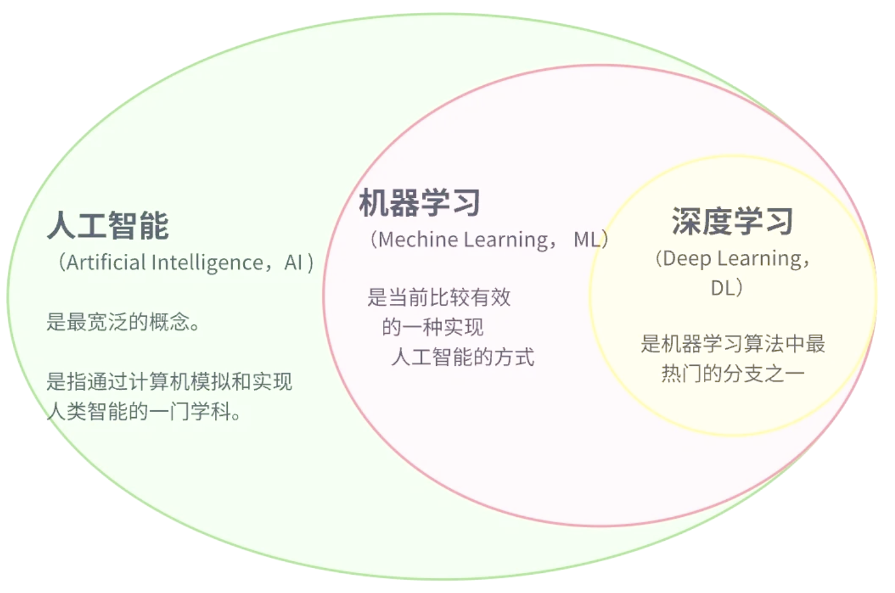
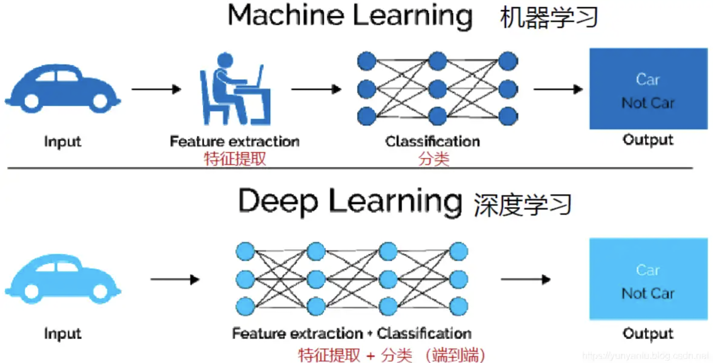
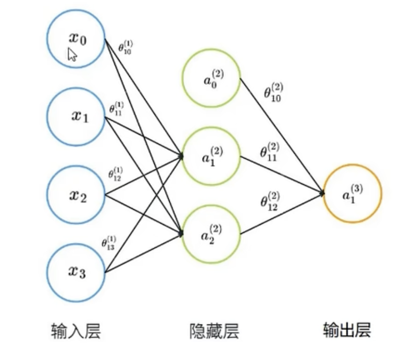

## 深度学习

在介绍深度学习之前，先看下人工智能、机器学习和深度学习之间的关系。

机器学习是实现人工智能的一种途径，深度学习是机器学习的一个子集。也就是说深度学习是实现机器学习的一种方法。深度学习与机器学习的主要区别如下图所示：

传统机器学习依赖人工设计特征，并进行特征提取，而深度学习方法不需要人工，而依赖算法自动提取特征。深度学习模拟人类大脑的运行方式，从经验中学习获取知识。这也是深度学习被看作黑盒子，可解释性差的原因。

## 神经网络

神经网络（Neural Network）也称人工神经元网络（Artificial Neural Network，简称ANN），是一种模仿生物大脑神经元相互连接和传递信息的计算模型。它由大量神经元组成，这些神经元通过权重相互连接，形成一个复杂的网络结构。

神经网络通常由以下几个元素组成：

- 神经元（Neuron）：神经元是网络的基本单元，它接收输入信号并产生输出信号

- 连接（Connection）：连接是神经元之间的路径，通过连接传递信号

- 权重（Weight）：权重是连接的强度，它决定了信号在神经元之间的传递效果

- 偏置（Bias）：偏置是神经元的额外输入，用于调整神经元的激活水平

- 激活函数（Activation Function）：激活函数用于对神经元的输入进行非线性变换，常见的激活函数包括sigmoid、ReLu等

  

- 输入层（Input Layer）：输入层接收输入数据，并将其传递给后续的神经元

- 隐藏层（Hidden Layer）：隐藏层位于输入层和输出层之间，用于处理和抽象输入数据

- 输出层（Output Layer）：输出层产生最终的输出结果

  

神经元是神经网络中的基本单元，它接收多个输入信号，通过一定的计算产生输出信号，并将输出信号传递给下一层神经元。神经元的数学模型可以这样来理解：多个输入信号线性加权相加，与阈值（b）相比较，所得结果由激活函数处理，最终产生输出信号。

## 如何训练神经网络

### 定义网络结构

训练神经网络之前，我们要先确定神经元网络的层数、每层神经元数量以及连接方式。输入层和输出层节点数量都是确定的。通常情况下，输入层的神经元数量等于数据集特征的数量，输出层神经元的数量等于数据集标签的数量。但是，隐藏层及其神经元的数量是无法简单确定的。

下面是常用的隐藏层确定规则：

1. 没有隐藏层。仅能够表示线性可分函数或决策
2. 隐藏层数=1。可以拟合任何“从一个有限空间到另一个有限空间的连续映射”的函数
3. 隐藏层数=2。搭配适当的激活函数可以表示任意精度的任意决策边界，并且可以拟合任何精度的任何平滑映射
4. 隐藏层数>2。多出来的隐藏层可以学习复杂的描述（某种自动特征工程）

在一些较大规模的深度学习模型中，隐藏层数量可能会达到几十或者上百。

隐藏层节点数的选择对网络性能的影响很大。若节点太少，网络获取的有用信息就少，容错性差，可能出现欠拟合（underfitting）问题；若节点过多，不但训练时间和训练难度增加，还可能出现过拟合（overfitting）问题。

下面是一个国外论文给出的隐藏节点确定规则：
$$
N_h = \frac{N_s}{\alpha * (N_i + N_o)}
\\
N_i 表示输入层神经元个数；N_o表示输出层神经元个数；N_s表示数据集的样本数；\alpha是一个变量，取值范围2-10
$$
另外，还有一些经验可以参考：

- 隐藏神经元的数量应在输入层和输出层的大小之间
- 隐藏神经元数量应为输入层大小的2/3加上输出层大小的2/3
- 影残神经元数量应小于输入层大小的两倍

### 前向传播

确定了神经元网络结构，就可以计算前向传播系数了。在神经元网络中，前向传播是指信息从输入层开始，依次通过隐藏层和输出层，最终得到输出结果的过程。在这个过程中，每个神经元都会对输入结果进行处理，并将处理结果传递给下一个神经元，直到达到输出层。

在上述网络的输入层中，x1、x2、x3为输入值，x0为偏置，θ为权重；在隐藏层中，α1、α2为输入层神经元的激活值，α0为偏置，θ为权重；输出层中的α1为最终输出。

在首次迭代时，权重θ通常为随机取值，但也有一些专用的初始化值的方案，比如：Xavier初始化 和 He初始化 等。

### 反向传播

前向传播完成后，我们首次计算出了网络中所有激活值，但这个激活值不一定能满足要求，因为训练的初始权重和偏置使用的是一个随机值或经验值。所以，我们要衡量一下输出误差的大小。衡量误差的方法是将输出结果与真实值进行比较，计算出误差。
$$
\delta_i^{(3)}=\alpha_i^{(3)}-y_i
\\
\alpha_i^{(3)} 表示第三层第i个神经元的预测值，y_i表示真实值，\delta_i^{(3)} 表示第三层第i个神经元的误差
$$
运用反向传播，可以计算除输入层外的所有层的误差。

### 更新权重

计算出每一个神经元的误差后，我们用梯度下降算法使整个神经元网络的总误差最小或达到最大训练次数。这个过层会不断更新每一层神经元网络的权重和偏置。当训练过层结束时，此时网络中的权重和偏置就是最优值。常用的梯度下降损失函数包括均方误差（MSE）和交叉熵（Cross-entropy）等

均方误差：
$$
MSE=\frac{1}{n}\sum_{i=1}^n(y_i^`-y_i)^2
\\
y_i^` 是第i个神经元预测值；y_i是实际值
$$
交叉熵：
$$
CE=-\frac{1}{N}\sum_{i=1}^N{[y_ilog(p_i)+(1-y_i)log(1-p_i)]}
\\
其中：N为样本数量；p_i是经过激活函数计算后的激活值；y_i是实际值
$$

