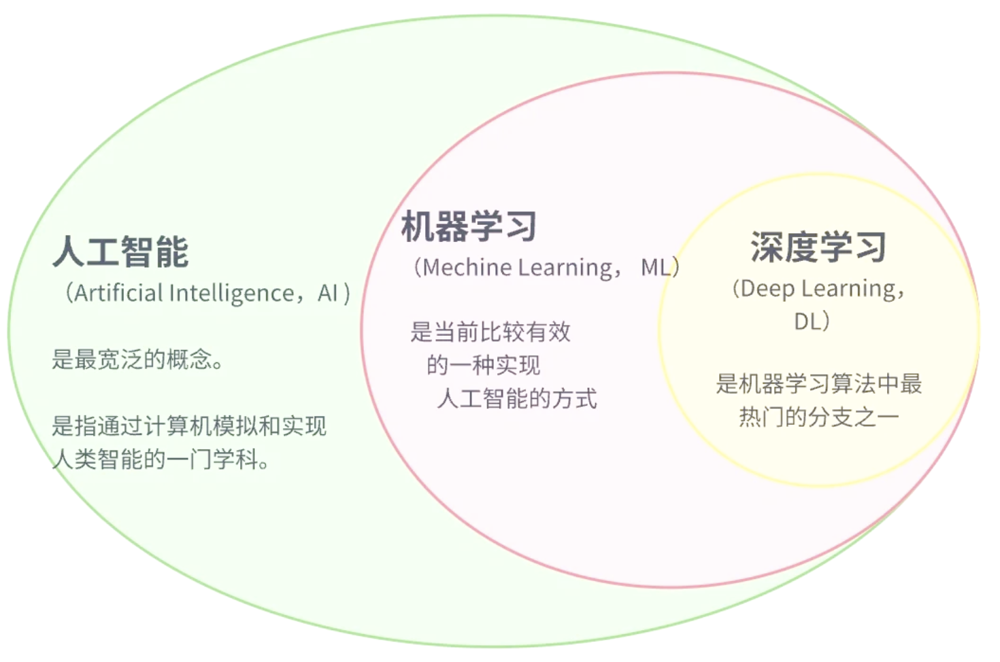
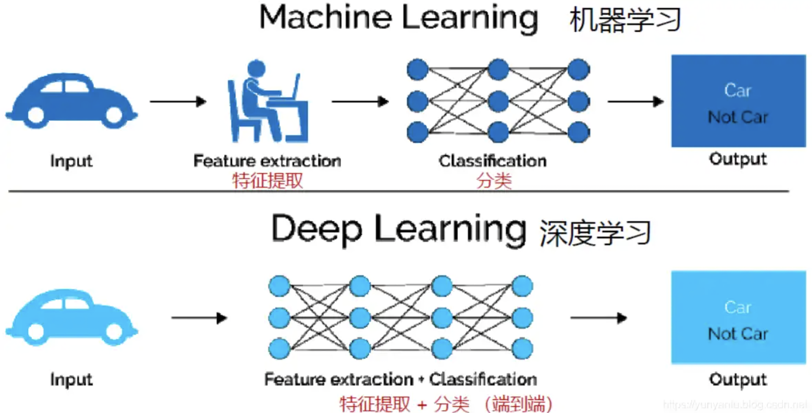
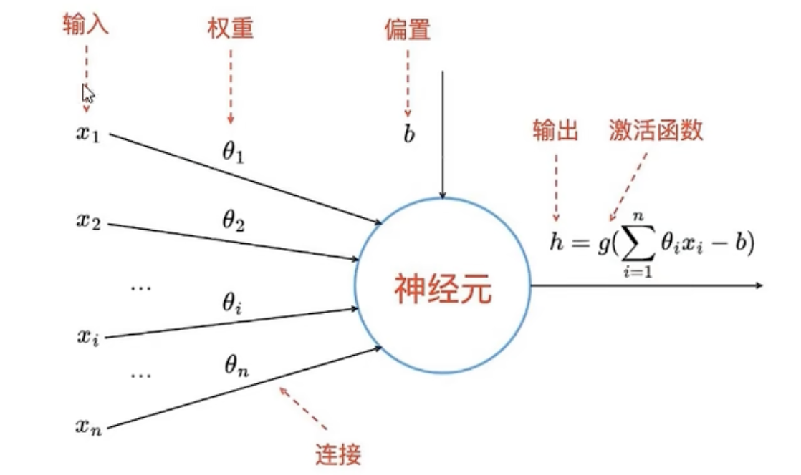
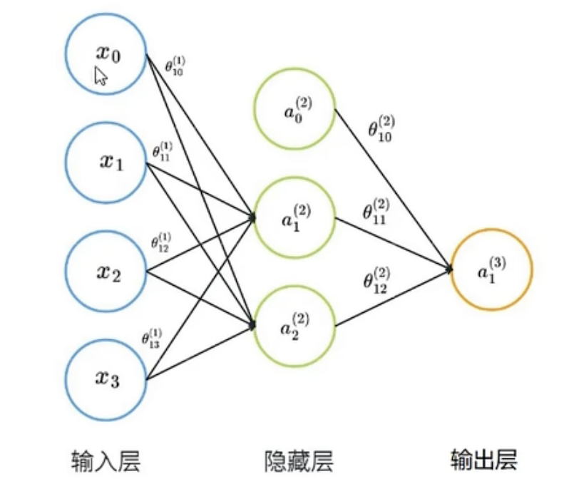

## 深度学习

在介绍深度学习之前，先看下人工智能、机器学习和深度学习之间的关系。



机器学习是实现人工智能的一种途径，深度学习是机器学习的一个子集。也就是说深度学习是实现机器学习的一种方法。深度学习与机器学习的主要区别如下图所示：



传统机器学习依赖人工设计特征，并进行特征提取，而深度学习方法不需要人工，而依赖算法自动提取特征。深度学习模拟人类大脑的运行方式，从经验中学习获取知识。这也是深度学习被看作黑盒子，可解释性差的原因。


## 神经网络

神经网络（Neural Network）也称人工神经元网络（Artificial Neural Network，简称ANN），是一种模仿生物大脑神经元相互连接和传递信息的计算模型。它由大量神经元组成，这些神经元通过权重相互连接，形成一个复杂的网络结构。

神经网络通常由以下几个元素组成：

- 神经元（Neuron）：神经元是网络的基本单元，它接收输入信号并产生输出信号

- 连接（Connection）：连接是神经元之间的路径，通过连接传递信号

- 权重（Weight）：权重是连接的强度，它决定了信号在神经元之间的传递效果

- 偏置（Bias）：偏置是神经元的额外输入，用于调整神经元的激活水平

- 激活函数（Activation Function）：激活函数用于对神经元的输入进行非线性变换，常见的激活函数包括sigmoid、ReLu等

  

- 输入层（Input Layer）：输入层接收输入数据，并将其传递给后续的神经元

- 隐藏层（Hidden Layer）：隐藏层位于输入层和输出层之间，用于处理和抽象输入数据

- 输出层（Output Layer）：输出层产生最终的输出结果

  

神经元是神经网络中的基本单元，它接收多个输入信号，通过一定的计算产生输出信号，并将输出信号传递给下一层神经元。神经元的数学模型可以这样来理解：多个输入信号线性加权相加，与阈值（b）相比较，所得结果由激活函数处理，最终产生输出信号。


## 激活函数

### 激活函数的作用

1. **引入非线性变换**
   现实世界的问题（如图像分类、语言翻译）本质是非线性的。激活函数通过对神经元输出进行非线性映射（如 `y = max(0, x)`），使网络能够学习输入与输出之间的复杂关系。
   **例**：没有激活函数时，多层网络的输出只是输入的线性组合（`y = W2·(W1·x + b1) + b2 = (W2·W1)·x + (W2·b1 + b2)`），与单层网络等价。
2. **控制神经元输出范围**
   将输出值映射到特定区间（如 [0,1] 或 [-1,1]），避免数值爆炸，便于后续层处理。
   **例**：Sigmoid 将输出压缩到 [0,1]，适合表示概率；ReLU 将负数截断为 0，增强模型稀疏性。
3. **缓解梯度消失/爆炸**
   合理的激活函数（如 ReLU）可使梯度在反向传播时保持较大数值，加速深层网络训练。
   **反例**：Sigmoid 的梯度在 |x|>5 时接近 0，导致深层网络梯度消失，难以训练。


### 常用激活函数

#### Sigmoid

- **公式**
  $$
  \delta(x) = \frac{1}{1 + e^{-x}}
  $$
  
- **输出范围**：(0, 1)

- **特点**：

  - 输出可解释为概率（如二分类的正例概率）
  - 梯度易消失（x>5 或 x<-5 时梯度≈0），隐藏层不推荐

- **适用场景**：二分类问题的**输出层**（如逻辑回归）


#### Tanh（双曲正切）

- **公式**
  $$
  tanh(x) = \frac{e^x - e^{-x}}{e^x + e^{-x}}
  $$
  
- **输出范围**：(-1, 1)

- **特点**：

  - 相比 Sigmoid 中心对称（均值为 0），梯度消失问题较轻
  - 仍存在梯度消失，且计算成本高于 ReLU

- **适用场景**：早期 RNN 隐藏层（如 LSTM 的门控机制）


#### ReLU（Rectified Linear Unit）

- **公式**
  $$
  ReLU = max(0, x)
  $$
  
- **输出范围**：[0, +∞)

- **特点**：

  - 计算极简单（仅比较和取最大值），训练速度快
  - 缓解梯度消失（x>0 时梯度=1），适合深层网络
  - **神经元死亡问题**：x<0 时输出 0 且梯度=0，神经元可能永久“死亡”

- **适用场景**：**隐藏层首选**（CNN、MLP、Transformer 等），尤其大规模网络


#### Leaky ReLU（ReLU 变种）

- **公式**：`LeakyReLU(x) = max(αx, x)`（α 通常=0.01）
  $$
  LeadkyReLU(x) = max(\alpha * x, x)
  $$
  
- **特点**：

  - 解决神经元死亡问题（x<0 时输出微小负值，梯度=α）。
  - α 是超参数，需调优（通常设为 0.01）。

- **适用场景**：替代 ReLU，尤其训练不稳定时（如小数据集）。


#### Swish

- **公式**
  $$
  Switch(x) = x*\delta(x)
  \\
  \delta 表示 sigmoid
  $$
  
- **特点**：

  - 平滑非线性，实验性能优于 ReLU（ImageNet 分类准确率更高）
  - 自带正则化效果，泛化能力强

- **适用场景**：CNN、Transformer 隐藏层（TensorFlow 默认使用）


#### Mish（Swish 改进版）

- **公式**：`Mish(x) = x · tanh(softplus(x))`（softplus(x)=ln(1+e^x)）
  $$
  Mish(x) = x*tanh(softplus(x))
  $$
  
  $$
  softplus(x) = ln(1+e^x)
  $$
  
  
  
- **特点**：

  - 理论上性能最优（连续可微，无死区），适合高精度模型
  - 计算复杂度高（涉及 tanh 和 softplus），推理速度较慢

- **适用场景**：资源充足的实验性模型（如竞赛、学术研究）


#### Softmax

- **公式**
  $$
  \sigma(\overrightarrow{z})_i=\frac{e^{z_i}}{\sum_{j=1}^{k}e^{z_j}}
  $$
  

- **输出范围**：(0, 1)，且所有类别输出之和=1

- **特点**：将得分转换为概率分布，多分类任务标配

- **适用场景**：多分类问题的**输出层**（如 ImageNet 1000 类分类）


#### GELU（Gaussian Error Linear Unit）

- **公式**
  $$
  GELU(x) = x*\phi(x)
  \\
  \phi是标准正态分布的累积分布函数
  $$
  

- **特点**：
  
  - 融合了随机性（类似 Dropout）和平滑性，适合自然语言处理
  - Transformer 模型（如 BERT、GPT）的默认激活函数
  
- **适用场景**：NLP 模型（Transformer、BERT、LLaMA）


## 如何训练神经网络

### 定义网络结构

训练神经网络之前，我们要先确定神经元网络的层数、每层神经元数量以及连接方式。输入层和输出层节点数量都是确定的。通常情况下，输入层的神经元数量等于数据集特征的数量，输出层神经元的数量等于数据集标签的数量。但是，隐藏层及其神经元的数量是无法简单确定的。

下面是常用的隐藏层确定规则：

1. 没有隐藏层。仅能够表示线性可分函数或决策
2. 隐藏层数=1。可以拟合任何“从一个有限空间到另一个有限空间的连续映射”的函数
3. 隐藏层数=2。搭配适当的激活函数可以表示任意精度的任意决策边界，并且可以拟合任何精度的任何平滑映射
4. 隐藏层数>2。多出来的隐藏层可以学习复杂的描述（某种自动特征工程）

在一些较大规模的深度学习模型中，隐藏层数量可能会达到几十或者上百。

隐藏层节点数的选择对网络性能的影响很大。若节点太少，网络获取的有用信息就少，容错性差，可能出现欠拟合（underfitting）问题；若节点过多，不但训练时间和训练难度增加，还可能出现过拟合（overfitting）问题。

下面是一个国外论文给出的隐藏节点确定规则：
$$
N_h = \frac{N_s}{\alpha * (N_i + N_o)}
\\
N_i 表示输入层神经元个数；N_o表示输出层神经元个数；N_s表示数据集的样本数；\alpha是一个变量，取值范围2-10
$$
另外，还有一些经验可以参考：

- 隐藏神经元的数量应在输入层和输出层的大小之间
- 隐藏神经元数量应为输入层大小的2/3加上输出层大小的2/3
- 隐藏神经元数量应小于输入层大小的两倍


### 前向传播

确定了神经元网络结构，就可以计算前向传播系数了。在神经元网络中，前向传播是指信息从输入层开始，依次通过隐藏层和输出层，最终得到输出结果的过程。在这个过程中，每个神经元都会对输入结果进行处理，并将处理结果传递给下一个神经元，直到达到输出层。



在上述网络的输入层中，x1、x2、x3为输入值，x0为偏置，θ为权重；在隐藏层中，α1、α2为输入层神经元的激活值，α0为偏置，θ为权重；输出层中的α1为最终输出。

在首次迭代时，权重θ通常为随机取值，但也有一些专用的初始化值的方案，比如：Xavier初始化 和 He初始化 等。


### 反向传播

前向传播完成后，我们首次计算出了网络中所有激活值，但这个激活值不一定能满足要求，因为训练的初始权重和偏置使用的是一个随机值或经验值。所以，我们要衡量一下输出误差的大小。衡量误差的方法是将输出结果与真实值进行比较，计算出误差。
$$
\delta_i^{(3)}=\alpha_i^{(3)}-y_i
\\
\alpha_i^{(3)} 表示第三层第i个神经元的预测值，y_i表示真实值，\delta_i^{(3)} 表示第三层第i个神经元的误差
$$
运用反向传播，可以计算除输入层外的所有层的误差。


### 损失函数

计算出每一个神经元的误差后，我们用梯度下降算法使整个神经元网络的总误差最小或达到最大训练次数。这个过程会不断更新每一层神经元网络的权重和偏置。当训练过程结束时，此时网络中的权重和偏置就是最优值。常用的梯度下降损失函数包括均方误差（MSE）和交叉熵（Cross-entropy）等

均方误差：
$$
MSE=\frac{1}{n}\sum_{i=1}^n(y_i^`-y_i)^2
\\
y_i^` 是第i个神经元预测值；y_i是实际值
$$
交叉熵：
$$
CE=-\frac{1}{N}\sum_{i=1}^N{[y_ilog(p_i)+(1-y_i)log(1-p_i)]}
\\
其中：N为样本数量；p_i是经过激活函数计算后的激活值；y_i是实际值
$$


### 优化器

有了损失函数计算出每个神经元的损失，接下来就需要更新我们的上一轮的权重和偏置了，我们在之前传统的机器学习模型中几乎都是使用的固定学习速率。

神经网络中的**优化器（Optimizer）** 是模型训练的“引擎”，核心作用是**根据损失函数的梯度调整模型参数（权重和偏置）**，使模型逐步逼近最优解。没有优化器，模型无法从数据中学习（参数无法更新），训练过程无法推进。

#### 优化器的核心作用

**参数更新：最小化损失函数**

神经网络的训练目标是最小化损失函数 （ 为模型参数）。优化器通过以下步骤实现：

1. **计算梯度**：通过反向传播求损失函数对参数的梯度 （参数变化对损失的影响率）
2. **调整参数**：沿梯度负方向更新参数，使损失减小：其中 为学习速率（步长），由优化器控制


**加速收敛：比原始梯度下降更快达到最优**

原始梯度下降（GD）存在缺陷：

- **全量数据计算**：每次迭代需遍历所有样本，计算成本高（大数据集不可行）
- **收敛慢**：学习速率固定，难以平衡“前期快速下降”和“后期精细调整”的诉求

优化器通过改进策略（如自适应学习率、动量）解决这些问题，例如：

- **SGD（随机梯度下降）**：每次用单个样本更新，速度快但梯度噪声大
- **Adam**：结合动量和自适应学习速率，收敛速度比GD快10-100倍


**避免局部最优：跳出次优解**

复杂损失函数的曲面存在多个局部最小值，原始梯度下降容易陷入次优解。优化器通过以下机制改进：

- **动量（Momentum）**：积累历史梯度方向，类似物理惯性，帮助冲过局部最小值
- **自适应学习率**：如Adam对不同参数设置不同学习率，避免在平坦区域学习过慢


**稳定训练：防止梯度爆炸/消失**

- **梯度裁剪**：优化器可配合梯度裁剪（如`clipvalue=1.0`），限制梯度最大范数，避免参数更新幅度过大
- **学习率衰减**：优化器内置学习速率调度器（如StepLR），随训练轮次减小学习率，稳定收敛


#### 优化器如何解决梯度下降的痛点

| 原始方法       | 痛点                         | 优化器解决方案（举例）                 |
| -------------- | ---------------------------- | -------------------------------------- |
| 梯度下降（GD） | 全量数据计算，速度慢         | SGD/Adam（随机采样样本，降低计算成本） |
| SGD            | 梯度噪声大，收敛路径震荡     | SGD+Momentum（积累历史梯度，平滑路径） |
| 固定学习率     | 学习率过小收敛慢，过大不收敛 | Adam/RMSprop（自适应学习率）           |
| 高维参数空间   | 不同参数需要不同学习率       | AdaGrad（对稀疏特征增大学习率）        |


#### 主流优化器的核心改进与适用场景

**SGD（随机梯度下降）**

- **原理**：每次用单个样本计算梯度并更新参数
- **优点**：计算快，适合大数据集
- **缺点**：梯度噪声大，收敛路径震荡
- **适用场景**：小数据集、需要精细调参的场景（配合学习率调度器）


**SGD+Momentum（动量SGD）**

- **改进**：模拟物理动量，积累历史梯度方向（如小球滚动下山）： 为动量系数（通常0.9）。
- **优点**：减少震荡，加速收敛（尤其是高曲率区域）。
- **适用场景**：替代原始SGD，几乎所有场景均可使用。


**Adam（Adaptive Moment Estimation）**

- 核心改进：
  - **动量（一阶矩）**：类似Momentum，积累梯度均值
  - **自适应学习率（二阶矩）**：用梯度平方的指数移动平均调整学习速率
- **优点**：收敛快、无需手动调参（默认参数表现优异），目前最主流
- **适用场景**：绝大多数深度学习任务（CNN、Transformer、GAN等）


**RMSprop/AdaGrad**

- **AdaGrad**：对频繁出现的特征减小学习速率，适合稀疏数据（如NLP文本）
- **RMSprop**：解决AdaGrad学习率随时间单调递减的问题，适合非平稳目标（如RNN序列预测）


#### 优化器选择指南

| 优化器                 | 收敛速度 | 调参难度 | 适用场景                         |
| ---------------------- | -------- | -------- | -------------------------------- |
| Adam                   | 快       | 低       | 初学者首选、复杂模型（默认选择） |
| SGD+Momentum           | 中       | 高       | 小数据集、需要高精度调参         |
| RMSprop                | 中       | 中       | RNN/LSTM（序列数据）             |
| AdaGrad                | 慢       | 低       | 稀疏数据（如文本分类、推荐系统） |
| AdamW（Adam+权重衰减） | 快       | 低       | 防止过拟合（替代L2正则化）       |


## 神经网络训练示例

此处我们还以鸢尾花的数据集作为入门训练的数据集，前面我们在KNN训练时已经知道鸢尾花是一个三分类的数据集。

除了sklearn可以加载鸢尾花数据集，seaborn库也是可以的。

```python
import seaborn as sn

iris = sn.load_dataset("iris")
```

seaborn的数据集是在线加载的，所以我们还是使用sklearn的数据。


### 定义神经网络结构

```python
# 这里开始要安装 tensorflow

from keras.models import Sequential  # 这是序贯模型，就是多个网络层堆叠出来的模型
from keras.layers import Dense  # dense 表示全连接层
from keras import activations  # 激活函数的模块


model = Sequential([
    # 第一层
    # units 神经元的个数，activation 使用什么激活函数，input_shape 输入数据的形状，鸢尾花有四个特征
    Dense(units=8, activation=activations.relu, input_shape=(4, )),
    # 第二层
    Dense(units=6, activation=activations.relu),
    # 第三层
    # 这里作为最后一层输出层，所以神经元的数量必须和我们希望的分类数保持一致，然后使用softmax来处理多分类问题
    Dense(units=3, activation=activations.softmax),
])
"""隐藏层神经元的数量，在前面讲了一些经验方法作为参考，神经元的数量没有确定值"""

# 打印一下概览信息
# 每一层的参数计算。 输入变量数 * 神经元个数 + 偏置个数
# 偏置个数 是跟随神经元个数的，每个神经元都有一个偏置
print(model.summary())
"""
Model: "sequential"
┏━━━━━━━━━━━━━━━━━━━━━━━━━━━━━━━━━┳━━━━━━━━━━━━━━━━━━━━━━━━┳━━━━━━━━━━━━━━━┓
┃ Layer (type)                    ┃ Output Shape           ┃       Param # ┃
┡━━━━━━━━━━━━━━━━━━━━━━━━━━━━━━━━━╇━━━━━━━━━━━━━━━━━━━━━━━━╇━━━━━━━━━━━━━━━┩
│ dense (Dense)                   │ (None, 8)              │            40 │ 
├─────────────────────────────────┼────────────────────────┼───────────────┤
│ dense_1 (Dense)                 │ (None, 6)              │            54 │
├─────────────────────────────────┼────────────────────────┼───────────────┤
│ dense_2 (Dense)                 │ (None, 3)              │            21 │
└─────────────────────────────────┴────────────────────────┴───────────────┘
 Total params: 115 (460.00 B)
 Trainable params: 115 (460.00 B)
 Non-trainable params: 0 (0.00 B)
"""
```


### 编译模型

```python
from keras import optimizers
from keras import losses

# 编译模型
# 指定优化器和损失函数，指标是准确率
model.compile(optimizer=optimizers.Adam, loss=losses.categorical_crossentropy, metrics=["accuracy"])
```


### 开始训练

```python
import numpy as np
import tensorflow as tf

from sklearn.datasets import load_iris
from sklearn.model_selection import train_test_split

from keras.models import Sequential
from keras.layers import Dense
from keras import activations
from keras import optimizers
from keras import losses


model = Sequential([
    Dense(units=8, activation=activations.relu, input_shape=(4, )),
    Dense(units=6, activation=activations.relu),
    Dense(units=3, activation=activations.softmax)
])

model.compile(optimizer=optimizers.Adam(), loss=losses.categorical_crossentropy, metrics=["accuracy"])

# 数据集，本次先不做归一化
x, y = load_iris(return_X_y=True)

# 数据集中的标签是 0、1、2 ，我们进行一下热度编码
y = np.array(tf.one_hot(y, depth=3))
x_train, x_test, y_train, y_test = train_test_split(x, y, test_size=0.2, random_state=2)

# 训练模型
# epochs 表示训练轮次；batch_size 表示在每个轮次中，每次取5个样本进行训练，所以每个轮次中还有多个迭代，迭代次数 = 样本总数 / batch_size
# verbose = 1 表示打印训练的过程信息
model.fit(x_train, y_train, epochs=50, batch_size=2, verbose=1)

# 计算一下测试集的损失和准确率，由于每批次是随机取得连个样本，所以每次跑出来的结果是有些许差异的
loss, accuracy = model.evaluate(x_test, y_test)
print(loss, accuracy)  # 0.10052110254764557 0.9333333373069763

# 保存模型
model.save("models/iris.keras")
```


### 样本预测

前面训练得到了一个鸢尾花的模型，那么现在就可以使用其进行预测。

```python
import numpy as np

from keras.models import  load_model

model = load_model("models/iris.keras")

# 随便写几个数据，预测数据的shape要和训练数据的保持一致
x = np.array([[4.7, 3.2, 1.3, 0.2], [6.2, 2.2, 4.5, 1.5], [6.7, 2.5, 5.8, 1.8], [5.7, 2.8, 4.1, 1.4]])

y = model.predict(x)
print(y)
"""
[[9.8366416e-01 1.6335931e-02 6.8036670e-09]
 [1.1423943e-03 7.2408754e-01 2.7477005e-01]
 [6.0834054e-06 6.2048197e-02 9.3794578e-01]
 [1.1371047e-02 9.3588203e-01 5.2747037e-02]]
"""
```

为什么我们预测的结果不是准确的分类呢？因为我们输出层的激活函数是softmax，然后我们的label数据（y_train）也是经过独热编码的，所以其实最后输出的是样本在某个索引处为1的概率，也就是说，概率最大值所在的索引，就是我们的预测值。

```python
import numpy as np

from keras.models import  load_model

model = load_model("models/iris.keras")

# 随便写几个数据，预测数据的shape要和训练数据的保持一致
x = np.array([[4.7, 3.2, 1.3, 0.2], [6.2, 2.2, 4.5, 1.5], [6.7, 2.5, 5.8, 1.8], [5.7, 2.8, 4.1, 1.4]])
y = model.predict(x)

# 还原成鸢尾花的分类标签
y_pred = [np.argmax(probabilities) for probabilities in y]
print(y_pred)  # [0, 1, 2, 1]
```


## 参数初始化

在前面我们提到，在进行首次迭代时，权重参数是随机的，但可以类似 Xavier初始化 和 He初始化 的方法，来初始化权重。在我们的实力中 Dense 默认使用的就是 Xavier初始化。在神经网络中，首次偏置通常置为0即可。

```python
  # Dense 的构造函数部分形参  
  def __init__(
        self,
        units,
        activation=None,
        use_bias=True,
        kernel_initializer="glorot_uniform",  # 这就是 Xavier初始化
        bias_initializer="zeros",
```

下面罗列一下初始化方法适用的网络结构和激活函数，至于每个初始化方案的细节此处不做描述。

| 网络类型/激活函数 | 推荐初始化方法        | 不推荐方法     |
| ----------------- | --------------------- | -------------- |
| CNN + ReLU        | He/Kaiming初始化      | Xavier初始化   |
| 全连接 + Tanh     | Xavier初始化          | 随机正态初始化 |
| Transformer/RNN   | 正交初始化            | 常数初始化     |
| 生成模型（GAN）   | 正交初始化 + 小标准差 | 均匀分布       |
| 微调预训练模型    | 仅初始化新增层（He）  | 全量重初始化   |

我们前面示例初始化值默认使用的Xavier，从表格看来是不适合我们使用的ReLU激活函数的，我们来修改一下：

```python
from keras.models import Sequential  # 这是序贯模型，就是多个网络层堆叠出来的模型
from keras.layers import Dense  # dense 表示全连接层
from keras import activations  # 激活函数的模块
from keras import initializers

model = Sequential([
    Dense(units=8, activation=activations.relu, input_shape=(4,), kernel_initializer=initializers.HeNormal()),
    Dense(units=6, activation=activations.relu, kernel_initializer=initializers.HeNormal()),
    Dense(units=3, activation=activations.softmax),
])
```
