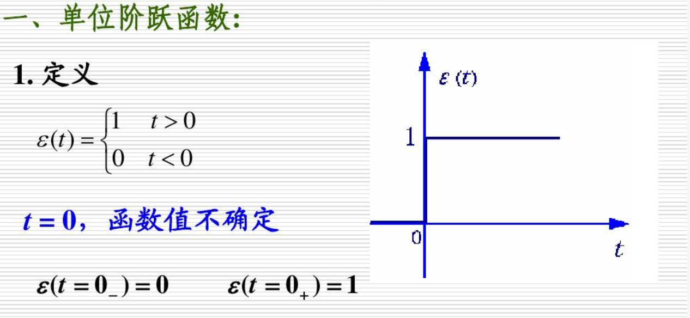
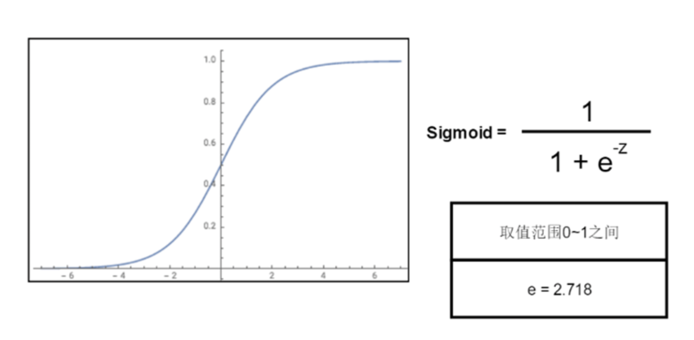
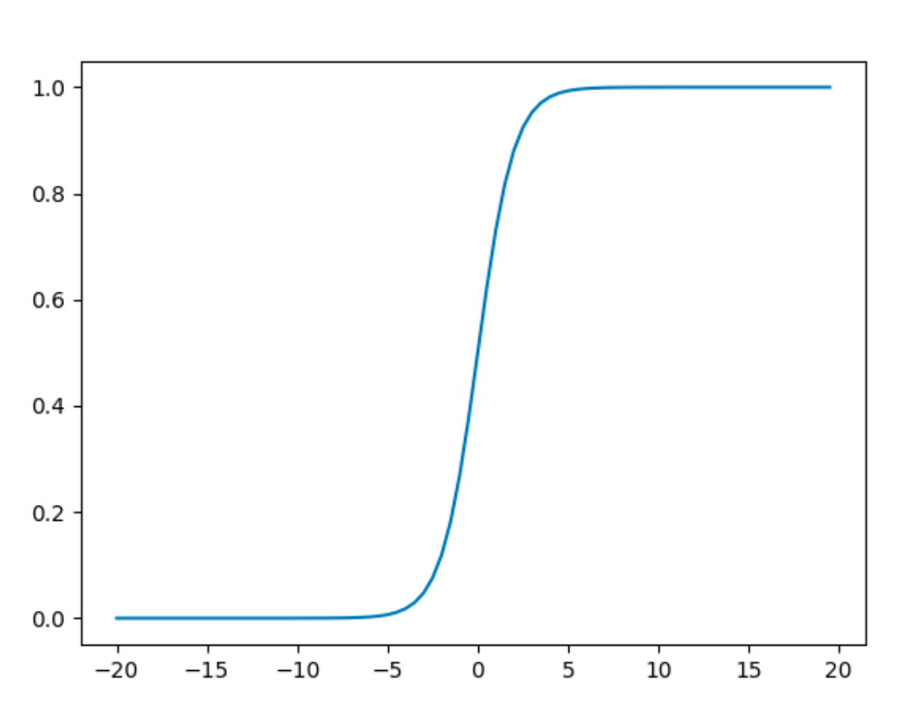
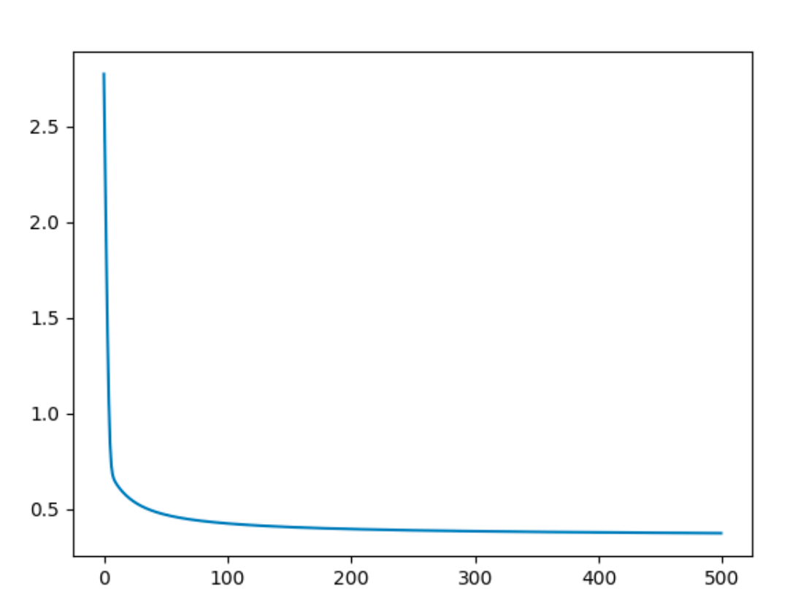
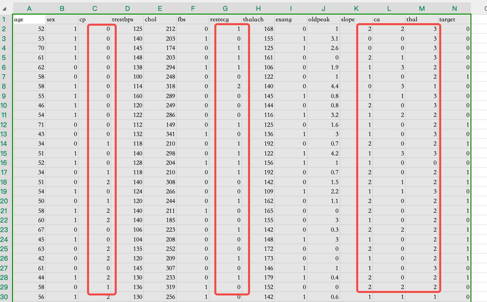
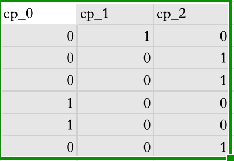

## 什么是逻辑回归

线性回归解决预测问题，逻辑回归解决分类问题，其本质还是回归。通过调整权重w和偏置b来找到线性函数，从而计算数据样本属于某一类的概率。

这里准备了一个南非心脏病数据集`heart.csv`，机器学习模型根据输入数据判断一个人患心脏病的概率为80%，则判定为“患病”，输出数值1，如果可能性为30%，则判定为“健康”，输出数值0。

逻辑回归主要利用线性回归+阶跃函数完成分类，如下图所示：



但是阶跃函数无法解决离群样本的数据偏差问题，比如考试及格与否作为阶路径的关键，如果得0分的人或得100分的人很多，则可能导致及格分数不是60分，会发生偏移。所以，更优的做法是使用Sigmoid函数（S型函数）进行转换，使之更好的拟合概率为代表的分类结果，又能够抑制两边比较接近0和1的极端例子，使之钝化，并且也能保持对中间部分数据细微变化的敏感度。



其公式为：
$$
Sig(z)=\frac{1}{1+e^{-z}}
$$
我们可以使用Matplotlib绘制Sigmoid函数曲线。

```python
import numpy as np
import matplotlib.pyplot as plt

z = np.arange(-20, 20, 0.5)
plt.plot(z, 1 / (1 + np.exp(-z)))
plt.show()
```



那么我们就可以使用代码定义一个Sigmoid函数：

```python
import numpy as np
import matplotlib.pyplot as plt


def sigmoid(z: np.ndarray):
    sig = 1 / (1 + np.exp(-z))
    return sig
```

Sigmoid函数有以下一些特征：

1. 连续单调递增
2. 可以进行微分和求导
3. 输出范围是[0, 1]，结果可表示为概率形式
4. 抑制分类的两边，对中间区域变化敏感


## 逻辑回归的损失函数

逻辑回归的损失函数基于最大似然估计（MLE）推导而来，用于衡量预测模型概率 Pi与真实标签Yi（取值为0或1）之间的差异。

对数似然损失函数：
$$
cost(p,y)=\begin{cases}-log(p)\quad if\quad y=1\\-log(1-p)\quad if\quad y=0\end{cases}
$$
由此可推导出逻辑回归的损失函数：
$$
loss=-\frac{1}{N}\sum_{i=1}^N{[y_ilog(p_i)+(1-y_i)log(1-p_i)]}
\\
其中：N为样本数量；p_i=sigmoid(z_i)是Sigmoid函数输出的概率值，z_i=w^Tx_i+b
\\
当y_i=1时，损失项为-log(p_i)，预测越接近1损失越小
\\
当y_i=0时，损失项为-log(1-p_i)，预测越接近0损失越小
$$
基于上述公式，我们用代码实现逻辑回归的损失函数：

```python
import numpy as np
import matplotlib.pyplot as plt


def sigmoid(z: np.ndarray):
    sig = 1 / (1 + np.exp(-z))
    return sig


def loss_func(x: np.ndarray, y: np.ndarray, w: np.ndarray, b):
    """
    x 为样本中多元的自变量，是二维数组
    y 为样本中的标签值，一维数组
    w 是与x对应的权重，一维数组
    b 常量偏置
    """
    pi = sigmoid(x.dot(w.T) + b)
    loss = np.sum(-(y*np.log(pi) + (1 - y)*np.log(1 - pi))) / x.shape[0]
    return loss
```


## 逻辑回归的梯度下降

逻辑回归的梯度公式与线性回归思路相同：
$$
grad_w=\frac{\sum_{i=1}^{n}(p_i-y_i)*x_i}{N}
$$
参数变化的公式是一样的：
$$
w=w-\alpha*grad_w
$$
基于公式，我们就可以用代码实现逻辑回归梯度下降的过程：

```python
def logistic_gradient(x: np.ndarray, y: np.ndarray, lr, loop):
    """
    x 为样本中多元的自变量，是二维数组
    y 为样本中的标签值，一维数组
    lr 学习速率
    loop 训练次数
    """
    # 记录过程数据
    loss = np.zeros(loop)
    weights = np.zeros((loop, x.shape[1]))
    biases = np.zeros(loop)

    # 权重和偏置的初始值都取为1
    w = np.ones(x.shape[1])
    b = 1

    for i in range(loop):
        pi = sigmoid(x.dot(w.T) + b)
        g_w = x.T.dot((pi - y).reshape(-1, 1)) / x.shape[0]
        g_b = np.sum(pi - y) / x.shape[0]

        w -= lr * g_w.flatten()
        b -= lr * g_b.flatten()

        loss[i] = loss_func(x, y, w, b)
        weights[i] = w
        biases[i] = b

    return loss, weights, biases
```


## 准备数据进行训练

```python
if __name__ == '__main__':
    # 加载数据
    heart = pd.read_csv("./data/heart.csv")

    # 看下最后一列标签分布
    # print(heart.iloc[:, -1:].value_counts())  # 0 302  1 160

    x = np.array(heart.iloc[:, :-1])  # 取所有行，最后一列不取，最后一列是标签列
    y = np.array(heart.iloc[:, -1:]).flatten()  # 展平成一维

    # 拆分训练集和测试集
    x_train, x_test, y_train, y_test = train_test_split(x, y, test_size=0.2, random_state=0)

    # 归一化处理
    # 由于 y 的取值本身直邮0和1，就不需要做归一化处理了
    scaler = MinMaxScaler()
    x_train = scaler.fit_transform(x_train)
    x_test = scaler.transform(x_test)  # 此处之所以不需要fit，是因为测试集也基于训练集做归一化

    # 训练
    loss, weights, biases = logistic_gradient(x_train, y_train, 0.3, 500)
    print("权重为：", weights[-1])  # [-0.55839748 -1.43299892  2.12194635 -0.40805546  0.09627404  0.11172215  1.10195385  1.80762523 -1.10324116 -1.2612392   1.60912132 -1.95945032  -1.3988959 ]
    print("偏置为：", biases[-1])  # 0.2465565650879853

    # 绘制损失曲线
    plt.plot(loss)
    plt.show()
```

损失值收敛情况：




下面我们编写一个预测函数，来看看测试集预测结果和实际结果相比，正确率是多少，函数如下：

```python
def predict(x, y, w, b):
    p = sigmoid(x.dot(w.T) + b)
    y_pred = np.zeros(p.shape[0])

    for i in range(p.shape[0]):
        if p[i] > 0.5:
            y_pred[i] = 1

    # 把预测值和实际值做差，结果为0 则说明预测准确，非0 则不准确
    count = 0
    for val in y_pred - y:
        print(val)
        if val == 0:
            count += 1

    print("准确率为：", count / len(y))
```

接着前面的代码，我们使用测试集进行预测。

```python
if __name__ == '__main__':
    # 加载数据
    heart = pd.read_csv("./data/heart.csv")

    # 看下最后一列标签分布
    # print(heart.iloc[:, -1:].value_counts())  # 0 302  1 160

    x = np.array(heart.iloc[:, :-1])  # 取所有行，最后一列不取，最后一列是标签列
    y = np.array(heart.iloc[:, -1:]).flatten()  # 展平成一维

    # 拆分训练集和测试集
    x_train, x_test, y_train, y_test = train_test_split(x, y, test_size=0.2, random_state=0)

    # 归一化处理
    # 由于 y 的取值本身直邮0和1，就不需要做归一化处理了
    scaler = MinMaxScaler()
    x_train = scaler.fit_transform(x_train)
    x_test = scaler.transform(x_test)  # 此处之所以不需要fit，是因为测试集也基于训练集做归一化

    # 训练
    loss, weights, biases = logistic_gradient(x_train, y_train, 0.3, 500)

    # 计算预测准确率
    predict(x_test, y_test, weights[-1], biases[-1])  # 0.8780487804878049
```

用于训练的样本在800条左右，准确率为 0.878 ，这个准确率还是很不错的。

下面我们使用SKLearn来训练，对比一下准确率：

```python
import numpy as np
import pandas as pd

from sklearn.preprocessing import MinMaxScaler
from sklearn.model_selection import train_test_split
from sklearn.linear_model import LogisticRegression


# 加载数据
heart = pd.read_csv("./data/heart.csv")

# 看下最后一列标签分布
# print(heart.iloc[:, -1:].value_counts())  # 0 302  1 160

x = np.array(heart.iloc[:, :-1])  # 取所有行，最后一列不取，最后一列是标签列
y = np.array(heart.iloc[:, -1:]).flatten()  # 展平成一维

# 拆分训练集和测试集
x_train, x_test, y_train, y_test = train_test_split(x, y, test_size=0.2, random_state=0)

# 归一化处理
# 由于 y 的取值本身直邮0和1，就不需要做归一化处理了
scaler = MinMaxScaler()
x_train = scaler.fit_transform(x_train)
x_test = scaler.transform(x_test)  # 此处之所以不需要fit，是因为测试集也基于训练集做归一化

# 开始训练
model = LogisticRegression()
model.fit(x_train, y_train)

print("权重: ", model.coef_)  # [[-0.73816943 -1.62613136  2.10405714 -1.19011495 -1.19314255  0.05917605 0.92916506  1.95756282 -1.04518539 -2.65999431  0.98246673 -2.30676229 -2.04155542]]
print("偏置: ", model.intercept_)  # [2.29535294]

# 评分
score = model.score(x_test, y_test)
print(score)  # 0.8585365853658536
```

通过使用三方库，可以极大的降低我们脚本编写的成本。这里sklearn得到的结果比我们自己写的算法结果还稍逊一筹。


## 哑特征优化准确率

到此，我们基于数据集完成了训练并作了预测，但本次的数据集其实还有一些问题，我们用表格工具打开看看数据。



上图中标红的数据列，他们有一个特征，那就是它们是有顺序大小的数字，这会让模型误认为这些样本之间本身有大小关系，但其实这些列只是某个特征的多分类而已。

数据中还有一个`sex`列，它是一个二分类，取值只有0和1，这样的数据对于模型来说会更友好，不会像标红的列那样有大小关系。

此话其他数据列，由于是实实在在的，没有规律的实际数据，本身不具备连续性，因此也不会让模型误认为样本间有大小关系。

那么，基于前面的分析，我们可以考虑将多分类的数据列拆分，使用独热编码的思路。这里以`cp`列的20-25行为例，拆分得到如下数据列：



从过以上方式，把多分类的列拆分为多列二分类。那么接下来我们就将图中标红的列拆分后，重新进行训练预测：

```python
import numpy as np
import pandas as pd

from sklearn.preprocessing import MinMaxScaler
from sklearn.model_selection import train_test_split
from sklearn.linear_model import LogisticRegression


# 加载数据
heart = pd.read_csv("./data/heart.csv")

# 这里要使用到 pandas 的 get_dummies 方法，它可以直接帮我们把多分类的列，转换成多个二分类的列
# prefix 就是心列的前缀
cp = pd.get_dummies(heart['cp'], prefix="cp")
restecg = pd.get_dummies(heart['restecg'], prefix="restecg")
slope = pd.get_dummies(heart['slope'], prefix="slope")
ca = pd.get_dummies(heart['ca'], prefix="ca")
thal = pd.get_dummies(heart['thal'], prefix="thal")

# 删除原数据列，然后把新的列追加到样本中
heart = heart.drop(columns=["cp", "restecg", "slope", "ca", "thal"])
# axis=1 表示沿着列连接数据，axis=0 表示沿着行连接。这个 ndarray.append 的axis参数类似
heart = pd.concat([heart, cp, restecg, slope, ca, thal], axis=1)

print(heart.columns)  # ['age', 'sex', 'trestbps', 'chol', 'fbs', 'thalach', 'exang', 'oldpeak','target', 'cp_0', 'cp_1', 'cp_2', 'cp_3', 'restecg_0', 'restecg_1', 'restecg_2', 'slope_0', 'slope_1', 'slope_2', 'ca_0', 'ca_1', 'ca_2', 'ca_3', 'ca_4', 'thal_0', 'thal_1', 'thal_2', 'thal_3']

x = np.array(heart.iloc[:, :-1])  # 取所有行，最后一列不取，最后一列是标签列
y = np.array(heart.iloc[:, -1:]).flatten()  # 展平成一维

# 拆分训练集和测试集
x_train, x_test, y_train, y_test = train_test_split(x, y, test_size=0.2, random_state=0)

# 归一化处理
# 由于 y 的取值本身直邮0和1，就不需要做归一化处理了
scaler = MinMaxScaler()
x_train = scaler.fit_transform(x_train)
x_test = scaler.transform(x_test)  # 此处之所以不需要fit，是因为测试集也基于训练集做归一化

# 开始训练
model = LogisticRegression()
model.fit(x_train, y_train)

# 评分
score = model.score(x_test, y_test)
print(score)  # 0.9951219512195122
```

可以看到，我们进行哑特征处理后，这准确率嘎嘎提升到了 0.995。


## 多分类样本预测

前面使用Sigmoid函数完成成了二分类的数据训练及预测，但如果样本标签有多个，那么Sigmoid将不再适用，通常使用Softmax函数。

Softmax函数通常用于将一组任意实数转换为表示概率的实数。其本质是一种归一化函数，可以将任意的实数值转换为在[0, 1]之间的概率值，如果其中一个输入很小或为负，softmax将其变为小概率，如果输入很大，则将其变为大概率，但他始终保持在[0, 1]之间。

Softmax是逻辑回归的一种推广，可以用于多分类任务，其公式与Sigmoid函数非常相似。只有当分类是互斥的，才可以在分类器中使用softmax函数，也就是说只能是多元分类（数据只有一个标签），而不能是多标签分类（一条数据有多个标签）。

许多多层神经网络的最后一层是一个全联接层，输出是一个实数向量，这个向量通常代表了每个类别的得分或置信度。为了将这些得分转换为概率分布，通常会使用softmax函数。因为它将分数转化为规范化的概率分布，可以显示给用户或用作其他系统的输入，所以通常在神经网络的最后一层之后附加一个softmax函数。
$$
\sigma(\overrightarrow{z})_i=\frac{e^{z_i}}{\sum_{j=1}^{k}e^{z_j}}
$$
softmax的输入是一个包含K个元素的向量，其中不带箭头的z表示向量的一个元素。从公式中可以看到，由于分子分母都以自然对数e的任意次方来进行运算，那么不管元素是负数还是0其概率都将是一个整数，且一定能控制在 0-1 之间。

另外，softmax的分母是所有元素作为e的次方的求和，而分子只是其中一个元素，也就说明softmax计算得到的每个元素的概率，它们全部加起来的结果将会是1。

softmax为什么选用自然对数e作为底数，其实是为了拉大输入值之间的差异，然后使用一个配分归一化为一个概率分布，原则上任意大于0的数都可以作为底数，数越大那么“拉开差异”的作用越大。在分类问题中，我们希望模型分配给正确分类的概率接近1，其他的概率接近0，如果使用线性的归一化方法很难达到效果，而softmax通过先拉开差距再归一化的方式，在分类问题中有着显著优势。

在sklearn中自带了一些数据集，其中有一个鸢尾花的数据集，我们基于它做一个多分类逻辑回归练习。

数据集：

```python
from sklearn.datasets import load_iris

# return_X_y 表示拆分然后返回样本和标签
# as_frame 表示返回pandas的数据类型。样本是DataFrame 标签是Series
x, y = load_iris(return_X_y=True, as_frame=True)

# 数据集有四列分别是 花萼长度、花萼宽度、花瓣长度、花瓣宽度
print(x[:5])
"""
   sepal length (cm)  sepal width (cm)  petal length (cm)  petal width (cm)
0                5.1               3.5                1.4               0.2
1                4.9               3.0                1.4               0.2
2                4.7               3.2                1.3               0.2
3                4.6               3.1                1.5               0.2
4                5.0               3.6                1.4               0.2
"""

# 查看标签分类及数量
print(y.value_counts())
"""
target
0    50
1    50
2    50
Name: count, dtype: int64
"""
```

基于数据训练逻辑回归模型并进行测试：

```python
from sklearn.model_selection import train_test_split
from sklearn.linear_model import LogisticRegression
from sklearn.datasets import load_iris

# return_X_y 表示拆分然后返回样本和标签
# as_frame 默认为False，此时直接返回 ndarray
x, y = load_iris(return_X_y=True, as_frame=False)

# 拆分训练集和测试集
# random_state 随机数种子，相同的随机数种子，每次运行代码得到的训练集和测试集是一样的
# 随机数不同，得到的数据集也不会相同。如果不给随机数，那么每次运行代码得到的数据集可能都不一样
x_train, x_test, y_train, y_test = train_test_split(x, y, test_size=0.2, random_state=5)

# 训练并预测
# 对于多元分类的标签，sklearn会自动帮我们使用softmax
model = LogisticRegression()
model.fit(x_train, y_train)

print(model.score(x_test, y_test))  # 0.9666666666666667
```
