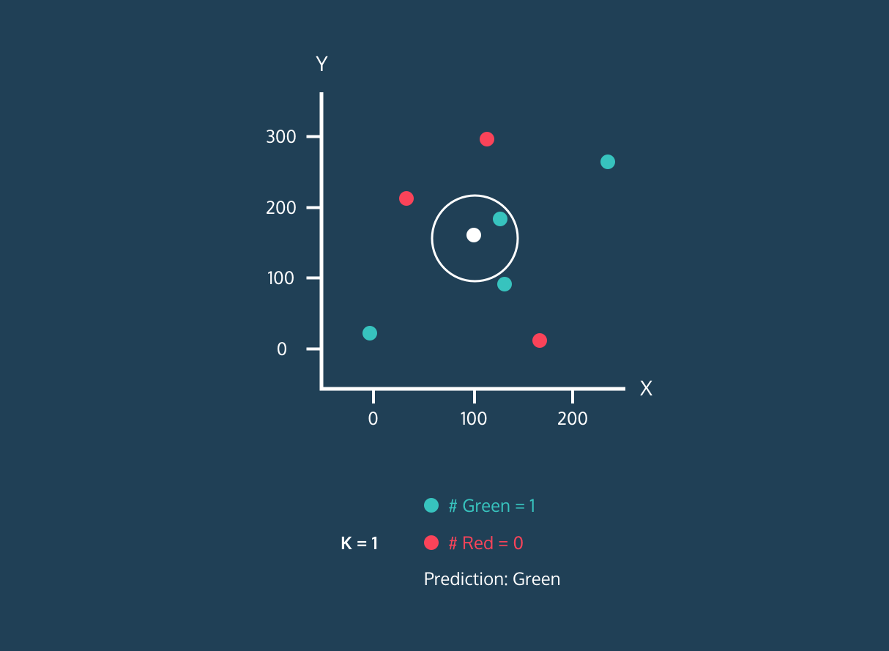

## KNN概述

**KNN(K Nearest Neighbor)**算法，也叫 **K 近邻算法**。这里K近邻就是 k个最近的邻居的意思。**KNN 算法的核心思想是，对一个位置样本的标签，可以使用K个 “特征和它最接近的已知样本的标签来推断“**。



KNN算法既可以用于分类问题，也可以用于回归问题：

- 对于分类问题，是使用与未知样本特征最接近的K个已知样本的标签中占比最多的标签值，作为未知样本的标签值
- 对于回归问题，是使用与未知样本特征最接近的K个已知样本的标签的加权平均数，作为未知样本的标签值


**样本间特征的相似度可以用特征的距离来表示，KNN一般使用欧式距离。**欧式距离可以用勾股定理推导而来，其公式如下：


- 二维平面上的点`a(x1,y1)`和点`b(x2,y2)`之间的欧式距离公式：
  $$
  d_{ab}=\sqrt{(x_1-x_2)^2+(y_1-y_2)^2}
  $$

- 三维空间上的点`a(x1,y1,z1)`和点`b(x2,y2,z2)`之间的欧式距离公式：
  $$
  d_{ab}=\sqrt{(x_1-x_2)^2+(y_1-y_2)^2+(z_1-z_2)^2}
  $$

- n维空间平面上的点点`a(x1,x2,...,xn)`和点`b(y1,y2,...,y2)`之间的欧式距离公式：
  $$
  d_{ab}=\sqrt{(x_1-y_1)^2+(x_2-y_2)^2+...+(x_n-y_n)^2}=\sqrt{\sum{_{i=1}^n}(x_i-y_i)^2}
  $$


**KNN的工作流程（以分类问题为例）：**

1. 确定超参数k的值（超参数，机器学习模型中需要手动指定的参数），通常应该是奇数，偶数会出现打平的状况
2. 计算已知样本中的点与当前点之间的距离
3. 按距离递增对已知样本进行排序
4. 选取与当前点距离最近的k个样本点
5. 统计前k个样本点所在类别出现的频率
6. 返回前k个样本点中类别出现频率最高的类别作为当前点的预测类别


## 预测验证

手动实现一个KNN的算法逻辑，KNN相比于之前的线性回归，其逻辑更为简单易理解。

```python
import math

from collections import Counter

from sklearn.preprocessing import StandardScaler
from sklearn.model_selection import train_test_split
from sklearn.datasets import load_iris


def knn_score(x_train, x_test, y_train, y_test, k):

    y_pred = []

    # 计算测试样本到已知样本的距离
    for test in x_test:
        dists = []
        for idx, train in enumerate(x_train):
            dist = math.sqrt(sum([(test[i] - train[i])**2 for i in range(len(test))]))
            # 记录未知样本到每个已知样本的距离和对应的分类
            dists.append((dist, y_train[idx]))

        # 根据k获取距离最近的几个样本
        dists = sorted(dists, key=lambda x: x[0])[:k]
        # 统计前k个样本出现次数最多的标签
        counter = Counter([item[1] for item in dists])
        # 讲述限次数最多的数据放到预测列表
        y_pred.append(counter.most_common(1)[0][0])

    # 计算准确率
    matched = 0
    diff = 0
    for pred, real in zip(y_pred, y_test):
        if pred == real:
            matched += 1
        else:
            diff += 1
    rate = matched / (matched + diff)
    return rate
```

现在我们继续使用sklearn自带的鸢尾花数据集进行预测：

```python
if __name__ == '__main__':
    # return_X_y 表示拆分然后返回样本和标签
    x, y = load_iris(return_X_y=True, as_frame=False)

    # 拆分训练集和测试集
    x_train, x_test, y_train, y_test = train_test_split(x, y, test_size=0.2, random_state=5)

    # 归一化 这里使用使用 均值标准差归一化
    scaler = StandardScaler()
    # 下面两步同 fit_transform
    scaler.fit(x_train)  # 先基于训练集计算均值和标准差

    # 使用相同标准归一化训练集和测试集
    x_train = scaler.transform(x_train)
    x_test = scaler.transform(x_test)

    # 使用自写算法进行测试打分
    score = knn_score(x_train, x_test, y_train, y_test, k=7)
    print(score)  # 0.9666666666666667
```

在超参数K=7时，我们的测试准确率为 0.967，下面继续使用sklearn库进行预测：

```python
# return_X_y 表示拆分然后返回样本和标签
x, y = load_iris(return_X_y=True, as_frame=False)

# 拆分训练集和测试集
x_train, x_test, y_train, y_test = train_test_split(x, y, test_size=0.2, random_state=5)

# 归一化 这里使用使用 均值标准差归一化
scaler = StandardScaler()
# 下面两步同 fit_transform
scaler.fit(x_train)  # 先基于训练集计算均值和标准差

# 使用相同标准归一化训练集和测试集
x_train = scaler.transform(x_train)
x_test = scaler.transform(x_test)

# 使用sklearn模型
model = KNeighborsClassifier(n_neighbors=7)
model.fit(x_train, y_train)

score = model.score(x_test, y_test)
print(score)  # 0.9666666666666667
```

可以看到，其结果与自己实现的算法准确率一致，说明我们实现的逻辑没问题。


## 选择K值

在前面的预测验证中其实有两个问题，一个是K值我们是凭感觉给的，可能并不是最优值；而是我们的训练集和测试集也是固定的，就是说得到的准确率并不严谨，同一批数据中变更一下训练集和测试集可能准确率就会出现较大波动。

因此，我们需要采取一些策略来确保我们的K值和准确率尽量的“靠谱”。

### K折交叉验证

所谓的K折，就是把数据集分成K份的意思。然后依次把其中一份作为测试集，其余部分作为训练集，使得数据集中的每个数据都作为训练集，也使得每个数据都作为测试集，然后将K次训练并预测的准确率求平均值作为最终的准确率。


下面基于代码来实现一下这个过程：

```python
import numpy as np

from sklearn.preprocessing import StandardScaler
from sklearn.model_selection import KFold
from sklearn.datasets import load_iris
from sklearn.neighbors import KNeighborsClassifier


x, y = load_iris(return_X_y=True, as_frame=False)

# 分成五份数据
kf = KFold(n_splits=5)

# 遍历每一份数据获取评分
scores = []

for train, test in kf.split(x, y):
    x_train, x_test = x[train], x[test]
    y_train, y_test = y[train], y[test]

    # 归一化
    scaler = StandardScaler()
    scaler.fit(x_train)
    x_train = scaler.transform(x_train)
    x_test = scaler.transform(x_test)

    # 使用sklearn模型
    model = KNeighborsClassifier(n_neighbors=7)
    model.fit(x_train, y_train)

    score = model.score(x_test, y_test)
    scores.append(score)

# 最终准确率
print(np.mean(scores))  # 0.8800000000000001
```

可以看到，在K=7时通过5折交叉验证，最终准确率只有0.88。同时，如果要验证其他K值，我们还需要在算一次，每一个K值我们都需要重复上面的过程，然后最终得到准确率最高的K。


### 网格搜索

