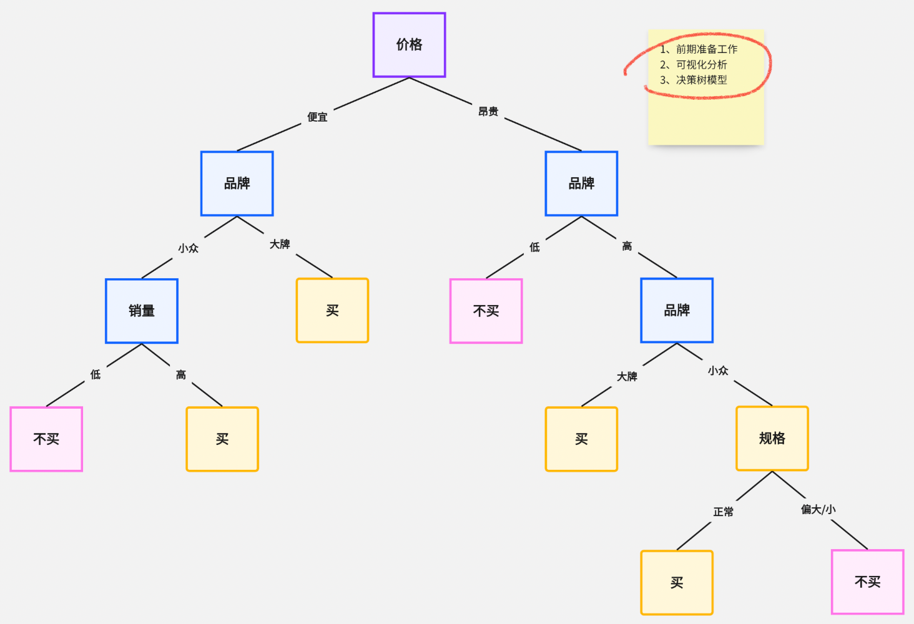

## 决策树

决策树（Decision Tree）是在已知各种情况发生概率的基础上，通过构成决策树来求取净现值的期望值大于等于零的概率，评价项目风险，判断其可行性的决策分析方法，是直观运用概率分析的一种图解法。

由于这种决策分支画成图形很像一棵树的枝干，故称决策树。决策树是一种树形结构，其中每个内部节点表示一个属性上的测试，每个分支代表一个测试输出，每个叶节点代表一种类别。



在机器学习中，决策树是一个预测模型，属于监督学习范畴，他代表的是对象属性与对象值之间的一种映射关系。

在sklearn中也同样提供了三方库，决策树的关键在于找到树的根节点，从哪里开始构造树，现在还是使用`heart.csv`数据集来做个演示：

```python
from sklearn.datasets import load_iris

from sklearn.preprocessing import MinMaxScaler, StandardScaler
from sklearn.model_selection import train_test_split
from sklearn.tree import DecisionTreeClassifier


x, y = load_iris(return_X_y=True, as_frame=False)

# 拆分训练集和测试集
x_train, x_test, y_train, y_test = train_test_split(x, y, test_size=0.5, random_state=2)

scaler = StandardScaler()
scaler.fit(x_train)
# 使用相同标准归一化训练集和测试集
x_train = scaler.transform(x_train)
x_test = scaler.transform(x_test)

# 训练及测试，使用默认值
# random_state 和数据集的 random_state 用法相同，相同参数构建的树结构相同
# max_depth 树的最大深度
dt = DecisionTreeClassifier(max_depth=3, random_state=3)
dt.fit(x_train, y_train)
print(dt.score(x_test, y_test))  # 0.9333333333333333

# 训练及测试，使用默认值
dt = DecisionTreeClassifier(max_depth=10, random_state=3)
dt.fit(x_train, y_train)
print(dt.score(x_test, y_test))  # 0.96
```


## 集成学习

