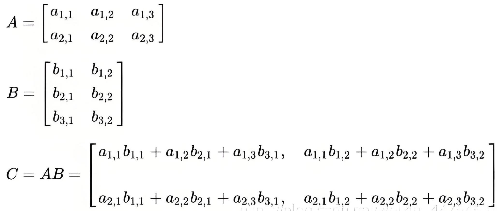

## 人工智能简介

### 人工智能主要分支

- 计算机视觉(CV)：图像采集、图像处理、图像提取、图像推理、图像生成
- 自然语言处理(NLP)：让计算机处理、理解、生成文本的技术，还包括语音识别和语音生成
- 机器人(Robot)：研究机器人的设计、制造、运作和应用，以及控制它们的计算机系统、传感反馈和信息处理


## Numpy

numpy是python的一个三方库，意思是"Numeric Python"，它是一个有多维数组对象和处理数组的函数集合组成的库。numpy的数组（ndarray）在运算时是非常高效的，特别是在多维向量运算时远比python列表快得多。

> 张量（tensor）：表达N维数组的统称 TPU。张量是向量和矩阵的推广，单个数据即为 0维张量，一维数组是 1维张量，矩阵（二维数组）是 2维张量，那么三维数组也就是 3维张量，依次类推。
>
> ndarray(N-Dimension Array)：即 N维数组，是numpy中最重要的数组对象。ndarray中的每个元素在内存中使用相同大小的块，它描述相同类型的元素集合。这个集合中的元素是基于零的索引来进行访问。

### 创建ndarray

#### 将列表转为ndarray

```python
import numpy as np

# 将一维数组转为ndarray
a = [1, 2, 3, 4]
a1 = np.array(a)

print(a1)  # [1 2 3 4]
# 打印形状
# ndarray.shape 返回一个元组，元祖的长度就是数组的维度，元组的元素表示当前维度的元素个数
print(a1.shape)  # (4,)  一维 第一维有4个元素

# 将二维数组转为ndarray
b = [[1, 2, 3, 4], [4, 5, 6, 7], [7, 8, 9, 10]]
b1 = np.array(b)

print(b1)
"""
[[ 1  2  3  4]
 [ 4  5  6  7]
 [ 7  8  9 10]]
"""
print(b1.shape)  # (3, 4) 二维  第一维3个元素，第二维四个元素。也就是三行四列
```

#### 快速定义ndarray

```python
import numpy as np

# 创建一个 三行四列的数组，元素类型是 int，且元素初始值维0
zeros = np.zeros(shape=(3, 4), dtype=int)
print(zeros)
"""
[[0 0 0 0]
 [0 0 0 0]
 [0 0 0 0]]
"""

# 创建一个 三维数组，元素类型是 float，且元素初始值维 1
ones = np.ones(shape=(2, 3, 3), dtype=float)
print(ones)
"""
[[[1. 1. 1.]
  [1. 1. 1.]
  [1. 1. 1.]]

 [[1. 1. 1.]
  [1. 1. 1.]
  [1. 1. 1.]]]
"""

# 生成一个元素个数为 15 的一维数组，元素值从 1-50 取随机值
randint = np.random.randint(1, 50, 15)
print(randint)  # [44 15 11 36 10 43 34 15 45 16 40 23  7  3 18]

# 生成一个元素个数为 20 的一维数组，元素值为 0-1 之间的随机小数
random = np.random.random(20)
print(random)
"""
[0.35659616 0.63290736 0.78780876 0.23482026 0.75922391 0.84146319
 0.48184927 0.85644156 0.01635306 0.50068861 0.66140974 0.35190128
 0.31168905 0.22555912 0.27385962 0.8691914  0.99481466 0.02672019
 0.54940247 0.02429207]
"""

# 生成等差数列
# arange 是左开右闭，通过指定步长来得到一个等差数据
# linspace 是左开右开，通过参数指定等差数列的个数，无法指定步长
# 生成 1-60 之间，等差为 3 的等差数列
diff = np.arange(1, 60, 3)
print(diff)  # [ 1  4  7 10 13 16 19 22 25 28 31 34 37 40 43 46 49 52 55 58]

# 生成 1-10 之间，长度为 20 的一维等差数列数组
diff2 = np.linspace(1, 10, 20)
print(diff2)
"""
[ 1.          1.47368421  1.94736842  2.42105263  2.89473684  3.36842105
  3.84210526  4.31578947  4.78947368  5.26315789  5.73684211  6.21052632
  6.68421053  7.15789474  7.63157895  8.10526316  8.57894737  9.05263158
  9.52631579 10.        ]
"""

# 创建一个三行三列对角线为1的矩阵
diff3 = np.eye(3)
print(diff3)
"""
[[1. 0. 0.]
 [0. 1. 0.]
 [0. 0. 1.]]
"""

# 根据列表创建对角线数组
diff4 = np.diag([2, 3, 4, 5])
print(diff4)
"""
[[2 0 0 0]
 [0 3 0 0]
 [0 0 4 0]
 [0 0 0 5]]
"""
```

### 数组操作

#### 常用方法

```python
import numpy as np

a = [9, 10, 11, 12, 13, 14, 15, 16, 17, 18, 19, 20]

a1 = np.array(a)

print(a1.shape)  # 形状 (12,)
print(a1.size)  # 12 返回多维数组中总共的元素个数
print(a1.dtype)  # int64  返回数组中元素的 类型
print(a1.ndim)  # 1 返回素组的维度

# 变形
a2 = a1.reshape((3, 4))  # 把第一位变为3个元素，第二维变成四个元素，就是三行四列，总共还是 12 个元素
print(a2.shape)  # (3, 4)
print(a2.ndim)  # 2

a3 = a2.reshape(6, -1)  # 第一维变成6个元素，第二维自动分配元素个数。以供12个元素，那自动分配第二维就该是2个元素
print(a3.shape)  # (6, 2)

a4 = a3.reshape(-1, 3)  # 第一维自动分配，第二维分配3个元素，那么第一维就该四个
print(a4.shape)  # (4, 3)

# 展平，把多维数组拉成一维数组
a5 = a4.flatten()
print(a5)  # [ 9 10 11 12 13 14 15 16 17 18 19 20]
print(a5.shape)  # (12,)

# 通过重新指定数组图形，来修改数组的大小，注意这个过程是就地修改
# 将12个元素resize为9个元素，剩余的丢弃
a5.resize((3, 3))
print(a5)
"""
[[ 9 10 11]
 [12 13 14]
 [15 16 17]]
"""

# 继续resize，把9个元素resize为16个元素，不足的按当前数据类型的默认值补齐
a5.resize((4, 4))
print(a5)
"""
[[ 9 10 11 12]
 [13 14 15 16]
 [17  0  0  0]
 [ 0  0  0  0]]
"""
```

#### 算术运算

```python
import numpy as np

a = [9, 10, 11, 12, 13, 14, 15, 16, 17, 18, 19, 20]

a1 = np.array(a)

# 单个数组元素的 算数运算
print(a1 + 3)  # 数组每个元素都加3  [12 13 14 15 16 17 18 19 20 21 22 23]
print(a1 - 4)  # 所有元素减4  [ 5  6  7  8  9 10 11 12 13 14 15 16]
print(a1 * 2)  # 乘法  [18 20 22 24 26 28 30 32 34 36 38 40]
print(a1 / 2)  # 除法  [ 4.5  5.   5.5  6.   6.5  7.   7.5  8.   8.5  9.   9.5 10. ]

# 多个数组间的 算数运算。两个数组进行运算，必须元素个数和形状是相同的
# 两个数组的运算是 点对点 的
b = [1, 2, 3, 4, 5, 6, 7, 6, 5, 4, 3, 2]
b1 = np.array(b)

print(a1 + b1)  # 两个数组相加 [10 12 14 16 18 20 22 22 22 22 22 22]
print(a1 - b1)  # [ 8  8  8  8  8  8  8 10 12 14 16 18]
print(a1 * b1)  # [  9  20  33  48  65  84 105  96  85  72  57  40]
print(a1 / b1)  # [ 9. 5. 3.66666667  3. 2.6 2.33333333 2.14285714 2.66666667 3.4 4.5 6.33333333 10. ]

# 函数形式的乘和除
print(np.multiply(a1, b1))  # [  9  20  33  48  65  84 105  96  85  72  57  40]
print(np.divide(a1, b1))  # [ 9. 5. 3.66666667  3. 2.6 2.33333333 2.14285714 2.66666667 3.4 4.5 6.33333333 10. ]
```

#### 矩阵乘法

矩阵乘法的规则：矩阵A的列数必须等于矩阵B的行数，才能相乘。

`A(M行, N列) * B(N行, P列) = C(M行, P列)`



在np中进行两个数组的矩阵乘法运算：

```python
import numpy as np

a = np.array([[3, 4, 6], [4, 7, 9], [2, 5, 8]])
b = np.array([[11, 12], [21, 22], [31, 32]])

print(np.dot(a, b))
"""
[[303 316]
 [470 490]
 [375 390]]
"""
```

#### 三角函数

```python
import numpy as np

# 三角函数相关方法
# 定义几个常用角度，x 中定义的是int数字，是角度
# 通过 成 np.pi / 180 转化为弧度
x = [0, 30, 45, 60, 90]
x = np.array(x) * np.pi/180  # [0.         0.52359878 0.78539816 1.04719755 1.57079633]

# 正弦值
sin = np.sin(x)
print(sin)  # [0.         0.5        0.70710678 0.8660254  1.        ]

# 余弦值
cos = np.cos(x)
print(cos)  # [1.00000000e+00 8.66025404e-01 7.07106781e-01 5.00000000e-01  6.12323400e-17]

# 正切值
tan = np.tan(x)
print(tan)  # [0.00000000e+00 5.77350269e-01 1.00000000e+00 1.73205081e+00  1.63312394e+16]

# 正弦反三角函数
inv = np.arcsin(sin)  # 得到弧度
print(inv)  # [0.         0.52359878 0.78539816 1.04719755 1.57079633]
print(np.degrees(inv))  # 转为角度  [ 0. 30. 45. 60. 90.]

# 其他反三角函数类似
```

#### 其他运算

```python
import numpy as np

a = [9, 10, 11, 12, 13, 14, 15, 16, 17, 18, 19, 20]

a1 = np.array(a)
a1 = a1.reshape((4, 3))  # 变形

print(np.sum(a1))  # 174 对多维数组元素求和
print(np.average(a1))  # 14.5 对数组元素求平均值
print(np.mean(a1))  # 14.5 对数组计算 算数平均数
print(np.std(a1))  # 3.452052529534663 计算标准差
print(np.var(a1))  # 11.916666666666666 计算方差
print(np.min(a1))  # 9  最小值
print(np.max(a1))  # 20 最大值
print(np.median(a1))  # 14.5 计算中间值

# 旋转图形角度
print(a1)
"""
[[ 9 10 11]
 [12 13 14]
 [15 16 17]
 [18 19 20]]
"""
print(np.rot90(a1))  # 逆时针旋转90度
"""
[[11 14 17 20]
 [10 13 16 19]
 [ 9 12 15 18]]
"""
print(np.rot90(a1, k=3))  # 逆时针旋转270度，k 表示几个90，默认1
"""
[[18 15 12  9]
 [19 16 13 10]
 [20 17 14 11]]
"""

# 其他特殊运算
print(np.power(a1, 3))  # 求各元素的N次方
"""
[[ 729 1000 1331]
 [1728 2197 2744]
 [3375 4096 4913]
 [5832 6859 8000]]
"""
print(np.exp(a1))  # 计算 自然对数e ，数组元素为次方的值
"""
[[8.10308393e+03 2.20264658e+04 5.98741417e+04]
 [1.62754791e+05 4.42413392e+05 1.20260428e+06]
 [3.26901737e+06 8.88611052e+06 2.41549528e+07]
 [6.56599691e+07 1.78482301e+08 4.85165195e+08]]
"""
print(np.log(a1))  # 计算以 自然对数e 为底数，数组元素为 真数的 指数
"""
[[2.19722458 2.30258509 2.39789527]
 [2.48490665 2.56494936 2.63905733]
 [2.7080502  2.77258872 2.83321334]
 [2.89037176 2.94443898 2.99573227]]
"""
print(np.log2(a1))  # 计算以 2 为底数，数组元素为 真数的 指数
"""
[[3.169925   3.32192809 3.45943162]
 [3.5849625  3.70043972 3.80735492]
 [3.9068906  4.         4.08746284]
 [4.169925   4.24792751 4.32192809]]
"""
print(np.log10(a1))  # 计算以 10 为底数，数组元素为 真数的 指数
"""
[[0.95424251 1.         1.04139269]
 [1.07918125 1.11394335 1.14612804]
 [1.17609126 1.20411998 1.23044892]
 [1.25527251 1.2787536  1.30103   ]]
"""
```

> 总体方差（Population Variance）的公式如下：
>
> $$
> \sigma^2 = \frac{1}{N} \sum_{i=1}^{N} (X_i - \mu)^2
> \\
> 其中：
> \sigma^2 表示总体方差，N 是总体中数据点的总数，X_i 是第 i 个数据点的值，\mu 是总体的均值（计算公式：\mu = \frac{1}{N} \sum_{i=1}^{N} X_i）
> $$
>
> 总体标准差（Standard Deviation），是在方差的基础上开根，公示如下：
> $$
> \sigma = \sqrt{\frac{1}{N} \sum_{i=1}^{N} (X_i - \mu)^2}
> \\
> 其中：
> \sigma 表示总体标准差，N 是总体中数据点的总数，X_i 是第 i 个数据点的值，\mu 是总体的均值（计算公式：\mu = \frac{1}{N} \sum_{i=1}^{N} X_i）
> $$
> 除开总体方差和标准差，对于大量数据通常从总体中随机抽取一定数量的样本，通过样本来估计总体的方差和标准差。样本标准差同样是在样本方差的基础上开根，公示如下：
> $$
> \sigma = \sqrt{\frac{1}{n - 1} \sum_{i=1}^{n} (X_i - \mu)^2}
> \\
> 其中：
> 这里使用[n-1]，而非样本数量[n]作为分母，这个校正被称为[贝塞尔校正]
> $$


## Pandas

### 数据结构

- Series：带标签的一维数组，标签就是索引，默认标签和列表一样是从0开始的数字，但Series的标签是可以自定义的。Series和numpy中的一维array类似，但二者与Python中的列表有差异，列表中的元素可以是不同的数据类型，而numpy.ndarray和Series中则只允许存储相同数据类型，这样可以有效使用内存，提高运算效率。
- Time-series：以时间为索引的Series，属于Series中的一个特例。
- DataFrame：带标签的二维表格型数据结构，可以将Dataframe理解为Series的容器。


### Series

Series序列是一种类似于一维数组的对象，它由一组数据（各种Numpy数据类型）以及一组与之相关的数据标签（索引）组成。打印 Series时，左边的列是索引，右边是索引对应的值。如果没有指定索引，那么Series会自动使用0-N的数字作为数据的索引，这一点和ndarray、list 是一样的，值得注意的是：Series的索引并不是只能是数字，可以是其他任意的字符。

- 创建一个基本的Series

  ```python
  import pandas as pd
  
  se = pd.Series(["jack", "john", "smith"])
  print(se)  # 默认索引是从 0 开始的 int64 数字
  """
  0     jack
  1     john
  2    smith
  dtype: object
  """
  ```

- 显式指定索引

  ```python
  import pandas as pd
  
  se = pd.Series(["jack", "john", "smith"], index=["a", "b", "c"])
  print(se)
  """
  a     jack
  b     john
  c    smith
  dtype: object
  """
  ```

- 查看索引和值

  ```python
  import pandas as pd
  
  se = pd.Series(["jack", "john", "smith"], index=["a", "b", "c"])
  
  print(se.index)  # Index(['a', 'b', 'c'], dtype='object')
  print(se.values)  # ['jack' 'john' 'smith']
  ```
  
- 通过ndarray创建Series

  ```python
  import pandas as pd
  import numpy as np
  
  se = pd.Series(np.arange(3), index=["a", "b", "c"])
  
  print(se)
  """
  a    0
  b    1
  c    2
  dtype: int64
  """
  ```

- 字典转化为Series

  ```python
  import pandas as pd
  
  a = {"a": 1, "b": 2, "d": 5}
  se = pd.Series(a)
  print(se)
  """
  a    1
  b    2
  d    5
  dtype: int64
  """
  
  # 指定索引时，会根据index从字典中获取对应key的值放到Series中，没有的key就填充为空值
  a = {"a": 1, "b": 2, "d": 5}
  se = pd.Series(a, index=["a", "b", "c", "hello"])
  print(se)
  """
  a        1.0
  b        2.0
  c        NaN
  hello    NaN
  dtype: float64
  """
  ```

  

**索引**

索引是Series自带的，如果没有显式指定索引，会默认设置从0开始的索引值。我们可以通过索引获取指定的Series中的一个或一组值。

```python
import pandas as pd

a = [3, 4, 5, 6, 7]
se = pd.Series(a)

print(se.index)  # RangeIndex(start=0, stop=5, step=1)
print(se.index[1:3])  # RangeIndex(start=1, stop=3, step=1)
```

```python
import pandas as pd

a = [3, 4, 5, 6, 7]
se = pd.Series(a, index=['a', 'b', 'c', 'd', 'e'])

print(se.c)  # 5  用点号运算符和显式索引获取值
print(se['c'])  # 5 用下标的方式显式索引获取值
print(se[2])  # 5 用下标隐士索引获取值
```


**切片操作**

```python
import pandas as pd

a = [3, 4, 5, 6, 7]
se = pd.Series(a, index=['a', 'b', 'c', 'd', 'e'])

# 通过默认索引切片。规则和列表一致，是左闭右开的
print(se[1:4])
"""
b    4
c    5
d    6
dtype: int64
"""

# 通过显式索引获取切片。两边都是闭合的
print(se["b": "e"])
"""
b    4
c    5
d    6
e    7
dtype: int64
"""

# 切片时指定步长
print(se["b": "e": 2])
"""
b    4
d    6
dtype: int64
"""

# 取指定几个索引的值
# 注意这里是两个括号
print(se[["a", "c", "e"]])
"""
a    3
c    5
e    7
dtype: int64
"""
```


**修改索引和值**

```python
import pandas as pd

a = [3, 4, 5, 6, 7]
se = pd.Series(a, index=['a', 'b', 'c', 'd', 'e'])

# 索引本身也可以切片
print(se.index[1:4])  # Index(['b', 'c', 'd'], dtype='object')

# 修改索引。修改索引必须全部修改，不能只修改一部分
# 注意：如果修改后的索引类型还是 int，那么将直接把Series内置的隐式索引给改掉。只有修改的索引是其他类型时才能同时使用 隐式和显式索引
se.index = ["one", "two", "three", "four", "five"]
print(se.index)  # Index([9, 8, 7, 6, 5], dtype='int64')
print(se["one"])  # 3

# 修改值
se["one"] = 33  # 显式索引修改
print(se["one"])  # 33

se[0] = 331  # 隐式索引修改
print(se["one"])  # 331

se["two": "four"] = [44, 55, 66]
print(se.values)  # [331  44  55  66   7]
```


**过滤和筛选**

在Series中，我们可以根据条件来过滤和筛选需要的元素。

```python
import pandas as pd

a = [3, 4, 5, 6, 7]
se = pd.Series(a, index=['a', 'b', 'c', 'd', 'e'])

# 单条件过滤
print(se[se > 4])
"""
c    5
d    6
e    7
dtype: int64
"""

# 组合条件 and
print(se[(se > 4) & (se <= 6)])
"""
c    5
d    6
dtype: int64
"""

# 组合条件 or
print(se[(se <= 4) | (se > 6)])
"""
a    3
b    4
e    7
dtype: int64
"""

# 特定条件筛选
print(se[se == 5])
"""
c    5
dtype: int64
"""

# 根据索引筛选
print(se[(se.index == "a") | (se.index == "c")])
"""
a    3
c    5
dtype: int64
"""
```


**序列的运算**

```python
import pandas as pd

a = [3, 4, 5, 6, 7]
se = pd.Series(a, index=['a', 'b', 'c', 'd', 'e'])

# 算数运算  序列中的元素独立进行运算
print(se * 2)
"""
a     6
b     8
c    10
d    12
e    14
dtype: int64
"""

# 两个序列进行运算时，只会把 index 相同的两个只进行运算，其他只在一个序列的值将置为空值
se2 = pd.Series([3, 4, 5, 6, 7], index=['g', 'a', 'b', 'f', 'h'])
se3 = se * se2
print(se3)
"""
a    12.0
b    20.0
c     NaN
d     NaN
e     NaN
f     NaN
g     NaN
h     NaN
dtype: float64
"""

# 判断序列中值是否为空
print(se3.isnull())
"""
a    False
b    False
c     True
d     True
e     True
f     True
g     True
h     True
dtype: bool
"""

# 将序列中的空值填充为100
print(se3.fillna(100))
"""
a     12.0
b     20.0
c    100.0
d    100.0
e    100.0
f    100.0
g    100.0
h    100.0
dtype: float64
"""

# 删掉序列中的空值
print(se3.dropna())
"""
a    12.0
b    20.0
dtype: float64
"""
```


### DataFrame

Dataframe是类似于表格的二维数据结构。Dataframe可以看成是Series组成的字典，它和Series的区别在于，不仅具有行索引，还具有列索引。

Dataframe的特点如下：

- 列可以是不同的数据类型
- 大小可变，可以增加和删除数据
- 标记轴有 行 和 列
- 可以对行和列进行算数运算


#### 创建Dataframe

```python
import pandas as pd

# 通过普通列表创建
# 数组中的每个元素表示一行
df = pd.DataFrame(["a", "b", "c", "d", "e"])
print(df)
"""
   0
0  a
1  b
2  c
3  d
4  e
"""

# 使用二维数组创建
df = pd.DataFrame([["one", "a"], ["two", "b"], ["three", "c"], ["four", "d"], ["five", "e"]])
print(df)
"""
       0  1
0    one  a
1    two  b
2  three  c
3   four  d
4   five  e
"""

# 使用字典创建
# 这里字典的key会作为列名（列索引），字典的value必须是列表，每个值是一行
df = pd.DataFrame({"name": ["jack", "john", "smith"], "age": [18, 20, 19]})
print(df)
"""
    name  age
0   jack   18
1   john   20
2  smith   19
"""

# 指定index和columns
df = pd.DataFrame([["one", "a"], ["two", "b"], ["three", "c"], ["four", "d"], ["five", "e"]],
                  index=["A", "B", "C", "D", "E"],  # 行索引，要和行数对应
                  columns=["英文数字", "小写字母"])  # 列索引
print(df)
"""
    英文数字 小写字母
A    one    a
B    two    b
C  three    c
D   four    d
E   five    e
"""

print(df.index)  # Index(['A', 'B', 'C', 'D', 'E'], dtype='object')
print(df.columns)  # Index(['英文数字', '小写字母'], dtype='object')
print(df.values)
"""
[['one' 'a']
 ['two' 'b']
 ['three' 'c']
 ['four' 'd']
 ['five' 'e']]
"""

# 修改index和column
df.index = ['H', 'I', 'J', 'K', 'L']
df.columns = ["第一列", "第二列"]

print(df)
"""
     第一列 第二列
H    one   a
I    two   b
J  three   c
K   four   d
L   five   e
"""
```

#### 常用属性

```python
import pandas as pd

# 指定index和columns
df = pd.DataFrame([["one", "a"], ["two", "b"], ["three", "c"], ["four", "d"], ["five", "e"]],
                  index=["A", "B", "C", "D", "E"],  # 行索引，要和行数对应
                  columns=["第一列", "第二列"])  # 列索引

print(df.index)  # 行索引 Index(['A', 'B', 'C', 'D', 'E'], dtype='object')

print(df.columns)  # 列索引  Index(['第一列', '第二列'], dtype='object')

print(df.values)  # 值，是一个二维数组
"""
[['one' 'a']
 ['two' 'b']
 ['three' 'c']
 ['four' 'd']
 ['five' 'e']]
"""

print(df.dtypes)  # 数据类型，根据列来返回
"""
第一列    object
第二列    object
dtype: object
"""

print(df.shape)  # 形状  (5, 2)  二维数组，五行两列

print(df.T)  # 行列转换
"""
       A    B      C     D     E
第一列  one  two  three  four  five
第二列    a    b      c     d     e
"""

print(df["第二列"])  # 获取指定列的值
"""
A    a
B    b
C    c
D    d
E    e
Name: 第二列, dtype: object
"""

print(df["第二列"].value_counts())  # 统计指定列的元素个数，空值不计算在内
"""
第二列
a    1
b    1
c    1
d    1
e    1
Name: count, dtype: int64
"""

print(df["第二列"].unique())  # 获取指定列去重后的值  ['a' 'b' 'c' 'd' 'e']

print(df.nunique())  # 获取指定列 或 这个DF 中去重后的唯一值
"""
第一列    5
第二列    5
dtype: int64
"""

print(df.describe())  # 获取dataframe的描述信息，针对数值型的列有效
"""
        第一列 第二列
count     5   5
unique    5   5
top     one   a
freq      1   1
"""

print(df.info())  # 获取dataframe的信息
"""
<class 'pandas.core.frame.DataFrame'>
Index: 5 entries, A to E
Data columns (total 2 columns):
 #   Column  Non-Null Count  Dtype 
---  ------  --------------  ----- 
 0   第一列     5 non-null      object
 1   第二列     5 non-null      object
dtypes: object(2)
memory usage: 292.0+ bytes
None
"""

print(df.head())  # 获取前5行的数据，接受一个参数 n，来指定行数
"""
     第一列 第二列
A    one   a
B    two   b
C  three   c
D   four   d
E   five   e
"""

print(df.tail(3))  # 获取后5行数据，接受一个参数 n，来指定行数
"""
     第一列 第二列
C  three   c
D   four   d
E   five   e
"""
```


#### 读取表格数据

excel和csv文件读取方式几乎一样。

```python
import pandas as pd

excel = pd.read_excel("./人员信息.xlsx")

print(excel.columns)  # Index(['姓名', '年龄', '薪资', '性别', '司龄'], dtype='object')
print(excel.values)
"""
[['张三' 22 5000 '男' 2]
 ['李四' 23 5500 '男' 3]
 ['王五' 21 4800 '女' 1]
 ['王小丽' 18 3500 '女' 3]
 ['赵铁柱' 27 7000 '男' 6]
 ['魏淑芬' 25 6500 '女' 4]]
"""

# 获取指定列的信息
data = excel[["姓名", "薪资", "司龄"]]
print(data)
"""
    姓名    薪资  司龄
0   张三  5000   2
1   李四  5500   3
2   王五  4800   1
3  王小丽  3500   3
4  赵铁柱  7000   6
5  魏淑芬  6500   4
"""

# 获取指定行的信息。此方法最后所引处的值也会取
data = excel.loc[1:4]
print(data)
"""
    姓名  年龄    薪资 性别  司龄
1   李四  23  5500  男   3
2   王五  21  4800  女   1
3  王小丽  18  3500  女   3
4  赵铁柱  27  7000  男   6
"""

# 获取指定行、列范围的数据。此处切片逻辑同列表，最后一个所引处的值不会取
# data = excel.iloc[1:4, :]  # 取第一行到第四行的所有列
data = excel.iloc[1:4, 2:5]  # 取第一行到第四行中，第二列到第五列的数据
print(data)
"""
     薪资 性别  司龄
1  5500  男   3
2  4800  女   1
3  3500  女   3
"""

# 插入新的列
# 默认插入到最后，且新增列的元素个数要与现有行数匹配
excel["新一列"] = ["A", "B", "C", "D", "E", "F"]
print(excel)
"""
    姓名  年龄    薪资 性别  司龄 新一列
0   张三  22  5000  男   2   A
1   李四  23  5500  男   3   B
2   王五  21  4800  女   1   C
3  王小丽  18  3500  女   3   D
4  赵铁柱  27  7000  男   6   E
5  魏淑芬  25  6500  女   4   F
"""

# 指定位置插入心裂
excel.insert(2, "身高", [170, 168, 155, 158, 164, 150])
print(excel)
"""
    姓名  年龄   身高    薪资 性别  司龄 新一列
0   张三  22  170  5000  男   2   A
1   李四  23  168  5500  男   3   B
2   王五  21  155  4800  女   1   C
3  王小丽  18  158  3500  女   3   D
4  赵铁柱  27  164  7000  男   6   E
5  魏淑芬  25  150  6500  女   4   F
"""
```

