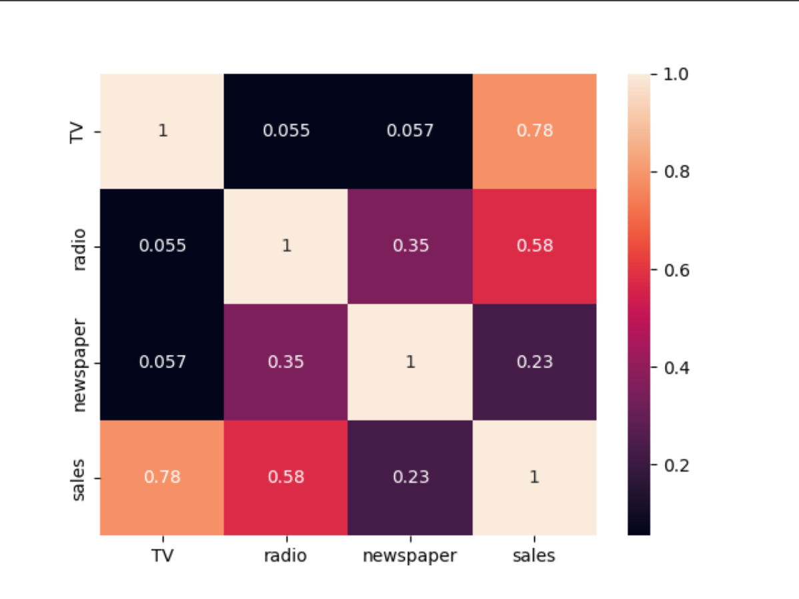

## 一元线性回归

一元线性回归是分析只有一个自变量（自变量x 和 因变量y）线性相关关系的方法，是计算机领域中最为简单的预测模型，也是最重要的基础。一元线性回归的公式为：
$$
f(x)=y=ax+b
\\
a 代表权重（也称 斜率）；b 代表偏置bias（即x为0时，在y轴上的截距）
$$
一元线性回归的核心目的，就是求解 a 和 b 的值，确定这两个值之后，就可以预测下一个x多对应的y值


### 提出问题

根据比萨斜塔的倾斜度历史数据，预测未来的倾斜度。

| 年份   | 75   | 76   | 77   | 78   | 79   | 80   | 81   | 82   | 83   | 84   | 85   | 86   | 87   |
| :----- | ---- | ---- | ---- | :--- | ---- | ---- | ---- | ---- | ---- | ---- | ---- | ---- | ---- |
| 倾斜度 | 640  | 645  | 660  | 661  | 673  | 688  | 696  | 710  | 726  | 727  | 740  | 742  | 757  |

我们使用`matplotlob`库，绘制一个散点图，观察一些倾斜度和年份之间的关系。

代码：

```python
import matplotlib.pyplot as plt

x = [75, 76, 77, 78, 79, 80, 81, 82, 83, 84, 85, 86, 87]
y = [640, 645, 660, 661, 673, 688, 696, 710, 726, 727, 740, 742, 757]

plt.scatter(x, y)
plt.show()
```

散点图：


从图中可以看出，倾斜度的变化比较接近于一条直线，但并非直线。所以，想要预测88年的倾斜度，就可以使用一元线性回归进行处理。


### 方差和标准差

对于一组数据来说，方差是将各个变量与其均值的差求平方后再求和的平均数。它反映了样本中各个观测点到其均值的平均离散程度。

方差（Variance）的公式如下：

$$
\sigma^2 = \frac{1}{N} \sum_{i=1}^{N} (X_i - \mu)^2
\\
其中：
\sigma^2 表示方差，N 是样本的总数，X_i 是第 i 个数据点的值，\mu 是总体的均值（计算公式：\mu = \frac{1}{N} \sum_{i=1}^{N} X_i）
$$

标准差（Standard Deviation），是在方差的基础上开根，公示如下：
$$
\sigma = \sqrt{\frac{1}{N} \sum_{i=1}^{N} (X_i - \mu)^2}
\\
其中：
\sigma 表示标准差，N 是样本的总数，X_i 是第 i 个数据点的值，\mu 是总体的均值（计算公式：\mu = \frac{1}{N} \sum_{i=1}^{N} X_i）
$$
我们使用numpy来计算一下比萨斜塔倾斜度的方差与标准差：

```python
import numpy as np
import matplotlib.pyplot as plt

x = np.array([75, 76, 77, 78, 79, 80, 81, 82, 83, 84, 85, 86, 87])
y = np.array([640, 645, 660, 661, 673, 688, 696, 710, 726, 727, 740, 742, 757])

# 方差
print(np.var(y))  # 1435.2899408284025

# 标准差
print(np.std(y))  # 37.885220612112086
```


标准差越小，说明各个数据的差异越小（比如极端情况下，所有观测值相等，那么方差和标准差都为0），反之则差异越大。那么如何评估 37.885 在样本中的差异大小呢，可以用 标准差/样本平均值 ，比例越小，差异越小：

```python
import numpy as np
import matplotlib.pyplot as plt

x = np.array([75, 76, 77, 78, 79, 80, 81, 82, 83, 84, 85, 86, 87])
y = np.array([640, 645, 660, 661, 673, 688, 696, 710, 726, 727, 740, 742, 757])

# 5.4% 算是相对比较小的差异
print(np.std(y) / np.mean(y))  # 0.05433070799310062
```


### 相关系数

相关系数（r）显示了一个线性关系的强度和方向（正或负）。当两个变量之间呈现正相关时，r 为正数；当两个变量之间呈负相关时，r 也为负数。如果数据点正好描述了一条直线，r 等于 1 或 -1；如果数据点完全没有相关关系时，r 等于零。如果某组数据的相关系数相当低（0.5>r>-0.5），那么线性回归可能不会给我们带来非常可信的结果，只有当 r>0.5 或 r < -0.5 时，才值得做线性回归。


相关系数 r 的公式为：
$$
r = \frac{\sum_{i=1}^{n} (x_i - \overline{x})*(y_i - \overline{y})}{\sqrt{\sum_{i=1}^{n} (x_i - \overline{x})^2 * \sum_{i=1}^{n} (y_i - \overline{y})^2}}
\\
* 带上划线的变量表示样本平均值 *
$$
当前问题中，年份数据为自变量x，倾斜度为因变量y，将前面的数据带入计算得到 r = 0.99468。

下面使用numpy在计算一次，验证是否正确：

```python
import numpy as np
import matplotlib.pyplot as plt

x = np.array([75, 76, 77, 78, 79, 80, 81, 82, 83, 84, 85, 86, 87])
y = np.array([640, 645, 660, 661, 673, 688, 696, 710, 726, 727, 740, 742, 757])

print(np.corrcoef(x, y))
"""
[[1.         0.99468433]
 [0.99468433 1.        ]]
"""
"""
返回一个二维数组
第一个子数组两个值分别是 x和x 的相关系数，x和y的相关系数
第二个子数组两个值分别是 y和x 的相关系数，y和y的相关系数
"""

# x和y的相关系数
r = np.corrcoef(x, y)[0, 1]

print(r)  # 0.994684325465011
```

从相关系数 r 的值可以看出，当前的数据样本，是非常适合使用线性回归来预测结果的。


### 最小二乘法

截止目前，我们使用标准差评估了样本的离散程度很小，使用相关系数分析了样本线性相关程度很高。但还是没有求出 a、b 的值。我们希望找到一个数字 a 和 b，使得绘制出的一条直线与倾斜度的点的距离越小越好，即满足以下公式：
$$
d_i=\sum_{i=1}^{n}(y_i-\hat{y_i})^2
\\
y_i表示年份对应的倾斜度;\hat{y_i}表示绘制的直线在所在年份的值
$$
当`di`的值最小时，就是最小二乘法。最小二乘法的公式为（S 表示 标准差）：
$$
a=r*\frac{S_y}{S_x}
\\
b=\overline{y}-a*\overline{x}
$$
使用python代码来计算 a 和 b 的值：

```python
import numpy as np
import matplotlib.pyplot as plt

x = np.array([75, 76, 77, 78, 79, 80, 81, 82, 83, 84, 85, 86, 87])
y = np.array([640, 645, 660, 661, 673, 688, 696, 710, 726, 727, 740, 742, 757])

# x和y的相关系数
r = np.corrcoef(x, y)[0, 1]

# y的标准差、平均值
Sy = np.std(y)
My = np.mean(y)

# x的标准差、平均值
Sx = np.std(x)
Mx = np.mean(x)

# 得出 a b 的值
a = r * (Sy / Sx)
b = My - a * Mx

print(a)  # 10.071428571428571
print(b)  # -118.47802197802196
```

截取小数后两位，得出一元线性回归函数：
$$
y=10.07*x-118.48
$$
由此可以预测出88年比萨斜塔的倾斜度为：
$$
y=10.07*88-118.48=767.68
$$
基于求得a、b值，也可以把散点图和直线图都会指出来，来直观的感受一下。

代码：

```python
import numpy as np
import matplotlib.pyplot as plt

x = np.array([75, 76, 77, 78, 79, 80, 81, 82, 83, 84, 85, 86, 87])
y = np.array([640, 645, 660, 661, 673, 688, 696, 710, 726, 727, 740, 742, 757])

plt.scatter(x, y)
plt.plot(x, 10.07*x-118.48, color="red")
plt.show()
```

绘制图：


### SKLearn 求解

上面我们使用最小二乘法的公式，直接计算出了函数的 斜率 和 偏置，我们也可以直接使用 SKLearn 机器学习库来完成线性回归函数的拟合。

```python
import numpy as np

from sklearn.linear_model import LinearRegression
from sklearn.model_selection import train_test_split

# 使用模型训练时，要求数据是二维的，因此这里转为 13行1列 的数据
x = np.array([75, 76, 77, 78, 79, 80, 81, 82, 83, 84, 85, 86, 87]).reshape(-1, 1)
y = np.array([640, 645, 660, 661, 673, 688, 696, 710, 726, 727, 740, 742, 757]).reshape(-1, 1)

# 准备训练集和测试集。test_size 表示测试集占整个数据集的比例
x_train, x_test, y_train, y_test = train_test_split(x, y, test_size=0.2)

# 训练模型
model = LinearRegression()
model.fit(x_train, y_train)

# 输出斜率和偏置
print(model.coef_)  # [[10.0244898]]
print(model.intercept_)  # [-114.99591837]

# 使用测试集计算准确率
print(model.score(x_test, y_test))  # 0.995850645830478

# 预测88年的数据。预测数据维度要和训练数据保持一致
print(model.predict(np.array([[88]])))  # [[767.15918367]]
```

分析：

1. 最终预测结果，与直接使用最小二乘法有一点偏差
2. 拟合出的 斜率 和 偏置 也和最小二乘法有一些差距，是因为我们使用的训练数据集其实并不是全部数据，有20%留作测试集了，如果直接适用所有数据拟合，最终预测出的结果和最小二乘法的没差别


## 一元线性回归实战

### 数据准备

这里准备了一个数据文件`advertising.csv`，里面有三个广告商的投入资金数据和一个销售额的数据。至于数据具体什么含义并不重要，主要是看广告投入和销售额之间的关系。下面打印数据的前五行看看。

```python
import pandas as pd

ad = pd.read_csv("./data/advertising.csv")
print(ad.head(5))

"""
      TV  radio  newspaper  sales
0  230.1   37.8       69.2   22.1
1   44.5   39.3       45.1   10.4
2   17.2   45.9       69.3    9.3
3  151.5   41.3       58.5   18.5
4  180.8   10.8       58.4   12.9
"""
```

我们也可以使用matplotlib库中的热力图来直观的看一下个广告和销售额的相关系数，相关系数越高，则越适合使用线性回归。

```python
import pandas as pd
import matplotlib.pyplot as plt
import seaborn as sb

ad = pd.read_csv("./data/advertising.csv")

# ad.corr() 是获取各数据之间的相关系数
# annot 表示打印数字
sb.heatmap(ad.corr(), annot=True)
plt.show()
```



可以看到TV和sales的相关系数是最高的。我们也可以使用seaborn来绘制一下散点图：

```python
import pandas as pd
import matplotlib.pyplot as plt
import seaborn as sb

ad = pd.read_csv("./data/advertising.csv")

sb.pairplot(ad, x_vars=["TV", "radio", "newspaper"], y_vars=["sales"])
plt.show()
```


可以看出，TV与sales的线性关系更明显，呈正相关，使用线性回归的拟合度也会更高。


### 数据处理

1. 数据集清洗和规范

   通过前面相关系数的分析之后，明显TV和sales的相关度更高，为了简化模型，此处先忽略radio和newspaper，把多变量回归变成单变量回归。另外，机器学习读取的训练数据必须是2D张量，因此需要把原一维数据转成二维。

   ```python
   import pandas as pd
   import numpy as np
   
   ad = pd.read_csv("./data/advertising.csv")
   
   x = np.array(ad["TV"]).reshape((-1, 1))
   y = np.array(ad["sales"]).reshape((-1, 1))
   ```

2. 拆分数据集

   机器学习建模的过程中，至少需要训练集和测试集两部分数据，因此需要把数据集拆成这两部分。

   ```python
   import pandas as pd
   import numpy as np
   
   from sklearn.model_selection import train_test_split
   
   ad = pd.read_csv("./data/advertising.csv")
   
   x = np.array(ad["TV"]).reshape((-1, 1))
   y = np.array(ad["sales"]).reshape((-1, 1))
   
   x_train, x_test, y_train, y_test = train_test_split(x, y, test_size=0.2, random_state=0)
   ```

3. 数据归一化（标准化）

   特征缩放对于机器学习特别重要。归一化就是按比例的线性缩放，数据分布不变，但是都落入一个小的区间，如 0到1 或 -1到1，归一化有很多手段，下面的公式是Min-Max标准化：
   $$
   x^{\prime}=\frac{x-minA}{maxA-minA}
   $$
   通过这个公式就可以把样本的值变到0-1的区间之内。

   ```python
   import pandas as pd
   import numpy as np
   
   from sklearn.model_selection import train_test_split
   
   
   def normalization(samples: np.ndarray):
       min = samples.min(axis=0)
       max = samples.max(axis=0)
   
       gap = max - min
       samples -= min
       samples /= gap
   
       return samples
   
   
   ad = pd.read_csv("./data/advertising.csv")
   
   x = normalization(np.array(ad["TV"])).reshape((-1, 1))
   y = normalization(np.array(ad["sales"])).reshape((-1, 1))
   
   x_train, x_test, y_train, y_test = train_test_split(x, y, test_size=0.2, random_state=0)
   ```
   
   

### 损失函数

根据前面的分析，我们现在需要确定一个最简单的一元线性回归模型：`y = wx + b`，在模型没有正式确定之前，我们只能称该函数为假设函数。由于我们有160个训练样本，因此在模型训练时会有160个函数（把x,y带进去），那么此时，如何来评估哪个函数更好呢？这就需要引入 损失(loss)函数 ，也就是目标损失最小，如果模型完全正正确，则损失为0。我们通常用 j(θ) 或 L(w, b) 来表示损失函数，也就是说损失函数不处理 x和y的关系，只处理 w和b 的关系。

在计算损失函数时，由于只关心w和b两个参数，而不再关心x和y的值（x为TV广告费，y为销售额），所以在求解损失函数时，把w和b看做变量，而把x和y看做定值（样本中的数据）。

机器学习的过程，就是不断动态调整w和b来使平均损失最小，对应得到的w和b就是最优解。计算损失的函数有很多种，此处使用：均方误差函数。

1. 对一个样本，其预测值和真实值的差值为`(y'-y)`，而`y'=wx+b`，所以损失值和参数 w、b 相关

2. 由于`(y'-y)`有可能是负数，因此将其平方一下变为正数，此时叫平方损失

3. 然后，把所有样本的平方损失相加，再根据样本数量求平均值，则得到一个损失函数为：
   $$
   MSE(Mean\quad Squared\quad Error)=\frac{\sum_{i=1}^{n}(y^{\prime}-y)^2}{n}
   $$
   也可以写为:
   $$
   MSE=L(w,b)=\frac{1}{2N}\sum_{(x,y)\in{D}}{((wx+b)-y)^2}
   \\
   (x,y)\in{D} 表示x和y都属于数据集D；这里分母是2N，对于损失来说不重要，这里是均方差，求导时系数会是2的倍数，所以除以2
   $$
   之所以要平方，是为了计算绝对距离，否则大量的`(y'-y)`求和可能导致分子为0，也就导致损失为0，这显然是不合理的。为了得到 均方差误差函数 的最小值，我们就可以通过 均方差误差函数 的 导函数，当 导函数为0时，就可能得到原函数的最小值。

下面基于python来实现一下损失函数的逻辑：

```python
def loss(x, y, w, b):
    y_predict = w * x + b
    diff = y_predict - y
    mse = np.sum(diff ** 2) / len(diff)

    return mse


# 使用前面归一化后的数据
# 下面随便给两组数据（w, b）来看看损失的大小
# 可以看到第二个比第一个损失更小
print(loss(x, y, 5, 2))  # 17.558419843096484
print(loss(x, y, 0.3, 0.5))  # 0.04708791903566015
```


### 梯度下降

梯度下降的两个关键问题是：

1. 往哪个方向改变参数才是正确的方向；
2. 在什么时候找到最低点能停止训练。

使用梯度下降，就要确定训练的梯度和学习速率，它们来决定参数调整的方向和步进。要注意，此时w和b才是变量，x和y是常量

#### 计算梯度

计算梯度就是对前面的损失函数进行求导，那么权重(w)的梯度函数为（此时直接忽略b）：
$$
grad_w = \frac{\Delta{L(w)}}{\Delta{w}} =\frac{\Delta{\sum_{(x,y)\in{D}}(wx-y)^2}}{\Delta(w)2N}=\frac{\Delta{\sum_{(x,y)\in{D}}((wx)^2-2wxy-y^2)}}{\Delta(w)2N}
\\
\Delta 表示变化量；\Delta(w)就表示w自身的变化量；公式中的其他部分就是w变化后对应损失函数的变化量
$$
简化公式得到权重的梯度函数：
$$
grad_w=\frac{\sum_{i=1}^{n}(2w*x_i^2-2x_iy_i)}{2N}=\frac{\sum_{i=1}^{n}(w*x_i-y_i)*x_i}{N}
$$
对于偏置(b)用同样方法也可求得对应的梯度函数，下面用代码来计算一下 w 和 b 的梯度：

```python
def gradient(x, y, w, b):
    y_predict = w * x + b  # 预测值
    loss = y_predict - y  # 损失

    # grad_w
    grad_w = np.sum(loss * x) / len(x)

    # grad_b
    grad_b = np.sum(loss) / len(x)

    print(grad_w, grad_b)


# w、b 的初始值不一样，对应的梯度也是有差异的
gradient(x, y, 5, 2)  # 2.3453669692242234 3.9854348349971644
gradient(x, y, 0.3, 0.5)  # 0.05763005393668761 0.15939577513919992
```


#### 计算w和b

前面计算梯度，是对损失函数求导，解决了往哪个方向走的问题（我们的目标是找到损失函数的最小值，理想情况就是梯度为0时损失函数的值），如果梯度值为正，则损失还在增加，参数就应该减少；否则就该增加。接下来还要解决学习速率的问题，也就是确定了w、b变大还是变小之后，到底变大或变小多少的幅度问题。

学习速率属于超参，由用户自己定义，那么w下次取值则有下面的公式决定：

> 超参是指可由用户干预的参数，内参是指用户不能干预的训练参数

$$
w=w-\alpha*grad_w
$$

下面按照标准流程，使用代码来完成对w、b参数的值：

```python
import numpy as np
import pandas as pd
import matplotlib.pyplot as plt

from sklearn.model_selection import train_test_split


def normalization(samples: np.ndarray):
    """
    归一化
    """
    # axis 有三个取值
    # 0 表示沿x轴运算，即一列一列的算；1 表示沿y轴运算，即一行一行的算
    min = samples.min(axis=0)
    max = samples.max(axis=0)

    gap = max - min
    samples -= min
    samples /= gap

    return samples


def mse(x, y, w, b):
    """
    均方损失函数
    """
    y_predict = w * x + b  # 预测值
    loss = y_predict - y  # 损失
    return np.sum(loss ** 2) / len(x)


def train(x, y, lr, loop):
    """
    lr: 学习速率
    loop: 训练次数
    """
    # w、b 的初始值不重要，随着训练的推进，会自动往目标值靠近
    w = 1
    b = 1

    # 记录过程中的损失及参数
    looses = np.zeros(loop)
    weights = np.zeros(loop)
    biases = np.zeros(loop)

    for i in range(loop):
        y_predict = w * x + b  # 预测值
        loss = y_predict - y  # 损失
        grad_w = np.sum(loss * x) / len(x)  # grad_w
        grad_b = np.sum(loss) / len(x)  # grad_b

        # 下面参数为什么是减？
        # 梯度是损失函数的导函数，导函数值为正，说明损失函数单调递增，目标是找损失函数的最小值，所以此时要把参数调小，就得减
        # 同理，若导函数值为负，则损失函数单调递减，此时就继续增大参数去获取更小的值，那么减去负数，也就是调大参数了
        w = w - lr * grad_w
        b = b - lr * grad_b

        cost = mse(x, y, w, b)

        looses[i] = cost
        weights[i] = w
        biases[i] = b

    return looses, weights, biases


if __name__ == '__main__':
    ad = pd.read_csv("./data/advertising.csv")
    x = normalization(np.array(ad["TV"])).reshape((-1, 1))
    y = normalization(np.array(ad["sales"])).reshape((-1, 1))

    x_train, x_test, y_train, y_test = train_test_split(x, y, test_size=0.2, random_state=0)

    # 学习速率和训练次数都时用户自己定的
    looses, weights, biases = train(x_train, y_train, lr=0.1, loop=200)

    # 绘制损失值的取值
    plt.plot(looses)
    plt.show()
    
    # 打印最终的w和b
    print(weights[-1], biases[-1])  # 0.5451576452320044 0.2202118847016362
```

损失变化趋势，损失逐渐减小并趋于平稳，并趋近于0：


#### SKLearn拟合

上面使用原生代码模拟训练过程，拟合出了一个w和b的值，下面使用SKLearn来拟合一下，看下得到的参数和我们自己算出来的差距。

```python
import numpy as np
import pandas as pd
import matplotlib.pyplot as plt

from sklearn.model_selection import train_test_split
from sklearn.linear_model import LinearRegression
from sklearn.preprocessing import MinMaxScaler


if __name__ == '__main__':
    ad = pd.read_csv("./data/advertising.csv")
    x = np.array(ad["TV"]).reshape((-1, 1))
    y = np.array(ad["sales"]).reshape((-1, 1))

    # 使用sklearn完成数据的归一化处理
    scaler = MinMaxScaler()
    x = scaler.fit_transform(x)
    y = scaler.fit_transform(y)

    x_train, x_test, y_train, y_test = train_test_split(x, y, test_size=0.2, random_state=0)

    # 拟合
    model = LinearRegression()
    model.fit(x_train, y_train)

    # 输出斜率和偏置
    print(model.coef_)  # [[0.53561037]]
    print(model.intercept_)  # [0.22538186]
```

可以看到，使用SKLearn拟合出的参数和我们自己算出来的差距很小，还是很接近的。


### 预测结果

在预测结果之前，要说明的一点是，训练数据是经过归一化处理的，也就意味着预测值也需要先进行归一化处理，然后会得到一个预测值，此时的预测试还需要进行逆向归一化后，才是真实的预测值。

归一化公式:
$$
x^{\prime}=\frac{x-minA}{maxA-minA}
$$
上面公式中的x，和数据集中的x,y是两回事，数据集的因变量(y)和自变量(x)都是用上述公式进行归一化。因此对于预测结果，把上面的公式变形一下就可得到逆向归一化的公式:
$$
y=y^{\prime}*(Max-Min)+Min
\\
y^{\prime}表示预测结果，是一个0-1之间的值；y表示真实的预测值。Max、Min则是训练集中销售额的最大最小值
$$
下面使用代码来预测 TV广告费(x=300)时，销售额（y）是多少。

```python
import numpy as np
import pandas as pd


def scale(data_set: np.ndarray, val: int):
    """
    基于数据集把val做归一化处理
    """
    max = np.max(data_set)
    min = np.min(data_set)

    return (val - min) / (max - min)


if __name__ == '__main__':
    ad = pd.read_csv("./data/advertising.csv")
    x = np.array(ad["TV"]).reshape((-1, 1))
    y = np.array(ad["sales"]).reshape((-1, 1))

    # 归一化预测值
    x_predict = 300
    x_predict = scale(x, x_predict)

    # 预测结果，此处w和b使用我们自己计算出来的结果
    y_predict = 0.545 * x_predict + 0.22

    # 此时的 y_predict 也应该是处于 0-1 之间的值
    print(y_predict)  # 0.7716351031450794

    # 逆向归一化
    y_real = y_predict * (np.max(y) - np.min(y)) + np.min(y)

    # 真实的预测结果
    print(y_real)  # 21.19953161988502
```


## 多元线性回归

### 公式推导

基于一元线性回归，当自变量有多个时就称为多元线性回归，此时我们需要求解的参数也会变为多个，如：
$$
y=w_1x_1+w_2x_2+...w_nx_n+b
$$
其中
$$
w_1x_1+w_2x_2+...w_nx_n
$$
可以看做是两个一维矩阵相乘，即：
$$
\begin{bmatrix}x_1&x_2& ... &x_n\end{bmatrix}*\begin{bmatrix}w_1\\w_2\\...\\w_n\end{bmatrix}
$$
但此时还是有一些差别，即转换成n维向量来看的话，自变量部分应该是一个1行n列的数据，权重参数则必须是n行1列的数据，和前面的公式还是有些区别，公式中是两个1行n列的一维向量相乘的结果，又考虑到自变量应该是有很多样本，像下面这样：
$$
\begin{bmatrix}x_{11}&x_{12}& ... &x_{1n}\\x_{21}&x_{22}& ... &x_{2n}\\...&...& ... &...\\x_{m1}&x_{m2}& ... &x_{mn}\end{bmatrix}
$$
所以我们选择把权重参数转置，方便与自变量相乘，那么公式就可以简写为：
$$
y=W^TX+b
$$
其实上述公式中，其实还可以把b看作是权重w0，并引入x0：
$$
y=W^TX+w_0x_0
$$
这个x0相当于给数据集新增加了一个哑特征，值固定为1。那么公式可以直接写成：
$$
y=W^TX
$$

### 数据处理

在一元线性回归中使用的数据集还有两列是没有使用的，此处仍然使用`advertising.csv`。

```python
    ad = pd.read_csv("./data/advertising.csv")

    # 多元线性回归时需要获取三列
    X = ad[["TV", "radio", "newspaper"]]
    x = np.array(X)  # X本身就是二维数组，所以此处就不需要切换形状了
    y = np.array(ad["sales"]).reshape((-1, 1))  # 获取的单列是一维数组，所以要转一下形状

    # 归一化处理
    x = normalization(X)
    y = normalization(y)

    # 在自变量后面新增一列，值为1
    col = np.ones((len(x), 1))
    x = np.append(x, col, axis=1)  # 为每一行加一个值，所以axis要为1

    # 拆分训练集和测试集
    x_train, x_test, y_train, y_test = train_test_split(x, y, test_size=0.2)
```


### 计算权重

多元线性回归时，整体逻辑与一元线性回归相似，但是要注意在计算损失和梯度的过程中，要处理好数组形状问题。

```python
import numpy as np
import pandas as pd
import matplotlib.pyplot as plt

from sklearn.model_selection import train_test_split


def normalization(samples: np.ndarray):
    """
    归一化
    """
    # axis=0表示一列一列的运算
    min = samples.min(axis=0)  # 这里算出来就是一个三个元素的一维数组
    max = samples.max(axis=0)

    gap = max - min
    samples -= min
    samples /= gap

    return samples


def mse(x, y, w):
    """
    均方损失函数
    """
    y_predict = x.dot(w.T)
    loss = y_predict - y  # 损失
    return np.sum(loss ** 2) / len(x)


def train(x, y, lr, loop):
    """
    lr: 学习速率
    loop: 训练次数
    """
    # w 的初始值不重要，但我们要保证个数和自变量的个数一致
    w = np.ones((1, x.shape[1]))

    # 记录过程中的损失及参数
    looses = np.zeros(loop)
    weights = np.zeros((loop, x.shape[1]))  # 每一次的存储的权重参数也应该是和自变量个数一样的一组数据

    for i in range(loop):
        y_predict = x.dot(w.T)  # 此时的x是多维数组，不能像以为那样直接相乘，要使用矩阵乘法。为了完成计算把w转置一下，把行数转为x的列数
        loss = y_predict - y  # 损失
        grad_w = x.T.dot(loss) / len(x)  # 此处为了进行运算，需要将自变量列数转为loss的行数

        w = w - lr * grad_w.T  # 权重的梯度此时形状和w对不上，要转一下
        cost = mse(x, y, w)

        looses[i] = cost
        weights[i] = w

    return looses, weights


if __name__ == '__main__':
    ad = pd.read_csv("./data/advertising.csv")

    # 多元线性回归时需要获取三列
    X = ad[["TV", "radio", "newspaper"]]
    x = np.array(X)  # X本身就是二维数组，所以此处就不需要切换形状了
    y = np.array(ad["sales"]).reshape((-1, 1))  # 获取的单列是一维数组，所以要转一下形状

    # 归一化处理
    x = normalization(X)
    y = normalization(y)

    # 在自变量后面新增一列，值为1
    col = np.ones((len(x), 1))
    x = np.append(x, col, axis=1)  # 为每一行加一个值，所以axis要为1

    # 拆分训练集和测试集
    # random_state = 0 表示不随机，因为要对比自写算法和sklearn的差别，必然要保证样本一致
    x_train, x_test, y_train, y_test = train_test_split(x, y, test_size=0.2, random_state=0)

    # 训练
    looses, weights = train(x_train, y_train, 0.5, 500)

    # 打印训练到最后的权重参数
    print(weights[-1])  # [ 0.5190081   0.38359315 -0.01202972  0.05607036]  最后一个就是偏置

    # 绘制损失趋势
    plt.plot(looses)
    plt.show()
```


### SKLearn拟合

需要注意的是，使用SKLearn库时，不需要处理偏置b了，他会自动计算这个值。

```python
    ad = pd.read_csv("./data/advertising.csv")

    # 多元线性回归时需要获取三列
    X = ad[["TV", "radio", "newspaper"]]
    x = np.array(X)  # X本身就是二维数组，所以此处就不需要切换形状了
    y = np.array(ad["sales"]).reshape((-1, 1))  # 获取的单列是一维数组，所以要转一下形状

    # 归一化处理
    x = normalization(X)
    y = normalization(y)

    # 拆分训练集和测试集
    # random_state = 0 表示不随机，因为要对比自写算法和sklearn的差别，必然要保证样本一致
    x_train, x_test, y_train, y_test = train_test_split(x, y, test_size=0.2, random_state=0)

    # sklearn 拟合
    model = LinearRegression()
    model.fit(x_train, y_train)

    # 测试一下准确度
    print(model.score(x_test, y_test))  # 0.8601145185017868

    # 权重集偏置
    print(model.coef_)  # [[ 0.51903523  0.38371074 -0.01245088]]
    print(model.intercept_)  # [0.05611289]
```

对比前面自写算法计算出来权重和偏置，可以发现误差很小，说明我们自写算法逻辑思路没问题是正确的。


### 预测与逆向缩放


