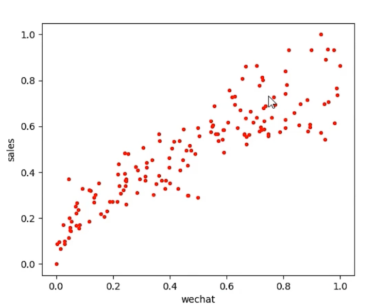
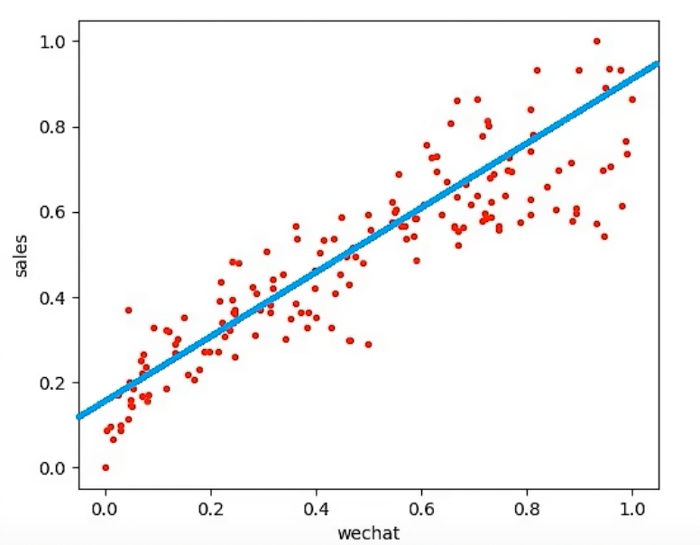
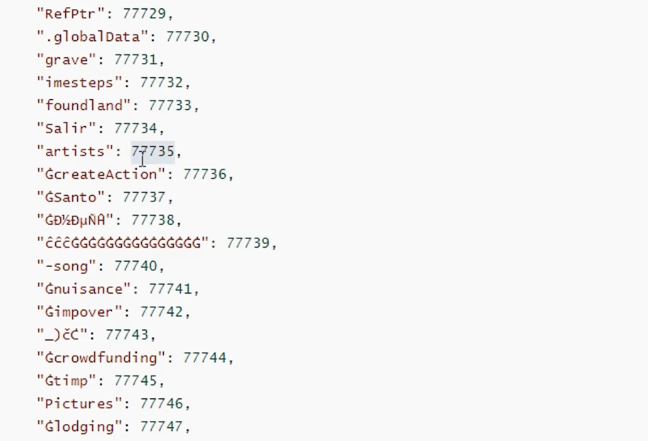
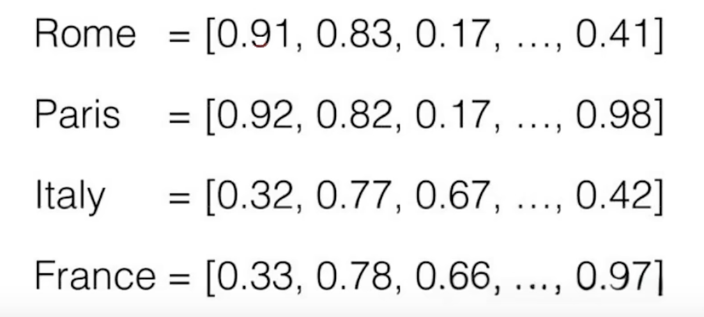
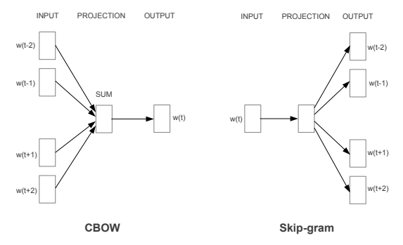
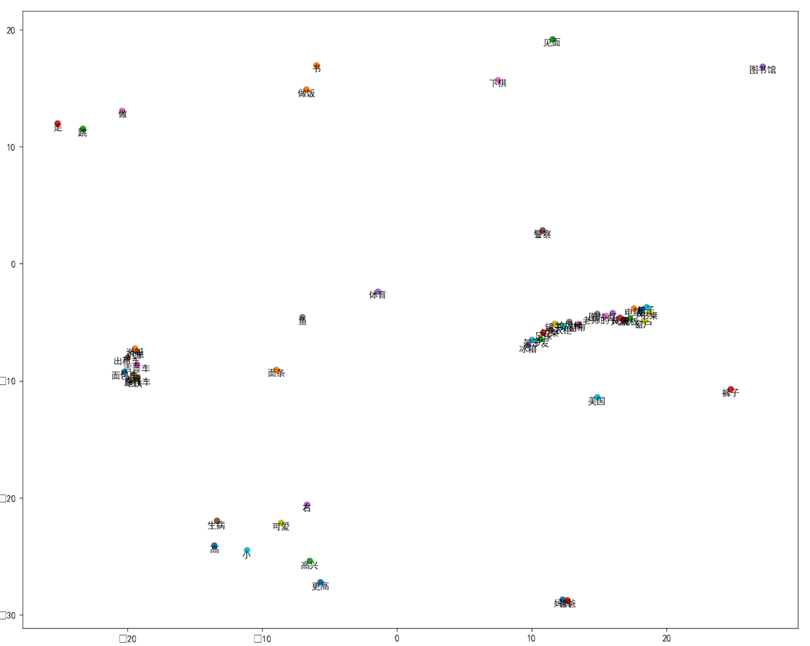

## AI基础常识

### 编码与运算

在AI领域，不论是传统AI还是大模型，其本质就是对计算机可以支持的数据进行数值化处理。目前计算机能够处理的数据主要可以分为：数字、文字、图片、音频、视频，而无论哪一种数据最终都要转换为计算机能够运算的数值。


**1. 为什么必须是数值**

在统计学和数学领域，最简单的预测公式为一元线性回归：y=wx+b，即根据历史数据的x和y，来拟合出一个相对均衡的w和b的参数（也叫权重），比如拟合出 y=5x+3，就可以根据x的值来预测y的值，这是AI领域最简单基础的一个公式。



上图中，红点对应的就是X和Y的分布，这叫训练样本（有x和y的值），进而拟合出差异最小的w和b的值，于是得到一条直线函数：y=0.66x+0.17 ，于是，根据x的值就可以预测出y的值，如下图所示：



在计算机或者AI眼里，它并不认识文字、图片、语音这些东西，更不知道什么图片好看，在他眼里只有数值。因此所有的AI推理，均是一种基于 输入值 的 **预测值**，它可以简单到是前面示例的一元线性回归，也可以是是多元线性、非线性的回归预测。


**2. 数值如何运算**

针对数字来说，一般都需要进行**归一化处理**，让数字最终归于`0~1`或`-1~1`的区间，线面是最简单的归一化公式（可以归一化到`0~1`之间）：
$$
x^`=\frac{x-minA}{maxA-mixA}
$$
也可以将上述公式分子中的minA替换为meanA（集合平均值），可以得到`-1~1`的区间结果：
$$
x^`=\frac{x-meanA}{maxA-mixA}
$$


**3. 文字如何运算**

文字本身不是数字，计算机无法直接进行运算，则需要将其 **分词处理** 后转换为 **词向量**，才可以进行关联运算。


**4. 图片如何运算**

图片本身在计算机中存储的就是数字（RGB像素编码，0-255的颜色值），所以可以直接做归一化处理，即 当前颜色值/255 就可完成当前颜色值的归一化处理。

在图片归一化处理中，数值的取值范围是固定的0-255，处理起来很方便，但对于不确定取值范围的数值做归一化处理，则可以使用softmax归一化公式，其中e为自然对数，值为2.718：
$$
\sigma(\overrightarrow{Z})_i=\frac{e^{z_i}}{\sum^k_{j=1}e^{z_j}}
\\
z表示数据集；i、j都表示数据集的索引；\sum表示求和
$$
比如针对数据集[5, 7, 10]中的7，归一化结果为：
$$
\sigma([5, 7, 10])_2=\frac{e^7}{e^5 + e^7 + e^{10}}=0.047
$$


**5. 音频：** 音频在计算机内部是声道频率的采样数据，本身就是数字，所以处理起来也不复杂。

**6. 视频：** 视频是音频和图片，再加上时间帧的结合，所以编码方式是三者的共同处理。因此视频也是一种特殊的数据，称为：时序数据。


### 词向量

> 预训练好的中文词向量下载：https://github.com/Embedding/Chinese-Word-Vectors
>
> 本节需要使用的依赖安装：
>
> ```shell
> pip install -i https://pypi.tuna.tsinghua.edu.cn/simple/ gensim scikit-learn matplotlib
> ```
>

下图是Llama3大模型里面的文字编码格式（称为Token），也就是为每个词制定一个编号，用于表示这个词。文字编码是不能进行运算的，他只是一个字/词同一个编码的映射关系。




‌**词向量（Word Embedding）**‌是一种将词汇表示为实数向量的技术，通常位于一个高维向量空间中。每个单词通过一个高维向量来表示，向量的每一维都是一个实数。词向量的目标是将语义相似的单词映射到相邻的向量空间中，即距离越近的向量表示的单词之间的语义相似度越高。下面看一张图：



上图中的四个词都用一个向量集表示，**集合中向量的个数，就是表向量的维度，即一共有多少维**。图中的每一列就表示一个维度。

通常词向量的维度有很多，我们不需要在意每一个维度具体有什么含义。词向量的训练和生成依赖机器学习模型。


#### 词向量算法

将词汇转换成向量通常有两种算法，CBOW（Continuous Bag-of-Words）和 skip-gram，它们的最大区别是**skip-gram是通过中心词去预测中心词周围的词，而CBOW是通过周围的词去预测中心词。**



图中，两个模型都包含三层：输入层、投影层和输出层。CBOW算法是在已知当前词wt的上下文wt-2、wt-1、wt+1、wt+2的前提下预测当前词wt；而Skip-gram模型则恰恰相反，是在已知当前词wt的前提下预测其上下文wt-2、wt-1、wt+1、wt+2。


#### 训练词向量

对于词向量的训练，可以使用gensim库下提供的word2vec模型。

```python
# build_word2vec_model.py

from gensim.models import Word2Vec
from gensim.models.word2vec import LineSentence

# words.txt 是提前准备好的中文此文件
# 读取word.txt文件，生成一个迭代器，里面存放着按行分类的所有单词
sentences = LineSentence('words.txt')

# 使用该模型，参数解释如下：
# vector_size：每个单词用16维的词向量表示
# window：窗口大小为5，即通过当前单词能够预测其前两个和后两个单词
# min_count：单词频数最低要求，低于该数的都将被忽略，默认是5，这里因为数据集小就改成0
# workers：工作线程数，用4个线程
# epochs：迭代5000轮
# sg：1表示使用skip-gram
model = Word2Vec(sentences, vector_size=32, window=5, min_count=0, workers=4, epochs=5000, sg=1)

# 保存模型
model.save('word2vec.model')

# 保存词向量
model.wv.save_word2vec_format('word_vectors.txt', binary=False)
```


#### 使用词向量

使用事先准备好的训练集，训练得到一个词向量模型，那么就可以使用这个模型了。

```python
# use_word2vec_model.py

from gensim.models import Word2Vec, KeyedVectors

# 载入模型
model = Word2Vec.load('word2vec.model')

# 也可以直接载入词向量集，载入的结果与 model.wv 是相同的
# word_vectors = KeyedVectors.load_word2vec_format('word_vectors.txt', binary=False)

# wv下提供了很多工具方法，这里词向量按与传入的单词相似度从高到低排序
# 入参的词语必须是已经训练好的词向量
items = model.wv.most_similar('牛仔裤')
for i, item in enumerate(items):
    print(i, item[0], item[1])

"""
0 裙子 0.8598672747612
1 连衣裙 0.857318103313446
2 T恤 0.8247888684272766
3 袜子 0.804054856300354
4 鞋子 0.7899845838546753
5 衬衫 0.786575973033905
6 夹克 0.7647384405136108
7 毛衣 0.7385596632957458
8 雨衣 0.7254831194877625
9 裤子 0.702067494392395
"""

# 计算两个词的相似度
# 入参的词语必须是已经训练好的词向量模型中的词语，否则会报KeyError错误
print(model.wv.similarity('大象', '老虎'))  # 0.4494351
print(model.wv.similarity('感冒', '鸡蛋'))  # 0.46539328

# 获取所有词向量对应的标签名，其实就是对应的 字/词
print(model.wv.index_to_key)

# 获取所有词向量
print(model.wv[model.wv.index_to_key])

# 获取某个位置的词向量
print(model.wv[model.wv.index_to_key[0]])
```


#### 降维可视化

词向量通常是多维的，前面示例是32维，实际使用中基本都是成百上千维的，这样的数据想在我们这个三维世界中呈现出词与词之间的相关性非常困难，因此我们可以将词向量降维成二维向量，就可以放在平面图上展示了。

```python
# word_vector_visualization.py

from gensim.models import KeyedVectors
from sklearn.manifold import TSNE
import matplotlib.pyplot as plt

# 将数据降成2维，基于主成分分析算法，迭代5000次
tsne = TSNE(n_components=2, init='pca', n_iter=5000)

# 加载词向量
word_vectors = KeyedVectors.load_word2vec_format('word_vectors.txt', binary=False)

# 将词向量转成降维成二维向量
embed_two = tsne.fit_transform(word_vectors[word_vectors.index_to_key])

# 标签就是每个词向量对应的名字
labels = word_vectors.index_to_key

# 绘图
# 展示前50个词向量的二维分布
plt.figure(figsize=(15, 12), dpi=100)
for i, label in enumerate(labels[:50]):
    x, y = embed_two[i]

    # 绘制一个坐标点
    plt.scatter(x, y)

    # 坐标点添加标注
    plt.annotate(label, (x, y), ha='center', va='top')

# 显示中文标签
plt.rcParams['font.sans-serif'] = ['SimHei']
plt.rcParams['font.family'] = 'sans-serif'

# 保存图片
plt.savefig('word.png')
```

降维后绘制的词分布：




### 计算机视觉

> 本节需要使用依赖：
>
> ```shell
> pip install -i https://pypi.tuna.tsinghua.edu.cn/simple/ opencv-python
> ```

计算机视觉是一种用摄像机、电脑或其他设备对生物视觉的模拟。它的主要任务是让计算机理解图片或视频中的内容，就像人类和许多其他生物每天所做的那样。可将其分为三大经典任务：图像分类、目标检测、图像分割

- 图像分类（Classsification）：是指将图像结构化为某一类别的信息，用事先确定好的类别（category）来描述图片。
- 目标检测（Detection）：分类任务关心整体，给出的是整张图片的内容描述，而检测则关注特定的物体目标，要求同时获得这一目标的类别信息和位置信息（classification+localization）。
- 图像分割（Segmentation）：分割是对图像的像素级描述，它给每个像素赋予类别（实例）意义，适用于理解要求较高的场景，如无人驾驶中对道路和非道路的分割。

随着大模型的兴起，图像描述和图像生成也可以作为计算机视觉的一个新的领域分支来考虑。


针对一张图片，计算机又是如何进行运算的呢？我们可以使用OpenCV打开一张图，就可以看到图片的RGB色彩像素值。

```python
import cv2

# 读取一张图片
img = cv2.imread("kinghonor.jpeg")

# 打印这个图片，king是图片窗口的名字
cv2.imshow("king", img)

# 展示时间。入参是ms，下面表示展示2s后关闭窗口，然后继续执行脚本
cv2.waitKey(2000)

# 直接打印图片，就可以看到图片每个像素点对应的RGB色值。注意这里输出的结果色值顺序是：B G R
print(img)
"""
[[[121  60  34]
  [121  60  34]
  [119  60  34]
  ...
  [ 81  43  19]
  [ 81  43  19]
  [ 82  44  20]]
  ...
  [138  91  70]
  [139  92  71]
  [135  91  68]]]
"""

# 直接打印某个像素点的色值
print(img[1][10])  # [115  59  34]

# 将图片穿转成RGB色值打印
img_rgb = cv2.cvtColor(img, cv2.COLOR_BGR2RGB)
print(img_rgb)
```


#### 灰度化处理


#### 二值化处理


