## AI基础知识

### 编码与运算

在AI领域，不论是传统AI还是大模型，其本质就是对计算机可以支持的数据进行数值化处理。目前计算机能够处理的数据主要可以分为：数字、文字、图片、音频、视频，而无论哪一种数据最终都要转换为计算机能够运算的数值。


**1. 为什么必须是数值**

在统计学和数学领域，最简单的预测公式为一元线性回归：y=wx+b，即根据历史数据的x和y，来拟合出一个相对均衡的w和b的参数（也叫权重），比如拟合出 y=5x+3，就可以根据x的值来预测y的值，这是AI领域最简单基础的一个公式。

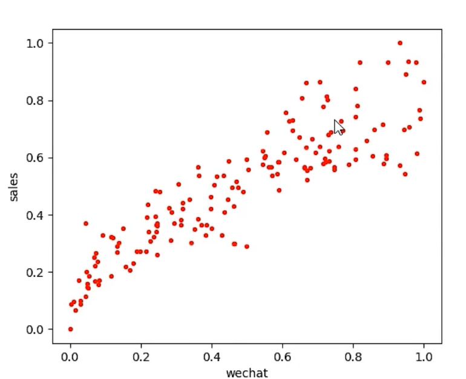

上图中，红点对应的就是X和Y的分布，这叫训练样本（有x和y的值），进而拟合出差异最小的w和b的值，于是得到一条直线函数：y=0.66x+0.17 ，于是，根据x的值就可以预测出y的值，如下图所示：

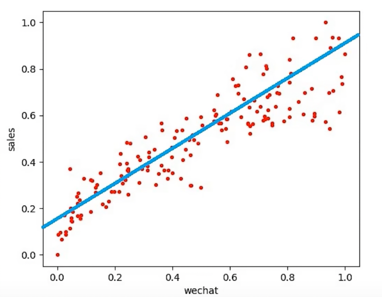

在计算机或者AI眼里，它并不认识文字、图片、语音这些东西，更不知道什么图片好看，在他眼里只有数值。因此所有的AI推理，均是一种基于 输入值 的 **预测值**，它可以简单到是前面示例的一元线性回归，也可以是是多元线性、非线性的回归预测。


**2. 数值如何运算**

针对数字来说，一般都需要进行**归一化处理**，让数字最终归于`0~1`或`-1~1`的区间，线面是最简单的归一化公式（可以归一化到`0~1`之间）：
$$
x^`=\frac{x-minA}{maxA-mixA}
$$
也可以将上述公式分子中的minA替换为meanA（集合平均值），可以得到`-1~1`的区间结果：
$$
x^`=\frac{x-meanA}{maxA-mixA}
$$


**3. 文字如何运算**

文字本身不是数字，计算机无法直接进行运算，则需要将其 **分词处理** 后转换为 **词向量**，才可以进行关联运算。


**4. 图片如何运算**

图片本身在计算机中存储的就是数字（RGB像素编码，0-255的颜色值），所以可以直接做归一化处理，即 当前颜色值/255 就可完成当前颜色值的归一化处理。

在图片归一化处理中，数值的取值范围是固定的0-255，处理起来很方便，但对于不确定取值范围的数值做归一化处理，则可以使用softmax归一化公式，其中e为自然对数，值为2.718：
$$
\sigma(\overrightarrow{Z})_i=\frac{e^{z_i}}{\sum^k_{j=1}e^{z_j}}
\\
z表示数据集；i、j都表示数据集的索引；\sum表示求和
$$
比如针对数据集[5, 7, 10]中的7，归一化结果为：
$$
\sigma([5, 7, 10])_2=\frac{e^7}{e^5 + e^7 + e^{10}}=0.047
$$


**5. 音频：** 音频在计算机内部是声道频率的采样数据，本身就是数字，所以处理起来也不复杂。

**6. 视频：** 视频是音频和图片，再加上时间帧的结合，所以编码方式是三者的共同处理。因此视频也是一种特殊的数据，称为：时序数据。


### 词向量

> 预训练好的中文词向量下载：https://github.com/Embedding/Chinese-Word-Vectors
>
> 本节需要使用的依赖安装：
>
> ```shell
> pip install -i https://pypi.tuna.tsinghua.edu.cn/simple/ gensim scikit-learn matplotlib
> ```
>

下图是Llama3大模型里面的文字编码格式（称为Token），也就是为每个词制定一个数值编号，用于表示这个词（标签值）。文字编码是不能进行距离运算的，但是使用数值来表示一个词更便于计算机运算。计算多个词之间的距离需要使用词向量。

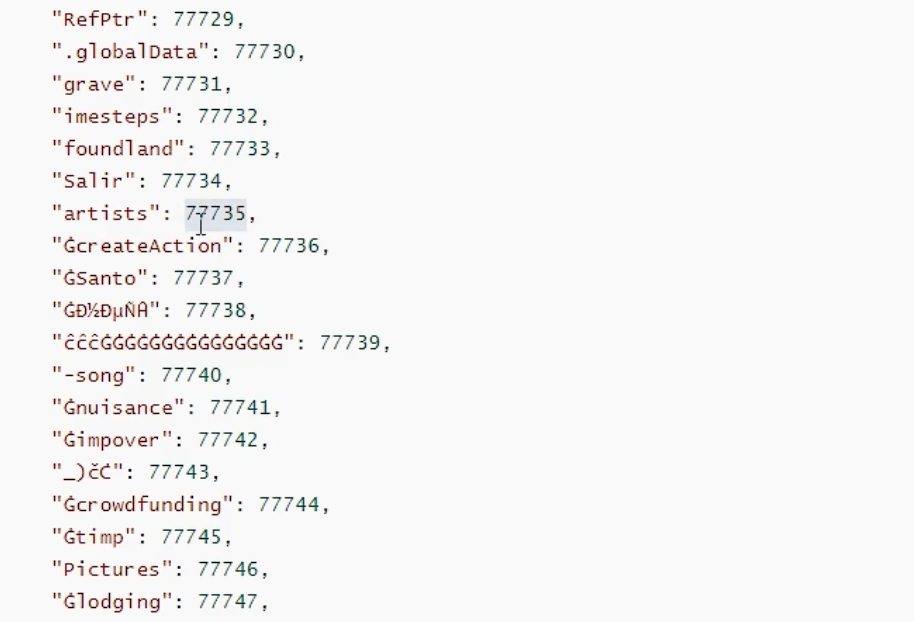


‌**词向量（Word Embedding）**‌是一种将词汇表示为实数向量的技术，通常位于一个高维向量空间中。每个单词通过一个高维向量来表示，向量的每一维都是一个实数。词向量的目标是将语义相似的单词映射到相邻的向量空间中，即距离越近的向量表示的单词之间的语义相似度越高。下面看一张图：

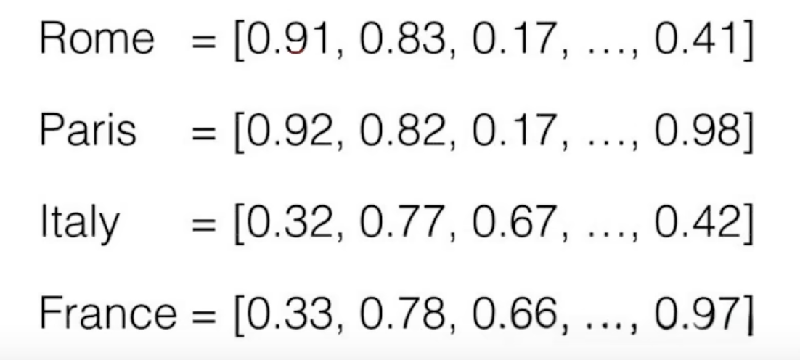

上图中的四个词都用一个向量集表示，**集合中向量的个数，就是表向量的维度，即一共有多少维**。图中的每一列就表示一个维度。

通常词向量的维度有很多，我们不需要在意每一个维度具体有什么含义。词向量的训练和生成依赖机器学习模型。


#### 词向量算法

将词汇转换成向量通常有两种算法，CBOW（Continuous Bag-of-Words）和 skip-gram，它们的最大区别是**skip-gram是通过中心词去预测中心词周围的词，而CBOW是通过周围的词去预测中心词。**


图中，两个模型都包含三层：输入层、投影层和输出层。CBOW算法是在已知当前词wt的上下文wt-2、wt-1、wt+1、wt+2的前提下预测当前词wt；而Skip-gram模型则恰恰相反，是在已知当前词wt的前提下预测其上下文wt-2、wt-1、wt+1、wt+2。


#### 训练词向量

对于词向量的训练，可以使用gensim库下提供的word2vec模型。

```python
# build_word2vec_model.py

from gensim.models import Word2Vec
from gensim.models.word2vec import LineSentence

# words.txt 是提前准备好的中文此文件
# 读取word.txt文件，生成一个迭代器，里面存放着按行分类的所有单词
sentences = LineSentence('words.txt')

# 使用该模型，参数解释如下：
# vector_size：每个单词用16维的词向量表示
# window：窗口大小为5，即通过当前单词能够预测其前两个和后两个单词
# min_count：单词频数最低要求，低于该数的都将被忽略，默认是5，这里因为数据集小就改成0
# workers：工作线程数，用4个线程
# epochs：迭代5000轮
# sg：1表示使用skip-gram
model = Word2Vec(sentences, vector_size=32, window=5, min_count=0, workers=4, epochs=5000, sg=1)

# 保存模型
model.save('word2vec.model')

# 保存词向量
model.wv.save_word2vec_format('word_vectors.txt', binary=False)
```


#### 使用词向量

使用事先准备好的训练集，训练得到一个词向量模型，那么就可以使用这个模型了。

```python
# use_word2vec_model.py

from gensim.models import Word2Vec, KeyedVectors

# 载入模型
model = Word2Vec.load('word2vec.model')

# 也可以直接载入词向量集，载入的结果与 model.wv 是相同的
# word_vectors = KeyedVectors.load_word2vec_format('word_vectors.txt', binary=False)

# wv下提供了很多工具方法，这里词向量按与传入的单词相似度从高到低排序
# 入参的词语必须是已经训练好的词向量
items = model.wv.most_similar('牛仔裤')
for i, item in enumerate(items):
    print(i, item[0], item[1])

"""
0 裙子 0.8598672747612
1 连衣裙 0.857318103313446
2 T恤 0.8247888684272766
3 袜子 0.804054856300354
4 鞋子 0.7899845838546753
5 衬衫 0.786575973033905
6 夹克 0.7647384405136108
7 毛衣 0.7385596632957458
8 雨衣 0.7254831194877625
9 裤子 0.702067494392395
"""

# 计算两个词的相似度
# 入参的词语必须是已经训练好的词向量模型中的词语，否则会报KeyError错误
print(model.wv.similarity('大象', '老虎'))  # 0.4494351
print(model.wv.similarity('感冒', '鸡蛋'))  # 0.46539328

# 获取所有词向量对应的标签名，其实就是对应的 字/词
print(model.wv.index_to_key)

# 获取所有词向量
print(model.wv[model.wv.index_to_key])

# 获取某个位置的词向量
print(model.wv[model.wv.index_to_key[0]])
```


#### 降维可视化

词向量通常是多维的，前面示例是32维，实际使用中基本都是成百上千维的，这样的数据想在我们这个三维世界中呈现出词与词之间的相关性非常困难，因此我们可以将词向量降维成二维向量，就可以放在平面图上展示了。

```python
# word_vector_visualization.py

from gensim.models import KeyedVectors
from sklearn.manifold import TSNE
import matplotlib.pyplot as plt

# 将数据降成2维，基于主成分分析算法，迭代5000次
tsne = TSNE(n_components=2, init='pca', n_iter=5000)

# 加载词向量
word_vectors = KeyedVectors.load_word2vec_format('word_vectors.txt', binary=False)

# 将词向量转成降维成二维向量
embed_two = tsne.fit_transform(word_vectors[word_vectors.index_to_key])

# 标签就是每个词向量对应的名字，对于词语的词向量来说，它的标签就是词语本身
labels = word_vectors.index_to_key

# 绘图
# 展示前50个词向量的二维分布
plt.figure(figsize=(15, 12), dpi=100)
for i, label in enumerate(labels[:50]):
    x, y = embed_two[i]

    # 绘制一个坐标点
    plt.scatter(x, y)

    # 坐标点添加标注
    plt.annotate(label, (x, y), ha='center', va='top')

# 显示中文标签
plt.rcParams['font.sans-serif'] = ['SimHei']
plt.rcParams['font.family'] = 'sans-serif'

# 保存图片
plt.savefig('word.png')
```

降维后绘制的词分布：

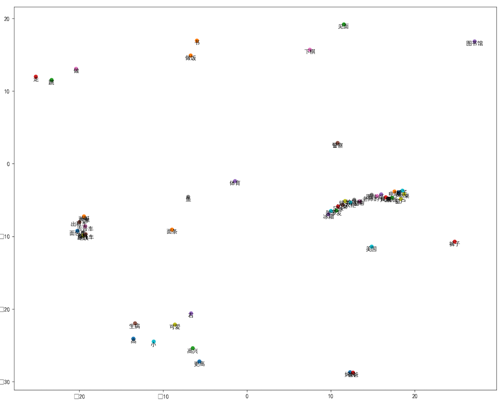


### 图片识别

> 本节需要使用依赖：
>
> ```shell
> pip install -i https://pypi.tuna.tsinghua.edu.cn/simple/ opencv-python
> ```

计算机视觉是一种用摄像机、电脑或其他设备对生物视觉的模拟。它的主要任务是让计算机理解图片或视频中的内容，就像人类和许多其他生物每天所做的那样。可将其分为三大经典任务：图像分类、目标检测、图像分割

- 图像分类（Classsification）：是指将图像结构化为某一类别的信息，用事先确定好的类别（category）来描述图片。
- 目标检测（Detection）：分类任务关心整体，给出的是整张图片的内容描述，而检测则关注特定的物体目标，要求同时获得这一目标的类别信息和位置信息（classification+localization）。
- 图像分割（Segmentation）：分割是对图像的像素级描述，它给每个像素赋予类别（实例）意义，适用于理解要求较高的场景，如无人驾驶中对道路和非道路的分割。

随着大模型的兴起，图像描述和图像生成也可以作为计算机视觉的一个新的领域分支来考虑。

针对一张图片，计算机又是如何进行运算的呢？我们可以使用OpenCV打开一张图，就可以看到图片的RGB色彩像素值。

```python
import cv2

# 读取一张图片
img = cv2.imread("kinghonor.jpeg")

# 打印这个图片，king是图片窗口的名字
cv2.imshow("king", img)

# 展示时间。入参是ms，下面表示展示2s后关闭窗口，然后继续执行脚本
cv2.waitKey(2000)

# 直接打印图片，就可以看到图片每个像素点对应的RGB色值。注意这里输出的结果色值顺序是：B G R
print(img)
"""
[[[121  60  34]
  [121  60  34]
  [119  60  34]
  ...
  [ 81  43  19]
  [ 81  43  19]
  [ 82  44  20]]
  ...
  [138  91  70]
  [139  92  71]
  [135  91  68]]]
"""

# 直接打印某个像素点的色值
print(img[1][10])  # [115  59  34]

# 将图片穿转成RGB色值打印
img_rgb = cv2.cvtColor(img, cv2.COLOR_BGR2RGB)
print(img_rgb)
```

**值得注意的是，在计算机中，识别图像并不需要靠丰富的颜色，而是轮廓和距离等信息。因此，为了减少运算量，通常将彩色图片转换为灰度图（单通道颜色）或进行二值化处理（颜色只有黑和白，即像素色值只有0和255）。**

#### 灰度化处理

灰度化是指颜色不区分RGB（表示颜色的色值集合变成一个数值），而是在0-255之间取一个值，灰度化使用下面的公式完成：
$$
Gray=0.299×R+0.587×G+0.114×B
$$
示例代码：

```python
import cv2

# 读取一张图片
img = cv2.imread("kinghonor.jpeg")

# 灰度化
img_gray = cv2.cvtColor(img, cv2.COLOR_RGB2GRAY)

# 打印灰度图
cv2.imshow("king", img_gray)
cv2.waitKey(3000)
```

灰度图：


#### 二值化处理

灰度图就是传统意义上的黑白照片，但这样运算量还是很多，因为像素值完全分布在0-255之间，特征并不明显。因此通常在进行计算机识别时还会进一步处理，将图片转换为纯粹的黑白两种颜色。

示例代码：

```python
import cv2

# 读取一张图片
img = cv2.imread("kinghonor.jpeg")

# 灰度化
img_gray = cv2.cvtColor(img, cv2.COLOR_RGB2GRAY)

# 二值化处理
# 设定阈值为128，小于128的变成0，黑色；大于等于128的变成255，白色
r, img_bin = cv2.threshold(img_gray, 128, 255, cv2.THRESH_BINARY)

cv2.imshow("king", img_bin)
cv2.waitKey(3000)
```

二值化处理后像素色值要么是0，要么是255，没有中间灰度。这样在计算距离或相似度时反差更加强烈，便捷更为清晰。

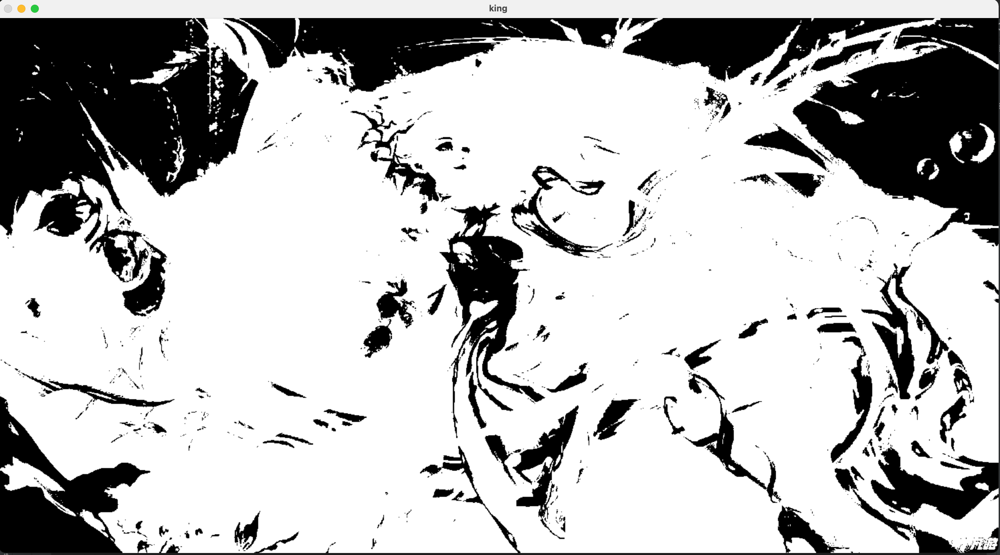


## 模型算法

### KNN

#### MNIST数据集

MNIST数据集时深度学习和计算机视觉领域非常经典且基础的数据集，它包含了大量的手写数字图片，通常用于各种图像处理系统。

MNIST数据集分为训练集（training set）和测试集（test set），训练集包含60000张数字图片，测试集包含10000数字图片（所有数字图片像素为28×28），本数据集是开源可下载的，在Python中安装keras库可在线加载该数据集：

```shell
pip install -i https://pypi.tuna.tsinghua.edu.cn/simple/ keras tensorflow
```

代码示例：

```python
import cv2

from keras.datasets import mnist

# 加载数据集
# x_train 表示训练数据的图片集合；y_train 表示训练数据的标签集合。所谓的标签可以理解就是对应图片的名称
# x_test 表示测试数据的图片集合；y_test 表示测试数据的标签集合
# 返回的四个值都是 ndarray 数据类型，是numpy中的数组对象
(x_train, y_train), (x_test, y_test) = mnist.load_data()

# 输出一下训练集和测试集
print(x_train.shape)  # (60000, 28, 28) 表示数组中有60000万个元素，每个元素有28行，每行有28列
print(y_train.shape)  # (60000,)  60000个标签值，每个图片的标签都是0-9的数字
print(x_test.shape)  # (10000, 28, 28)

# 随即打印一张图片
cv2.imshow(str(y_train[101]), x_train[101])
cv2.waitKey(3000)
```

从上可以看出，数据集每个图片是一个二维矩阵，也就是说每个像素的色值是一个值，而不是RBG数组，也就是说这里加载出来的图片数据已经是经过灰度化处理的数据了。


#### KNN-K近邻算法

KNN（K Nearest Neighbor）算法，也叫 K-近邻算法，就是 K 个最近邻居的意思。**KNN算法的核心思想是，对一个未知样本的标签，可以使用K个 特征和它最近的已知样本的标签来推断**。比如：你的工资等于你五个亲密朋友工资的平均值，这里 K=5。

数字图片的标签，通常就是图片所呈现的具体数字。

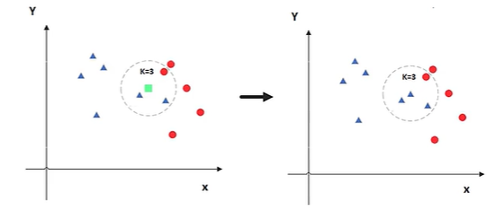

**KNN算法既可以用于分类问题，也可以用于回归问题**:

- 对于分类问题，使用和未知样本特征最接近的 K 个已知样本的标签中占比最多的标签值，作为未知样本的标签值
- 对于回归问题，使用和未知样本特征最接近的 K 个已知样本的标签的加权平均数，作为未知样本的标签值


**两个样本的特征相似度可以用特征距离来表示，KNN算法一般用的欧式公式。**欧式公式可以用勾股定理推导而来，其公式如下：

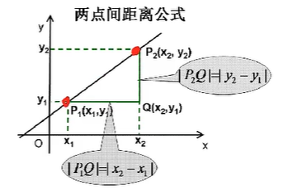

- 二维平面上的点`a(x1,y1)`和点`b(x2,y2)`之间的欧式距离公式：
  $$
  d_{ab}=\sqrt{(x_1-x_2)^2+(y_1-y_2)^2}
  $$

- 三维空间上的点`a(x1,y1,z1)`和点`b(x2,y2,z2)`之间的欧式距离公式：
  $$
  d_{ab}=\sqrt{(x_1-x_2)^2+(y_1-y_2)^2+(z_1-z_2)^2}
  $$

- n维空间平面上的点点`a(x1,x2,...,xn)`和点`b(y1,y2,...,y2)`之间的欧式距离公式：
  $$
  d_{ab}=\sqrt{(x_1-y_1)^2+(x_2-y_2)^2+...+(x_n-y_n)^2}=\sqrt{\sum_{i=1}^n(x_i-y_i)^2}
  $$


#### KNN 图像识别

由于图片灰度化之后是一个二维矩阵（宽和高，比如一张28×28的图片，就有784个像素），因此需要将二维展平成一维，也就是一个长度为784的数组。

同样，我们也要将待识别的样本由二维矩阵展平为一维数组，过程很简单，就是将矩阵中的每一行从上到下依次排开就行了，比如：

```python
[
  [11,12,13,14,15],
  [21,22,23,24,25],
  [31,32,33,34,35]
]
# 展平
[11,12,13,14,15,21,22,23,24,25,31,32,33,34,35]
```

看个例子：

- 待识别数字与已知样本8的距离

  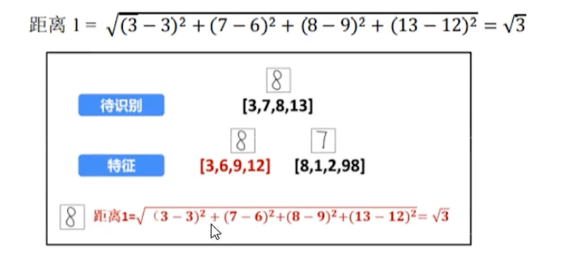

- 待识别数字与已知样本7的距离

  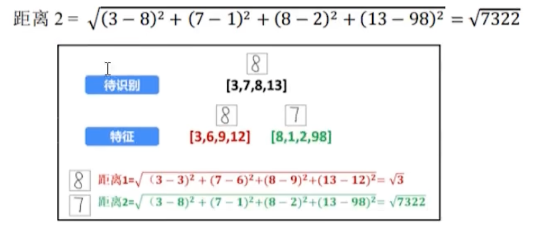

通过计算显然待识别样本与特征样本8距离更近，因此最终结果将识别为8。**需要注意的是，计算距离时一维数组的长度必须是相同的，也就是说待识别样本的像素是需要和预训练样本的像素相同（大小一样）。**


#### KNN 模型训练

**独热编码**

One-Hot编码。针对二分类问题，比如：男或女、购买与否等，二分类的标签通常不需要独热编码，因为直接可以用0和1来表示。但对于多分类问题，就需要使用独热编码了，比如我们将"Dog"、"Cat"、"Pig"这种文字作为标签，这对于计算机来说是不利于运算的，更不能直接使用0、1、2、3等表示，因为这样不仅不具备唯一性，更可能让计算机认为这是有顺序的值，通常分类问题都是离散的，相互之间没有关系。

独热编码以下面的形式呈现：

```python
# 用一个长度为10的列表表示一个数字，第0位是1就表示该值为0、第3位数字为1就表示该值为2，以此类推
[0 1 0 0 0 0 0 0 0 0]  =>  1
[0 1 0 0 0 0 0 0 0 0]  =>  1
[0 0 0 1 0 0 0 0 0 0]  =>  3
[0 0 0 0 0 0 0 1 0 0]  =>  7

# 上面表示的数值就是1137，这种表达数值的方式也叫 稀疏矩阵
```

独热编码的优势：

1. 计算机友好：计算机擅长处理数字而不是文字，将分类数据转换为数值型数据，可以让计算机更轻松的处理。
2. 防止大小关系误解：如果直接用数字表示，比如 0、1、2 等，可能会让计算机误认为类别间有大小或顺序关系。而独热编码就可以消除这种误解，是类别间相互独立。
3. 适用于各种算法：许多机器学习算法，例如这里的 K-近邻算法，更适合处理数值型数据。
4. 模型的需求：在深度学习领域，神经网络的输入层通常期望是数值型数据。而独热编码就提供了这样一种有效的方式，将分类数据转换为适用于神经网络的形式。


**模型训练**

```python
import joblib

from numpy import ndarray
from keras.datasets import mnist

from sklearn.preprocessing import LabelBinarizer
from sklearn.neighbors import KNeighborsClassifier

# 加载数据集
x_train: ndarray
y_train: ndarray
x_test: ndarray
y_test: ndarray

(x_train, y_train), (x_test, y_test) = mnist.load_data()

# 先将图片展平为一维数组
# 再将像素颜色进行归一化处理
x_train = x_train.reshape(x_train.shape[0], 28*28)  # 将数组重新排列为60000个一维数组，每个一维数组长度是28*28
x_train = x_train.astype("float32") / 255  # 将数组中的值都除以255进行归一化
x_test = x_test.reshape(x_test.shape[0], 28*28)
x_test = x_test.astype("float32") / 255

# 由于y标签是0-9的数值，所以需要进行独热编码
lb: LabelBinarizer = LabelBinarizer().fit(y_train)
y_train = lb.transform(y_train)
y_test = lb.transform(y_test)

# 使用KNN进行训练
knn = KNeighborsClassifier(n_neighbors=5)
knn.fit(x_train, y_train)

# 评估模型，使用测试集看识别的准确率
test_predict = knn.predict(x_test)  # 预测测试集对应的结果
print(test_predict)  # 这里返回一个二维数组，二维数组每个元素就是一个独热编码数组，表示预测的值

score = knn.score(x_test, y_test)  # 返回测试数据相对于预期值的准确率
print("识别准确率:" + str(score))

# 保存模型
joblib.dump(knn, "knn-number.model")
```


#### KNN 模型预测

随机选一个MNIST测试集数据预测：

```python
import joblib
import numpy
from numpy import ndarray
from keras.datasets import mnist
from sklearn.neighbors import KNeighborsClassifier

x_train: ndarray
y_train: ndarray
x_test: ndarray
y_test: ndarray
(x_train, y_train), (x_test, y_test) = mnist.load_data()

# 任意取一张测试图片
img = x_test[9526]
label = y_test[9526]

# 归一化处理图片并展平成一维
img = img.astype("float32") / 255
img = img.reshape(1, -1)  # 和 img.reshape(1, 28*28) 作用相同

# 加载模型并进行预测
knn: KNeighborsClassifier = joblib.load("knn-number.model")

predict = knn.predict(img)  # 模型训练时数值标签被转换为独热编码了，因此我们可以使用numpy将其转换回来

# 独热编码将数组中对应索引处的0改为1，它的索引值就是对应的数值
# numpy.where 查找数组中值等于1的索引并返回
predict_array = numpy.array(predict)
target = numpy.where(predict_array == 1)[1]

print(target[0])  # 4
print(label)  # 4
```


预测下面手写的单个数字：

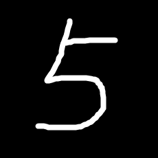

```python
import cv2
import joblib
import numpy

from sklearn.neighbors import KNeighborsClassifier

# 加载图片
img = cv2.imread("../../images/number-5.png")

# 灰度化、二值化
img = cv2.cvtColor(img, cv2.COLOR_RGB2GRAY)
ret, img = cv2.threshold(img, 128, 255, cv2.THRESH_BINARY)

# 进行结果预测，还必须让目标图片大小和训练数据图片大小一致，因此要转换图片大小
img = cv2.resize(img, (28, 28), interpolation=cv2.INTER_AREA)

# 归一化处理图片并展平成一维
img = img.astype("float32") / 255
img = img.reshape(1, 28*28)  # 和 img.reshape(1, 28*28) 作用相同

# 加载模型并进行预测
knn: KNeighborsClassifier = joblib.load("knn-number.model")

predict = knn.predict(img)
predict_array = numpy.array(predict)
predict_num = numpy.where(predict_array == 1)[1]

print(predict_num[0])  # 5
```


