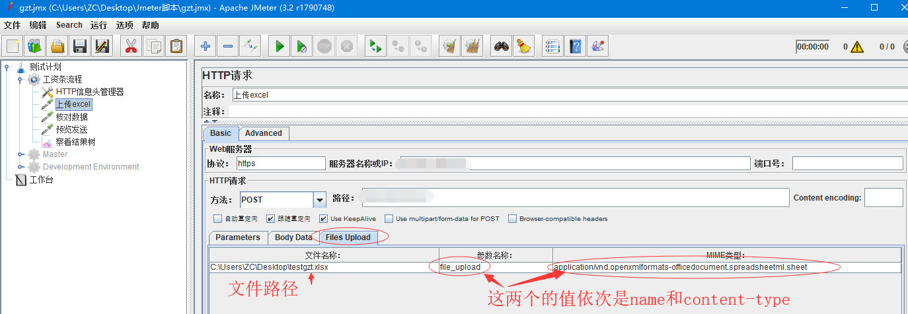
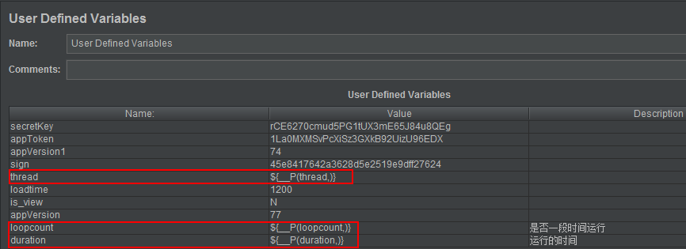

## 一、环境安装

### 安装JDK

- 下载JDK安装包：**https://www.oracle.com/technetwork/java/javase/downloads/jdk8-downloads-2133151.html**

- Unix/Linux 将安装包copy到对应目录解压，然后配置环境变量。

  ``` shell
  # 在profile中添加如下配置
  export JAVA_HOME=/usr/local/jdk1.8.0_181  #jdk安装目录  
  export CLASSPATH=.:${JAVA_HOME}/lib/:${JAVA_HOME}/jre/lib
  export PATH=$PATH:${JAVA_HOME}/bin:${JAVA_HOME}/jre/bin:$PATH
  
  # -----------------------
  # linux/unix(intel) 配置文件路径: /etc/profile
  # unix(m1)配置文件路径：~/.zprofile
  
  # 添加脚本后，重新加载配置文件使其生效
  source /etc/profile
  
  # 检查安装情况
  java -version		# 查看java版本信息
  javac/java		# 查看是否有命令相关help信息
  ```

- Windows 安装大同小异，环境变量再计算机 -> 高级选项中配置即可。


### 安装Jmeter

- 下载Jmeter安装包： **http://jmeter.apache.org/ **

- Jmeter安装包解压即可使用。为了cmd能够全局使用，将启动文件配置到环境变量。

  ``` shell
  export JMETER_HOME=/var/local/apache-jmeter-5.4.1  # jmeter解压后的目录
  export PATH=${JMETER_HOME}/bin:$PATH
  export CLASSPATH=${JMETER_HOME}/lib/ext/ApacheJMeter_core.jar:${JMETER_HOME}/lib/jorphan.jar:${CLASSPATH}
  
  # 添加脚本后，重新加载配置文件使其生效
  source /etc/profile
  
  # 检查安装情况
  jmeter -v  # 打印jmeter版本信息
  ```


### 安装 Ant

- 下载Ant安装包：**https://ant.apache.org/bindownload.cgi**

- Ant 安装包解压后即可使用，同Jmeter

  ``` shell
  export ANT_HOME=/var/local/apache-ant-1.10.11
  export PATH=${ANT_HOME}/bin:$PATH
  
  # 添加脚本后，重新加载配置文件使其生效
  source /etc/profile
  
  # 检查安装情况
  ant -version  # 打印jmeter版本信息
  ```

  


## 二、配置详解

### 1、线程组

- **在取样器错误后要执行的动作：**
  -  这个指的是后续测试过程中如果发生错误，但测试计划并未满足预先设计的结束条件，是否继续执行。

- **线程数 :**
  - 即需要创建多少个线程，理解为需要启动多少个虚拟用户。

- **Ramp-Up时间(秒)：**
  - 即创建线程的准备时间， 和线程数组合，即希望在多少秒内创建多少个线程，这只是个尽量，不一定准。

- **循环次数：**
  - 这里有两个选项， 一旦勾选永远，则输入框不可用。与上述两个属性组合起来，即每多少秒创建多少线程发送请求，然后持续到永远，一直不停止。这个是基于时间，而不是次数。也可以取消勾选永远， 而精确到循环次数。

- **调度器：**
  - 持续时间(s):
    - 配合上面循环次数中的永远使用， 这样即可以不以次数为目标，而是以调度器指定的持续时间来完成测试任务， 当整个测试计划执行中达到了指定的时间，则测试计划终止。
  - 延迟启动(s):
    - 即在脚本启动后，延迟多少秒才开始执行测试。


### 2、样本

#### HTTP Request

> 普普通通的一个HTTP请求样本，可以实现普通的GET、POST等请求，也可以实现文件的上传和下载。
>
> - 文件上传：Content-Type 在上传时比较特殊，根据抓包情况没确认是否需要改参数。如果不需要，上传时就不要加。
>
>   
>
> - 文件下载：jmeter本身是不支持将文件保存到本地的，用beanshell脚本将响应数据串流写到指定路径的文本中。在HTTP请求下面添加BeanShell PostProcessor。注意：输出文本类型需要和与预期下载类型一致。
>
>   ``` java
>   import java.io.*;
>   byte[] result = prev.getResponseData();  # 用内置变量prev获取响应数据
>   String file_name = "/Users/zhangjian/Public/file/123.xlsx";
>   File file = new File(file_name);
>   FileOutputStream out = new FileOutputStream(file);
>   out.write(result);
>   out.close();
>   ```


#### Debug Sampler  调试样本

> 该样本可以获取整个线程组中所有自定义变量的 键值。主要目的是在调试过程中用来排错。


#### JDBC Request

> JDBC请求使用之前，需要先完成JDBC连接接配置。需要借助配置元件 JDBC Connection Configuration。
>
> **JDBC Connection Configuration**
>
> > 对数据库连接进行配置，主要是连接驱动、URL，连接的账号密码等。
>
> 参数说明：
>
> - Variable Name for created pool：数据库连接池的名称，我们可以有多个jdbc connection configuration，每个可以起个不同的名称，在jdbc request中可以通过这个名称选择合适的连接池进行使用。
> - Database URL：数据库url，jdbc:mysql://主机ip或者机器名称:mysql监听的端口号/数据库名称， 如：jdbc:mysql://localhost:3306/test
> - JDBC Driver class：JDBC驱动，根据数据库类型选择
> - username：数据库登陆的用户名
> - passwrod：数据库登陆的密码

**参数说明：**

- Variable Name：数据库连接池的名字，需要与JDBC Connection Configuration的Variable Name Bound Pool名字保持一致
- Query：填写的sql语句，sql语句可以调用jmeter变量（${}），也可使用 ? 做占位符，执行时根据位置依次获取Parameter valus中的值。
- Parameter valus：参数值，为sql中占位符 ? 填充值，多个参数用英文逗号隔开。参数值本身也可以调用其他变量来获取参数值。
- Parameter types：参数类型，可参考：Javadoc for java.sql.Types。常用的有 integer、char、String等
- Variable names：保存sql语句返回结果的变量名，需要按列来定义变量名，多列的多个变量用英文逗号隔开。
- Result variable name：创建一个对象变量，保存所有返回的结果
- Query timeout：查询超时时间
- Handle result set：定义如何处理由callable statements语句返回的结果

**取用查询结果：**

- 通过 Variable names 中定义的变量来获取每一列的值。
- 通过 ${变量名_n} 的方式来获取每一列中不同行的值，就算查询结果只有1行，也需要用这种方式来获取。


### 3、配置元件

#### HTTP Request Defaults 请求默认值

> 配置线程组内多个http请求的公共参数，比如协议、host等。在该配置原件后面的http请求，默认使用公共参数。


#### User Defined Parameters 用户自定义参数

> 定义线程组内全局的自定义参数。


#### CSV Data Set Config  CSV数据参数化

> 实现从csv文件中读取测试数据。
>
> - Filename: 指保存信息的文件目录，可以相对或者绝对路径。
> - File encoding: 文件编码格式，一般选择UTF-8。
> - Variable Names: 给csv文件中各列起个名字（有多列时，用英文逗号隔开列名）作为引用变量，多个变量用逗号隔开。
> - Delimiter: 与 .csv文件的分隔符保持一致。如文件中使用的是逗号分隔，则填写逗号；如使用的是TAB，则填写\t；
> - Allow quoted data? : 是否允许带引号，如果文本数据中有引号，这里选为true。
> - Recycle on EOF?: 到了文件尾是否循环，True—再次从文件第一行开始读取，False—不再循环。 
> - Stop thread on EOF? :到了文件尾是否停止线程，True—停止，False—不停止，注：当Recycle on EOF设置为True时，此项设置无效。
> - Sharing mode: 共享模式，All threads –测试计划中的所有线程共享，一次迭代取值；Current thread group—当前线程组内的线程共享；Current thread—只有当前线程能调用变量取值。


#### HTTP Cookie Manager HTTP Cookie 管理器

> 通常取的Cookie都是从Response Header里取的，配置cookie管理器后，后面相同域名的请求执行时，jmeter会自动携带上前面响应中的cookie。
>
> 其他操作：
>
> - 可以为不同的域名自定义cookie信息。
> - 提取cookie信息：
>   - 修改jmeter.properties文件，设置CookieManager.save.cookies=true，然后重启。


### 4、逻辑控制器

#### Loop Controller 循环控制器

> 控制 控制器内部的操作的循环次数。可设置具体的循环次数，也可以一直循环。


#### if Controller  IF控制器

> 实现条件判断，当判断结果为true时，才执行后面的请求。
>
> - **不勾选“interpret condition as variable expression”** 直接输入我们需要判断的表达式即可，判断表达式为真时，执行if控制器下的请求。
>
>   ``` java
>   "${name}"=="zhangjian"  # 引用的变量，如果是字符串，就用""包起来，这样才被认为是常量字符串
>   ```
>
> - **勾选“interpret condition as variable expression”**	这时expression中不能直接填写条件表达式，需要借助函数将条件表达式计算为true/false，可以借助的函数有_jexl3和_groovy。
>
>   ``` java
>   ${__groovy("${name}"=="zhangjian"&&1==2)}  # 用逻辑运算符链接多个表达式，这里运算结果为false
>   ```


#### ForEach Controller ForEach控制器

> 对一组相关变量进行遍历。
>
> 参数说明：
>
> - Input Variable Prefix：输入变量前缀，本例中为：image 
>
> - Output variable name：输出变量名称，提供给其它控件引用 
>
> - Start index for loop(exclusive)：循环开始的索引（不包含），默认从0开始。
>
> - End index for loop(inclusive)：循环结束的索引（包含）。
>
> - Add “_ before number：输入变量名称中是否使用 "_" 进行间隔。 

**示例：**

​		去正则表达式的示例一，我们单模版取多个值时，取值时按 image_1，image_2这样取值。然后在foreach中输入前缀，然后输入起止索引，再勾选上 _ 间隔，就可以对image循环取值。


####  Transaction Controller 事务控制器

> 一个事务，就是完成一个业务所调用接口的集合：可能是单个接口和可能是一连串接口。
>
> generate parent sample：如果选中，事务控制器将作为其他取样器的父级样本，否则事务控制器仅作为独立的样本。
>
> include duration of timer and pre-post processors in generated sample：是否在生成的样本中包括计时器，预处理和后处理的延迟时间。


#### Once Only Controller  仅一次控制器

> 不管线程组循环几次，它下面的节点只执行一次，但是，多少个线程组就会执行多少次，项目中较常用的场景是登录，一个用户登录一次之后可以执行其他更多的操作。


### 5、前置处理器

#### User Parameters  用户参数

> 用户参数处理器，定义线程组内全局的可迭代的用户自定义参数。该处理器优先级高于CSV数据驱动。

### 6、后置处理器

#### Regular Expression Extractor 正则表达式提取器

> 从上一个请求的响应中，正则匹配出我们想要的信息，并赋值给变量，方便当前请求调用。
>
> 参数说明：
>
> - **引用名称（Reference Name）**：Jmeter变量的名称，存储提取的结果；即下个请求需要引用的值、字段、变量名，后文中引用方法是${}。
>
> - **正则表达式（Regular Expression）**：使用正则表达式解析响应结果，（）括号表示提取字符串中的部分值，前后是提取的边界内容。
>
> - **模板（Template）**：正则表达式的提取模式。如果正则表达式有多个提取结果，则结果是数组形式，模板$1$，$2$等，表示把解析到的第几个值赋给变量；从1开始匹配，以此类推。若只有一个结果，则只能是$1$。
>
> - **匹配数字（Match No）**：正则表达式匹配数据的结果可以看做一个数组，表示如何取值：0代表随机取值，正数n则表示取第n个值（比如1代表取第一个值），-1则表示提取所有符合条件的值。
>
> - **缺省值**：匹配失败时候的默认值；通常用于后续的逻辑判断，一般通常为特定含义的英文大写组合，比如：ERROR等。

**举例一：单模板单数据**


**使用说明：**

由于我们在匹配数字里填写了-1，匹配到的是多个值，我们就可以通过**${变量名_坐标}**的方式获取：

- ${image_1}表示第一个匹配到的
- ${image_2}表示第二个匹配到的

**举例二：多模板单数据**


**使用说明：**

由于使用了两个模板(两对括号)，并且告诉Jmeter我们要获取每个模板匹配到的一个数据(匹配数字=1)，所以通过下面的方式即可获得：

- ${label_g1}获取第一个模板匹配到的数据
- ${label_g2}获取第二个模板匹配到的数据

**举例三：多模板多数据**


这个例子是例1和例2的结合，使用多个模板，每个模板匹配多条数据。那么获取的方式是：

- ${list_1_g1}获取第一模板的第一个数据 ${list_1_g2}获取第二模板的第一个数据
- ${list_2_g1}获取第一模板的第二个数据 ${list_2_g2}获取第二模板的第二个数据


### 7、计时器

#### Synchronizing Timer 同步计时器

> 实现jmeter集合点功能。目的是让所有请求在不满足条件的时候处于等待状态，满足条件时，所有请求一起执行，达到并发的目的。
>
> Number of Simulated Users to Group by：按组分组的模拟用户数，即用户数达到多少时，才开始执行。
>
> timeout in milliseconds：意思是等待请求多久后，不管线程数有没有到达设置的并发数量都开始运行测试。如果该值是0，那么久一直等，直到模拟用户数达到设定的用户数。单位 ms。


### 8、断言

#### Response Assertion 响应断言

> 根据相应结果判断请求是否成功，可根据相应文本、响应头等。


### 9、监听器

#### View Results Tree 查看结果树

> 可查看请求的详细请求参数、响应参数，作为请求调试的常用监听器。


#### Aggregate Report 聚合报告

> 统计测试计划的请求数量、请求响应时间（最大值、最小值、平均值）、百分位数（90%，95%，中位数）、TPS、吞吐率、错误率等。作为GUI模式下，性能测试的常用统计报告。
>
> 字段详解：
>
> - Label：每个 JMeter 的 element（例如 HTTP Request）都有一个 Name 属性，这里显示的就是 Name 属性的值；
>
> - #Samples: 表示这次测试中一共发出了多少个请求，如果模拟10个用户，每个用户迭代10次，那么这里显示100；【我的是用户有100，只迭代一次，因此也是100】
>
> - Average：平均响应时间——默认情况下是单个 Request 的平均响应时间，当使用了 Transaction Controller 时，也表示以Transaction 为单位显示平均响应时间；
>
> - Median：中位数，也就是 50％ 用户的响应时间在该值之下；
>
> - 90% Line ~ 99% Line：90％ ~99%用户的响应时间在该值之下；
>
> - Min：最小响应时间；
>
> - Maximum：最大响应时间；
>
> - Error%：本次测试中出现的错误率，即 错误的请求的数量/请求的总数；
>
> - Throughput：吞吐量——默认情况下表示每秒完成的请求数（Request per Second），当使用了 Transaction，也表示每秒完成的事物数 ；
>
> - Received KB/sec：每秒从服务器端接收到的数据量；
>
> - Sent KB/sec：每秒从客户端发送的请求的数量。


### 10、常用插件

> 非GUI模式执行时，jmx 如果配置了插件相关的组件，那么插件相关的jar包同样要拷贝到对应jmeter的lib\ext中。

#### 一、插件管理器

- 下载地址：[jmeter-plugins.org](https://jmeter-plugins.org/downloads/all/)

- 安装：下载后文件为[jmeter-plugins-manager.jar](https://jmeter-plugins.org/get/)格式，将其放入jmeter安装目录下的lib/ext目录，然后重启jmeter。
- 在 选项 菜单就可以看到插件模块。
- 打开 插件管理弹窗 ，在可用插件中 选择 **jpgc Standard Set** 应用重启。就自动默认安装好了一些常用插件。
- 可用插件中还有其他一些事用插件，按需安装即可。


#### 二、**Transactions Per Second**

> **TPS：每秒事务数**，性能测试中，最重要的2个指标之一。该插件的作用是在测试脚本执行过程中，监控查看服务器的TPS表现，比如**整体趋势、实时平均值走向、稳定性**等。相比于 聚合报告 中的 TPS 统计，该插件更加详细。

- 直接在监听器中添加插件即可使用。


#### 三、**Response Times Over Time**

> 即**TRT：事务响应时间**，性能测试中，最重要的两个指标的另外一个。该插件的主要作用是在测试脚本执行过程中，监控查看**响应时间的实时平均值、整体响应时间走向**等。

- 直接在监听器中添加插件即可使用。


#### 四、**PerfMon Metrics Collector**

> **服务器性能监控数据采集器**。在性能测试过程中，除了监控TPS和TRT，还需要监控服务器的资源使用情况，比如**CPU、memory、I/O**等。该插件可以在性能测试中实时监控服务器的各项资源使用。

- 在https://jmeter-plugins.org/wiki/PerfMonAgent/下载 ServerAgent-2.2.1.zip 。这是服务端插件，将其拷贝到服务器解压，并运行**startAgent.sh**文件。该文件主要目的是采集服务端数据。启动监控服务时，默认端口是4444，可以在启动时指定端口。

  ``` shell
  ./startAgent.sh --udp-port 0 --tcp-port 3450  # 实际测试时，建议按当前命令执行，不要同时起tcp和udp
  ```

- 在监听器中添加插件，为当前插件配置要监听服务器哪些性能指标，IP 为服务器公网IP，PORT 为启动鉴定服务时的端口号。


#### 五、Ultimate Thread Group  分步加压线程组

> **终极线程组插件**。 实现分布加压测试。
>
> 参数含义解释:
>
> - Start Threads Count：当前行启动的线程总数
> - Initial Delay/sec：延时启动当前行的线程，单位:秒
> - Startup Time/sec：启动当前行所有线程达峰值所需时间，单位:秒
> - Hold Load For/sec：当前行线程达到峰值后的稳定加载时间，单位:秒
> - Shutdown Time：停止当前行所有线程所需时间，单位:秒


### 11、BeanShell

> - BeanShell是一种完全符合Java语法规范的脚本语言,并且又拥有自己的一些语法和方法;
>
> - BeanShell是一种松散类型的脚本语言(这点和JS类似);
>
> - BeanShell是用Java写成的,一个小型的、免费的、可以下载的、嵌入式的Java源代码解释器,具有对象脚本语言特性,非常精简的解释器。
>
> - BeanShell可执行标准Java语句和表达式,另外包括一些脚本命令和语法。

在jmeter的sampler、前置处理器、后置处理器、断言等组件中都有beanshell，用来处理一些和jmeter的交互。

- BeanShell 常用内置变量

  - **log**  打印日志，写入信息到jmeber.log文件，使用举例
    log.info(“开始请求…”)
    log.error(“接口报错”)

  - **ctx**  代表上下文信息，使用举例
    ctx.getCurrentSampler(); 获取当前 sampler 请求

    ctx.getPreviousSampler(); 获取前一个 sampler 请求

    ctx.getThreadNum(); 获取当前线程的序号，从 0 开始计数

    ctx.getThread(); 获取当前线程

    ctx.getThreadGroup(); 获取当前线程组

    ctx.getProperties(); 获取所有属性

    ctx.getVariables(); 获取当前线程的所有变量

  - **vars**  即JMeterVariables，操作jmeter变量，这个变量实际引用了JMeter线程中的局部变量容器（本质上是Map），常用方法：

    vars.get(String key)：从jmeter中获得变量值；

    vars.put(String key，String value)：数据存到jmeter变量中；

  - **props**  用于存取 jmeter 全局的静态变量，其中的 key 和 value 均是字符串形式，可实现跨线程组的变量传值；使用举例：

    props.put(“token”,“666”);

    props.get("token")

  - **prev**  获取前面的sample返回的信息，常用方法：

    prev.getResponseDataAsString()：获取响应信息

    prev.getResponseCode() ：获取响应code

- 简单应用示例

  ``` java
  String password = "123123";
  log.info("Set my password");
  vars.put("encode",password); //把值保存到jmeter变量encode中，可直接在jmeter脚本中调用，方式：${变量名}
  String getEncode=vars.get("encode"); 
  log.info("Get my encode: " + getEncode);
  String sample = "wulala";
  props.put("sample",sample);  // props保存的是全局变量，可在其他线程组内取出，但不能直接在线程组内使用，要用vars转一下
  vars.put("sample",props.get("sample"));
  ```


## 三、启动测试

### 命令行模式启动

``` shell
jmeter -n -t [jmx file] -l [result file] -e -o [Path to web report folder]

# -n 表示已 non-web 方式执行
# -t 指定测试的 .jmx 文件
# -l 测试结果文件，是一个 .jtl 文件
# -e 生成测试报告
# -o 指定测试报告存放位置，是一个目录，里面有html文件可以预览

# 举例：
jmeter -n -t jmx/boot-quick.jmx -l jmx/boot-quick.jtl -e -o jmx/report
```


### 命令行启动分布式

- slave 配置

  - jmeter.properties文件中 server.rmi.ssl.disable 属性改为true
  - jmeter.properties文件中 ，server_port为执行机未被占用的端口，一般默认为1099；remote_hosts 为执行机的IP。

- master 配置

  - jmeter.properties文件中 server.rmi.ssl.disable 属性改为true，不适用加密认证传输
  - jmeter.properties文件中 ，修改remote_hosts，配置为slave机器。按照 IP:PORT 配置执行机，个多执行机用英文逗号隔开
  - mode=Standard 启用，如果不启用，master机器，看不到saleve的数据

- 启动slave

  ``` shell
  nohup jmeter-server &  # 后台运行jmeter服务
  ```

- 启动master

  ``` shell
  jmeter -n -t jmx/boot-quick.jmx -r -l jmx/boot-quick.jtl -e -o jmx/report  # 直接在master上执行，-r 参数表示远程执行
  jmeter -n -t jmx/boot-quick.jmx -r -l jmx/boot-quick.jtl -H 192.168.32.99 -P 1099 -e -o jmx/report  # 指定salve机执行
  ```

- 参数配置：用 -G

  ``` shell
  jmeter -n -r -t emisp_login.jmx -Gthread=1 -Gloopcount=-1 -Gduration=60 -l /ulic/mysql_project/result/result_debug.jtl
  ```

  

- 特别注意：

  - master 机器和slave机器上的 jmeter部署目录，保持一致，jmeter版本一致
  - master机器上的执行脚本有参数配置文件，比如 csv等，则应该，在slave机器对应的目录上都copy放置一份
  - 在master执行脚本，尽量都写成 绝对路径方式，脚本名称以及报告路径
  - jdk的主要版本保持一致
  - jmeter的插件要一致
  - 同一局域网下小网IP，防火墙可以开放端口

- **jmeter容器分布式**

  - 构建slave镜像：docker build -t slave:latest .

    ``` dockerfile
    FROM centos:centos7.5.1804
    ADD apache-jmeter-5.4.1 /var/local/apache-jmeter-5.4.1
    ADD jdk1.8.0_144 /var/local/jdk1.8.0_144
    ENV JAVA_HOME=/var/local/jdk1.8.0_144
    ENV CLASSPATH=.:${JAVA_HOME}/lib/:${JAVA_HOME}/jre/lib
    ENV PATH=$PATH:${JAVA_HOME}/bin:${JAVA_HOME}/jre/bin:$PATH
    ENV JMETER_HOME=/var/local/apache-jmeter-5.4.1
    ENV PATH=${JMETER_HOME}/bin:$PATH
    ENV CLASSPATH=${JMETER_HOME}/lib/ext/ApacheJMeter_core.jar:${JMETER_HOME}/lib/jorphan.jar:${CLASSPATH}
    EXPOSE 1099 50000
    # 启动容器 运行jmeter-server. 同时修改改文件中的部分参数
    ENTRYPOINT $JMETER_HOME/bin/jmeter-server \
                            -Dserver.rmi.localport=50000 \
                            -Dserver_port=1099
    ```

  - jmeter.properties文件中 server.rmi.ssl.disable 属性改为true

  - 启动slave容器，并查看其ip

    ``` shell
    docker run -d --name slave_01 slave:latest
    docker run -d --name slave_02 slave:latest
    
    # 查看IP  172.18.0.2 172.18.0.3
    docker inspect --format '{{ .Name }} => {{ .NetworkSettings.IPAddress }}' $( docker ps -a -q)
    ```

  - 构建slave镜像：docker build -t master:latest .

    ``` dockerfile
    FROM centos:centos7.5.1804
    ADD apache-jmeter-5.4.1 /var/local/apache-jmeter-5.4.1
    ADD jdk1.8.0_144 /var/local/jdk1.8.0_144
    ENV JAVA_HOME=/var/local/jdk1.8.0_144
    ENV CLASSPATH=.:${JAVA_HOME}/lib/:${JAVA_HOME}/jre/lib
    ENV PATH=$PATH:${JAVA_HOME}/bin:${JAVA_HOME}/jre/bin:$PATH
    ENV JMETER_HOME=/var/local/apache-jmeter-5.4.1
    ENV PATH=${JMETER_HOME}/bin:$PATH
    ENV CLASSPATH=${JMETER_HOME}/lib/ext/ApacheJMeter_core.jar:${JMETER_HOME}/lib/jorphan.jar:${CLASSPATH}
    EXPOSE 6000
    CMD ["sh", "-c", "while true; do sleep 1; done"]
    ```

  - 启动master容器

    ``` shell
    docker run -d -v /var/local/jenkins/jenkins_home:/var/jenkins_home  --name master master:latest
    ```

  - jmeter.properties文件中 server.rmi.ssl.disable 属性改为true，remote_hosts=ip1:port,ip2:port

  - 找到jmx文件执行测试即可

  

  


## 四、jenkins + jmeter + ant 持续集成

> 相比于直接用Jenkins调用jmx文件，ant 组件把调用过程隐藏了，并实现批量jmx文件的执行（依赖 build.xml）。
>
> - Jenkins直接调用jmx文件的脚本，就是执行jmeter的命令行模式。该方式更适合 **性能测试** 新的jmeter版本已经可以通过下面的命令生成比较完善的性能测试报告了。
>
>   ``` she
>   jmeter -n -t demo.jmx -l jtl/${JOB_NAME}_${BUILD_NUMBER}.jtl -e -o html/
>   ```
>
> - 配置ant后，执行shell就只需到 build.xml 所在目录执行 ant run 即可。更适合接口测试，统计数据不详细，有点落伍了
>
>   ``` shell
>   cd build && ant run
>   ```

- jenkins 上安装相关插件，比如 ant、html_report、groovy

  - ant 需要配置全局变量，路径写ant安装路径即可

  - html_report 是jenkins中的构建后操作，用于生成报告

  - groovy 是构建操作，放到构建操作的最后，选择 execut system shell script，输入下面的脚本

    ``` SHELL
    System.setProperty("hudson.model.DirectoryBrowserSupport.CSP", "")
    ```

- ant调用jmeter构建配置

  - 把  jmeter/extras 目录下的 **ant-jmeter-1.1.1.jar**  jar包拷贝到 ant 的 lib 目录下。

  - ant 构建工具是通过xml配置来执行的。在 jmx 文件所在的项目目录创建一个文件夹 build，并在其中创建 **build.xml** 文件，拷贝下面的内容进去，里面的配置需要修改，配置中的目录需要提前创建好。当前项目名称是 jmeter_ant。

    ``` xml
    <?xml version="1.0" encoding="UTF-8"?>
    <project name="ant-jmeter-test" default="run" basedir=".">
        <tstamp>
            <format property="time" pattern="_yyyy_MMdd_HHmmss" />
        </tstamp>
        <!-- 需要改成自己本地的 Jmeter 目录-->
        <property name="jmeter.home" value="/var/local/apache-jmeter-5.4.1" />
        <property name="report.title" value="接口测试"/>
        <!-- jmeter生成jtl格式的结果报告的路径-->
        <property name="jmeter.result.jtl.dir" value="/var/jenkins_home/workspace/jmeter_ant/jtl" />
        <!-- jmeter生成html格式的结果报告的路径-->
        <property name="jmeter.result.html.dir" value="/var/jenkins_home/workspace/jmeter_ant/html" />
        <property name="detail" value="_detail" />
        <!-- 生成的报告的前缀-->
        <property name="ReportName" value="TestReport" />
        <property name="jmeter.result.jtlName" value="${jmeter.result.jtl.dir}/${ReportName}${time}.jtl" />
        <property name="jmeter.result.htmlName" value="${jmeter.result.html.dir}/${ReportName}${time}.html" />
        <target name="run">
            <antcall target="test" />
            <antcall target="report" />
        </target>
        <target name="test">
            <taskdef name="jmeter" classname="org.programmerplanet.ant.taskdefs.jmeter.JMeterTask" />
            <jmeter jmeterhome="${jmeter.home}" resultlog="${jmeter.result.jtlName}">
                <!-- 声明要运行的脚本"*.jmx"指包含此目录下的所有jmeter脚本-->
                <testplans dir="/var/jenkins_home/workspace/jmeter_ant/script_01" includes="*.jmx" />
                <!-- 执行多个目录时，再新增一个testplans标签即可 -->
                <testplans dir="/var/jenkins_home/workspace/jmeter_ant/script_02" includes="*.jmx" />
              
                <property name="jmeter.save.saveservice.output_format" value="xml"/>
            </jmeter>
        </target>
    
        <path id="xslt.classpath">
            <fileset dir="${jmeter.home}/lib" includes="xalan*.jar"/>
            <fileset dir="${jmeter.home}/lib" includes="serializer*.jar"/>
        </path>
        <target name="report">
            <tstamp> <format property="report.datestamp" pattern="yyyy/MM/dd HH:mm" /></tstamp>
            <xslt
                  classpathref="xslt.classpath"
                  force="true"
                  in="${jmeter.result.jtlName}"
                  out="${jmeter.result.htmlName}"
                  style="${jmeter.home}/extras/jmeter-results-detail-report_21.xsl">
                  <param name="showData" expression="${show-data}"/>
                  <param name="titleReport" expression="${report.title}"/>
                  <param name="dateReport" expression="${report.datestamp}"/> 
           </xslt>
            <!-- 因为上面生成报告的时候，不会将相关的图片也一起拷贝至目标目录，所以，需要手动拷贝 --> 
            <copy todir="${jmeter.result.html.dir}">
                <fileset dir="${jmeter.home}/extras">
                    <include name="collapse.png" />
                    <include name="expand.png" />
                </fileset>
            </copy>
        </target>
    </project>
    ```

  - 切入到 build.xml 所在的目录，执行 **ant run**

  - 优化报告，build.xml中使用的样式文件是在 jmeter/extras 目录下修改的 **jmeter-results-detail-report_21.xsl**，内容不是很多，可百度更多报告样式。

  - 修改 jmeter/bin 中的 jmeter.properties 文件，配置需要收集的数据属性。文本已经存在，取消注视修改即可。

    ``` shell
    #jmeter.save.saveservice.assertion_results=none
    #
    jmeter.save.saveservice.data_type=true
    jmeter.save.saveservice.label=true
    jmeter.save.saveservice.response_code=true
    # response_data is not currently supported for CSV output
    jmeter.save.saveservice.response_data=true
    # Save ResponseData for failed samples
    jmeter.save.saveservice.response_data.on_error=true
    jmeter.save.saveservice.response_message=true
    jmeter.save.saveservice.successful=true
    jmeter.save.saveservice.thread_name=true
    jmeter.save.saveservice.time=true
    jmeter.save.saveservice.subresults=true
    jmeter.save.saveservice.assertions=true
    jmeter.save.saveservice.latency=true
    # Only available with HttpClient4
    jmeter.save.saveservice.connect_time=true
    jmeter.save.saveservice.samplerData=true
    jmeter.save.saveservice.responseHeaders=true
    jmeter.save.saveservice.requestHeaders=true
    jmeter.save.saveservice.encoding=true
    jmeter.save.saveservice.bytes=true
    # Only available with HttpClient4
    jmeter.save.saveservice.sent_bytes=true
    jmeter.save.saveservice.url=true
    jmeter.save.saveservice.filename=true
    jmeter.save.saveservice.hostname=true
    jmeter.save.saveservice.thread_counts=true
    jmeter.save.saveservice.sample_count=true
    jmeter.save.saveservice.idle_time=true
    ```


## 五、性能测试

### 一、性能测试

#### 1、性能测试目的及分类

> - 负载测试：通过逐步加压的方法，达到既定的性能阈值的目标。阈值的设定应是小于等于某个值，比如CPU使用率小于等于80%。
> - 压力测试：通过逐步加压的方法，使得系统的某些资源达到饱和，甚至失效。以得到系统能承受的最大压力值，比如最大同时处理多少个请求。
> - 并发测试：在同一时间内，多个虚拟用户同时访问统一模块、同一功能接口。测试方法是设置集合点。
> - 容量测试：通常是指数据库层面的，目标是获取数据库的最佳容量的能力。即在一定并发用户，不同的数据量下，监控数据库的各项性能指标。
> - 可靠性测试：又叫稳定性测试和疲劳测试。是指在高压的情况下，被测系统长时间运行是否稳定。
> - 异常测试：又称为失败测试。在、比如在负载均衡的架构中，测试节点宕机、节点掉线等。

#### 2、nmon 服务器监控

- 工具安装

  - 检查环境信息

    ``` shell
    # 查看操作系统的信息
    uname -a 
    # 查看linux发行版本，centos 上没有内置改命令，需要安装
    # yum provides "*/lsb_release" # 查看哪个包提供这个命令，然后再安装对应的包
    # yum -y install redhat-lsb 
    lsb_release -a
    
    # Distributor ID:	CentOS
    # Description:	CentOS Linux release 7.5.1804 (Core)
    # Release:	7.5.1804
    # Codename:	Core
    ```

  - 根据系统版本下载nmon版本

    地址：http://nmon.sourceforge.net/pmwiki.php?n=Site.Download

    将安装包上传到服务器，解压后就得到很多可执行文件，其中就包括centos7的，将其拷贝并改名到/user/local/bin中，方便使用。

    ``` shell
    tar -zvxf nmon16e_mpginc.tar.gz  # 解压文件
    cp nmon_x86_64_centos7 /usr/local/bin/nmon   # 如此便可在服务器 执行 nmon 命令了
    ```

  - 实时监控，执行 nmon 后，进入 nmon 监控界面，按 以下快捷键查看对应的信息

    ``` shell
    │   Use these keys to toggle statistics on/off:                                                                                                                              
    │     c = CPU         l = CPU Long-term     - = Faster screen updates                                                                                                        
    │     C = " WideView  U = Utilisation       + = Slower screen updates                                                                                                        
    │     m = Memory      V = Virtual memory    j = File Systems                                                                                                                 
    │     d = Disks       n = Network           . = only busy disks/procs                                                                                                        
    │     r = Resource    N = NFS               h = more options                                                                                                                 
    │     k = Kernel      t = Top-processes     q = Quit
    ```

  - 采集监控数据

    ``` shell
    nmon -F demo_01.nmon -s 1 -c 10 -m /var/local 
    # 参数说明 
    -f   监控结果以文件形式输出，默认机器名+日期.nmon格式 
    -F   可以指定输出的文件名，比如test.nmon，建议使用F 
    -s   指的是采样的频率，单位是秒 
    -c   指的是采样的次数，即以上面的采样频率采集多少次。和 -s 参数配合使用就可以采集一个时间段的数据 
    -m   指定生成的文件目录
    ```

    - 将监控数据传到本地

      ``` shell
      scp root@121.4.47.229:/var/local/demo_01.nmon /Users/zhangjian/
      ```

    - 下载nmon文件分析工具

      地址：http://nmon.sourceforge.net/pmwiki.php?n=Site.Nmon-Analyser
      下载后，解压会得到一个xlsm文件，用excel打开，然后加载 nmon 进去即可得到分析结果。

    - 如果用wps打开 这个 xlsm 文件，需要下载一个插件，但这个插件MAC上还不支持，建议使用office。

#### 3、Linux Crontab 定时任务

- 命令介绍

  ``` shell
  crontab
      -e      (编辑工作表)
      -l      (列出工作表里的命令)
      -r      (删除工作表)
  # 用crontab -e进入当前用户的工作表编辑，是常见的vim界面。每行是一条命令。
  # crontab的命令构成为 时间+动作，其时间有分、时、日、月、周五种，操作符有
  # * 取值范围内的所有数字
  # / 每过多少个数字
  # - 从X到Z
  # ，散列数字
  ```

- 示例

  ``` shell
  3,15 8-11 * * 1 myCommand  # 每周一上午8点到11点的第3和第15分钟执行命令
  30 21 * * * reboot  # 每天21:30执行重启命令
  0 23-7/2 * * * nmon -F demo_01.nmon -s 1 -c 10 -m /var/local  # 每天23点到早上7点，每隔2小时执行一次nmon命令
  ```


#### 4、doDBA 数据库监控

> - doDBA 工具是一个基于命令行的远程系统监控工具。不依赖远程服务器的软件运行。它能实时的收集Linux和MySQL的性能数据。并可以生成一个执行文件来帮助您分析MySQL数据库。
> - 这个程序是免费软件。
> - doDBA是用go编写的。

- 下载：

  - wget https://raw.githubusercontent.com/dblucyne/dodba_tools/master/doDBA --no-check-certificate
  -  wget https://raw.githubusercontent.com/dblucyne/dodba_tools/master/doDBA.conf --no-check-certificate 
  - chmod +x doDBA

- doDBA.conf 配置文件，默认的连接配置

  ``` shell
  {
      "Host":"",
      "Huser": "root",
      "Hport": "22",
      "Hpwd":  "",
      "Muser": "dodba",
      "Mpwd":  "dodba",
      "Mport":"3306"
  }
  ```

- 执行参数说明

  ``` shell
  ./doDBA -help
  
  -help  # 显示帮助
  -c string  # 指定配置文件 (default "doDBA.conf")
  -h string  # 连接的 host/IP
  -sys  # 打印Linux的信息
  -myall  # 打印Linux和MySQL的信息
  -mysql  # 打印MySQL的信息
  -innodb  # 打印InnoDB存储引擎的信息
  -mytop  # 打印MySQL processlist，类似top
  -i <duration>  # 刷新间隔的秒数 (默认1s)
  -t <int>  #当MySQL Threads_running到达阈值时会输出 show processlist和showengine innodb status到dodba.log中 (默认50)
  -hP <string>  # 主机端口 (默认 "22")
  -hp <string>  # 主机密码
  -hu <string>  # 主机用户 (默认 "root")
  -mP <string>  # MySQL端口 (默认 "3306")
  -mp <string>  # MySQL密码
  -mu <string>  # MySQL用户
  -rds  # 忽略Linux信息
  -log  # 按照日期输出到日志文件
  -nocolor  # 不加颜色输出
  ```

- 开始执行

  ``` shell
  [root@VM-0-10-centos db_tool]# ./doDBA -mysql
  DoDBA tools on host 121.4.47.229
  ---------+-------mysql-status-------+-----threads-----+-----slow-----+---bytes---+---------locks----------
  time     |   QPS  TPS  ins  upd  del| run  con cre cac| sql  tmp Dtmp| recv  send| lockI lockW openT openF
  ---------+--------------------------+-----------------+--------------+-----------+------------------------
  11:40:38 |     0    0    0    0    0|   1    1   0   0|   0    1    0|   0K    5K|     1     0   108    14
  11:40:39 |     0    0    0    0    0|   1    1   0   0|   0    1    0|   0K    5K|     1     0   108    14
  11:40:40 |     0    0    0    0    0|   1    1   0   0|   0    1    0|   0K    5K|     1     0   108    14
  11:40:41 |     0    0    0    0    0|   1    1   0   0|   0    1    0|   0K    5K|     1     0   108    14
  11:40:42 |     0    0    0    0    0|   1    1   0   0|   0    1    0|   0K    5K|     1     0   108    14
  
  # 指标说明：
  # QPS：Query Per Second,既每秒请求查询次数
  # TPS：Transcantion Per Second,既每秒事务数。InnoDB 引擎下才有值
  # ins：插入次数
  # upd：更新次数
  # del：删除次数
  #
  # run: 当前活跃的线程数
  # con: 当前已经连接的线程数
  # cre: 当前新创建的线程数
  # cac: 当前缓存的连接数。MySql建立连接非常消耗资源，当已有连接不再使用之后，MySql不会直接断开连接，而是将连接缓存到缓存池中。
  #
  # sql：慢sql数
  # tmp：创建的内存临时表
  # Dtmp：创建的磁盘临时表
  #
  # bytes 与客户端的发送接收数据量/s
  # 
  # lockI 产生表级锁的次数
  # lockW 因表级锁而产生的等待次数
  # openT 打开表的次数
  # openF 打开文件的次数
  
  [root@VM-0-10-centos db_tool]# ./doDBA -innodb
  DoDBA tools on host 121.4.47.229
  ---------+------innodb--rows-----+---------innodb--pages--------+-------innodb--data-------+--innodb-log--
  time     |    read  ins  upd  del|    data    free   dirty flush|reads writes  read written|fsyncs written
  ---------+-----------------------+------------------------------+--------------------------+--------------
  15:43:47 |       0    0    0    0|     961    7226       0     0|    0      0    0K      0K|     0      0K
  15:43:48 |       0    0    0    0|     961    7226       0     0|    0      0    0K      0K|     0      0K
  15:43:49 |       0    0    0    0|     961    7226       0     0|    0      0    0K      0K|     0      0K
  15:43:50 |       0    0    0    0|     961    7226       0     0|    0      0    0K      0K|     0      0K
  
  # 指标说明
  # read —— Innodb_rows_read
  # ins —— Innodb_rows_inserted
  # upd —— Innodb_rows_updated
  # del —— Innodb_rows_deleted
  
  # data —— Innodb_buffer_pool_pages_data
  # free —— Innodb_buffer_pool_pages_free
  # dirty —— Innodb_buffer_pool_pages_dirty
  # flush —— Innodb_buffer_pool_pages_flushed
  
  # reads —— Innodb_data_reads
  # writes —— Innodb_data_writes
  # read —— Innodb_data_read
  # written —— Innodb_data_written
  
  # fsyncs —— Innodb_os_log_fsyncs
  # written —— Innodb_os_log_written
  ```

  ``` shell
  ./doDBA -mysql > log.log # 收集信息到日志
  ```


#### 5、Grafana 可视化数据分析工具 

- 下载安装到服务器

  地址：https://grafana.com/grafana/download

- 启动服务

  ``` shell
  # 默认监听端口 3000，本地访问 IP + 端口，进入可是换进面
  # 系统默认用户名和密码为admin/admin，首次登陆需要修改一下密码
  service grafana-server start 
  ```

- 开始使用

  - 配置数据源：在左侧齿轮选项中，选择 data-source 然后根据需要选择要配置的数据源类型，比如mysql、influxDB等。
  - 配置仪表盘：
    - 选择官方提供的dashboard：https://grafana.com/grafana/dashboards/，copy 仪表盘ID
    - 在左侧菜单找到导入，输入 仪表盘ID，加载仪表盘
    - 在每一个图标中添加要分析的表，为其创建查询语句


### 二、常见性能分析定位

- top 命令中CPU性能指标定位方向

  ``` shell
  [root@VM-0-10-centos ~]# top
  top - 15:41:25 up 1 day, 22:17,  1 user,  load average: 0.29, 0.18, 0.11
  Tasks: 113 total,   1 running, 112 sleeping,   0 stopped,   0 zombie
  %Cpu(s):  0.3 us,  0.7 sy,  0.0 ni, 99.0 id,  0.0 wa,  0.0 hi,  0.0 si,  0.0 st
  
  # 定位分析：
  # us、sy 高 重点看进程
  # hi 高 重点看硬中断相关
  # si 高 重点看网络相关
  # wa 高 重点看磁盘IO相关的
  ```

  - 假如一个进程ID为 6401 的java进程占用cpu很高

    - 查看当前进程下 线程 的状态，看哪些线程占用cpu资源多

      ``` shell
      top -Hp 6401  # 打印指定进程下 线程的资源占用信息。找到一个 线程ID 为 6425 的线程，资源占用特别高。
      ```

    - 线程ID 在 jstack 中是十六进制的，所以在查看时要转换一下(6425 -> 0x1919)

      ``` shell
      # jstack 查看 java stack、native stack 信息，可以获取到 相关线程信息。
      # jmap 查看进程 内存分配的相关信息。
      # jstat 查看进程中 classloader、compiler、gc 相关信息
      jstack 6401 | grep -A10 -B10 1919  # 匹配 6401 进程中，0x1919 线程 前10行和后10行的信息
      ```

    - 通过上面的打印信息，可以看到 线程的运行状态、以及当前正运行在哪个文件的哪一行。

    - 打开对应的 .java 文件，既可以看到 被运行的 代码，就可以看到 为什么 线程占用 cpu 大的原因。

    - 如果只能看到编译后的 .class 文件，可以借助反编译工具 JD-GUI(java decompile)，将 class 反编译成 java 文件。

    - 地址：**https://jd-gui.apponic.com/mac/**
