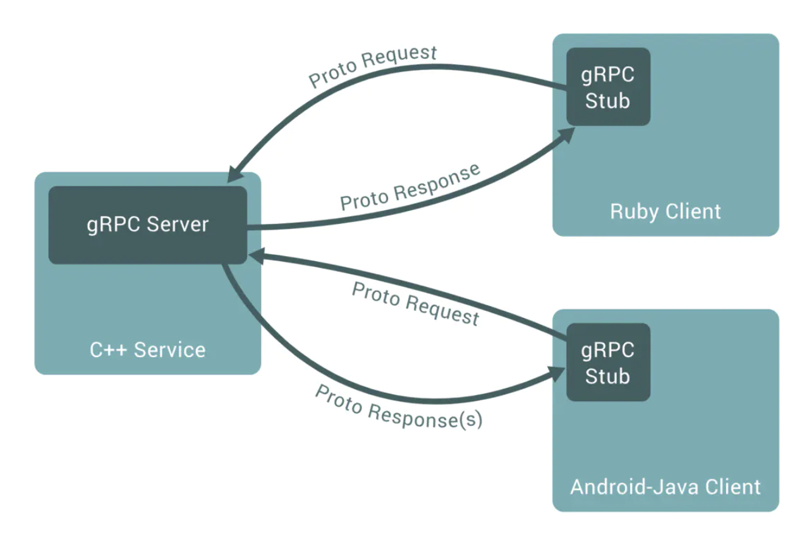

# RPC 和 gRPC 

## **RPC**

**RPC(remote procedure call 远程过程调用)框架实际是提供了一套机制，使得应用程序之间可以进行通信，而且也遵从server/client模型。使用的时候客户端调用server端提供的接口就像是调用本地的函数一样。**

**RPC是一种设计、实现框架，通讯协议只是其中一部分。**它和http协议不是对立的，http协议本身就可以作为RPC框架的传输协议。同时，只要能通过某种方式实现远程过程调用的都可以叫RPC，这本身和http没啥关系。

**RPC的本质是提供了一种轻量无感知的跨进程通信的方式**，在分布式机器上调用其他方法与本地调用无异（远程调用的过程是透明的，你并不知道这个调用的方法是部署在哪里，通过PRC能够解耦服务）。RPC是根据语言的API来定义的，而不是基于网络的应用来定义的，调用更方便，协议私密更安全、内容更小、效率更高。

**典型的RPC模型：**



**为什么需要RPC？**

http接口是在接口不多、系统与系统交互较少的情况下，解决信息孤岛初期常使用的一种通信手段。优点就是简单、直接、开发方便，现成的http协议进行传输。

但是如果是一个大型的网站，内部子系统较多、接口非常多的情况下，RPC框架的好处就显示出来了。

- 首先（基于TCP协议的情况下）就是长链接，减少了网络开销；
- 其次就是RPC框架一般都有注册中心，有丰富的监控管理。发布、下线接口、动态扩展等，对调用方来说是无感知、统一化的操作
- 第三就是安全性。
- 最后就是最近流行的服务化架构、服务化治理，RPC框架是一个强力的支撑。


**实现RPC需要解决的三个问题：**

- 建立通信：

  在客户端与服务端建立起数据传输通道，大都是TCP连接（gRPC使用了HTTP2）。

- 寻址：

  A服务器上的应用需要告诉RPC框架：B服务器地址、端口，调用函数名称。所以必须实现待调用方法到call ID的映射。

- 序列化与反序列化：

  由于网络协议都是二进制的，所以调用方法的参数在进行传递时首先要序列化成二进制，B服务器收到请求后要再对参数进行反序列化。恢复为内存中的表达方式，找到对应的方法进行本地调用，得到返回值。返回值从B到A的传输仍要经过序列化与反序列化的过程。


## **gRPC**

> A high-performance, open-source universal RPC framework
>
> 一个开源、高性能的通用 RPC 框架

gRPC是谷歌开源的一个 RPC 框架，面向移动和 HTTP2.0 设计，带来诸如双向流、流控、头部压缩、单TCP连接上的多路复用等特性。


**gRPC vs Restful API**

既然是server/client模型，那么我们直接用restful api不是也可以满足吗，为什么还需要RPC呢？

gRPC和restful API都提供了一套通信机制，用于server/client模型通信，而且它们都使用http作为底层的传输协议（gRPC使用的http2.0，而restful api则不确定，根据需要选择合适的协议）。但是 gRPC 还有下面一些独特的优势：

- 严格的接口约束。gRPC通过protobuf来定义接口，有更加严格的接口约束条件。
- 高性能。通过protobuf可以将数据序列化为二进制编码，大幅减少传输的数据量，从而大幅提高性能。
- 高安全性。gRPC 框架远程调用服务器的方法，就像在本地调用一样，把很多网络请求的细节都透明化。


**gRPC主要有4种请求／响应模式，分别是：**

- 简单模式（Simple RPC）

  客户端发起一次请求，服务端响应一个数据，即标准RPC通信。

- 服务端数据流模式（Server-side streaming RPC）

  这种模式是客户端发起一次请求，服务端返回一段连续的数据流。典型的例子是客户端向服务端发送一个股票代码，服务端就把该股票的实时数据源源不断的返回给客户端。

- 客户端数据流模式（Client-side streaming RPC）

  与服务端数据流模式相反，这次是客户端源源不断的向服务端发送数据流，而在发送结束后，由服务端返回一个响应。典型的例子是物联网终端向服务器报送数据。

- 双向数据流模式（Bidirectional streaming RPC）

  这是客户端和服务端都可以向对方发送数据流，这个时候双方的数据可以同时互相发送，也就是可以实现实时交互。比如聊天应用。

  

### Protobuf

> Protobuf实际是一套类似Json或者XML的数据传输格式和规范，在不同应用或进程之间进行通信时使用。通信时所传递的信息先通过Protobuf定义的message数据结构进行打包，然后再编译成二进制的码流再进行传输或者存储。
>
> ProtoBuf 具有强大的IDL（interface description language，接口描述语言）和相关工具集（主要是protoc）。用户写好.proto描述文件后，protoc可以将其编译成众多语言的接口代码。

**优点：**

- 足够简单
- 序列化后体积很小：消息大小只需要XML的1/10 ~ 1/3
- 解析速度快：解析速度比XML快20 ~ 100倍
- 多语言支持
- 更好的兼容性，Protobuf设计的一个原则就是要能够很好的支持向下或向上兼容


### 搭建 gRPC 实例

> 示例基于官方文档演示。
>
> https://grpc.io/docs/languages/python/quickstart/

gRPC的使用通常包括如下几个步骤：

1. 通过protobuf来定义接口和数据类型
2. 编写gRPC server端代码
3. 编写gRPC client端代码


**目录结构**

```shell
| -- grpc_test
| -- protos
	| -- greet.proto
| -- packges
	| -- __init__.py
	| -- greet_pb2.py
	| -- greet_pb2_grpc.py
| -- greet_server.py
| -- greet_client.py
```


**安装grpc库**

```shell
# 安装grpc
python3 -m pip3 install grpcio

# 安装grpc工具库
python3 -m pip3 install grpcio-tools
```


**编写 .proto 文件**

> Proto 语法：https://www.jianshu.com/p/da7ed5914088

```protobuf
// 指定proto语法版本
syntax = "proto3";

package packages;

// 定义服务
service GreetService {
  // 定义借口和数据类型
  rpc sayHello(helloRequest) returns (helloResponse) {}
}

// 定义请求数据类型
message helloRequest {
  string name = 1;
}

// 定义响应数据类型
message helloResponse {
  string msg = 1;
}
```


**将 .proto 文件生成对应的 py 文件**

目录结构中的`greet_pb2.py`和`greet_pb2_grpc.py`就是通过 grpc_tools 生成的。在 packges 目录下执行如下命令：

```shell
python -m grpc_tools.protoc -I../protos --python_out=. --grpc_python_out=. ../protos/greet.proto

# -I proto文件所在目录
# --python_out: grpc消息类输出的文件路径
# --grpc_python_out: grpc 服务相关类输出的文件路径

python -m grpc_tools.protoc -I protos --python_out=. --grpc_python_out=. protos/softphone.proto
python -m grpc_tools.protoc -I protos --python_out=grpc_python/yugao/ --grpc_python_out=grpc_python/yugao/ protos/softphone.proto

```


**编写server.py**

```python
import time
from concurrent import futures

import grpc

from packages.greet_pb2 import helloResponse
from packages.greet_pb2_grpc import add_GreetServiceServicer_to_server, GreetServiceServicer


class Hello(GreetServiceServicer):
    # 实现接口
    def sayHello(self, request, context):
        print(f'{request.name} is coming')
        return helloResponse(msg='hello, %s' % request.name)


def serve():
    # 这里通过thread pool来并发处理server的任务
    server = grpc.server(futures.ThreadPoolExecutor(max_workers=10))

    # 将对应的任务处理函数添加到rpc server中
    add_GreetServiceServicer_to_server(Hello(), server)

    # 这里使用的非安全接口，gRPC支持TLS/SSL安全连接，以及各种鉴权机制
    server.add_insecure_port('[::]:50000')
    server.start()

    try:
        while True:
            time.sleep(60 * 60)
    except KeyboardInterrupt:
        pass


if __name__ == '__main__':
    serve()
```


**编写client.py**

```python
import grpc

from packages.greet_pb2 import helloRequest
from packages.greet_pb2_grpc import GreetServiceStub


def run():
    # 使用上下文管理，自动关闭链接
    with grpc.insecure_channel('localhost:50000') as channel:
        # 客户端通过 stub 来实现 rpc 通信
        stub = GreetServiceStub(channel)
        # 调用服务端接口
        res = stub.sayHello(helloRequest(name='zhangjian'))

    print('server message:', res.msg)


if __name__ == '__main__':
    run()
```


### 双向流式接口示例

**proto文件**

```protobuf
syntax = "proto3";

package packages;

service MessageService{
  rpc iter_message(stream MessageRequest) returns (stream MessageResponse){}
}

// 消息类型
enum MsgType {
  START = 0;
  PROGRESS = 1;
  END = 2;
}

// 角色类型
enum Role {
  CUSTOMER = 0;
  AGENT = 1;
}

// 会话消息
message MessageRequest {
  // 消息类型
  MsgType msgType = 1;
  // 包序索引
  int32 msgIndex = 2;
  // 角色信息
  Role role = 3;
  // 数据信息
  string data = 4;
}

// 响应结果
message MessageResponse {
  int32 code = 1;
  string message = 2;
}
```


**server端**

```python
from concurrent import futures
from grpc.experimental import aio

import os
import sys
import json
import grpc
import time
import pathlib

from packages.message_pb2 import MessageResponse, MessageRequest
from packages.message_pb2_grpc import MessageServiceServicer, add_MessageServiceServicer_to_server


class MessageService(MessageServiceServicer):
    def __init__(self, args):
        self.args = args

    def iter_message(self, request_iterator, context):
				
        for data in request_iterator:
            yield MessageResponse(**{"code": 200, "message": "doing"})

            # 解析
            pb_dict = json.loads(json_format.MessageToJson(data,
                                                           including_default_value_fields=True,
                                                           preserving_proto_field_name=True))

            index = pb_dict["msgIndex"]
            msg_type = pb_dict["msgType"]


def serve(instance: YugaoAudioService, threads):
    # 这里通过thread pool来并发处理server的任务
    server = grpc.server(futures.ThreadPoolExecutor(max_workers=2000))

    add_MessageServiceServicer_to_server(instance, server)

    server.add_insecure_port('[::]:19600')
    server.start()

    # server.wait_for_termination()

# ==============================
# 流式接口在python中并发性能很低
# 采用异步处理接口请求可以较为明显的提升性能
# 但即便如此，仍然只能使用单核
class AsyncMessageService(MessageServiceServicer):
    def __init__(self, args):
        self.args

    async def iter_message(self, request_iterator, context):

        async for data in request_iterator:
            yield MessageResponse(**{"code": 200, "message": "doing"})

            # 解析
            pb_dict = json.loads(json_format.MessageToJson(data,
                                                           including_default_value_fields=True,
                                                           preserving_proto_field_name=True))

            index = pb_dict["msgIndex"]
            msg_type = pb_dict["msgType"]


async def async_serve(instance, port):
    # 这里通过thread pool来并发处理server的任务
    server = aio.server(futures.ThreadPoolExecutor(max_workers=2000), options=[
        ('grpc.so_reuseport', 0),
        ('grpc.max_send_message_length', 100 * 1024 * 1024),
        ('grpc.max_receive_message_length', 100 * 1024 * 1024),
        ('grpc.enable_retries', 1),
    ])

    add_MessageServiceServicer_to_server(instance, server)
    server.add_insecure_port(f'[::]:{port}')

    await server.start()
    #await server.wait_for_termination(3600)

```


**client端**

```python
import grpc

from grpc._channel import _MultiThreadedRendezvous

from packages.message_pb2 import MessageRequest
from packages.message_pb2_grpc import MessageServiceStub


def body():
    for i in range(3):
        body = {
            "msgType": i,
            "msgIndex": i
        }
        yield MessageRequest(**body)


def run():
    with grpc.insecure_channel('127.0.0.1:9999') as channel:
        stub = MessageServiceStub(channel)
        res = stub.iter_message(body())

        if isinstance(res, _MultiThreadedRendezvous):
            for i in res:
                print(i)


if __name__ == '__main__':
    run()
```


