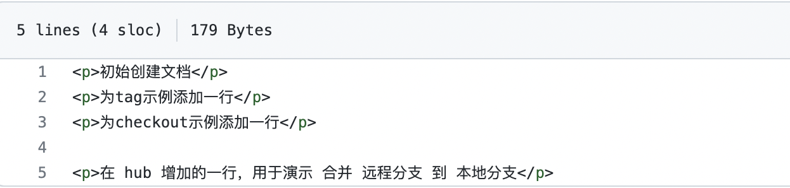
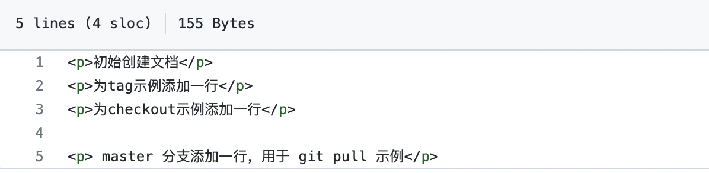
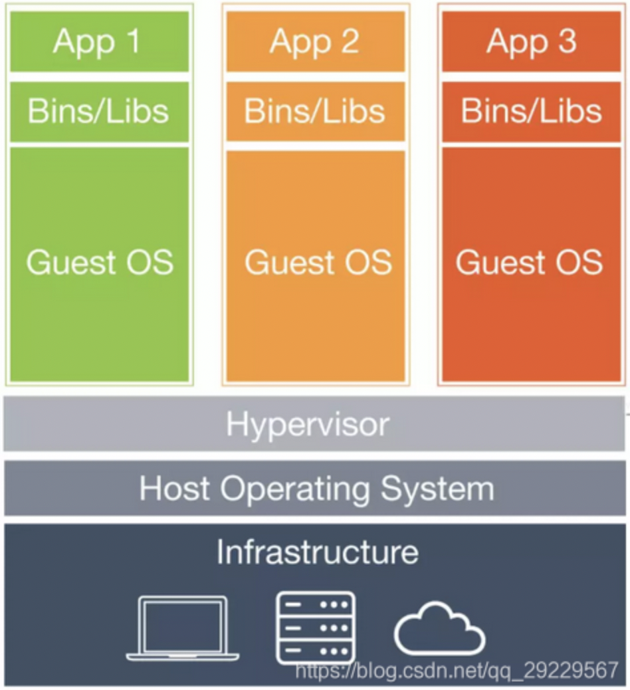
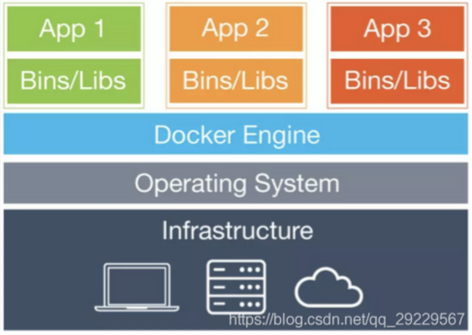

# 理解 DevOps 

DevOps（Development和Operations的组合词）是一种重视“软件开发人员（Dev）”和“IT运维技术人员（Ops）”之间沟通合作的文化、运动或惯例。

**DevOps 强调的是高效组织团队之间如何通过自动化的工具协作和沟通来完成软件的生命周期管理，从而更快、更频繁地交付更稳定的软件**。

DevOps 的三大支柱之中，即人（People）、流程（Process）和平台（Platform）。这里重点介绍 搭建平台 的工具。


# Jenkins


# Git

`git`有四个工作区域，分别是：

- 工作目录（`Workspace`）
- 暂存区（`Index/Stage`）
- 本地仓库（`Repository`）
- 远程仓库（`Remote`）

日常使用最多的应该是下图的6个命令，下图也反映出四个工作区域的关联关系。


> 本文使用 GitHub 上的一个示例仓库 Repo 作为常用命令的示例。


## 常用命令

### git init

`git init`命令的作用是在当前目录中初始化仓库，并且创建一个名为`.git`的子目录，该目录含有你初始化的`git`仓库中所有的必须文件。


### git remote

`git remote`命令的作用主要是管理远程仓库。

1. 查看关联的远程仓库的名称：`git remote`
2. 查看关联的远程仓库的详细信息：`git remote -v`
3. 添加远程仓库的关联：`git remote add <远程仓库名称> <远程仓库地址>`
4. 删除远程仓库的关联：`git remote remove <远程仓库名称>`
5. 修改远程仓库的关联：`git remote set-url <远程仓库名称> <新的远程仓库地址>`
6. 更新远程仓库的分支：`git remote update <远程仓库名称> --prune`


### git clone

`git clone` 克隆远程仓库到本地。拷贝完成后，Git 会在当前目录下生成一个本地项目目录。 通常就是该 URL 最后一个 / 之后的项目名称。当然，也可以在 URL 后面跟上一个你想要的目录名称。

语法：

```shell
git clone [-b <分支名>] url [自定义本地项目目录名称]

# 当项目持续迭代，首次克隆项目可能有好几个G，那么此时则可以只克隆一个分支，且只可能最近一次提交的版本，可以极大的提高首次可能速度
 git clone -b <分支名> --single-branch --depth=1 <url>
```

示例：

```shell
# 克隆一个空的仓库到本地
zhangjian@zhangjiandeMacBook-Pro PycharmProjects % git clone git@github.com:zhangjian-ai/Repo.git
Cloning into 'Repo'...
warning: You appear to have cloned an empty repository.

# 当前目录已创建了一个本地目录
zhangjian@zhangjiandeMacBook-Pro PycharmProjects % ls
AutoTest_MeiDuo		AutomationTestPlat	Repo			automation_test		jmeter_ant		pypi

# 通常克隆时，建议只克隆master分支，其他远程分支不需要克隆
git clone -b master git@github.com:zhangjian-ai/Repo.git
```


### git status

`git status`命令的作用是查看工作区文件状态，**红色表示工作目录的文件被修改但还没有提交到暂存区，绿色表示已经提交到暂存区。**

`git status`命令主要是查看 工作区 文件的修改状态。

以极简的方式显示文件状态：`git status -s`

- `A`：本地新增的文件（服务器上没有）
- `C`：文件的一个新拷贝
- `D`：本地删除的文件（服务器上还在）
- `M`：红色为修改过未被添加进暂存区的，绿色为已经添加进暂存区的
- `R`：文件名被修改
- `T`：文件的类型被修改
- `U`：文件没有被合并(你需要完成合并才能进行提交)
- `X`：未知状态(很可能是遇到`git`的`bug`了，你可以向`git`提交`bug report`)
- `??`：未被`git`进行管理，可以使用`git add fileName`把文件添加进来进行管理

> 已经被修改但还没提交到暂存区的文件，可以通过命令`git checkout -- fileName`撤销更改。


### git log

`git log`命令的作用是查看历史 提交 记录，即 暂存区 的 commit 记录。

1. 查看历史提交记录：`git log`
2. 将每条历史提交记录展示成一行：`git log --oneline`，也可以使用`git log --pretty=oneline`
3. 查看某个人的提交记录：`git log --author="name"`
4. 显示`ASCII`图形表示的分支合并历史：`git log --graph`
5. 显示前`n`条记录：`git log -n`
6. 显示某个日期之后的记录：`git log --after="2018-10-1"`，包含2018年10月1号的记录
7. 显示某个日期之前的记录：`git log --after="2018-10-1`，包含2018年10月1号的记录
8. 显示某两个日期之间的记录：`git log --after="2018-10-1" --before="2018-10-7"`


### git reset

`git reset`命令的作用是撤销暂存区的修改或本地仓库的提交。

1. 撤销已经提交到暂存区的文件（已经`git add`但还未`git commit`）：
   - 撤销已经提交到暂存区的文件：`git reset HEAD fileName`或`git reset --mixed HEAD fileName`
   - 撤销所有提交：`git reset HEAD .`或`git reset --mixed HEAD .`
2. 对已经提交到本地仓库做撤销（已经`git commit`但还未`git push`）：
   - 将头指针恢复，已经提交到暂存区以及工作区的内容都不变：`git reset --soft commit-id`或`git reset --soft HEAD~1`
   - 将头指针恢复并且撤销暂存区的提交，但是工作区的内容不变：`git reset --mixed commit-id`或`git reset --mixed HEAD~1`
   - 将所有内容恢复到指定版本：`git reset --hard commit-id`或`git reset --hard HEAD~1`

注意：`commit id`可通过`git log`查看（取前六位即可）。

> **HEAD 说明：**
>
> - HEAD 表示当前版本
>
> - HEAD^ 上一个版本
>
> - HEAD^^ 上上一个版本
>
> - HEAD^^^ 上上上一个版本
>
> - 以此类推...
>
>   
>
> 可以使用 ～数字 表示：
>
> - HEAD~0 表示当前版本
> - HEAD~1 上一个版本
> - HEAD^2 上上一个版本
> - HEAD^3 上上上一个版本
> - 以此类推...


### git add

`git add`命令的作用是将文件从工作目录添加至暂存区。

1. 把所有修改的信息添加到暂存区：`git add .`
2. 把指定文件的信息添加到暂存区：`git add filename`
3. 把所有跟踪文件中被修改过或已删除的文件信息添加至暂存区：`git add -u`或`git add --update`，它不会处理那些没有被跟踪的文件
4. 把所有跟踪文件中被修改过或已删除文件和所有未跟踪的文件信息添加到暂存区：`git add -A`或`git add --all`


**注意：**`git add .`和`git add -A`在`2.x`版本中提交类型方面功能相同，但会因为所在目录不同产生差异：

- `git add .`只会提交当前目录或者子目录下相应文件。
- `git add -A`无论在哪个目录执行都会提交相应文件。

> 已经被提交到暂存区的文件，可以通过命令`git reset HEAD -- fileName`撤销提交。或者使用`git reset HEAD`撤销此次提交。


在项目目录添加一个文件，内容如下：

```shell
# vi web.html
<p>初始创建文档</p>
```


示例：

```shell
# 添加文件到暂存区
zhangjian@zhangjiandeMacBook-Pro Repo % git add web.html

# 查看文件状态
zhangjian@zhangjiandeMacBook-Pro Repo % git status -s
A  web.html			# 字母 A 此时是 绿色，表示 本地新增文件 已经提交到 暂存区。

# 撤销工作区提交
zhangjian@zhangjiandeMacBook-Pro Repo % git reset HEAD -- web.html

# 再次查看状态
zhangjian@zhangjiandeMacBook-Pro Repo % git status -s
?? web.html  ## 符号 ?? 是红色，表示文件被修改，但还没有提交到暂存区。
```


### git commit

`git commit`命令的作用是将暂存区的修改提交到本地仓库，同时会生成一个`commmit id`。

1. 将暂存区的修改提交到本地仓库：`git commit -m "message"`，`"message"`是本次提交的简述内容，比如添加新功能或修复`bug`等
2. 将工作目录中修改后还未使用`git add .`命令添加到暂存区中的文件也提交到本地仓库：`git commit –a –m "message"`，该命令相当于以下两条命令：
   - `git add .`：把所有修改的信息添加到暂存区
   - `git add -m "message"`：将暂存区的修改提交到本地仓库
3. 撤销上一次提交，并将暂存区文件重新提交（可用于漏掉某个文件的提交或重新编辑提交信息）：`git commit --amend`
   - 如果是commit的内容需要修改，那么可以先修改好文件，然后`git add .`，再执行`git commit --amend`
   - 执行`git commit --amend`后，可以重新编辑上一次的提交信息


示例：

```shell
# 添加到暂存区
zhangjian@zhangjiandeMacBook-Pro Repo % git add .

# 提交到本地仓库
zhangjian@zhangjiandeMacBook-Pro Repo % git commit -m "first time commit"

# 查看提交记录
zhangjian@zhangjiandeMacBook-Pro Repo % git log --oneline
c096fbc (HEAD -> master) first time commit   # commit id: c096fbc
```


### git cherry-pick

合并某个特定的 commit 到指定的分支上。
例如：在A分支上提交了一个commit，B分支也同样需要这个commit的代码，为了避免人工复制代码，可以用git的一些操作替代。


示例：

```shell
# 查看提交的日志，复制要合并的那个分支的commit id(简略ID-前8位数)
git log

# 切换到要合并的分支上
git checkout B

# 提交该commit到当前分支
git cherry-pick commit_id

# 推送到B分支远程仓库
git push origin B的远程分支名
```


### git push

`git push`命令的作用是将本地仓库的更新推送到远程仓库上。

`git push <远程仓库名> <本地分支名>:<远程分支名>`

1. 本地分支名 可不写，默认是 **当前分支**；
2. 远程分支 如果不存在，在 push 的时候将自动创建一个远程分支；
3. 将本地仓库`master`分支的更新推送到远程仓库上：`git push origin master`，也可以直接使用`git push origin`，会将本地分支推送到与之存在追踪关系的远程分支；
4. 删除远程`dev`分支：`git push origin --delete dev`。


示例一：

```shell
# 将本地仓库更新 推送到 远程仓库 的 master 分支
zhangjian@zhangjiandeMacBook-Pro Repo % git push origin master
Enumerating objects: 3, done.
Counting objects: 100% (3/3), done.
Writing objects: 100% (3/3), 244 bytes | 244.00 KiB/s, done.
Total 3 (delta 0), reused 0 (delta 0)
To github.com:zhangjian-ai/Repo.git
 * [new branch]      master -> master  # 此时远程仓库没有 master 分支，就自动创建了一个
```


示例二：

```shell
# push 本地 dev 分支到 远程仓库 dev2 分支。
zhangjian@zhangjiandeMacBook-Pro Repo % git push origin dev:dev2
Enumerating objects: 6, done.
Counting objects: 100% (6/6), done.
Delta compression using up to 8 threads
Compressing objects: 100% (3/3), done.
Writing objects: 100% (4/4), 363 bytes | 363.00 KiB/s, done.
Total 4 (delta 1), reused 0 (delta 0)
remote: Resolving deltas: 100% (1/1), completed with 1 local object.
remote:
remote: Create a pull request for 'dev2' on GitHub by visiting:
remote:      https://github.com/zhangjian-ai/Repo/pull/new/dev2
remote:
To github.com:zhangjian-ai/Repo.git
 * [new branch]      dev -> dev2
 
# 查看远程仓库，新创建分支 dev2
zhangjian@zhangjiandeMacBook-Pro Repo % git branch -a
* dev
  master
  test
  remotes/origin/dev
  remotes/origin/dev2
  remotes/origin/master
  
# 删除远程仓库分支 dev2
zhangjian@zhangjiandeMacBook-Pro Repo % git push origin --delete dev2
To github.com:zhangjian-ai/Repo.git
 - [deleted]         dev2
 
# 再次查看远程仓库， dev2 分支已被删除
zhangjian@zhangjiandeMacBook-Pro Repo % git branch -a
* dev
  master
  test
  remotes/origin/dev
  remotes/origin/master
```


### git branch

`git branch`命令的作用主要是做 **本地分支** 管理操作。

1. 查看本地分支：`git branch`
2. 查看本地和远程分支：`git branch -a`
3. 基于源分支新建名字为`test`的本地分支，源分支是可选的，如果不写则默认基于master分支创建：`git branch test <源分支>`
4. 将`test`分支名字改为`dev`：`git branch -m test dev`
5. 删除名字为`dev`的本地分支：`git branch -d dev`


示例：

```shell
# 创建 本地分支 test
zhangjian@zhangjiandeMacBook-Pro Repo % git branch test

zhangjian@zhangjiandeMacBook-Pro Repo % git branch
* master
  test
  
# 将`test`分支名字改为`dev`
zhangjian@zhangjiandeMacBook-Pro Repo % git branch -m test dev

zhangjian@zhangjiandeMacBook-Pro Repo % git branch
  dev
* master

# 删除名字为`dev`的分支
zhangjian@zhangjiandeMacBook-Pro Repo % git branch -d dev
Deleted branch dev (was c096fbc).

zhangjian@zhangjiandeMacBook-Pro Repo % git branch
* master
```


### git tag

`git tag`命令主要是对项目标签进行管理。

1. 查看已有的标签历史记录：`git tag`
2. 给当前最新的`commit`打上标签：`git tag <标签的定义>`
3. 给对应的`commit id`打上标签：`git tag <标签定义> <commit id>`


示例：

```shell
# 编辑 web.html 增加一行内容：vi web.html
<p>为tag示例添加一行</p>

# 提交 工作区更新 到 暂存区
zhangjian@zhangjiandeMacBook-Pro Repo % git add web.html

# 提交 提交暂存区更新 到 本地仓库
zhangjian@zhangjiandeMacBook-Pro Repo % git commit -m "add new label for tag"
[master ad39985] add new label for tag
 1 file changed, 1 insertion(+)

# 给 当前最新的 commit 打上 tag
zhangjian@zhangjiandeMacBook-Pro Repo % git tag v1.0.0

# 查看标签
zhangjian@zhangjiandeMacBook-Pro Repo % git tag
v1.0.0

# 提交到远程分支
zhangjian@zhangjiandeMacBook-Pro Repo % git push origin master:master
```


### git checkout

`git checkout`命令最常用的情形是创建和切换分支以及撤销工作区的修改。

1. 切换到`tag`为`v1.0.0`时对应的代码：`git checkout v1.0.0`
2. 在`tag`为`v1.0.0`的基础上创建分支名为`test`的分支：`git checkout -b test v1.0.0`，该命令相当于以下两条命令：
   - `git branch test v1.0.0`：在`v1.0.0`的基础上创建分支`test`
   - `git checkout test`：切换到分支`test`
3. 撤销工作目录中文件的修改（文件有改动但还未执行`git add`）：`git checkout -- fileName`，或者撤销所有修改使用`git checkout .`

**注意：**在 test 分支上进行的修改操作后，若没有使用`git add .`及`git commit`命令把 更新 提交到 本地仓库 ，直接使用 git checkout 切换回 master 分支的话，那么 Git 会将在 test 上的修改一起带到 master 分支。


示例：

```shell
# 基于 tag v1.0.0 创建分支 dev
zhangjian@zhangjiandeMacBook-Pro Repo % git checkout -b dev v1.0.0
Switched to a new branch 'dev'

# 向 web.html 追加如下内容
<p>为checkout示例添加一行</P>

# 查看文档内容
zhangjian@zhangjiandeMacBook-Pro Repo % cat web.html
<p>初始创建文档</p>
<p>为tag示例添加一行</p>
<p>为checkout示例添加一行</P>

# 将更新提交到 本地仓库
zhangjian@zhangjiandeMacBook-Pro Repo % git add .
zhangjian@zhangjiandeMacBook-Pro Repo % git commit -m "add one row for checkout"
[dev 15f7d19] add one row for checkout
 1 file changed, 1 insertion(+)
 
# 将 本地仓库 dev 推送到 远程仓库 dev
zhangjian@zhangjiandeMacBook-Pro Repo % git push origin dev
Enumerating objects: 5, done.
Counting objects: 100% (5/5), done.
Delta compression using up to 8 threads
Compressing objects: 100% (2/2), done.
Writing objects: 100% (3/3), 323 bytes | 323.00 KiB/s, done.
Total 3 (delta 0), reused 0 (delta 0)
remote:
remote: Create a pull request for 'dev' on GitHub by visiting:
remote:      https://github.com/zhangjian-ai/Repo/pull/new/dev
remote:
To github.com:zhangjian-ai/Repo.git
 * [new branch]      dev -> dev  # 远程仓库 没有dev分支，就自动创建了一个
 
# 切换 分支到 tag v1.0.0
zhangjian@zhangjiandeMacBook-Pro Repo % git checkout v1.0.0

# 查看文档内容
zhangjian@zhangjiandeMacBook-Pro Repo % cat web.html
<p>初始创建文档</p>
<p>为tag示例添加一行</p>
```


### git fetch

`git fetch`命令的作用是将 远程仓库 上的更新同步到 本地仓库，并记录在`.git/FETCH_HEAD`中

1. 同步远程仓库上所有分支的更新：`git fetch origin`
2. 同步远程仓库上`master`分支的更新：`git fetch origin master`
3. 在本地新建`test`分支，并将远程仓库上`master`分支代码下载到本地`test`分支：`git fetch origin master:test`


示例：

```shell
# 在本地新建`test`分支，并将远程仓库上`master`分支代码下载到本地`test`分支
zhangjian@zhangjiandeMacBook-Pro Repo % git fetch origin master:test
From github.com:zhangjian-ai/Repo
 * [new branch]      master     -> test
 
# 切换到 分支 test
zhangjian@zhangjiandeMacBook-Pro Repo % git checkout test
Switched to branch 'test'

# 查看文本
zhangjian@zhangjiandeMacBook-Pro Repo % cat web.html
<p>初始创建文档</p>
<p>为tag示例添加一行</p>
```


### git merge/git rebase

`git merge`命令的作用主要是分支的合并。

1. 如果当前是`master`分支，需要合并`dev`分支：`git merge dev`
2. 配合`git fetch`命令，合并 远程分支 的更新 到 本地分支

**注意：**通过`git fetch`所取回的更新，在本地仓库上需要用“远程仓库名/分支名”的形式读取，比如`origin`仓库的`master`分支，就需要用`origin/master`来读取。


示例一：合并 本地仓库 分支 到 本地仓库 分支

```shell
# 切换到 master 分支
zhangjian@zhangjiandeMacBook-Pro Repo % git checkout master
Switched to branch 'master'

# 合并 本地仓库的dev分支 到 master
zhangjian@zhangjiandeMacBook-Pro Repo % git merge dev
Updating ad39985..15f7d19
Fast-forward
 web.html | 1 +
 1 file changed, 1 insertion(+)
 
# 查看文件
zhangjian@zhangjiandeMacBook-Pro Repo % cat web.html
<p>初始创建文档</p>
<p>为tag示例添加一行</p>
<p>为checkout示例添加一行</p>
```


示例二：合并 远程分支 到 本地分支

在 GitHub 上更新 远程仓库 dev分支 的文档内容如下：



```shell
# 切换本地仓库分支到 dev
zhangjian@zhangjiandeMacBook-Pro Repo % git checkout dev
Switched to branch 'dev'

# fetch 远程仓库的dev分支
zhangjian@zhangjiandeMacBook-Pro Repo % git fetch origin dev
remote: Enumerating objects: 5, done.
remote: Counting objects: 100% (5/5), done.
remote: Compressing objects: 100% (2/2), done.
remote: Total 3 (delta 0), reused 0 (delta 0), pack-reused 0
Unpacking objects: 100% (3/3), done.
From github.com:zhangjian-ai/Repo
 * branch            dev        -> FETCH_HEAD
   15f7d19..566527a  dev        -> origin/dev
   
# merge 远程dev 到 本地dev
zhangjian@zhangjiandeMacBook-Pro Repo % git merge origin/dev
Updating 15f7d19..566527a
Fast-forward
 web.html | 2 ++
 1 file changed, 2 insertions(+)
 
# 查看文本内容
zhangjian@zhangjiandeMacBook-Pro Repo % cat web.html
<p>初始创建文档</p>
<p>为tag示例添加一行</p>
<p>为checkout示例添加一行</p>

<p>在 hub 增加的一行，用于演示 合并 远程分支 到 本地分支</p>
```


**git merge和git rebase的区别**

> git merge和git rebase从最终效果来看没有任何区别，都是将不同分支的代码融合在一起。

1. git log的区别
   - merge：将子分支的所有提交 在主分支记录成一次commit，保留在主分支记录中。
   - rebase：不会在主分支自动生成 commit记录，而是直接将分支中的内容排到master的记录之后。
2. 处理冲突
   - 使用merge命令合并分支，解决完冲突，执行git add .和git commit -m 'fix conflict'。这个时候会产生一个commit。
   - 使用rebase命令合并分支，解决完冲突，执行git add .和git rebase --continue，不会产生额外的commit。这样的好处是，‘干净’，分支上不会有无意义的解决分支的commit；坏处，如果合并的分支中存在多个commit，需要重复处理多次冲突。分支会恢复到rebase开始前的状态 git rebase --abort。

**注意点：**

​		假如使用rebase，一定要遵守rebase黄金法则，共享的public分支不能rebase。通俗的说，当一个分支是一个人开发处理的，才可以rebase，假如一个分支被多个人共享开发，然后rebase，那就乱套了，处理起来复杂。


### git pull

`git pull`命令的作用是获取远程仓库的更新，再与本地分支合并。`git pull <远程仓库名> <远程分支名>:<本地分支名>`

1. 取回远程仓库上的`dev`分支与本地的`master`分支合并：`git pull origin dev:master`
2. 取回远程仓库上的`dev`分支与当前分支合并：`git pull origin dev`，该命令相当于以下两条命令：
   - `git fetch origin dev`：获取远程仓库上`dev`分支的更新
   - `git merge origin/dev`：合并远程`dev`分支到当前分支


示例：



```shell
# 查看当前所在分支，如果不在就切到master
zhangjian@zhangjiandeMacBook-Pro Repo % git branch
  dev
* master
  test
  
# pull 远程仓库的 master 合并到 本地仓库 master
zhangjian@zhangjiandeMacBook-Pro Repo % git pull origin master
remote: Enumerating objects: 5, done.
remote: Counting objects: 100% (5/5), done.
remote: Compressing objects: 100% (2/2), done.
remote: Total 3 (delta 0), reused 0 (delta 0), pack-reused 0
Unpacking objects: 100% (3/3), done.
From github.com:zhangjian-ai/Repo
 * branch            master     -> FETCH_HEAD
   15f7d19..4cf0fcf  master     -> origin/master
Updating 15f7d19..4cf0fcf
Fast-forward
 web.html | 2 ++
 1 file changed, 2 insertions(+)
 
# 查看文本内容
zhangjian@zhangjiandeMacBook-Pro Repo % cat web.html
<p>初始创建文档</p>
<p>为tag示例添加一行</p>
<p>为checkout示例添加一行</p>

<p> master 分支添加一行，用于 git pull 示例</p>
```


### git stash

`git stash`命令的作用是保存当前分支工作目录所做的修改。

**即如果当前分支所做的修改你还不想提交，但又需要切换到其他分支去查看，就可以使用该命令。**

1. 保存当前进度：`git stash`
2. 查看已经保存的历史进度记录：`git stash list`
3. 重新应用某个已经保存的进度，并且删除进度记录：`git stash pop <历史进度id>`，
4. 重新应用某个已经保存的进度，但不删除进度记录：`git stash apply <历史进度id>`，如果直接使用`git stash`默认是使用最近的保存
5. 删除某个历史进度：`git stash drop <历史进度id>`
6. 删除所有的历史进度：`git stash clear`


示例：

```shell
# 切换到 test 分支
zhangjian@zhangjiandeMacBook-Pro Repo % git checkout test
Switched to branch 'test'

# 编辑 web.html 追加如下内容：
<p> 为 git stash 添加一行</p>

# 查看 test 分支的文本内容
zhangjian@zhangjiandeMacBook-Pro Repo % cat web.html
<p>初始创建文档</p>
<p>为tag示例添加一行</p>

<p> 为 git stash 添加一行</p>

# 保存 当前分支的修改
zhangjian@zhangjiandeMacBook-Pro Repo % git stash
Saved working directory and index state WIP on test: ad39985 add new label for tag

# 查看保存记录
zhangjian@zhangjiandeMacBook-Pro Repo % git stash list
stash@{0}: WIP on test: ad39985 add new label for tag

# 切换到 master 分支查看文本内容
zhangjian@zhangjiandeMacBook-Pro Repo % git checkout master
Switched to branch 'master'

zhangjian@zhangjiandeMacBook-Pro Repo % cat web.html  # test 分支的修改没有带到master分支
<p>初始创建文档</p>
<p>为tag示例添加一行</p>
<p>为checkout示例添加一行</p>

<p> master 分支添加一行，用于 git pull 示例</p>

# 再切回 test 分支，并查看文档内容
zhangjian@zhangjiandeMacBook-Pro Repo % git checkout test
Switched to branch 'test'

zhangjian@zhangjiandeMacBook-Pro Repo % cat web.html  # 切回 test 并不会自动应用刚才保存的修改记录
<p>初始创建文档</p>
<p>为tag示例添加一行</p>

# 应用保存的进度，再查看文档内容
zhangjian@zhangjiandeMacBook-Pro Repo % git stash apply stash@{0}

zhangjian@zhangjiandeMacBook-Pro Repo % cat web.html
<p>初始创建文档</p>
<p>为tag示例添加一行</p>

<p> 为 git stash 添加一行</p>
```


### git diff

`git diff` 命令比较文件的不同，即比较文件在暂存区和工作区的差异。

1. 尚未缓存的改动：`git diff [file]`

2. 查看已缓存的改动： `git diff --cached [file]`
3. 查看已缓存的与未缓存的所有改动：`git diff HEAD [file]`
4. 显示摘要而非整个 diff：`git diff --stat [file]`


示例：

```shell
# 查看本地还没执行 git add 的文件的改动
zhangjian@zhangjiandeMacBook-Pro Repo % git diff web.html
diff --git a/web.html b/web.html
index 1f7dba6..84a4dc9 100644
--- a/web.html
+++ b/web.html
@@ -1,2 +1,4 @@
 <p>初始创建文档</p>
 <p>为tag示例添加一行</p>
+
+<p> 为 git stash 添加一行</p>
```


### git rm

git rm 命令用于删除文件。

1. 将文件从暂存区中删除：`git rm <file>`

2. 如果删除之前修改过并且已经放到暂存区域的话，则必须要用强制删除选项 **-f**：`git rm -f <file> `

3. 如果想把文件从暂存区域移除，但仍然希望保留在当前工作目录中，换句话说，仅是从跟踪清单中删除，使用 **--cached** 选项即可：`git rm --cached <file>`

4. 删除暂存区所有的文件：

   ```shell
   # -r 递归删除
   git rm -r --cached .
   ```

   

### git blame

如果要查看指定文件的修改记录可以使用 git blame 命令，格式如下：`git blame <file>`


示例：

```shell
# 可以清晰的看到每一次的修改记录
zhangjian@zhangjiandeMacBook-Pro Repo % git blame web.html
^c096fbc (zhangjian 2021-12-02 18:21:50 +0800 1) <p>初始创建文档</p>
ad39985d (zhangjian 2021-12-02 22:16:06 +0800 2) <p>为tag示例添加一行</p>
15f7d190 (zhangjian 2021-12-02 22:42:21 +0800 3) <p>为checkout示例添加一行</p>
566527a2 (张建      2021-12-02 23:33:55 +0800 4)
566527a2 (张建      2021-12-02 23:33:55 +0800 5) <p>在 hub 增加的一行，用于演示 合并 远程分支 到 本地分支</p>
```


### git submodule

> 该命令的作用主要是在当前主项目中，引入其他的git仓库，这个子仓库作为一个独立的仓库存在于主项目中。适用于主工程中引入其他library库。
>
> 子模块的更新需要在子模块目录下单独执行，主项目的更新提交不会影响子模块的版本，二者相互独立。

#### 添加子模块

执行添加命令成功后，可以在当前路径中看到一个.gitsubmodule文件，里面记录的就是自模块相关的信息

```shell
git submodule add <url> <path>

# url：子模块仓库地址
# path：子模块存放的本地路径

# 如果在添加子模块的时需要指定同步代码的具体分支，可以利用 -b 参数
git submodule add -b <branch> <url> <path>
```


#### 初始化

当我们add子模块之后，会发现文件夹下没有任何内容。这个时候我们需要再执行下面的指令添加源码。

```shell
# 进入到子模块目录下执行下面的命令，即 add 时的 path
git submodule update --init --recursive
```

这个命令是下面两条命令的合并版本

```shell
git submodule init
git submodule update
```


#### 更新

引入了别人的仓库后，如果该仓库作者进行了更新，我们需要手动进行同步更新

```shell
# 进入子模块目录执行
git pull
```


#### 删除

1. 删除子模块目录及源码`rm -rf 子模块目录`
2. 删除.gitmodules中的对应子模块内容`vi .gitmodules`
3. 删除.git/config配置中的对应子模块内容`vi .git/config`
4. 删除.git/modules/下对应子模块目录`rm -rf .git/modules/子模块目录`
5. 删除git索引中的对应子模块`git rm --cached 子模块目录`


# Docker

## Docker 命令

### 基础命令

```shell
docker search mysql															# 搜索官方仓库中 mysql 相关的镜像
docker pull ${CONTAINER NAME}                    #拉取镜像。如果镜像前没有指定仓库，那么久默认到官方仓库拉取镜像
docker images                                    #查看本地所有镜像
docker ps                                        #查看所有正在运行的容器，加-q则只返回id
docker ps -a                                     #查看所有容器，加-q则只返回id
docker rmi ${IMAGE NAME/ID}                      #删除镜像
docker rm ${CONTAINER NAME/ID}                   #删除容器

docker save ${IMAGE NAME} > ${FILE NAME}.tar     #将镜像保存成文件
docker save -o ${FILE NAME}.tar ${IMAGE NAME}

docker load < ${FILE NAME}.tar                   #从文件加载镜像
docker load -i ${FILE NAME}.tar  

docker start/restart ${CONTAINER NAME/ID}        #启动/重启一个以前运行过的容器
docker stop ${CONTAINER NAME/ID}                 #停止一个正在运行的容器

docker logs ${CONTAINER NAME/ID}                 #显示运行容器的日志
		##查看redis容器日志，默认参数
		docker logs rabbitmq
		##查看redis容器日志，参数：-f  跟踪日志输出；-t   显示时间戳；--tail  仅列出最新N条容器日志；
		docker logs -f -t --tail=20 redis
		##查看容器redis从2019年05月21日后的最新10条日志。
		docker logs --since="2019-05-21" --tail=10 redis

docker run [选项参数] ${IMAGE NAME} [命令行参数]    #运行一个容器
    --name ${container name}                          #设置容器名称
    -p ${host port}:${container port}                 #映射主机和容器内的端口
    -e ${env name}=${env value}                       #添加环境变量
    -d                                                #后台运行
    -v ${host folder path}:${container folder path}   #将主机目录挂在到容器内
    --restart=always																	#容器随系统自启
    	no – 默认值，如果容器挂掉不自动重启
			on-failure – 当容器以非 0 码退出时重启容器，同时可接受一个可选的最大重启次数参数 (e.g. on-failure:10)
			always – 不管退出码是多少都要重启
			
		--link <origin container name/id>:alias				# 让容器之间即便不对外暴露端口，也可以实现通信
			# 创建并启动名为selenium_hub的容器
			docker run -d --name selenium_hub selenium/hub
			
			# 创建并启动名为node的容器，并把该容器和名为selenium_hub的容器链接起来。
			docker run -d --name node --link selenium_hub:hub selenium/node-chrome-debug
			
			# 说明：
			# selenium_hub是上面启动的1cbbf6f07804（容器ID）容器的名字，这里作为源容器，hub是该容器在link下的别名（alias），通俗易懂的讲，站在node容器的角度，selenium_hub和hub都是1cbbf6f07804容器的名字，并且作为容器的hostname，node用这2个名字中的哪一个都可以访问到1cbbf6f07804容器并与之通信（docker通过DNS自动解析）。
```


### 高级命令

```shell
docker ps -f "status=exited"                                   #显示所有退出的容器
docker ps -a -q                                                #显示所有容器id
docker ps -f "status=exited" -q                                #显示所有退出容器的id
docker restart $(docker ps -q)                                 #重启所有正在运行的容器
docker stop $(docker ps -a -q)                                 #停止所有容器
docker rm $(docker ps -a -q)                                   #删除所有容器
docker rm $(docker ps -f "status=exited" -q)                   #删除所有退出的容器
docker rm $(docker stop $(docker ps -a -q))                    #停止并删除所有容器
docker start $(docker ps -a -q)                                #启动所有容器
docker rmi $(docker images -a -q)                              #删除所有镜像

docker image prune -f -a																				# 清理镜像

docker top ${CONTAINER NAME/ID}                                #显示一个容器的top信息

docker kill -s KILL [container id]														# 杀死一个或多个指定容器进程

docker stats                                                   #显示容器统计信息(正在运行)
    docker stats -a                                            #显示所有容器的统计信息(包括没有运行的)
    docker stats -a --no-stream                                #显示所有容器的统计信息(包括没有运行的) ，只显示一次
    docker stats --no-stream | sort -k8 -h                     #统计容器信息并以使用流量作为倒序
    
docker system 
      docker system df           #显示硬盘占用
      docker system events       #显示容器的实时事件
      docker system info         #显示系统信息
      docker system prune        #清理文件
      
docker build      
    # 构建docker镜像 -f 指定 Dockerfile 文件；-t 指定镜像名称及tag
    docker build -f /docker/dockerfile/mycentos -t mycentos:1.1
    
    # 如果当前目录下存在名为 Dockerfile 的文件，那么可以向下面这样构建。注意： . 表示当前目录，其他目录同理
    docker build -t xx/gitlab .			# 构建时，可以指定镜像仓库（XX），不指定 tag 时，使用latest作为tag
    
docker commit
		# 将运行中的容器打包成一个镜像
		# 参数：-a 提交的镜像作者；-c 使用Dockerfile指令来创建镜像；-m :提交时的说明文字；-p :在commit时，将容器暂停
		docker commit -m "描述信息" 容器名/容器ID 镜像名:镜像Tag 
		docker commit -m "description info" TP_web web:latest

docker push
		# 将本地镜像push到仓库之前，要保证镜像已经指定归属仓库并打了tag。如下，给一个镜像指定仓库
		docker tag nginx:latest zhangjian1/nginx:latest
		
		# push 到Hub仓库 zhangjian1，这里需要客户端登陆
		docker login --username=[username] --password=[password]
		
		# push 镜像。
		docker push zhangjian1/nginx:latest
		
docker cp
		##将rabbitmq容器中的文件copy至本地路径
		docker cp rabbitmq:/[container_path] [local_path]
		
		##将主机文件copy至rabbitmq容器的目录中（以/结尾表示目录）
		docker cp [local_path] rabbitmq:/[container_path]/
		
		##将主机文件copy至rabbitmq容器，目录重命名为[container_path]（注意与非重命名copy的区别）
		docker cp [local_path] rabbitmq:/[container_path]
		
docker exec
		# 参数：-i  交互式模式；-t  分配一个伪终端
		docker exec -it ${CONTAINER NAME/ID} /bin/bash                 #进入容器内。/bin/bash 表示伪终端使用的shell程序
		
		# 以交互模式在容器中执行命令，结果返回到当前终端屏幕
		docker exec -i -t centos ls -l /tmp
		
		# 以分离模式在容器中执行命令，程序后台运行，结果不会反馈到当前终端
		docker exec -d centos touch cache.txt 
		
docker network
		# 查看网络连接
		docker network ls
		
		# 检查网络连接详情
		docker network inspect 网络名称/网络ID
		
		# 容器连接网络
		docker network connect <network> <container>
		
		# 容器断开网络连接，-f 表示强制
		docker network disconnect [-f] <network> <container>
		
		# 创建网络
		docker network create <network>
		# 创建网络，指定子网网段和网关。demo_02 就是 网络的名字。通过 docker network inspect demo_02 即可查看新建网络详情
		docker network create --subnet 172.36.0.0/24 --gateway 172.36.0.1 demo_02
		
		# 创建自定义网络后，则可以在启动容器时，用 --net 指定网络，用 --ip 申明当前容器的ip
		
		# 删除网络
		docker network rm <network>
		
		# 删除所有没有使用的网络
		docker network prune
		
dokcer inspect
		# 获取容器/镜像的元数据
		docker inspect [OPTIONS] NAME|ID [NAME|ID...]
		
		# options
			-f :指定返回值的模板文件。
			-s :显示总的文件大小。
			--type :为指定类型返回JSON。
```


## Docker 进阶

### Dockerfile 语法

> ##  FROM
>
> 格式：
>
> - `FROM \<image\>`
> - `FROM \<image\>:\<tag\>`
> - `FROM \<image\>@\<digest\>`
>
> Dockerfile中的第一条指令必须是FROM，FROM指令指定了构建镜像的base镜像
>
> ## MAINTAINER
>
> 格式：`MAINTAINER \<name\> \<Email\>`
>
> 编写维护Dockerfile的作者信息
>
> ## ENV
>
> 格式：
>
> - `ENV \<key\>\<value\>`
> - `ENV \<key\>=\<value\>`
>
> 两者的区别就是第一种是一次设置一个，第二种是一次设置多个
>
> 为容器声明环境变量，环境变量在子镜像中也可以使用。
>
> 可以直接使用环境变量 $variable_name，运行容器指定环境变量：`docker run --env <key>=<value>`
>
> ## ARG
> 语法：
>ARG `<name>`[=`<default value>`]
> 设置变量命令，ARG命令定义了一个变量，在docker build创建镜像的时候，使用 --build-arg `<varname>`=`<value>`来指定参数
>如果用户在build镜像时指定了一个参数没有定义在Dockerfile种，那么将有一个Warning
> 
>## RUN
> 
>格式：
> 
>- `RUN \<command\>` (类似`/bin/sh -c`shell格式)
> - `RUN ["executable", "param1", "param2"]` (exec格式)
>
> **第一种** 使用shell格式时，命令通过`/bin/sh -c`执行;
>
> **第二种** 使用`exec`格式时，命令直接执行，容器不调用shell，并且`exec`格式中的参数会看作是`JSON` 数组被Docker解析，所以要用(")双引号，不能用单引号(')。
>
> 举例： `RUN [ "echo", "$HOME" ]`$HOME变量不会被替换,如果你想运行shell程序，使用：`RUN [ "sh", "-c", "echo", "$HOME" ]`
>
> ## COPY
> 
>格式：COPY <src><dest>
> 
>拷贝本地<src>目录下的文件到容器中<dest>目录。
> 
>## ADD
> 
>格式：
> 
> - ADD <src><dest>
> - ADD ["",... ""]
>
> `ADD hom* /mydir/` 从<src>目录下拷贝文件，目录或网络文件到容器的<dest>目录。和COPY非常相似，但比COPY功能多，拷贝的文件可以是一个网络文件，并且ADD有解压文件的功能，目前好像只能解压tar文件。
>
> ## CMD
>
> 格式：
>
> - `CMD \<commadn\> param1 param2`(shell格式)
> - `CMD ["executable", "param1", "param2"]` （exex格式）
> - `CMD ["param1", "param2"]`（为ENTRYPOINT命令提供参数）
> 
>虽然有三种格式，但在Dockerfile中如果有多个CMD命令，只有最后一个生效。
> 
>`CMD`命令主要是提供容器运行时得默认值。默认值，可以是一条指令，也可以是参数（ENTRYPOINT 的参数），`CMD`命令参数是一个动态值，信息会保存到镜像的JSON文件中。
> 
>举例：
> 
>```
> ENTRYPOINT ["executable"]
> CMD ["param1", "param2"]
>```
> 
>启动容器执行：`["executable", "param1", "param2"]` **注意：** 如果在命令行后面运行`docker run`时指定了命令参数，则会把`Dockerfile`中定义的`CMD`命令参数覆盖
> 
> ## ENTRYPOINT
>
> 格式：
>
> - `ENTRYPOINT \<command\>` (shell格式)
>- `ENTRYPOINT ["executable", "param1", "param2"]`（exec格式）
> 
>`ENTRYPOINT`和`CMD`命令类似，也是提供容器运行时得默认值，但它们有不同之处。同样一个Dockerfile中有多个ENTRYPOINT命令，只有最后一个生效。
> 
>- 当`ENTRYPOINT`命令使用<commmand>格式，`ENTRYPOINT`会忽略任何`CMD`指令和`docker run `传来的参数，直接运行在`/bin/sh -c`中;也就是说`ENTRYPOINT`执行的进程会是`/bin/sh -c`的**子进程**。所以进程的PID不会是1，而且也不能接受Unix信号。（执行docker stop $container_id的时候，进程接收不到SIGTERM信号）
> - 使用`exec`格式，`docker run`传入的命令参数会覆盖`CMD`命令，并附加到`ENTRYPOINT`命令的参数中。推荐使用`exec`方式
>
> ## ONBUILD
>
> 格式：`ONBUILD [INSTRUCTION]`
>
> `ONBUILD`指令的功能是添加一个将来执行触发器指令到镜像中。当Dockerfile中`FROM`的镜像中包含`ONBUILD`指令，在构建此镜像的时候会触发`ONBUILD`指令。但如果当前Dockerfile中存在`ONBUID`指令，不会执行就。`ONBUILD`指令在生成**应用镜像**时用处非常大。
>
> **`ONBUILD`如何工作**
>
> 1.构建过程中，`ONBUILD`指令会添加到触发器指令镜像元数据中。触发器指令不会在当前构建过程中生效
>
> 2.构建完后，触发器指令会被保存到镜像的详情中，主键是`OnBuild`，可以使用`docker inspect`命令查看到
>
> 3.之后此镜像可能是构建其他镜像的父镜像，在构建过程中，`FROM`指令会查找`ONBUILD`触发器指令，并按照之前定义的顺序执行；如果触发器指令执行失败，则构建新镜像失败并退出；如果触发器指令执行成功，则继续往下执行。
>
> 4.构建成功后`ONBUILD`指令清除，固不会被孙子辈镜像继承。
>
> ## VOLUME
>
> 格式：`VOLUME ["/data"]`
>
> 为docker主机和容器做目录映射，volume目录信息会保存到镜像的JSON文件中，在运行`docker run`命令时指定`$HOST_DIR`
>
> ## LABEL
>
> 格式：`LABEL <key>=<value> <key>=<value> <key>=<value> ...`
>
> LABEL指令，添加一个元数据到镜像中。一个镜像中可以有多个标签，建议写一个（因为没多个LABEL指令镜像会多一个`layer`）`LABEL`是一个键值对<key><value>，在一个标签值,包括空间使用引号和反斜杠作为您在命令行解析。 举例： `LABEL multi.label1="value1" multi.label2="value2" other="value3"`
>
> ## EXPOSE
>
> 格式：`EXPOSE <port> [<port>...]`
>
> 在Dockerfile中定义端口，默认是不往外暴露，在运行`docker run ``-p` or `-P`暴露
>
> ## USER
>
> 格式：`USER daemon`
>
> 设定一个用户或者用户ID,在执行`RUN``CMD``ENTRYPOINT`等指令时指定以那个用户得身份去执行
>
> ## WORKDIR
> 
> 格式：`WORKDIR /path/to/workdir`
> 
> 当执行`RUN``CMD``ENTRYPOINT``ADD``CMD`等命令，设置工作目录


### .dockerignore 文件

如果在Dockerfile文件目录下有.dockerignore文件，docker在构建镜像的时候会把在.dockerignore文件中定义的文件排除出去

```shell
*/temp*
*/*/temp*
temp?
*.md
!LICENSE.md
```


### Docker 底层原理

#### docker 进程与宿主机如何实现隔离

命名空间 (namespaces) 是 Linux 为我们提供的用于分离进程树、网络接口、挂载点以及进程间通信等资源的方法。在日常使用 Linux 或者 macOS 时，我们并没有运行多个完全分离的服务器的需要，但是如果我们在服务器上启动了多个服务，这些服务其实会相互影响的，每一个服务都能看到其他服务的进程，也可以访问宿主机器上的任意文件，这是很多时候我们都不愿意看到的，我们更希望运行在同一台机器上的不同服务能做到完全隔离，就像运行在多台不同的机器上一样。

**Docker 其实就通过 Linux 的 Namespaces 对不同的容器实现了隔离。**

Linux 的命名空间机制提供了以下七种不同的命名空间，包括 `CLONE_NEWCGROUP`、`CLONE_NEWIPC`、`CLONE_NEWNET`、`CLONE_NEWNS`、`CLONE_NEWPID`、`CLONE_NEWUSER` 和 `CLONE_NEWUTS`，通过这七个选项我们能在创建新的进程时，设置新进程应该在哪些资源上与宿主机器进行隔离。


#### Docker 容器与传统 VM 虚拟机的区别

容器与 虚拟机  有着类似的资源隔离和分配的优点，但拥有不同的架构方法，容器架构更加便携，高效。

| 特性       | 虚拟机的架构 | 容器的架构     |
| ---------- | ------------ | -------------- |
| 启动       | 分钟级       | 秒级           |
| 性能       | 弱于原生     | 接近原生       |
| 硬盘使用   | 一般为GB     | 一般为MB       |
| 系统支持量 | 一般几十个   | 单机上千个容器 |

**区别：**

- 传统虚拟化是在硬件层面实现虚拟化，需要有额外的虚拟机管理应用和虚拟机操作系统层；
- 而 Docker容器 是在操作系统层面实现虚拟化，直接复用本地主机操作系统，更加轻量级。


**虚拟机的架构：** 

每个虚拟机都包括应用程序、必要的二进制文件和库以及一个完整的客户操作系统(Guest OS)，尽管它们被分离，它们共享并利用主机的硬件资源，将近需要十几个 GB 的大小。




**容器的架构：** 

> LXC为Linux Container的简写。可以提供轻量级的虚拟化，以便隔离进程和资源，而且不需要提供指令解释机制以及全虚拟化的其他复杂性。相当于C++中的NameSpace。容器有效地将由单个操作系统管理的资源划分到孤立的组中，以更好地在孤立的组之间平衡有冲突的资源使用需求。与传统虚拟化技术相比，它的优势在于：
>
> （1）与宿主机使用同一个内核，性能损耗小；
>
> （2）不需要指令级模拟；
>
> （3）不需要即时(Just-in-time)编译；
>
> （4）容器可以在CPU核心的本地运行指令，不需要任何专门的解释机制；
>
> （5）避免了准虚拟化和系统调用替换中的复杂性；
>
> （6）轻量级隔离，在隔离的同时还提供共享机制，以实现容器与宿主机的资源共享。
>
> 总结：Linux Container是一种轻量级的虚拟化的手段。
>
> Linux Container提供了在单一可控主机节点上支持多个相互隔离的server container同时执行的机制。
>
> Linux Container有点像chroot，提供了一个拥有自己进程和网络空间]的虚拟环境，但又有别于虚拟机，因为lxc是一种操作系统层次上的资源的虚拟化。

容器包括应用程序及其所依赖的二进制文件及库文件，但与其他容器共享操作系统内核。它们以独立的用户空间进程形式运行在主机操作系统上。他们也不依赖于任何特定的基础设施，Docker 容器可以运行在任何计算机上，任何基础设施和任何云上。




Docker 的容器利用了 LXC，管理利用 namespaces 来做权限的控制和隔离，利用 cgroups（control groups） 来进行资源的配置，并且还通过 aufs 来进一步提高文件系统的资源利用率，而这些技术都不是 Docker 独创。


### Docker 网络

- **docker的网络模式**

  ```shell
  # 使用 docker run 创建Docker容器时，可以用--net 或--network 选项指定容器的网络模式
  host模式：使用 --net=host 指定。
  none模式：使用 --net=none 指定。
  container模式：使用--net=container:NAME/ID指定。
  bridge模式：使用 --net=bridge 指定，默认设置，可省略。
  ```

  - **Host：** 容器不会虚拟出自己的网卡，也不会配置容器IP，而是直接使用宿主机的IP和端口；
  - **Container：** 创建的容器不会创建自己的网卡，配置自己的IP，而是和一个指定的容器共享IP和端口范围；
  - **None：** 该模式关闭了容器的网络功能；
  - **Bridge：** 默认的网络模式，此模式会为每一个容器分配并设置IP，并将容器连接到一个 docker0 的虚拟网桥，通过docker0 网桥以及配置宿主机 iptables NAT 表来实现与宿主机通信。

- **host 模式**

  - 相当于Vmware中的桥接模式，与宿主机在同一个网络中，但没有独立IP地址。
  - Docker使用了Linux的Namespaces技术来进行资源隔离，如PID Namespace隔离进程，Mount Namespace隔离文件系统，Network Namespace隔离网络等。
  - 一个Network Namespace提供了一 份独立的网络环境，包括网卡、路由、iptables规则等都与其他的Network Namespace隔离。
  - 一个Docker容器一般会分配一个独立的Network Namespace。但如果启动容器的时候使用host模式，那么这个容器将不会获得一个独立的NetworkNamespace，而是和宿主机共用一个NetworkNamespace。容器将不会虚拟出自己的网卡、配置自己的IP等，而是使用宿主机的IP和端口。

- **container 模式**

  - container模式： 使用 --net=contatiner:NAME/ID 指定。
  - 这个模式指定新创建的容器和已经存在的一个容器共享一个Network Namespace，而不是和宿主机共享。新创建的容器不会创建自己的网卡、配置自己的IP，而是和一个指定的容器共享IP，端口范围等。可以在一定程度上节省网络资源，容器内部依然不会拥有所有端口。
  - 两个容器除了网络方面，其他的如文件系统，进程列表等还是隔离的。
  - 两个容器的进程可以通过lo网卡设备通信。

- **none 模式**

  - none模式：使用 --net=none 指定。
  - 使用none 模式，docker 容器有自己的network Namespace ，但是并不为Docker 容器进行任何网络配置。也就是说，这个Docker 容器没有网卡、ip、路由等信息。
  - 这种网络模式下，容器只有lo 回环网络，没有其他网卡。
  - 这种类型没有办法联网，但是封闭的网络能很好的保证容器的安全性。
  - 特殊情况下才会用到，一般不用。

- **bridge 模式**

  bridge模式是docker的默认网络模式，不用--net参数， 就是bridge模式。

  - 当Docker进程启动时，会在主机上创建一个名为`docker0`的虚拟网桥，此主机上启动的Docker容器会连接到这个虚拟网桥上。虚拟网桥的工作方式和物理交换机类似（连接多个不同的网段），这样主机上的所有容器就通过`docker0`虚拟网桥连在了一个二层网络中。
  - 从docker0子网中分配一个IP给容器使用（分配一个和网桥相同网段内的IP，网桥作为网关），并设置docker0的IP地址为容器的默认网关。在主机上创建一对虚拟网卡veth pair设备。veth设备总是成对出现的，它们组成了一个数据的通道，数据从一个设备进入，就会从另一个设备出来。因此，veth设备常用来连接两个网络的设备。
  - Docker将 veth pair设备的一端放在新创建的容器中，并命名为eth0 (容器的网卡)，另一端放在主机中，以veth*这样类似的名字命名，并将这个网络设备加入到docker0 网桥中。可以通过`brctl show`命令查看。
  - 使用docker run -P 时，docker实际 是在iptables做了DNAT规则，实现端口转发功能。可以使用 `iptables -t nat -vnl` 查看。


# Kubernetes

## 常用命令

### 查询类命令

```shell
# 获取节点和服务版本信息
kubectl get nodes
# 获取节点和服务版本信息，并查看附加信息
kubectl get nodes -o wide
# 获取pod信息，默认是default名称空间
kubectl get pod
# 获取pod信息，默认是default名称空间，并查看附加信息【如：pod的IP及在哪个节点运行】
kubectl get pod -o wide
# 获取指定名称空间的pod
kubectl get pod -n <namespaces>
# 获取指定名称空间中的指定pod
kubectl get pod podName -n <namespaces>
# 获取所有名称空间的pod
kubectl get pod -A 
# 查看pod的详细信息，以yaml格式或json格式显示
kubectl get pods -o yaml
kubectl get pods -o json

# 查看某个具体的POD的配置信息
kubectl get pod podName -o yaml

# 查看pod的标签信息
kubectl get pod -A --show-labels 
# 根据Selector（label query）来查询pod
kubectl get pod -A --selector="k8s-app=kube-dns"

# 查看运行pod的环境变量
kubectl exec podName env

# 查看指定pod的日志
kubectl logs -f --tail 500 -n <namespaces> <podname>
 
# 查看所有名称空间的service信息
kubectl get svc -A
# 查看指定名称空间的service信息
kubectl get svc -n <namespaces>

# 查看componentstatuses信息
kubectl get cs
# 查看所有configmaps信息
kubectl get cm -A
# 查看所有serviceaccounts信息
kubectl get sa -A
# 查看所有daemonsets信息
kubectl get ds -A
# 查看所有deployments信息
kubectl get deploy -A
# 查看所有replicasets信息
kubectl get rs -A
# 查看所有statefulsets信息
kubectl get sts -A
# 查看所有jobs信息
kubectl get jobs -A
# 查看所有ingresses信息
kubectl get ing -A
# 查看有哪些名称空间
kubectl get ns
# 查看集群资源配置
kubectl get quota
# 查看集群事件信息，比如pod创建信息等
kubectl get events

# 查看pod的描述信息
kubectl describe pod <podName>
kubectl describe pod -n <namespaces> <podname>

# 查看 ingress 路由信息
kubectl describe ingressroute

# 查看node或pod的资源使用情况
# 需要heapster 或metrics-server支持
kubectl top node
kubectl top pod 

# 查看指定命令空间下指定pod下的容器信息
kubectl describe pod <podname> -n <namespaces> |grep container

# 查看集群信息
kubectl cluster-info   或  kubectl cluster-info dump

# 查看各组件信息【172.16.1.110为master机器】
kubectl -s https://172.16.1.110:6443 get componentstatuses
```


### 操作类命令

```shell
# 创建资源
kubectl create -f xxx.yaml

# 应用资源
kubectl apply -f xxx.yaml

# 应用资源，该目录下的所有 .yaml, .yml, 或 .json 文件都会被使用
kubectl apply -f <directory>

# 创建test名称空间
kubectl create namespace test

# 删除资源
kubectl delete -f xxx.yaml
kubectl delete -f <directory>

# 删除指定的pod
kubectl delete pod podName

# 删除指定名称空间的指定pod
kubectl delete pod -n <namespaces> podName

# 强制删除pod
kubectl delete pod <your-pod-name> -n <name-space> --force --grace-period=0

# 删除其他资源
kubectl delete svc svcName
kubectl delete deploy deployName
kubectl delete ns nsName

# 强制删除
kubectl delete pod podName -n nsName --grace-period=0 --force
kubectl delete pod podName -n nsName --grace-period=1
kubectl delete pod podName -n nsName --now

# 编辑资源
kubectl edit pod podName -n <namespaces>
```


### 进阶类命令

```shell
# kubectl exec：进入pod启动的容器
kubectl exec -it podName -n <namespaces> /bin/sh

# pod中多个容器时，进入指定容器
kubectl exec -it podName -n <namespaces> --container 容器名 /bin/bash 

# kubectl label：添加label值
kubectl label nodes k8s-node01 zone=north  #为指定节点添加标签 
kubectl label nodes k8s-node01 zone-       #为指定节点删除标签
kubectl label pod podName -n nsName role-name=test    #为指定pod添加标签
kubectl label pod podName -n nsName role-name=dev --overwrite  #修改lable标签值
kubectl label pod podName -n nsName role-name-        #删除lable标签

# kubectl滚动升级； 
通过 kubectl apply -f myapp-deployment-v1.yaml 启动deploy
kubectl apply -f myapp-deployment-v2.yaml     #通过配置文件滚动升级
kubectl set image deploy/myapp-deployment myapp="registry.cn-beijing.aliyuncs.com/google_registry/myapp:v3"   #通过命令滚动升级
kubectl rollout undo deploy/myapp-deployment 或者 kubectl rollout undo deploy myapp-deployment    #pod回滚到前一个版本
kubectl rollout undo deploy/myapp-deployment --to-revision=2  #回滚到指定历史版本

# kubectl scale：动态伸缩
kubectl scale deploy myapp-deployment --replicas=5 
#动态伸缩【根据资源类型和名称伸缩，其他配置「如：镜像版本不同」不生效】
kubectl scale --replicas=8 -f myapp-deployment-v2.yaml  
```


## 配置模版

### POD

```yaml
# yaml格式的pod定义文件完整内容：
apiVersion: v1       #必选，版本号，例如v1
kind: Pod       #必选，Pod
metadata:       #必选，元数据
  name: string       #必选，Pod名称
  namespace: string    #必选，Pod所属的命名空间
  labels:      #自定义标签
    - name: string     #自定义标签名字
  annotations:       #自定义注释列表
    - name: string
spec:         #必选，Pod中容器的详细定义
  containers:      #必选，Pod中容器列表
  - name: string     #必选，容器名称
    image: string    #必选，容器的镜像名称
    imagePullPolicy: [Always | Never | IfNotPresent] #获取镜像的策略 Alawys表示下载镜像 IfnotPresent表示优先使用本地镜像，否则下载镜像，Nerver表示仅使用本地镜像
    command: [string]    #容器的启动命令列表，如不指定，使用打包时使用的启动命令
    args: [string]     #容器的启动命令参数列表
    workingDir: string     #容器的工作目录
    volumeMounts:    #挂载到容器内部的存储卷配置
    - name: string     #引用pod定义的共享存储卷的名称，需用volumes[]部分定义的的卷名
      mountPath: string    #存储卷在容器内mount的绝对路径，应少于512字符
      readOnly: boolean    #是否为只读模式
    ports:       #需要暴露的端口库号列表
    - name: string     #端口号名称
      containerPort: int   #容器需要监听的端口号
      hostPort: int    #容器所在主机需要监听的端口号，默认与Container相同
      protocol: string     #端口协议，支持TCP和UDP，默认TCP
    env:       #容器运行前需设置的环境变量列表
    - name: string     #环境变量名称
      value: string    #环境变量的值
    resources:       #资源限制和请求的设置
      limits:      #资源限制的设置
        cpu: string    #Cpu的限制，单位为core数，将用于docker run --cpu-shares参数
        memory: string     #内存限制，单位可以为Mib/Gib，将用于docker run --memory参数
      requests:      #资源请求的设置
        cpu: string    #Cpu请求，容器启动的初始可用数量
        memory: string     #内存清楚，容器启动的初始可用数量
    livenessProbe:     #对Pod内个容器健康检查的设置，当探测无响应几次后将自动重启该容器，检查方法有exec、httpGet和tcpSocket，对一个容器只需设置其中一种方法即可
      exec:      #对Pod容器内检查方式设置为exec方式
        command: [string]  #exec方式需要制定的命令或脚本
      httpGet:       #对Pod内个容器健康检查方法设置为HttpGet，需要制定Path、port
        path: string
        port: number
        host: string
        scheme: string
        HttpHeaders:
        - name: string
          value: string
      tcpSocket:     #对Pod内个容器健康检查方式设置为tcpSocket方式
         port: number
       initialDelaySeconds: 0  #容器启动完成后首次探测的时间，单位为秒
       timeoutSeconds: 0   #对容器健康检查探测等待响应的超时时间，单位秒，默认1秒
       periodSeconds: 0    #对容器监控检查的定期探测时间设置，单位秒，默认10秒一次
       successThreshold: 0
       failureThreshold: 0
       securityContext:
         privileged:false
    restartPolicy: [Always | Never | OnFailure] #Pod的重启策略，Always表示一旦不管以何种方式终止运行，kubelet都将重启，OnFailure表示只有Pod以非0退出码退出才重启，Nerver表示不再重启该Pod
    nodeSelector: obeject  #设置NodeSelector表示将该Pod调度到包含这个label的node上，以key：value的格式指定
    imagePullSecrets:    #Pull镜像时使用的secret名称，以key：secretkey格式指定
    - name: string
    hostNetwork:false      #是否使用主机网络模式，默认为false，如果设置为true，表示使用宿主机网络
    volumes:       #在该pod上定义共享存储卷列表
    - name: string     #共享存储卷名称 （volumes类型有很多种）
      emptyDir: {}     #类型为emtyDir的存储卷，与Pod同生命周期的一个临时目录。为空值
      hostPath: string     #类型为hostPath的存储卷，表示挂载Pod所在宿主机的目录
        path: string     #Pod所在宿主机的目录，将被用于同期中mount的目录
      secret:      #类型为secret的存储卷，挂载集群与定义的secre对象到容器内部
        scretname: string
        items:
        - key: string
          path: string
      configMap:     #类型为configMap的存储卷，挂载预定义的configMap对象到容器内部
        name: string
        items:
        - key: string
          path: string
```


示例：

```yaml
apiVersion: v1       #必选，版本号，例如v1
kind: Pod       #必选，Pod
metadata:       #必选，元数据
  name: bi       #必选，Pod名称
  namespace: devops-30038255-sit-bot-300-guochanhua   #必选，Pod所属的命名空间
spec:         
  containers:
  - name: verify
    image: registry01.wezhuiyi.com/kylinos-runtime_arm64_v10.0.12/product-application-data/ddp-bi:dac54b1
    imagePullPolicy: Never 
    command: ["bash", "-c", "while true;do sleep 1;done"] 
    resources:      
      limits:     
        cpu: 2000m    
        memory: 2048Mi
      requests: 
        cpu: 500m    
        memory: 2048Mi
```


### SVC

Nodeport 暴露服务：

```yaml
apiVersion: v1
kind: Service
metadata:
  name: mysql-master
  namespace: devops-30033564-sit-bot-300-guochanhua
  labels:
    app: mysql-master
    app.kubernetes.io/name: mysql-master
spec:
  selector:
    statefulset.kubernetes.io/pod-name: middleware-mysql-primary-0
  ports:
    - protocol: TCP
      port: 3306
      targetPort: 3306
  type: NodePort
```


### PVC、PV

#### 介绍

>管理存储是管理计算的一个明显问题。该PersistentVolume子系统为用户和管理员提供了一个API，用于抽象如何根据消费方式提供存储的详细信息。为此，我们引入了两个新的API资源：PersistentVolume和PersistentVolumeClaim
>PersistentVolume（PV）
>集群中由管理员配置的一段网络存储。 它是集群中的资源，就像节点是集群资源一样。 PV是容量插件，如Volumes，但其生命周期独立于使用PV的任何单个pod。 此API对象捕获存储实现的详细信息，包括NFS，iSCSI或特定于云提供程序的存储系统。

PersistentVolumeClaim（PVC）

>由用户进行存储的请求。 它类似于pod。 Pod消耗节点资源，PVC消耗PV资源。Pod可以请求特定级别的资源（CPU和内存）。声明可以请求特定的大小和访问模式（例如，可以一次读/写或多次只读）。

>虽然PersistentVolumeClaims允许用户使用抽象存储资源，但是PersistentVolumes对于不同的问题，用户通常需要具有不同属性（例如性能）。群集管理员需要能够提供各种PersistentVolumes不同的方式，而不仅仅是大小和访问模式，而不会让用户了解这些卷的实现方式。对于这些需求，有StorageClass 资源。

StorageClass

>为管理员提供了一种描述他们提供的存储的“类”的方法。 不同的类可能映射到服务质量级别，或备份策略，或者由群集管理员确定的任意策略。 Kubernetes本身对于什么类别代表是不言而喻的。 这个概念有时在其他存储系统中称为“配置文件”。

　　PVC和PV是一一对应的。

#### 生命周期

　　PV是群集中的资源。PVC是对这些资源的请求，并且还充当对资源的检查。PV和PVC之间的相互作用遵循以下生命周期：

`Provisioning ——-> Binding ——–>Using——>Releasing——>Recycling`

 供应准备Provisioning---通过集群外的存储系统或者云平台来提供存储持久化支持。

>- 静态提供Static：集群管理员创建多个PV。 它们携带可供集群用户使用的真实存储的详细信息。 它们存在于Kubernetes API中，可用于消费
>- 动态提供Dynamic：当管理员创建的静态PV都不匹配用户的PersistentVolumeClaim时，集群可能会尝试为PVC动态配置卷。 此配置基于StorageClasses：PVC必须请求一个类，并且管理员必须已创建并配置该类才能进行动态配置。 要求该类的声明有效地为自己禁用动态配置。
>  绑定Binding---用户创建pvc并指定需要的资源和访问模式。在找到可用pv之前，pvc会保持未绑定状态。
>   使用Using---用户可在pod中像volume一样使用pvc。
>   释放Releasing---用户删除pvc来回收存储资源，pv将变成“released”状态。由于还保留着之前的数据，这些数据需要根据不同的策略来处理，否则这些存储资源无法被其他pvc使用。
>   回收Recycling---pv可以设置三种回收策略：保留（Retain），回收（Recycle）和删除（Delete）。
>- 保留策略：允许人工处理保留的数据。
>- 删除策略：将删除pv和外部关联的存储资源，需要插件支持。
>- 回收策略：将执行清除操作，之后可以被新的pvc使用，需要插件支持。
>  ** 注：目前只有NFS和HostPath类型卷支持回收策略，AWS EBS,GCE PD,Azure Disk和Cinder支持删除(Delete)策略。**

#### PV类型

 GCEPersistentDisk
 AWSElasticBlockStore
 AzureFile
 AzureDisk
 FC (Fibre Channel)
 Flexvolume
 Flocker
 NFS
 iSCSI
 RBD (Ceph Block Device)
 CephFS
 Cinder (OpenStack block storage)
 Glusterfs
 VsphereVolume
 Quobyte Volumes
 HostPath (Single node testing only – local storage is not supported in any way and WILL NOT WORK in a multi-node cluster)
 Portworx Volumes
 ScaleIO Volumes
 StorageOS
##PV卷阶段状态

>- Available – 资源尚未被claim使用
>- Bound – 卷已经被绑定到claim了
>- Released – claim被删除，卷处于释放状态，但未被集群回收。
>- Failed – 卷自动回收失败


#### 创建PV

nfs服务器部署略

#### 准备nfs服务

在nfs服务器上先建立存储卷对应的目录

```
cd /data/volumes/
mkdir v{1,2,3,4,5}
ls
index.html  v1  v2  v3  v4  v5
echo "<h1>NFS stor 01</h1>" > v1/index.html
echo "<h1>NFS stor 02</h1>" > v2/index.html
echo "<h1>NFS stor 03</h1>" > v3/index.html
echo "<h1>NFS stor 04</h1>" > v4/index.html
echo "<h1>NFS stor 05</h1>" > v5/index.html
```

#### 修改nfs的配置

vim /etc/exports

```
/data/volumes/v1        192.168.130.0/24(rw,no_root_squash)
/data/volumes/v2        192.168.130.0/24(rw,no_root_squash)
/data/volumes/v3        192.168.130.0/24(rw,no_root_squash)
/data/volumes/v4        192.168.130.0/24(rw,no_root_squash)
/data/volumes/v5        192.168.130.0/24(rw,no_root_squash)
```

#### 查看nfs的配置

exportfs -arv

```
exporting 192.168.130.0/24:/data/volumes/v5
exporting 192.168.130.0/24:/data/volumes/v4
exporting 192.168.130.0/24:/data/volumes/v3
exporting 192.168.130.0/24:/data/volumes/v2
exporting 192.168.130.0/24:/data/volumes/v1
```

#### 配置生效

showmount -e

```
Export list for nfs:
/data/volumes/v5 192.168.130.0/24
/data/volumes/v4 192.168.130.0/24
/data/volumes/v3 192.168.130.0/24
/data/volumes/v2 192.168.130.0/24
/data/volumes/v1 192.168.130.0/24
```

#### 在master上创建PV

编写yaml文件，并创建pv

创建5个pv，存储大小各不相同，是否可读也不相同
vim pv-damo.yaml

```
apiVersion: v1
kind: PersistentVolume
metadata:
  name: pv001
  labels:
    name: pv001
spec:
  nfs:
    path: /data/volumes/v1
    server: nfs
  accessModes: ["ReadWriteMany","ReadWriteOnce"]
  capacity:
    storage: 2Gi
---
apiVersion: v1
kind: PersistentVolume
metadata:
  name: pv002
  labels:
    name: pv002
spec:
  nfs:
    path: /data/volumes/v2
    server: nfs
  accessModes: ["ReadWriteOnce"]
  capacity:
    storage: 5Gi
---
apiVersion: v1
kind: PersistentVolume
metadata:
  name: pv003
  labels:
    name: pv003
spec:
  nfs:
    path: /data/volumes/v3
    server: nfs
  accessModes: ["ReadWriteMany","ReadWriteOnce"]
  capacity:
    storage: 20Gi
---
apiVersion: v1
kind: PersistentVolume
metadata:
  name: pv004
  labels:
    name: pv004
spec:
  nfs:
    path: /data/volumes/v4
    server: nfs
  accessModes: ["ReadWriteMany","ReadWriteOnce"]
  capacity:
    storage: 10Gi
---
apiVersion: v1
kind: PersistentVolume
metadata:
  name: pv005
  labels:
    name: pv005
spec:
  nfs:
    path: /data/volumes/v5
    server: nfs
  accessModes: ["ReadWriteMany","ReadWriteOnce"]
  capacity:
    storage: 15Gi
```

kubectl apply -f pv-damo.yaml

```
persistentvolume/pv001 created
persistentvolume/pv002 created
persistentvolume/pv003 created
persistentvolume/pv004 created
persistentvolume/pv005 created
```

#### 查询验证

kubectl get pv

```
NAME      CAPACITY   ACCESS MODES   RECLAIM POLICY   STATUS      CLAIM     STORAGECLASS   REASON    AGE
pv001     5Gi        RWO,RWX        Retain           Available                                      9s
pv002     5Gi        RWO            Retain           Available                                      9s
pv003     5Gi        RWO,RWX        Retain           Available                                      9s
```

#### 创建PVC，绑定PV

编写yaml文件，并创建pvc

创建一个pvc，需要6G存储；所以不会匹配pv001、pv002、pv003
vim vol-pvc-demo.yaml

```
apiVersion: v1
kind: PersistentVolumeClaim
metadata:
  name: mypvc
  namespace: default
spec:
  accessModes: ["ReadWriteMany"]
  resources:
    requests:
      storage: 6Gi
---
apiVersion: v1
kind: Pod
metadata:
  name: vol-pvc
  namespace: default
spec:
  volumes:
  - name: html
    persistentVolumeClaim:
      claimName: mypvc
  containers:
  - name: myapp
    image: ikubernetes/myapp:v1
    volumeMounts:
    - name: html
      mountPath: /usr/share/nginx/html/
```

kubectl apply -f vol-pvc-demo.yaml

```
persistentvolumeclaim/mypvc created
pod/vol-pvc created
```

#### 查询验证

 pvc已经绑定到pv004上


kubectl get pvc

```
NAME      STATUS    VOLUME    CAPACITY   ACCESS MODES   STORAGECLASS   AGE
mypvc     Bound     pv004     10Gi       RWO,RWX                       24s
```

kubectl get pv

```
NAME      CAPACITY   ACCESS MODES   RECLAIM POLICY   STATUS      CLAIM           STORAGECLASS   REASON    AGE
pv001     5Gi        RWO,RWX        Retain           Available                                            1m
pv002     5Gi        RWO            Retain           Available                                            1m
pv003     5Gi        RWO,RWX        Retain           Available                                            1m
pv004     10Gi       RWO,RWX        Retain           Bound       default/mypvc                            1m
pv005     15Gi       RWO,RWX        Retain           Available                                            1m
```

#### 查询业务验证

kubectl get pods -o wide

```
NAME      READY     STATUS    RESTARTS   AGE       IP             NODE
vol-pvc   1/1       Running   0          59s       10.244.2.117   node2
```

curl 10.244.2.117

```
<h1>NFS stor 04</h1>
```

```yaml
apiVersion: v1
kind: apiVersion: v1
kind: PersistentVolumeClaim
metadata:
  name: mypvc  # 应用名称 
  namespace: pvc-test # 名称空间
spec:
  resources:
    requests:
      storage: 200Gi  # 存储大小
  storageClassName: default 
  volumeMode: Filesystem # pv 的模式
  volumeName: mypvc-test  # pv 名字
  accessModes:
    - ReadWriteMany

---
apiVersion: v1
kind: PersistentVolume
metadata:
  name: mypvc-test  #pv 名字
spec:
  capacity:
    storage: 200Gi  # 存储大小，需要和pvc 一致
  volumeMode: Filesystem
  accessModes:
    - ReadWriteMany
  claimRef:
    apiVersion: v1
    kind: PersistentVolumeClaim
    name: mypvc   # pvc 的名字
    namespace: pvc-test #名称空间
  persistentVolumeReclaimPolicy: Recycle
  storageClassName: slow
  mountOptions:
    - hard
    - nfsvers=4.1
  nfs:
    path: /tmp  # nfs 服务器 showmount -e 地址
    server: 172.17.0.2 #nfs
```


