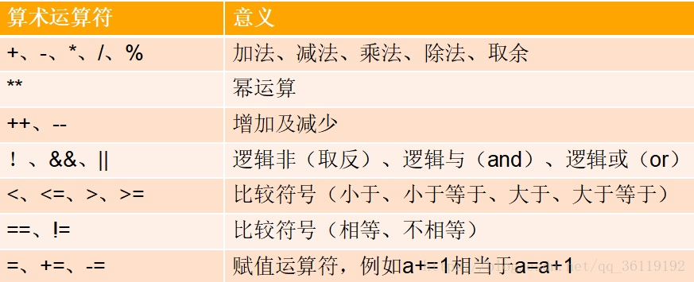

# 1、Linux 系统版本

> 仅介绍常用的几个系统版本。

## 1.1、CentOS

CentOS 是一个基于Red Hat Linux 提供的可自由使用源代码的企业级 Linux发行版本，而每个版本的 CentOS 会定期更新一次，以便支持新的硬件，而且在 RHEL的基础上修正了不少已知的 Bug ，其稳定性值得信赖。

优点：CentOS完全免费，不存在RED HAT AS4需要序列号的问题，独有yum命令支持在线升级，可以即时更新系统


## 1.2、Mandriva

Mandriva原名Mandrake，最早在1998年7月发布，刚开始普及Linux系统时，Mandrake非常流行。最早 Mandrake的开发者是基于Redhat进行开发的，Redhat默认采用GNOME桌面系统，而Mandrake将之改为KDE。而由于当时的 Linux普遍比较难安装，所以Mandrake还简化了安装系统。

优点：友好的操作界面，图形配置工具，庞大的社区技术支持，NTFS分区大小变更

缺点：部分版本bug较多，最新版本只先发布给Mandrake俱乐部的成员

软件包管理系统：Urpmi (RPM)


## 1.3、Red Hat

Red Hat最早由Bob Young和Marc Ewing在1995年创建，而正统的Red Hat版本早已停止技术支持，目前Red Hat分为两个系列：由Red Hat公司提供收费技术支持和更新的Red Hat Enterprise Linux，以及由社区开发的免费的Fedora Core。

适用于服务器的版本是Red Hat Enterprise Linux，而由于这是个收费的操作系统。于是，国内外许多企业或空间商选择CentOS。CentOS可以算是RHEL的克隆版，但它最大的好处是免费！

优点：拥有数量庞大的用户，优秀的社区技术支持，许多创新

缺点：免费版(Fedora Core)版本生命周期太短，多媒体支持不佳

软件包管理系统：up2date (RPM)， YUM (RPM)


## 1.4、SUSE

SUSE是德国最著名的Linux发行版，于2003年年末被Novell收购，之后的发布显得比较混乱，比如9.0版本是收费的，而10.0版本又免费发布。这使得一部分用户感到困惑，也转而使用其它发行版本。但是SUSE仍然是一个非常专业、优秀的发行版。

优点：专业，易用的YaST软件包管理系统

缺点：FTP发布通常要比零售版晚1~3个月

软件包管理系统：YaST (RPM)， 第三方APT (RPM) 软件库(repository)


## 1.5、Debian

dpkg是Debian系列特有的软件包管理工具，它被誉为所有Linux软件包管理工具最强大的，配合apt-get，在Debian上安装、升级、删除和管理软件变得异常容易。

优点：遵循GNU规范，100%免费，优秀的网络和社区资源，强大的apt-get

缺点：安装相对不易，stable分支的软件极度过时

软件包管理系统：APT (DEB)


## 	1.6、Ubuntu

Ubuntu是一个拥有Debian的优点，以及自身加强的优点的Linux操作系统。Ubuntu是一个相对较新的发行版，它的出现可能改变了许多潜在用户对Linux的看法，因为Ubuntu的安装非常的人性化，只要按照提示一步一步进行，安装和Windows同样简便。并且Ubuntu被誉为对硬件支持最好最全面的Linux发行版之一，许多在其他发行版上无法使用，或者默认配置时无法使用的硬件，在Ubuntu上轻松搞定。

Ubuntu采用自行加强的内核，默认不能直接root登陆，必须从第一个创建的用户通过su或sudo来获取root权限，增加了安全性，避免用户粗心损坏系统

优点：人气颇高的论坛提供优秀的资源和技术支持，固定的版本更新周期和技术支持，可从Debian Woody直接升级

缺点：还未建立成熟的商业模式


# 2、Linux 目录结构

## 2.1、基本介绍

- Linux中，`/`即代表根目录，不同于Windows的C、D、E盘结构，Linux只有一个根目录，然后在此目录下创建其他目录，是**树结构**
- Linux的文件系统采用级层式的树状目录结构，最上层目录就是根目录，有且只有一个
- ==Linux世界里，一切皆为文件==，即使是硬件，也会被映射成相应的文件
- ==**Linux开机流程**：开机 => BIOS => /boot => init进程 => 运行级别 => 运行级别对应的服务==

## 2.2、根目录

```
/bin   这个目录存放着最经常使用的命令，主要有cat、chmod、chown、date、mv、mkdir、cp、bash等

/sbin   存放着系统管理员使用的系统管理程序，包括开机过程所需要的开机、修复、还原系统所需要的命令

/home  存放普通用户的主目录，每个用户都有一个自己的目录，一般目录名以用户账号命名，主文件夹有两种代号：～代表当前这个用户的主文件夹

/root   超级权限者的用户主目录，系统管理员的主文件夹

/lib  放置的是系统开机所需要最基本的动态链接共享库，类似于Windows的DLL文件，包括开机时会用到的数据库，以及在/bin和/sbin下命令会调用的函数库

/lost+found  一般情况下是空的，系统非法关机后，系统就会存放一些文件

/etc   所有系统管理员所需要的配置文件和子目录，例如人员的帐号密码文件，各种服务的起始文件等。一般来说，这个目录下面的各文件属性时可以让一般的用户查阅的，但是只有root用户有权先修改。FHS建议不要放置可执行的文件在这个目录下

/usr  这里面放置的数据属于可分享的与不可变动的（shareable，static），其实usr是UNIX SOFTWARE RESOURCE的缩写，而非user的缩写，也就是unix操作系统软件放置的位置而非用户的数据

/boot  这个目录主要放置开机能够使用到的文件，包括linux内核文件和开机菜单与开机所以需要的配置文件
====================================================================================================
以下三个目录跟Linux内核有关，一般不要动
/proc  这个目录本身是一个虚拟文件系统，它放置的数据都是在内存当中，不占用硬盘的容量

/src  src可以视作source的缩写，是一些网络服务启动后，这些服务需要取用的数据目录，常见的服务例如www,ftp等

/sys  这个目录其实跟/proc非常的相似，也是一个虚拟的文件系统主要也是记录与内核相关的信息，不占用硬盘容量
====================================================================================================
/tmp  这是让一般的用户或者是正在执行的程序暂时放置文件的地方

/dev   在linux中任何的设备和接口设备都是以文件的形式存在于这个目录当中。你只要到通过访问这个目录下的某个文件就相当于访问某个设备，类似于Windows的设备管理器

/media  放置的就是可以删除的设备。包括软盘，光盘，dvd等都临时挂放在此。

/mnt  系统提供该目录是为了让用户临时挂载别的文件系统的，我们可以将外部的存储挂载在该目录下，然后进入该目录就能看见了，例如vmtools的共享文件夹

/opt  这个是给第三方软件放置的目录。不过，在以前的linux下我们喜欢放置在/usr/local下面，一般是通过编译源码方式安装的程序。

/var  这个目录下面主要放置常态性变动的文件，包括cache,logfile以及某些软夹运营所产生的文件。例如MYSQL数据库文件等

/selinux SeLinux是一种安全子系统他能控制程序只能访问特定文件
```


## 2.3 /etc 配置文件目录

```shell
/etc/sysconfig/network-scripts/ifcfg-eth0 # 配置IP，GW等。
/etc/resolv.conf # 配置本机的客户端DNS。
/etc/hosts # 配置IP与域名的对应解析表。
/etc/fstab/ # 记录开机要挂载的文件系统，所有分区开机都会自动挂载
/etc/inittab # 设定系统启动等级及启动文件设置。
/etc/init.d # 存放系统启动脚本
/etc/profile # 系统全局变量配置路径
/etc/passwd # 账号信息
/etc/sudoers # sudo 命令的配置文件
/etc/syslog.conf # 系统日志参数配置
/etc/skel/ # 默认创建用户时，把该目录拷贝到家目录下
/etc/sysconfig/network # 配置机器名及网卡启动等配置。
/etc/exports # 设定NFS系统用的配置文件路径。
/etc/xinetd.d # 如果服务器是通过xinetd模式运行的，它的脚本要放在这个目录下。
/etc/rc或/etc/rc.d # 启动、或改变运行级时运行的脚本或脚本的目录。
/etc/group # 设定用户的组名与相关信息
/etc/motd # motd是message of the day的缩写，用户成功登录后自动输出通告信息。
/etc/modprobe.conf # 内核模块额外参数设定
/etc/DIR_COLORS # 设定颜色
/etc/protocols # 系统支持的协议文件
/etc/X11X # Window 的配置文件
/etc/issue # 记录用户登录前显示的信息
/etc/mtab # 当前安装的文件系统列表，由scripts初始化，并由mount命令自动更新，需要一个当前安装的文件系统的列表时使用，例如df命令。
/etc/login.defs # 设置用户帐号限制的文件
/etc/shells # 列出可信任的shell。chsh 命令允许用户在本文件指定范围内改变登录shell。提供一台机器FTP服务的服务进程ftpd检查用户shell是否列在/etc/shells 文件中，如果不是将不允许该用户登录。
/etc/securetty # 确认安全终端，即哪个终端允许root登录。一般只列出虚拟控制台，这样就不可能(至少很困难)通过modem或网络闯入系统并得到超级用户特权。
```


## 2.4 /usr 资源文件目录

```shell
/usr/X11R6 # 存放X-Windows的目录；
/usr/games # 存放着XteamLinux自带的小游戏；
/usr/docLinux # 技术文档；
/usr/include #用来存放Linux下开发和编译应用程序所需要的头文件；
/usr/lib # 存放一些常用的动态链接共享库和静态档案库；
/usr/man # 帮助文档所在的目录；
/usr/srcLinux # 开放的源代码，就存在这个目录，爱好者们别放过哦；
/usr/bin/ # 非必要可执行文件 (在单用户模式中不需要)；面向所有用户。
/usr/lib/ # /usr/bin/和/usr/sbin/中二进制文件的库。
/usr/sbin/ # 非必要的系统二进制文件，例如：大量网络服务的守护进程。
/usr/share/ # 体系结构无关（共享）数据。
/usr/src/ # 源代码,例如:内核源代码及其头文件。
/usr/X11R6/X  # Window系统版本 11, Release 6。
/usr/local/ # 本地数据的第三层次，具体到本台主机。通常而言有进一步的子目录，例如：bin/、lib/、share/。这是提供给一般用户的/usr目录，在这里安装一般的应用软件；
```


## 2.5 /proc 虚拟文件目录

虚拟文件系统，将内核与进程状态归档为文本文件（系统信息都存放这目录下）。例如：uptime、 network。在Linux中，对应Procfs格式挂载。该目录下文件只能看不能改（包括root）。

```shell
/proc/meminfo # 查看内存信息
/proc/loadavg # top 和 uptime 上面的三个平均数值就是记录在此！
/proc/uptime # 就是用 uptime 的时候，会出现的资讯啦！
/proc/cpuinfo # 关于处理器的信息，如类型、厂家、型号和性能等。
/proc/cmdline # 加载 kernel 时所下达的相关参数！查阅此文件，可了解系统是如何启动的！
/proc/filesystems # 目前系统已经加载的文件系统！
/proc/interrupts # 目前系统上面的 IRQ 分配状态。
/proc/ioports # 目前系统上面各个装置所配置的 I/O 位址。
/proc/kcore # 这个就是内存的大小啦！好大对吧！但是不要读他啦！
/proc/modules # 目前我们的 Linux 已经加载的模块列表，也可以想成是驱动程序啦！
/proc/mounts # 系统已经挂载的数据，就是用 mount 这个命令呼叫出来的数据啦！
/proc/swaps # 到底系统挂加载的内存在哪里？呵呵！使用掉的 partition 就记录在此啦！
/proc/partitions # 使用 fdisk -l 会出现目前所有的 partition 吧？在这个文件当中也有纪录喔！
/proc/pci # 在 PCI 汇流排上面，每个装置的详细情况！可用 lspci 来查阅！
/proc/version # 核心的版本，就是用 uname -a 显示的内容啦！
/proc/bus/ # 一些汇流排的装置，还有 U盘的装置也记录在此喔！
/proc/dma # 显示当前使用的d m a通道。
/proc/filesystems # 核心配置的文件系统信息。
/proc/kmsg # 核心输出的消息。也会被送到syslog。
/proc/ksyms # 核心符号表。
/proc/net # 网络协议状态信息。
/proc/self # 存放到查看/proc的程序的进程目录的符号连接。
/proc/stat # 系统的不同状态，例如:系统启动后页面发生错误的次数。
```


## 2.6 /var 动态文件目录

/var 包括系统一般运行时要改变的数据。每个系统是特定的，即不通过网络与其他计算机共享。

```shell
/var/log/message # 日志信息，按周自动轮询
/var/spool/cron/root # 定时器配置文件目录，默认按用户命名
/var/log/secure # 记录登陆系统存取信息的文件，不管认证成功还是认证失败都会记录
/var/log/wtmp # 记录登陆者信息的文件，last,who,w命令信息来源于此
/var/spool/clientmqueue/ # 当邮件服务未开启时，所有应发给系统管理员的邮件都将堆放在此
/var/spool/mail/ # 邮件目录
/var/tmp # 比/tmp允许的大或需要存在较长时间的临时文件
/var/lib # 系统正常运行时要改变的文件.
/var/local # /usr/local 中安装的程序的可变数据(即系统管理员安装的程序)。注意，如果必要，即使本地安装的程序也会使用其他/var目录，例如/var/lock。
/var/lock # 锁定文件。许多程序遵循在/var/lock中产生一个锁定文件的约定，以支持他们正在使用某个特定的设备或文件。其他程序注意到这个锁定文件，将不试图使用这个设备或文件。
/var/log/ # 各种程序的Log文件，特别是login (/var/log/wtmp log所有到系统的登录和注销) 和syslog (/var/log/messages 里存储所有核心和系统程序信息. /var/log 里的文件经常不确定地增长，应该定期清除.
/var/run # 保存到下次引导前有效的关于系统的信息文件.如 /var/run/utmp 包含当前登录的用户的信息.
/var/cache/ # 应用程序缓存数据。这些数据是在本地生成的一个耗时的I/O或计算结果。应用程序必须能够再生或恢复数据。缓存的文件可以被删除而不导致数据丢失。
```


# 3、SSH 和 SCP

## 3.1、SSH服务

1. 如果是实际的开发，Linux服务器一般是在第三方服务商的机房里，那么要控制Linux服务器，就要通过远程登陆的方式来操作
2. 远程文件的上传和下载，也要通过远程登录的方式
3. **SSH服务监听22号端口**
5. `setup -> 系统服务 -> sshd` 查看是否开启远程监听服务（SSHD），`*` 代表已经开启；`service sshd status` 也可以检查


## 3.2、远程登录

1. 命令行连接语法：

   ```shell
   ssh 用户名@服务器IP
   
   # 示例。如果没有配置rsa公钥到服务器上，还需要手动输入登录密码
   ssh root@121.4.47.229
   ```

   

2. 通过XShell连接到Linux服务器

   ```shell
   ifconfig    # 查看IP地址
   ```

   **默认nat模式下，linux的IP与虚拟的网卡IP不一样，要设置端口转发，才能确保正常连接！**

   

2. **Linux虚拟机的三种网络连接形式**

   - 桥接模式：与主机在同一网段，Linux可以和其他系统通信，但是如果Linux虚拟机数量多可能造成ip冲突
   - NAT模式：网络地址转换方式，即母机代理通讯，再创建子网供虚拟机使用，其中一个和Linux无法和本局域网中的其他真实主机进行通讯
   - 仅主机模式：即单机模式，是一个独立的主机，不能访问外网

   ==一般选择NAT模式==
   
   

## 3.3、远程传输

**windows**

可以使用Xftp软件进行文件的传输，直接安装即可，然后输入Linux主机的IP地址，选择SFTP协议（22号端口），再输入账号密码即可

如果出现中文乱码问题，可以在主机的属性中的选项中选择使用**UTF-8编码**即可

直接拖拉文件即可


**Mac**

mac 电脑上直接在命令行传输文件即可，语法如下：

```shell
# =============上传===============
scp 本机文件 用户名@服务器IP:存放文件的服务器目录
scp /var/local/111.html root@121.4.47.229:/var/local/111.html

# =============下载===============
scp 用户名@服务器IP:服务器文件路径 存放文件的本机目录
scp root@121.4.47.229:/var/local/111.html /var/local/
```


## 3.4、免密传输

1. 本机生成公钥私钥对

   ```shell
   ssh-keygen -t rsa
   # 可以看到~/.ssh/目录下多了两个文件id_rsa和id_rsa.pub，分别是私钥和公钥，这里我们只需要公钥即可。
   ```

2. 把公钥id_rsa.pub传到服务器的 `~/.ssh` 目录，注意不要覆盖掉了服务器已有的公钥文件

   ```shell
   scp id_rsa.pub root@192.168.16.117:~/.ssh/id_rsa.pub_temp # 重命名文件，避免覆盖
   ```

3. 将id_rsa公钥的内容添加到.ssh目录下的authorized_keys文件，记得以追加的方式添加，以免将别的公钥覆盖，若文件不存在则新建。

   ```shell
   cat id_rsa.pub_temp >> authorized_keys
   ```

4. 再次执行 ssh 或 scp 就不再需要输入密码了


## 3.5、下载互联网资源

`wget` 资源链接。即可将互联网资源下载到Linux。

```shell
# 下载一张图片
ubuntu@VM-16-9-ubuntu:~/learning$ wget https://scpic.chinaz.net/files/pic/pic9/202111/apic36746.jpg
--2021-11-28 21:23:42--  https://scpic.chinaz.net/files/pic/pic9/202111/apic36746.jpg
Resolving scpic.chinaz.net (scpic.chinaz.net)... 150.138.105.234
Connecting to scpic.chinaz.net (scpic.chinaz.net)|150.138.105.234|:443... connected.
HTTP request sent, awaiting response... 200 OK
Length: 166592 (163K) [image/jpeg]
Saving to: ‘apic36746.jpg’

apic36746.jpg                           100%[==============================================================================>] 162.69K  --.-KB/s    in 0.06s

2021-11-28 21:23:43 (2.78 MB/s) - ‘apic36746.jpg’ saved [166592/166592]

ubuntu@VM-16-9-ubuntu:~/learning$ ls -lh
total 164K
-rw-rw-r-- 1 ubuntu ubuntu 163K Nov 22 15:24 apic36746.jpg
```


# 4、Vi 和 Vim

## 4.1、基本介绍

1. 所有Linux系统都会内建vi文本编辑器

2. vim具有程序编辑的能力，可以当作是vi的增强版，可以主动的以字体颜色辨别语法的正确性，方便程序设计。代码补全、编译及错误跳转等方便编程的功能特别丰富，被广泛使用。

3. vim 是第三方工具，如果linux 没有安装，就需要手动安装：

   ```shell
   # centos
   yum install vim
   # ubuntu
   apt-get install vim
   ```

   

## 4.2、vi和vim的三种常见模式

1. 正常模式

   **一般默认就是正常模式**，在该模式下，我们**可以使用快捷键**。

   以 vim 打开一个档案就直接进入一般模式了(这是默认的模式)。在这个模式中，你可以使用『上下左右』按键来移动光标，你可以使用『删除字符』或『删除整行』来处理档案内容，也可以使用『复制、粘贴』来处理你的文件数据。

2. 插入模式（编辑模式）

   在模式下，程序员可以**输入内容**。

   按下` i, I, o, O, a, A, r, R` 等任何一个字母之后才会进入编辑模式, **一般来说按`i`即可**

3. 命令行模式

   在这个模式当中， 可以提供你相关指令，完成读取、存盘、替换、离开 vim 、显示行号等的动作则是在此模式中操作的


## 4.3、快速入门案例

- 写一个hello world的 java 代码文件

```shell
ll  # 查看目录下的文件
vim Hello.java  # 用vim打开一个java文件
输入 i # 进入编辑模式
输入代码:
public class Hello{
    public static void main(String args[]){
        System.out.println("Hello World");
    }
}
输入完成后按ESC按键，从编辑模式切换到正常模式
输入 :或者/ 后即可从正常模式切换到命令行模式
输入 wq (w是写入的意思 q是退出的意思) 保存 
    q 是退出，如果有修改但不想保存，就加上 ! 强制执行，这样修改的内容就会消失。像这样：:q!
```


## 4.4、快捷键使用案例

> 要先从进入正常模式才可以使用快捷键

1. **拷贝当前行** `yy` , 拷贝当前行向下的 5 行 `5yy`，并粘贴 `p`

2. **删除当前行** `dd` , 删除当前行向下的 5 行 `5dd`

3. 删除当前行并进入编辑模式，`shift + s`

4. 在文件中查**找某个单词**：命令行下 `/` 关键字 ， 回车 查找 , 输入 `n` 就是查找下一个

5. **设置文件的行号**，**取消文件的行号**：命令行下`:set nu` 和 `:set nonu`

6. 用快捷键跳到文档的**最末行**`shift + g`和**最首行**`gg`

7. **撤销上一个动作**，在正常模式下输入 `u`

8. 删除当前行及之后的所有内容，先输入`d`，再输入`G`

9. 光标移到行尾，`shift + 4`

10. 光标退到行尾，并进入编辑模式，`shift + a`

11. 行内向前移动一个单词，`shift + b`

12. 光标移动到行首，`0`（数字0）

13. **取消着色标记**操作是 `:noh`

14. 编辑 /etc/profile 文件，并将**光标移动到 第 20 行** `shift+g`

    - 第一步：显示行号 :set nu
      - 输入20，直接按回车的话，是从当前位置前进20行
      - 数字+Enter 可以到 光标当前位置+数字 的那一行

    - 第二步：输入 20 这个数

    - 第三步: 输入 shift+g

15. 单行注释 `# 后面写注释`

16. 多行注释：`:<<! 中间的代码 !`


## 4.5、vim键盘图


# 5、开机、重启和用户登录注销

## 5.1、关机和重启

```shell
# shutdown
  shutdown -h now # 立即关机
  shutdown -h 1 # 表示一分钟过后就关机
  shutdown -r now # 立即重启
halt # 停机指令 直接使用即可 效果等同于关机
reboot # 就是重启系统
sync # 代表把内存的数据同步到磁盘上
```

- **不管是重启还是关机，都应该先执行以下 sync 指令，把内存的数据写入磁盘，防止数据丢失**

## 5.2、用户登录和注销

- 登录时**尽量少用 root 帐号登录**，因为它是系统管理员，拥有最大的权限，**避免操作失误**。可以利用普通用户登录，登录后再用`su - 用户名` 命令来切换成系统管理员身份
- 在提示符下输入`logout`即可注销用户

> logout 注销指令在图形运行级别无效即在虚拟机上操作时无效，在 运行级别 3 下有效，例如远程连接时使用


# 6、用户管理

## 6.1、基本介绍

- Linux 系统是一个多用户多任务的操作系统，任何一个要使用系统资源的用户，都必须首先向系统管理员申请一个账号，然后以这个账号的身份进入系统
- 用户组：Linux下有很多地用户组，这是Linux对用户管理地一种管理，每一个用户至少属于一个组，例如 root 用户属于 root 组
- 家目录：`/home/` 目录下有各个创建的用户对应的家目录，当用户登录时会自动地进入到自己地家目录


## 6.2、添加用户

- 基本语法：`useradd [选项] 用户名`

- 例如：添加用户小明 => 添加完成后发生的变化：

  - 有一个组被创建了(系统会默认创建一个**同名用户组**，当然也可以指定加入一个组)；
  - `/home/` 目录下有一个 `xiaoming` 的目录

  ```shell
  useradd xiaoming
  useradd -d /home/tiger xiaohong    # 给新创建的用户xiaohong指定家目录所在位置
  useradd -g groupname username   # 将新创建的用户添加到指定用户组
  ```


## 6.3、给用户指定/修改密码

使用命令 `passwd 用户名`

```
passwd [-k] [-l] [-u [-f]] [-d] [-S] [username]
-d 删除密码
-f 强制执行
-k 更新只能发送在过期之后
-l 停止账号使用
-S 显示密码信息
-u 启用已被停止的账户
-x 设置密码的有效期
-g 修改群组密码
-i 过期后停止用户账号
```


## 6.4、删除用户

使用命令`userdel username`

```
userdel xiaoming   删除用户 xiaoming 但是要保留家目录
userdel -r xiaoming    删除用户 xiaoming 以及用户主目录
```

- 实际开发工作中，删除用户时一般不会将家目录删除，以免一些文件被误删


## 6.5、查询用户

使用命令 `id username`

系统会显示：**用户id号；所在组id号；组名**

如果不存在该用户，会显示 **无此用户**


## 6.6、切换用户

- 在操作 Linux 中，如果当前用户的权限不够，可以通过 su - 指令，切换到高权限用户，比如 root
- 使用命令：`切换：su - username 返回原来的用户：exit`
- **高权限用户切换到低权限用户时不需要输入密码，反之需要**


## 6.7、用户组

- 用户组：类似于角色，系统可以对有共性的多个用户进行统一的管理
- 增加组： `groupadd groupname`

```shell
useradd -g groupname username   # 将新创建的用户添加到指定用户组
usermod -g groupname username   # 修改某个用户的用户组
usermod -d 目录名 用户名         	# 改变该用户登录的初始目录

usermod -G groupname username		# 修改用户到工作组，一个用户可以添加到多个工作组
usermod -G 24,27 zhangjian			# 修改的时候也可以写组ID，多个用逗号隔开。注意：修改用户组、工作组会离开原来的组

# 如果是想追加，要是用 选项参数：-a
root@VM-16-9-ubuntu:~# usermod -a -G 4 zhangjian
root@VM-16-9-ubuntu:~# id zhangjian
uid=1001(zhangjian) gid=1001(zhangjian) groups=1001(zhangjian),4(adm),24(cdrom),27(sudo)
```


## 6.8、用户和组的相关文件

### 6.8.1、/etc/passwd 文件

- 用户（user）的配置文件，**记录用户的各种信息**
- 每行的含义：`用户名:密码:用户id:组id:注释性描述::家目录:登录 Shell`

### 6.8.2、/etc/group 文件

- 组(group)的配置文件，**记录 Linux 包含的组的信息**
- 每行含义：`组名:口令:组标识号:组内用户列表`

### 6.8.3、/etc/shadow 文件

- 口令的配置文件（密码和登录信息，是加密的）

- 每行的含义：

  `登录名:加密口令:最后一次修改时间:最小时间间隔:最大时间间隔:警告时间:不活动时间:失效时间:标志`


# 7、实用指令

## 7.1、指定运行级别

- **七大运行级别**

  ```
  0 ：关机
  1 ：单用户【找回丢失密码】
  2：多用户状态没有网络服务
  3：多用户状态有网络服务
  4：系统未使用保留给用户 一般不使用
  5：图形界面
  6：系统重启
  常用运行级别是 3 和 5 ，要修改默认的运行级别可改文件
  系统的运行级别配置文件 /etc/inittab
  /etc/inittab 中的 id:5:initdefault: 这一行中的数字就代表着当前运行级别
  切换运行级别 init [0|1|2|3|5|6]
  也可以编辑文件中的那一行，然后reboot即可
  ```

- `systemctl get-default` 查看当前运行级别

- centos7中，这个文件在`/lib/systemd/system`

- 找回root用户的密码：可以进入单用户模式之后再使用passwd命令修改


## 7.2、帮助指令

当我们对某个指令不熟悉的时候，我们可以使用Linux提供的帮助指令来了解这个指令的使用方法

1. 通过man指令获得帮助信息：`man [命令或配置文件]`
2. 通过help指令获得 shell 内置命令的帮助信息：`help [命令]`
3. 当然，更推荐直接百度

> 按J或K滚动翻看


## 7.3、文件目录类指令

> 斜杠在前表示绝对路径，没有斜杠表示相对路径，斜杠在后表示某文件夹下的一个文件

1. **pwd 命令**( print woking dictionary )，显示当前工作目录的绝对路径

   ```
   使用方法：pwd
   ```

2. **ls 命令** ，显示当前目录的所有文件和目录，包括隐藏的

   ```
   使用方法：ls [选项] [目录或是文件]
   -a 显示当前目录所有的文件和目录，包括隐藏的
   -l 以列表的方式显示信息
   -h 以合适的单位显示文件大小
   ```

3. **cd 命令**（change directory），切换到指定的目录

   ```
   cd [绝对路径|相对路径]
   cd~ 或者 cd: 回到自己家目录
   cd .. 回到当前目录的上一级目录
   . 代表当前目录
   .. 代表上一级目录
   ```

4. **mkdir 命令**（make directory），用于创建目录

   ```
   mkdir [选项] 要创建的目录
   -p 创建多级目录，多级目录即创建一个目录后然后在这个目录下再创建一个目录，相当于创建两个目录
   ```

5. **rmdir 命令**（remove directory），用于删除==空目录==

   ```
   rmdir [选项] 要删除的空目录
   rm -rf 要删除的非空目录
   注意！rm -rf /* 删除根目录下的所有内容，可不能开玩笑
   ```

6. **touch 命令**，用于创建空文件

   ```
   touch 文件名称
   也可以一次创建多个文件，空格分开即可
   ```

7. **cp 命令**（copy），拷贝文件到指定目录

   ```
   cp [选项] 要拷贝的文件 要粘贴的目录
   -r  递归复制整个文件夹
   例1：cp a.txt /home/b/ 将a.txt文件拷贝到/home/b目录下
   例2：cp -r /home/a/ /home/b/ 将/home/a/目录下的所有文件递归拷贝到/home/b/下，当有重复文件的时候会提示是否覆盖
   例3：cp -rf /home/a/ /home/b/ 这样就能强制覆盖系统不会提示，这样就不用一个一个文件的操作
   ```

8. **rm 命令**，删除文件或目录

   ```
   rm [选项] 要删除的文件或目录
   -r  递归删除整个文件夹
   -f  强制删除不提示
   ```

9. **mv 命令**，移动文件与目录，或重命名

   ```
   mv 旧文件名 新文件名     重命名
   mv 源文件路径 目标文件路径   移动文件
   例1：mv a.txt b.txt
   例2：mv a.txt /home/    如果移动到的文件夹内存在同名的文件会提示是否覆盖,也可以重命名
   ```

10. **cat 命令**，查看文件内容，以只读的方式打开

    ```
    cat [选项] 要查看的文件
    -n ：显示行号
    例1：cat -n /etc/profile 这样直接打开文件会一下走到最后一行然后退出到命令行
    	因此一般会加上 | more 来分页显示
    cat 只能浏览文件，而不能修改文件，为了浏览方便，一般会带上 管道命令 | more
    cat 文件名 | more [分页浏览]
    回车翻页
    ```

11. **more 命令**

    more 指令是一个基于 VI 编辑器的文本过滤器，它以==全屏幕的方式按页显示文本文件的内容==

    more 指令中内置了若干快捷键，详见操作文档

    ```
    more 要查看的文件
    
    常用快捷键：
    一行一行的看就按 Enter 键
    一页一页的看就按 空格 键
    Ctrl+B 回到上一页
    Ctrl+F 下一页
    q 立即离开more，不再显示文本内容
    = 输出当前行的行号
    :f 输出文件名和当前行的行号
    ```

12. **less 命令**

    less 命令用来**分屏查看文件内容**，它的功能与 more 命令类似，但是**更强大**，支持各种显示终端

    less 指令在显示文件内容时，并不是一次将整个文件加载之后才显示，而是**根据显示需要加载内容**，**对于显示大型文件具有较高的效率**

    ```
    less 要查看的文件
    
    常用快捷键
    空格键    向下翻一页
    pagedown  向下翻一页
    pageup    向上翻一页
    /字符串   向下搜索字符串，n：向下查找 N：向上查找
    ?字符串   向上搜索字符串，n：向上查找 N：向下查找
    q  离开less这个程序
    ```

13. `> 命令`和`>> 命令`

    `> 命令` **输出重定向** : 会将原来的文件的内容覆盖

    `>> 命令` **追加**： 不会覆盖原来文件的内容，而是追加到文件的尾部

    ```
    ls -l >文件   将ls -l 显示的内容写入文件 a.txt 中（覆盖写）如果该文件不存在，就创建该文件
    ls -al >>文件 将ls -al 显示的内容追加到文件 a.txt 的末尾
    cat 文件 1 > 文件 2   将文件1的内容覆盖到文件2
    echo "str">>文件  将字符串内容追加到文件中
    echo "str">文件   将字符串的内容覆盖到文件中，原来的内容全都没了
    ```

14. **echo 命令**，输出内容到控制台

    ```
    echo [选项] [输出内容]
    例1  使用 echo 指令输出环境变量,输出当前的环境路径 ==> echo $PATH
    例2  使用 echo 指令输出"hello world" ==> echo "hello world"
    ```

15. **head 命令**，用于显示文件的开头部分内容，默认情况下 head 指令显示文件的前 10 行内容

    ```
    head 文件 
    head -n 5 文件    查看文件头 5 行内容，5 可以是任意行数
    ```

16. **tail 命令**，用于输出文件中尾部的内容，默认情况下 tail 指令显示文件的后 10 行内容

    ```
    tail 文件
    tail -n 5 文件    查看文件后 5 行内容，5 可以是任意行数
    tail -f 文件    实时追踪该文档的所有更新，实际开发工作中会经常使用，Ctrl+C退出追踪
    如果你是用的vim修改，因为vim实际上是删除本文件，生成了新的同名文件，所以无法进行监控
    ```

17. **sed -i 命令**，替换文本内容

    ```shell
    sed -i 's/原字符串/新字符串/' /home/1.txt   # 对文本中第一个查找到的原字符串进行替换
    sed -i 's/原字符串/新字符串/g' /home/1.txt  # 对文本中所有的原字符串进行替换
    ```

    sed命令是三剑客之一，功能十分强大。sed详解：https://www.linuxprobe.com/linux-sed-command.html

    其他两剑客分别是：awk 、grep

18. **ln 命令**，给原文件创建一个链接

    软链接也叫符号链接，类似于 windows 里的快捷方式，主要存放了链接其他文件的路径

    硬连接指通过索引节点来进行链接

    [关于硬连接和软连接的详细介绍](https://www.cnblogs.com/songgj/p/9115954.html)

    ```
    ln [参数] [原文件或目录] [目标文件或目录]  
    -i 交互模式，文件存在则提示用户是否覆盖
    -s 软链接(符号链接)
    -d 允许超级用户制作目录的硬链接
    -b 删除，覆盖以前建立的链接
    
    在默认不带参数情况下，ln命令创建的是硬链接
    
    例： ln -s /root linkToRoot   在当前目录下创建一个软链接，链接指向root目录
    当 cd linkToRoot 时，就会跳转到root目录，但是用pwd查看路径时，还是会显示原来目录的linkToRoot的路径
    ```

19. **history 命令**，查看已经执行过历史命令,也可以执行历史指令

    ```
    history [数字]
    不加数字则显示所有的历史命令
    加数字则显示最近使用的n条命令
    !10  执行历史编号为10的命令
    history -c 清除历史记录
    ```


## 7.4、时间日期类指令

1. **cal 命令**，显示当前日历信息

   ```
   cal [选项]
   不加选项，显示本月日历
   cal 2020  显示2021年一整年的日历
   ```

2. **date 命令**，显示当前日期 / 设置当前日期

   ```
   date 显示当前时间
   date +%Y   显示当前年份
   date +%m   显示当前月份
   date +%d   显示当前是哪一天
   date "+%Y-%m-%d %H:%M:%S"   显示年月日时分秒
   
   date -s 字符串时间  设置系统当前时间
   例：date -s "2020-11-11 11:11:11"
   设置回原来的时间
   ln -sf /usr/share/zoneinfo/Asia/Shanghai /etc/localtime
   ```


## 7.5、搜索查找类指令

1. **find 命令**，将从指定目录向下递归地遍历其各个子目录，将满足条件的文件或者目录显示在终端

   ```
   find [搜索范围] [选项]
   -name<查询方式> 按照指定的文件名查找模式查找文件  例：find /home -name hello.txt 
   -user<用户名>  查找属于指定用户名所有文件  例： find /root -user root
   -size<文件大小>  按照指定的文件大小查找文件 [+n大于 -n小于 n等于]  例：find /root -size +20M
   使用文件名查找时可以使用通配符，例：find /home -name *.txt
   ```

2. **locate 命令**，快速定位文件路径

   locate 指令利用==事先建立的系统中所有文件名称及路径的 locate 数据库==实现快速定位给定的文件

   Locate 指令无需遍历整个文件系统，查询速度较快

   为了保证查询结果的准确度，管理员**必须定期更新** locate 时刻

   由于 locate 指令基于数据库进行查询，所以==第一次运行前，必须使用 updatedb 指令创建 locate 数据库==。

   ```
   locate 搜索文件
   例：locate hello.txt
   ```

3. **grep 指令和 管道符号 |**

   grep 过滤查找 ， 管道符`|`，表示**将前一个命令的处理结果输出传递给后面的命令处理**

   ```
   grep [选项] 查找内容 源文件
   -n 显示匹配行及行号
   -i 忽略字母大小写
   -A n 显示匹配行及后n行
   -B n 显示匹配行及前n行
   -C n 显示匹配行及前后各n行
   
   例：cat hello.txt | grep -n yes  在 hello.txt 文件中，查找 "yes" 所在行，并且显示行号
   ```


## 7.6、压缩和解压缩类指令

1. **gzip / gunzip 指令**

   gzip 用于==压缩文件==， gunzip 用于==解压缩==

   压缩完成后，原来的文件就没了，取而代之的是对应的压缩文件，不会保留原来的文件

   ```
   gzip 文件        压缩文件，只能将文件压缩为 *.gz 文件
   gunzip 文件.gz   解压缩文件命令
   ```

2. **zip / unzip 指令**

   zip 用于==压缩文件==， unzip 用于==解压缩==，这个在项目打包发布中很有用的

   ```
   zip [选项] XXX.zip 将要压缩的内容    压缩文件和目录的命令
   unzip [选项] XXX.zip         解压缩文件
   zip ==>  -r：递归压缩，即压缩目录
   unzip ==>  -d<目录> ：指定解压后文件的存放目录
   例： zip -r home.zip /home/   ==>   将 /home 下的 所有文件进行压缩成 home.zip
   例： unzip -d /home/ home.zip   ==>   将 mypackge.zip 解压到 /home 目录下
   ```

3. **tar 指令**，打包指令

   最后打包后的文件是`.tar.gz`的文件

   ```
   tar [选项] XXX.tar.gz 打包的内容     打包目录，压缩后的文件格式.tar.gz
   -c 产生 .tar 打包文件
   -v 显示详细信息
   -f 指定压缩后的文件名
   -z 打包同时压缩
   -x 解包 .tar 文件
   
   -c create -t list -x extract -z gzip -j bzip2 -J xz -f filename
   
   例1 -> tar -zcvf a.tar.gz a1.txt a2.txt   ==>  将 a1.txt 和 a2.txt 压缩成 a.tar.gz
   例2 -> tar -zcvf myhome.tar.gz /home/   ==>  将 /home/ 目录下所有文件打包压缩成 myhome.tar.gz
   例3 -> tar -zxvf a.tar.gz   ==>  将 a.tar.gz 解压到当前目录
   例4 -> tar -zxvf myhome.tar.gz -C /home/   ==>  将 myhome.tar.gz 解压到 /home/ 目录下
   																								-C 应该是change，改变目录
   
   指定解压缩的目标目录一定要事先存在
   ```
   


## 7.7、系统资源类指令

详见 **服务器资源指标.md** 文档。


# 8、组管理

## 8.1、基本介绍

- 在 linux 中的每个用户必须属于一个组，不能独立于组外
- 在 linux 中每个文件有所有者、所在组、其它组的概念
  1. 所有者：一般为文件的创建者，谁创建了该文件，就自然的成为该文件的所有者
  2. 所在组：文件也会归属于一个组，一般默认是所有者所在的组
  3. 其他组：除文件的所有者和所在组的用户外，系统的其它用户都是文件的其它组.

## 8.2、文件 / 目录 所有者

**一般为文件的创建者**，谁创建了该文件，就自然的成为该文件的所有者

1. 查看文件所有者

   ```shell
   ls -ahl 即可查看文件的所有者和所在组
   
   # -h 更加人性化的展示 文件的大小，单位是 G、M、K；
   # -a 展示隐藏文件
   # -l 展示文件详情信息
   ```

2. 修改文件所有者、所有组

   ```shell
   chown [参数] 用户名 文件名
   chown newowner:newgroup file 改变文件的所有者和所有组
   # -R 如果是目录 则使其下所有子文件或目录递归生效 递归的修改文件、目录的所有者
   ```


## 8.3、文件 / 目录 所在组

当某个用户创建了一个文件后，**默认这个文件的所在组就是该用户所在的组**

1. 查看文件所在组

   ```shell
   root@VM-16-9-ubuntu:~# ls -ahl
   -rw-r--r--  1 ubuntu root   8.4M May 15  2018 filebeat-5.4.0-linux-x86_64.tar.gz
   drwx------  2 root   root   4.0K Aug  9  2018 .cache
   
   # 字段解释：
   # 文件属性	文件硬连接数 拥有者 所属组	文件大小	文件创建时间	文件名
   ```

2. 修改文件所在组

   ```shell
   chgrp [参数] 组名 文件名
   # -R 如果是目录 则使其下所有子文件或目录递归生效 递归的修改文件、目录的所在组
   ```


# 9、权限管理

## 9.1、基本介绍

**ls -l 中显示的内容如下：**

```shell
root@VM-16-9-ubuntu:~# ls -l
total 57168  # 当前目录下所有文件大小的总和。该值 默认单位是 kb；而文件列表的单位默认是 byte。
-rw-r--r-- 1 ubuntu root  8774763 May 15  2018 filebeat-5.4.0-linux-x86_64.tar.gz
-rw-r--r-- 1 root   root 24868974 Mar 31  2020 filebeat-7.6.2-linux-x86_64.tar.gz
-rw-r--r-- 1 root   root 24868974 Mar 31  2020 filebeat-7.6.2-linux-x86_64.tar.gz.1
-rw-r--r-- 1 root   root    18617 Nov 21 00:29 get-docker.sh
```

**字段说明：**

- 0-9 位说明
   - 第 0 位确定文件类型(d 目录，- 普通文件， l 连接，c 字符设备，b 块文件例如硬盘)
   - 第 1-3 位确定**所有者**（文件的所有者 User）拥有该文件的权限；
   - 第 4-6 位确定**所属组**（同用户组的成员 Group）拥有该文件的权限；
   - 第 7-9 位确定**其他组的用户**拥有该文件的权限 Other。
   - 这里的权限也**可用数字**表示为: r=4，w=2，x=1 因此 rwx=4+2+1=7

- `1` 的意思是：如果是文件，表示**硬连接的数**；如果是目录，则表示**该目录下有多少个子目录**
- 所有者名称
- 所在组名称
- 文件大小，单位 byte，如果是目录会统一显示4096
- 文件最后修改时间
- 文件名


## 9.2、rwx 权限详解

1. rwx 作用到 **文件**
   1. [ r ]代表可读(read)：可以读取，查看；
   
   2. [ w ]代表可写(write)：**可以修改，但是不代表可以删除该文件，删除一个文件的前提条件是 对该文件所在的目录有写权限，才能删除该文件**；
   
   3. [ x ]代表可执行(execute)：可以被执行。
   
      
   
2. rwx 作用到 **目录**
   1. [ r ] 代表可读(read)：可以读取，ls 查看目录内容
   2. [ w ] 代表可写(write)：可以修改，目录内创建、删除、重命名目录
   3. [ x ] 代表可执行(execute)：可以进入该目录


## 9.3、修改权限

通过 **chmod** 指令，可以修改文件或者目录的权限

**第一种方式：通过+ 、-、= 变更权限**

> u：所有者 g：所在组 o：其他人 a：所有人(u、g、o 的总和)

- chmod u=rwx,g=rx,o=x 文件/目录名 => 给所有者读写操作的权限，给所在组可读、可执行权限，给其他人执行的权限

  ```shell
  root@VM-16-9-ubuntu:~# chmod u=rwx,g=rx,o=x filebeat-5.4.0-linux-x86_64.tar.gz
  root@VM-16-9-ubuntu:~# ls -l filebeat-5.4.0-linux-x86_64.tar.gz
  -rwxr-x--x 1 ubuntu root 8774763 May 15  2018 filebeat-5.4.0-linux-x86_64.tar.gz
  ```

- chmod o+w 文件目录名 => 给其他人增加写权限

  ```shell
  root@VM-16-9-ubuntu:~# chmod o+w filebeat-5.4.0-linux-x86_64.tar.gz
  root@VM-16-9-ubuntu:~# ls -l filebeat-5.4.0-linux-x86_64.tar.gz
  -rwxr-x-wx 1 ubuntu root 8774763 May 15  2018 filebeat-5.4.0-linux-x86_64.tar.gz
  ```

- chmod a-x 文件目录名 => 给所有人减少写权限

  ```shell
  root@VM-16-9-ubuntu:~# chmod a-x filebeat-5.4.0-linux-x86_64.tar.gz
  root@VM-16-9-ubuntu:~# ls -l filebeat-5.4.0-linux-x86_64.tar.gz
  -rw-r---w- 1 ubuntu root 8774763 May 15  2018 filebeat-5.4.0-linux-x86_64.tar.gz
  ```

  

**第二种方式：通过数字变更权限，其实就是二进制来表示，三个位分别用0和1表示权限的无和有**

- 规则：r=4 w=2 x=1 ，rwx=4+2+1=7 ，rx=4+1=5

- chmod u=rwx,g=rx,o=x 文件目录名 相当于 chmod 751 文件目录名

  ```shell
  root@VM-16-9-ubuntu:~# chmod 751 filebeat-5.4.0-linux-x86_64.tar.gz
  root@VM-16-9-ubuntu:~# ls -l filebeat-5.4.0-linux-x86_64.tar.gz
  -rwxr-x--x 1 ubuntu root 8774763 May 15  2018 filebeat-5.4.0-linux-x86_64.tar.gz
  ```

​	**注意：对于目录，要拥有执行的权限才能进入目录**


**递归修改目录及文件权限：**

```shell
# 原来的目录及文件权限
root@VM-16-9-ubuntu:~# ls -l
total 24
drwxr-xr-x 2 root root  4096 Nov 26 11:25 apps
-rw-r--r-- 1 root root 18617 Nov 21 00:29 get-docker.sh

root@VM-16-9-ubuntu:~# ls -l apps  # ls 后面如果接目录，那么展示的内容是目录中文件的详情
total 32860
-rwxr-x--x 1 ubuntu root  8774763 May 15  2018 filebeat-5.4.0-linux-x86_64.tar.gz
-rw-r--r-- 1 root   root 24868974 Mar 31  2020 filebeat-7.6.2-linux-x86_64.tar.gz

## 将目录及文件 所有者、组、其他成员 权限都修改成 可读、可写、可执行
root@VM-16-9-ubuntu:~# chmod -R 777 apps

root@VM-16-9-ubuntu:~# ls -l
total 24
drwxrwxrwx 2 root root  4096 Nov 26 11:25 apps
-rw-r--r-- 1 root root 18617 Nov 21 00:29 get-docker.sh

root@VM-16-9-ubuntu:~# ls -l apps
total 32860
-rwxrwxrwx 1 ubuntu root  8774763 May 15  2018 filebeat-5.4.0-linux-x86_64.tar.gz
-rwxrwxrwx 1 root   root 24868974 Mar 31  2020 filebeat-7.6.2-linux-x86_64.tar.gz
```


# 10、定时任务调度

## 10.1、基本介绍

- crond 定时任务调度
- 在我们写了一个脚本或代码，能够完成某个任务，但是需要定时完成，就能够使用一种机制，去定时的调度我们写好的脚本或代码
- 可以通过crontab进行定时任务设置


## 10.2、基本语法

- 任务调度：是指系统在某个时间执行的特定的命令或程序

- 任务调度分类：

  1. 系统工作：有些重要的工作必须周而复始地执行，如病毒扫描等
  2. 个别用户工作：个别用户可能希望执行某些程序，比如对mysql数据库的备份

  ```
  crontab [选项]
  -e 编辑crontab定时任务
  -l 查询crontab任务
  -r 删除当前用户所有的crontab任务
  ```

- 对于一些简单的任务，可以不用写脚本，直接在crontab中加入任务即可

- 对于复杂的任务，就需要写脚本来完成（shell脚本）


## 10.3、快速入门

任务要求：

- 设置任务调度文件：/etc/crontab
- 设置个人任务调度
- 执行 crontab –e 命令
- 接着输入任务到调度文件 如：`*/1 * * * * ls –l /etc/ > /tmp/to.txt`
- 语句的意思是 每分钟执行一次 `ls –l /etc/ > /tmp/to.txt` 命令

具体步骤：

- crontab -e 进入编辑模式
- 输入代码：`*/1 * * * * ls –l /etc/ > /tmp/to.txt`
- 按esc，再按i/a/o，就进入输入模式。按esc再按：进入末行，按esc，按R进入替换模式
- 当保存退出后就程序
- 在每一分钟都会自动的调用 ls -l /etc >> /tmp/to.txt

参数说明：

1. 五个占位符
   1. 第一个 `*` => 一小时的第几分钟 0-59
   2. 第二个 `*` => 一天的第几小时 0-23
   3. 第三个`*` => 一个月当中的第几天 1-31
   4. 第四个 `*` => 一年当中的第几月 1-12
   5. 第五个 `*` => 一周当中的星期几 0-7（0和7都代表星期日）
2. 特殊符号的说明
   1. `*` 号代表任何时间
   2. `,` 号代表不连续的时间
   3. `-`号代表连续的时间范围
   4. `*/n`号代表没隔多久就执行一次
3. 表达式例子：

```
45 22 * * * 命令   ==>  每天 的 22点45分 执行命令
0 17 * * 1 命令   ==>  每周一 的 17点0分 执行命令
0 5 1,15 * * 命令   ==>  每月 的 1号和15号 的 凌晨5点0分 执行命令
40 4 * * 1-5 命令   ==>  每周一到周五 的 凌晨4点40分 执行命令
*/10 4 * * * 命令   ==>  每天的凌晨4点，每隔10分钟 执行一次命令
0 0 1,15 * 1 命令   ==>  每月的1号和15号，每周一的0点0分都会执行命令
注意:星期几和几号最好不要同时出现，因为他们定义的都是天，很容易产生混乱
```


## 10.4、应用实例

### 10.4.1、示例一

每隔1 分钟，就将当前的日期信息，追加到 /root/apps/mydate.txt 文件

1. 执行命令 crontab -e，配置定时任务，内容如下:

   > 首次执行 crontab -e 时，需要选择编辑器，我这里选择 vim.tiny
   >
   > ```shell
   > root@VM-16-9-ubuntu:~/apps# crontab -e
   > 
   > Select an editor.  To change later, run 'select-editor'.
   >   1. /bin/nano        <---- easiest
   >   2. /usr/bin/vim.basic
   >   3. /usr/bin/vim.tiny
   >   4. /bin/ed
   > 
   > Choose 1-4 [1]: 3
   > ```

   ```shell
   # 将如下类容添加到定时任务
   */1 * * * * date >> /root/apps/mydate.txt
   ```


### 10.4.2、示例二

每隔1 分钟， 将当前日期和日历都追加到 /root/apps/mydate.txt 文件中

1. 先编写一个文件 /root/apps/mytask.sh

   ```shell
   cal >> /root/apps/mydate.txt
   date >> /root/apps/mydate.txt
   ```

2. 为 脚本添加可执行权限

   ```shell
   chmod 744 /root/apps/mytask.sh
   ```

2. `crontab -e` 编辑任务

   ```
   */1 * * * * /root/apps/mytask.sh
   ```

4. `crontab -l` 可以看到新添加的任务

   ```shell
   root@VM-16-9-ubuntu:~/apps# crontab -l
   # secu-tcs-agent monitor, install at Sun Nov 21 00:07:21 CST 2021
   * * * * * /usr/local/sa/agent/secu-tcs-agent-mon-safe.sh > /dev/null 2>&1
   */5 * * * * flock -xn /tmp/stargate.lock -c '/usr/local/qcloud/stargate/admin/start.sh > /dev/null 2>&1 &'
   */1 * * * * /root/apps/mytask.sh
   ```

5. 在 /root/apps/mydate.txt 可以看到定时任务产生的数据。


## 10.5、相关指令

```shell
service cron start  # 启动服务
service cron stop # 关闭服务
service cron restart # 重启服务
service cron reload # 重新载入配置
service cron status # 检查状态

crontab -e 	# 编辑任务
crontab –r  # 终止任务调度
crontab –l  # 列出当前有那些任务调度su - 
crontab -u  # 设定某个用户的定时任务

crontab -l -u ubuntu  # 列出 用户 ubuntu 的 cron 任务
```


# 11、磁盘分区和挂载

## 11.1、分区基础知识

> 计算机中存放信息的主要的存储设备就是硬盘，但是硬盘不能直接使用，必须对硬盘进行分割，分割成的一块一块的硬盘区域就是**磁盘分区**。在传统的磁盘管理中，将一个硬盘分为两大类分区：主分区 和 扩展分区。
>
> **主分区：**
>
> 主分区，也称为主磁盘分区，和 扩展分区 、逻辑分区 一样，是一种分区类型。主分区中不能再划分其他类型的分区，因此每个主分区都相当于一个逻辑磁盘（在这一点上主分区和逻辑分区很相似，但主分区是直接在硬盘上划分的，逻辑分区则必须建立于扩展分区中）。
>
> **扩展分区：**
>
> 扩展分区，严格地讲它不是一个实际意义的分区，它仅仅是一个指向下一个分区的指针，这种指针结构将形成一个单向链表。这样在主引导扇区中除了主分区外，仅需要存储一个被称为扩展分区的分区数据，通过这个扩展分区的数据可以找到下一个分区(实际上也就是下一个逻辑磁盘)的起始位置，以此起始位置类推可以找到所有的分区。
>
> **逻辑分区：**
>
> 逻辑分区是 硬盘 上一块连续的区域。每个 主分区 只能分成一个 逻辑驱动器，每个主分区都有各自独立的引导块，可以用fdisk设定为启动区。一个 硬盘 上最多可以有4个主分区，而 扩展分区 上可以划分出多个 逻辑驱动器。这些 逻辑驱动器 没有独立的引导块，不能用fdisk设定为启动区。

**分区的两种方式：**

1. MBR分区（主引导记录）
   1. 最多支持四个主分区
   2. 系统只能安装在主分区
   3. 扩展分区要占一个主分区
   4. MBR 最大只支持 2TB，但拥有最好的兼容性
2. GPT 分区（GUID Partition Table 全局唯一标识磁盘分区表）
   1. 支持无限多个主分区（但操作系统可能限制，比如 windows 下最多 128 个分区）
   2. 最大支持 18EB 的大容量（1EB=1024 PB，1PB=1024 TB ）
   3. windows7 64 位以后支持 gpt

**Windows下的分区**

- 分为主分区和扩展分区（扩展分区下面可再分逻辑分区）

## 11.2、Linux分区

- 原理介绍：

  - Linux 无论有几个分区，分给哪一目录使用，它 **归根结底就只有一个根目录**，**一个独立且唯一的文件结构** ，因此 Linux  中每个分区都是用来组成整个文件系统的一部分。
  - Linux 采用了一种叫 **挂载** 的处理方法，它的整个文件系统中包含了一整套的文件和目录， 且将一个分区和一个目录联系起来。这时要载入的一个分区将使它的存储空间在一个目录下获得。
  - 通俗来说，就是**硬盘下的分区会映射成根目录下的某个目录**

- 硬盘说明

  - Linux 硬盘分 IDE 硬盘和 SCSI 硬盘，目前基本上是 SCSI 硬盘

    > IDE即Integrated Drive Electronics，它的本意是指把控制器与盘体集成在一起的硬盘驱动器，IDE是表示硬盘的传输接口。
    >
    > SCSI硬盘是采用 SCSI接口 的硬盘，SCSI是Small Computer System Interface（小型计算机系统接口）的缩写，使用50针接口，外观和普通硬盘接口有些相似。
    >
    > SCSI硬盘和普通IDE硬盘相比有很多优点：接口速度快，并且由于主要用于服务器，因此硬盘本身的性能也比较高，硬盘转速快，缓存容量大，CPU占用率低，扩展性远优于IDE硬盘，并且支持 热插拔。

  - 对于 IDE 硬盘，驱动器标识符为`hdx~`，其中`hd`表明分区所在设备的类型，这里是指 IDE 硬盘。`x`为盘号（**a 为基本盘，b 为基本从属盘，c 为辅助主盘，d 为辅助从属盘**）,`~`代表分区，**前四个分区用数字 1 到 4 表示**，它们是主分区或扩展分区，**从 5 开始就是逻辑分区**。例如：hda3 表示为第一个 IDE 硬盘上的第三个主分区或扩展分区,hdb2 表示为第二个 IDE 硬盘上的第二个主分区或扩展分区

  - 对于 SCSI 硬盘则标识为`sdx~`，SCSI 硬盘是用`sd`来表示分区所在设备的类型的，其余则和 IDE 硬盘的表示方法一样。

- 查看系统的分区和挂载情况

  > 命令 `lsblk`：List block 显示分区

  - 直接输入`lsblk`查看

    ```shell
    ubuntu@VM-16-9-ubuntu:~$ lsblk
    NAME   MAJ:MIN RM   SIZE RO TYPE MOUNTPOINT
    sr0     11:0    1 146.8M  0 rom
    vda    252:0    0    80G  0 disk						# 因为是云服务器，所以是虚拟磁盘
    └─vda1 252:1    0    80G  0 part /					
    
    # 字段说明：
    # NAME ：块设备名。
    # MAJ:MIN ：主要和次要设备号。
    # RM ：设备是否可移动设备。在本例中设备sr0的RM值等于1，这说明他们是可移动设备。
    # SIZE ：设备的容量大小信息。
    # RO ：设备是否为只读。在本案例中，所有设备的RO值为0，表明他们不是只读的。
    # TYPE ：块设备是否是磁盘或磁盘上的一个分区。在本例中，vda是磁盘，vda1是分区，而sr0是只读存储（rom）。
    # MOUNTPOINT ：设备挂载的挂载点。
    ```

  - 输入`lsblk -f` 即可查看文件系统信息

    ```shell
    ubuntu@VM-16-9-ubuntu:~$ lsblk -f
    NAME   FSTYPE  LABEL    UUID                                 MOUNTPOINT
    sr0    iso9660 config-2 2021-11-21-00-18-21-00
    vda
    └─vda1 ext4             5ba34c3d-bd14-451d-a7d8-09a64009e3f1 /
    
    # FSTYPE ：文件系统类型。iso9660 表示一种光盘的文件
    ```

    


## 11.3、新增硬盘并挂载

案例：给 Linux 系统增加一个新的硬盘，并且挂载到 `/home/newdisk`

1. **添加硬盘**

   将硬盘装上后，重启系统。

   `fdisk -l` 或` lsblk -f` 查看硬盘分区情况，可以查看到一个没有分区的硬盘sdb。

2. **分区**

   ```shell
   fdisk /dev/sdb  # 进入分区引导
   # m  显示菜单和帮助信息
   # n  新建分区
   # p  显示分区信息
   # t  设置分区号
   # d	 删除分区
   # w  保存修改
   # 回车 + 回车，两次回车默认剩余全部空间
   # 再使用 lsblk -f 查看分区情况可以发现只有分区sdb1但是没有对应的信息，这就是因为还没有格式化
   ```

3. **格式化**（MakeFileSystem）

   ```shell
   msfs -t ext4 /dev/sdb1   
   # 把 sdb1 格式化成 ext4 这种类型的分区
   ```

4. **临时挂载**

   ```shell
   # 创建目录 
   mkdir -p /home/newdisk
   
   # 挂载
   mount /dev/sdb1 /home/newdisk
   
   # 这样的设置挂载，当你重启机器的时候，硬盘和目录的挂载关系就会没有了，只是临时挂载
   
   # 如果想不挂载了，就使用 umount 设备名称 或者 挂载目录，解除挂载关系
   # 例如： umount /dev/sdb1 或者 umount /newdisk
   ```

5. **永久挂载**

   ```shell
   # 编辑文件 
   vim /etc/fstab  # 这个文件就记录着分区和挂载点的情况
   
   # 添加一行映射关系代码：
   -----------------------------------------------------------------------
   /dev/sdb1 /home/newdisk ext4 default 0 0
   -----------------------------------------------------------------------
   
   # 编辑完成后执行：
   mount -a 
   
   # -a 表示自动挂载，每次系统重启就会自动挂载，也就是永久挂载了
   ```


## 11.4、查看磁盘情况

- **df**

  查询系统整体磁盘使用情况

  ```shell
  ubuntu@VM-16-9-ubuntu:~$ df -h
  Filesystem      Size  Used Avail Use% Mounted on
  udev            1.9G     0  1.9G   0% /dev
  tmpfs           379M  7.2M  372M   2% /run
  /dev/vda1        79G  7.0G   69G  10% /
  tmpfs           1.9G   24K  1.9G   1% /dev/shm
  tmpfs           5.0M     0  5.0M   0% /run/lock
  tmpfs           1.9G     0  1.9G   0% /sys/fs/cgroup
  tmpfs           379M     0  379M   0% /run/user/500
  ```

- **du [选项] [目录]**

  查询指定目录的磁盘占用情况，默认为当前目录。

  > -s   指定目录占用大小汇总
  > -h   带计量单位
  > -a   含文件
  > --max-depth=1   子目录深度
  > -c   列出明细的同时，增加汇总值

  ```shell
  # 查询 /opt 目录的磁盘占用情况，深度为 1
  root@VM-16-9-ubuntu:~/apps# du -ach --max-depth=1 /opt
  12K	/opt/containerd
  16K	/opt
  16K	total
  
  # 统计/home 文件夹下文件的个数 
  root@VM-16-9-ubuntu:~/apps# ls -l /home | grep "^-" | wc -l
  0			# 家目录下都是以用户命名的文件夹
  
  # 统计/home 文件夹下目录的个数
  root@VM-16-9-ubuntu:~# ls -l /home | grep "^d" | wc -l
  3
  
  # 统计/home 文件夹下文件的个数，包括子文件夹里的
  root@VM-16-9-ubuntu:~# ls -lR /home | grep "^-" | wc -l
  1
  
  # 统计文件夹下目录的个数，包括子文件夹里的
  root@VM-16-9-ubuntu:~# ls -lR /home | grep "^d" | wc -l
  4
  ```

  

# 12、网络配置

## 12.1、常用指令

```shell
# Windows下查看ip地址
ipconfig

# Linux下查看ip地址
ifconfig

# 测试两个主机之间网路是否联通
ping ip地址
```


## 12.2、Linux网络环境配置

1. 可以通过**图形化界面**进行设置，设置**自动连接**

   - linux 启动后会自动获取 IP，**缺点是每次自动获取的 ip 地址可能不一样**
   - 这个不适用于做服务器，因为我们的服务器的 ip 需要是固定的

2. 通过**修改配置文件配置 静态IP**

   文件位置：/etc/sysconfig/network-scripts/ifcfg-eth0
   第一个显卡就是eth0，第二个就是eth1
   
   例：要将 ip 地址配置成静态的，ip 地址为 192.168.184.130
   
   ```shell
   # 打开配置文件
   vim /etc/sysconfig/network-scripts/ifcfg-eth0
   
   # Linux会显示文件内容，其中要修改的内容如下
   DEVICE=eth0   # 接口名（设备，网卡）
   HWADDR=00:0c:2x:6x:0x:xx   # MAC地址
   TYPE=Ethernet   # 网络类型
   UUID=926a57ba-92c6-4231-bacb-f27e5e6a9f44   # 随机ID
   
   ONBOOT=yes    # 系统启动的时候网络接口是否有效  静态，ONBOOT为yes；自动，ONBOOT为no
   BOOTPROTO=static   # 以静态方式获得ip，还有bootp采用BOOTP协议 dhcp采用DHCP协议 none不使用协议
   IPADDR=192.168.184.130   # 指定ip
   GATEWAY=192.168.184.2   # 网关
   DNS1=192.168.184.2   # dns和网关保持一致即可
   
   # 修改后，重启网络服务
   service network restart
   ```


# 13、进程管理

## 13.1、进程的基本介绍

- 在 LINUX 中，**每个执行的程序（代码）都称为一个进程**。每一个进程都**分配一个 ID 号**
- **每一个进程，都会对应一个父进程，而这个父进程可以复制多个子进程**
- **每个进程都可能以两种方式存在的，前台与后台**。所谓前台进程就是用户目前的屏幕上可以进行操作的。后台进程则是实际在操作，但由于屏幕上无法看到的进程，通常使用后台方式执行
- **一般系统的服务都是以后台进程的方式存在，而且都会常驻在系统中**。直到关机才才结束


## 13.2、显示系统执行的进程

**ps 命令** 

> -a  显示当前终端所有的进程信息
> -u  以用户的格式显示进程信息
> -x  显示后台进程运行的参数
> -e  显示所有进程
> -f  全格式

**示例一：**

```shell
ubuntu@VM-16-9-ubuntu:~$ ps
  PID TTY          TIME CMD
18006 pts/1    00:00:00 bash
19738 pts/1    00:00:00 ps

# PID   进程识别号
# TTY   终端机号
# TIME  此进程所消CPU时间
# CMD   正在执行的命令或进程名
```


**示例二：**

```shell
ubuntu@VM-16-9-ubuntu:~$ ps -aux | more
USER       PID %CPU %MEM    VSZ   RSS TTY      STAT START   TIME COMMAND
root         1  0.0  0.2  78828  8848 ?        Ss   Nov24   0:04 /sbin/init
root         2  0.0  0.0      0     0 ?        S    Nov24   0:00 [kthreadd]
root         4  0.0  0.0      0     0 ?        I<   Nov24   0:00 [kworker/0:0H]
root         6  0.0  0.0      0     0 ?        I<   Nov24   0:00 [mm_percpu_wq]
root         7  0.0  0.0      0     0 ?        S    Nov24   0:08 [ksoftirqd/0]
...

# USER：用户名称
# PID：进程号
# %CPU：进程占用 CPU 的百分比
# %MEM：进程占用物理内存的百分比
# VSZ：进程占用的虚拟内存大小（单位：KB）
# RSS：进程占用的物理内存大小（单位：KB）
# TTY：终端名称
# STAT：进程状态
	# S-睡眠
	# s-表示该进程是会话的先导进程
	# N-表示进程拥有比普通优先级更低的优先级
	# R-正在运行
	# D-短期等待
	# Z-僵死进程
	# T-被跟踪或者被停止等等
# STARTED：进程的启动时间
# TIME：CPU 时间，即进程使用 CPU 的总时间
# COMMAND：启动进程所用的命令和参数，如果过长会被截断显示
```


**示例三：**

```shell
ubuntu@VM-16-9-ubuntu:~$ ps -ef | more
UID        PID  PPID  C STIME TTY          TIME CMD
root         1     0  0 Nov24 ?        00:00:04 /sbin/init
root         2     0  0 Nov24 ?        00:00:00 [kthreadd]
root         4     2  0 Nov24 ?        00:00:00 [kworker/0:0H]
root         6     2  0 Nov24 ?        00:00:00 [mm_percpu_wq]
root         7     2  0 Nov24 ?        00:00:09 [ksoftirqd/0]

# UID：用户 ID
# PID：进程 ID
# PPID：父进程 ID
# C：CPU 用于计算执行优先级的因子。数值越大，表明进程是 CPU 密集型运算，执行优先级会降低；数值越小，表明进程是 I/O 密集型运算，执行优先级会提高
# STIME：进程启动的时间
# TTY：完整的终端名称
# TIME：CPU 时间，即进程使用 CPU 的总时间
# CMD：启动进程所用的命令和参数
```


## 13.3、终止进程 kill 和 killall

- 若是某个进程执行一半需要停止时，或是已消了很大的系统资源时，此时可以考虑停止该进程
- 可使用 kill 命令来完成此项任务

```shell
# 通过进程号杀死进程
kill [选项] 进程号
# -9  表示强迫进程立即停止

# 通过进程名称杀死进程，也支持通配符，这在系统因负载过大而变得很慢时很有用
killall 进程名称
```


**示例：**

踢掉某个用户，关闭其连接

```shell
# 打印终端连接相关进程
zhangjian@VM-16-9-ubuntu:~$ ps -aux | grep sshd
root      1082  0.0  0.1  73352  6128 ?        Ss   Nov24   0:00 /usr/sbin/sshd -D
root      8834  0.0  0.1 109036  7328 ?        Ss   19:33   0:00 sshd: ubuntu [priv]
ubuntu    8916  0.0  0.0 109036  3460 ?        S    19:33   0:00 sshd: ubuntu@pts/1
root     10359  0.0  0.1 109036  7268 ?        Ss   19:40   0:00 sshd: ubuntu [priv]
ubuntu   10439  0.0  0.0 109036  3432 ?        S    19:40   0:00 sshd: ubuntu@pts/0
root     12375  0.0  0.1 109036  7232 ?        Ss   19:49   0:00 sshd: ubuntu [priv]
ubuntu   12457  0.0  0.0 109036  3420 ?        S    19:49   0:00 sshd: ubuntu@pts/2
zhangji+ 12494  0.0  0.0  14828  1036 pts/0    R+   19:49   0:00 grep --color=auto sshd

# 杀死进程 12457
zhangjian@VM-16-9-ubuntu:~$ sudo kill -9 12457  # 杀死进程往往需要root权限
```


## 13.4、查看进程树

```shell
pstree [选项] 

# -p :显示进程的 PID
# -u :显示进程的所属用户
```


## 13.5、服务管理

- **服务(service) 本质就是进程**，但是是运行在后台的，通常都会监听某个端口，等待其它程序的请求，比如（mysql、sshd、防火墙等），因此我们又称为**守护进程**，是 Linux 中非常重要的知识点。

```shell
service 服务名 [start | stop | restart | reload | status]

# CentOS7.0 后不再使用 service，而是 systemctl
```


**查看服务名：**

```shell
# ubuntu
ubuntu@VM-16-9-ubuntu:~$ ls -l /etc/init.d/
total 200
-rwxr-xr-x 1 root root 2269 Apr 22  2017 acpid
-rwxr-xr-x 1 root root 4335 Mar 23  2018 apparmor
-rwxr-xr-x 1 root root 2805 Feb 27  2020 apport
-rwxr-xr-x 1 root root 1071 Aug 22  2015 atd
-rwxr-xr-x 1 root root 1232 Apr 19  2018 console-setup.sh
-rwxr-xr-x 1 root root 3049 Nov 16  2017 cron
-rwxr-xr-x 1 root root  937 Mar 18  2018 cryptdisks
-rwxr-xr-x 1 root root  978 Mar 18  2018 cryptdisks-early
-rwxr-xr-x 1 root root 2813 Nov 16  2017 dbus
-rwxr-xr-x 1 root root 3843 Nov 18 08:33 docker
-rwxr-xr-x 1 root root 4489 Jun 29  2018 ebtables
-rwxr-xr-x 1 root root  985 Jul 16  2018 grub-common
-rwxr-xr-x 1 root root 3809 Feb 15  2018 hwclock.sh
...

# centos 7
[root@VM-0-10-centos ~]# systemctl list-unit-files
dbus.service                                  static
debug-shell.service                           disabled
dm-event.service                              static
docker.service                                disabled
dracut-cmdline.service                        static
dracut-initqueue.service                      static
...
```


## 13.6、查看防火墙

```shell
# 查看当前防火墙的状况，CentOS7改为  systemctl status firewalld
service iptables status  

# 关闭防火墙，CentOS7改为  systemctl stop firewalld
service iptables stop

# 开启防火墙，CentOS7改为  systemctl start firewalld
service iptables start

# 注意：
# 1. 关闭或者启用防火墙后，立即生效
# 2. 这种方式只是临时生效，当重启系统后，还是回归以前对服务的设置
# 3. 如果希望设置某个服务自启动或关闭永久生效，要使用 chkconfig 指令
```


**查看linux某个端口是否在监听并可以访问：**

- 安装 telnet工具

   `yum list telnet*`：查看 telnet 相关可安装的软件包

  ```shell
  [root@VM-0-10-centos ~]# yum list telnet*
  已加载插件：fastestmirror, langpacks
  Determining fastest mirrors
  可安装的软件包
  telnet.x86_64                                1:0.17-66.el7                          updates
  telnet-server.x86_64                         1:0.17-66.el7                          updates
  
  # 依次安装即可
  yum install telnet.x86_64
  yum install telnet-server.x86_64
  ```

- 命令

  ```shell
  telnet ip 端口号 
  
  # 连接可用的端口
  [root@VM-0-10-centos ~]# telnet 101.43.61.175 9200
  Trying 101.43.61.175...
  Connected to 101.43.61.175.
  Escape character is '^]'.
  ... # 这里就可以输入访问接口的信息
  
  # 连接不可用的端口
  ubuntu@VM-16-9-ubuntu:~$ telnet 121.4.47.229 3301
  Trying 121.4.47.229...
  telnet: Unable to connect to remote host: Connection refused
  ```

  

## 13.7、**chkconfig 指令**

- 通过`chkconfig` 命令可以**给每个服务的各个运行级别设置自启动/关闭**
- 但是这个指令只能在CentOS中使用

```shell
# 查看服务 
chkconfig --list|grep xxx

# 查看服务
chkconfig 服务名 --list

# 修改服务在某个运行级别下的自启动
chkconfig --level 5 服务名 on/off

例子：
案例 1： 请显示当前系统所有服务的各个运行级别的运行状态  ->   chkconfig --list
案例 2：请查看 sshd 服务的运行状态  ->   service sshd status
案例 3： 将 sshd 服务在运行级别 5 下设置为不自动启动，看看有什么效果？  ->   chkconfig --level 5 sshd off
案例 4： 当运行级别为 5 时，关闭防火墙  ->   chkconfig --level 5 iptables off
案例 5： 在所有运行级别下，关闭防火墙  ->   chkconfig iptables off
案例 6： 在所有运行级别下，开启防火墙  ->   chkconfig iptables on3
```

- chkconfig 重新设置服务后自启动或关闭，需要重启机器 reboot 才能生效


## 13.8、动态监控进程

- top 与 ps 命令很相似，它们都用来显示正在执行的进程
- top 与 ps 最大的不同之处，在于 top 在执行一段时间可以更新正在运行的的进程
- 有点类似于Windows下的任务管理器

```shell
top [选项]

# 选项说明：
# -d 指定top命令每隔几秒更新，默认是3秒在top命令的交互模式当中可以执行的命令
# -i 使top不显示任何进闲置或僵死进程
# -p 通过指定 进程ID 来仅仅监控某个进程的状态

# 交互操作说明:
# C 以CPU使用率排序
# M 以内存使用率排序
# N 以PID排序
# q 退出top
# 输入u后输入某个用户名  =>  查看该用户名的服务
# 输入k，回车，再输入一个进程ID号  =>  终止指定的进程
```


**示例：动态监控docker进程**

```shell
# 查看docker进程号
ubuntu@VM-16-9-ubuntu:~$ ps -aux | grep docker
root      1314  0.0  2.1 1428660 84228 ?       Ssl  Nov24   1:14 /usr/bin/dockerd -H fd:// --containerd=/run/containerd/containerd.sock

# 监控进程，每 1s 刷新一次
ubuntu@VM-16-9-ubuntu:~$ top -d 1 -p 1314
top - 20:46:25 up 3 days, 22:44,  7 users,  load average: 0.07, 0.02, 0.00
Tasks:   1 total,   0 running,   1 sleeping,   0 stopped,   0 zombie
%Cpu(s):  0.5 us,  0.0 sy,  0.0 ni, 99.5 id,  0.0 wa,  0.0 hi,  0.0 si,  0.0 st
KiB Mem :  3875260 total,   161232 free,  1594672 used,  2119356 buff/cache
KiB Swap:        0 total,        0 free,        0 used.  1987224 avail Mem

  PID USER      PR  NI    VIRT    RES    SHR S  %CPU %MEM     TIME+ COMMAND
 1314 root      20   0 1428660  84228  53492 S   0.0  2.2   1:14.72 dockerd
```


# 14、RPM

## 14.1、基本介绍

RPM是一种用于互联网下载包的打包及安装工具，它包含在某些 Linux 分发版中，生成具有`.RPM `扩展名的文件。

RPM 是 `RedHat Package Manager`（RedHat 软件包管理工具）的缩写，类似 windows 的 setup.exe，这一文件格式名称虽然打上了 RedHat 的标志，但理念是通用的。

Linux 的分发版本都有采用（suse、redhat、centos 等等），可以算是公认的行业标准了。


## 14.2、查询RPM包

```shell
# 查询所安装的所有rpm 软件包
rpm -qa

# 查询软件包信息
rpm -qi 软件包名

# 查询软件包中的文件
rpm -ql 软件包名

# 查询文件所属的软件包
rpm -qf 文件全路径名


# 基本格式：
# 一个 rpm 包名：firefox-45.0.1-1.el6.centos.x86_64.rpm 
# 名称:firefox
# 版本号：45.0.1-1
# 适用操作系统: el6.centos.x86_64
# 表示 centos6.x 的 64 位系统
# 如果是 i686、i386 表示 32 位系统，noarch 表示通用
```


## 14.3、安装RPM包

```shell
# 下载rpm安装包
wget 安装包地址		# 不仅仅是rpm包，wget可以从互联网上下载任何资源到linux

# 安装rpm包
rpm -ivh RPM包的全路径名称

# i install 安装
# v verbose 提示
# h hash 进度条
```


## 14.4、卸载RPM包

```shell
rpm -e RPM包名

# 注意事项：
# 1. 如果其它软件包依赖于您要卸载的软件包，卸载时则会产生错误信息。如：
# $ rpm -e foo
# removing these packages would break dependencies:foo is needed by bar-1.0-1
# 2. 如果我们就是要删除 foo 这个 rpm 包，可以增加参数 --nodeps ，就可以强制删除，但是一般不推荐这样做，因为依赖于该软件包的程序可能无法运行
# 如：$ rpm -e --nodeps foo
# 带上 --nodeps 就是强制删除。
```


# 15、YUM

- Yum 是一个 **Shell 前端软件包管理器**
- Yum 基于 RPM 包管理，**能够从指定的服务器自动下载 RPM 包并且安装**，可以自动处理依赖性关系，并且一次安装所有依赖的软件包。**使用 yum 的前提是已经联网**。

```shell
# 查询 yum 服务器是否有需要安装的软件
yum list | grep xx   # xx可以只是安装包的部分关键字

# 下载安装指定的 yum 包
yum install xxx 
```


# 16、搭建python开发环境

 待补充


# 17、Shell编程

## 17.1、为什么要学Shell编程

1. Linux 运维工程师在进行服务器集群管理时，需要**编写 Shell 程序来进行服务器管理**。
2. 对于程序员来说，有时需要编写一些 **Shell 脚本** 进行程序或者是服务器的维护，比如编写一个定时备份数据库的脚本。


## 17.2、Shell是什么

- Shell 是一个命令行解释器，它为用户提供了一个向Linux 内核发送请求以便运行程序的界面系统级程序，用户可以用 Shell 来启动、挂起、停止甚至是编写一些程序
- 在我们使用的过程中，应用程序调用shell或者我们直接执行shell脚本，然后shell操作Linux内核，内核再驱动硬件
- shell主要是对我们的指令进行解析，解析指令给Linux内核。反馈结果在通过内核运行出结果，通过shell解析给用户
- **shell是外壳程序的统称，bash 是具体的一种shell**


## 17.3、Shell脚本执行方式

1. **格式要求**：

   - 脚本以`#!/bin/bash` 开头
   - 脚本需要有可执行权限

2. **快速写一个 输出 helloworld 的脚本** `hello.sh`

   ```shell
   # 表示shell脚本用bash来解析
   #!/bin/bash
   echo "hello world"
   ```

3. **常用执行方式**：

   1. **输入脚本的绝对路径或相对路径**，即可执行

      ```shell
      # 给所有者一个执行权限
      chmod 744 hello.sh
      
      # 相对路径执行
      ubuntu@VM-16-9-ubuntu:~/learning$ ./hello.sh
      
      # 绝对路径
      ubuntu@VM-16-9-ubuntu:~/learning$ /home/ubuntu/learning/hello.sh
      Hello World!
      ```
   
   2. **输入指令**：`sh 脚本路径` 这样可以不用赋予脚本执行权限，直接执行，但是**不推荐**
   
      ```shell
      # 取消 文件拥有者的可执行权限
      ubuntu@VM-16-9-ubuntu:~/learning$ chmod 644 hello.sh
      
      ubuntu@VM-16-9-ubuntu:~/learning$ ls -l
      total 168
      -rw-rw-r-- 1 ubuntu ubuntu 166592 Nov 22 15:24 apic36746.jpg
      -rw-r--r-- 1 ubuntu ubuntu     32 Nov 29 10:41 hello.sh
      
      # 通过相对路径执行
      ubuntu@VM-16-9-ubuntu:~/learning$ sh ./hello.sh
      Hello World!
      
      # 通过绝对路径执行
      sh /home/ubuntu/learning/hello.sh
      ```
   
   3. **两种执行shell脚本的方式的区别**
   
      1. 运行`sh ./hello.sh` 表示用 指定的 解释器 sh 来解释脚本；
   
      2. 运行 `./hello.sh` ，首先查找脚本第一行是否指定了解释器。如果没指定，那么就用当前系统默认的shell(大多数linux默认是bash)；如果指定了解释器，那么就将该脚本交给指定的解释器。
   
         所以，如果系统默认的解释器 就是 **sh**，那么 以上两种运行方式没什么区别。
   
         ```shell
         # 查看系统默认的解释器
         ubuntu@VM-16-9-ubuntu:~/learning$ echo $SHELL
         /bin/bash
         
         # 查看系统支持的shell解释器
         ubuntu@VM-16-9-ubuntu:~/learning$ cat /etc/shells
         # /etc/shells: valid login shells
         /bin/sh
         /bin/bash
         /bin/rbash
         /bin/dash
         /usr/bin/tmux
         /usr/bin/screen
         ```

4. `&` 后台运行

   在命令后面加上 `&` 符号表示在后台运行

   ```shell
   ubuntu@VM-16-9-ubuntu:~/learning$ ./hello.sh &
   [1] 13401
   ubuntu@VM-16-9-ubuntu:~/learning$ Hello World!
   
   [1]+  Done                    ./hello.sh  # 后台运行时，程序不会自动结束。点击回车后，才结束。
   ```

5. `nohup` 不挂断运行

   在命令前面加上 `nohup` 表示不挂断执行命令。当账户退出或终端关闭时，程序仍然运行。通常和`&`一起使用。

   ```shell
   ubuntu@VM-16-9-ubuntu:~/learning$ nohup ./hello.sh &
   [1] 14139
   ubuntu@VM-16-9-ubuntu:~/learning$ nohup: ignoring input and appending output to 'nohup.out'
   
   [1]+  Done                    nohup ./hello.sh  # 这只是一个脚本，脚本跑完，回车后就结束进程了。
   
   ubuntu@VM-16-9-ubuntu:~/learning$ cat nohup.out
   Hello World!
   ```

   


## 17.4、Shell的变量

### 17.4.1、Shell变量的介绍

Linux Shell 中的变量分为，**系统变量** 和 **用户自定义变量**。

系统变量：`$HOME、$PWD、$SHELL、$USER` 等；显示当前 shell 中所有变量：set

```shell
# 打印系统变量
ubuntu@VM-16-9-ubuntu:~/learning$ echo $HOME
/home/ubuntu

ubuntu@VM-16-9-ubuntu:~/learning$ echo $USER
ubuntu

ubuntu@VM-16-9-ubuntu:~/learning$ echo "path=$PATH"  # 双引号中可以引用变量
path=/usr/local/sbin:/usr/local/bin:/usr/sbin:/usr/bin:/sbin:/bin:/usr/games:/usr/local/games:/snap/bin
```


### 17.4.2、Shell变量的定义

简单地说，**变量 就是用一个固定的字符串（也可能是字符、数字等的组合）代替更多、更复杂的内容，该内容里可能还会包含变量、路径、字符串等其他内容。** 变量是暂时存储数据及数据标记，所存储的数据存在于内存空间中，通过正确地调用内存中变量的名字就可以读取出与变量对应的数据。

```shell
# 定义变量: 变量=值		// 中间无任何空格
ubuntu@VM-16-9-ubuntu:~$ name=zhangjian
ubuntu@VM-16-9-ubuntu:~$ age=18

# 交互式定义变量、赋值: read -p "提示信息" 变量名
ubuntu@VM-16-9-ubuntu:~$ read -p "请输入您的大名:" name
请输入您的大名:luojie

# 引用变量: $变量名	${变量名}		// 花括号作用是来界定变量名的，即花括号中整个是一个变量名。建议尽量都使用花括号，增加可读性
ubuntu@VM-16-9-ubuntu:~$ echo $age
18
ubuntu@VM-16-9-ubuntu:~$ echo $name
luojie
ubuntu@VM-16-9-ubuntu:~$ echo ${name}
luojie

# 撤销变量: unset 变量
ubuntu@VM-16-9-ubuntu:~$ unset name
ubuntu@VM-16-9-ubuntu:~$ echo ${name}   # 再次打印该变量，打印一个空行，什么都没有

# 声明静态变量: readonly 变量=值			// 	不能撤销 unset
ubuntu@VM-16-9-ubuntu:~$ readonly name=zhangjian
ubuntu@VM-16-9-ubuntu:~$ echo ${name}
zhangjian
ubuntu@VM-16-9-ubuntu:~$ unset name
-bash: unset: name: cannot unset: readonly variable
```


**赋值时使用引号：**

变量赋值时，字符串尽量使用引号包起来，不仅更加规范，不同的引号还有特殊的作用：

- **双引号：**允许通过$符号引用其他变量值

- **单引号：**禁止引用其他变量值，$视为普通字符
- **反撇号：**命令替换，提取命令执行后的输出结果

```shell
# 双引号定义不同字符串
ubuntu@VM-16-9-ubuntu:~$ first_name="zhang"

# 双引号 引用其他变量
ubuntu@VM-16-9-ubuntu:~$ full_name="${first_name} jie"
ubuntu@VM-16-9-ubuntu:~$ echo ${full_name}
zhang jie

# 单引号	中的引用全部视为原始字符串
ubuntu@VM-16-9-ubuntu:~$ full_name_1='${first_name} jun'
ubuntu@VM-16-9-ubuntu:~$ echo ${full_name_1}
${first_name} jun

# 反撇号 相当于执行反撇号中的命令，并将执行结果返回回来
ubuntu@VM-16-9-ubuntu:~$ full_name_2=`echo ${full_name}`
ubuntu@VM-16-9-ubuntu:~$ echo ${full_name_2}
zhang jie

# 反撇号中执行的语句，可以返回多个值，将多个值拼成一个字符串赋值给变量
ubuntu@VM-16-9-ubuntu:~/learning$ ls -l | grep "ubuntu" | awk '{print $9}'
apic36746.jpg
hello.sh

ubuntu@VM-16-9-ubuntu:~/learning$ file_names=`ls -l | grep "ubuntu" | awk '{print $9}'`
ubuntu@VM-16-9-ubuntu:~/learning$ echo ${file_names}
apic36746.jpg hello.sh

# 反撇号 返回多个值时，将其放到小括号中，将结果作为数组返回给变量
ubuntu@VM-16-9-ubuntu:~/learning$ file_names=(`ls -l | grep "ubuntu" | awk '{print $9}'`)
ubuntu@VM-16-9-ubuntu:~/learning$ echo ${file_names[0]}
apic36746.jpg
ubuntu@VM-16-9-ubuntu:~/learning$ echo ${file_names[1]}
hello.sh

# 用 $() 可以替换 ``，二者效果相同
ubuntu@VM-16-9-ubuntu:~/learning$ file_names=($(ls -l | grep "ubuntu" | awk '{print $9}'))
ubuntu@VM-16-9-ubuntu:~/learning$ echo ${file_names[0]}
apic36746.jpg
ubuntu@VM-16-9-ubuntu:~/learning$ echo ${file_names[1]}
hello.sh
```


### 17.4.3、定义变量的规则

1. 变量名称可以由**字母、数字和下划线**组成，但是**不能以数字**开头。
2. **等号两侧不能有空格**
3. 变量名称一般习惯为**大写**


### 17.4.4、变量表达式

变量表达式，返回一个执行表达式之后的值。原变量的值不变。

<table border=1>
  <thead>
    <tr>
    	<td>表达式</td>
      <td>返回值说明</td>
    </tr>
  </thead>
  <tbody>
  	<tr>
    	<td>${#string}</td>
      <td> string 的长度</td>
    </tr>
    <tr>
    	<td>${string:position}</td>
      <td>从下标 position 处开始提取字符串，直到结束。包含 position 索引</td>
    </tr>
    <tr>
    	<td>${string:position:len}</td>
      <td>从下标 position 处开始提取字符串，提取 len 个。包含 position 索引</td>
    </tr>
    <tr>
    	<td>${string#substring}</td>
      <td>从开头删除最短匹配字串</td>
    </tr>
    <tr>
    	<td>${string##substring}</td>
      <td>从开头删除最长匹配字串</td>
    </tr>
    <tr>
    	<td>${string%substring}</td>
      <td>从结尾删除最短匹配字串</td>
    </tr>
    <tr>
    	<td>${string%%substring}</td>
      <td>从结尾删除最长匹配字串</td>
    </tr>
  </tbody>
</table>

**示例：**

```shell
# 定义一个字符串变量
ubuntu@VM-16-9-ubuntu:~$ str="abcdefghi"

# 计算string长度
ubuntu@VM-16-9-ubuntu:~$ length="${#str}"
ubuntu@VM-16-9-ubuntu:~$ echo ${length}
9

# 从指定位置处开始提取字符串
ubuntu@VM-16-9-ubuntu:~$ echo ${str:2}
cdefghi

# 从指定位置处提取指定长度的子串
ubuntu@VM-16-9-ubuntu:~$ echo ${str:3:4}
defg

# 从开头删除最短匹配子串
ubuntu@VM-16-9-ubuntu:~$ str="ababababcdf"
ubuntu@VM-16-9-ubuntu:~$ echo ${str#ab}
abababcdf

# 从开头删除最长匹配子串
ubuntu@VM-16-9-ubuntu:~$ MAX_SUB="${str##*b}"  # * 表示任意字符
ubuntu@VM-16-9-ubuntu:~$ echo $MAX_SUB
cdf
```


### 17.4.5、扩展：Shell 数组

**数组定义**

在 Shell 中，用括号`()`来表示数组，数组元素之间用空格来分隔。由此，定义数组的一般形式为：

```shell
array_name=(ele1  ele2  ele3 ... elen)
# 注意: 
# 	1. 赋值号=两边不能有空格，必须紧挨着数组名和数组元素；
#		2. Shell 是弱类型的，它并不要求所有数组元素的类型必须相同；
#		3. Shell 数组的长度不是固定的，定义之后还可以增加元素，而且可以增加到任意索引处。
```


**获取数组元素**

获取数组元素的值，一般使用下面的格式：

```shell
${array_name[index]}
# 其中，array_name 是数组名，index 是下标。 把 array_name[index] 理解为一个普通变量
```

使用@或*可以获取数组中的所有元素：

```shell
${nums[*]}
${nums[@]}
# 两者都可以得到 nums 数组的所有元素
# ${nums[*]} 把 数组内部所有值看作一个单字符串。同位置参数 $*
# ${nums[@]} 把 每个参数区分对待，可以理解为 ${nums[@]} 指向多个单列值，可以 被 for 依次遍历。同位置参数 $@
```


**示例**

脚本：

```shell
#!/bin/bash

array=(10 20 "xiaozhang" "abc" 55)

echo "当前数组元素有：${array[*]}"
echo "给索引11赋值"

array[11]="我是刚来的"

echo "赋值后的数组元素有：${array[@]}"

echo "索引0处的值：${array[0]}"
echo "索引11处的值：${array[11]}"
```


执行：

```shell
ubuntu@VM-16-9-ubuntu:~/learning$ ./arrayDemo.sh
当前数组元素有：10 20 xiaozhang abc 55
给索引11赋值
赋值后的数组元素有：10 20 xiaozhang abc 55 我是刚来的
索引0处的值：10
索引11处的值：我是刚来的
```


## 17.5、设置环境变量

### 17.5.1、基本语法

```shell
# 将 shell 变量输出为环境变量
export 变量名=变量值

# 让修改后的配置信息立即生效
source 配置文件

# 查询环境变量的值
echo $变量名
```


### 17.5.2、快速入门

```shell
# 编辑
vim /etc/profile 

# 定义环境变量，添加如下内容：
TOMCAT_HOME="Hello World"
export TOMCAT_HOME
export ZJ_HOME='sichuan province suining city'

# 重新加载环境变量
source /etc/profile

# 编辑脚本：
vim ./hello.sh

# 内容如下：
#!/bin/bash
echo ${TOMCAT_HOME}
echo "============"
echo ${ZJ_HOME}

# 执行脚本
ubuntu@VM-16-9-ubuntu:~/learning$ ./hello.sh
Hello World
============
sichuan province suining city
```


### 17.5.3、利用 alias 实现 JDK 版本切换

```shell
# 前提是需要使用多个JDK版本，profile 配置如下
export JAVA_8_HOME="/Library/Java/JavaVirtualMachines/jdk1.8.0_301.jdk/Contents/Home"
export JAVA_11_HOME="/Library/Java/JavaVirtualMachines/jdk-11.0.2.jdk/Contents/Home"

alias jdk8='export JAVA_HOME=$JAVA_8_HOME'
alias jdk11='export JAVA_HOME=$JAVA_11_HOME'

# 保存 profile，并 source 重载 profile 使其立即生效。即可在 命令行 执行 jdk8/jdk11 实现不同版本的 JDK 切换
zhangjian@zhangjiandeMacBook-Pro JavaVirtualMachines % java -version
java version "1.8.0_301"
Java(TM) SE Runtime Environment (build 1.8.0_301-b09)

zhangjian@zhangjiandeMacBook-Pro JavaVirtualMachines % jdk11

zhangjian@zhangjiandeMacBook-Pro JavaVirtualMachines % java -version
java version "11.0.2" 2019-01-15 LTS
Java(TM) SE Runtime Environment 18.9 (build 11.0.2+9-LTS)
Java HotSpot(TM) 64-Bit Server VM 18.9 (build 11.0.2+9-LTS, mixed mode)
```


## 17.6、位置参数变量

### 17.6.1、介绍

当我们执行一个 shell 脚本时，如果希望 **获取到命令行的参数信息**，就可以使用到位置参数变量

**比如 ：**

`./positionParams.sh 10 20 30 44` ，这个就是一个执行 shell 的命令行，可以在 myshell 脚本中获取到参数信息


### 17.6.2、基本语法

`$n` : 

> n 为数字，$0 表示 脚本名称，$1-$9 代表第一到第九个参数，十及以上的参数，十以上的参数需要用大括号包含，如${10}

`$*` :

> 代表命令行中所有的参数，`$*`把所有传递的参数看作一个单字符串

`$@` : 

> 代表命令行中所有的参数， `$@` 把每个参数区分对待，可以理解为 `$@` 指向多个单列值，可以 被 for 依次遍历

`$#` :

> 代表命令行中所有参数的个数


### 17.6.3、 应用实例

**编写一个 shell 脚本 positionParams.sh：**

```shell
#!/bin/bash
echo "这是命令行参数的演示脚本"
echo "======================="
echo "脚本路径：$0"
echo "命令行参数的个数：$#"
echo "传入的参数有：$*"
echo "传入的参数分别是："

# 遍历 $@ ，遍历的值保存到 局部变量 i 中
index=1
for i in $@
do
	echo "第 ${index} 个值：$i"
	# 运算符中使用变量，不需要在用 ${} 包裹，但用了也无妨
	index=$[index + 1]
done
```


**执行脚本：**

```shell
ubuntu@VM-16-9-ubuntu:~/learning$ ./positionParams.sh 10 20 30 xiaozhang wuji
这是命令行参数的演示脚本
=======================
脚本路径：./positionParams.sh
命令行参数的个数：5
传入的参数有：10 20 30 xiaozhang wuji
传入的参数分别是：
第 1 个值：10
第 2 个值：20
第 3 个值：30
第 4 个值：xiaozhang
第 5 个值：wuji
```


## 17.7、预定义变量

1. 基本介绍

   - 预定义变量就是 shell 设计者事先已经定义好的变量，可以直接在 shell 脚本中使用

2. 基本语法

   `$$` :

   > 当前进程的进程号（PID）

   `$!` :

   > 后台运行的最后一个进程号（PID）

   `$?` :

   > 最后一次执行的命令的返回状态。
   >
   > 如果这个变量的值为 0，证明上一个命令正确执行；
   >
   > 如果这个变量的值为非 0（具体是哪个数，由命令自己来决定），则证明上一个命令执行不正确。

   

3. 应用实例

   **编写脚本：**
   
   ```shell
   ubuntu@VM-16-9-ubuntu:~/learning$ cat test.sh
   #!/bin/bash
   
   echo "系统预定义变量"
   echo "=============="
   
   echo "当前进程名称：$0"
   echo "当前进程号：$$"
   echo "最后一个进程号：$!"
   echo "最后一次命令执行结果的状态：$?"
   ```
   
   **执行脚本：**
   
   ```shell
   ubuntu@VM-16-9-ubuntu:~/learning$ ./test.sh
   系统预定义变量
   ==============
   当前进程名称：./test.sh
   当前进程号：14873
   最后一个进程号：
   最后一次命令执行结果的状态：0
   
   ubuntu@VM-16-9-ubuntu:~/learning$ echo "$!"
   15485
   ```


## 17.8、运算操作符

1. **基本介绍**

   通过 运算操作符 ，可以完成 对一些预算表达式的

2. **基本语法**

   `$((运算表达式))` ：

   > 作用是进行数值运算并返回运算结果，它的效率很高，用法灵活，是Linux下常用的运算操作符。

   `$[运算表达式]` ：

   > 用法同上。写法更简洁，推荐使用。

   `expr 运算表达式` ：

   > 只负责运算，不主动返回运算结果。如果要获取运算结果，需要用 反撇号 将其包裹。

   `let 赋值表达式` ：

   > 可在操作符中直接完成 变量赋值运算。其中 直接使用变量即可，无需用 ${} 包裹。

3. **算术运算符**

   

3. **应用案例**

   ```shell
   # 准备两个变量
   ubuntu@VM-16-9-ubuntu:~$ A=15
   ubuntu@VM-16-9-ubuntu:~$ B=20
   
   # 示例一
   ubuntu@VM-16-9-ubuntu:~$ C=$((A+B))
   ubuntu@VM-16-9-ubuntu:~$ echo $C
   35
   
   # 示例二
   ubuntu@VM-16-9-ubuntu:~$ D=$[A+B]
   ubuntu@VM-16-9-ubuntu:~$ echo $D
   35
   
   # 示例三
   ubuntu@VM-16-9-ubuntu:~$ expr $A + $B  # expr 后面不能直接用变量进行运算，需要引用变量的值。同时，值和运算符之间要有空格
   35
   
   ubuntu@VM-16-9-ubuntu:~$ E=`expr $A + $B`
   ubuntu@VM-16-9-ubuntu:~$ echo $E
   35
   
   # 示例四
   ubuntu@VM-16-9-ubuntu:~$ let F=A+B
   ubuntu@VM-16-9-ubuntu:~$ echo $F
   35
   ```


## 17.9、条件测试符

### 17.9.1、**基本介绍**

条件测试，其实就是 逻辑判断。在 条件测试符 中 执行 逻辑表达式，并返回布尔值。


### 17.9.2、**基本语法**

`test 测试表达式` ：

> 通过关键字 `test` 执行逻辑运算

`[ 测试表达式 ]` ：

> 用法同 `test`，文件测试常用

`[[ 测试表达式 ]]` :

> 更高级的操作符，支持通配符匹配

`((测试表达式))` :

> 不能用于字符串测试，不能用于文件测试

| 测试表达式符号     | test                                     | []                                       | [[]]                                                 | (())                  |
| ------------------ | ---------------------------------------- | ---------------------------------------- | ---------------------------------------------------- | --------------------- |
| 边界是否需要空格   | 需要                                     | 需要                                     | 需要                                                 | 不需要                |
| 逻辑操作符         | ! 、-a、 -o                              | ! 、-a、 -o                              | ! 、&& 、 \|\|                                       | ! 、&& 、 \|\|        |
| 整数比较操作符     | -eq 、 -gt 、-lt、-ge 、-le              | -eq 、 -gt 、-lt、-ge 、-le              | -eq 、 -gt 、-lt、-ge 、-le 或 = 、> 、< 、 >= 、 <= | = 、> 、< 、 >= 、 <= |
| 字符串比较操作符   | = 、 == 、!=                             | = 、 == 、!=                             | = 、 == 、!=                                         | 不支持                |
| 文件操作           | -d、-f、-e、-r、-s、-w、-x、-L、-nt、-ot | -d、-f、-e、-r、-s、-w、-x、-L、-nt、-ot | -d、-f、-e、-r、-s、-w、-x、-L、-nt、-ot             | 不支持                |
| 是否支持通配符匹配 | 不支持                                   | 不支持                                   | 支持                                                 | 不支持                |


### 17.9.3、**测试操作符**

**逻辑操作符：**

| 在[]和test中使用的操作符 | 在[[]]和(())中使用的操作符 | 说明                             |
| ------------------------ | -------------------------- | -------------------------------- |
| -a                       | &&                         | and ，与，两端都为真，才为真     |
| -o                       | \|\|                       | or ，或， 两端有一个为真，就为真 |
| !                        | !                          | not ，非， 两端相反，则结果为真  |


**整数二元比较操作符：**

"="和"!="也可以在[]中作比较使用，但在[]中使用包含"<"和">"的符号时，需要用反斜线转义，有时不转义虽然语法不会报错，但是结果可能不对。

也可以在[[]]中使用包含“-gt”和“-lt”的符号，但是不建议使用。

| 在[]以及test中使用的比较符号 | 在(())和[[]]中使用的比较符号 | 说明                           |
| ---------------------------- | ---------------------------- | ------------------------------ |
| -eq                          | == 或 =                      | 相等，全拼为 equal             |
| -ne                          | !=                           | 不相等，全拼为 not equal       |
| -gt                          | >                            | 大于，全拼为 greater than      |
| -ge                          | >=                           | 大于等于，全拼为 greater equal |
| -lt                          | <                            | 小于，全拼为 less than         |
| -le                          | <=                           | 小于等于，全拼为less equal     |


**字符串测试操作符：**

注： == 和 != 两端要有空格 ，`(())` 不能用于字符测试

| 常用字符串测试操作符   | 说明                           |
| ---------------------- | ------------------------------ |
| -n                     | 若字符串长度不为0，则为真      |
| -z                     | 若字符串长度为0，则为真        |
| “字符串1” == “字符串2” | 若字符串1等于字符串2，则为真   |
| “字符串1” != “字符串2” | 若字符串1不等于字符串2，则为真 |


**文件测试操作符：**

注：`(())` 不能用于文件测试，文件测试一般常用的是 []

| 常用文件测试操作符                | 说明                       |
| --------------------------------- | -------------------------- |
| -d  ， d的全拼为 directory        | 文件存在且为目录则为真     |
| -f  ,  f的全拼为 file             | 文件存在且为文件则为真     |
| -e ， e的全拼为 exists            | 文件存在则为真             |
| -s ，s的全拼为 size               | 文件存在且大小不为0则为真  |
| -r ，r的全拼为 read               | 文件存在且可读则为真       |
| -w ，w的全拼为write               | 文件存在且可写则为真       |
| -x ，x的全拼为executable          | 文件存在且可执行则为真     |
| -L ，L的全拼为link                | 文件存在且为链接文件则为真 |
| f1 -nt f2 ，nt的全拼为 newer than | 文件f1比文件f2新则为真     |
| f1 -ot f2 ，ot的全拼为older than  | 文件f1比文件f2旧则为真     |


### 17.9.4、**应用实例**

条件测试其主要是用在 逻辑控制 语句中，这里的示例，仅在每个 操作符类型 中选一个举例。在 下一小节 中将 配合逻辑控制语句一起使用。

```shell
# test 操作符
ubuntu@VM-16-9-ubuntu:~/learning$ test 3 -eq 4 && echo true || echo false
false

# [] 操作符
ubuntu@VM-16-9-ubuntu:~/learning$ [ -f hello.sh ] && echo true || echo false
true

# [[]] 操作符。推荐使用，更符合使用习惯。
ubuntu@VM-16-9-ubuntu:~/learning$ [[ -n "abc" && "efg" == "efg" ]] && echo true || echo false
true

# (()) 操作符
ubuntu@VM-16-9-ubuntu:~/learning$ ((5>4)) && echo true || echo false
true
```

 


## 17.10、逻辑控制语句

### 17.10.1、if 判断

**语法：**

if语句中的逻辑判断语句 需要使用 `[]` 条件测试符。

```shell
# 语法一：then 不换行时，用 分号 和条件语句分割
if [ 条件测试语句 ];then
	程序
fi

# 语法一：then 换行
if [ 条件测试语句 ]
then
	程序
fi

# 语法二：多级判断
if [ 条件测试语句 ]
then
	程序
elif [ 条件测试语句 ]
then
	程序
fi
```


**示例脚本：**

```shell
#!/bin/bash

echo "根据命令行传入的分数给学生评级"
echo "当前分数：$1"

if [ $1 -ge 60 -a $1 -lt 80 ]
then
	echo "合格"
elif [ $1 -ge 80 -a $1 -lt 95 ]
then
	echo "良好"
elif [ $1 -ge 95 -a $1 -le 100 ]
then
	echo "优秀"
elif [ $1 -ge 0 -a $1 -lt 60 ]
then
	echo "不合格"
elif [ $1 -lt 0 -o $1 -gt 100 ]
then
	echo "无效分数"
fi
```


**测试：**

```shell
ubuntu@VM-16-9-ubuntu:~/learning$ ./logicTest01.sh 92
根据命令行传入的分数给学生评级
当前分数：92
良好

ubuntu@VM-16-9-ubuntu:~/learning$ ./logicTest01.sh 122
根据命令行传入的分数给学生评级
当前分数：122
无效分数

ubuntu@VM-16-9-ubuntu:~/learning$ ./logicTest01.sh 66
根据命令行传入的分数给学生评级
当前分数：66
合格
```


### 17.10.2、case 语句

**语法：**

```shell
case $变量名 in
"值 1"）
	如果变量的值等于值 1，则执行程序 1
;;
"值 2"）
	如果变量的值等于值 2，则执行程序 2
;;
…省略其他分支…
*）
	如果变量的值都不是以上的值，则执行此程序
;;
esac
```


**示例脚本：**

```shell
#!/bin/bash

case $1 in
	"1")
		echo "今天周一"
		;;
	"2")
		echo "今天周二"
		;;
	*)		# * 表示任意值
		echo "我管你周几"
		;;
esac
```


**测试：**

```shell
ubuntu@VM-16-9-ubuntu:~/learning$ ./logicTest02.sh 1
今天周一
ubuntu@VM-16-9-ubuntu:~/learning$ ./logicTest02.sh 2
今天周二
ubuntu@VM-16-9-ubuntu:~/learning$ ./logicTest02.sh 3
我管你周几
```


### 17.10.3、for 循环

**语法：**

```shell
# 第一种方式：in 后面可以是多个单列值，也可以是一个数组
for 变量 in 值1 值2 值3… /数组
do
  程序
done

# 第二种方式：
for (( 初始值;循环控制条件;变量变化 ))
do
	程序
done
```


**示例脚本：**

```shell
#!/bin/bash

array=(10 20 "feng" "hua" "xue" "yue" 666)

echo "遍历数组"
for item in ${array[@]}
do
	echo "当前值：${item}"
done

echo "==========="
echo "等差数列求和"
sum=0
for (( i=1;i<=100;i++ ))
do
	let sum=sum+i
done

echo "求和结果为：${sum}"
```


**测试：**

```shell
ubuntu@VM-16-9-ubuntu:~/learning$ ./logicTest03.sh
遍历数组
当前值：10
当前值：20
当前值：feng
当前值：hua
当前值：xue
当前值：yue
当前值：666
===========
等差数列求和
求和结果为：5050
```


### 17.10.4、while 循环

**语法：**

```shell
while [ 条件判断式 ]
do
	程序
done
```


**示例脚本：**

```shell
#!/bin/bash

echo "根据输入的值，从1 到该值求和"

read -p "请输入求和的最后一个值：" num

sum=0

if [ ${num} -le 1 ]
then
	echo "你输入了一个无效值"
elif [ ${num} -gt 1 ]
then
	while [ ${num} -ge 1 ]
	do
		sum=$[sum+num]
		num=`expr ${num} - 1`
	done

	echo "计算结果：${sum}"
fi
```


**测试：**

```shell
ubuntu@VM-16-9-ubuntu:~/learning$ ./logicTest04.sh
根据输入的值，从1 到该值求和
请输入求和的最后一个值：500
计算结果：125250
```


## 17.11、读取控制台输入

前面的实例中已包含该语法的使用方法，此处不再举例演示。

**语法：**

```shell
# read 语法，与控制台交互
read [选项] [参数] 赋值变量名

# -p：指定读取值时的提示符，然后会阻塞等你输入一个值，回车后继续执行
# -t：指定读取值时等待的时间（秒），如果没有在指定的时间内输入，就不再等待了
```


## 17.12、函数

1. **函数介绍**

   shell 编程和其它编程语言一样，有系统函数，也可以自定义函数。

2. **系统函数**

   系统函数中，我们这里就介绍两个：`basename`和`dirname`

   - **basename**

     返回 当前文件的完整路径的最后一个 / 后面的部分，常用于获取文件名

     **语法：**

     ```shell
     basename [pathname] [suffix]
     
     # suffix 为后缀，如果 suffix 被指定了，basename 会将 pathname 或 string 中的 suffix 去掉
     ```

     **示例：**

     ```shell
     ubuntu@VM-16-9-ubuntu:~/learning$ basename /home/ubuntu/learning/hello.sh
     hello.sh
     ubuntu@VM-16-9-ubuntu:~/learning$ basename /home/ubuntu/learning/hello.sh .sh
     hello
     ```

     

   - **dirname**

     返回 当前文件的完整路径的最后一个 / 前面的部分，常用于获取文件路径（不包含文件名）

     **语法：**

     ```shell
     dirname 文件绝对路径 
     # 从给定的包含绝对路径的文件名中去除文件名（非目录的部分），然后返回剩下的路径（目录的部分）
     ```

     **示例：**

     ```shell
     ubuntu@VM-16-9-ubuntu:~/learning$ dirname /home/ubuntu/learning/hello.sh
     /home/ubuntu/learning
     ```

     

3. **自定义函数**

   所有函数在使用前必须定义。这意味着必须将函数放在脚本开始部分，直至shell解释器首次发现它时，才可以使用。调用函数仅使用其函数名即可。
   
   **语法：**
   
   ```shell
   function funname(){
   	Action; 
   	[return int;]  # 参数返回，可以显示加：return 返回，如果不加，将以最后一条命令运行结果，作为返回值。return后跟数值n(0-255）
   }
   
   # 也可以直接fun() 定义，不带任何参数
   # 调用直接写函数名： funname [值1 值2 ...]
   # 函数返回值在调用该函数后通过 $? 来获得
   ```
   
   
   
   **示例一：无参调用**
   
   **脚本：**
   
   ```shell
   #!/bin/bash
   
   function getSum(){
   	SUM=$[${num1}+${num2}]
   	echo "和是：${SUM}"
   
   	return ${SUM}
   }
   
   read -p "输入第一个值：" num1
   read -p "输入第二个值：" num2
   
   # 调用函数
   getSum
   
   echo "返回值是：$?"
   ```
   
   **测试：**
   
   ```shell
   ubuntu@VM-16-9-ubuntu:~/learning$ ./func.sh
   输入第一个值：10
   输入第二个值：20
   和是：30
   返回值是：30	
   ```
   
   
   
   **示例二：带参调用**
   
   在Shell中，调用函数时可以向其传递参数。在函数体内部，通过 $n 的形式来获取参数的值，例如，$1表示第一个参数，$2表示第二个参数
   
   注意，$10 不能获取第十个参数，获取第十个参数需要${10}。当n>=10时，需要使用${n}来获取参数
   
   另外，还有几个特殊字符用来处理参数：
   
   | 参数处理 | 说明                                                         |
   | :------- | :----------------------------------------------------------- |
   | $#       | 传递到脚本或函数的参数个数                                   |
   | $*       | 以一个单字符串显示所有向脚本传递的参数                       |
   | $$       | 脚本运行的当前进程ID号                                       |
   | $!       | 后台运行的最后一个进程的ID号                                 |
   | $@       | 与$*相同，但是使用时加引号，并在引号中返回每个参数。         |
   | $-       | 显示Shell使用的当前选项，与set命令功能相同。                 |
   | $?       | 显示最后命令的退出状态。0表示没有错误，其他任何值表明有错误。 |
   
   **脚本：**
   
   ```shell
   #!/bin/bash
   
   getSum(){  # 直接定义函数，不使用 function 关键字
   	SUM=$[$1+$2]
   	echo "和是：${SUM}"
   
   	return ${SUM}
   }
   
   read -p "输入第一个值：" num1
   read -p "输入第二个值：" num2
   
   # 调用函数
   getSum ${num1} ${num2}
   
   echo "返回值是：$?"
   ```
   
   **测试：**
   
   ```shell
   ubuntu@VM-16-9-ubuntu:~/learning$ ./func.sh
   输入第一个值：100
   输入第二个值：233
   和是：333
   返回值是：77  # 返回值超过255，导致结果失真
   ```
   
   


## 17.13、多命令执行

方式一：

`&&` 连接前后两个命令

```shell
ubuntu@VM-16-9-ubuntu:~$ cd learning/ && pwd
/home/ubuntu/learning

ubuntu@VM-16-9-ubuntu:~$ LOCATION=`cd learning/ && pwd`  # 获取执行结果
ubuntu@VM-16-9-ubuntu:~$ echo ${LOCATION}
/home/ubuntu/learning
```


方式二：

`()` : **把一串的命令放在括号里面，并且命令之间用`;`号隔开**

> 括号中的命令将会新开一个子shell顺序执行，所以括号中的变量不能够被脚本余下的部分使用；
>
> 括号中多个命令之间用分号隔开，最后一个命令可以没有分号；
>
> 各命令和括号之间不必有空格。

```shell
ubuntu@VM-16-9-ubuntu:~$ (cd learning/;pwd)
/home/ubuntu/learning

ubuntu@VM-16-9-ubuntu:~$ LOCATION1=`(cd learning/;pwd)`  # 获取执行结果
ubuntu@VM-16-9-ubuntu:~$ echo ${LOCATION1}
/home/ubuntu/learning

ubuntu@VM-16-9-ubuntu:~$ LOCATION2=$(cd learning/;pwd)   # 用 $ 获取结果，无形之中构成了 $()
ubuntu@VM-16-9-ubuntu:~$ echo ${LOCATION2}
/home/ubuntu/learning
```


方式三：

`{}` : **把一串的命令放在括号里面，每个命令必须用`;`号结尾**

>括号中的命令在当前 shell 执行，所以括号中的变量 可以被后面的脚本继续使用；
>
>最后一个命令也要用分号结尾；
>
>第一个命令和左括号之间必须要有一个空格。

```shell
ubuntu@VM-16-9-ubuntu:~$ { cd learning/;pwd;}
/home/ubuntu/learning

ubuntu@VM-16-9-ubuntu:~$ LOCATION3=`{ cd learning/;pwd;}`  # 获取执行结果
ubuntu@VM-16-9-ubuntu:~$ echo ${LOCATION3}
/home/ubuntu/learning

ubuntu@VM-16-9-ubuntu:~$ LOCATION4=$({ cd learning/;pwd;}) # $() 获取执行结果
ubuntu@VM-16-9-ubuntu:~$ echo ${LOCATION4}
/home/ubuntu/learning
```

