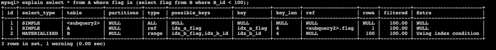
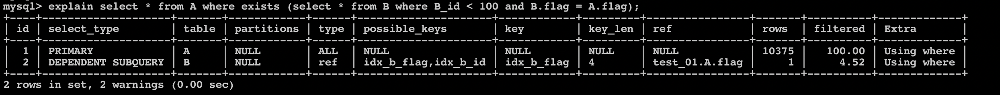
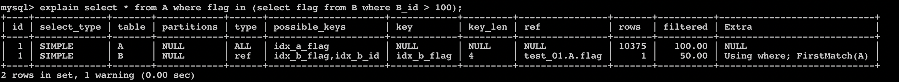

## MYSQL入门

### MYSQL 的分支、变种及替代

- Drizzle：从mysql fork 出来的，但是和mysql很不兼容。主要是用来提高数据库的可用性问题。
- MariaDB：包含了mysql所有功能，并提供更多的扩展。
- Percona Server：向后兼容mysql，提供对数据库内部执行逻辑对外开放和性能优化。
- Postgre SQL(PG)：稳定性极强，面对高并发、灾难备份等。
- SQLite：物联网数据库首选，无需启动进程就可运行。


### MYSQL 体系架构

#### 架构组件

> 在进入mysql内部之前，要依赖各种API接口，即客户端来发起链接。

- 连接池：创建链接、控制连接数、身份认证、获取用户权限、连接缓存。连接池减少链接创建、销毁的开销，提升mysql性能。
- 管理工具和服务：SQL复制、集群管理等。
- SQL接口：接收客户端的SQL语句，保存 存储过程、视图、触发器等。
- Parser：解析SQL语句，检查SQL语句的语法正确性，不正确就直接返回了。
- Optimizer：优化解析出来的SQL执行语句。例如在一个语句进行多表关联的时候，决定各个表的连接顺序。
- Caches&Buffer：5.7 以前版本，执行SQL时会默认开启查询缓存。
- 插件式引擎：mysql为操作引擎提供了统一接口，用户可根据需要使用不同的操作引擎，只要实现mysql的接口即可。当前MYSQL默认使用的引擎是InnoDB。在对表执行具体的读写操作时，会判断用户是否拥有对该表的操作权限。
- 文件与日志系统：数据库引擎的读写对象，占用磁盘空间。


#### 架构分层


- **连接层**    组件包含 连接池，主要作用是 创建新的连接线程、以及缓存已经创建好的线程；同时完成对客户端的身份认证、权限认证。

  ``` shell
  # 查看数据库配置的最大连接数
  mysql> show variables like '%max_connections%';
  +-----------------+-------+
  | Variable_name   | Value |
  +-----------------+-------+
  | max_connections | 151   |
  +-----------------+-------+
  1 row in set (0.01 sec)
  
  # 通常max_connections在小于2*CPU核数时，执行效率是最高的。
  ```

- **Server 层**	组件包含 SQL接口、Parser、Optimizer、Caches&Buffer。主要就是 接收客户端的SQL请求，完成对SQL的解析、语法检查、优化后，交给操作引擎执行语句。mysql 5.7 之后，不再默认开启缓存查询，因为 mysql 缓存采用hash映射保存，需要逐个字符检查是否命中，加之SQL语句千变万化，命中的概率更小，故在mysql 8.0 之后完全弃用了。

  ``` shell
  # 查看数据库是否开启缓存。查询版本为 5.7，缓存大小一般是 1M
  mysql> show variables like '%query_cache_type%';
  +------------------+-------+
  | Variable_name    | Value |
  +------------------+-------+
  | query_cache_type | OFF   |
  +------------------+-------+
  1 row in set (0.00 sec)
  ```

- **引擎层**	组件包含 引擎。这里是真正执行sql语句，读写磁盘的地方。引擎实现了对系统文件系统的具体操作。

  - InnoDB：5.5 版本之后的默认引擎，最开始是三方引擎。擅长处理大量的短事物。
  - MyISAM：5.5 版本之前的默认引擎。
  - Archive：压缩数据保存，占用空间很小，只支持插入和查询操作。但查询时需要解压，比较费时。主要应用在日志采集方面。
  - Blackhole：不做数据保存落盘，只记录操作日志。主要用于mysql复制，不拷贝磁盘数据，而是由从库自己执行语句落盘。
  - CSV：针对csv格式文件。主要用于数据处理方面。
  - Federated：实现本地数据库 访问 远程数据库中的数据。
  - Memory：数据放到内存中，读写很快。但是没有持久化。
  - NDB集群引擎：用于mysql集群。

  ``` shell
  mysql> show engines; # 查看数据库支持哪些引擎
  +--------------------+---------+----------------------------------------------------------------+--------------+------+------------+
  | Engine             | Support | Comment                                                        | Transactions | XA   | Savepoints |
  +--------------------+---------+----------------------------------------------------------------+--------------+------+------------+
  | MEMORY             | YES     | Hash based, stored in memory, useful for temporary tables      | NO           | NO   | NO         |
  | MRG_MYISAM         | YES     | Collection of identical MyISAM tables                          | NO           | NO   | NO         |
  | CSV                | YES     | CSV storage engine                                             | NO           | NO   | NO         |
  | BLACKHOLE          | YES     | /dev/null storage engine (anything you write to it disappears) | NO           | NO   | NO         |
  | MyISAM             | YES     | MyISAM storage engine                                          | NO           | NO   | NO         |
  | PERFORMANCE_SCHEMA | YES     | Performance Schema                                             | NO           | NO   | NO         |
  | ARCHIVE            | YES     | Archive storage engine                                         | NO           | NO   | NO         |
  | InnoDB             | DEFAULT | Supports transactions, row-level locking, and foreign keys     | YES          | YES  | YES        |
  | FEDERATED          | NO      | Federated MySQL storage engine                                 | NULL         | NULL | NULL       |
  +--------------------+---------+----------------------------------------------------------------+--------------+------+------------+
  
  mysql> show variables like '%storage_engine%'; # 查看默认使用的引擎
  +----------------------------------+--------+
  | Variable_name                    | Value  |
  +----------------------------------+--------+
  | default_storage_engine           | InnoDB |
  | default_tmp_storage_engine       | InnoDB |
  | disabled_storage_engines         |        |
  | internal_tmp_disk_storage_engine | InnoDB |
  +----------------------------------+--------+
  
  mysql> set default_storage_engine=MyISAM; #修改默认存储引擎
  Query OK, 0 rows affected (0.01 sec)
  
  mysql> show variables like '%storage_engine%';
  +----------------------------------+--------+
  | Variable_name                    | Value  |
  +----------------------------------+--------+
  | default_storage_engine           | MyISAM |
  | default_tmp_storage_engine       | InnoDB |
  | disabled_storage_engines         |        |
  | internal_tmp_disk_storage_engine | InnoDB |
  +----------------------------------+--------+
  4 rows in set (0.00 sec)
  ```
  
- MyISAM和InnoDB的比较

  <table border="1">
  <tr>
    <th width=100px>对比项</th>
    <th width=400px>MyISAM</th>
    <th>InnoDB</th>
  </tr>
  <tr>
    <td>外键</td>
    <td>不支持</td>
    <td>支持</td>
  </tr>
  <tr>
    <td>事物</td>
    <td>不支持</td>
    <td>支持</td>
  </tr>
  <tr>
    <td>行表锁</td>
    <td>表锁，即使操作一条记录也会锁住整个表<br><font style="color:red">不适合高并发</font></td>
    <td>行锁，操作时只锁住某一行，不对其他行有影响<br><font style="color:red">适合高并发</font></td>
  </tr>
  <tr>
    <td>缓存</td>
    <td>只缓存索引，不缓存真实数据</td>
    <td>不仅缓存索引还要缓存真实数据，对内存要求较高，而且内存的大小对性能有决定性影响</td>
  </tr>
  <tr>
    <td>表空间</td>
    <td>小</td>
    <td>大</td>
  </tr>
  <tr>
    <td>关注点</td>
    <td>性能</td>
    <td>事物</td>
  </tr>
  <tr>
    <td>默认安装</td>
    <td>Y</td>
    <td>Y</td>
  </tr>
  </table>
  
- **存储层**

  数据存储层，主要是将数据存储在文件系统之上，并完成与存储引擎的交互。


### 目录结构

- bin 目录：存放可执行文件

  - mysqld：mysqld服务器程序，用来启动mysql

  - mysqld_safe: 一个执行脚本，内部调用mysqld，同时启动一个 守护进程，当主进程mysql服务挂掉后，守护进程会再起动一个，同时mysqld_safe还会主动收集错误日志。

    ``` shell
    ./bin/mysql_safe --defaults-file=/var/local/my.conf --user=mysql &
    # 指定服务启动的配置文件、启动的用户信息，后台运行
    # 变量参数分类：
    # 按性质：
    # 	静态：在服务启动时指定，服务运行过程中不允许再做修改
    #   动态：与静态相反
    # 按作用域：
    #		全局：作用于所有实例的变量。修改时加上关键子字 global。 例如：set global rootdir="/db/dir"
    # 	局部：在当前实例生效的。修改变量时，直接 set 就可以
    ```

  - mysql.server: 默认不存放在bin目录，默认放在support_files文件夹。它内部调用mysqld_safe，用于启动和关闭mysql服务

    ``` shell
    mysql.server start/stop
    ```

  - mysql_multi: 用于在同一台服务器启动多个mysql实例

  - mysqladmin：客户端程序，检查mysql服务配置等

  - mysqldump：客户端程序，实现mysql逻辑备份

- 数据目录：存放mysql数据文件，数据目录路径在服务启动时，由conf 配置文件制定的

  ``` shell
  mysql> show variables like '%datadir%';  # 查看数据目录，这是个静态变量，只能通过配置文件修改重启服务生效
  +---------------+-----------------+
  | Variable_name | Value           |
  +---------------+-----------------+
  | datadir       | /var/lib/mysql/ |
  +---------------+-----------------+
  ```

  存放数据：

  - 库在文件系统中的表示。我们每创建一个database就会在datadir目录下新增一个以database命名的文件夹。

  - 表在文件系统中的表示。在database的文件夹中，就存放了每张表的数据文件。其中 表名.frm 记录表的结构（列名、数据类型、外键信息等）。表名.ibd 存放表的数据和索引。MyISAM引擎创建的表用 表名.MYD 存储数据；表名.MYI 存储索引。

  - 数据存放位置。在mysql 5.5.8 之后，将会为每张表都创建一个独立的空间（表空间）来保存表相关数据。

  - 日志文件。包括 错误日志、慢查询日志（默认是不开启的）、查询日志（默认是不开启的，比较影响性能）、binlog 日志。

    ``` shell
    mysql> show variables like '%log_error%';  # 此时的错误日志并没有输出到日志文件
    +---------------------+--------------+
    | Variable_name       | Value        |
    +---------------------+--------------+
    | binlog_error_action | ABORT_SERVER |
    | log_error           | stderr       |
    | log_error_verbosity | 3            |
    +---------------------+--------------+
    3 rows in set (0.00 sec)
    
    
    mysql> show variables like '%general_log%';  # 查询日志默认关闭
    +------------------+---------------------------------+
    | Variable_name    | Value                           |
    +------------------+---------------------------------+
    | general_log      | OFF                             |
    | general_log_file | /var/lib/mysql/3d84bd4ee18b.log |
    +------------------+---------------------------------+
    2 rows in set (0.00 sec)
    
    mysql> show variables like '%slow_query_log%';  # 慢查询日志
    +---------------------+--------------------------------------+
    | Variable_name       | Value                                |
    +---------------------+--------------------------------------+
    | slow_query_log      | OFF                                  |
    | slow_query_log_file | /var/lib/mysql/3d84bd4ee18b-slow.log |
    +---------------------+--------------------------------------+
    2 rows in set (0.00 sec)
    
    mysql> set global slow_query_log = ON;  # 打开慢查询日志
    Query OK, 0 rows affected (0.03 sec)
    ```

  - 二进制文件（bin log）:记录所有对mysql数据修改的操作。当进行数据库的迁移时，就是读取的 bin log日志，在新库中执行相同的数据修改操作。


## MYSQL中表设计和数据类型优化

### 范式化设计

> 范式来源于英文 Normal Form，简称NF。要想设计一个好的关系，必须使关系满足一定的约束条件，此约束已经形成了规范，分成几个等级，一级比一级要求严格。满足这些规范的数据库是简洁的、结构明晰的。
>
> 六种范式：
>
> - 第一范式（1NF）
> - 第二范式（2NF）
> - 第三范式（3NF）
> - 巴斯-科德范式（BCNF）
> - 第四范式（4NF）
> - 第五范式（5NF，又称完美范式）

#### 第一范式（1NF）

- 每一列的属性都是不可再分的属性值，确保每一列的原子性；
- 两列的属性相似或相近或一样。尽量合并属性一样的列，确保不产生冗余数据；
- 单一属性的列为基本数据类型构成；
- 设计出来的表都是简单的二维表。

#### 第二范式（2NF）

- 第二范式是在第一范式的基础之上建立起来的；
- 要求实体（表）的属性完全依赖于主关键字（主键）。所谓完全依赖是指不能存在仅依赖主关键字一部分的属性，如果存在，那么这个属性和主关键字的这一部分应该分离出来形成一个新的实体，新实体和原实体是一对多的关系。例如：订单和商品的对应关系，同一订单对应多个商品，那么就不能以 **订单编号和商品ID** 作为联合主键 来创建表；而应该把订单信息作为一张表，而订单和商品的对应关系作为另一张表。
  - 总结就是说用唯一的列作为主键，而不是多列作为联合主键。

#### 第三范式（3NF）

- 第三范式是在第二范式的基础上建立的
- 要求是一个数据表中不包含已在其他表中包含的非主键信息。即数据不能存在传递关系，每个属性都跟主键有直接关系而不是间接关系。例如：有一个商品表，记录 商品ID（主键）、商品名称。那么在订单表中，就只能出现 商品ID ，不能再出现商品名称 或只出现商品名称。

### 反范式化设计

>所谓反范式化设计，就是针对范式化设计而言的。
>
>1. 为了性能和读取效率而适当的违反数据设计范式的要求。
>2. 为了查询性能，允许存在部分冗余数据（减少联查）。换句话说，反范式设计就是使用空间换时间。

反范式优点总结：

- 性能提升-冗余、缓存和汇总
  - 冗余：将特定表中的多个属性放到另一个需要经常关联查询的表中。例如：将 商品表中的 商品名称 连通ID 一起放到订单表中，这样每次查询订单的时候就可以直接拿到商品名称，而不用关联查询。
  - 缓存：对数据库中某一字段的频繁操作，可以先缓存起来，统一写入数据库。例如：一个统计用户发送消息条数的表，那么就可以先用redis来缓存具体的条数，每隔一段时间写一次库。
  - 汇总：当经常需要对数据库表进行GRROUP BY分组统计时，可以单独在创建一张汇总表。通常都是统计报表用的比较多，且对数据的实时性要求并不高，所以通常采用定时任务的方式，按固定周期统计一次数据到汇总表。
- 性能提升-计数器表
  - 计数器表：同上面 性能提升-缓存 场景一样，如果对用户的点击数进行统计，那么应该单独创建一个计数器表，该表很小，只需要有一个 user_id 和 count 字段即可。
  - **扩展**：如果要统计全站的点击数，在不使用redis缓存的场景下，表中某一行的将成为巨量用户修改的hotkey，此时如果采用行锁，将很影响性能。此时采用 热点分散 的思想，在计数器表中，创建一万个统计行，每个用户更新数据时，更新任意一行即可。而要得到全站的点击数，只需要统计这一万行的总数即可。
- 反范式设计-分库分表中的查询
  - 分库分表中的反范式：比如：电商网站中，分别以买家和卖家的为度查询商品信息，此时以任意一方的为度去保存商品信息，都会很影响对方对数据的统计查询。所以此时干脆将商品信息案卖家和买家为度各创建一张表，将原来的一张商品信息表，根据卖家、买家的相关属性拆分成两张表。


### 数据类型优化

> MySQL支持的数据类型非常多，选择正确的数据类型对于获得高性能至关重要。不管存储那种类型的数据，下面几个原则都有助于做出更好的选择。
>
> - **更小的通常更好**
>
>   一般情况下，应该尽量使用可以正确存储数据的最小数据类型（例如只需要存0-200，tinyint unsigned更好）。更小的数据类型通常更快，因为它们占用更少的磁盘、内存和CPU缓存，并且处理时需要的CPU周期也更少。
>
> - **简单就好**
>
>   简单数据类型的操作通常需要更少的CPU周期。例如，**整型比字符操作代价更低**，因为字符集和校对规则（排序规则）是字符串比较比整型比较更复杂。这里有两个例子：一个是应该用MySQL内建的类型（比如date,time,datetime）而不是字符串来存储日期时间，另外一个是应该用整型来存储IP地址。
>
> - **尽量避免使用NULL**
>
>   很多表都包含了可为NULL的列，即使应用程序不需要保存NULL也是如此，这是因为可为NULL是列的默认属性。通常情况下最好指定列为NOT NULL，除非真的需要存储NULL值。
>
>   如果查询中包含可为NULL的列，对MySQL来说更难优化，因为可为NULL的列使得索引、索引统计和值比较都更复杂。可为NULL的列会使用更多的存储空间，在MySQL里也需要特殊处理。当可为NULL的列被索引时，每个索引记录需要一个额外的字节，在MyISAM中甚至还可能导致固定大小的索引（例如只有一个整数列的索引）变成可变大小的索引。
>
>   通常把可为NULL的值改为NOT NULL带来的性能提升比较小，所以（调优时）没有必要首先在现有的schema中查找并修改掉这种情况，除非确定这会导致问题。但是，如果计划在列上建立索引，就应该避免设计成可为NULL的列。
>
>   **当然也有例外，例如值得一提的是，InnoDB使用单独的位（bit）存储NULL值，所以对于稀疏数据（大部分值为NULL，只有少数行为非NULL的值）有良好的空间效率。但这一点不适用于MyISAM。**


#### 整数类型

整数类型：TINYINT, SMALLINT, MEDIUMINT, INT, BIGINT。分别使用8,16,24,32,64位存储空间。它们的存储范围从 -2的(N-1)次方 到 2的(N-1)次方-1，其中N为存储空间的位数。

整数类型有可选的 **UNSIGNED** 属性，表示不允许负值，这大致可以使正数的上限提高一倍，例如TINYINT UNSIGNED可以存储的范围是0-255，而TINYINT 的存储范围是-128~127。

MySQL可以为整数类型指定宽度，例如INT(11)，对大多数应用这是没有意义的：他不会限制值的合法范围，只是规定了MySQL的一些交互工具（例如MySQL命令行客户端）用来显示字符的个数。对于存储来说，INT(1)和INT(20)是相同的。


#### 实数类型

实数是带有小数部分的数字。然而，它们不只是为了存储小数部分，也可以使用DECIMAL存储比BIGINT还大的整数。MySQL既支持精确类型，也支持不精确类型。

FLOAT 和 DOUBLE 类型支持使用标准的浮点运算进行近似计算。如果需要知道浮点运算时怎么计算的，则需要研究所使用的平台的浮点数的具体实现。

DECIMAL 类型用于存储精确的小数。但因为CPU不支持对DECIMAL的直接计算，所以在MySQL5.0及更高版本中，MySQL服务器自身实现了DECIMAL的高精度计算。相对而言，这比CPU直接支持原生浮点数运算要慢。

浮点和DECIMAL类型都可以指定精度。对于DECIMAL列，可以指定小数点前后所允许的最大位数。这会影响列的空间消耗。DECIMAL最大保存65个数字，本质是以字符形式保存的。

**浮点类型在存储同样范围的值时，通常比DECIMAL使用更少的空间。FLOAT使用4个字节存储，DOUBLE占用8个字节，相比FLOAT有更高的精度和更大的范围。**

因为需要额外的空间和计算开销，所以应该尽量只在对小数进行精确计算时才使用DECIMAL——例如存储财务数据。但数据量比较大的时候，可以考虑使用BIGINT代替DECIMAL，将需要存储的货币单位根据小数点的位数乘以相应的倍数即可。假设要存储财务数据精确到万分之一分，则可以把所有金额乘以100W，然后将结果存储在BIGINT里，这样可以同时避免浮点存储计算不精确和DECIMAL精确计算代价高的问题。


#### 字符串类型

下面的描述假设使用的存储引擎是InnoDB/或者MyISAM。如果不是这两种存储引擎的，请参考所使用的存储引擎的文档。

- **VARCHAR和CHAR**

  - **VARCHAR:** 它比定长类型更节省空间，因为它仅使用必要的空间。VARCHAR节省了空间，所以对性能也有帮助。但是由于行是变长的，在UPDATE时可能使行变得比原来更长，这就导致需要做额外的工作。

    下面的情况使用VARCHAR是合适的：字符串最大长度比平均长度大很多；列的更新少，所以碎片不是问题；使用了像UTF-8这样复杂的字符集，每个字符使用不同的字节数。

    在5.0或更高的版本中，MySQL在存储和检索时会保留末尾空格。InnoDB则更灵活，它可以把长的VARCHAR存储为BLOB。

  - **CHAR: **定长，当存储CHAR值时，MySQL会删除所有的末尾空格。定长的CHAR类型不容易产生碎片，对于非常短的列，CHAR比VARCHAR在存储空间上也更有效率，VACHAR还有一个或两个记录长度的额外字节。CHAR适合存储很短的字符串，或者所有值都接近同一个长度。例如：**CHAR非常适合存储密码的MD5值，因为这是一个定长的值。CHAR会根据需要采用空格填充以方便比较。**

  与CHAR和VARCHAR类似的类型还有BINARY和VARBINARY，它们存储的是二进制字符串。二进制字符串中存储的是字节码而不是字符。

  二进制比较的优势并不仅仅体现在大小写敏感上。MySQL比较BINARY字符串是，每次按一个字节，并且根据该字节的数值进行比较。因此，二进制比字符比较简单的多，所以也就更快。

- **BLOB 和 TEXT类型**

  BLOB和TEXT类型：BLOB和TEXT都是为了存储很大的数据而设计的字符串数据类型，分别采用**二进制**和**字符**方式存储。当BLOB和TEXT值太大时，InnoDB会使用专门的”外部”存储区域来进行存储。原表字段存储指针指向外部存储区域。

  MySQL对BLOB和TEXT列进行排序与其他类型是不同的：它只对列最前`max_sort_length` 字节而不是整个字符串做排序。如果只需要排序前面一小部分字符，则可以减小`max_sort_length` 的配置，或者使用`ORDER BY SUSTRING(column, length)`。

  MySQL不能将BLOB和TEXT列全部长度的字符串进行索引，也不能使用这些索引消除排序。

  ``` mysql
  # 创建表。这里指定max_sort_length为10。blob和text类型不能有默认值
  # 通常在有bolb、text类型的字段单独放在一张表，同时再新增一个hash_value列，用于数据查找。
  create table demo_blob (
  `id` int unsigned auto_increment,
  `content` blob(10),
  `hash_value` char,
  primary key (`id`)
  )engine=InnoDB charset=UTF8;
  
  # 插入数据
  INSERT into demo_blob(content, hash_value) values ('大概撒加好多个洒脱的嘎世界各地呀个撒娇的嘎升级换代撒回家的规划', md5(content)); 
  
  # 查询数据
  select * from flask.demo_blob db where db.hash_value = md5('大概撒加好多个洒脱的嘎世界各地呀个撒娇的嘎升级换代撒回家的规划');
  ```

  

- **使用枚举（ENUM）代替字符串类型**

  可以使用枚举（ENUM）代替字符串类型。很多时候建议使用枚举列代替常用的字符串类型。

  （1）枚举列可以把一些不重复的字符串存储成一个预定义的集合。
  （2）Mysql在存储枚举时非常紧凑，会根据列表值的数量压缩到一到两个字节中。
  （3）Mysql在内部会将每个值在列表中的位置保存为整数，并且在表的.frm文件中保存“数字-字符串”映射关系的“查找表”。

  <font style="color:red">注意：有一个令人吃惊的地方是，枚举字段是按照内部存储的整数而不是定义的字符串进行排序的。</font>

  <font style="color:red">注意：枚举最不好的地方是：字符串列表是固定的，添加或者删除字符串必须使用ALTER TABLE，因此对于一系列未来可能会改变的字符串，使用枚举并不是一个好主意，除非接受只能在列表末尾添加元素。</font>

  <font style="color:red">注意：由于Mysql把每个枚举值保存为整数，并且必须进行查找才能转换为字符串，所以枚举列有一些额外开销。</font>

  ``` mysql
  # 创建表
  create table demo_enum(
  `id` int unsigned auto_increment,
  `sex` enum('男','女'),
  primary key (`id`)
  )engine=InnoDB charset=UTF8;
  
  # 插入数据时，可以插入原始字符，也可以插入enum中字符的位置参数，从1开始
  insert into demo_enum(sex) values ('男'), (2);
  ```

  

#### 日期时间类型

> 数据类型及用法详见 ： http://blog.csdn.net/qq_28602957/article/details/54670699
>
> Mysql有很多类型可以保存日期和时间值，比如YEAR和DATE。
>
> Mysql能存储的最小时间粒度为秒（MariaDB支持微秒级别的事件类型）。但是Mysql也可以使用微秒级别的粒度进行临时运算。
>
> 大部分时间类型都没有替代品，因此没有什么是最佳选择的问题。
>
> 接下来唯一的问题是保存日期和时间的时候需要做什么。

- **DATETIME**
  - （1）这个类型能保存大范围的值，从1001年到9999年，精度为秒。 
  - （2）DATETIME把时间和日期封装到格式为YYYYMMDDHHMMSS的整数中，与时区无关。 
  - （3）DATETIME使用8个字节的存储空间。

- **TIMESTAMP**
  
  - （1）TIMESTAMP类型保存了从1970年1月1日午夜以来的秒数，它和UNIX时间戳相同。 
  - （2）TIMESTAMP只使用4个字节的存储空间，因此**它的范围比DATETIME小得多**。 
  - （3）TIMESTAMP显示的值依赖时区。
  
  ``` mysql
  CREATE TABLE demo_time(
  `id` INT PRIMARY KEY,
  `date` TIMESTAMP DEFAULT CURRENT_TIMESTAMP
  );
  ```
  
- **DATETIME和TIMESTAMP的对比:**
  - （1）默认情况下，如果插入时没有指定第一个TIMESTAMP列的值，Mysql则设置这个列的值为当前时间。（这是DATETIME没有的特性）
  - （2）在插入一行记录时，Mysql默认也会更新第一个TIMESTAMP列的值。 
  - （3）TIMESTAMP列默认为NOT NULL，这与其他的数据类型不一样。

**总结**

- （1）除了特殊行为之外，通常也应该尽可能使用TIMESTAMP，因为它比DATETIME空间效率更高。 
- （2）一般来讲不建议把UNIX时间戳保存为整数值，这不会带来任何收益，用整数保存时间戳格式通常不方便处理。 
- （3）如果需存储比秒更小粒度的日期和时间值，可以使用BIGINT类型存储微秒级别的时间戳，或者使用DOUBLE存储秒之后的小数部分，也可以用MariaDB替代Mysql。


#### 位数据类型

> MySQL有少数几种存储类型使用紧凑的位存储数据。所有这些位类型，不管底层存储格式和处理方式如何，从技术上来说都是字符串类型的。

- BIT

  可以使用BIT列在一列中存储一个或多个true/false值。BIT(1)定义了一个包含单个位的字段，BIT(2)存储2个位，依次类推。BIT列的最大长度是64位。

  如果想在一个bit的存储空间中存储一个true/false值，另一个方法是创建一个可以为空的CHAR(0)列。该列可以保存空值(NULL)或者长度为零的字符串(空字符串)。

- SET

  如果需要保存很多true/false 值，可以考虑合并这些列到一个SET 数据类型，它在MySQL 内部是以一系列打包的位的集合来表示的。这样就有效地利用了存储空间，并且MySQL 有像FIND_IN_SET（） 和FIELD（） 这样的函数，方便地在查询中使用。它的主要缺点是改变列的定义的代价较高：需要ALTER TABLE,这对大表来说是非常昂贵的操作。一般来说，也无法在SET 列上通过索引查找。

  **一种替代SET 的方式是使用一个整数包装一系列的位。例如，可以把8 个位包装到一个TINYINT 中，并且按位操作来使用。可以在应用中为每个位定义名称常量来简化这个工作。**

  比起SET,这种办法主要的好处在于可以不使用ALTER TABLE 改变字段代表的”枚举”值，缺点是查询语句更难写，并且更难理解（当第5 个bit 位被设置时是什么意思？）。一些人非常适应这种方式，也有一些人不适应，所以是否采用这种技术取决于个人的偏好。


#### 选择标识符（identifier）

> 为identifier（标识列）选择合适的数据类型非常重要。
>
> 一般来讲更有可能用标识列与其他值进行比较，或者通过标识列寻找其他列。
>
> 当选择标识列的类型时，不仅仅需要考虑存储类型，还需要考虑Mysql对这种类型怎么执行计算和比较。
>
> 一旦选定了一种类型，要确保在所有关联表中都使用同样的类型。
>
> 在可以满足值的范围需求，并且预留未来增长空间的前提下，应该选择最小的数据类型。

- 整数通常是标识列最好的选择，因为它们很快而且可以使用`AUTO_INCREMENT`。
- ENUM和SET是最糟糕的选择了。
- 如果可能也尽可能避免使用字符串作为标识列，因为它们很消耗空间并且通常比数字类慢。


#### 特殊类型数据

某些类型的数据并不直接与内置类型一致。低于**秒级精度的时间戳**就是一个例子。

另一个例子是人们通常使用VARCHAR(15)来存储IP地址。然而，它们实际是32位无符号整数，不是字符串。用小数点将字段分割成四段是为了阅读方便。所以**应该用无符号整数存储IP地址**。MySQL提供`INET_ATON()`和`INET_NTOA()`函数在这两种表示方法之间转换。


## MYSQL概念精讲

### 变量

- 变量类型

  - 用户变量：以"@"开始，形式为"@变量名"。用户变量跟mysql客户端是绑定的，设置的变量，只对当前用户使用的客户端生效。
  - 全局变量：定义时，以如下两种形式出现，`set GLOBAL 变量名` 或者 `set @@global.变量名`，对所有客户端生效。只有具有super权限才可以设置全局变量。
  - 会话变量：是指当前建立会话中的变量，它包含全局变量。修改变量使用 `set @@变量名`，修改后仅对当前客户端生效。
  - 局部变量：作用范围在begin到end语句块之间。在该语句块里设置的变量。declare语句专门用于定义局部变量。set语句是设置不同类型的变量，包括会话变量和全局变量。

- 变量赋值

  - = 号赋值。= 仅在关键字 set 后面才表示赋值，其他场景均作为 逻辑判断 符号。

    ```mysql
    set @aa = 3;
    ```

  - := 赋值。mysql中，通用的赋值符号。

    ```mysql
    set @bb := 5;
    select @cc := 10;
    ```


### 约束

**约束（CONSTRAINT）**，就是 一种限制，用于限制表中的数据，为了保证表中数据的准确性和可靠性。

约束可以在创建表时添加，也可以在修改表时添加。

添加约束，根据约束级别不同，又分为 列级约束 和 表级约束。


#### 约束分类

> 常用的标识：
>
> AUTO_INCREMENT：自增标识。使用该标识的列，可以不用手动的插入值，系统提供默认的序列值。
>
> UNSIGNED：非负标识。使用该标识的数值列，不取负数。

1. NOT NULL ：非空，用于保证该字段的值不能为空。

2. DEFAULT：默认值，用于保证该字段有默认值。

3. PRIMARY KEY：主键，用于保证该字段的值具有唯一性，不能为空。

4. UNIQUE：唯一，用于保证该字段的值具有唯一性，可以为空。又叫唯一索引，因为创建唯一约束，会同时创建索引。

5. CHECK：检查约束（MySql不支持），检查字段的值是否为指定的值。

6. FOREIGN KEY：外键，用于限制两个表的关系，用于保证该字段的值必须来自于主表的关联列的值，在从表添加外键约束，用于引用主表中某些的值。

   > 外键：
   >
   > 1. 要求在从表中设置外键关系
   > 2. 从表的外键列的类型和主表的关联列的类型要求一致或兼容，名称无要求
   > 3. 主表的关联列必须是一个Key（一般为主键或唯一，外键也可以但无意义）
   > 4. 插入数据时，先插入主表，再插入从表；删除数据时，先删除从表，再删除主表


#### 创建表时添加约束

- 列级约束

  ```mysql
  create table if not exists t_stuinfo(
       id int primary key,    #主键
       stuName varchar(20) not null,    #非空
       gender char(1) check(gender='男' or gender='女'),    #检查约束，MySql没有效果但不报错
       seat int unique,    #唯一约束
       age int default 18,    #默认（值）约束
       majorId int references major(id) #外键约束，MySql没有效果，但不报错
       ); 
  ```

- 表级约束

  ```mysql
  create table if not exists t_stuinfo2(
       id int,
       stuName varchar(20),
       gender char(1),
       seat int,
       age int,
       majorId int,
       constraint pk primary key(id),    #约束名随意，主键不生效，但不报错。
       constraint uq unique(seat),    #唯一约束
       key(gender),
       constraint fk_stuinfo_major foreign key(majorId) references major(id)    #外键约束
       );
  ```


#### 修改表时添加/删除约束

修改表时的操作不在举例，给出通用语法。一看就会。

**增加约束语法：**

- 增加列级约束

  ```mysql
  ALTER TABLE 表名 MODIFY COLUMN 列名 数据类型 约束类型;			# 其实就是直接修改某一列的约束
  ```

- 增加表级约束

  ```mysql
  # 通用表级约束
  ALTER TABLE 表名 ADD CONSTRAINT 约束名 约束类型(列名) [REFERENCES 主表名(主表列名)];
  
  # 主键约束
  ALTER TABLE 表名 ADD PRIMARY KEY(列名);
  
  # 唯一约束
  ALTER TABLE 表名 ADD UNIQUE(列名);
  ```


**删除约束语法：**

- 删除主键约束

  ```mysql
  ALTER TABLE 表名 DROP PRIMARY KEY;
  ```

- 删除唯一约束

  ```mysql
  ALTER TABLE 表名 DROP INDEX 索引名 列名/约束名;			# 列级约束，索引名就是列名；表级约束，索引名就是定义时的约束名
  ```

- 删除外键约束

  ```mysql
  ALTER TABLE 表名 DROP FOREIGN KEY 外键名称;					# 外键名称通常就是约束名称
  ```

- 删除其他约束

  前面三个比较特殊，其他约束通过 modify 修改即可。

  ```mysql
  ALTER TABLE 表名 MODIFY COLUMN 列名 类型;			# 	本质上就是重新定义了列
  ```

  


### 外键

> 1. MySQL中“键”和“索引”的定义相同，所以外键和主键一样也是索引的一种，MySQL会自动为所有表的主键进行索引。外键列也要求必须建立索引，MySQL 4.1.2以后的版本在建立外键时会自动创建索引，但如果在较早的版本则需要显示建立。
>
> 2. 外键可以是一对一的，或者一对多的。
> 3. 外键关系的两个表的列必须是数据类型相似，也就是可以相互转换类型的列，比如int和tinyint可以，而int和char则不可以。
>
> 4. 如果需要更好的性能，并且不需要完整性检查，可以选择使用MyISAM表类型，如果想要在MySQL中根据参照完整性来建立表并且希望在此基础上保持良好的性能，最好选择表结构为InnoDB类型。

语法：

```mysql
# 外键语法在create table 和 alter table 时使用
[CONSTRAINT symbol] FOREIGN KEY [id] (index_col_name, ...)
REFERENCES tbl_name (index_col_name, ...)  # 把references指向的表称为主表
[ON DELETE {RESTRICT | CASCADE | SET NULL | NO ACTION | SET DEFAULT}]
[ON UPDATE {RESTRICT | CASCADE | SET NULL | NO ACTION | SET DEFAULT}]

# ON DELETE、ON UPDATE表示事件触发限制，可设参数：
  # RESTRICT（限制主表中有关联外键的列的改动）
  # CASCADE（跟随外键改动）
  # SET NULL（设空值）
  # SET DEFAULT（设默认值）
  # NO ACTION（无动作，默认的）
```

示例：

```mysql
# 创建主表
create table `dage` (
	`id` int unsigned auto_increment,
	`name` varchar(20) not null,
	primary key (`id`)
)engine=InnoDB default charset=utf8;

# 创建外键表。constraint 相当于给外键取了一个别名，如果不指定，mysql将自动生成一个。
create table `xiaodi` (
	`id` int unsigned auto_increment,
	`name` varchar(20) not null,
	`dage_id` int unsigned not null,  # 外键字段类型要和主表的字段保持一致
	primary key (`id`),
	constraint `fk_xd_dg` foreign key (`dage_id`) references `dage` (`id`) on update cascade on delete restrict
)engine=InnoDB default charset=utf8;


# 插入数据
insert into dage(name) values ('yanguo');
insert into xiaodi(name, dage_id) values('xuzu', 1);

# 根据表创建的外键约束。更新主表的信息时，从表也会跟随更新
update dage set id = 3 where id =1;
mysql> select * from xiaodi;
+----+------+---------+
| id | name | dage_id |
+----+------+---------+
|  1 | xuzu |       3 |
+----+------+---------+
1 row in set (0.00 sec)

# 此时如果删除主表的数据，将会报错。因为外键约束中 on delete 是 restrict
mysql> delete from dage where id = 3;
ERROR 1451 (23000): Cannot delete or update a parent row: a foreign key constraint fails (`demo_01`.`xiaodi`, CONSTRAINT `fk_xd_dg` FOREIGN KEY (`dage_id`) REFERENCES `dage` (`id`) ON UPDATE CASCADE)

# 把外键的约束修改成cascade，就可以删除主表的数据了，但同时也会删除掉外键表中的数据
alter table `xiaodi` drop foreign key fk_xd_dg;
alter table `xiaodi` add constraint `fk_xd_dg` foreign key (`dage_id`) references `dage` (`id`) on update cascade on delete cascade;

mysql> select * from xiaodi;
Empty set (0.00 sec)
```


### 事物

> 事物是数据库管理系统(DBMS)执行过程中的一个逻辑单位（不可再进行分割），由一个有限的数据库操作序列构成（多个DML语句，select语句不包含事物），要不全部成功，要不全部不成功。
>
> 在musql中事物是默认提交的，如果需要控制事物提交，则需要先开启事物，然后手动提交。
>
> start transication;
>
> commit;

#### 四大特性（ACID）

- **原子性（Atomicity）**：即事物是执行过程中不可以再分割的一个逻辑单位。
- **一致性（Consistency）**：保证数据的一致性，即事物修改数据前后一定是和事物的修改规则一致的。
- **持久性（Durability）**：持久性就是事物修改数据后，进行持久化保存，不会因为宕机、断电等情况丢失数据。
- **隔离性（Isolation）**：即多个事物之间，操作相同数据对象时，是相互不影响的。要实现事物的隔离，就必须要求事物的执行是串行的；但是串行执行事物，与会严重影响数据库性能。所以很多时候，会选择牺牲部分隔离性，来提升数据库性能，也因此会带来以下一些问题。
  - **丢失更新:** 当两个或多个事物选择同一行，最初的事物修改的值，会被后面的事物修改的值覆盖。
  - **脏读：**一个事物读取到了另外一个事物修改但是未提交的数据。
  - **不可重复读：**当事物内相同的记录被检索两次，且两次得到的结果不相同时，称之为不可重复读。
  - **幻读：**在事物执行过程中，另一个事物将新纪录添加到正在读取的事物中时，会发生幻读。在SQL 92 标准中，幻读是指在同一事物中，两次执行检索到的记录条数不一样（新增/减少）；而在MYSQL的标准中，幻读强调第二次检索时，检索到了第一次检索不存在的记录，而把丢失第一次检索记录归到不可重复读。


#### 隔离级别

- READ UNCOMMITED（未提交读）：可能产生 脏读、不可重复读、幻读。
- READ COMMITED（已提交读）：可能产生 不可重复读、幻读。
- REPEATABLE READ（可重复读）：SQL 92 标准中可能产生 幻读；MYSQL 标准中 已基本解决幻读，mysql默认的事物隔离级别。可重复读就是说，同一事物中，前后检索多次的记录是一样的。
- SERIALIZABLE（可串行化）：最高隔离性级别，不存在数据不安全的问题，但牺牲了数据库性能。


### 索引

> 索引（Index）是帮助MySQL高效获取数据的数据结构。在数据之外，数据库还维护着满足特定查找算法的数据结构，这些数据结构以某种方式引用（指向）数据，这样就可以在这些数据结构上实现高级查找算法，这种数据结构就是索引。
>
> **优势：**
>
> - 类似于书籍的目录索引，提高数据的检索效率，降低数据库的IO成本。
> - 通过索引列对数据进行排序，降低数据排序的成本，降低CPU的消耗。
>
> **劣势：**
>
> - 索引本质上也是一张表，该表中保存了主键和索引字段，并指向实体类的记录。因此索引也是要占用空间的，如果索引本身占用空间较大时，还会以索引文件的形式存储到磁盘上。
> - 索引提高了查询效率，但同时也降低了DML语句的执行效率，因为不仅要更新实体表的数据，还需要跟新索引中的字段。


#### 索引结构

索引是在存储引擎层实现的，而不是在服务层实现的。所以每种存储引擎的索引不一定完全相同，也不是所有的存储引擎都支持所有的索引结构的。MySQL目前提供了以下4种索引：

- BTREE索引：最常见的索引类型，大部分存储引擎都支持B树索引。
- HASH索引：只有Memory引擎支持，使用场景简单。
- R-tree索引（空间索引）：MyISAM引擎的一个特殊索引类型，主要用于地理空间数据类型，通常使用较少，不做特别介绍。
- Full-text索引（全文索引）：也是MyISAM引擎的一个特殊索引类型，InnoDB从Mysql 5.6版本开始支持全文索引。


**MyISAM、InnoDB、Memory三种存储引擎对索引类型的支持**

<table border=1>
  <tr>
    <th  width=100px>索引类型</th>
    <th  width=200px>InnoDB引擎</th>
    <th  width=200px>MyISAM引擎</th>
    <th  width=200px>Memory引擎</th>
  </tr>
  <tr>
    <td>BTREE索引</td>
    <td>支持</td>
    <td>支持</td>
    <td>支持</td>
  </tr>
  <tr>
    <td>hash索引</td>
    <td>不支持</td>
    <td>不支持</td>
    <td>支持</td>
  </tr>
  <tr>
    <td>R-tree索引</td>
    <td>不支持</td>
    <td>支持</td>
    <td>不支持</td>
  </tr>
  <tr>
    <td>Full-text</td>
    <td>5.6 版本之后支持</td>
    <td>支持</td>
    <td>不支持</td>
  </tr>
</table>

我们平常所说的索引，如果没有特别指明，都是指B+树（多路搜索树，并不一定是二叉树）结构组织的索引。其中 聚集索引、符合索引、前缀索引、唯一索引 默认都是使用的 B+树 索引，统称为 索引。

<font style="color:red">Mysql 索引数据结构对经典的B+树进行了优化。在原有的基础上，增加一个指向相邻叶子结点的链表指针，就形成了带有顺序指针的B+树，提高区间访问的性能。</font>


#### 索引分类

- **单值索引：**即一个索引只包含单个列，一个表可以有多个单值索引。
- **唯一索引：**索引列的值必须唯一，但允许有一个或多个空值。
- **复合索引：**包含多个列的索引。


#### 索引语法

> 索引在创建表的时候，可以同时创建，也可以随时增加新的索引。

##### 已创建表增删索引

**准备环境：**

``` mysql
create database demo_01 default charset=utf8;

use demo_01;

CREATE TABLE `city` (
	`city_id` int(11) not null auto_increment,
	`city_name` varchar(50) not null,
	`country_id` int(11) not null,
	primary key (`city_id`)
)engine=InnoDB default charset=utf8;

CREATE TABLE `country` (
	`country_id` int(11) not null auto_increment,
	`country_name` varchar(100) not null,
	primary key (`country_id`)
)engine=InnoDB default charset=utf8;

INSERT into `city` (`city_id`, `city_name`, `country_id`) values (1, '西安', 1), (2, 'NewYork', 2), (3, '北京', 1), (4, '上海', 1);

INSERT into `country` (`country_id`, `country_name`) values (1, 'China'), (2, 'America'), (3, 'Japan'), (4, 'UK');
```


**创建索引：**

语法：

``` mysql
CREATE [UNIQUE|FULLTEXT|SPATIAL] INDEX index_name [USING index_type] ON tbl_name(index_col_name, ...);

index_col_name: column_name[(length)][ASC | DESC]
index_type: 默认使用BTREE索引结构
```

示例：

``` mysql
mysql> create index idx_city_name on city(city_name);
Query OK, 0 rows affected (0.12 sec)
```


**查看索引：**

语法：

``` mysql
show index from tbl_name;
```

示例：

``` mysql
mysql> show index from city\G;   # \G 的作用是切换一下输出的样式，由默认的横表切换为纵表
*************************** 1. row ***************************
        Table: city
   Non_unique: 0
     Key_name: PRIMARY
 Seq_in_index: 1
  Column_name: city_id
    Collation: A
  Cardinality: 4
     Sub_part: NULL
       Packed: NULL
         Null:
   Index_type: BTREE
      Comment:
Index_comment:
*************************** 2. row ***************************
        Table: city
   Non_unique: 1
     Key_name: idx_city_name
 Seq_in_index: 1
  Column_name: city_name
    Collation: A
  Cardinality: 2
     Sub_part: NULL
       Packed: NULL
         Null:
   Index_type: BTREE
      Comment:
Index_comment:
2 rows in set (0.00 sec)
```


**删除索引：**

语法：

```mysql
drop index index_name on tbl_name;
```

示例:

```mysql
mysql> drop index idx_city_name on city;
Query OK, 0 rows affected (0.01 sec)
Records: 0  Duplicates: 0  Warnings: 0
```


**ALTER 索引相关命令：**

语法：

```mysql
# 添加主键索引，要求索引值必须是唯一的，且不能为 null
alter table tbl_name add primary key(column_list);
# 添加唯一索引，要求索引值必须是唯一的，但是 null 除外，且可以有多个 null 值
alter table tbl_name add unique index_name(column_list);
# 添加普通索引
alter table tbl_name add index index_name(column_list);
# 添加全文索引
alter table tbl_name add fulltext index_name(column_list);

# 删除索引
alter table tbl_name drop index index_name;
```

示例：

```mysql
# 创建唯一索引
mysql> alter table city add unique idx_city_name(city_name);
Query OK, 0 rows affected (0.03 sec)
Records: 0  Duplicates: 0  Warnings: 0

# 删除索引
mysql> alter table city drop index idx_city_name;
Query OK, 0 rows affected (0.02 sec)
Records: 0  Duplicates: 0  Warnings: 0
```


##### 创建表同时创建索引

语法：

```mysql
create table TABLE_NAME (
	...
  PRIMARY KEY (`col_name`),  # 主键索引
  KEY `idx_name_single` (`col_name`),  # 单列索引
  KEY `idx_nname_multi` (`col_name1`, `col_name2`, ...)  # 复合索引
);
```

示例：

```mysql
create table `stu` (
	id int unsigned not null auto_increment,
	name varchar(20) not null,
	score tinyint not null default 0,
	class char not null,
	primary key (`id`),
	key `idx_class` (`class`),
	key `idx_name_score` (`name`, `score`)
) ENGINE=InnoDB default charset=utf8;
```

查看索引：

```mysql
mysql> show index from stu\G;
*************************** 1. row ***************************
        Table: stu
   Non_unique: 0
     Key_name: PRIMARY
 Seq_in_index: 1
  Column_name: id
    Collation: A
  Cardinality: 0
     Sub_part: NULL
       Packed: NULL
         Null:
   Index_type: BTREE
      Comment:
Index_comment:
*************************** 2. row ***************************
        Table: stu
   Non_unique: 1
     Key_name: idx_class
 Seq_in_index: 1
  Column_name: class
    Collation: A
  Cardinality: 0
     Sub_part: NULL
       Packed: NULL
         Null:
   Index_type: BTREE
      Comment:
Index_comment:
*************************** 3. row ***************************
        Table: stu
   Non_unique: 1
     Key_name: idx_name_score
 Seq_in_index: 1
  Column_name: name
    Collation: A
  Cardinality: 0
     Sub_part: NULL
       Packed: NULL
         Null:
   Index_type: BTREE
      Comment:
Index_comment:
*************************** 4. row ***************************
        Table: stu
   Non_unique: 1
     Key_name: idx_name_score
 Seq_in_index: 2
  Column_name: score
    Collation: A
  Cardinality: 0
     Sub_part: NULL
       Packed: NULL
         Null:
   Index_type: BTREE
      Comment:
Index_comment:
4 rows in set (0.00 sec)
```


#### 索引设计原则

- 对查询频次较高，数据量比较大的表建立索引。

- 索引字段的原则，最佳候选列应当从where子句的条件中提取。如果where子句中的组合比较多，那么应当挑选最常用、过滤效果最好的列的组合。

- 尽量使用唯一索引，区分度越高，使用索引的效率越高。

- 索引可以提升查询数据的效率，但索引的数量不是多多益善，索引越多，维护索引的代价也就越高，尤其对DML语句执行效率影响最大。同时索引过多，mysql也需要从众多索引中选择最优索引，这里也存在性能消耗。

- 使用短索引，索引创建之后同样是存储在磁盘中，因此索引的字段比较短，同样可以提升索引访问的I/O效率，提升总体的性能。

- 利用最左前缀，N个列组合而成的组合索引，那么相当于创建了N个索引，如果查询时where子句中使用了组成该索引的前几个字段，那么这条查询SQL可以利用组合索引提升查询效率。

  ```mysql
  # 创建复合索引
  create index idx_name_email_status ON tbl_seller(name, email, status);
  
  # 查询时使用下面的where条件组合时，将使用索引。原理就是最左索引。
  	name;
  	name, email;
  	name, email, status;  
  ```


### 视图

> ​		视图(View)是一种虚拟存在的表。视图并不在数据库中实际存在，行和列数据来自定义视图的查询中使用的表，并且是在使用时动态生成的。通俗的讲，视图就是一条select语句执行后返回的结果集。所以我们在创建视图的时候，主要工作就落在创建这条SQL查询语句上。
>
> 视图相对于普通的表有以下三点优势：
>
> - 简单：使用视图的用户完全不需要关心后面对应的表的结构、关联条件、筛选条件，对用户来说已经是过滤好的复合条件的结果集。
> - 安全：使用视图的用户只能访问他们被允许查询的结果集。对表的权限管理并不能限制到某个行某个列，但是通过视图可以简单实现。
> - 数据独立：一旦视图的结构确定了，可以屏蔽表结构变化对用户的影响，原表增加列对视图没有影响；原表修改列名，则可以通过修改视图来解决，不会造成对方问者的影响。

#### 操作视图

语法：

```mysql
# 创建视图语法
CREATE [OR REPLACE] [ALGORITHM = {UNDEFINED | MERGE | TEMPTABLE}] VIEW view_name [(column_list)] AS select_statement [WITH [CASCADED | LOCAL] CHECK OPTION]

# 修改视图语法
ALTER [ALGORITHM = {UNDEFINED | MERGE | TEMPTABLE}] VIEW view_name [(column_list)] AS select_statement [WITH [CASCADED | LOCAL] CHECK OPTION]

# 选项说明：
# WITH [CASCADED | LOCAL] CHECK OPTION  决定了是否允许更新数据使记录不再满足视图的条件。
# 	LOCAL：只要满足本视图的条件就可以更新
# 	CASCADED：必须满足多有针对该视图的所有视图的条件才可以更新，默认值

# 查看视图
show tables;
show create view view_name;  # 查看创建视图的详情

# 删除视图
DROP VIEW [IF EXISTS] view_name [, view_name] ...[RESTRICT | CASCADED]
```

示例：

```mysql
# 创建视图，修改视图类似
CREATE view view_city_country as select c.*, t.country_name from city c, country t where c.country_id = t.country_id; 

# 视图是一个虚拟的表，所以操作视图的方式和操作普通的表是一样的
mysql> select * from view_city_country;

# 对视图数据的更新会同步更新到原表数据，不建议这样操作。
UPDATE view_city_country set city_name = '西安市' where city_id = 1;

# 查看视图
mysql> show tables;
+-------------------+
| Tables_in_demo_01 |
+-------------------+
| city              |
| country           |
| view_city_country |
+-------------------+
3 rows in set (0.01 sec)

mysql> show create view view_city_country\G;
*************************** 1. row ***************************
                View: view_city_country
         Create View: CREATE ALGORITHM=UNDEFINED DEFINER=`root`@`%` SQL SECURITY DEFINER VIEW `view_city_country` AS select `c`.`city_id` AS `city_id`,`c`.`city_name` AS `city_name`,`c`.`country_id` AS `country_id`,`t`.`country_name` AS `country_name` from (`city` `c` join `country` `t`) where (`c`.`country_id` = `t`.`country_id`)
character_set_client: utf8mb4
collation_connection: utf8mb4_general_ci

# 删除视图
mysql> drop view if exists view_city_country;
Query OK, 0 rows affected (0.02 sec)
```


### 存储过程和函数

> ​		存储过程和函数是 事先经过编译并存储在数据库中的一段SQL语句的集合，调用存储过程和函数可以简化应用开发人员的很多工作，减少数据在数据库和应用之间的传输，对于提高数据处理的效率是有好处的。
>
> ​		存储过程和函数的区别在于函数必须有返回值，而存储过程没有。
>
> ​		函数：是一个有返回值的过程；
>
> ​		过程：是一个没有返回值的函数；

#### 存储过程

- 创建存储过程

  语法：

  ```mysql
  CREATE PROCEDURE procedure_name(proc_parameter[, ...])
  begin
  	-- SQL 语句
  end;
  ```

  示例：

  ```mysql
  delimiter $  # 设置mysql命令结束符为$。那么默认的 ; 将只是一个普通的分隔符，mysql解释器不会将其作为命令结束标识。
  
  create procedure proc_demo()
  begin
  	SELECT 'hello world';
  end$  # 当前创建存储过程命令结束
  
  delimiter ;
  ```

  **tips：**

  ​		DELIMITER  关键字用来申明SQL语句的分隔符，告诉MySQL解释器该段命令是否已经结束，mysql是否可以开始执行了。默认情况下，delimiter 是英文分号 ; 。

- 调用存储过程

  ```mysql
  call procedure_name();
  ```

- 查看存储过程

  ```mysql
  # 查看db_name数据库中的所有存储过程
  select name from mysql.proc where db='db_name'; 
  
  mysql> SELECT name from mysql.proc where db='demo_01';  # proc就是mysql中保存存储过程表，
  +-----------+
  | name      |
  +-----------+
  | proc_demo |
  +-----------+
  1 row in set (0.00 sec)
  
  # 查看存储过程的状态信息
  show procedure status;
  
  # 查看某个存储过程的定义
  show create procedure proc_name \G;
  
  mysql> show create procedure proc_demo \G;
  *************************** 1. row ***************************
             Procedure: proc_demo
              sql_mode: ONLY_FULL_GROUP_BY,STRICT_TRANS_TABLES,NO_ZERO_IN_DATE,NO_ZERO_DATE,ERROR_FOR_DIVISION_BY_ZERO,NO_AUTO_CREATE_USER,NO_ENGINE_SUBSTITUTION
      Create Procedure: CREATE DEFINER=`root`@`%` PROCEDURE `proc_demo`()
  begin
  	SELECT 'hello world';
  end
  character_set_client: utf8mb4
  collation_connection: utf8mb4_general_ci
    Database Collation: utf8_general_ci
  1 row in set (0.00 sec)
  ```

- 删除存储过程

  ```mysql
  DROP PROCEDURE [IF EXISTS] proc_name;
  ```


#### 存储过程语法

> 存储过程是可以编程的，意味着可以使用变量、表达式、控制结构 来完成比较复杂的功能。

##### 变量

- **DECLARE**

  通过DECLARE可以定义一个局部变量，该变量的作用范围只能在 begin...end 块中。

  ```mysql
  DECLARE var_name[, ...] type [DEFAULT value]
  ```

  示例：

  ``` mysql
  delimiter $
  
  create procedure proc_test1()
  begin
  	declare num int default 10;   # 定义变量 num ，默认值为 10
  	SELECT CONCAT('this num value is:', num) 'other name';   # concat() 函数用于拼接两个字符串
  end$
  
  delimiter ;
  
  
  mysql> call proc_test1;
  +----------------------+
  | other name           |
  +----------------------+
  | this num value is:10 |
  +----------------------+
  ```

- **SET**

  直接赋值使用SET，可以赋值常量或者表达式。

  ```mysql
  SET var_name = expr [, var_name = expr] ...
  ```

  示例：

  ```mysql
  delimiter $
  
  create procedure proc_test2()
  begin
  	declare name char(20);
  	set name = 'NewYork';   # 为变量赋值。如果赋值语句不是在 SET 后面，那么赋值连接符应使用 :=
  	SELECT name 'city'; 
  end$
  
  delimiter ;
  
  mysql> call proc_test2;
  +---------+
  | city    |
  +---------+
  | NewYork |
  +---------+
  1 row in set (0.00 sec)
  ```

  还可以通过 select ... into 变量名 进行赋值：

  ```mysql
  delimiter $
  
  create procedure proc_test4()
  begin
  	declare city_num int;
  	SELECT COUNT(*) into city_num from city;   # 将查询结果赋值给变量
  	SELECT city_num;
  end$
  
  delimiter ;
  
  mysql> call proc_test4;
  +----------+
  | city_num |
  +----------+
  |        4 |
  +----------+
  ```


##### **if 条件判断**

语法：

```mysql
if condition_express then statement_list
		[elseif condition_express then statement_list] ...
		[else statement_list]
end if;
```

示例：

```mysql
delimiter $

create procedure proc_test9()
begin
	declare height int default 175;
	declare description char(20);
	if height >= 180 then
		set description = 'pritty girl';
	elseif height < 180 and height >= 170 then 
		set description = 'good girl';
	else
		set description = 'cute girl';
	end if;
	select CONCAT(description, 'height is :', height) description; 
end$

delimiter ;

mysql> call proc_test9;
+-------------------------+
| description             |
+-------------------------+
| good girlheight is :175 |
+-------------------------+
1 row in set (0.00 sec)
```


##### **传递参数**

语法：

```mysql
create procedure procedure_name([in/out/inout] 参数名 参数类型, ...)

in: 该参数可以作为输入，也就是需要调用方传入值，是默认参数类型
out: 该参数作为输出，也就是该参数可以作为返回值
inout: 既可以作为输入参数，也可以作为输出参数
```

示例一：IN-输入

```mysql
# 根据定义的身高变量，判断当前身高所属的身材类型
delimiter $

create procedure proc_test10(in height int)
begin
	declare description char(20);
	if height >= 180 then
		set description = 'pritty girl';
	elseif height < 180 and height >= 170 then 
		set description = 'good girl';
	else
		set description = 'cute girl';
	end if;
	select CONCAT(description, 'height is :', height) description; 
end$

delimiter ;

mysql> call proc_test10(175);  # 调用存储过程时，传入参数
+-------------------------+
| description             |
+-------------------------+
| good girlheight is :175 |
+-------------------------+
1 row in set (0.00 sec)
```

示例二：OUT-输出

```mysql
# 根据定义的身高变量，同时输出身材类型
delimiter $

create procedure proc_test11(in height int, out description char(40))
begin
	if height >= 180 then
		set description = 'pritty girl';
	elseif height < 180 and height >= 170 then 
		set description = 'good girl';
	else
		set description = 'cute girl';
	end if;
end$

delimiter ;

mysql> call proc_test11(182, @description);  # 存储过程的返回值，需要在调用时指定一个变量来接收。这里使用的是用户变量。
Query OK, 0 rows affected (0.00 sec)

mysql> select @description;  # mysql中的变量可以直接select查看
+--------------+
| @description |
+--------------+
| pritty girl  |
+--------------+
1 row in set (0.00 sec)
```


##### **case 语法**

语法：

```mysql
# 方式一
CASE case_value
	WHEN when_value THEN statement_list
	[WHEN when_value THEN statement_list] ...
	[ELSE statement_list]
END CASE;

# 方式二
CASE
	WHEN check_condition THEN statement_list
	[WHEN check_condition THEN statement_list] ...
	[ELSE statement_list]
END CASE;
```

示例：

```mysql
delimiter $

create procedure proc_test12(mon int)  # 存储过程参数 默认是IN类型
begin
	declare season varchar(16);
	case
		when mon >=1 and mon <= 3 THEN 
			set season = 'First Season';
		when mon >=4 and mon <= 6 THEN 
			set season = 'Second Season';
		when mon >=7 and mon <= 9 THEN 
			set season = 'Third Season';
		else 
			set season = 'Forth Season';
	end case;
	SELECT season;
end$

delimiter ;

mysql> call proc_test12(3);
+--------------+
| season       |
+--------------+
| First Season |
+--------------+
1 row in set (0.00 sec)
```


##### **while 循环**

语法：

```mysql
while check_condition do
	statement_list
end while;
```

示例：

```mysql
delimiter $ 

create procedure proc_test13(num int)
begin
	declare total int default 0;
	declare origin int default 1;
	while origin <= num do
		set total = total + origin;
		set origin = origin + 1;
	end while;
	SELECT total;
end$

delimiter ;

mysql> call proc_test13(100);
+-------+
| total |
+-------+
|  5050 |
+-------+
1 row in set (0.00 sec)
```


##### **repeat 循环**

语法：

```mysql
REPEAT
	statement_list
	UNTIL check_condition  # 这里不能加;,否则将不满足语法结构
END REPEAT;
```

示例：

```mysql
delimiter $ 

create procedure proc_test14(num int)
begin
	declare total int default 0;
	repeat
		set total = total + num;
		set num = num - 1;
	until num = 0
	end repeat;
	SELECT total;
end$

delimiter ;

mysql> call proc_test14(100);
+-------+
| total |
+-------+
|  5050 |
+-------+
1 row in set (0.00 sec)
```


##### **loop 循环**

> LOOP 实现简单的循环，推出循环的条件需要使用其他的语句定义，通常可以使用LEAVE语句实现。

语法：

```mysql
[label:] LOOP  # 可以为循环起一个别名
	statement_list
END LOOP [label];
```

示例：

```mysql
delimiter $

create procedure proc_test15(num int)
begin
	declare total int default 0;
	c:loop
		set total = total + num;
		set num = num - 1;
		if num = 0 then
			leave c;  # 借助leave结束loop循环
		end if;
	end loop c;
	SELECT total;
end$

delimiter ;
```


##### **游标/光标**

> 游标是用来存储查询结果集的数据类型，在存储过程和函数中可以使用游标对结果集进行循环处理。游标的使用包括 申明、OPEN、FETCH、CLOSE 四种操作。

语法：

```mysql
# 申明游标
DECLARE cursor_name CURSOR FOR select_statement;

# OPEN 游标。fetch 之前需要先打开
OPEN cursor_name;

# FETCH 游标。fetch 游标就是从结果集从上自下获取每一行数据的过程，fetch一次取一行，当取完最后一行后，继续fetch将触发ERROR
# fetch到的每一行数据，需要用变量来接收每一列的值
FETCH cursor_name INTO var_name [, var_name, ...]

# CLOSE 游标
CLOSE cursor_name;
```

示例：

```mysql
delimiter $

create procedure proc_test16()

begin
	declare id int(11);
	declare name varchar(50);	
	declare flag tinyint default 1;

	declare city_cursor cursor for select c.city_id, c.city_name from city c;
	declare exit err_handler for not found set flag = 0;   # 定义一个exit类型变量，当fetch结束时捕获error，并设置flag=0

	open city_cursor;

	repeat
		fetch city_cursor into id, name;
		select CONCAT('id is:', id,', name is:', name) info; 
		until flag = 0
	end repeat;

	close city_cursor;
		
end$

delimiter ;

mysql> call proc_test16();
+----------------------+
| info                 |
+----------------------+
| id is:1, name is:西安市 |
+----------------------+
1 row in set (0.00 sec)

+--------------------------+
| info                     |
+--------------------------+
| id is:2, name is:NewYork |
+--------------------------+
1 row in set (0.00 sec)

+---------------------+
| info                |
+---------------------+
| id is:3, name is:北京 |
+---------------------+
1 row in set (0.00 sec)

+---------------------+
| info                |
+---------------------+
| id is:4, name is:上海 |
+---------------------+
1 row in set (0.00 sec)

Query OK, 0 rows affected (0.00 sec)存储函数
```


#### 存储函数

语法：

```mysql
# 创建存储函数
CREATE FUNCTION function_name([param type ...])
RETURNS type
BEGIN
	...
END;

# 调用存储函数
SELECT function_name(param);

# 删除存储函数
DROP FUNCTION function_name;
```

示例：

```mysql
delimiter $

create function func1(countryId int)
returns int
begin   # begin...end之间的语法和procedure是一样的
	declare num int;
	select count(*) into num from city where country_id = countryId;
	return num;
end$

delimiter ;

mysql> select func1(1);
+----------+
| func1(1) |
+----------+
|        3 |
+----------+
```


### 触发器

> 触发器是与表有关的数据库对象，指在 insert/update/delete 之前或之后，触发并执行触发器中定义的SQL语句。触发器的这种特性可以应用在数据库确保数据的完整性、日志记录、数据校验等操作中。
>
> 使用别名 old 和 new 来引用触发器中发生变化的行记录内容。mysql目前还只支持行级触发，不支持语句级触发。
>
> old: 表示修改前的行对象，可以通过 . 调用行的字段；
>
> new: 表示修改后的行对象；

语法：

```mysql
# 创建触发器
create trigger trigger_name
before/after  insert/update/delete
on tbl_name
[for each row]  # 表明是行级触发
begin
	statement_list
end;

# 查看触发器
show triggers;

# 删除触发器
drop trigger [schema_name.]trigger_name;  # 如果没有指定schema_name，则默认是当前数据库
```

示例：

``` mysql
# 需求：利用触发器，记录对city表的操作日志

# 创建一个city_logs日志记录表
create table `city_logs` (
	`id` int unsigned auto_increment,
	`operate` enum('insert', 'update', 'delete') comment '操作类型',
	`operate_time` timestamp default CURRENT_TIMESTAMP comment '操作时间',
	`operate_id` int not null comment '操作表ID',
	`oprare_params` varchar(100) comment '操作参数',
	primary key (`id`)
)engine=InnoDB default charset=utf8;

# 创建触发器，这里用update操作做演示
delimiter $

create trigger city_update_trigger
after update 
on city
for each row
BEGIN 
	insert into city_logs(operate, operate_id, operate_params) values ('update', new.city_id, concat('操作前的城市名：', old.city_name, ', 修改后的城市名称是：', new.city_name));
END$

delimiter ;

# 修改city表中的数据
update city set city_name = 'Huashengdun' where city_id = 2;

# 查看日志记录
mysql> select * from city_logs;
+----+---------+---------------------+------------+----------------------------------------+
| id | operate | operate_time        | operate_id | operate_params                         |
+----+---------+---------------------+------------+----------------------------------------+
|  1 | update  | 2021-10-17 07:13:25 |          2 | 操作前的城市名：NewYork, 修改后的城市名称是：Huashengdun |
+----+---------+---------------------+------------+----------------------------------------+
1 row in set (0.00 sec)
```


## SQL 优化的步骤

### 1. 查看SQL执行统计值

命令：

```mysql
# 统计参数查询
show [session | global] status like 'Com_______';  # 直接show status有太多状态信息，这里用like匹配一下我们需要的。

# session 表示会话级的状态信息，即当前链接相关的。不指定时，作为默认值
# global 表示全局的状态信息，即所有连接的汇总(自上次数据库启动至今)，分析SQL时，global会用的比较多

mysql> show global status like 'Com_______';
+---------------+-------+
| Variable_name | Value |
+---------------+-------+
| Com_binlog    | 0     |
| Com_commit    | 1     |
| Com_delete    | 20    |
| Com_insert    | 20    |
| Com_repair    | 0     |
| Com_revoke    | 0     |
| Com_select    | 2006  |  # 不仅仅是统计DQL语句，还包括 错误查询 + 权限检查查询等。
| Com_signal    | 0     |
| Com_update    | 18    |
| Com_xa_end    | 0     |
+---------------+-------+
10 rows in set (0.00 sec)  


# InnoDB 统计参数查询，按行统计
show [session | global] status like 'InnoDB_rows_%';

mysql> show global status like 'InnoDB_rows_%';
+----------------------+-------+
| Variable_name        | Value |
+----------------------+-------+
| Innodb_rows_deleted  | 18    |
| Innodb_rows_inserted | 8276  |
| Innodb_rows_read     | 69893 |  
| Innodb_rows_updated  | 20    |  # update 操作时，除了update的统计值，select、insert也会同步增加一次操作。
+----------------------+-------+
4 rows in set (0.00 sec)
```

**拓展**

update语句执行逻辑：

- 查询要修改的行，先查找内存，如果没有则从磁盘中读入内存，然后返回行数据；
- 修改行的字段，保存为新的行；
- 将新的行插入回内存，更新原来的数据；
- 写入redo log 处于prepare阶段，写入bin log ，提交事务处于commit状态。


### 2. 定位低效率执行SQL

- 慢日志查询

  通过查询慢日志定位那些执行效率较低的SQL语句。当指定 --log-slow-queries=file_name 启动mysql后，mysqld会记录所有执行时间超过 long_query_time 秒的SQL语句日志文件。

  ```mysql
  mysql> show variables like '%long_query%';   # 默认值是10s。
  +-----------------+-----------+
  | Variable_name   | Value     |
  +-----------------+-----------+
  | long_query_time | 10.000000 |
  +-----------------+-----------+
  1 row in set (0.00 sec)
  
  mysql> show variables like '%slow_query_log%';   # 慢日志记录默认关闭
  +---------------------+--------------------------------------+
  | Variable_name       | Value                                |
  +---------------------+--------------------------------------+
  | slow_query_log      | OFF                                  |
  | slow_query_log_file | /var/lib/mysql/3d84bd4ee18b-slow.log |
  +---------------------+--------------------------------------+
  2 rows in set (0.00 sec)
  
  mysql> set global slow_query_log = ON;  # 打开慢日志记录
  Query OK, 0 rows affected (0.01 sec)
  
  # MySQL中 long_query_time 参数用于控制慢查询的阀值，也就是说当一个SQL的执行时间超过这个值的时候会就被记录到慢查询文件中去。
  # long_query_time 是属于 global 和 session 级的，就是说这个变量的值在创建会话时就确定了。换名话说，当我们执行 set global long_query_time = xxx 时并不会在当前session生效。而在新建会话中可以看到已经设置成功。
  
  mysql> set global long_query_time = 3;
  Query OK, 0 rows affected (0.00 sec)
  
  ### 制造一个4s的慢查询，并查看日志
  mysql> select sleep(4);
  +----------+
  | sleep(4) |
  +----------+
  |        0 |
  +----------+
  1 row in set (4.00 sec)
  
  root@3d84bd4ee18b:/var/lib/mysql# cat 3d84bd4ee18b-slow.log
  # Time: 2021-10-18T07:01:02.582787Z
  # User@Host: root[root] @ localhost []  Id:    23
  # Query_time: 4.000170  Lock_time: 0.000000 Rows_sent: 1  Rows_examined: 0
  SET timestamp=1634540462;
  select sleep(4);
  
  ### 制造一个2s的慢查询，并查看日志
  mysql> select sleep(2);
  +----------+
  | sleep(2) |
  +----------+
  |        0 |
  +----------+
  1 row in set (2.00 sec)  # 此时slow日志没有记录这条记录
  
  ### 补充：
  # 将MySQL慢查询日志写入表的的设置为：set global log_output='TABLE';
  # 和慢查询相关的还有一个参数是 log_queries_not_using_indexes ，用来设置是否记录没有使用索引的查询。
  ```

  

- show processlist

  慢日志查询是在查询结束后才记录日志，所以如果想在执行效率出现问题的时候立即定位问题，就可以使用 show processlist 命令。该命令可以查看当前Mysql正在运行的进程，包括进程的状态、是否锁表等，可以实时的查看SQL的执行情况，同时对一些锁表操作进行优化。

  ``` mysql
  mysql> show processlist;  # 查询时，id为 11的连接，正在执行query，该条操作在查询时已经执行了8s
  +----+------+-----------------------+---------+---------+------+-------------------+------------------------------------------------------------------------------------------------------+
  | Id | User | Host                  | db      | Command | Time | State             | Info                                                                                                 |
  +----+------+-----------------------+---------+---------+------+-------------------+------------------------------------------------------------------------------------------------------+
  |  3 | root | localhost             | demo_01 | Sleep   | 7297 |                   | NULL                                                                                                 |
  | 10 | root | 183.223.222.157:57423 | NULL    | Sleep   | 4054 |                   | NULL                                                                                                 |
  | 11 | root | 183.223.222.157:57436 | demo_01 | Query   |    8 | Sending to client | /* ApplicationName=DBeaver 21.0.0 - SQLEditor <Script-5.sql> */ select @row_num := @row_num + 1 num, |
  | 12 | root | localhost             | demo_01 | Sleep   | 2552 |                   | NULL                                                                                                 |
  | 14 | root | localhost             | demo_01 | Query   |    0 | starting          | show processlist                                                                                     |
  +----+------+-----------------------+---------+---------+------+-------------------+------------------------------------------------------------------------------------------------------+
  5 rows in set (0.00 sec)
  
  # Id：用户连接mysql时系统分配的‘connection_id’，可以使用函数 connection_id()查看。select connection_id();
  # user： 当前用户
  # host：用户连接的来源IP和端口
  # db：当前进程目前连接的数据库名
  # command：当前链接正在执行的命令。一般为 sleep、query、connect 等
  # time：这个状态持续的时间，状态时s
  # state：显示当前链接的SQL语句的状态。描述的时SQL语句在执行中的某一个状态，一个SQL语句，一查询为例。可能需要经过copying to tmp table, sorting result, sending data 等状态
  # info：显示执行的SQL语句，是判断问题语句的重要依据。如果是客户端链接，还会显示客户端信息。
  ```

  

### 3. explain 分析执行计划

通过以上步骤查询到效率低的SQL语句后，可以通过EXPLAIN或者DESC命令 获取 mysql 是如何执行SELECT语句的信息，包括在SELECT语句执行过程中 表如何连接和连接的顺序。

示例：

```mysql
mysql> explain select * from city;
+----+-------------+-------+------------+------+---------------+------+---------+------+------+----------+------
| id | select_type | table | partitions | type | possible_keys | key  | key_len | ref  | rows | filtered | Extra 
+----+-------------+-------+------------+------+---------------+------+---------+------+------+----------+------
|  1 | SIMPLE      | city  | NULL       | ALL  | NULL          | NULL | NULL    | NULL |    6 |   100.00 | NULL 
+----+-------------+-------+------------+------+---------------+------+---------+------+------+----------+------
1 row in set, 1 warning (0.00 sec)
```

> 字段含义：
>
> - id：select查询的序列号，是一组数字。
> - select_type：表示select的类型，常见的取值有 SIMPALE、PRIMARY、UNION、SUBQUERY等。
> - table：输出结果集的表。
> - type：表的连接类型。
> - possible_keys：表示查询时，可能使用的索引。
> - key：表示实际使用的索引
> - key_len：索引字段的长度
> - rows：扫描行的数量
> - extra：执行情况的说明和描述


- **环境准备**

  ```mysql
  # 创建角色表
  create table `t_role` (
  	`id` varchar(32) not null,
  	`role_name` varchar(255) default null,
  	`role_code` varchar(255) default null,
  	`description` varchar(255) default null,
  	primary key (`id`),
  	unique key `unique_role_name` (`role_name`)
  )engine=InnoDB default charset=utf8;
  
  # 创建用户表
  create table `t_user` (
  	`id` varchar(32) not null,
  	`username` varchar(45) not null,
  	`password` varchar(96) not null,
  	`name` varchar(45) not null,
  	primary key (`id`),
  	unique key `unique_username` (`username`)
  )engine=InnoDB default charset=utf8;
  
  # 创建用户角色关联表
  create table `user_role` (
  	`id` int(11) not null auto_increment,
  	`user_id` varchar(32) default null,
  	`role_id` varchar(32) default null,
  	primary key (`id`),
  	key `fk_user_id` (`user_id`),
  	key `fk_role_id` (`role_id`),
  	constraint `fk_user_id` foreign key (`role_id`) references `t_role` (`id`) on delete no action on update no action,
  	constraint `fk_role_id` foreign key (`user_id`) references `t_user` (`id`) on delete no action on update no action
  )engine=InnoDB default charset=utf8;
  
  # 插入用户表数据
  insert into `t_user` (`id`, `username`, `password`, `name`) values (1, 'super', 'zj123456', '超级管理员'),(2, 'admin', 'zj123456', '系统管理员'),(3, 'tester', 'zj123456', '测试人员'),(4, 'stu1', 'zj123456', '学生1'),(5, 'stu2', 'zj123456', '学生2'),(6, 't1', 'zj123456', '老师1');
  
  # 插入角色表数据
  insert into `t_role` (`id`, `role_name`, `role_code`, `description`) values (5, '学生', 'student', '学生'),(7, '老师', 'teacher', '老师'),(8, '教学管理员', 'teachmanager', '教学管理员'),(9, '管理员', 'admin', '管理员'),(10, '超级管理员', 'super', '超级管理员');
  
  # 插入关联表数据
  insert into `user_role` (`user_id`, `role_id`) values (1, 5), (1, 7), (2, 8), (3, 9), (4, 8), (5, 10);
  ```

  

#### **explain 之 id**

表示的是查询过程中执行select子句或者操作表的顺序，数字越大优先级越高，数字相同则自上而下顺序执行。

示例：

``` mysql
# id相同时表的操作顺序自上而下
mysql> explain select * from t_role r, t_user u, user_role ur where r.id = ur.role_id and u.id = ur.user_id;
+----+-------------+-------+------------+--------+-----------------------+---------+---------+--------------------+------+----------+----------------------------------------------------+
| id | select_type | table | partitions | type   | possible_keys         | key     | key_len | ref                | rows | filtered | Extra                                              |
+----+-------------+-------+------------+--------+-----------------------+---------+---------+--------------------+------+----------+----------------------------------------------------+
|  1 | SIMPLE      | r     | NULL       | ALL    | PRIMARY               | NULL    | NULL    | NULL               |    5 |   100.00 | NULL                                               |
|  1 | SIMPLE      | ur    | NULL       | ALL    | fk_user_id,fk_role_id | NULL    | NULL    | NULL               |    6 |    20.00 | Using where; Using join buffer (Block Nested Loop) |
|  1 | SIMPLE      | u     | NULL       | eq_ref | PRIMARY               | PRIMARY | 98      | demo_01.ur.user_id |    1 |   100.00 | NULL                                               |
+----+-------------+-------+------------+--------+-----------------------+---------+---------+--------------------+------+----------+----------------------------------------------------+
3 rows in set, 1 warning (0.01 sec)

# id不同时，值越大优先级越高
mysql> explain select * from t_role where id = (select role_id from user_role where user_id = (select id from t_user where username = 'stu1'));
+----+-------------+-----------+------------+-------+-----------------+-----------------+---------+-------+------+----------+-------------+
| id | select_type | table     | partitions | type  | possible_keys   | key             | key_len | ref   | rows | filtered | Extra       |
+----+-------------+-----------+------------+-------+-----------------+-----------------+---------+-------+------+----------+-------------+
|  1 | PRIMARY     | t_role    | NULL       | const | PRIMARY         | PRIMARY         | 98      | const |    1 |   100.00 | NULL        |
|  2 | SUBQUERY    | user_role | NULL       | ref   | fk_user_id      | fk_user_id      | 99      | const |    1 |   100.00 | Using where |
|  3 | SUBQUERY    | t_user    | NULL       | const | unique_username | unique_username | 137     | const |    1 |   100.00 | Using index |
+----+-------------+-----------+------------+-------+-----------------+-----------------+---------+-------+------+----------+-------------+
3 rows in set, 1 warning (0.00 sec)
```

#### **explain 之 select_type**

表示SELECT的类型，常见的取值如下表：

<table boder=1>
  <tr>
    <th>select_type</th>
    <th>含义</th>
  </tr>
  <tr>
  	<td>SIMPLE</td>
    <td>简单的select查询，查询中不包含子查询或者UNION</td>
  </tr>
  <tr>
  	<td>PRIMARY</td>
    <td>查询中若包含任何复杂的子查询，最外层查询标记为该标识</td>
  </tr>
  <tr>
  	<td>SUBQUERY</td>
    <td>在select或where子句中包含了子查询</td>
  </tr>
  <tr>
  	<td>DERIVED</td>
    <td>在from列表中包含的子查询，被标记为DERIVED（衍生）mysql会递归执行这些子查询，把结果放在临时表中</td>
  </tr>
  <tr>
  	<td>UNION</td>
    <td>若第二个select出现在UNION之后，该查询标记为UNION；若UNION包含在from子句的查询中，外层select将被标记为DRUIVED</td>
  </tr>
  <tr>
  	<td>UNION RESULT</td>
    <td>从UNION表获取结果的select</td>
  </tr>
    <tr>
  	<td>DEPENDENT SUBQUERY</td>
    <td>子查询中的第一个SELECT，取决于外面的查询。即会先执行外部的查询，然后再循环执行内部的查询。</td>
  </tr>
</table>


示例：

```mysql
mysql> explain select * from t_role;
+----+-------------+--------+------------+------+---------------+------+---------+------+------+----------+-------+
| id | select_type | table  | partitions | type | possible_keys | key  | key_len | ref  | rows | filtered | Extra |
+----+-------------+--------+------------+------+---------------+------+---------+------+------+----------+-------+
|  1 | SIMPLE      | t_role | NULL       | ALL  | NULL          | NULL | NULL    | NULL |    5 |   100.00 | NULL  |
+----+-------------+--------+------------+------+---------------+------+---------+------+------+----------+-------+
1 row in set, 1 warning (0.00 sec)

mysql> explain select * from t_role where id = (select role_id from user_role where id = 1);
+----+-------------+-----------+------------+-------+---------------+---------+---------+-------+------+----------+-------+
| id | select_type | table     | partitions | type  | possible_keys | key     | key_len | ref   | rows | filtered | Extra |
+----+-------------+-----------+------------+-------+---------------+---------+---------+-------+------+----------+-------+
|  1 | PRIMARY     | t_role    | NULL       | const | PRIMARY       | PRIMARY | 98      | const |    1 |   100.00 | NULL  |
|  2 | SUBQUERY    | user_role | NULL       | const | PRIMARY       | PRIMARY | 4       | const |    1 |   100.00 | NULL  |
+----+-------------+-----------+------------+-------+---------------+---------+---------+-------+------+----------+-------+
2 rows in set, 1 warning (0.01 sec)

```

#### **explain 之 table**

展示本条查询是从哪一张表查询的

#### **explain 之 type**

type表示查询的访问类型，是比较重要的一个指标，可取值为：

<table border=1>
  <tr>
  	<th>type</th>
    <th>含义</th>
  </tr>
  <tr>
  	<td>null</td>
    <td>mysql不访问任何表、索引，直接返回结果</td>
  </tr>
  <tr>
  	<td>system</td>
    <td>表只有一条记录，这是const类型的特例，一般不会出现</td>
  </tr>
  <tr>
  	<td>const</td>
    <td>标识通过索引一次就找到了，const用于比较primary key和unique key索引。因为只匹配一行数据，所以很快。例如：将主键置于where表中，mysql就能将该查询转换成一个常量。const用于将 主键 或 唯一键 索引的所有部分与常量值进行比较</td>
  </tr>
  <tr>
  	<td>eq_ref</td>
    <td>类似ref，区别在于使用的是唯一索引，使用主键的关联查询，关联查询出的记录只有一条。常见于主键或唯一索引的扫描。</td>
  </tr>
  <tr>
  	<td>ref</td>
    <td>非唯一索引扫描，返回匹配某个单独值的所有行。本质上也是一种索引访问</td>
  </tr>
  <tr>
  	<td>range</td>
    <td>只检索给定返回的行，使用一个索引来选择行。where之后出现between、<、>、in 等操作</、></td>
  </tr>
  <tr>
  	<td>all</td>
    <td>遍历全表以找到匹配的行</td>
  </tr>
  <tr>
  	<td>index</td>
    <td>index和all的区别为 index 类型只是遍历了索引树，通常比all快，all是遍历数据文件</td>
  </tr>
</table>

结果值从最好到最坏依次是：

```mysql
null > system > const > eq_ref > ref > fulltext > ref_or_null > index_merge > unique_subquery > index_subquery > range > index > all

# 一般来说，我们需要保证查询至少达到range级别，最好达到ref。
```

示例：

```mysql
mysql> explain select * from t_user where username = 'stu1';
+----+-------------+--------+------------+-------+-----------------+-----------------+---------+-------+------+----------+-------+
| id | select_type | table  | partitions | type  | possible_keys   | key             | key_len | ref   | rows | filtered | Extra |
+----+-------------+--------+------------+-------+-----------------+-----------------+---------+-------+------+----------+-------+
|  1 | SIMPLE      | t_user | NULL       | const | unique_username | unique_username | 137     | const |    1 |   100.00 | NULL  |
+----+-------------+--------+------------+-------+-----------------+-----------------+---------+-------+------+----------+-------+
1 row in set, 1 warning (0.00 sec)

mysql> explain select * from t_user u, t_role r where u.id = r.id;
+----+-------------+-------+------------+--------+---------------+---------+---------+--------------+------+----------+-------+
| id | select_type | table | partitions | type   | possible_keys | key     | key_len | ref          | rows | filtered | Extra |
+----+-------------+-------+------------+--------+---------------+---------+---------+--------------+------+----------+-------+
|  1 | SIMPLE      | r     | NULL       | ALL    | PRIMARY       | NULL    | NULL    | NULL         |    5 |   100.00 | NULL  |
|  1 | SIMPLE      | u     | NULL       | eq_ref | PRIMARY       | PRIMARY | 98      | demo_01.r.id |    1 |   100.00 | NULL  |
+----+-------------+-------+------------+--------+---------------+---------+---------+--------------+------+----------+-------+
2 rows in set, 1 warning (0.01 sec)

mysql> explain select * from t_user where name = 'a';
+----+-------------+--------+------------+------+---------------+------------+---------+-------+------+----------+-------+
| id | select_type | table  | partitions | type | possible_keys | key        | key_len | ref   | rows | filtered | Extra |
+----+-------------+--------+------------+------+---------------+------------+---------+-------+------+----------+-------+
|  1 | SIMPLE      | t_user | NULL       | ref  | index_name    | index_name | 137     | const |    1 |   100.00 | NULL  |
+----+-------------+--------+------------+------+---------------+------------+---------+-------+------+----------+-------+
1 row in set, 1 warning (0.00 sec)
```

#### **explain 之 key**

- possible_keys：展示可能应用到当前查询的索引，一个或多个。
- key：实际使用的索引，如果为null，则没有使用索引。
- key_len：表示索引中使用的字节数，该值为索引字段最大可能长度，并非实际使用长度。在不损失精度的前提下，长度与短越好。


#### **explain 之 rows**

当前查询扫描行的数量


#### **explain 之 extra**

其他的额外的执行计划信息，在该列展示。

<table border=1>
  <tr>
  	<th>extra</th>
    <th>含义</th>
  </tr>
  <tr>
  	<td>using filesort</td>
    <td>说明mysql会对数据使用一个外部的索引排序，而不是按照表内的索引顺序读取，称为“文件排序”，效率较低</td>
  </tr>
  <tr>
  	<td>using temporary</td>
    <td>使用了临时表保存中间结果，mysql在对查询结果排序时使用临时表。常见于 order by 和 group by, 效率低</td>
  </tr>
  <tr>
  	<td>using index</td>
    <td>表示相应的select操作使用了覆盖索引，效率高</td>
  </tr>
  <tr>
  	<td>using where</td>
    <td>表示有可能需要扫描 非索引 的列，但是一旦有可用的索引字段，将优先扫描索引字段</td>
  </tr>
  <tr>
  	<td>using index condition</td>
    <td>表示查询字段走了索引，但在查询到数据后，还需要再次回表查询其余的筛选条件</td>
  </tr>
</table>

示例：

```mysql
mysql> explain select id from t_user;
+----+-------------+--------+------------+-------+---------------+-----------------+---------+------+------+----------+-------------+
| id | select_type | table  | partitions | type  | possible_keys | key             | key_len | ref  | rows | filtered | Extra       |
+----+-------------+--------+------------+-------+---------------+-----------------+---------+------+------+----------+-------------+
|  1 | SIMPLE      | t_user | NULL       | index | NULL          | unique_username | 137     | NULL |    6 |   100.00 | Using index |
+----+-------------+--------+------------+-------+---------------+-----------------+---------+------+------+----------+-------------+
1 row in set, 1 warning (0.00 sec)

mysql> explain select role_code from t_role group by role_code;
+----+-------------+--------+------------+------+---------------+------+---------+------+------+----------+---------------------------------+
| id | select_type | table  | partitions | type | possible_keys | key  | key_len | ref  | rows | filtered | Extra                           |
+----+-------------+--------+------------+------+---------------+------+---------+------+------+----------+---------------------------------+
|  1 | SIMPLE      | t_role | NULL       | ALL  | NULL          | NULL | NULL    | NULL |    5 |   100.00 | Using temporary; Using filesort |
+----+-------------+--------+------------+------+---------------+------+---------+------+------+----------+---------------------------------+
1 row in set, 1 warning (0.00 sec)
```


### 4. show profile 分析SQL耗时

mysql从5.0.37版本开始增加了对 show profiles 和show profile 的支持。这两条命了能帮助我们分析SQL语句详细的时间消耗。

通过 have_profiling 参数，查看当前mysql是否支持 profile：

```mysql
mysql> select @@have_profiling;  # have_profiling是系统变量。以 @@变量名 修改只在当前会话生效；以 @@global.变量名修改 则在全局生效
+------------------+
| @@have_profiling |
+------------------+
| YES              |
+------------------+
1 row in set, 1 warning (0.00 sec)
```

默认情况下 profiling 是关闭的，需要手动开启：

```mysql
mysql> select @@profiling;
+-------------+
| @@profiling |
+-------------+
|           0 |
+-------------+
1 row in set, 1 warning (0.01 sec)

# 手动开启
mysql> set @@profiling = 1;
Query OK, 0 rows affected, 1 warning (0.00 sec)
```

在执行一些操作后，就可以通过 show profiles 来查看各个语句的耗时：

```mysql
mysql> show profiles;
+----------+------------+-----------------------------------------+
| Query_ID | Duration   | Query                                   |
+----------+------------+-----------------------------------------+
|        1 | 0.00488300 | select @@profiling                      |
|        2 | 0.00006325 | show tables                             |
|        3 | 0.00014350 | SELECT DATABASE()                       |
|        4 | 0.00968975 | show databases                          |
|        5 | 0.00097775 | show tables                             |
|        6 | 0.00031950 | show tables                             |
|        7 | 0.06016650 | select count(*) from wanda              |
|        8 | 0.00026625 | select * from t_user                    |
|        9 | 0.09366200 | select * from wanda limit 10001, 205781 |
+----------+------------+-----------------------------------------+
9 rows in set, 1 warning (0.00 sec)
```

通过 show profile for query query_id 来查看该SQL执行过程中每个线程的状态和消耗时间：

```mysql
mysql> show profile for query 9;
+----------------------+----------+
| Status               | Duration |
+----------------------+----------+
| starting             | 0.000061 |
| checking permissions | 0.000009 |
| Opening tables       | 0.000018 |
| init                 | 0.000018 |
| System lock          | 0.000008 |
| optimizing           | 0.000005 |
| statistics           | 0.000012 |
| preparing            | 0.000022 |
| executing            | 0.000004 |
| Sending data         | 0.093436 |  # sending data 表示线程开始访问数据并返回客户端的整个过程，期间还涉及到大量的磁盘
| end                  | 0.000017 |  # 读取操作，所以往往 sending data 是耗时最长的。	
| query end            | 0.000011 |
| closing tables       | 0.000010 |
| freeing items        | 0.000016 |
| cleaning up          | 0.000016 |
+----------------------+----------+
15 rows in set, 1 warning (0.01 sec)
```

在获取到最消耗时间的线程状态后，mysql还支持进一步选择 all、cpu、block io、context switch、page faults等明细类型，查看mysql在哪些资源上花费的时间。例如：查看cpu的耗费时间：

```mysql
mysql> show profile cpu for query 9;
+----------------------+----------+----------+------------+
| Status               | Duration | CPU_user | CPU_system |
+----------------------+----------+----------+------------+
| starting             | 0.000061 | 0.000033 |   0.000021 |
| checking permissions | 0.000009 | 0.000005 |   0.000004 |
| Opening tables       | 0.000018 | 0.000011 |   0.000007 |
| init                 | 0.000018 | 0.000010 |   0.000007 |
| System lock          | 0.000008 | 0.000005 |   0.000003 |
| optimizing           | 0.000005 | 0.000003 |   0.000002 |
| statistics           | 0.000012 | 0.000008 |   0.000005 |
| preparing            | 0.000022 | 0.000013 |   0.000009 |
| executing            | 0.000004 | 0.000003 |   0.000002 |
| Sending data         | 0.093436 | 0.069628 |   0.000000 |
| end                  | 0.000017 | 0.000010 |   0.000000 |
| query end            | 0.000011 | 0.000011 |   0.000000 |
| closing tables       | 0.000010 | 0.000010 |   0.000000 |
| freeing items        | 0.000016 | 0.000015 |   0.000000 |
| cleaning up          | 0.000016 | 0.000016 |   0.000000 |
+----------------------+----------+----------+------------+
15 rows in set, 1 warning (0.00 sec)
```


### 5. trace 分析优化器执行计划

mysql 5.6 提供了对SQL的trace追踪，通过trace文件能够进一步了解为什么优化器选择了A计划，而不是B计划。

打开trace：

```mysql
mysql> set optimizer_trace="enabled=on",end_markers_in_json=on;  # 打开跟踪，并设置格式为json
Query OK, 0 rows affected (0.00 sec)

mysql> set optimizer_trace_max_mem_size=1000000;  # 设置trace最大能使用的内存大小
Query OK, 0 rows affected (0.00 sec)
```

执行SQL语句，并检查系统表 information_schema.optimizer_trace 就可以知道mysql是如何执行SQL的：

```mysql
mysql> select * from t_user where id < 5;

mysql> select * from information_schema.optimizer_trace \G;
*************************** 1. row ***************************
                            QUERY: select * from t_user where id < 5
                            TRACE: {
  "steps": [
    {
      "join_preparation": {
        "select#": 1,
        "steps": [
          {
            "expanded_query": "/* select#1 */ select `t_user`.`id` AS `id`,`t_user`.`username` AS `username`,`t_user`.`password` AS `password`,`t_user`.`name` AS `name` from `t_user` where (`t_user`.`id` < 5)"
          }
        ] /* steps */
      } /* join_preparation */
    },
    {
      "join_optimization": {
        "select#": 1,
        "steps": [
          {
            "condition_processing": {
              "condition": "WHERE",
              "original_condition": "(`t_user`.`id` < 5)",
          ...
       "join_execution": {
        "select#": 1,
        "steps": [
        ] /* steps */
      } /* join_execution */
    }
  ] /* steps */
```


## 索引的使用

索引是数据库优化最常用也是最重要的手段之一，通过索引通常能借绝大多数的数据库性能问题。

### 避免索引失效

#### 环境准备

```mysql
create table `seller`(
	`sellerid` varchar(100),
	`name` varchar(100),
	`nickname` varchar(50),
	`password` varchar(60),
	`status` varchar(1),
	`address` varchar(100),
	`createtime` timestamp default current_timestamp,
	primary key (`sellerid`)
)engine=InnoDB default charset=utf8;

insert into `seller` (`sellerid`, `name`, `nickname`, `password`, `status`, `address`) values 
('1', 'baidu', 'baidu technology company', 'zj123456', '1', 'beijing'),
('2', 'ali', 'alibaba technology company', 'zj123456', '1', 'beijing'),
('3', 'google', 'google technology company', 'zj123456', '1', 'beijing'),
('4', 'didi', 'didi technology company', 'zj123456', '1', 'beijing'),
('5', 'meituan', 'meituan technology company', 'zj123456', '1', 'beijing'),
('6', 'huawei', 'huawei company', 'zj123456', '1', 'chengdu'),
('7', 'bytedance', 'bytedance company', 'zj123456', '1', 'beijing'),
('8', 'qcloud', 'qcloud technology company', 'zj123456', '1', 'beijing'),
('9', 'jingdong', 'jingdong transfer company', 'zj123456', '1', 'beijing');

# 创建一个联合索引
alter table `seller` add index idx_name_nick_addr(`name`, `nickname`, `address`);
```


#### 1. 全值匹配

全值匹配，对索引中所有列都指定具体值。该情况下，索引生效，执行效率高。

```mysql
mysql> explain select * from seller where name = 'baidu' and nickname = 'baidu technology company' and address = 'beijing';
+----+-------------+--------+------------+------+--------------------+--------------------+---------+-------------------+------+----------+-------+
| id | select_type | table  | partitions | type | possible_keys      | key                | key_len | ref               | rows | filtered | Extra |
+----+-------------+--------+------------+------+--------------------+--------------------+---------+-------------------+------+----------+-------+
|  1 | SIMPLE      | seller | NULL       | ref  | idx_name_nick_addr | idx_name_nick_addr | 759     | const,const,const |    1 |   100.00 | NULL  |
+----+-------------+--------+------------+------+--------------------+--------------------+---------+-------------------+------+----------+-------+
1 row in set, 1 warning (0.00 sec)
```


#### 2. 最左前缀法则

如果索引包含了多列，要遵守最左前缀法则。指的是查询从索引的最左则开始，且不跳过中间的列。如果where条件中不包含最左侧的列，那么查询将不使用索引；如果跳过中间的列，那么将只使用跳过列之前的列的索引。

说明：where条件后的索引字段是没有先后顺序限制的。

- 符合最左前缀法则，走索引

  ```mysql
  mysql> explain select * from seller where name = 'baidu';
  +----+-------------+--------+------------+------+--------------------+--------------------+---------+-------+------+----------+-------+
  | id | select_type | table  | partitions | type | possible_keys      | key                | key_len | ref   | rows | filtered | Extra |
  +----+-------------+--------+------------+------+--------------------+--------------------+---------+-------+------+----------+-------+
  |  1 | SIMPLE      | seller | NULL       | ref  | idx_name_nick_addr | idx_name_nick_addr | 303     | const |    1 |   100.00 | NULL  |
  +----+-------------+--------+------------+------+--------------------+--------------------+---------+-------+------+----------+-------+
  1 row in set, 1 warning (0.00 sec)
  
  mysql> explain select * from seller where name = 'baidu' and nickname = 'baidu technology company';
  +----+-------------+--------+------------+------+--------------------+--------------------+---------+-------------+------+----------+-------+
  | id | select_type | table  | partitions | type | possible_keys      | key                | key_len | ref         | rows | filtered | Extra |
  +----+-------------+--------+------------+------+--------------------+--------------------+---------+-------------+------+----------+-------+
  |  1 | SIMPLE      | seller | NULL       | ref  | idx_name_nick_addr | idx_name_nick_addr | 456     | const,const |    1 |   100.00 | NULL  |
  +----+-------------+--------+------------+------+--------------------+--------------------+---------+-------------+------+----------+-------+
  1 row in set, 1 warning (0.00 sec)
  
  mysql> explain select * from seller where address = 'beijing' and name = 'baidu' and nickname = 'baidu technology company';
  +----+-------------+--------+------------+------+--------------------+--------------------+---------+-------------------+------+----------+-------+
  | id | select_type | table  | partitions | type | possible_keys      | key                | key_len | ref               | rows | filtered | Extra |
  +----+-------------+--------+------------+------+--------------------+--------------------+---------+-------------------+------+----------+-------+
  |  1 | SIMPLE      | seller | NULL       | ref  | idx_name_nick_addr | idx_name_nick_addr | 759     | const,const,const |    1 |   100.00 | NULL  |
  +----+-------------+--------+------------+------+--------------------+--------------------+---------+-------------------+------+----------+-------+
  1 row in set, 1 warning (0.00 sec)
  ```

- 违反最左前缀法则，不走索引

  ```mysql
  mysql> explain select * from seller where address = 'beijing' and nickname = 'baidu technology company';
  +----+-------------+--------+------------+------+---------------+------+---------+------+------+----------+-------------+
  | id | select_type | table  | partitions | type | possible_keys | key  | key_len | ref  | rows | filtered | Extra       |
  +----+-------------+--------+------------+------+---------------+------+---------+------+------+----------+-------------+
  |  1 | SIMPLE      | seller | NULL       | ALL  | NULL          | NULL | NULL    | NULL |    9 |    11.11 | Using where |
  +----+-------------+--------+------------+------+---------------+------+---------+------+------+----------+-------------+
  1 row in set, 1 warning (0.00 sec)   # type类型是all，走全表扫描。
  
  mysql> explain select * from seller where address = 'beijing' and name = 'baidu';
  +----+-------------+--------+------------+------+--------------------+--------------------+---------+-------+------+----------+-----------------------+
  | id | select_type | table  | partitions | type | possible_keys      | key                | key_len | ref   | rows | filtered | Extra                 |
  +----+-------------+--------+------------+------+--------------------+--------------------+---------+-------+------+----------+-----------------------+
  |  1 | SIMPLE      | seller | NULL       | ref  | idx_name_nick_addr | idx_name_nick_addr | 303     | const |    1 |    11.11 | Using index condition |
  +----+-------------+--------+------------+------+--------------------+--------------------+---------+-------+------+----------+-----------------------+
  1 row in set, 1 warning (0.00 sec)  # 跳过了中间列nickname。通过key_len可看到只使用了name字段的索引，从extra字段也可以看到，address字段没有使用索引。
  ```


#### 3. 范围查询右边的列，不走索引

```mysql
mysql> explain select * from seller where name = 'xiaomi' and status = '1' and nickname = 'baidu technology company';
+----+-------------+--------+------------+------+--------------------+--------------------+---------+-------------+------+----------+-------------+
| id | select_type | table  | partitions | type | possible_keys      | key                | key_len | ref         | rows | filtered | Extra       |
+----+-------------+--------+------------+------+--------------------+--------------------+---------+-------------+------+----------+-------------+
|  1 | SIMPLE      | seller | NULL       | ref  | idx_name_nick_addr | idx_name_nick_addr | 456     | const,const |    1 |    11.11 | Using where |
+----+-------------+--------+------------+------+--------------------+--------------------+---------+-------------+------+----------+-------------+
1 row in set, 1 warning (0.00 sec)  # 此时走了 name 和 nickname 的索引


mysql> explain select * from seller where name = 'xiaomi' and status <= '1' and nickname = 'baidu technology company';
+----+-------------+--------+------------+------+--------------------+--------------------+---------+-------------+------+----------+-------------+
| id | select_type | table  | partitions | type | possible_keys      | key                | key_len | ref         | rows | filtered | Extra       |
+----+-------------+--------+------------+------+--------------------+--------------------+---------+-------------+------+----------+-------------+
|  1 | SIMPLE      | seller | NULL       | ref  | idx_name_nick_addr | idx_name_nick_addr | 456     | const,const |    1 |    33.33 | Using where |
+----+-------------+--------+------------+------+--------------------+--------------------+---------+-------------+------+----------+-------------+
1 row in set, 1 warning (0.00 sec)  # 此时仍然走了两个列的索引。****此项暂时保留，可能新版本已经支持****
```


#### 4. 在索引列上进行运算操作，不走索引

```mysql
mysql> explain select * from seller where name = 'google';
+----+-------------+--------+------------+------+--------------------+--------------------+---------+-------+------+----------+-------+
| id | select_type | table  | partitions | type | possible_keys      | key                | key_len | ref   | rows | filtered | Extra |
+----+-------------+--------+------------+------+--------------------+--------------------+---------+-------+------+----------+-------+
|  1 | SIMPLE      | seller | NULL       | ref  | idx_name_nick_addr | idx_name_nick_addr | 303     | const |    1 |   100.00 | NULL  |
+----+-------------+--------+------------+------+--------------------+--------------------+---------+-------+------+----------+-------+
1 row in set, 1 warning (0.00 sec)   # name字段走索引

mysql> explain select * from seller where substring(name, 4, 3) = 'gle';   # mysql中字符串索引从1开始，这里截取3个
+----+-------------+--------+------------+------+---------------+------+---------+------+------+----------+-------------+
| id | select_type | table  | partitions | type | possible_keys | key  | key_len | ref  | rows | filtered | Extra       |
+----+-------------+--------+------------+------+---------------+------+---------+------+------+----------+-------------+
|  1 | SIMPLE      | seller | NULL       | ALL  | NULL          | NULL | NULL    | NULL |    9 |   100.00 | Using where |
+----+-------------+--------+------------+------+---------------+------+---------+------+------+----------+-------------+
1 row in set, 1 warning (0.00 sec)   # 此时不走索引
```


#### 5. 字符串不加单引号，会造成索引失效

```mysql
mysql> explain select * from seller where sellerid = "5";
+----+-------------+--------+------------+-------+---------------+---------+---------+-------+------+----------+-------+
| id | select_type | table  | partitions | type  | possible_keys | key     | key_len | ref   | rows | filtered | Extra |
+----+-------------+--------+------------+-------+---------------+---------+---------+-------+------+----------+-------+
|  1 | SIMPLE      | seller | NULL       | const | PRIMARY       | PRIMARY | 302     | const |    1 |   100.00 | NULL  |
+----+-------------+--------+------------+-------+---------------+---------+---------+-------+------+----------+-------+
1 row in set, 1 warning (0.00 sec)  # 主键类型是varchar，走主键索引


mysql> explain select * from seller where sellerid = 5;
+----+-------------+--------+------------+------+---------------+------+---------+------+------+----------+-------------+
| id | select_type | table  | partitions | type | possible_keys | key  | key_len | ref  | rows | filtered | Extra       |
+----+-------------+--------+------------+------+---------------+------+---------+------+------+----------+-------------+
|  1 | SIMPLE      | seller | NULL       | ALL  | PRIMARY       | NULL | NULL    | NULL |    9 |    11.11 | Using where |
+----+-------------+--------+------------+------+---------------+------+---------+------+------+----------+-------------+
1 row in set, 3 warnings (0.00 sec)  # 此时mysql内部查询优化器会将int 5 转成 char 5，造成索引失效。
```


#### 6. 尽量使用覆盖索引，避免 select * 

尽量使用覆盖索引（索引列完全包含查询列），减少 select *。

```mysql
mysql> explain select * from seller where name = 'baidu';
+----+-------------+--------+------------+------+--------------------+--------------------+---------+-------+------+----------+-------+
| id | select_type | table  | partitions | type | possible_keys      | key                | key_len | ref   | rows | filtered | Extra |
+----+-------------+--------+------------+------+--------------------+--------------------+---------+-------+------+----------+-------+
|  1 | SIMPLE      | seller | NULL       | ref  | idx_name_nick_addr | idx_name_nick_addr | 303     | const |    1 |   100.00 | NULL  |
+----+-------------+--------+------------+------+--------------------+--------------------+---------+-------+------+----------+-------+
1 row in set, 1 warning (0.00 sec)  # select * 时也使用索引，但查询字段包含了非索引字段

mysql> explain select name, nickname, address from seller where name = 'baidu';
+----+-------------+--------+------------+------+--------------------+--------------------+---------+-------+------+----------+-------------+
| id | select_type | table  | partitions | type | possible_keys      | key                | key_len | ref   | rows | filtered | Extra       |
+----+-------------+--------+------------+------+--------------------+--------------------+---------+-------+------+----------+-------------+
|  1 | SIMPLE      | seller | NULL       | ref  | idx_name_nick_addr | idx_name_nick_addr | 303     | const |    1 |   100.00 | Using index |
+----+-------------+--------+------------+------+--------------------+--------------------+---------+-------+------+----------+-------------+
1 row in set, 1 warning (0.00 sec)  # 此时extra的值是 using index ，效率更高
```


#### 7. 用 or 分隔开的多个索引字段，都将失效

```mysql
mysql> explain select * from seller where name = 'baidu' and nickname = 'beijing';
+----+-------------+--------+------------+------+--------------------+--------------------+---------+-------------+------+----------+-------+
| id | select_type | table  | partitions | type | possible_keys      | key                | key_len | ref         | rows | filtered | Extra |
+----+-------------+--------+------------+------+--------------------+--------------------+---------+-------------+------+----------+-------+
|  1 | SIMPLE      | seller | NULL       | ref  | idx_name_nick_addr | idx_name_nick_addr | 456     | const,const |    1 |   100.00 | NULL  |
+----+-------------+--------+------------+------+--------------------+--------------------+---------+-------------+------+----------+-------+
1 row in set, 1 warning (0.00 sec)  # 正常走索引


mysql> explain select * from seller where name = 'baidu' or nickname = 'beijing';
+----+-------------+--------+------------+------+--------------------+------+---------+------+------+----------+-------------+
| id | select_type | table  | partitions | type | possible_keys      | key  | key_len | ref  | rows | filtered | Extra       |
+----+-------------+--------+------------+------+--------------------+------+---------+------+------+----------+-------------+
|  1 | SIMPLE      | seller | NULL       | ALL  | idx_name_nick_addr | NULL | NULL    | NULL |    9 |    20.99 | Using where |
+----+-------------+--------+------------+------+--------------------+------+---------+------+------+----------+-------------+
1 row in set, 1 warning (0.00 sec)  # 通过 possible_key 和 key 可以看到，索引全部失效
```


#### 8. 以%开头的LIKE模糊查询，索引失效。

如果仅仅是以尾部模糊匹配，索引不会失效。如果是头部模糊匹配，索引失效。

```mysql
mysql> explain select * from seller where name like 'technology%';
+----+-------------+--------+------------+-------+--------------------+--------------------+---------+------+------+----------+-----------------------+
| id | select_type | table  | partitions | type  | possible_keys      | key                | key_len | ref  | rows | filtered | Extra                 |
+----+-------------+--------+------------+-------+--------------------+--------------------+---------+------+------+----------+-----------------------+
|  1 | SIMPLE      | seller | NULL       | range | idx_name_nick_addr | idx_name_nick_addr | 303     | NULL |    1 |   100.00 | Using index condition |
+----+-------------+--------+------------+-------+--------------------+--------------------+---------+------+------+----------+-----------------------+
1 row in set, 1 warning (0.00 sec)  # 尾部模糊匹配，索引生效

mysql> explain select * from seller where name like '%technology';
+----+-------------+--------+------------+------+---------------+------+---------+------+------+----------+-------------+
| id | select_type | table  | partitions | type | possible_keys | key  | key_len | ref  | rows | filtered | Extra       |
+----+-------------+--------+------------+------+---------------+------+---------+------+------+----------+-------------+
|  1 | SIMPLE      | seller | NULL       | ALL  | NULL          | NULL | NULL    | NULL |    9 |    11.11 | Using where |
+----+-------------+--------+------------+------+---------------+------+---------+------+------+----------+-------------+
1 row in set, 1 warning (0.00 sec)  # 头部模糊匹配，索引失效
```

由于头部模糊匹配，使用场景比较多，要解决这个问题，就是在此基础上使用 覆盖索引：

```mysql
mysql> explain select name, nickname from seller where name like '%technology';
+----+-------------+--------+------------+-------+---------------+--------------------+---------+------+------+----------+--------------------------+
| id | select_type | table  | partitions | type  | possible_keys | key                | key_len | ref  | rows | filtered | Extra                    |
+----+-------------+--------+------------+-------+---------------+--------------------+---------+------+------+----------+--------------------------+
|  1 | SIMPLE      | seller | NULL       | index | NULL          | idx_name_nick_addr | 759     | NULL |    9 |    11.11 | Using where; Using index |
+----+-------------+--------+------------+-------+---------------+--------------------+---------+------+------+----------+--------------------------+
1 row in set, 1 warning (0.00 sec)
```


#### 9. 如果mysql评估使用索引比全表扫描更慢，则不使用索引

```mysql
# 为 address 列再单独创建一个单列索引
alter table seller add index ind_address(`address`);

# ---------explain----------
mysql> explain select * from seller where address = 'beijing';
+----+-------------+--------+------------+------+---------------+------+---------+------+------+----------+-------------+
| id | select_type | table  | partitions | type | possible_keys | key  | key_len | ref  | rows | filtered | Extra       |
+----+-------------+--------+------------+------+---------------+------+---------+------+------+----------+-------------+
|  1 | SIMPLE      | seller | NULL       | ALL  | ind_address   | NULL | NULL    | NULL |    9 |    88.89 | Using where |
+----+-------------+--------+------------+------+---------------+------+---------+------+------+----------+-------------+
1 row in set, 1 warning (0.00 sec)  # 此时不走索引，因为address为 beijing 时，全表扫描更快

mysql> explain select * from seller where address = 'chengdu';
+----+-------------+--------+------------+------+---------------+-------------+---------+-------+------+----------+-------+
| id | select_type | table  | partitions | type | possible_keys | key         | key_len | ref   | rows | filtered | Extra |
+----+-------------+--------+------------+------+---------------+-------------+---------+-------+------+----------+-------+
|  1 | SIMPLE      | seller | NULL       | ref  | ind_address   | ind_address | 303     | const |    1 |   100.00 | NULL  |
+----+-------------+--------+------------+------+---------------+-------------+---------+-------+------+----------+-------+
1 row in set, 1 warning (0.00 sec)  #  此时走索引
```


#### 10. is null 和 is not null 有时索引也会失效

当字段中为 null 的记录比例较高时，is null 作为条件时，索引将会失效；is not null 会走索引。反之亦然。

其原理同第九条，当mysql检查到全表扫描比走索引更快时，那么就不会走索引。


#### 11. in走索引，not in 不走索引

其实这个也好理解，索引基于B+树实现。使用 in 时，只需要取出值挨个走一遍索引即可；但是 not in 需要判断每个值是否在集合中，所以需要走全表扫描。

```mysql
mysql> explain select * from seller where sellerid in ('1', '3', '6');
+----+-------------+--------+------------+-------+---------------+---------+---------+------+------+----------+-------------+
| id | select_type | table  | partitions | type  | possible_keys | key     | key_len | ref  | rows | filtered | Extra       |
+----+-------------+--------+------------+-------+---------------+---------+---------+------+------+----------+-------------+
|  1 | SIMPLE      | seller | NULL       | range | PRIMARY       | PRIMARY | 302     | NULL |    3 |   100.00 | Using where |
+----+-------------+--------+------------+-------+---------------+---------+---------+------+------+----------+-------------+
1 row in set, 1 warning (0.01 sec)

mysql> explain select * from seller where sellerid not in ('1', '3', '6');
+----+-------------+--------+------------+------+---------------+------+---------+------+------+----------+-------------+
| id | select_type | table  | partitions | type | possible_keys | key  | key_len | ref  | rows | filtered | Extra       |
+----+-------------+--------+------------+------+---------------+------+---------+------+------+----------+-------------+
|  1 | SIMPLE      | seller | NULL       | ALL  | PRIMARY       | NULL | NULL    | NULL |    9 |    77.78 | Using where |
+----+-------------+--------+------------+------+---------------+------+---------+------+------+----------+-------------+
1 row in set, 1 warning (0.00 sec)
```


#### 12. 单列索引 和 复合索引

尽量使用复合索引，而少使用单列索引。

复核索引：复合索引创建后，在满足最左前缀原则的情况下，会对多个字段都走索引。

单列索引：对多列都创建单列索引，当这些字段同时参与过滤时，数据库会选择一个最优索引来使用，并不会使用全部索引。所谓最优索引，即在这些索引中，该索引的辨识度最高，换句话说就是该索引需要扫描的行最少。


### 查看索引使用情况

- 查看当前表中有哪些索引

  ```mysql
  mysql> show index from seller;
  +--------+------------+--------------------+--------------+-------------+-----------+-------------+----------+--------+------+------------+---------+---------------+
  | Table  | Non_unique | Key_name           | Seq_in_index | Column_name | Collation | Cardinality | Sub_part | Packed | Null | Index_type | Comment | Index_comment |
  +--------+------------+--------------------+--------------+-------------+-----------+-------------+----------+--------+------+------------+---------+---------------+
  | seller |          0 | PRIMARY            |            1 | sellerid    | A         |           9 |     NULL | NULL   |      | BTREE      |         |               |
  | seller |          1 | idx_name_nick_addr |            1 | name        | A         |           9 |     NULL | NULL   | YES  | BTREE      |         |               |
  | seller |          1 | idx_name_nick_addr |            2 | nickname    | A         |           9 |     NULL | NULL   | YES  | BTREE      |         |               |
  | seller |          1 | idx_name_nick_addr |            3 | address     | A         |           9 |     NULL | NULL   | YES  | BTREE      |         |               |
  | seller |          1 | ind_address        |            1 | address     | A         |           2 |     NULL | NULL   | YES  | BTREE      |         |               |
  +--------+------------+--------------------+--------------+-------------+-----------+-------------+----------+--------+------+------------+---------+---------------+
  5 rows in set (0.01 sec)
  ```


- 查看索引的使用情况

  ```mysql
  mysql> show status like 'Handler_read%';  # 查看当前会话
  +-----------------------+-------+
  | Variable_name         | Value |
  +-----------------------+-------+
  | Handler_read_first    | 3     |
  | Handler_read_key      | 3     |
  | Handler_read_last     | 0     |
  | Handler_read_next     | 0     |
  | Handler_read_prev     | 0     |
  | Handler_read_rnd      | 0     |
  | Handler_read_rnd_next | 66    |
  +-----------------------+-------+
  7 rows in set (0.01 sec)
  
  mysql> show global status like 'Handler_read%';  # 查看全局
  +-----------------------+---------+
  | Variable_name         | Value   |
  +-----------------------+---------+
  | Handler_read_first    | 153     |
  | Handler_read_key      | 109     |
  | Handler_read_last     | 0       |
  | Handler_read_next     | 3281    |
  | Handler_read_prev     | 0       |
  | Handler_read_rnd      | 19      |
  | Handler_read_rnd_next | 2643937 |
  +-----------------------+---------+
  7 rows in set (0.01 sec)
  ```

  分析这几个值，我们可以查看当前索引的使用情况：

  - Handler_read_first：索引中第一条被读的次数。如果较高，它表示服务器正执行大量全索引扫描；例如，SELECT col1 FROM foo，假定col1有索引（这个值越低越好）。
  - Handler_read_key：如果索引正在工作，这个值代表一个行被索引值读的次数，如果值越低，表示索引得到的性能改善不高，因为索引不经常使用（这个值越高越好）。
  - Handler_read_next ：按照键顺序读下一行的请求数。如果你用范围约束或如果执行索引扫描来查询索引列，该值增加。
  - Handler_read_prev：按照键顺序读前一行的请求数。该读方法主要用于优化ORDER BY ... DESC。
  - Handler_read_rnd ：根据固定位置读一行的请求数。如果你正执行大量查询并需要对结果进行排序该值较高。你可能使用了大量需要MySQL扫描整个表的查询或你的连接没有正确使用键。这个值较高，意味着运行效率低，应该建立索引来补救。
  - Handler_read_rnd_next：在数据文件中读下一行的请求数。如果你正进行大量的表扫描，该值较高。通常说明你的表索引不正确或写入的查询没有利用索引。
    


## SQL 优化

### 大批量数据插入

对于InnoDB类型的数据表，有以下几种方式可以提高导入的效率：

```mysql
# load命令从本地文件导入数据
load data local infile '/root/sql.log' into table 'tb_user' fields terminated by ',' lines terminated by '\n';

# mysql命令导入数据
mysql -uroot -pmysql -h127.0.0.1 --port=3307 数据库名 < ~/master_db.sql
mysql -uroot -pmeiduo123 -h127.0.0.1 --port=3307 meiduo_mall < /var/local/meiduo_mall/mysql/base.sql 

# 导出数据
mysqldump -uroot -p123456 --all-databases --lock-all-tables > ~/master_db.sql
mysqldump -uroot -p123456 meiduo_mall --lock-all-tables > /var/local/meiduo_mall/mysql/base.sql 

-u ：用户名
-p ：示密码
--all-databases ：导出所有数据库。导出其中一个库，直接写库名即可
--lock-all-tables ：执行操作时锁住所有表，防止操作时有数据修改
~/master_db.sql :导出的备份数据（sql文件）位置，可自己指定
```

- **主键顺序插入**

  因为InnoDB类型的表是按照主键顺序保存的，所以将导入的数据按照主键的顺序排列，可以有效的提高导入数据的效率。如果InnoDB表没有主键，那么系统会自动默认创建一个内部列作为主键，所以如果可以给表创建一个主键，将可以利用这一点，来提高导入数据的效率。

- **关闭唯一性校验**

  在导入数据前执行set unique_checks=0;，关闭唯一性校验。在导入结束后执行 set unique_checks=1; ，恢复唯一性校验，可以提高导入的效率。

- **手动提交事物**

  如果应用使用自动提交的方式，建议在导入前执行 set autocommit=0; 关闭自动提交；导入结束后再执行 set autocommit=1; 打开自动提交，也可以提高导入的效率。


### 优化 insert 语句

当进行数据的insert操作时，可以考虑以下几种优化方案：

- 如果需要同时对一张表插入很多数据时，应尽量使用 多个值的insert语句，这种方式将大大的缩减客户端与数据库之间的连接、关闭等消耗。使得其效率比单个执行insert语句快。

  ```mysql
  # 单个插入
  insert into `tb_user` values (1, 'Tom');
  insert into `tb_user` values (2, 'Cat');
  insert into `tb_user` values (3, 'Jerry');
  
  # 多值插入
  insert into `tb_user` values (1, 'Tom'), (2, 'Cat'), (3, 'Jerry');
  ```

- 在事物中进行数据插入

  ```mysql
  # 默认情况下，开启了自动提交，这回导致没插入一条数据就会提交一次。大大降低了插入的效率。
  start transaction;
  insert into `tb_user` values (1, 'Tom');
  insert into `tb_user` values (2, 'Cat');
  insert into `tb_user` values (3, 'Jerry');
  commit;
  ```

- 数据有序插入

  和数据导入一样，尽量保持按主键顺序插入数据。因为索引的存在，插入数据时，数据库还需要更新索引，按索引数据有序插入，将大大降低更新索引的时间成本。


### 优化 order by 语句

#### 环境准备

```mysql
# 创建表
create table `emp` (
	`id` int unsigned auto_increment,
	`name` varchar(20) not null,
	`age` tinyint not null,
	`salary` smallint not null,
	primary key (`id`)
)engine=InnoDB default charset=utf8;

# 插入数据
insert into `emp` (`id`, `name`, `age`, `salary`) values 
(1, 'tom', 22, 2300),
(2, 'jerry', 23, 3300),
(3, 'cat', 21, 2500),
(4, 'tiger', 22, 2600),
(5, 'monkey', 18, 4300),
(6, 'pig', 20, 1300),
(7, 'dog', 32, 7700),
(8, 'bird', 22, 2000),
(9, 'spider',19, 2450),
(10, 'snake', 21, 4100),
(11, 'wolf', 28, 2900),
(12, 'lion', 29, 2800);

# 创建联合索引
create index idx_age_salary on `emp`(age, salary);
```


#### 两种排序方式

- 第一种是通过对返回数据排序，也就是通常说的 filesort 排序。所有不是通过索引直接返回排序结果的排序都叫 filesort 排序。

  ```mysql
  # 在返回数据中，包含非索引字段，那么就要进行 filesort 排序。这种排序首先是多了一次排序，其次排序效率也不高。
  mysql> explain select * from emp order by age asc;
  +----+-------------+-------+------------+------+---------------+------+---------+------+------+----------+----------------+
  | id | select_type | table | partitions | type | possible_keys | key  | key_len | ref  | rows | filtered | Extra          |
  +----+-------------+-------+------------+------+---------------+------+---------+------+------+----------+----------------+
  |  1 | SIMPLE      | emp   | NULL       | ALL  | NULL          | NULL | NULL    | NULL |   12 |   100.00 | Using filesort |
  +----+-------------+-------+------------+------+---------------+------+---------+------+------+----------+----------------+
  1 row in set, 1 warning (0.01 sec)
  
  mysql> explain select id, name from emp order by age, salary;
  +----+-------------+-------+------------+------+---------------+------+---------+------+------+----------+----------------+
  | id | select_type | table | partitions | type | possible_keys | key  | key_len | ref  | rows | filtered | Extra          |
  +----+-------------+-------+------------+------+---------------+------+---------+------+------+----------+----------------+
  |  1 | SIMPLE      | emp   | NULL       | ALL  | NULL          | NULL | NULL    | NULL |   12 |   100.00 | Using filesort |
  +----+-------------+-------+------------+------+---------------+------+---------+------+------+----------+----------------+
  1 row in set, 1 warning (0.00 sec)
  ```

- 第二种通过有序索引顺序扫描，直接返回有序数据，这种情况 using index ，不需要额外排序，操作效率高。

  ```mysql
  # 这种方式原理就是覆盖索引
  mysql> explain select id, age, salary from emp order by age, salary;
  +----+-------------+-------+------------+-------+---------------+----------------+---------+------+------+----------+-------------+
  | id | select_type | table | partitions | type  | possible_keys | key            | key_len | ref  | rows | filtered | Extra       |
  +----+-------------+-------+------------+-------+---------------+----------------+---------+------+------+----------+-------------+
  |  1 | SIMPLE      | emp   | NULL       | index | NULL          | idx_age_salary | 3       | NULL |   12 |   100.00 | Using index |
  +----+-------------+-------+------------+-------+---------------+----------------+---------+------+------+----------+-------------+
  1 row in set, 1 warning (0.00 sec)
  
  mysql> explain select id, age, salary from emp order by age desc, salary desc;
  +----+-------------+-------+------------+-------+---------------+----------------+---------+------+------+----------+-------------+
  | id | select_type | table | partitions | type  | possible_keys | key            | key_len | ref  | rows | filtered | Extra       |
  +----+-------------+-------+------------+-------+---------------+----------------+---------+------+------+----------+-------------+
  |  1 | SIMPLE      | emp   | NULL       | index | NULL          | idx_age_salary | 3       | NULL |   12 |   100.00 | Using index |
  +----+-------------+-------+------------+-------+---------------+----------------+---------+------+------+----------+-------------+
  1 row in set, 1 warning (0.00 sec)
  ```


了解了MySQL的排序方式，优化目标就清晰了：尽量减少额外排序，通过索引直接返回有序数据；where 条件和 order by使用相同的索引，并且 order by 的顺序和索引字段的顺序要一致，同时 多字段排序时，需要保持同升同降，否则就会出现额外的排序。


#### filesort 的优化

通过创建合适的索引，能够减少 filesort 的出现，但有时不可避免会出现额外的排序，那么就退而求其次，向加快 filesort 排序方面想办法。MySQL 中 filesort 排序的方式有两种：

1. 两次扫描算法：MySQL 4.1 之前，使用该方式排序。首先根据排序字段和行指针信息，然后在排序区 sort buffer 中排序，如果 排序区空间不够，则在临时表 temporary table 中存储排序结果。完成排序后再根据行指针读取排序数据，该操作可能会导致大量随机I/O操作。
2. 一次扫描算法：一次性取出所有满足条件的字段，然后在排序区 sort buffer 中排序后直接输出结果集。排序时内存开销较大，但排序效率比两次扫描算法要高。


MySQL通过比较系统变量 max_length_for_sort_data 的大小和query语句取出字段的总大小，来决定采用哪种排序算法。如果 max_length_for_sort_data 更大，则使用一次扫描算法，否则使用两次扫描算法。

那么我们就可以适当提高 sort_buffer_size 和 max_length_for_sort_data 系统变量，来增大排序区的大小，提高排序效率。

```mysql
# 单位都是byte
mysql> show variables like 'max_length_for_sort_data';
+--------------------------+-------+
| Variable_name            | Value |
+--------------------------+-------+
| max_length_for_sort_data | 1024  |
+--------------------------+-------+
1 row in set (0.02 sec)

mysql> show variables like 'sort_buffer_size';  # 这个参数时connection级别的，创建连接时分配固定的内存。这里是256k
+------------------+--------+
| Variable_name    | Value  |
+------------------+--------+
| sort_buffer_size | 262144 |
+------------------+--------+
1 row in set (0.00 sec)
```


### 优化 group by 语句

由于 group by 实际上也同样会进行排序操作，而且与 order by 相比，group by 主要是多了排序之后的分组操作。当然，如崽在分组的时候还是用了其他一些聚合函数，那么还要进行一些聚合函数的计算。所以，在group by 的实现过程中，与 order by 一样也可以利用索引。

```mysql
# 查看表的索引
show index from emp;

# 删除之前创建的联合索引
drop index idx_age_salary on emp;

# 普通的group by查询，可以看到查询结果是经过排序的
mysql> select age, count(*) from emp group by age;
+-----+----------+
| age | count(*) |
+-----+----------+
|  18 |        1 |
|  19 |        1 |
|  20 |        1 |
|  21 |        2 |
|  22 |        3 |
|  23 |        1 |
|  28 |        1 |
|  29 |        1 |
|  32 |        1 |
+-----+----------+
9 rows in set (0.01 sec)

# 分析该语句。temporary 和 filesort 都是比较耗时的操作
mysql> explain select age, count(*) from emp group by age;
+----+-------------+-------+------------+------+---------------+------+---------+------+------+----------+---------------------------------+
| id | select_type | table | partitions | type | possible_keys | key  | key_len | ref  | rows | filtered | Extra                           |
+----+-------------+-------+------------+------+---------------+------+---------+------+------+----------+---------------------------------+
|  1 | SIMPLE      | emp   | NULL       | ALL  | NULL          | NULL | NULL    | NULL |   12 |   100.00 | Using temporary; Using filesort |
+----+-------------+-------+------------+------+---------------+------+---------+------+------+----------+---------------------------------+
1 row in set, 1 warning (0.00 sec)

# 优化该语句，分组时往往不需要排序，故可以手动指定不排序
mysql> explain select age, count(*) from emp group by age order by null;
+----+-------------+-------+------------+------+---------------+------+---------+------+------+----------+-----------------+
| id | select_type | table | partitions | type | possible_keys | key  | key_len | ref  | rows | filtered | Extra           |
+----+-------------+-------+------------+------+---------------+------+---------+------+------+----------+-----------------+
|  1 | SIMPLE      | emp   | NULL       | ALL  | NULL          | NULL | NULL    | NULL |   12 |   100.00 | Using temporary |
+----+-------------+-------+------------+------+---------------+------+---------+------+------+----------+-----------------+
1 row in set, 1 warning (0.00 sec)

# 再次创建索引，使用索引来提高分组效率
create index idx_age_salary on emp(age, salary);

mysql> explain select age, count(*) from emp group by age order by null;  # 此时就是 using index
+----+-------------+-------+------------+-------+----------------+----------------+---------+------+------+----------+-------------+
| id | select_type | table | partitions | type  | possible_keys  | key            | key_len | ref  | rows | filtered | Extra       |
+----+-------------+-------+------------+-------+----------------+----------------+---------+------+------+----------+-------------+
|  1 | SIMPLE      | emp   | NULL       | index | idx_age_salary | idx_age_salary | 3       | NULL |   12 |   100.00 | Using index |
+----+-------------+-------+------------+-------+----------------+----------------+---------+------+------+----------+-------------+
1 row in set, 1 warning (0.00 sec)
```


### 优化子查询

MySQL 4.1之后，开始支持SQL子查询。这个技术可以使用SELECT语句来创建一个单列的查询结果，然后把这个结果作为过滤条件作用在另一个查询中。使用子查询可以一次性完成很多逻辑上需要多个步骤才能完成的SQL操作。同时也可以避免事物或者表锁死，并且写起来也很容易。但是，有些情况下，子查询是可以被更高效的（JOIN）替代。

优化前：

```mysql
explain select * from t_user where id in (select user_id from user_role);
+----+--------------+-------------+------------+--------+---------------+------------+---------+-------------------+------+----------+-------------+
| id | select_type  | table       | partitions | type   | possible_keys | key        | key_len | ref               | rows | filtered | Extra       |
+----+--------------+-------------+------------+--------+---------------+------------+---------+-------------------+------+----------+-------------+
|  1 | SIMPLE       | t_user      | NULL       | ALL    | PRIMARY       | NULL       | NULL    | NULL              |    6 |   100.00 | Using where |
|  1 | SIMPLE       | <subquery2> | NULL       | eq_ref | <auto_key>    | <auto_key> | 99      | demo_01.t_user.id |    1 |   100.00 | NULL        |
|  2 | MATERIALIZED | user_role   | NULL       | index  | fk_user_id    | fk_user_id | 99      | NULL              |    6 |   100.00 | Using index |
+----+--------------+-------------+------------+--------+---------------+------------+---------+-------------------+------+----------+-------------+
3 rows in set, 1 warning (0.01 sec)
```

优化后：

```mysql
mysql> explain select * from t_user u, user_role ur where u.id = ur.user_id;
+----+-------------+-------+------------+--------+---------------+---------+---------+--------------------+------+----------+-------------+
| id | select_type | table | partitions | type   | possible_keys | key     | key_len | ref                | rows | filtered | Extra       |
+----+-------------+-------+------------+--------+---------------+---------+---------+--------------------+------+----------+-------------+
|  1 | SIMPLE      | ur    | NULL       | ALL    | fk_user_id    | NULL    | NULL    | NULL               |    6 |   100.00 | Using where |
|  1 | SIMPLE      | u     | NULL       | eq_ref | PRIMARY       | PRIMARY | 98      | demo_01.ur.user_id |    1 |   100.00 | NULL        |
+----+-------------+-------+------------+--------+---------------+---------+---------+--------------------+------+----------+-------------+
2 rows in set, 1 warning (0.00 sec)
```


### 优化 or 条件

对于包含or的查询子句，如果要利用索引，则or之间的每个条件都必须用到索引，而且不能使用复合索引；如果没有索引，则应该考虑增加索引。

```mysql
mysql> explain select * from emp where age = 22 or salary = 2300 \G;  # 使用联合索引时，type是all，也没有使用索引
*************************** 1. row ***************************
           id: 1
  select_type: SIMPLE
        table: emp
   partitions: NULL
         type: ALL
possible_keys: idx_age_salary
          key: NULL
      key_len: NULL
          ref: NULL
         rows: 12
     filtered: 20.00
        Extra: Using where
1 row in set, 1 warning (0.00 sec)


mysql> explain select * from emp where id = 1 or name = 'tom' \G;
*************************** 1. row ***************************
           id: 1
  select_type: SIMPLE
        table: emp
   partitions: NULL
         type: index_merge
possible_keys: PRIMARY,idx_name
          key: PRIMARY,idx_name
      key_len: 4,62
          ref: NULL
         rows: 2
     filtered: 100.00
        Extra: Using union(PRIMARY,idx_name); Using where
1 row in set, 1 warning (0.01 sec)


# 用union替代or子句。下面的例子可以看出，查询的两条语句效率明显提高，只是多了一步 union result。
alter table emp add index idx_name(name);

mysql> explain select * from emp where id = 1 union select * from emp where name = 'tom';
+----+--------------+------------+------------+-------+---------------+----------+---------+-------+------+----------+-----------------+
| id | select_type  | table      | partitions | type  | possible_keys | key      | key_len | ref   | rows | filtered | Extra           |
+----+--------------+------------+------------+-------+---------------+----------+---------+-------+------+----------+-----------------+
|  1 | PRIMARY      | emp        | NULL       | const | PRIMARY       | PRIMARY  | 4       | const |    1 |   100.00 | NULL            |
|  2 | UNION        | emp        | NULL       | ref   | idx_name      | idx_name | 62      | const |    1 |   100.00 | NULL            |
| NULL | UNION RESULT | <union1,2> | NULL       | ALL   | NULL          | NULL     | NULL    | NULL  | NULL |     NULL | Using temporary |
+----+--------------+------------+------------+-------+---------------+----------+---------+-------+------+----------+-----------------+
3 rows in set, 1 warning (0.03 sec)  
```

重要指标比较，主要是type和ref这两项。

type 显示的是访问类型，是较为重要的一个指标，结果从好到坏依次是：

```
system > const > eq_ref > fulltext > ref_or_null > index_merge > unique_subquery > index_subquery > range > index > all
```

union 语句的 type 是ref；or 语句的 type 是 index_merge。union 是更优的。

union 语句的 ref 是const；or 语句的 ref 是 null。const 表示常量引用，非常快。


### 优化 limit 分页查询

一般分页查询时，通过创建覆盖索引能够较好的提高性能。一个常见又头疼的问题是 limit 100000,5 此时需要mysql排序前100005 条记录，仅仅返回 100001-100005 的记录，其他记录丢弃，查询排序的代价非常大。

```mysql
mysql> explain select * from wanda limit 100000, 5;   # 可以看到 type 是all，需要扫描的行数几乎是整个表的行数
+----+-------------+-------+------------+------+---------------+------+---------+------+--------+----------+-------+
| id | select_type | table | partitions | type | possible_keys | key  | key_len | ref  | rows   | filtered | Extra |
+----+-------------+-------+------------+------+---------------+------+---------+------+--------+----------+-------+
|  1 | SIMPLE      | wanda | NULL       | ALL  | NULL          | NULL | NULL    | NULL | 610130 |   100.00 | NULL  |
+----+-------------+-------+------------+------+---------------+------+---------+------+--------+----------+-------+
1 row in set, 1 warning (0.02 sec)
```

#### 优化思路一

在索引上完成排序分页操作，最后根据主键关联回原表查询所需要的其他列的内容。

```mysql
mysql> explain select * from wanda w, (select id from wanda limit 100000, 5) t where w.id = t.id;
+----+-------------+------------+------------+--------+---------------+---------+---------+------+--------+----------+-------------+
| id | select_type | table      | partitions | type   | possible_keys | key     | key_len | ref  | rows   | filtered | Extra       |
+----+-------------+------------+------------+--------+---------------+---------+---------+------+--------+----------+-------------+
|  1 | PRIMARY     | <derived2> | NULL       | ALL    | NULL          | NULL    | NULL    | NULL | 100005 |   100.00 | NULL        |
|  1 | PRIMARY     | w          | NULL       | eq_ref | PRIMARY       | PRIMARY | 4       | t.id |      1 |   100.00 | NULL        |
|  2 | DERIVED     | wanda      | NULL       | index  | NULL          | PRIMARY | 4       | NULL | 610130 |   100.00 | Using index |
+----+-------------+------------+------------+--------+---------------+---------+---------+------+--------+----------+-------------+
3 rows in set, 1 warning (0.00 sec)  # 此时全表扫描是走的索引
```


#### 优化思路二

该方案适用于主键自增的表，且中间没有断层（即主键索引一直是连续的）。可以把limit查询转换成某个位置的查询。

```mysql
mysql> explain select * from wanda where id > 100000 limit 5;
+----+-------------+-------+------------+-------+---------------+---------+---------+------+--------+----------+-------------+
| id | select_type | table | partitions | type  | possible_keys | key     | key_len | ref  | rows   | filtered | Extra       |
+----+-------------+-------+------------+-------+---------------+---------+---------+------+--------+----------+-------------+
|  1 | SIMPLE      | wanda | NULL       | range | PRIMARY       | PRIMARY | 4       | NULL | 305065 |   100.00 | Using where |
+----+-------------+-------+------------+-------+---------------+---------+---------+------+--------+----------+-------------+
1 row in set, 1 warning (0.00 sec)  # 效率提升极大，但限制也很明显
```


### 使用 SQL 提示

SQL提示，是优化数据库的一个重要手段，简单来说，就是在SQL语句中加入一些人为的提示来达到优化操作的目的。

#### USE INDEX

在查询语句中表名的后面，添加 use index 来提供希望mysql去参考的索引列表，就可以让mysql不再考虑其他可用的索引。

```mysql
mysql> explain select * from seller where name = 'xiaomi';   # mysql实际使用的是联合索引
+----+-------------+--------+------------+------+-----------------------------+--------------------+---------+-------+------+----------+-------+
| id | select_type | table  | partitions | type | possible_keys               | key                | key_len | ref   | rows | filtered | Extra |
+----+-------------+--------+------------+------+-----------------------------+--------------------+---------+-------+------+----------+-------+
|  1 | SIMPLE      | seller | NULL       | ref  | idx_name_nick_addr,idx_name | idx_name_nick_addr | 303     | const |    1 |   100.00 | NULL  |
+----+-------------+--------+------------+------+-----------------------------+--------------------+---------+-------+------+----------+-------+
1 row in set, 1 warning (0.00 sec)

# 此时建议mysql使用 idx_name ,可以看到 possible_key 和 key 都是使用的 idx_names
mysql> explain select * from seller use index(idx_name)  where name = 'xiaomi'; 
+----+-------------+--------+------------+------+---------------+----------+---------+-------+------+----------+-------+
| id | select_type | table  | partitions | type | possible_keys | key      | key_len | ref   | rows | filtered | Extra |
+----+-------------+--------+------------+------+---------------+----------+---------+-------+------+----------+-------+
|  1 | SIMPLE      | seller | NULL       | ref  | idx_name      | idx_name | 303     | const |    1 |   100.00 | NULL  |
+----+-------------+--------+------------+------+---------------+----------+---------+-------+------+----------+-------+
1 row in set, 1 warning (0.01 sec)
```


#### IGNORE INDEX

如果用户只是单纯的想让mysql忽略一个或多个索引，则可以使用 ignore index 作为 hint。

```mysql
mysql> explain select * from seller ignore index(idx_name_nick_addr)  where name = 'xiaomi';
+----+-------------+--------+------------+------+---------------+----------+---------+-------+------+----------+-------+
| id | select_type | table  | partitions | type | possible_keys | key      | key_len | ref   | rows | filtered | Extra |
+----+-------------+--------+------------+------+---------------+----------+---------+-------+------+----------+-------+
|  1 | SIMPLE      | seller | NULL       | ref  | idx_name      | idx_name | 303     | const |    1 |   100.00 | NULL  |
+----+-------------+--------+------------+------+---------------+----------+---------+-------+------+----------+-------+
1 row in set, 1 warning (0.00 sec)
```


#### FORCE INDEX

为强制mysql使用一个特定的索引，可在查询中使用 force index 作为 hint。

```mysql
# 由于表中‘beijing’的行占比很高，索引此时全表扫描快过使用索引。因此即便在 use index 的作用下，mysql仍然不走索引。
mysql> explain select * from seller use index(ind_address) where address = 'beijing';
+----+-------------+--------+------------+------+---------------+------+---------+------+------+----------+-------------+
| id | select_type | table  | partitions | type | possible_keys | key  | key_len | ref  | rows | filtered | Extra       |
+----+-------------+--------+------------+------+---------------+------+---------+------+------+----------+-------------+
|  1 | SIMPLE      | seller | NULL       | ALL  | ind_address   | NULL | NULL    | NULL |    9 |    88.89 | Using where |
+----+-------------+--------+------------+------+---------------+------+---------+------+------+----------+-------------+
1 row in set, 1 warning (0.00 sec)

# 如果硬要mysql走索引，那么就用 force index。
mysql> explain select * from seller force index(ind_address) where address = 'beijing';
+----+-------------+--------+------------+------+---------------+-------------+---------+-------+------+----------+-------+
| id | select_type | table  | partitions | type | possible_keys | key         | key_len | ref   | rows | filtered | Extra |
+----+-------------+--------+------------+------+---------------+-------------+---------+-------+------+----------+-------+
|  1 | SIMPLE      | seller | NULL       | ref  | ind_address   | ind_address | 303     | const |    8 |   100.00 | NULL  |
+----+-------------+--------+------------+------+---------------+-------------+---------+-------+------+----------+-------+
1 row in set, 1 warning (0.00 sec)
```


## 应用优化

前面章节，介绍了很多数据库的优化措施。但在实际生产环境中，由于数据库本身的性能局限，就必须要对前台应用进行一些优化，来降低数据库的访问压力。

### 使用连接池

对于访问数据库来说，建立连接的代价是比较昂贵的，因为我们频繁的创建、关闭连接，是比较耗费资源的，我们有必要建立数据库连接池，以提高访问性能。


### 减少对MySQL的访问

- 避免对数据进行重复检索

  在编写代码时，需要理清对数据库的访问逻辑。能够一次性连接就取得结果的，就不用两次连接，这样可以大大减少对数据库无用的重复请求。

- 增加 cache 层

  在应用中，我们可以通过增加 缓存层 来达到减轻数据库负担的目的。缓存层有很多种，也有很多实现方式，只要能达到降低数据库负担又能满足应用需求就可以。

  例如：目前使用火爆的 缓存中间件 Redis。


### 均衡负载

- **利用MySQL主从复制分流**

  通过MySQL的主从复制，实现读写分离，使增删改走主结点，查询走从结点，从而降低单台服务器的读写压力。

- **采用分布式数据库架构**

  分布式数据库架构适合大数据量、负载高的情况，它有良好的拓展性和高可用性。通过在多台服务器之间分布数据，可以实现多台服务器间的负载均衡，提高访问效率。


## MySQL中查询缓存优化

开启MySQL查询缓存，当执行完全相同的SQL语句的时候，服务器就会直接从缓存中读取结果，当数据被修改，之前的缓存会失效，修改比较频繁的表不适合做缓存查询。

### 操作流程

1. 服务端发送一条查询给服务器；
2. 服务器会先检查缓存，如果命中了缓存，则立即返回存储在缓存中的结果。否则进入下一阶段；
3. 服务器会进行SQL解析、预处理，再由优化器生成对应的执行计划；
4. MySQL根据优化器生成的执行计划，调用存储引擎API来执行查询；
5. 将执行结果返回给客户端，如果开启了查询缓存，将保存结果到缓存中。


### 查询缓存配置

1. 查看当前的MySQL数据库是否支持查询缓存

   ```mysql
   show variables like 'have_query_cache';
   
   mysql> show variables like 'have_query_cache' \G;
   *************************** 1. row ***************************
   Variable_name: have_query_cache
           Value: YES
   1 row in set (0.00 sec)
   ```

2. 查看当前MySQL是否开启了查询缓存

   ```mysql
   show variables like 'query_cache_type';
   
   mysql> show variables like 'query_cache_type' \G;
   *************************** 1. row ***************************
   Variable_name: query_cache_type
           Value: OFF
   1 row in set (0.00 sec)
   ```

3. 查看查询缓存的占用大小

   ```mysql
   show variables like 'query_cache_size';
   
   mysql> show variables like 'query_cache_size' \G;
   *************************** 1. row ***************************
   Variable_name: query_cache_size
           Value: 1048576   # 单位byte。默认 1M
   1 row in set (0.00 sec)
   ```

4. 查看查询缓存的状态变量

   ```mysql
   show status like 'Qcache%';
   
   mysql> show status like 'Qcache%';
   +-------------------------+---------+
   | Variable_name           | Value   |
   +-------------------------+---------+
   | Qcache_free_blocks      | 1       | # 查询缓存中可用的内存块数
   | Qcache_free_memory      | 1031832 |	# 查询缓存的可用内存量
   | Qcache_hits             | 0       | # 查询缓存命中数
   | Qcache_inserts          | 0       | # 添加到查询缓存的查询数
   | Qcache_lowmem_prunes    | 0       | # 由于内存不足而从查询缓存中删除的查询数
   | Qcache_not_cached       | 925     | # 非缓存查询的数量（由于 query_cache_type设置而无法缓存或未缓存）
   | Qcache_queries_in_cache | 0       | # 查询缓存中注册的查询数
   | Qcache_total_blocks     | 1       | # 查询缓存中的块的总数
   +-------------------------+---------+
   8 rows in set (0.00 sec)
   ```

   

### 开启查询缓存

MySQL的查询缓存默认是关闭的，需要手动配置参数 query_cache_type 来开启查询缓存。query_cache_type 该参数的取值有三个：

<table border = "1">
  <thead>
    <tr>
      <th>值</th>
      <th>含义</th>
    </tr>
  </thead>
  <tbody>
  	<tr>
    	<td>OFF 或 0</td>
      <td>查询缓存功能关闭</td>
    </tr>
  	<tr>
    	<td>ON 或 1</td>
      <td>查询缓存功能打开，SELECT的结果符合缓存条件即会缓存，否则不缓存。显示指定 SQL_NO_CACHE ，不予缓存</td>
    </tr>
    <tr>
    	<td>DEMAND 或 2</td>
      <td>查询缓存功能按需进行，显示指定 SQL_CACHE 的查询语句才会缓存，其他均不缓存</td>
    </tr>
  </tbody>
</table>

在 my.cnf 配置文件中，增加配置。query_cache_type 参数只能通过修改配置文件，或者启动服务时显示指定：

```mysql
# 找到 my.cnf 配置文件
find / -name my.cnf

# 在文件中追加
query_cache_type=1

# 重启mysql生效
mysql> show variables like 'query_cache_type' \G;
*************************** 1. row ***************************
Variable_name: query_cache_type
        Value: ON
1 row in set (0.00 sec)

# 执行一条比较耗时的SQL操作
mysql> select * from wanda limit 250000, 5;  # 首次执行耗时 0.52 秒
+--------+--------+---------+
| id     | salary | name    |
+--------+--------+---------+
| 250001 | 174338 | N174338 |
| 250002 | 174339 | N174339 |
| 250003 | 174340 | N174340 |
| 250004 | 174341 | N174341 |
| 250005 | 174342 | N174342 |
+--------+--------+---------+
5 rows in set (0.52 sec)

mysql> select * from wanda limit 250000, 5;  # 再次执行，瞬间返回，此时已经命中缓存
+--------+--------+---------+
| id     | salary | name    |
+--------+--------+---------+
| 250001 | 174338 | N174338 |
| 250002 | 174339 | N174339 |
| 250003 | 174340 | N174340 |
| 250004 | 174341 | N174341 |
| 250005 | 174342 | N174342 |
+--------+--------+---------+
5 rows in set (0.00 sec)

# 查看查询缓存状态信息
mysql> show status like 'Qcache%';
+-------------------------+---------+
| Variable_name           | Value   |
+-------------------------+---------+
| Qcache_free_blocks      | 1       |
| Qcache_free_memory      | 1030296 |
| Qcache_hits             | 1       |
| Qcache_inserts          | 1       |
| Qcache_lowmem_prunes    | 0       |
| Qcache_not_cached       | 2       |
| Qcache_queries_in_cache | 1       |
| Qcache_total_blocks     | 4       |
+-------------------------+---------+
8 rows in set (0.00 sec)
```


### 查询缓存SELECT选项

可以显示的在SELECT语句中指定两个与查询缓存相关的选项：

- SQL_CACHE : 指定查询结果是可缓存的，并且 query_cache_type 系统变量的值为ON或DEMAND，则缓存查询结果。
- SQL_NO_CACHE : 服务器不能对当前查询使用查询缓存。既不检查查询缓存，也不检查结果的是否也缓存，也不缓存查询结果。

```mysql
# 不缓存
mysql> select sql_no_cache * from wanda limit 300000, 5;
+--------+--------+---------+
| id     | salary | name    |
+--------+--------+---------+
| 300001 | 224338 | N224338 |
| 300002 | 224339 | N224339 |
| 300003 | 224340 | N224340 |
| 300004 | 224341 | N224341 |
| 300005 | 224342 | N224342 |
+--------+--------+---------+
5 rows in set (0.05 sec)

mysql> show status like 'Qcache%';
+-------------------------+---------+
| Variable_name           | Value   |
+-------------------------+---------+
| Qcache_free_blocks      | 1       |
| Qcache_free_memory      | 1030296 |
| Qcache_hits             | 1       |
| Qcache_inserts          | 1       |
| Qcache_lowmem_prunes    | 0       |
| Qcache_not_cached       | 3       |
| Qcache_queries_in_cache | 1       |
| Qcache_total_blocks     | 4       |
+-------------------------+---------+
8 rows in set (0.00 sec)

# 缓存
mysql> select sql_cache * from wanda limit 300020, 5;
+--------+--------+---------+
| id     | salary | name    |
+--------+--------+---------+
| 300021 | 224358 | N224358 |
| 300022 | 224359 | N224359 |
| 300023 | 224360 | N224360 |
| 300024 | 224361 | N224361 |
| 300025 | 224362 | N224362 |
+--------+--------+---------+
5 rows in set (0.05 sec)

mysql> show status like 'Qcache%';
+-------------------------+---------+
| Variable_name           | Value   |
+-------------------------+---------+
| Qcache_free_blocks      | 1       |
| Qcache_free_memory      | 1029272 |
| Qcache_hits             | 1       |
| Qcache_inserts          | 2       |
| Qcache_lowmem_prunes    | 0       |
| Qcache_not_cached       | 3       |
| Qcache_queries_in_cache | 2       |
| Qcache_total_blocks     | 6       |
+-------------------------+---------+
8 rows in set (0.00 sec)
```


### 查询缓存失效的情况

1. SQL语句不一致。想要命中查询缓存，查询的SQL必须一致。

   ```mysql
   # 以下两条SQL语句不一致，第二条不会命中查询缓存
   SQL1: select * from wanda limit 200000, 5;
   SQL2: Select * from wanda limit 200000, 5;
   ```

2. SQL语句中包含动态返回值的函数。例如：now(),current_data(),curdata(),curtime(),rand(),uuid(),user(),database()等。

   ```mysql
   SQL1: select * fron t_user where update_time < now() limit 1;
   SQL2: select user();
   ```

3. 不使用任何表查询。

   ```mysql
   select "hello mysql";
   ```

4. 查询 mysql、information_schema、performance_schema 三个系统数据库时，不会走查询缓存。

   ```mysql
   select * from information_schema.engines;
   ```

5. 在存储函数、触发器、事件主体内部执行的查询。

6. 如果表更改，则该表的所有查询缓存将失效，并从中删除。这包括 merge 映射到已更改表的查询。一个表可以背许多类型的语句更改，例如：insert、update、delete、truncate table、alter table、drop table、drop databese 等。


## MySQL内存管理及优化

### 内存优化原则

1. 将尽量多的内存分配给MySQL做缓存，但要给操作系统和其他程序预留足够内存。
2. MyISAM存储引擎的数据文件读取依赖操作系统自身的IO缓存，因此，如果有MyISAM表，就要预留更多内存给操作系统做IO缓存。
3. 排序区、连接区等缓存分配是给每个数据库会话专用的，其默认值的设置要根据最大连接数合理分配。如果设置太大，不但浪费资源，还会在并发连接较高时导致物理内存耗尽。


### MyLSAM 内存优化

myisam存储引擎使用 key_buffer 缓存索引块，加速myisam索引的读写速度。对于myisam表的数据块，mysql没有特别的缓存机制，完全依赖于操作系统的IO缓存。


**key_buffer_size**

key_buffer_size 决定MyISAM索引块缓存区的大小，直接影响到MyISAM索引的读写速度。可以在mysql参数文件中设置 key_buffer_size的值，对于一般的MyISAM数据库，建议将至少1/4的可用内存分配给 key_buffer_size。

```mysql
# 在my.cnf文件中配置
key_buffer_size=512M
```


**read_buffer_size**

如果需要经常扫描myisam表，可以通过增大 read_buffer_size 来改善性能。但需要注意 read_buffer_size 是每个session独占的，如果默认值设置太大，就会造成资源浪费。


**read_rnd_buffer_size**

对于需要做排序的myisam表查询，如果带有order by子句的sql，适当增加 read_rnd_buffer_size 的值，可以改善此类sql的性能。但需要注意的是，read_rnd_buffer_size 是每个session独占的，如果默认值设置太大，就会造成资源浪费。


### InnoDB 内存优化

InnoDB用一块内存区做IO缓存池，该缓存池即用来缓存innodb的索引块，也用来缓存innodb的数据块。


**innodb_buffer_pool_size**

该变量决定了innodb存储引擎表数据和索引数据的最大缓存区大小，在保证操作系统和其他程序有足够可用内存的情况下，innodb_buffer_pool_size 的值越大，缓存命中率越高，访问InnoDB表需要的磁盘IO就越少，性能也就越高。

```mysql
# 查看当前默认配置
mysql> show variables like 'innodb_buffer_pool_size';
+-------------------------+-----------+
| Variable_name           | Value     |
+-------------------------+-----------+
| innodb_buffer_pool_size | 134217728 |  # 128M
+-------------------------+-----------+
1 row in set (0.01 sec)

# 修改配置
mysql> set global innodb_buffer_pool_size=134217728;
Query OK, 0 rows affected (0.02 sec)
```


**innodb_log_buffer_size**

决定了innodb重做日志缓存的大小，对于可能产生大量更新记录的大事物，增加 innodb_log_buffer_size 的大小，可以避免innodb在事物提交前执行不必要的日志写入磁盘的操作。

```mysql
mysql> show variables like 'innodb_log_buffer_size';
+------------------------+----------+
| Variable_name          | Value    |
+------------------------+----------+
| innodb_log_buffer_size | 16777216 |
+------------------------+----------+
1 row in set (0.10 sec)

# 该变量需要通过 my.cnf 来配置
```


## MYSQL并发参数调整

### max_connections

采用max_connections 控制允许连接到MySQL数据库的最大数量，默认值是 151。如果状态变量connection_errors_max_connections 不为零，并且一直增长，则说明不断有连接请求因数据库连接数已达到允许最大值而失败，这是可以考虑增大max_connections 的值。

Mysql 最大可支持的连接数，取决于很多因素，包括给定操作系统平台的线程库的质量、内存大小、每个连接的负荷、CPU的处理速度，期望的响应时间等。在Linux 平台下，性能好的服务器，支持 500-1000 个连接不是难事，需要根据服务器性能进行评估设定。

```mysql
mysql> show variables like 'max_connections';  # 最大连接数
+-----------------+-------+
| Variable_name   | Value |
+-----------------+-------+
| max_connections | 151   |
+-----------------+-------+
1 row in set (0.08 sec)

mysql> show status like 'max_used_connections';  # 响应连接数
+----------------------+-------+
| Variable_name        | Value |
+----------------------+-------+
| Max_used_connections | 3     |
+----------------------+-------+
1 row in set (0.04 sec)

mysql> show status like 'connection_errors_max_connections';  # 错误连接数
+-----------------------------------+-------+
| Variable_name                     | Value |
+-----------------------------------+-------+
| Connection_errors_max_connections | 0     |
+-----------------------------------+-------+
1 row in set (0.09 sec)

# max_used_connections / max_connections * 100% (理想值≈ 85%)
```


### back_log

back_log 参数控制MySQL监听TCP端口时设置的积压请求栈大小。如果MySql的连接数达到max_connections时，新来的请求将会被存在堆栈中，以等待某一连接释放资源，该堆栈的数量即back_log，如果等待连接的数量超过back_log，将不被授予连接资源，将会报错。5.6.6 版本之前默认值为 50 ， 之后的版本默认为 50 +(max_connections / 5)， 但最大不超过900。

如果需要数据库在较短的时间内处理大量连接请求， 可以考虑适当增大back_log 的值。

```mysql
mysql> show variables like 'back_log';
+---------------+-------+
| Variable_name | Value |
+---------------+-------+
| back_log      | 80    |
+---------------+-------+
1 row in set (0.01 sec)
```


### table_open_cache

该参数用来控制所有SQL语句执行线程可打开表缓存的数量(针对整个数据库，不是session会话)， 而在执行SQL语句时，每一个SQL执行线程至少要打开 1 个表缓存。该参数的值应该根据设置的最大连接数 max_connections 以及每个连接执行关联查询中涉及的表的最大数量来设定 ：max_connections*N

```mysql
mysql> show variables like 'table_open_cache';
+------------------+-------+
| Variable_name    | Value |
+------------------+-------+
| table_open_cache | 2000  |
+------------------+-------+
1 row in set (0.08 sec)
```


### thread_cache_size

为了加快连接数据库的速度，MySQL 会缓存一定数量的客户服务线程以备重用，通过参数 thread_cache_size 可控制 MySQL 缓存客户服务线程的数量。

```mysql
mysql> show variables like 'thread_cache_size';
+-------------------+-------+
| Variable_name     | Value |
+-------------------+-------+
| thread_cache_size | 9     |
+-------------------+-------+
1 row in set (0.06 sec)
```


### innodb_lock_wait_timeout

该参数是用来设置InnoDB 事务等待行锁的时间，默认值是50ms ， 可以根据需要进行动态设置。对于需要快速反馈的业务系统来说，可以将行锁的等待时间调小，以避免事务长时间挂起； 对于后台运行的批量处理程序来说，可以将行锁的等待时间调大， 以避免发生大的回滚操作。

```mysql
mysql> show variables like 'innodb_lock_wait_timeout';
+--------------------------+-------+
| Variable_name            | Value |
+--------------------------+-------+
| innodb_lock_wait_timeout | 50    |
+--------------------------+-------+
1 row in set (0.05 sec)
```


## MySQL锁

锁是计算机协调多个进程或线程并发访问某一资源的机制，避免资源争抢。

在数据库中，除传统的计算资源（如 CPU、RAM、I/O等）的争用以外，数据也是一种供许多用户共享的资源。如何保证数据并发访问的一致性、有效性是所有数据库必须解决的一个问题，锁冲突也是影响数据库并发访问性能的一个重要因素。从这个角度来说，锁对数据库而言显得尤其重要，也更加复杂。


### 锁的分类

- 从对数据操作的粒度来分：
  - 表锁：操作时，会锁定整个表；
  - 行锁：操作时，会锁定当前操作行。
- 从对数据操作的类型来分：
  - 读锁（共享锁）：针对同一份数据，多个读操作可以同时进行而不会相互影响；
  - 写锁（排他锁）：当前操作没有完成之前，它会阻断其他写锁和读锁。


### MySQL锁

相对其他数据库而言，MySQL的锁机制比较简单，其最显著的特点是不同的存储引擎支持不同的锁机制。下表罗列出了各存储引擎对锁的支持情况：

<table border = "1">
  <thead>
  	<tr>
    	<td>存储引擎</td>
      <td>表级锁</td>
      <td>行级锁</td>
      <td>页面锁</td>
    </tr>
  </thead>
  <tbody>
  	<tr>
    	<td>MyISAM</td>
      <td>支持</td>
      <td>不支持</td>
      <td>不支持</td>
    </tr>
    <tr>
    	<td>InnoDB</td>
      <td>支持</td>
      <td>支持</td>
      <td>不支持</td>
    </tr>
    <tr>
    	<td>MEMORY</td>
      <td>支持</td>
      <td>不支持</td>
      <td>不支持</td>
    </tr>
    <tr>
    	<td>BDB</td>
      <td>支持</td>
      <td>不支持</td>
      <td>支持</td>
    </tr>
  </tbody>
</table>

MySQL这三种锁的特性可大致归纳如下：

- 表级锁：偏向MyISAM存储引擎，开销小，加锁快；不会出现死锁；定位粒度大，发生锁冲突的概率高，并发度最低。
- 行级锁：偏向InnoDB存储引擎，开销大，加锁慢；会出现死锁；定位粒度最小，发生锁冲突的概率小，并发度最高。
- 页面锁：开销和加锁时间介于表锁和行锁之间；会出现死锁；定位粒度也介于表锁和行锁之间，并发度一般。

**总结：**

1. 表级锁更适合于以查询为主，只有少量按索引条件更新数据的应用，如web应用；
2. 行级锁则更适合有大量按索引条件并发更新少量不同数据，同时又有病查询的应用，如一些在线事物处理系统。


### MyISAM 表锁

MyISAM只支持表锁，这也是MySQL开始几个版本中唯一支持的锁类型。


#### 如何加表锁

MySIAM在执行查询语句（SELECT）前，会自动给涉及的所有表加读锁，在执行更新操作（UPDATE、DELETE、INSERT等）前，会自动给涉及的表加写锁，这个过程不需要用户干预，因此，用户一般不需要直接用 LOCK TABLE 命令给MyISAM表显式加锁。

显式加锁的语法：

```mysql
# 加读锁
lock table table_name read;

# 加写锁
lock table table_name write；
```


#### 读锁案例

```mysql
# 会话A中，给 t_user 加读锁
mysql> lock table t_user read;
Query OK, 0 rows affected (0.03 sec)

# A中，可以该表读数据
mysql> select * from t_user limit 1;
+----+----------+----------+-------+
| id | username | password | name  |
+----+----------+----------+-------+
| 1  | super    | zj123456 | ????? |
+----+----------+----------+-------+
1 row in set (0.05 sec)

# B中，可以读该表数据
mysql> select * from t_user limit 1;
+----+----------+----------+-------+
| id | username | password | name  |
+----+----------+----------+-------+
| 1  | super    | zj123456 | ????? |
+----+----------+----------+-------+
1 row in set (0.07 sec)

# A中，不能读其他表的数据。因为 t_user被加锁没有释放，故另一张表查询时没办法加读锁。
mysql> select * from t_role limit 1;
ERROR 1100 (HY000): Table 't_role' was not locked with LOCK TABLES  

# B中，可以读其他表的数据。因为在B中的锁没有被占用
mysql> select * from t_role limit 1;
+----+-----------+-----------+-------------+
| id | role_name | role_code | description |
+----+-----------+-----------+-------------+
| 10 | ?????     | super     | ?????       |
+----+-----------+-----------+-------------+
1 row in set (0.09 sec)

# A中，不能更新被锁表
mysql> update t_user set name = 'xiaozhang' where id = 1;
ERROR 1099 (HY000): Table 't_user' was locked with a READ lock and can't be updated

# B中，更新被锁表时将会被阻塞，直到A中释放锁，B才能获得锁
mysql> update t_user set name = 'xiaozhang' where id = 1;
｜

# 释放A中的锁
mysql> unlock tables;
Query OK, 0 rows affected (0.07 sec)

# B中的sql获得写锁，并完成数据更新
mysql> update t_user set name = 'xiaozhang' where id = 1;
Query OK, 1 row affected (1 min 43.52 sec)
Rows matched: 1  Changed: 1  Warnings: 0
```


#### 写锁案例

```mysql
# 在A中增加写锁。那么其他会话中的读、写操作都将被阻塞
mysql> lock table t_user write;
Query OK, 0 rows affected (0.10 sec)

# 在会话A中，读写都是可以的
mysql> select * from t_user limit 1;
+----+----------+----------+-----------+
| id | username | password | name      |
+----+----------+----------+-----------+
| 1  | super    | zj123456 | xiaozhang |
+----+----------+----------+-----------+
1 row in set (0.04 sec)

mysql> insert into t_user(id, username, password, name) values(10, 'pritty', 'zj123456', 'snow');
Query OK, 1 row affected (0.07 sec)

# 当A中锁释放后，B中才能进行读写
mysql> select * from t_user limit 1;
+----+----------+----------+-----------+
| id | username | password | name      |
+----+----------+----------+-----------+
| 1  | super    | zj123456 | xiaozhang |
+----+----------+----------+-----------+
1 row in set (1 min 1.36 sec)
```


#### 结论

读锁会阻塞写，但不会阻塞读；而写锁，既会阻塞读，也会阻塞写。

此外，MyISAM的读写锁调度是写优先，这也是MyISAM不适合做写为主的表的存储引擎的原因。因为写锁后，其他线程不能做任何操作，大量的更新会使查询很难得到锁，从而造成永久阻塞。


#### 查看锁的争用情况

```mysql
show open tables;

# In_use: 表当前被查询使用的次数。如果该数为0，则表是打开的，但当前没有被使用。
# Name_locked: 表名称是否被锁定。名称锁定用于取消表和对表进行重命名等操作。
```

```mysql
show status like 'Table_locks%';

mysql> show status like 'Table_locks%';
+-----------------------+-------+
| Variable_name         | Value |
+-----------------------+-------+
| Table_locks_immediate | 122   |
| Table_locks_waited    | 0     |
+-----------------------+-------+
2 rows in set (0.08 sec)

# Table_locks_immediate: 表示能够立即获得表级锁的次数。每立即获取锁，值加1。
# Table_locks_waited: 指的是不能立即获得锁而需要等待的次数，每等待一次，值加1。此值高，说明存在严重的表级锁争用情况。
```


### InnoDB 行锁

#### 行锁介绍

行锁特点：偏向InnoDB存储引擎，开销大，加锁慢；会出现死锁；锁定粒度小，发生锁冲突的概率低，并发度也最高。

InnoDB与MyISAM的最大不同的两点：一是支持事物（transaction）；二是采用了行级锁。


#### 背景知识

**事物及其ACID属性**

事物是由一组SQL语句组成的逻辑处理单元。具有以下四个属性，简称事物ACID属性

<table border="1">
  <thead>
  	<tr>
    	<th>ACID属性</th>
      <th>含义</th>
    </tr>
  </thead>
  <tbody>
  	<tr>
    	<td>原子性（Atomicity）</td>
      <td>事物是一个原子操作单元，不可以再进行分割。其对数据的修改，要么全部成功，要么全部不成功。</td>
    </tr>
    <tr>
    	<td>一致性（Consistent）</td>
      <td>在事物开始和完成时，数据都必须保持一致状态。</td>
    </tr>
    <tr>
    	<td>隔离性（Isolation）</td>
      <td>数据库系统提供一种隔离机制，保证事物在不受外部并发操作影响的“独立”环境下运行。</td>
    </tr>
    <tr>
    	<td>持久性（Durable）</td>
      <td>事物完成之后，对于数据的修改是永久的。</td>
    </tr>
  </tbody>
</table>


**并发事务处理带来的问题**

<table border="1">
  <thead>
  	<tr>
    	<th>问题</th>
      <th>含义</th>
    </tr>
  </thead>
  <tbody>
  	<tr>
    	<td>丢失更新（Lost Update）</td>
      <td>当两个或多个事物选择同一行，最初的事物修改的值，会被后面的事物修改的值覆盖。</td>
    </tr>
    <tr>
    	<td>脏读（Dirty Reads）</td>
      <td>当一个事物在访问数据，并对数据进行了修改，而这种情况下还没有提交到数据库中。这时，另外一个事物也访问这个数据，然后使用了这个数据。</td>
    </tr>
    <tr>
    	<td>不可重复读（Non-RepeatableReads）</td>
      <td>在同一事物中，先后两次对相同的数据行进行检索，前后两次检索的结果数据不一致</td>
    </tr>
    <tr>
    	<td>幻读（Phantom Reads）</td>
      <td>在同一事物中，先后两次对相同数据进行检索。第二次检索时，发现有其他事物插入了满足当前检索条件的新数据。</td>
    </tr>
  </tbody>
</table>


**事物隔离级别**

在上面讲到的并发事务处理带来的问题中，更新丢失通常是应该完全避免的。但防止更新丢失，并不能单靠数据库事务控制器来解决，需要应用程序对要更新的数据加必要的锁来解决，因此，防止更新丢失应该是应用的责任。

脏读，不可重复读，和幻读，其实都是数据库读一致性问题，必须由数据库提供一定的事务隔离机制来解决。数据库实现事务隔离的方式，基本上可以分为以下两种：

- 一种是在读取数据前，对其加锁，阻止其他事务对数据进行修改；
- 另一种是不用加任何锁，通过一定机制生成一个数据请求时间点的一致性数据快照（snapshot），并用这个快照来提供一定级别（语句级或事务级）的一致性读取。从用户的角度来看，好像是数据库可以提供同一数据的多个版本，因此这种技术叫做数多版本并发控制（multiversion concurrent control，简称 MVCC 或 MCC），也经常称为多版本数据库。

数据库的事务隔离越严格，并发副作用越小，付出的代价就越大，因为事务隔离实质上就是使事务在一定程度上串行化进行，这显然与并发是矛盾的。同时，不同的应用对读一致性和事务隔离程度的要求也是不同的。

为了解决隔离与并发的矛盾，ISO/ANSI SQL92 定义了 4 个事务隔离级别，每个级别的隔离程度不同，允许出现的副作用也不同，应用可以根据自己的业务逻辑要求，通过选择不同的隔离级别来平衡隔离与并发的矛盾。

| 隔离级别                     | 读数据一致性                             | 脏读 | 不可重复读 | 幻读 |
| ---------------------------- | ---------------------------------------- | ---- | ---------- | ---- |
| 未提交读（read uncommitted） | 最低级别，只能保证不读取物理上损坏的数据 | 是   | 是         | 是   |
| 已提交读（read committed）   | 语句级                                   | 否   | 是         | 是   |
| 可重复读（repeatable read）  | 事务级                                   | 否   | 否         | 是   |
| 可序列化（serializable）     | 最高级别，事务级                         | 否   | 否         | 否   |

MySQL数据库默认的事物隔离级别为 Repeatable Read，查看方式：

```mysql
show variables like 'tx_isolation';

mysql> show variables like 'tx_isolation' \G;
*************************** 1. row ***************************
Variable_name: tx_isolation
        Value: REPEATABLE-READ
1 row in set (0.01 sec)
```


#### InnoDB 行锁模式

InnoDB实现了以下两种类型的行锁。

- 共享锁（S）：又称为读锁，简称S锁，共享锁就是多个事物对同一数据可以共享一把锁，都能访问到数据，但是只能读不能修改。
- 排他锁（X）：又称为写锁，简称X锁，排他锁就是不能与其他锁共存。如：一个事物获取了一个数据行的排他锁，其他事物就不能再获得该数据行的其他锁，包括共享锁和排他锁。但是获得排他锁的事物可以对数据行读取和修改。

对于 UPDATE、DELETE和INSERT语句，InnoDB会自动给涉及到的数据集加排他锁（X）；

对于 SELECT 语句，InnoDB不会加任何锁。

通过以下语句可以显示的给数据集加共享锁或排他锁：

```mysql
共享锁（S）：select * from table_name where ... lock in share mode;

排他锁（X）：select * from table_name where ... for update;
```


#### 行锁演示

演示之前，打开两个客户端，分别取消 自动提交。 autocommit 变量是会话级的，且默认开启。

```mysql
mysql> show variables like 'autocommit' \g;
+---------------+-------+
| Variable_name | Value |
+---------------+-------+
| autocommit    | ON    |
+---------------+-------+
1 row in set (0.00 sec)

# 关闭自动提交
set autocommit = 0;
```


查询演示：对于select语句，InnoDB不会加任何锁，因此两个客户端可以读取同一行的数据；

```mysql
# A客户端
mysql> select * from seller where sellerid = '1';
+----------+-------+--------------------------+----------+--------+---------+---------------------+
| sellerid | name  | nickname                 | password | status | address | createtime          |
+----------+-------+--------------------------+----------+--------+---------+---------------------+
| 1        | baidu | baidu technology company | zj123456 | 1      | beijing | 2021-10-19 16:29:01 |
+----------+-------+--------------------------+----------+--------+---------+---------------------+
1 row in set (0.01 sec)

# B客户端
mysql> select * from seller where sellerid = '1';
+----------+-------+--------------------------+----------+--------+---------+---------------------+
| sellerid | name  | nickname                 | password | status | address | createtime          |
+----------+-------+--------------------------+----------+--------+---------+---------------------+
| 1        | baidu | baidu technology company | zj123456 | 1      | beijing | 2021-10-19 16:29:01 |
+----------+-------+--------------------------+----------+--------+---------+---------------------+
1 row in set (0.00 sec)
```


同行更新演示：执行DML语句时，InnoDB会自动加上排他锁，因此在一个事物没提交前，另一个事物会被阻塞；

```mysql
# A客户端，修改未提交
mysql> update seller set name = 'baidu_niubi' where sellerid = '1';
Query OK, 1 row affected (0.02 sec)
Rows matched: 1  Changed: 1  Warnings: 0

# B客户端阻塞
mysql> update seller set name = 'baidu_buniubi' where sellerid = '1';

# A客户端提交
mysql> commit;
Query OK, 0 rows affected (0.02 sec)

# B客户端自动获得排他锁，执行更新语句，未提交
mysql> update seller set name = 'baidu_buniubi' where sellerid = '1';
Query OK, 1 row affected (31.90 sec)
Rows matched: 1  Changed: 1  Warnings: 0

# A客户端查询到了自己修改的数据
mysql> select * from seller where sellerid = '1';
+----------+-------------+--------------------------+----------+--------+---------+---------------------+
| sellerid | name        | nickname                 | password | status | address | createtime          |
+----------+-------------+--------------------------+----------+--------+---------+---------------------+
| 1        | baidu_niubi | baidu technology company | zj123456 | 1      | beijing | 2021-10-19 16:29:01 |
+----------+-------------+--------------------------+----------+--------+---------+---------------------+
1 row in set (0.00 sec)

# B客户端提交，并查询到自己修改的语句
mysql> commit;
Query OK, 0 rows affected (0.01 sec)

mysql> select * from seller where sellerid = '1';
+----------+---------------+--------------------------+----------+--------+---------+---------------------+
| sellerid | name          | nickname                 | password | status | address | createtime          |
+----------+---------------+--------------------------+----------+--------+---------+---------------------+
| 1        | baidu_buniubi | baidu technology company | zj123456 | 1      | beijing | 2021-10-19 16:29:01 |
+----------+---------------+--------------------------+----------+--------+---------+---------------------+
1 row in set (0.00 sec)

# A客户端再查询改行，仍是自己修改的语句，而不是B修改后的数据
mysql> select * from seller where sellerid = '1';
+----------+-------------+--------------------------+----------+--------+---------+---------------------+
| sellerid | name        | nickname                 | password | status | address | createtime          |
+----------+-------------+--------------------------+----------+--------+---------+---------------------+
| 1        | baidu_niubi | baidu technology company | zj123456 | 1      | beijing | 2021-10-19 16:29:01 |
+----------+-------------+--------------------------+----------+--------+---------+---------------------+
1 row in set (0.00 sec)

# A客户端再次提交，查询到B客户端更新的数据
mysql> commit;
Query OK, 0 rows affected (0.00 sec)

mysql>
mysql> select * from seller where sellerid = '1';
+----------+---------------+--------------------------+----------+--------+---------+---------------------+
| sellerid | name          | nickname                 | password | status | address | createtime          |
+----------+---------------+--------------------------+----------+--------+---------+---------------------+
| 1        | baidu_buniubi | baidu technology company | zj123456 | 1      | beijing | 2021-10-19 16:29:01 |
+----------+---------------+--------------------------+----------+--------+---------+---------------------+
1 row in set (0.00 sec)
```


不同行更新演示：InnoDB默认是行锁，因此修改不同行的数据，互不影响；

```mysql
# A客户端修改数据，不提交
mysql> update seller set name = 'baidu' where sellerid = '1';
Query OK, 1 row affected (0.00 sec)
Rows matched: 1  Changed: 1  Warnings: 0

# B客户端修改另一行数据，不提交
mysql> update seller set name ='alibaba' where sellerid = '2';
Query OK, 1 row affected (0.00 sec)
Rows matched: 1  Changed: 1  Warnings: 0

# B先提交，A再提交。那么A提交时就会把自己带提交的数据连同B已经提交的数据一同提交
mysql> select * from seller limit 2;
+----------+---------+----------------------------+----------+--------+---------+---------------------+
| sellerid | name    | nickname                   | password | status | address | createtime          |
+----------+---------+----------------------------+----------+--------+---------+---------------------+
| 1        | baidu   | baidu technology company   | zj123456 | 1      | beijing | 2021-10-19 16:29:01 |
| 2        | alibaba | alibaba technology company | zj123456 | 1      | beijing | 2021-10-19 16:29:01 |
+----------+---------+----------------------------+----------+--------+---------+---------------------+
2 rows in set (0.00 sec)
```


#### 无索引行锁升级为表锁

如果不通过索引条件检索数据（where子句中的过滤字段没有索引），那么InnoDB将对表中的所有记录加锁，实际效果跟表锁一样。

```mysql
# 查看当前表的索引
mysql> show index from seller;
+--------+------------+-------------+--------------+-------------+-----------+-------------+----------+--------+------+------------+---------+---------------+
| Table  | Non_unique | Key_name    | Seq_in_index | Column_name | Collation | Cardinality | Sub_part | Packed | Null | Index_type | Comment | Index_comment |
+--------+------------+-------------+--------------+-------------+-----------+-------------+----------+--------+------+------------+---------+---------------+
| seller |          0 | PRIMARY     |            1 | sellerid    | A         |           9 |     NULL | NULL   |      | BTREE      |         |               |
| seller |          1 | ind_address |            1 | address     | A         |           2 |     NULL | NULL   | YES  | BTREE      |         |               |
+--------+------------+-------------+--------------+-------------+-----------+-------------+----------+--------+------+------------+---------+---------------+
2 rows in set (0.00 sec)

# A客户端更新数据，条件使用非索引字段
mysql> update seller set nickname= 'baidu company' where name = 'baidu';
Query OK, 1 row affected (0.00 sec)
Rows matched: 1  Changed: 1  Warnings: 0

# B客户端更新另一行数据，被阻塞
mysql> update seller set nickname = 'alibaba company' where sellerid = '2';


# A客户端提交后，B客户端获得锁，得以执行
mysql> update seller set nickname = 'alibaba company' where sellerid = '2';
Query OK, 0 rows affected (38.64 sec)
Rows matched: 1  Changed: 0  Warnings: 0
```


#### 间隙锁的危害

当我们使用范围条件，而不是使用相等条件检索数据，并且请求共享锁或者排他锁时，InnoDB会给符合条件的数据进行加锁；对于键值在范围内但并不存在的记录，叫做"间隙（GAP）"，InnoDB也会对这个间隙加锁，这种锁机制就是所谓的间隙锁（Next-Key锁）。

```mysql
# 找一个键值有间隙的表
mysql> select * from emp limit 5;
+----+--------+-----+--------+
| id | name   | age | salary |
+----+--------+-----+--------+
|  1 | tom    |  22 |   2300 |
|  2 | jerry  |  23 |   3300 |
|  4 | tiger  |  22 |   2600 |
|  5 | monkey |  18 |   4300 |
|  6 | pig    |  20 |   1300 |
+----+--------+-----+--------+
5 rows in set (0.00 sec)

# A客户端使用范围条件修改数据表，不提交
mysql> update emp set salary = 3300 where id < 6;
Query OK, 3 rows affected (0.01 sec)
Rows matched: 4  Changed: 3  Warnings: 0

# B客户端插入id=3新行，将被阻塞。这就是间隙锁的危害；
mysql> insert into emp values (3, 'dragon', 25, 3500);


# A客户端提交后，B客户端得以执行
mysql> insert into emp values (3, 'dragon', 25, 3500);
Query OK, 1 row affected (49.73 sec)
```


#### InnoDB 行锁争用情况

命令及说明：

```mysql
mysql> show status like 'innodb_row_lock%';
+-------------------------------+-------+
| Variable_name                 | Value |
+-------------------------------+-------+
| Innodb_row_lock_current_waits | 0     |  # 当前正在等待锁的客户端数量
| Innodb_row_lock_time          | 88369 |  # 系统从启动到现在总共的锁定时长  ms
| Innodb_row_lock_time_avg      | 44184 |  # 每个锁定等待的平均时长
| Innodb_row_lock_time_max      | 49726 |  # 锁定中最大的等待时长
| Innodb_row_lock_waits         | 2     |  # 系统自启动后总共等待的次数
+-------------------------------+-------+
5 rows in set (0.00 sec)
```

当等待次数很高，而且每次等到时长也不小的时候，我们就要分析系统中为什么有如此多的等待，然后根据分析结果指定优化方案。


#### 总结

InnoDB存储引擎由于实现了行级锁定，瑞然在锁定机制的实现方面带来的性能损耗可能比表锁更高一些，但是在整体并发能力处理方面要远远优于MyISAM的表锁的。当系统并发较高的时候，InnoDB的整体性能和MyISAM相比就会有比较明显的优势。

但是InnoDB的行锁同样有其局限和脆弱的一面，比如上面提到的间隙锁、行锁升级为表锁等问题，在使用过程中要尽量规避可能出现的负面影响。

优化建议：

- 尽可能让所有数据检索都能通过索引来完成，避免无索引行锁升级为表锁；
- 合理设计索引，尽量缩小锁的范围；
- 尽可能减少索引条件、精确索引范围，避免间隙锁；
- 尽量控制事无大小，减少锁定数据的量及锁定时间长度；
- 尽可能使用低级别事物隔离（但要满足业务层面的需求）。


## MySQL关键技巧

### SQL语句执行顺序

**SQL查询语法结构：**

```mysql
# 语句前的序号表示子句执行的先后顺序
(5)SELECT DISTINCT <select_list>                     
(1)FROM <left_table> <join_type> JOIN <right_table> ON <on_predicate>
(2)WHERE <where_predicate>
(3)GROUP BY <group_by_specification>
(4)HAVING <having_predicate>
(6)ORDER BY <order_by_list>
(7)LIMIT n, m

# 具体的关键字执行顺序如下，这些步骤执行时，每个步骤都会产生一个虚拟表，该虚拟表被用作下一个步骤的输入。
# 这些虚拟表对调用者（客户端应用程序或者外部查询）不可用。只是最后一步生成的表才会返回给调用者。
# 如果没有在查询中指定某一子句，将跳过相应的步骤。
FROM
ON 
JOIN 
WHERE 
GROUP BY 
HAVING 
SELECT
DISTINCT 
ORDER BY 
LIMIT
```

**执行步骤详解：**

- **一、FROM阶段**

  FROM阶段标识出查询的来源表，并处理表运算符。在涉及到联接运算的查询中（各种JOIN），主要有以下几个步骤：

  - **求笛卡尔积**。不论是什么类型的联接运算，首先都是执行交叉连接（CROSS JOIN），求笛卡儿积（Cartesian product），生成虚拟表VT1-J1。
  - **ON筛选器**。 这个阶段对上个步骤生成的VT1-J1进行筛选，根据ON子句中出现的谓词进行筛选，让谓词取值为true的行通过了考验，插入到VT1-J2。
  - **添加外部行**。如果指定了OUTER JOIN，如LEFT OUTER JOIN、RIGHT OUTER JOIN，还需要将VT1-J2中没有找到匹配的行，作为外部行添加到VT1-J2中，生成VT1-J3。如果FROM子句包含两个以上表，则对上一个连接生成的结果表VT1-J3和下一个表重复依次执行3个步骤，直到处理完所有的表为止。

  经过以上步骤，FROM阶段就完成了。

- **二、WHERE阶段**

  WHERE阶段是根据<where_predicate>中条件对VT1中的行进行筛选，让条件成立的行才会插入到VT2中。**此时数据还没有分组，所以不能在WHERE中出现对统计的过滤。**

- **三、GROUP BY阶段**

  GROUP阶段按照指定的列名列表，将VT2中的行进行分组，生成VT3。最后每个分组只有一行。**在GROUP BY阶段，数据库认为两个NULL值是相等的，因此会将NULL值分到同一个分组中。**

- **四、HAVING阶段**

  该阶段根据HAVING子句中出现的谓词对VT3的分组进行筛选，并将符合条件的组插入到VT4中。**COUNT(expr) 会返回expr不为NULL的行数，count(1)、count(\*)会返回包括NULL值在内的所有数量。**

- **五、SELECT阶段**

  这个阶段是投影的过程，处理SELECT子句提到的元素，产生VT5。这个步骤一般按下列顺序进行：

  - 计算SELECT列表中的表达式，生成VT5-1。
  - 若有DISTINCT，则删除VT5-1中的重复行，生成VT5-2。

- **六、ORDER BY阶段**

  根据ORDER BY子句中指定的列表字段，对VT5-2中的行，进行排序，生成VT6。**如果不指定排序，数据并非总是按照主键顺序进行排序的。NULL被视为最小值。**

- **七、LIMIT阶段**

  取出指定行的记录，产生虚拟表VT7，并返回给查询用户。**LIMIT n, m的效率是十分低的，一般可以通过在WHERE条件中指定范围来优化 \**WHERE\** id > ? limit 10。**


### 正则表达式的使用

正则表达式（Regular Expression）是指一个用来描述或匹配一系列符合某个句法规则的字符串的单个字符串。

| 模式       | 描述                                                         |
| :--------- | :----------------------------------------------------------- |
| ^          | 匹配输入字符串的开始位置。如果设置了 RegExp 对象的 Multiline 属性，^ 也匹配 '\n' 或 '\r' 之后的位置。 |
| $          | 匹配输入字符串的结束位置。如果设置了RegExp 对象的 Multiline 属性，$ 也匹配 '\n' 或 '\r' 之前的位置。 |
| .          | 匹配除 "\n" 之外的任何单个字符。要匹配包括 '\n' 在内的任何字符，请使用像 '[.\n]' 的模式。 |
| [...]      | 字符集合。匹配所包含的任意一个字符。例如， '[abc]' 可以匹配 "plain" 中的 'a'。 |
| [^...]     | 负值字符集合。匹配未包含的任意字符。例如， '[^abc]' 可以匹配 "plain" 中的'p'。 |
| p1\|p2\|p3 | 匹配 p1 或 p2 或 p3。例如，'z\|food' 能匹配 "z" 或 "food"。'(z\|f)ood' 则匹配 "zood" 或 "food"。 |
| *          | 匹配前面的子表达式零次或多次。例如，zo* 能匹配 "z" 以及 "zoo"。* 等价于{0,}。 |
| +          | 匹配前面的子表达式一次或多次。例如，'zo+' 能匹配 "zo" 以及 "zoo"，但不能匹配 "z"。+ 等价于 {1,}。 |
| {n}        | n 是一个非负整数。匹配确定的 n 次。例如，'o{2}' 不能匹配 "Bob" 中的 'o'，但是能匹配 "food" 中的两个 o。 |
| {n,m}      | m 和 n 均为非负整数，其中n <= m。最少匹配 n 次且最多匹配 m 次。 |

示例：

```mysql
# 匹配name字段以字符 b 开头的数据行
mysql> select * from seller where name regexp '^b';
+----------+-----------+-------------------+----------+--------+---------+---------------------+
| sellerid | name      | nickname          | password | status | address | createtime          |
+----------+-----------+-------------------+----------+--------+---------+---------------------+
| 1        | baidu     | baidu company     | zj123456 | 1      | beijing | 2021-10-19 16:29:01 |
| 7        | bytedance | bytedance company | zj123456 | 0      | beijing | 2021-10-19 16:29:01 |
+----------+-----------+-------------------+----------+--------+---------+---------------------+
2 rows in set (0.00 sec)

# 匹配name字段以字符 i 结尾的数据行
mysql> select * from seller where name regexp 'i$';
+----------+--------+-------------------------+----------+--------+---------+---------------------+
| sellerid | name   | nickname                | password | status | address | createtime          |
+----------+--------+-------------------------+----------+--------+---------+---------------------+
| 4        | didi   | didi technology company | zj123456 | 0      | beijing | 2021-10-19 16:29:01 |
| 6        | huawei | huawei company          | zj123456 | 1      | chengdu | 2021-10-19 16:29:01 |
+----------+--------+-------------------------+----------+--------+---------+---------------------+
2 rows in set (0.00 sec)

# 匹配name字段中包含 字符串 oo 或 ou 的数据行
mysql> select * from seller where name regexp 'oo|ou';
+----------+--------+---------------------------+----------+--------+---------+---------------------+
| sellerid | name   | nickname                  | password | status | address | createtime          |
+----------+--------+---------------------------+----------+--------+---------+---------------------+
| 3        | google | google technology company | zj123456 | 0      | beijing | 2021-10-19 16:29:01 |
| 8        | qcloud | qcloud technology company | zj123456 | 1      | beijing | 2021-10-19 16:29:01 |
+----------+--------+---------------------------+----------+--------+---------+---------------------+
2 rows in set (0.00 sec)
```


### MySQL 常用函数

**MySQL 数值型函数**

| 函数名称                                                     | 作 用                                                      |
| ------------------------------------------------------------ | ---------------------------------------------------------- |
| [ABS](http://c.biancheng.net/mysql/abc.html)                 | 求绝对值                                                   |
| [SQRT](http://c.biancheng.net/mysql/sqrt.html)               | 求二次方根                                                 |
| [MOD](http://c.biancheng.net/mysql/mod.html)                 | 求余数                                                     |
| [CEIL 和 CEILING](http://c.biancheng.net/mysql/ceil_celing.html) | 两个函数功能相同，都是返回不小于参数的最小整数，即向上取整 |
| [FLOOR](http://c.biancheng.net/mysql/floor.html)             | 向下取整，返回值转化为一个BIGINT                           |
| [RAND](http://c.biancheng.net/mysql/rand.html)               | 生成一个0~1之间的随机数，传入整数参数是，用来产生重复序列  |
| [ROUND](http://c.biancheng.net/mysql/round.html)             | 对所传参数进行四舍五入                                     |
| [SIGN](http://c.biancheng.net/mysql/sign.html)               | 返回参数的符号                                             |
| [POW 和 POWER](http://c.biancheng.net/mysql/pow_power.html)  | 两个函数的功能相同，都是所传参数的次方的结果值             |
| [SIN](http://c.biancheng.net/mysql/sin.html)                 | 求正弦值                                                   |
| [ASIN](http://c.biancheng.net/mysql/asin.html)               | 求反正弦值，与函数 SIN 互为反函数                          |
| [COS](http://c.biancheng.net/mysql/cos.html)                 | 求余弦值                                                   |
| [ACOS](http://c.biancheng.net/mysql/acos.html)               | 求反余弦值，与函数 COS 互为反函数                          |
| [TAN](http://c.biancheng.net/mysql/tan.html)                 | 求正切值                                                   |
| [ATAN](http://c.biancheng.net/mysql/atan.html)               | 求反正切值，与函数 TAN 互为反函数                          |
| [COT](http://c.biancheng.net/mysql/cot.html)                 | 求余切值                                                   |


**MySQL 字符串函数**

| 函数名称                                                 | 作 用                                                        |
| -------------------------------------------------------- | ------------------------------------------------------------ |
| [LENGTH](http://c.biancheng.net/mysql/length.html)       | 计算字符串长度函数，返回字符串的字节长度                     |
| [CONCAT](http://c.biancheng.net/mysql/concat.html)       | 合并字符串函数，返回结果为连接参数产生的字符串，参数可以使一个或多个 |
| [INSERT](http://c.biancheng.net/mysql/insert.html)       | 替换字符串函数                                               |
| [LOWER](http://c.biancheng.net/mysql/lower.html)         | 将字符串中的字母转换为小写                                   |
| [UPPER](http://c.biancheng.net/mysql/upper.html)         | 将字符串中的字母转换为大写                                   |
| [LEFT](http://c.biancheng.net/mysql/left.html)           | 从左侧字截取符串，返回字符串左边的若干个字符                 |
| [RIGHT](http://c.biancheng.net/mysql/right.html)         | 从右侧字截取符串，返回字符串右边的若干个字符                 |
| [TRIM](http://c.biancheng.net/mysql/trim.html)           | 删除字符串左右两侧的空格                                     |
| [REPLACE](http://c.biancheng.net/mysql/replace.html)     | 字符串替换函数，返回替换后的新字符串                         |
| [SUBSTRING](http://c.biancheng.net/mysql/substring.html) | 截取字符串，返回从指定位置开始的指定长度的字符换             |
| [REVERSE](http://c.biancheng.net/mysql/reverse.html)     | 字符串反转（逆序）函数，返回与原始字符串顺序相反的字符串     |


**MySQL 日期和时间函数**

| 函数名称                                                     | 作 用                                                        |
| ------------------------------------------------------------ | ------------------------------------------------------------ |
| [CURDATE 和 CURRENT_DATE](http://c.biancheng.net/mysql/curdate_current_date.html) | 两个函数作用相同，返回当前系统的日期值                       |
| [CURTIME 和 CURRENT_TIME](http://c.biancheng.net/mysql/curtime_current_time.html) | 两个函数作用相同，返回当前系统的时间值                       |
| [NOW 和 SYSDATE](http://c.biancheng.net/mysql/now_sysdate.html) | 两个函数作用相同，返回当前系统的日期和时间值                 |
| [UNIX_TIMESTAMP](http://c.biancheng.net/mysql/unix_timestamp.html) | 获取UNIX时间戳函数，返回一个以 UNIX 时间戳为基础的无符号整数 |
| [FROM_UNIXTIME](http://c.biancheng.net/mysql/from_unixtime.html) | 将 UNIX 时间戳转换为时间格式，与UNIX_TIMESTAMP互为反函数     |
| [MONTH](http://c.biancheng.net/mysql/month.html)             | 获取指定日期中的月份                                         |
| [MONTHNAME](http://c.biancheng.net/mysql/monthname.html)     | 获取指定日期中的月份英文名称                                 |
| [DAYNAME](http://c.biancheng.net/mysql/dayname.html)         | 获取指定曰期对应的星期几的英文名称                           |
| [DAYOFWEEK](http://c.biancheng.net/mysql/dayofweek.html)     | 获取指定日期对应的一周的索引位置值                           |
| [WEEK](http://c.biancheng.net/mysql/week.html)               | 获取指定日期是一年中的第几周，返回值的范围是否为 0〜52 或 1〜53 |
| [DAYOFYEAR](http://c.biancheng.net/mysql/dayofyear.html)     | 获取指定曰期是一年中的第几天，返回值范围是1~366              |
| [DAYOFMONTH](http://c.biancheng.net/mysql/dayofmonth.html)   | 获取指定日期是一个月中是第几天，返回值范围是1~31             |
| [YEAR](http://c.biancheng.net/mysql/year.html)               | 获取年份，返回值范围是 1970〜2069                            |
| [TIME_TO_SEC](http://c.biancheng.net/mysql/time_to_sec.html) | 将时间参数转换为秒数                                         |
| [SEC_TO_TIME](http://c.biancheng.net/mysql/sec_to_time.html) | 将秒数转换为时间，与TIME_TO_SEC 互为反函数                   |
| [DATE_ADD 和 ADDDATE](http://c.biancheng.net/mysql/date_add_adddate.html) | 两个函数功能相同，都是向日期添加指定的时间间隔               |
| [DATE_SUB 和 SUBDATE](http://c.biancheng.net/mysql/date_sub_subdate.html) | 两个函数功能相同，都是向日期减去指定的时间间隔               |
| [ADDTIME](http://c.biancheng.net/mysql/addtime.html)         | 时间加法运算，在原始时间上添加指定的时间                     |
| [SUBTIME](http://c.biancheng.net/mysql/subtime.html)         | 时间减法运算，在原始时间上减去指定的时间                     |
| [DATEDIFF](http://c.biancheng.net/mysql/datediff.html)       | 获取两个日期之间间隔，返回参数 1 减去参数 2 的值             |
| [DATE_FORMAT](http://c.biancheng.net/mysql/date_format.html) | 格式化指定的日期，根据参数返回指定格式的值                   |
| [WEEKDAY](http://c.biancheng.net/mysql/weekday.html)         | 获取指定日期在一周内的对应的工作日索引                       |


**MySQL 聚合函数**

| 函数名称                                         | 作用                             |
| ------------------------------------------------ | -------------------------------- |
| [MAX](http://c.biancheng.net/mysql/max.html)     | 查询指定列的最大值               |
| [MIN](http://c.biancheng.net/mysql/min.html)     | 查询指定列的最小值               |
| [COUNT](http://c.biancheng.net/mysql/count.html) | 统计查询结果的行数               |
| [SUM](http://c.biancheng.net/mysql/sum.html)     | 求和，返回指定列的总和           |
| [AVG](http://c.biancheng.net/mysql/avg.html)     | 求平均值，返回指定列数据的平均值 |


**MySQL 流程控制函数**

| 函数名称                                           | 作用           |
| -------------------------------------------------- | -------------- |
| [IF](http://c.biancheng.net/mysql/if.html)         | 判断，流程控制 |
| [IFNULL](http://c.biancheng.net/mysql/ifnull.html) | 判断是否为空   |
| [CASE](http://c.biancheng.net/mysql/case.html)     | 搜索语句       |


## MySQL常用工具

### mysql

该mysql不是指mysql服务，而是指mysql的客户端工具。

- 连接选项

  语法：

  ```mysql
  mysql [options] [database]
  
  选项参数：
  	-u, --user=name				指定用户名
  	-p, --password[=name]	指定密码
  	-h, --host=name				指定服务器IP和域名
  	-P, --port=#					指定连接端口
  ```

  示例：

  ```mysql
  # 不指定 -h，-p 时，默认连接本机3306端口
  mysql -u root -p
  
  # 可以指定IP和端口，连接远程数据库
  mysql -h 191.168.22.33 -p 3300 -u root -p
  
  # 选项和参数之间可以不加空格，这时可以直接接密码
  mysql -h191.168.22.33 -p3300 -uroot -p123456
  ```

- 执行选项

  此选项可以在MySQL客户端执行SQL语句，而不用连接到MySQL数据库再执行，对于一些批处理脚本，这种方式尤其方便。

  语法：

  ```mysql
  选项参数：
  	-e, --execute=name			# 执行语句并退出
  ```

  示例：

  ```mysql
  mysql -uroot -p123456 demo_01 -e "select * from seller;"
  ```


### mysqladmin

mysqladmin是一个执行管理操作的客户端程序，可以用它来检查服务器的配置和当前状态、创建并删除数据库等。

可以通过 mysqladmin --help 指令查看帮助文档

```mysql
Where command is a one or more of: (Commands may be shortened)
  create databasename	Create a new database
  debug			Instruct server to write debug information to log
  drop databasename	Delete a database and all its tables
  extended-status       Gives an extended status message from the server
  flush-hosts           Flush all cached hosts
  flush-logs            Flush all logs
  flush-status		Clear status variables
  flush-tables          Flush all tables
  flush-threads         Flush the thread cache
  flush-privileges      Reload grant tables (same as reload)
  kill id,id,...	Kill mysql threads
  password [new-password] Change old password to new-password in current format
  ping			Check if mysqld is alive
  processlist		Show list of active threads in server
  reload		Reload grant tables
  refresh		Flush all tables and close and open logfiles
  shutdown		Take server down
  status		Gives a short status message from the server
  start-slave		Start slave
  stop-slave		Stop slave
  variables             Prints variables available
  version		Get version info from server
```

示例：

```mysql
# 创建数据库 test_123
mysqladmin -uroot -pzm_123456 create 'test_123';

# 删除数据库 test_123
mysqladmin -uroot -pzm_123456 drop 'test_123';

# 查看数据库版本
mysqladmin -uroot -pzm_123456 version
```


### mysqlbinlog

由于服务器生成的二进制日志文件以二进制格式保存，所以如果想要检查查看这些文本，就要使用 mysqlbinlog 日志管理工具。开启binlog会降低服务器1%左右的性能。

语法：

```mysql
mysqlbinlog [options] log-file1 log-file2 ...

选项：
	-d, --database=name 		指定数据库名称，只列出指定数据库的相关操作
	-o, --offset=n					忽略掉日志中的前n行命令
	-r, --result-file=name	将输出的文本格式日志，保存到指定文件
	-s, --short-form				显示简单格式，省略掉一些信息
	--start-datatime=time1 --stop-datatime=time2		指定时间间隔内的所有日志
	--start-position=pos1 --stop-position=pos2			指定位置范围内的所有日志
```


### mysqldump

mysqldump 客户端工具用来备份数据库或者在不同数据库之间迁移数据。备份内容包含创建表、插入表、创建库等SQL语句。

语法：

``` mysql
mysqldump [options] db_name [tables]  # 备份指定的某一个数据库，同时也可以显示的指出要备份的表。如果不指定，则备份库中所有表。

mysqldump [options] --database/-B db1 [db2 db3 ...]  # 备份多个指定的数据库数据

mysqldump --all-databases/-A					# 备份当前服务器上所有的库


连接参数：
	-u, --user=name				指定用户名
	-p, --password[=name]	指定密码
	-h, --host=name				指定服务器IP和域名
	-P, --port=p					指定连接端口
	
输出参数：
	--add-drop-database				在每个数据库创建语句前加上 Drop database 语句
	--add-drop-table					在每个表创建语句前加上 Drop table 语句，默认开启；不开启（--skip-add-drop-table)
	-n, --no-create-db				不包含数据库的创建语句
	-t, --no-create-info			不包含数据表的创建语句
	-d, --no-data							不包含数据
	-T dir, --tab=dir					在dir目录生成两个文件。一个.sql文件，保存创建表结构的语句；一个.txt文件，保存表数据的文件
```

示例：

```mysql
mysqldump -uroot -pzm_123456 demo_01 seller --add-drop-database > seller.sql

mysqldump -uroot -pzm_123456 -T /var/lib/mysql-files/ demo_01 seller

拓展：
-T, --tab 后面的文件保存路径，需要满足 secure_file_priv 参数的要求。

# 查看 secure_file_priv
mysql> show variables like 'secure_file_priv';
+------------------+-----------------------+
| Variable_name    | Value                 |
+------------------+-----------------------+
| secure_file_priv | /var/lib/mysql-files/ |
+------------------+-----------------------+
1 row in set (0.00 sec)

value 说明：
	当secure_file_priv的值为null ，表示限制mysqld 不允许导入|导出
	当secure_file_priv的值为/tmp/ ，表示限制mysqld 的导入|导出只能发生在/tmp/目录下
	当secure_file_priv的值没有具体值时，表示不对mysqld 的导入|导出做限制
```


### mysqlimport/source

mysqlimport 是客户端数据导入工具，用来导入 mysqldump -T 参数后导出的文本文件。

语法：

```mysql
mysqlimport [options] db_name textfile1 [textfile2 ...]
```

示例：

```mysql
# 删除seller中的数据
mysql> delete from seller;
Query OK, 9 rows affected (0.02 sec)

# 导入刚才导出的数据，注意文件路径同样需要满足 secure_file_priv 
mysqlimport -uroot -pzm_123456 demo_01 /var/lib/mysql-files/seller.txt
```


如果需要导入sql文件，就需要使用 source 命令：

```mysql
# 将seller表连通表结构一起删除
mysql> drop table seller;
Query OK, 0 rows affected (0.03 sec)

# 重新导入表结构.sql文件。
# ⚠️ source 是mysql命令行的命令
mysql> source /var/lib/mysql-files/seller.sql
```


**其实日常工作中，分开导入数据结构、数据的场景比较少，更多的是结构和数据一起导入导出，下面做个示例：**

```mysql
# mysqldump 导出数据
mysqldump -uroot -pzm_123456 demo_01 seller > seller.sql

# mysql 导入数据
mysql -uroot -pzm_123456 demo_01 < seller.sql
```


### mysqlshow

mysqlshow客户端对象查找工具，用来快速的查找存在哪些数据库、数据库中的表、表中的列或者索引。

语法：

```mysql
mysqlshow [options] [db_name [table_name [col_name]]]

参数：
	--count				显示数据库及表的统计信息（数据库、表、均可以不指定）
	-i						显示指定数据库或表的状态信息
```

示例：

```mysql
# 查询每个数据库中表的数量以及表的行数
root@022a31611ac7:/custom# mysqlshow -uroot -pzm_123456 --count
mysqlshow: [Warning] Using a password on the command line interface can be insecure.
+--------------------+--------+--------------+
|     Databases      | Tables |  Total Rows  |
+--------------------+--------+--------------+
| information_schema |     61 |        15397 |
| chatroom           |     10 |           51 |
| demo_01            |     11 |       610588 |
| flask              |      5 |           42 |
| mysql              |     31 |       137809 |
| performance_schema |     87 |        39475 |
| sys                |    101 |         5311 |
| test_plat          |     18 |         6133 |
+--------------------+--------+--------------+
8 rows in set.

# 查看某个库中的表的信息
root@022a31611ac7:/custom# mysqlshow -uroot -pzm_123456 demo_01 --count
mysqlshow: [Warning] Using a password on the command line interface can be insecure.
Database: demo_01
+-----------+----------+------------+
|  Tables   | Columns  | Total Rows |
+-----------+----------+------------+
| city      |        3 |          6 |
| city_logs |        5 |          4 |
| country   |        2 |          4 |
| dage      |        2 |          0 |
| emp       |        4 |         14 |
| seller    |        7 |          9 |
| t_role    |        4 |          5 |
| t_user    |        4 |          7 |
| user_role |        3 |          6 |
| wanda     |        3 |     610533 |
| xiaodi    |        3 |          0 |
+-----------+----------+------------+
11 rows in set.

# 查看某个表的状态信息
root@022a31611ac7:/custom# mysqlshow -uroot -pzm_123456 demo_01 seller -i
mysqlshow: [Warning] Using a password on the command line interface can be insecure.
Database: demo_01  Wildcard: seller
+--------+--------+---------+------------+------+----------------+-------------+-----------------+--------------+-----------+----------------+---------------------+---------------------+------------+-----------------+----------+----------------+---------+
| Name   | Engine | Version | Row_format | Rows | Avg_row_length | Data_length | Max_data_length | Index_length | Data_free | Auto_increment | Create_time         | Update_time         | Check_time | Collation       | Checksum | Create_options | Comment |
+--------+--------+---------+------------+------+----------------+-------------+-----------------+--------------+-----------+----------------+---------------------+---------------------+------------+-----------------+----------+----------------+---------+
| seller | InnoDB | 10      | Dynamic    | 9    | 1820           | 16384       | 0               | 16384        | 0         |                | 2021-10-26 14:55:53 | 2021-10-26 14:55:53 |            | utf8_general_ci |          |                |         |
+--------+--------+---------+------------+------+----------------+-------------+-----------------+--------------+-----------+----------------+---------------------+---------------------+------------+-----------------+----------+----------------+---------+
```


## MySQL日志

在MySQL中有四种不同的日志，分别是 错误日志、二进制日志（BINLOG日志）、查询日志、慢查询日志，这些日志记录着数据库在不同方面的踪迹。


### 错误日志

错误日志是MySQL中最重的日志之一，它记录了当MySQL启动、停止以及服务器在运行过程中发生的任何严重错误的相关信息。当数据库出现任何故障导致无法使用时，可以首先查看此日志。

该日志是默认开启的，默认存放目录是mysql的数据目录（/var/lib/mysql），默认的日志文件名为 hostname.err （hostname是主机名）。

查看错误日志的存放路径：

```mysql
# mysql的错误日志目录，在5.7需要在 my.cnf [mysqld] 中配置
log_error=/var/lib/mysql/hostname.err

# 查看
mysql> show variables like 'log_error';
+---------------+-----------------------------+
| Variable_name | Value                       |
+---------------+-----------------------------+
| log_error     | /var/lib/mysql/hostname.err |
+---------------+-----------------------------+
1 row in set (0.01 sec)
```


### 二进制日志

二进制日志（BINLOG）记录了所有的 DDL（数据定义语言）和 DML（数据操纵语言）两种语句，但不包括数据查询语句。此日志对于灾难是的数据恢复有着极其重要的作用，MySQL的主从复制就是通过binlog实现的。

二进制日志默认情况下，是没有开启的，需要到MySQL的配置文件中开启，并配置二进制日志的格式。

配置文件：/etc/my.cnf

日志存放位置：配置时，给定了文件名但是没有指定路径，日志默认写入MySQL的数据目录。

```mysql
# 查看binlog是否启用
mysql> show variables like 'log_bin';
+---------------+-------+
| Variable_name | Value |
+---------------+-------+
| log_bin       | OFF   |
+---------------+-------+
1 row in set (0.00 sec)

# log_bin变量需要通过 my.cnf 配置文件修改
# 在配置文件中加入 log-bin 配置，表示启用binlog，如果没有给定值，写成 log-bin=，则默认名称为主机名。
[mysqld]
log-bin=mysql-bin
server-id=1
binlog_format=MIXED

# 重启mysql服务。这里使用mysql工具重启
root@022a31611ac7:/etc/mysql# /etc/init.d/mysql restart

mysql> show variables like 'log_bin';
+---------------+-------+
| Variable_name | Value |
+---------------+-------+
| log_bin       | ON    |
+---------------+-------+
1 row in set (0.00 sec)


# 操作两条数据
mysql> update seller set nickname = 'baidu technolony company' where name = 'baidu';
Query OK, 1 row affected (0.01 sec)

mysql> insert into emp values(14, 'phenix', 27, 5600);
Query OK, 1 row affected (0.01 sec)


# 在mysql目录中找到二进制文件，并用 mysqlbinlog 将其转成普通文本
root@022a31611ac7:/var/lib/mysql# mysqlbinlog -d demo_01 -s -r mysql-bin.txt mysql-bin.000001
```


**日志格式**

- statement 

  该日志格式在日志文件中记录的都是SQL语句，每一条对数据进行修改的SQL都会记录在日志文件中，通过mysql提供的mysqlbinlog工具，可以清晰的查看到每条语句的文本。主从复制的时候，从库（slave）会将日志解析为原文本，并在从库重新执行一次。

- row

  该日志在日志文件中记录每一行的数据变更，而不是记录SQL语句。

- mixed

  这是目前MySQL默认的日志格式，即混合了statement和row两种格式，默认情况下使用 statement ，但是在一些特殊情况下会使用 row 格式记录。 Mixed 格式能尽量利用两种模式的优点，而避开他们的缺点。


**日志读取**

由于日志以二进制方式存储，不能直接读取，需要用mysqlbinlog工具来查看。详细语法见 MySQL常用工具 > mysqlbinlog。

查看日志文件：

- mysqlbin.index	该文件时日志索引文件，记录日志文件的文件名；
- mysqlbin.000001    日志文件。

示例：

```mysql
# 配置日志格式为row，修改配置文件 my.cnf 并重启
binlog_format=ROW
/etc/init.d/mysql restart

# 更新一条数据，把每一行的密码都改了
mysql> update seller set password='zj123456789';

# mysqlbinlog 查看二进制日志文件，直接查看的话，就是一坨字符串，压根看不懂，此时需要在加上 -vv 参数，就可以看到每一条数据的变更
mysqlbinlog -vv mysql-bin.000001
```


**日志删除**

对于比较繁忙的系统，每天都会产生大量的日志，如果不清楚或占用大量的磁盘空间。下面介绍几种删除二进制日志的方法。

- 方式一

  通过 **reset master** 指令删除全部 binlog 日志，删除之后，日志编号将从 xxxxx.000001 重新开始。

  注意：reset master 执行是 mysql 命令行的指令。

- 方式二

  执行指令 `purge master logs to 'mysqlbin.xxxxx'`，该命令将删除 xxxxx 编号之前的所有日志。

- 方式三

  执行指令 `purge master logs before 'yyyy-mm-dd hh24:mi:ss'`，该命令将删除 yyyy-mm-dd hh24:mi:ss 时间之前产生的日志。

- 方式四

  设置参数 --expire_logs_days=# ，此参数的含义是设置日志的过期天数，过了指定的天数后日志将会被自动删除，这样有利于减少DBA管理日志的工作量。

  配置如下：

  ```mysql
  # 在 my.cnf 配置文件中配置
  [mysqld]
  --expire-logs-days=3
  ```

  


### 查询日志

查询日志记录了客户端所有的操作语句，而二进制日志不包含查询数据的SQL语句。

默认情况下，查询日志是未开启的。需要开启查询日志，可以设置如下配置：

```mysql
# 开启查询日志
general_log=1

# 配置查询日志的文件名，默认保存到mysql数据目录下
general_log_file=mysql_query.log

# 保存 my.cnf 文件，并重启服务
 /etc/init.d/mysql restart
```

执行语句操作：

```mysql
select * from seller;
insert into seller values (10, 'jiedian', 'jiedian technology company', 'zj123456', 1 ,'chengdu', '2021-10-27 13:34:33');
```

查看查询日志：

```shell
root@022a31611ac7:/var/lib/mysql# cat mysql_query.log
mysqld, Version: 5.7.13-log (MySQL Community Server (GPL)). started with:
Tcp port: 3306  Unix socket: /var/run/mysqld/mysqld.sock
Time                 Id Command    Argument
2021-10-27T05:33:10.580865Z    2 Connect	root@localhost on  using Socket
2021-10-27T05:33:10.582195Z    2 Query	select @@version_comment limit 1
2021-10-27T05:33:16.217410Z    2 Query	SELECT DATABASE()
2021-10-27T05:33:16.218522Z    2 Init DB	demo_01
2021-10-27T05:33:16.219507Z    2 Query	show databases
2021-10-27T05:33:16.225246Z    2 Query	show tables
2021-10-27T05:33:16.225530Z    2 Field List	city
2021-10-27T05:33:16.245665Z    2 Field List	city_logs
2021-10-27T05:33:16.248455Z    2 Field List	country
2021-10-27T05:33:16.251250Z    2 Field List	dage
2021-10-27T05:33:16.252211Z    2 Field List	emp
2021-10-27T05:33:16.253193Z    2 Field List	seller
2021-10-27T05:33:16.254278Z    2 Field List	t_role
2021-10-27T05:33:16.255414Z    2 Field List	t_user
2021-10-27T05:33:16.256631Z    2 Field List	user_role
2021-10-27T05:33:16.259301Z    2 Field List	wanda
2021-10-27T05:33:16.263974Z    2 Field List	xiaodi
2021-10-27T05:33:28.109819Z    2 Query	select * from seller
2021-10-27T05:34:56.469156Z    2 Query	insert into seller values (10, 'jiedian', 'jiedian technology company', 'zj123456', 1 ,'chengdu', '2021-10-27 13:34:33')
```


### 慢查询日志

慢查询日志记录了所有执行时间超过参数 long_query_time 设置值，并且扫描记录数不小于 min_examined_row_limit 的所有的SQL语句的日志。long_query_time 默认值是 10秒，最小值为0，精度可以到微妙。

慢查询日志默认是关闭的，可以通过下面的参数来控制慢查询日志：

```mysql
# 该参数用来控制是否开启慢查询日志。1 代表开启；0 代表关闭。
slow_query_log=1

# 该参数用来制定慢查询日志的文件名
slow_query_log_file=slow_query.log

# 该参数用来配置慢查询时间限制，超过该时间认为是慢查询，将需要进行日志记录，默认10s
long_query_time=2

# 保存 my.cnf 文件，并重启服务
/etc/init.d/mysql restart
```


**日志读取**

和错误日志、查询日志一样，慢查询日志记录的格式也是纯文本，可以被直接读取。

- 查询 long_query_time

  ```mysql
  mysql> show variables like 'long%';
  +-----------------+----------+
  | Variable_name   | Value    |
  +-----------------+----------+
  | long_query_time | 1.000000 |
  +-----------------+----------+
  1 row in set (0.00 sec)
  ```

- 在mysql数据目录查看日志

  ```mysql
  # 进行慢查询操作
  mysql> select *  from wanda order by name desc limit 450000, 10;
  +--------+--------+---------+
  | id     | salary | name    |
  +--------+--------+---------+
  | 232380 | 156717 | N156717 |
  | 232379 | 156716 | N156716 |
  | 467249 | 156716 | N156716 |
  | 467248 | 156715 | N156715 |
  | 232378 | 156715 | N156715 |
  | 232377 | 156714 | N156714 |
  | 467247 | 156714 | N156714 |
  | 467246 | 156713 | N156713 |
  | 232376 | 156713 | N156713 |
  | 232375 | 156712 | N156712 |
  +--------+--------+---------+
  10 rows in set (22.37 sec)
  
  # 查看慢查询日志
  root@022a31611ac7:/var/lib/mysql# tail -10 slow_query.log
  # User@Host: root[root] @ localhost []  Id:     2
  # Query_time: 26.371196  Lock_time: 0.000121 Rows_sent: 160533  Rows_examined: 1221066
  use demo_01;
  SET timestamp=1635317843;
  select * from wanda order by name desc limit 450000, 600000;
  # Time: 2021-10-27T06:59:15.359122Z
  # User@Host: root[root] @ localhost []  Id:     2
  # Query_time: 22.352520  Lock_time: 0.017479 Rows_sent: 10  Rows_examined: 1060543
  SET timestamp=1635317955;
  select *  from wanda order by name desc limit 450000, 10;
  ```

  


## MySQL主从复制

### 概述

复制是指将主数据库的 DDL 和 DML 操作语句通过 二进制日志 传到从数据库服务器中，然后在从库上对这些日志重新执行（也叫重做），从而使得从库和主库的数据保持同步。

MySQL支持一台主库同时向多台从库进行复制，从库同时也可以作为其他从服务器的主库，实现链状复制。


### 复制原理

复制分为三步：

- Master 主库在事物提交时，会把数据变更作为时间 Events 记录在二进制日志 binlog 中；
- 主库推送二进制文件 binlog 中的日志到从库的中继日志 relay log；
- slave 重做中继日志中的事件，将其还原成自己的数据。


### 复制优势

主要有以下三个方面：

- 主库出现问题，可以快速切换到从库提供服务；
- 可以在从库上执行查询操作，在主库上执行更新操作，实现读写分离，降低主库的访问压力；
- 可以在从库中执行备份，以避免备份期间影响主库的服务。


### 搭建集群

#### master

1. 配置master服务的 my.cnf 配置文件，并重启服务

   ```mysql
   # 添加mysql服务ID，保证整个集群中唯一
   server-id=1
   # 开启binlog二进制日志，指定文件路径和文件名
   log-bin=/var/lib/mysql/mysqlbin
   # 是否只读，1 代表只读，0 代表读写
   read-only=0
   # 忽略的数据库，指不需要同步的数据库
   binlog-ignore-db=mysql
   ```

2. 创建同步数据账户，并进行授权

   ```mysql
   grant replication slave on *.* to 'backup'@'%' identified by 'backup';
   
   flush privileges;
   ```

3. 查看master状态

   ```mysql
   show master status;
   
   # 后续 slave 将使用到其中 File 和 Position 的值，表示从哪个文件的哪个位置开始复制
   ```


#### slave

1. 配置slave服务的 my.cnf 配置文件，并重启服务

   ```mysql
   # 添加mysql服务ID，保证整个集群中唯一
   server-id=2
   # 开启binlog二进制日志，指定文件路径和文件名
   log-bin=/var/lib/mysql/mysqlbin
   ```

2. 在slave配置主库信息

   ```mysql
   change master to master_host='191.168.22.33',master_user='backup',master_password='backup',master_log_file='mysqlbin.000001',master_log_pos=413;
   ```

3. 开启同步操作

   ```mysql
   start slave;
   
   # 查看同步状态
   show slave status;
   
   # 查看 Slave_IO_Running 和 Slave_SQL_Running ，如果都为yes，则表示主从复制搭建成功。
   ```


#### 搭建演示

有道云笔记：https://note.youdao.com/s/5pFhcXms


## MySQL 补充知识点

### 1. SELECT 子句的执行顺序

SQL 查询的大致语法结构如下：

``` sql
# 语句前的序号表示子句执行的先后顺序
(5)SELECT DISTINCT <select_list>                     
(1)FROM <left_table> <join_type> JOIN <right_table> ON <on_predicate>
(2)WHERE <where_predicate>
(3)GROUP BY <group_by_specification>
(4)HAVING <having_predicate>
(6)ORDER BY <order_by_list>
(7)LIMIT n, m

# 具体的关键字执行顺序如下，这些步骤执行时，每个步骤都会产生一个虚拟表，该虚拟表被用作下一个步骤的输入。
# 这些虚拟表对调用者（客户端应用程序或者外部查询）不可用。只是最后一步生成的表才会返回给调用者。
# 如果没有在查询中指定某一子句，将跳过相应的步骤。
FROM
ON 
JOIN 
WHERE 
GROUP BY 
HAVING 
SELECT
DISTINCT 
ORDER BY 
LIMIT
```

**执行步骤详解：**

- **一、FROM阶段**

  FROM阶段标识出查询的来源表，并处理表运算符。在涉及到联接运算的查询中（各种JOIN），主要有以下几个步骤：

  - **求笛卡尔积**。不论是什么类型的联接运算，首先都是执行交叉连接（CROSS JOIN），求笛卡儿积（Cartesian product），生成虚拟表VT1-J1。
  - **ON筛选器**。 这个阶段对上个步骤生成的VT1-J1进行筛选，根据ON子句中出现的谓词进行筛选，让谓词取值为true的行通过了考验，插入到VT1-J2。
  - **添加外部行**。如果指定了OUTER JOIN，如LEFT OUTER JOIN、RIGHT OUTER JOIN，还需要将VT1-J2中没有找到匹配的行，作为外部行添加到VT1-J2中，生成VT1-J3。如果FROM子句包含两个以上表，则对上一个连接生成的结果表VT1-J3和下一个表重复以上3个步骤，直到处理完所有的表为止。

  经过以上步骤，FROM阶段就完成了。

- **二、WHERE阶段**

  WHERE阶段是根据<where_predicate>中条件对VT1中的行进行筛选，让条件成立的行才会插入到VT2中。**此时数据还没有分组，所以不能在WHERE中出现对统计的过滤。**

- **三、GROUP BY阶段**

  GROUP阶段按照指定的列名列表，将VT2中的行进行分组，生成VT3。最后每个分组只有一行。**在GROUP BY阶段，数据库认为两个NULL值是相等的，因此会将NULL值分到同一个分组中。**

- **四、HAVING阶段**

  该阶段根据HAVING子句中出现的谓词对VT3的分组进行筛选，并将符合条件的组插入到VT4中。**COUNT(expr) 会返回expr不为NULL的行数，count(1)、count(\*)会返回包括NULL值在内的所有数量。**

- **五、SELECT阶段**

  这个阶段是投影的过程，处理SELECT子句提到的元素，产生VT5。这个步骤一般按下列顺序进行：

  - 计算SELECT列表中的表达式，生成VT5-1。
  - 若有DISTINCT，则删除VT5-1中的重复行，生成VT5-2。

- **六、ORDER BY阶段**

  根据ORDER BY子句中指定的列表字段，对VT5-2中的行，进行排序，生成VT6。**如果不指定排序，数据并非总是按照主键顺序进行排序的。NULL被视为最小值。**

- **七、LIMIT阶段**

  取出指定行的记录，产生虚拟表VT7，并返回给查询用户。**LIMIT n, m的效率是十分低的，一般可以通过在WHERE条件中指定范围来优化 \**WHERE\** id > ? limit 10。**


### 2. IN 和 EXISTS 执行效率分析

#### 测试

在得出结论之前，先进行如下两轮测试。

环境准备：

```mysql
# A表 小表 30000行数据
create table `A` (
	`id` int not null auto_increment,
	`value` varchar(20) not null,
	`flag` int not null,
	primary key (`id`),
	key `idx_a_flag` (`flag`)
) engine=InnoDB default charset=utf8;

# B表 大表 300000 行数据
create table `B` (
	`id` int not null auto_increment,
	`B_id` int not null,
	`value` varchar(20) not null,
	`flag` int not null,
	primary key (`id`),
	key `idx_b_flag` (`flag`),
	key `idx_b_id` (`B_id`)
) engine=InnoDB default charset=utf8;

# 准备存储过程添加数据
delimiter $

create procedure `proc_test_02`(in num int)
begin
	declare origin int default 0;
	set origin = 0;
	if num = 10000 then
		while origin <= num do
			insert into `A` (`value`, `flag`) values (origin, origin);
			set origin = origin + 1;
		end while;
	elseif num = 3000000 then
		while origin <= num do
			insert into `B` (`B_id`, `value`, `flag`) values (origin, origin, origin);
			set origin = origin + 1;
		end while;
	end if;
end$

delimiter ;

# 执行两次存储过程
call proc_test_02(10000);
call proc_test_02(3000000);
```


**测试一：内表查询数据较少**

```mysql
# in
mysql> select * from A where flag in (select flag from B where B_id < 100);
100 rows in set (0.00 sec)

# exists
mysql> select * from A where exists (select * from B where B_id < 100 and B.flag = A.flag);
100 rows in set (0.03 sec)
```

**测试分析：**

- IN 的执行计划

  

  - 执行B表的子查询，得到结果集B，可以使用到B表的索引B_id；
  - 执行A表的查询，查询条件是A.flag在结果集B里面，可以使用到A表的索引flag。

- EXISTS 的执行计划

  

  - 先将A表所有记录取到；
  - 逐行针对A表的记录，去关联B表，判断B表的子查询是否有返回数据；
  - 如果子查询有返回数据，则将A当前记录返回到结果集。

**本次测试，exists 中A表执行了全表扫描，只有B使用了索引。本次 IN 的效率高于 EXISTS。**


**测试二：内表查询数据较多**

```mysql
# in
mysql> select * from A where flag in (select flag from B where B_id > 100);
29900 rows in set (0.03 sec)

# exists
mysql> select * from A where exists (select * from B where B_id > 100 and A.flag = B.flag);
29900 rows in set (0.02 sec)
```

**测试分析：**

- IN 的执行计划

  

  - 当内表数据较大时，IN 语句执行时，先全部扫描外表，再使用索引内表。

- EXISTS 的执行计划

  

  - 当内表数据较大时，EXISTS 语句执行时，会先执行外部的查询 , 然后再循环执行内部的查询（因为 select_type 是 DEPENDENT SUBQUERY）。


**当子查询结果集很大，而外部表较小的时候，Exists采用了Block Nested Loop(Block 嵌套循环)，查询效率会优于IN。**


#### 原理

**IN 原理**

在in的执行中，内表得到结果集，再和外表匹配。外表会对所有的内表结果集匹配，也就是说：如果外表有10，内表有1000，就会执行10*1000次。以此类推在内表比较大的时候，用in方法会效率比较低。

select * from 外表 a where id in (select 相关id from 内表) IN的执行类似如下：

```mysql
List resultSet=[];
  Array A=(select * from A);
  Array B=(select id from B);
   
  for(int i=0;i<A.length;i++) {
     for(int j=0;j<B.length;j++) {
        if(A[i].id==B[j].id) {
           resultSet.add(A[i]);
           break;
        }
     }
  }
  return resultSet;
```


**EXISTS 原理**

exists的执行过程中，并没有对每一条内表的数据都进行查询，而是存在该条数据的时候会将结果集存起来，到最后的时候一同输出结果集。

select a.* from 外表 a where exists(select 1 from 内表 b where a.id=b.id) 的EXISTS的执行语句如下：

```mysql
List resultSet=[];
Array A=(select * from 外表 A)
 
for(int i=0;i<A.length;i++) {
   if(exists(A[i].id) {    //执行select 1 from 内表 b where b.id=a.id是否有记录返回
       resultSet.add(A[i]);
   }
}
return resultSet;
```


#### 结论

两个测试两个结果，不同业务场景要具体分析:

- **IN执行原理：**IN是做外表和内表通过Hash连接，先查询子表，再查询主表，不管子查询是否有数据，都对子查询进行全部匹配。
- **EXISTS执行原理：**EXISTS是外表做loop循环，先主查询，再子查询，然后去子查询中匹配，如果匹配到就退出子查询返回true，将结果放到结果集。

**IN语法在内表和外表上都使用到索引；EXISTS查询仅内表上可以使用到索引，外表会全表扫描。**

当子查询结果集很大，而外部表较小的时候，EXISTS的Block Nested Loop(Block 嵌套循环)的作用开始显现，查询效率会优于IN；否则IN 的外表索引优势占主要作用，此时IN的查询效率会优于EXISTS。

综上所述：**子查询结果集越大用EXISTS，子查询结果集越小用IN。**


### 3. UNION 和 UNION ALL 的区别

union查询结果说明：

- **重复记录** 是指查询中各个字段完全 相同 的记录。
- 第一个 SELECT 语句中被使用的字段名称也被用于结果的字段名称。
- 各 SELECT 语句字段名称可以不同，但字段属性必须一致。

与union all的区别：

使用 UNION ALL 的时候，只是单纯的把各个查询组合到一起而不会去判断数据是否重复。因此，当确定查询结果中不会有重复数据或者不需要去掉重复数据的时候，应当使用 UNION ALL 以提高查询效率。


### 4. SELECT * 和 SELECT 全字段 的区别

- 查询效率上：select * （前者）在系统解析时会多一步从系统表获取具体字段的步骤，因此会比 select 全部字段 （后者）多花时间，效率稍低。

- 查询结果上：在表结构不修改的情况下结果相同，但后者的顺序可调，前者则固定；而如果修改了表结构，前者能获得新表结构的所有字段，后者则会在修改字段名或删除字段时报错，会在增加字段时不会输出新字段。

- 应用场景上：前者效率稍低但能应对频繁调整的表结构，适应力强，可用于开发环境，仅极少数特殊业务场景会在生产环境中使用前者；后者效率稍高语意明确，更能清晰表达业务需求，强烈建议在生产环境使用。


### 5. SELECT 中的逻辑条件

#### 环境准备

```mysql
# 创建表
create table `Score` (
	`id` int unsigned auto_increment,
	`name` varchar(20) not null,
	`sex` enum("男", "女"),
	`score` tinyint not null,
	key `idx_name` (`name`),
	key `idx_score` (`score`),
	primary key (`id`)
) engine=InnoDB default CHARSET=utf8mb4 COLLATE=utf8mb4_unicode_ci;

# 插入数据
insert into `Score` (`name`, `sex`, `score`) values ('苏小小', 2, 95), ('李师师', 2, 90), ('陈圆圆', 2, 55), ('柳如是', 2, 80), ('肖自在', 1, 65), ('张灵玉', 1, 55), ('侵掠如火', 1, 95), ('不动如山', 1, 90), ('其徐如林', 2, 80), ('其疾如风', 1, 60);
```


#### 1. IF 语句

语法：

> IF(条件表达式, 为真返回值, 为假返回值)


示例：

```mysql
select name, IF(score >= 60, '合格', '不合格') as state from Score;

# 结果
name|state|
----|-----|
苏小小 |合格   |
李师师 |合格   |
陈圆圆 |不合格  |
柳如是 |合格   |
肖自在 |合格   |
张灵玉 |不合格  |
侵掠如火|合格   |
不动如山|合格   |
其徐如林|合格   |
其疾如风|合格   |
```


#### 2. IFNULL 语句

语法：

> IFNULL(表达式1,表达式2)
>
> 如果表达式1不为NULL，则返回 表达式1；否则返回 表达式2。


示例：

```mysql
select name, IFNULL(score, 0) as score from Score;

# 结果
name|score|
----|-----|
苏小小 |   95|
李师师 |   90|
陈圆圆 |   55|
柳如是 |   80|
肖自在 |   65|
张灵玉 |   55|
侵掠如火|   95|
不动如山|   90|
其徐如林|   80|
其疾如风|   60|
```


#### 3. CASE WHEN 语句

语法一：

> CASE 
>
> ​    WHEN expression THEN return_value1
>
> ​    WHEN expression THEN return_value2
>
> ​    ELSE default_return_value
>
> END

示例一：

```mysql
select name, CASE 
			 WHEN score >= 80 THEN '优秀'
			 WHEN score >= 60 and score < 80 THEN '合格'
			 ELSE '不合格'
			 END as state
from Score;

# 结果
name|state|
----|-----|
苏小小 |优秀   |
李师师 |优秀   |
陈圆圆 |不合格  |
柳如是 |优秀   |
肖自在 |合格   |
张灵玉 |不合格  |
侵掠如火|优秀   |
不动如山|优秀   |
其徐如林|优秀   |
其疾如风|合格   |
```


语法二：

> CASE column
>
> ​    WHEN value1THEN return_value1
>
> ​    WHEN value2 THEN return_value2
>
> ​    ELSE default_return_value
>
> END
>
> **实现单个字段的值的枚举**

示例二：

```mysql
select name, CASE score
			WHEN 95 THEN '国家队'
			WHEN 90 THEN '省级队'
			WHEN 80 THEN '市级队'
			ELSE '拉垮队'
			END as team
from Score;

# 结果
name|team|
----|----|
苏小小 |国家队 |
李师师 |省级队 |
陈圆圆 |拉垮队 |
柳如是 |市级队 |
肖自在 |拉垮队 |
张灵玉 |拉垮队 |
侵掠如火|国家队 |
不动如山|省级队 |
其徐如林|市级队 |
其疾如风|拉垮队 |
```


**扩展需求：找出表中分数是前三名的同学，分数相同时并列同一名次**

```mysql
select c.name, c.score, c.seq
from 
(select a.name, a.score,
case 
	when @cur_score = a.score then @seq
	when @cur_score := a.score then @seq := @seq + 1
	end as seq
from
(select name, score from Score order by score desc) as a,
(select @seq := 0, @cur_score := 0) as b) 
as c
where seq <= 3;

# 结果
name|score|seq|
----|-----|---|
苏小小 |   95|1  |
侵掠如火|   95|1  |
李师师 |   90|2  |
不动如山|   90|2  |
柳如是 |   80|3  |
其徐如林|   80|3  |
```


#### 4. NLT 语句

语法：

> ELT(N,str1,str2,str3,...)
>
>  如果 N = 1，返回 str1，如果N = 2，返回 str2，等等。如果 N 小于 1 或大于参数的数量，返回 NULL。


### 6. 分库分表

#### 垂直分表

**将一个表按照字段分成多表，每个表存储其中一部分字段。**

1. 把不常用的字段单独放在一张表；

2. 把 text、blob 等大字段拆分出来放在附表中；

3. 经常组合查询的列放在一张表中；

<font color="red">垂直分表：可以把一个宽表的字段按访问频次、是否是大字段的原则拆分为多个表，这样既能使业务清晰，还能提升部分性能。拆分后，尽量从业务角度避免联查，否则性能方面将得不偿失</font>


#### 垂直分库

**是指按照业务将表进行分类，分布到不同的数据库上面，每个库可以放在不同的服务器上，它的核心理念是专库专用。**

1. 解决业务层面的耦合，业务清晰；

2. 能对不同业务的数据进行分级管理、维护、监控、扩展等；

3. 高并发场景下，垂直分库一定程度的提升IO、数据库连接数、降低单机硬件资源的瓶颈；

<font color="red">垂直分库：可以把多个表按业务耦合松紧归类，分别存放在不同的库，这些库可以分布在不同服务器，从而使访问压力被多服务器负载，大大提升性能，同时能提高整体架构的业务清晰度，不同的业务库可根据自身情况定制优化方案。但是它需要解决跨库带来的所有复杂问题。</font>


#### 水平分表

**是在同一个数据库内，把同一个表的数据按一定规则拆到多个表中。**

1. 优化单一表数据量过大而产生的性能问题；

2. 避免IO争抢并减少锁表的几率；

<font color="red">水平分表：可以把一个表的数据(按数据行)分到多个同一个数据库的多张表中，每个表只有这个表的部分数据，这样做能小幅提升性能，它仅仅作为水平分库的一个补充优化。</font>


#### 水平分库

**把同一个表的数据按一定规则拆到不同的数据库中，每个库可以放在不同的服务器上。**

1. 解决了单库大数据，高并发的性能瓶颈；

2. 提高了系统的稳定性及可用性。稳定性体现在IO冲突减少，锁定减少，可用性指某个库出问题，部分可用；

<font color="red">水平分库：可以把一个表的数据(按数据行)分到多个不同的库，每个库只有这个表的部分数据，这些库可以分布在不同服务器，从而使访问压力被多服务器负载，大大提升性能。它不仅需要解决跨库带来的所有复杂问题，还要解决数据路由的问题。</font>


