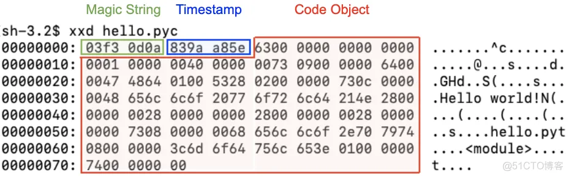

### 1、对象创建过程

`__new__`： 对象的创建，是一个类方法，第一个参数是cls，返回一个实例对象，此时该对象还不具有实例属性，但已经有类属性了。
`__init__`： 对象的初始化， 是一个实例方法，第一个参数是self（也就是`__new__`方法返回的实例对象），为其初始化实例属性。
`__call__`： 对象是callable的，是一个实例方法，注意不是类方法。对象被调用时，等同于调用所属类的`__call__`函数，如果所属类未实现该方法，则调用元类的 `__call__` 方法。

类：理解为是元类(type)的实例对象，所以当运行 类()  时，元类中的`__call__`函数将会被调用。

type中`__call__`函数的实现逻辑：

``` python
    def __call__(cls, *args, **kwargs):
        obj = super().__new__(cls, *args, **kwargs)
        # 返回对象是类的实例才执行__init__
        if isinstance(obj, cls):
            obj.__init__(*args, **kwargs)
        return obj
```

有了上面的理解，那么实例化对象的逻辑就出来了：

	- instance = class()
	- class 作为元类的实例对象，运行class()时，即调用元类type中的__call__方法，在__call__方法中，依次调用class类中__new__和__init__方法，最终返回一个当前class类的实例对象。

> 扩展：
>
>  - 构造函数：python 中的通过构造函数`__new__`创建一个实例对象
>  - 析构函数：python 中的析构函数`__del__`在对象被GC回收时调用，并不是通过执行`__del__`删除对象，而是删除时调用该函数。


综合示例：

```python
class A:
    name = "jack"

    def __new__(cls, *args, **kwargs):
        print(cls.name)
        return super().__new__(cls, *args, **kwargs)

    def __init__(self):
        print(self.name)
        self.age = 18

    def __call__(self, *args, **kwargs):
        print("当实例被调用时，我才被调用")
        return type.__call__(A, *args, **kwargs)


a = A()  # 依次调用 __new__ 和 __init__ ，创建并初始化一个对象。输出两个 jack

a1 = a()  # a 是 A 的实例，所以a被调用时，直接会调用A的__call__方法。__call__ 方法中调用元类type的__call__，并指明了cls为A。通过前面对type中__call__函数逻辑的分析，此处会再一次创建一个新的对象

print(a1.age)  # 18

print(id(a), id(a1))  # a 和 a1 是两个完全不同的对象

# console
jack
jack
当实例被调用时，我才被调用
jack
jack
18
4378911408 4378910880
```


### 2、生成器通信

``` python
# 生成器是一种使用普通函数语法定义(包含yield关键字即可)的迭代器。
# 迭代器的特点是可以按需获取序列值，而不是一次性实例化出整个可迭代对象。

# send是实现外部访问生成器内部的方法。
# send()的两个功能：
# 		1.传值，接受一个参数(传递给生成器的消息，可以是对象)；
#			2.迭代下一个值，效果同next()。

# 应用场景：1、实现一个交互式的计算器(没啥用) 2、实现协程

# yield本身就是一种在单线程下可以保存任务运行状态的方法
#   - 1、yiled可以保存状态，yield的状态保存与操作系统的保存线程状态很像，但是yield是代码级别控制的，更轻量
#   - 2、send可以把一个函数的结果传给另外一个函数，以此实现单线程内程序之间的切换
import time

def decorator(func):
    """实现一个装饰器来实现生成器的首次迭代"""

    def wrapper(*args, **kwargs):
        res = func(*args, **kwargs)
        res.__next__()
        # 二者完全等价
        # next(res)
        return res

    return wrapper

@decorator
def consumer(n):
    """
    生成器首次迭代不能直接使用send(value)，因为在首次迭代之前，生成器并没有通过yield挂起
    必须使用next()或者send(None)
    这里借助装饰器完成第一次调用以开启协程模式
    """
    info = ''
    while True:
        time.sleep(n)
        msg = yield info
        print(f"current consuming msg : {msg}")
        info = f"第 {msg} 次等待中 ..."

def producer(c1, c2):
    """
    producer和consumer函数在一个线程内执行，通过调用send方法和yield互相切换，实现协程的功能。
    """
    n = 1
    while n < 5:
        print(f"current producing msg : {n}")
        print(c1.send(n))
        print(c2.send(n))
        n += 1

if __name__ == '__main__':
    c1 = consumer(2)
    c2 = consumer(3)

    producer(c1, c2)
```


### 3、动态创建类

``` python
# -------------动态导入模块中的类------------
'''
1. 首先import相关工具模块`import importlib`

2. 加载你想要加载的模块`module = importlib.import_module(模块名称)`

3. 获取类对象`api_class = getattr(module, 类名)`

4. 创建类对象的实例`api_instance = api_class()`

5. 调用类对象的函数`api_instance.get_response(data)`
'''

# -------------type内置类动态创建类------------
# type()函数语法说明
# 第一种语法格式用来查看某个变量（类对象）的具体类型，obj 表示某个变量或者类对象。
# 第二种语法格式用来创建类:
#   - name 表示类的名称，必传字段；
#   - bases 表示一个元组，其中存储的是该类的父类，可以是一个空元组，表示创建一个无继承的类；
#   - dict 表示一个字典，用于表示类中的属性或者方法，可以是一个空字典，表示创建一个无属性(方法)的类；需要注意的是，这里dict中的键值都是类属性，如果是实例属性，应该写到__init__初始化方法中。
# python中类创建的本质：
#   - 我们使用class关键字创建类，当你使用class关键字时，Python解释器自动创建这个对象。
#   - 而底层其实使用的是type函数来创建类的。所以我们可以直接使用type()函数来手动实现动态创建类。
type(obj) 
type(name, bases, dict)

# type查看对象类型不再赘述，这里看一个动态创建类的例子
# 示例一：
    #定义一个实例方法
    def say(self):
        print("我要学 Python！")
        
    #定义一个类方法
    @classmethod
    def wudi(cls):
        print("i love you")
        
    #使用 type() 函数创建类
    #注意，Python 元组语法规定，当 (object,) 元组中只有一个元素时，最后的逗号（,）不能省略。
    CLanguage = type("CLanguage",(object,),dict(say = say, name = "C语言中文网", wudi = wudi))
    
    #创建一个 CLanguage 实例对象
    clangs = CLanguage()
    
    #调用 say() 方法和 name 属性
    clangs.say()
    print(clangs.name)
    

# 示例二：结合前面讲的对象创建过程，自定义一个元类，来创建一个类
		class MyType(type):
      def __call__(cls, *args, **kwargs):
          instance = cls.__new__(cls, *args, **kwargs)

          if isinstance(instance, cls):
              instance.__init__(*args, **kwargs)
              return instance

          return None

		# 定义魔法方法，实现在动态创建类时定义实例属性
    def __init__(self, name, age):
        self.name = name
        self.age = age

    def get_name(self):
        return self.name

    def set_name(self, name):
        self.name = name

    B = MyType("B", (object,), dict(get_name=get_name, __init__=__init__, set_name=set_name, ref="001"))

    if __name__ == '__main__':
        b = B("xiaozhang", 29)
        print(b.get_name())  # xiaozhang
        b.set_name("xiaowang")
        print(b.get_name())  # xiaowang
    
# 总结：
#   - 通过type中 dict 直接添加的属性是类属性，不是实例属性
#   - 通过type可以给类添加普通方法，静态方法，类方法，效果跟class一样
#   - type创建类的效果，包括继承等的使用性质和class创建的类一样。class创建类的本质就是用type创建。

# 理解元类：
#   - 元类就是类的类，python中函数type实际上是一个元类。
#   - type就是Python在背后用来创建所有类的元类。Python中所有的东西都是对象。这包括整数、字符串、函数以及类。
#   - 所有对象，都是从一个类创建而来，这个类就是type。type就是Python的内建元类，当然了，也可以创建自己的元类(基于metaclass实现单例)

```


### 4、动态创建函数

**lambda：创建匿名函数**

``` python
# lambda 动态创建匿名函数。通常用在推导式和几个高阶函数中

# 示例：
score = [100, 90, 85, 95, 88, 93, 100, 79, 86, 99]
# 过滤出成绩大于95的分数
# filter 返回的是一个可迭代对象
filter_score = list(filter(lambda x: x > 95, score))

print(filter_score)  # [100, 100, 99]

# 上述示例可以使用更简单的列表推导式实现
score = [100, 90, 85, 95, 88, 93, 100, 79, 86, 99]

a = [i for i in score if i > 95]
print(a) # [100, 100, 99]
```


**内置函数`compile()` + `types.FunctionType` 模块，动态创建函数**

```python
"""
compile 函数：
	compile(source, filename, mode, flags=0, dont_inherit=False, optimize=- 1)
	
常用参数：
	- source 可以是常规的字符串、字节字符串，或者 AST 对象。
	- filename 实参需要是代码读取的文件名；如果代码不需要从文件中读取，可以传入一些可辨识的值（经常会使用 '<string>'）。
	- mode 实参指定了编译代码必须用的模式。如果 source 是语句序列，可以是 'exec'；如果是单一表达式，可以是 'eval'；如果是单个交互式语句，可以是 'single'。（在最后一种情况下，如果表达式执行结果不是 None 将会被打印出来。）
	
返回值：
	Compile source into a code object that can be executed by exec() or eval()
	编译返回的code对象是模块级别的code对象（这个对象中可能包含了多个函数级别的code对象），不能直接用于实例化函数，要从code对象 co_consts 属性（一个元组）中获取函数的 code对象。
	
"""

import types


def sum(a, b):
    return a + b


# 将 str 编译成代码
module_code = compile(source='def foobar(a, b): return sum(a, b)', filename='<string>', mode='exec')
func_code = module_code.co_consts[0]

"""
types 模块，定义了不能作为内置对象直接访问的内置类型的名称。从动态创建类的知识来理解，def 关键字定义的函数也应该是函数元类型的一个实例，那么types模块中就定一个这样的一个类 FunctionType，那么它的实例化结果就是一个函数。

FunctionType 类：
	 def __init__(
        self,
        code: CodeType,
        globals: Dict[str, Any],
        name: Optional[str] = ...,
        argdefs: Optional[Tuple[object, ...]] = ...,
        closure: Optional[Tuple[_Cell, ...]] = ...,
    ) -> None: ..

常用参数：
	- code code 对象，和compile函数返回值一样，都是 CodeType 类型
	- globals 全局变量，函数内部一些引用变量的值
	- name 函数名

"""

# globals 入参提供一个作用域字典，为函数提供可能用到的属性。这里foobar函数里面调用了sum函数
foobar = types.FunctionType(code=func_code, globals={"sum": sum}, name="foobar")

if __name__ == '__main__':
    print(foobar(4, 5))  # 9
```


### 5、类成员和实例成员

**类属性核实例属性**

理解类属性:
   - 类属性就相当于全局变量，是类和其实例对象共有的属性；而实例属性为实例对象自己私有，通过类是无法直接调用的。
   - 类属性就是类对象(class)所拥有的属性，它被所有类对象的实例对象(实例方法)所共有，在内存中只存在一个副本，这个和C++中类的静态成员变量有点类似。
   - 对于公有的类属性，在类外可以通过类对象和实例对象访问。


调用类属性:
   - 如果需要在类外修改类属性，必须通过类名去引用然后进行修改；
   - 如果通过实例调用该属性时，每次调用都到其所属的类中获取该属性，再多次获取的过程中，如果该属性值被修改，那么实例获取到的值也随之变化；
   - 如果通过实例设置类属性的值，那么实例中会产生一个同名的实例属性，这种方式修改的是实例属性，不会影响到类属性，并且之后如果通过实例对象去引用该名称的属性，同名的实例属性会强制屏蔽掉类属性，即引用的是实例属性，除非删除了该实例属性。


**类方法和实例方法**

类方法需要使用内置装饰器`@classmethod`装饰，使用后，方法的第一个默认参数不再是self，而是cls。意思就是说在方法体内部，可以使用cls来表示当前类，通过cls可以访问类属性和其他类方法，以及静态方法。但是不能访问实例属性和实例方法。

实例方法就是在class结构体中，使用def定义的常规方法，它的第一个默认参数是self，表示的是当前的实例对象，通过self可以访问到所有的实例属性、实例方法、类属性、类方法 以及静态方法。

> 使用`@staticmethod`装饰的方法是静态方法，这样的方法没有默认参数，就是说方法体中不能通过cls或self引用其他属性和方法


**注意：**

实例方法被其他实例调用时，要特别注意实例方法是从类中获取还是从实例中获取的，如果是从类中获取的，那么实例方法的第一个参数self在调用时是需要赋值的，因为当前类的示例并没有创建。下面举个例子：

```python
class A:
    def aa(self, a, b):
        print(a + b)


class B:
    def __init__(self):
        self.aa = getattr(A, "aa")  


class C:
    def __init__(self):
        self.aa = getattr(A(), "aa")


b = B()
c = C()

b.aa(self=object, a=1, b=2)  # 此时的aa实例方法被调用，就要手动给self赋值，否则会报错
c.aa(a=1, b=2)  # 从实例中获取的实例方法，self默认是已被填充的，调用时则不需要在赋值
```


### 6、socket粘包问题

**准备知识：**

> ​		任何应用程序发送和接收数据，都是基于操作系统中转，应用有发送和接收数据时，直接对接操作系统，由操作系统来完成真正发送和接收的数据。在这个过程中，操作系统在拿到数据后，并不会立即将数据发送到互联网或者应用程序，而是存在一个缓冲区，将多次收到的数据一次发送出去，但这个缓冲时间是很短的，人为很难感知。同时，缓冲区也是有大小的，当缓冲区数据满了就直接发，不再继续缓冲。

**A、为什么会发生TCP粘包、拆包**

1. 应用程序写入的数据大于套接字缓冲区大小，这将会发生拆包。

2. 应用程序写入数据小于套接字缓冲区大小，网卡将应用多次写入的数据发送到网络上，这将会发生粘包。

3. 进行MSS（最大报文长度）大小的TCP分段，当TCP报文长度-TCP头部长度>MSS的时候将发生拆包。

4. 接收方不及时读取套接字缓冲区数据，这将发生粘包。

**B、如何处理粘包、拆包**

1. 使用带消息头的协议、消息头存储消息开始标识及消息长度信息，服务端获取消息头的时候解析出消息长度，然后向后读取该长度的内容。

2. 设置定长消息，服务端每次读取既定长度的内容作为一条完整消息，当消息不够长时，空位补上固定字符。

3. 设置消息边界，服务端从网络流中按消息边界分离出消息内容，一般使用‘\n’。


### 7、socket断点续传

> 文件断点续传，是指文件在传输过程中因为某些原因程序停止运行文件终止传输，下一次重新传输文件的时候还能从上一次断开的位置开始传输，而不需要重新从头开始。

**socket实现断点续传：**

- 服务端总是保存文件的大小信息
- 客户端进行上传或下载操作时，进行数据传输之前，先把要上传或者要下载的文件信息包括文件大小都上传服务器
- 服务器根据操作类型，返回给客户端服务器端相同文件的信息
- 如果是上传，服务器返回已经上传文件大小给客户端，客户端根据返回值作为字节起点开始上传
- 下载则反过来


### 8、导包方式 和 pyc文件

```
sys.path 系统导包路径列表说明：
	- import/from 模块名  中的模块必须是在sys.path列表中的路径下才可以被导入，就是说系统到这些路径下寻找目标模块，不会找子模块。
	- sys.path 列表中的第一个路径，总是当前执行文件所在的目录路径。所以我们执行文件时，总是可以基于当前路径导入同级模块或同级以下的模块。
```

　　**方式一：from 包名  import  模块名**

　          使用时：模块名.函数名()

　　**方式二：from 包名.模块名  import 函数名**

　　        使用时：函数名()

　　**方式三 ：import  包名.模块名   ** 

　　        使用时:  包名.模块名.函数名()

　　**方式四：from  包名  import  *   **

　　        前提是：在 `__init__.py`  文件中写入`__all__`列表变量，写入当前路径下级模块名

​                   导入哪个模块，不写则什么都不导入

　　        使用时：模块名.函数名()

　　**方式五：import 包名**   

　　        前提是：在包里面的`__init__.py`  文件里写入   from . import  模块名`__init__.py`  里面导入哪个模块

​                   通过本方式就能使用哪个模块

　　        使用时：模块名.函数名()


**pyc文件**

- 什么是pyc文件

  > 注释：
  >
  > ​	1、c 是compiled 「编译过」的意思
  >
  > ​	2、python在解释源程序时是分成两个步骤，先是将源码编译成字节码，再对字节码进行处理生成CPU能识别的机器码

  py文件在被当作模块首次/更新后导入时，Python解释器会生成pyc文件。

- pyc文件的作用

  1. 提高运行效率

     > 有了模块的字节码文件之后，下一次运行程序时，如果在上次保存字节码之后没有修改过源代码，Python将会加载 .pyc 文件并跳过编译这个步骤，节约程序启动时间；当Python 重编译时，它会自动检查源文件和字节码文件的时间戳，如果修改了源代码，下次程序运行时，字节码将自动重新创建；

  2. 不想让源码泄露

     > 因为py文件是可以直接看到源码的，对于一般的商业公司来说，这有点不妙，因为pyc文件可以独立于py文件，删除py文件也不会出错。这就是太好了，只需要编译成pyc文件再发布出去就好了。


### 9、富比较方法

**运算符号与比较方法的映射关系：**

​	x<y 调用 `x.__lt__(y)`、

​	x<=y 调用` x.__le__(y)`、

​	x==y 调用` x.__eq__(y)`、

​	x!=y 调用` x.__ne__(y)`、

​	x>y 调用` x.__gt__(y)`、

​	x>=y 调用` x.__ge__(y)`

```python
class Car():
   def __init__(self,carname,oilcostper100km, price):
       self.carname,self.oilcostper100km,self.price = carname,oilcostper100km, price
   def __lt__(self,other):
       print("execute __lt__")
       return self.price<other.price
   def __le__(self,other):
       print("execute __le__")
       return self.price>other.price
   def __gt__(self,other):
       print("execute __gt__")
       return self.oilcostper100km>other.oilcostper100km

   def __ge__(self,other):
       print("execute __ge__")
       return self.oilcostper100km<other.oilcostper100km

   def __repr__(self):  #重写__repr__方法输出repr信息
       return  f"('{self.carname}',{self.oilcostper100km},{self.price})"

car1,car2 = Car('爱丽舍',8,10),Car('凯美瑞',7,27)
car1<car2,car1<=car2,car1>car2,car1>=car2
# 输出结果
execute __lt__
execute __le__
execute __gt__
execute __ge__
(True, False, True, False)

```

**字符串大小比较：**

- 字符串按字符比较大小，先取两个字符串第一位字符的ascii码值，谁的大，字符串就大，不再比较后面的；第一个字符相同就比第二个字符串，以此类推。
  - 需要注意的是 空格 的ascii码是32，空（null）的ascii码是0。
  - 如果两个字符串字符相同，但是一个字符串的字符多，则多的大。原理就是字符的ascii码都是大于0的，字符串少的就会取null的ascii码来与之比较。


### 10、GC机制和GIL锁

- **Python GC(Garbage Collection):**

  垃圾回收机制（简称GC）是python解释器自带的一种机制，专门用来回收没有绑定任何引用（直接引用和间接引用）的变量值所在的内存空间。

  CPython主要使用引用计数（reference counting）来跟踪和自动回收垃圾。在引用计数的基础上，通过“标记-清除”（mark and sweep）的方式 来处理对象的循环引用问题；通过“分代回收”（generation collection）的方式（以空间换时间）来提高垃圾回收效率。

  > 准备知识：
  >
  > 1. 数值类型、字符串类型、元组类型的对象在Python中是不可变的，这意味着无法修改这个对象的值，每次对引用变量的修改，实际上都是新创建了一个对象重新赋值。
  > 2. 定义变量时，变量名与变量值都是需要存储的，分别对应内存中的两块区域：堆区与栈区

  1. **引用计数**

     PyObject是每个对象必有的内容，其中ob_refcnt就是做为引用计数。当一个对象有新的引用时，它的ob_refcnt就会增加，当对象的引用被删除时，它的ob_refcnt就会减少。当引用计数为0时，该对象生命就结束了，就会被GC回收。

     简而言之就是如果没有**变量**引用某一**对象**，那么该对象将会被回收。Python 中的每个变量都是对对象的**引用**，而不是对象本身。例如，赋值语句只是给右侧对象或右侧变量所对应的对象建立一个引用；一个对象都可以有许多引用。

     > 核心概念：变量是指向一个对象的指针；有n个变量指向某一个对象，那该对象的引用计数则为n，又称该对象有n个引用
     >
     > ```python
     > import sys
     > 
     > a = [1, 2, 3]
     > b = a  # 赋值操作本身不会对数据进行复制，仅仅是建立引用关系
     > 
     > print(id(a), id(b))  # 4483101696 4483101696，变量a b的id相同，说明a b指向同一对象
     > print(sys.getrefcount(a))  # 3, 其中调用getrefcount函数会使引用+1
     > ```

     为了跟踪每个对象的引用次数，每个对象都有一个名为**引用计数(ob_refcnt)**的额外属性，当创建或删除指向对象的指针时，该属性的值会相应的增加或减少。以下三种情况会使对象的引用次数增加：

     - 赋值运算
     - 参数传递
     - 将对象附加到容器对象中

     如果某对象引用计数属性的值为零，CPython 会自动调用该对象特定的内存释放函数。如果该对象还包含对其他对象的引用，那么所包含的其他对象的引用计数也会自动减少。因此，可以依次释放其他对象。

     值得注意的是，在函数、类和代码块(如if-else代码块)之外声明的变量称为全局变量（global variables）。通常，这些变量会一直存在直到 Python 进程结束。因此，全局变量引用的对象的引用计数永远不会下降到零。在python进程中，所有全局变量都存储在一个字典中，可以通过调用globals()函数来获取全局变量。那反过来呢？在代码块内（例如，在函数或类中）定义的变量则具有一个局部作用域，可以通过调用locals()函数来获取局部变量。当 Python 解释器执行完一个代码块时，它会破坏在块内创建的局部变量及其引用。

     示例：

     ```python
     import sys
     
     foo = []
     print(sys.getrefcount(foo)) # 2 references, 1 from the foo var and 1 from getrefcount
     
     
     def bar(a):
         print(sys.getrefcount(a))
     
     
     bar(foo) # 4 references, from the foo var, function argument, getrefcount and Python's function stack
     print(sys.getrefcount(foo)) # 2 references, the function scope is destroyed
     ```

     当你想删除全局或局部变量时，可以使用删除变量及其引用（而不是对象本身）的 del语句。这在 jupyter notebook中工作时通常很有用，因为在jupyter notebook中所有单元格变量都是全局变量。CPython 使用引用计数的主要原因是历史原因，现在有很多关于这种技术的弱点的争论。比如，有人认为现代的垃圾回收算法可以更高效，无需使用引用计数。引用计数算法存在很多问题，例如循环引用、线程锁定以及额外内存和性能开销。**必须指出的是，引用计数是 Python 无法摆脱全局解释锁 (GIL) 的原因之一。**

  2. **标记-清除**

     上面提到了 引用计数 的缺点，无法释放 **循环引用** 的对象。看下面的代码理解下循环引用。

     ```python
     # 对象自己引用自己
     lst = []
     lst.append(lst)
     
     # 对象间相互引用
     object_1, object_2 = {}, {}
     
     object_1['obj2'] = object_2
     object_2['obj1'] = object_1
     ```

     标记-清除原理：当应用程序可用的内存空间被耗尽时，就会停止整个程序，然后进行两项工作，标记和清除

     1. 标记：当没有空闲内存的时候，从寄存器和程序栈区上的引用出发，遍历以对象为节点、以引用为边构成的有向图，把所有能够访问到的对象打上标记；具体的讲，标记的过程其实就是遍历所有的GC Roots对象（栈区中的所有内容或者线程都可以称之为GC Roots对象），然后将其中可以直接或者间接访问到的对象都标记为可以存活的对象，其余的为非存活对象，应该清除掉
     2. 清除：清扫一遍内存空间，把所有没标记（没标记，说明从寄存器或程序栈出发，是访问不到这些对象的）的对象释放

     **缺点：**标记-清除需要遍历堆区中所有的对象，每次回收内存，都要遍历一遍，这个工作量是非常庞大的，因此极为耗时，于是引入了 **分代回收** 算法，分代回收采用了以空间换时间的策略

  3. **分代回收**

     > **分代回收是建立在标记清除技术基础之上的**
     >
     > 引用计数算法非常有效和直接，但它无法检测循环引用，所以python在引用计数的基础上，还需要分代回收。引用计数是 Python必需的功能，不能禁用；而分代回收是可选的，可以手动设置。

     **原理：**

     分代指的是根据容器对象的存活时间来划分出的不同等级。垃圾回收器将container对象分成三代(0, 1, 2)，每个新对象都从第一代开始。如果一个对象在一个垃圾回收轮次中幸存下来，它将移至较旧（更高）的一代。较低代的回收频率高于较高代，因为大多数新对象往往会被先销毁。这样分代回收的策略能提高性能并减少垃圾回收带来的暂停时间。

     

     **示例：**

     ```python
     import gc
     import sys
     import ctypes
     
     # 通过内存地址去访问没有引用的对象（unreachable objects）
     class PyObject(ctypes.Structure):
         _fields_ = [("refcnt", ctypes.c_long)]
     
     # 禁用分代回收算法
     gc.disable()
     
     lst = []
     lst.append(lst)
     lst_address = id(lst)
     
     print(sys.getrefcount(lst))  # 3
     
     # 删除lst引用，但对象内部自己引用自己，所以refcount仍然是1
     # 此时代码将无法直接访问对象
     del lst
     
     print(PyObject.from_address(lst_address).refcnt)  # 1
     
     object_1, object_2 = {}, {}
     
     object_1['obj2'] = object_2
     object_2['obj1'] = object_1
     obj_address = id(object_1)
     
     print(sys.getrefcount(object_1))  # 3
     print(sys.getrefcount(object_2))  # 3
     
     # refcount数量也是1
     del object_1, object_2
     
     print(PyObject.from_address(obj_address).refcnt)  # 1
     
     # 手动对象回收，手动执行回收后，上面删除引用的容器对象将被回收。
     gc.collect()
     
     # 获取对象引用数量
     print(PyObject.from_address(obj_address).refcnt)  # 0
     print(PyObject.from_address(lst_address).refcnt)  # 0
     
     # 或者通过以下方式获取引用数量
     # tmp = PyObject.from_address(obj_address)
     # print(sys.getrefcount(tmp))
     ```

     

     **分析：**

     ​		在上面的示例中，del语句删除了对我们对象的引用（引用计数减 1）。 Python 执行 del语句后，我们的对象不再可以从 Python 代码访问。但是，这些对象仍然存在于内存中。发生这种情况是因为它们仍在相互引用，并且每个对象的引用计数为 1。因为我们前面通过gc.disable()禁用了分代回收，因此循环引用对象无法释放；这时，我们可以通过调用`gc.collect()`手动触发对象回收。

     ​		在python中对象分为可变对象和不可变对象。不可变对象包括`int`, `float`, `complex`, `strings`, `bytes`, `tuple`, `range` 和 `frozenset`；可变对象包括`list`, `dict`, `bytearray`和 `set`。循环引用仅存在于container对象（比如，`list`, `dict`, `classes`, `tuple`），python垃圾回收算法主要追踪可变对象及不可变对象`tuple`。如果`tuple`包含的元素都是不可变对象，那么回收算法可以不对该对象进行追踪。


     **扩展：**
    
     ​		为了决定何时进行一轮垃圾回收，每一代都有一个单独的计数器和阈值。计数器存储自上次收集以来的对象分配数减去释放数的差值。每次分配新的容器对象时，CPython 都会检查第0代的计数器是否超过阈值（通过`gc.get_count()`获得三代对象计数器存储的数值）。如果超过阈值，Python 将触发垃圾回收。我们可以通过`gc.get_threshold()`和`gc.set_threshold()`查看、设置阈值：
    
     ```python
     import gc
     gc.get_threshold()  # (700, 10, 10) 分别对应三代计数器的阈值
     gc.set_threshold(threshold0=800, threshold0=10, threshold0=10)  # 当threshold0设置为0时，禁用循环GC
     ```
    
     ​		在写程序时，可以通过将调试标志设置为`gc.DEBUG_SAVEALL`，从而将所有unreachable对象添加到`gc.garbage` 中，帮助提升程序质量:
    
     ```python
     import gc
     
     gc.set_debug(gc.DEBUG_SAVEALL)
     
     print(gc.get_count())
     lst = []
     lst.append(lst)
     list_id = id(lst)
     del lst
     gc.collect()
     for item in gc.garbage:
         print(item)
     ```


​     

- **GIL  Global Interpreter Lock(全局解释器锁)**

  由于线程之间数据是共享的，也就意味着如果多个线程同时操作某一内存中的数据，就会有严重的数据安全问题。为了解决这个问题就有了GIL，本质上就是一个全局线程互斥锁。

  - 在GIL的作用下，单个进程下同一时间只能执行一个线程，即便有多个CPU，多个线程也只会同执行一个。
  - 多线程下，每个线程的执行方式：
    - 获取GIL。
    - 执行代码。
    - 释放GIL。
  - 释放GIL的条件：
    - 执行python2虚拟机运行1000字节指令  或者  执行python3虚拟机运行时间15ms。类似于时间片。
    - 线程遇到阻塞时，主动释放GIL（例如：sleep或者IO操作）。
    - 把线程设置为睡眠状态（等待状态）。
  - python下的多线程对CPU密集型代码(各种循环处理、计数等等)并不友好，对IO密集型代码(文件处理、网络爬虫等)比较友好。
  - 每个进程有各自独立的GIL，互不干扰，所以CPU密集型代码在python中开启多进程更适合。


### 11、字节码分析

> 1. Python 代码是先被编译为字节码后，再由Python虚拟机来执行字节码， Python的字节码是一种类似汇编指令的中间语言，一个Python 语句会对应若干字节码指令，虚拟机一条一条执行字节码指令，从而完成程序执行。
> 2. Python dis 模块支持对Python代码进行反汇编，生成字节码指令。
> 3. 所有的字节码指令是解释器规定好的一组解释器能识别的编码指令，内置模块 dis 中，opname 属性的值是一个列表，其中就保存了当前所有的字节码指令，共 256 个。 

``` python
import dis


def func():
    a = 10

    while a > 0:
        a -= 1

    if a == 0:
        print(a)

        
if __name__ == '__main__':
  	# Disassemble classes, methods, functions, and other compiled objects.
    dis.dis(func)
    
'''
说明：
	Python代码在编译过程中会生成CodeObject, CodeObject是在虚拟机中的抽象表示，在Python C源码中表示为PyCodeObject，而生成的.pyc文件则是字节码在磁盘中的表现形式。
	第一列的数字（5）表示对应源代码的行数；
	第二列的数字是 对象.__code__.co_code 可迭代对象（保存了字节码在dis.opname中的索引）的索引，通过该索引获取到字节码在dis.opname中的索引(按执行顺序)，这样就能获取到具体的字节码指令；
	第三列是指令本身，通过字节码索引，在字节码列表(dis.opname)中取到的具体的字节码指令；
	第四列表示指令的参数；
	第五列则是计算后的实际参数；
	其中的 ">>" 表示跳转的目标。


打印结果：
  5           0 LOAD_CONST               1 (10)   # 加载一个常量10
              2 STORE_FAST               0 (a)		# 保存到变量a中

  7     >>    4 LOAD_FAST                0 (a)		# 跳转到循环目标；加载变量a
              6 LOAD_CONST               2 (0)		# 加载常量0
              8 COMPARE_OP               4 (>)		# 执行比较操作
             10 POP_JUMP_IF_FALSE       22				# 判断条件，如果为false则跳出循环

  8          12 LOAD_FAST                0 (a)		# 加载变量a
             14 LOAD_CONST               3 (1)		# 加载常量1
             16 INPLACE_SUBTRACT									# 就地执行减法操作并替换。结合上面我们提到了字符和数值对象是不可变的
             18 STORE_FAST               0 (a)		# 保存变量a
             20 JUMP_ABSOLUTE            4				# 跳转到下一次循环

 10     >>   22 LOAD_FAST                0 (a)		# 跳转目标
             24 LOAD_CONST               2 (0)
             26 COMPARE_OP               2 (==)
             28 POP_JUMP_IF_FALSE       38

 11          30 LOAD_GLOBAL              0 (print)# 加载全局函数print
             32 LOAD_FAST                0 (a)		# 加载变量a
             34 CALL_FUNCTION            1				# 执行print函数
             36 POP_TOP														# 跳出print函数方法栈
        >>   38 LOAD_CONST               0 (None)	# 加载常量None
             40 RETURN_VALUE											# 返回None	- python中无返回值的函数，默认返回None	
'''
```

``` python
import dis


def func():
    a = 10

    while a > 0:
        a -= 1

    if a == 0:
        print(a)
  
 
  # 所有 字节码指令 共256个，从下面打印可知，还有很多保留索引未使用，为后续扩展保留位置
  code = dis.opname
  print(len(code))  # 256
  print(code)  # ['<0>', 'POP_TOP', 'ROT_TWO', 'ROT_THREE', 'DUP_TOP', 'DUP_TOP_TWO', 'ROT_FOUR', '<7>', '<8>', 'NOP', 'UNARY_POSITIVE', 'UNARY_NEGATIVE', 'UNARY_NOT', '<13>', '<14>', 'UNARY_INVERT', 'BINARY_MATRIX_MULTIPLY', 'INPLACE_MATRIX_MULTIPLY', '<18>', 'BINARY_POWER', 'BINARY_MULTIPLY', '<21>', 'BINARY_MODULO', 'BINARY_ADD', 'BINARY_SUBTRACT', 'BINARY_SUBSCR', 'BINARY_FLOOR_DIVIDE', 'BINARY_TRUE_DIVIDE', 'INPLACE_FLOOR_DIVIDE', 'INPLACE_TRUE_DIVIDE', '<30>', '<31>', '<32>', '<33>', '<34>', '<35>', '<36>', '<37>', '<38>', '<39>', '<40>', '<41>', '<42>', '<43>', '<44>', '<45>', '<46>', '<47>', '<48>', '<49>', 'GET_AITER', 'GET_ANEXT', 'BEFORE_ASYNC_WITH', 'BEGIN_FINALLY', 'END_ASYNC_FOR', 'INPLACE_ADD', 'INPLACE_SUBTRACT', 'INPLACE_MULTIPLY', '<58>', 'INPLACE_MODULO', 'STORE_SUBSCR', 'DELETE_SUBSCR', 'BINARY_LSHIFT', 'BINARY_RSHIFT', 'BINARY_AND', 'BINARY_XOR', 'BINARY_OR', 'INPLACE_POWER', 'GET_ITER', 'GET_YIELD_FROM_ITER', 'PRINT_EXPR', 'LOAD_BUILD_CLASS', 'YIELD_FROM', 'GET_AWAITABLE', '<74>', 'INPLACE_LSHIFT', 'INPLACE_RSHIFT', 'INPLACE_AND', 'INPLACE_XOR', 'INPLACE_OR', '<80>', 'WITH_CLEANUP_START', 'WITH_CLEANUP_FINISH', 'RETURN_VALUE', 'IMPORT_STAR', 'SETUP_ANNOTATIONS', 'YIELD_VALUE', 'POP_BLOCK', 'END_FINALLY', 'POP_EXCEPT', 'STORE_NAME', 'DELETE_NAME', 'UNPACK_SEQUENCE', 'FOR_ITER', 'UNPACK_EX', 'STORE_ATTR', 'DELETE_ATTR', 'STORE_GLOBAL', 'DELETE_GLOBAL', '<99>', 'LOAD_CONST', 'LOAD_NAME', 'BUILD_TUPLE', 'BUILD_LIST', 'BUILD_SET', 'BUILD_MAP', 'LOAD_ATTR', 'COMPARE_OP', 'IMPORT_NAME', 'IMPORT_FROM', 'JUMP_FORWARD', 'JUMP_IF_FALSE_OR_POP', 'JUMP_IF_TRUE_OR_POP', 'JUMP_ABSOLUTE', 'POP_JUMP_IF_FALSE', 'POP_JUMP_IF_TRUE', 'LOAD_GLOBAL', '<117>', '<118>', '<119>', '<120>', '<121>', 'SETUP_FINALLY', '<123>', 'LOAD_FAST', 'STORE_FAST', 'DELETE_FAST', '<127>', '<128>', '<129>', 'RAISE_VARARGS', 'CALL_FUNCTION', 'MAKE_FUNCTION', 'BUILD_SLICE', '<134>', 'LOAD_CLOSURE', 'LOAD_DEREF', 'STORE_DEREF', 'DELETE_DEREF', '<139>', '<140>', 'CALL_FUNCTION_KW', 'CALL_FUNCTION_EX', 'SETUP_WITH', 'EXTENDED_ARG', 'LIST_APPEND', 'SET_ADD', 'MAP_ADD', 'LOAD_CLASSDEREF', 'BUILD_LIST_UNPACK', 'BUILD_MAP_UNPACK', 'BUILD_MAP_UNPACK_WITH_CALL', 'BUILD_TUPLE_UNPACK', 'BUILD_SET_UNPACK', 'SETUP_ASYNC_WITH', 'FORMAT_VALUE', 'BUILD_CONST_KEY_MAP', 'BUILD_STRING', 'BUILD_TUPLE_UNPACK_WITH_CALL', '<159>', 'LOAD_METHOD', 'CALL_METHOD', 'CALL_FINALLY', 'POP_FINALLY', '<164>', '<165>', '<166>', '<167>', '<168>', '<169>', '<170>', '<171>', '<172>', '<173>', '<174>', '<175>', '<176>', '<177>', '<178>', '<179>', '<180>', '<181>', '<182>', '<183>', '<184>', '<185>', '<186>', '<187>', '<188>', '<189>', '<190>', '<191>', '<192>', '<193>', '<194>', '<195>', '<196>', '<197>', '<198>', '<199>', '<200>', '<201>', '<202>', '<203>', '<204>', '<205>', '<206>', '<207>', '<208>', '<209>', '<210>', '<211>', '<212>', '<213>', '<214>', '<215>', '<216>', '<217>', '<218>', '<219>', '<220>', '<221>', '<222>', '<223>', '<224>', '<225>', '<226>', '<227>', '<228>', '<229>', '<230>', '<231>', '<232>', '<233>', '<234>', '<235>', '<236>', '<237>', '<238>', '<239>', '<240>', '<241>', '<242>', '<243>', '<244>', '<245>', '<246>', '<247>', '<248>', '<249>', '<250>', '<251>', '<252>', '<253>', '<254>', '<255>']


  # 对象的 字节码 序列，列表中的值对应上面 code 索引，每个索引对应的一个操作指令。同时 code_list 也反映了代码的具体执行过程和顺序
  code_list = [i for i in list(func.__code__.co_code)]
  print(code_list)  # [100, 1, 125, 0, 124, 0, 100, 2, 107, 4, 114, 22, 124, 0, 100, 3, 56, 0, 125, 0, 113, 4, 124, 0, 100, 2, 107, 2, 114, 38, 116, 0, 124, 0, 131, 1, 1, 0, 100, 0, 83, 0]
  
  # 拿上面前两条字节码举例
  	打印结果：
      5           0 LOAD_CONST               1 (10)   # 加载一个常量10
                  2 STORE_FAST               0 (a)		# 保存到变量a中
  
  # 可以看到，code_list 把我们程序指令有序的组织起来了
    print(code[code_list[0]])  # LOAD_CONST
    print(code[code_list[2]])  # STORE_FAST
```


### 12、迭代器和生成器

迭代是Python中常用且非常强大的一个功能，它可以用于访问集合、列表、字符串、字典等数据结构的元素。

- **可迭代对象**

  Python中的可迭代对象主要有三类：

  - 迭代器
  - 序列
  - 字典

  **迭代器是可迭代对象的一个子集，而生成器又是迭代器的一个子集，是一种特殊的迭代器。**

  - **可迭代对象需要实现`__iter__`方法**
  - **迭代器不仅要实现`__iter__`方法，还需要实现`__next__`方法**

- **迭代器**

  迭代器是可迭代对象的一个子集，它是一个可以记住遍历的位置的对象，它与列表、元组、集合、字符串这些可迭代对象的区别就在于next方法的实现，其他列表、元组、集合、字符串这些可迭代对象可以很简单的转化成迭代器，通过Python内置的**iter**函数能够轻松把可迭代对象转化为迭代器。

  ```python
  X = [1,2,3,4,5]
  print(type(X))
  Y = iter(X)
  print(type(Y))
  print(next(Y))
  print(next(Y))
  print(next(Y))
  
  # 输出
  <class 'list'>
  <class 'list_iterator'>
  1
  2
  3
  ```

  通过实现**`__iter__`**和**`__next__`**方法来定义迭代器：

  ```python
  class Iterator(object):
    def __init__(self, array: list):
      self.arr = array
      self.cnt = len(array)
      self.idx = 0
  
      def __iter__(self):
        return self
  
      def __next__(self):
        if self.idx < self.cnt:
          self.idx += 1
          return self.arr[self.idx - 1]
  
        # 重置索引，结束当前迭代后可再次进入迭代
        self.idx = 0
        raise StopIteration
  
  it = Iterator([1, 2, 3, 4, 5])
  
  for i in it:
      print(i)
      
  # 又重头开始迭代
  # 下面两个next方法是等价的，只是第一个是系统内置的
  print(next(it))
  print(it.__next__())
  
  # output
  1
  2
  3
  4
  5
  1
  2
  ```

- **生成器**

  生成器是迭代器的子集，换句话说，生成器一定是迭代器，但是迭代器不全是生成器对象。

  提及生成器就不得不提及一个Python中的关键字**yiled**，在Python中一个函数可以用yiled替代return返回值，这样的话调用这个函数就不是直接获得函数的返回值，而是一个生成器对象。

  return返回值的普通函数：

  ```python
  def generator(array):
      for i in array:
          return i
  
  # 调用函数，在遇到return时，函数执行完毕返回数字1
  gen = generator([1,2,3,4,5])
  
  print(gen)
  print(type(gen))
  
  # 输出
  1
  <class 'int'>
  ```

  yield返回值的生成器函数：

  ```python
  def generator(array):
    for i in array:
      yield (i)
  
  gen = generator([1, 2, 3, 4, 5])
  print(type(gen))
  
  # 迭代生成器
  print(next(gen))
  print(next(gen))
  
  # 输出
  <class 'generator'>
  1
  2
  ```

  

### 12、yield、 yield from

> `yield from` 是在Python3.3才出现的语法。所以这个特性在Python2中是没有的。
>
> `yield from` 后面需要加的是可迭代对象，它可以是普通的可迭代对象，也可以是迭代器，甚至是生成器。

**yield 和 yield from 用法比较**

``` python
# 一个拼接可迭代对象的例子
alist = [1, 2, 3, 4]
astr = 'ABC'
adict = {'key': 'value', 'key1': 'value1'}
aiter = range(5)


def gen1(*args, **kwargs):
    """基于yield实现"""
    for item in args:
        for i in item:
            yield i


def gen2(*args, **kwargs):
    """基于yield from实现"""
    for item in args:
        yield from item


if __name__ == '__main__':
    print(list(gen1(alist, astr, adict, aiter)))
    print(list(gen2(alist, astr, adict, aiter)))


'''
输出结果：
	[1, 2, 3, 4, 'A', 'B', 'C', 'key', 'key1', 0, 1, 2, 3, 4]
	[1, 2, 3, 4, 'A', 'B', 'C', 'key', 'key1', 0, 1, 2, 3, 4]
	
结论：
	yield from后面加上可迭代对象，他可以把可迭代对象里的每个元素一个一个的yield出来，对比yield来说代码更加简洁，结构更加清晰。
	yield from item 等价于 for i in item: yield i
'''
```


**yield from 高级使用**

> 相关术语：
>
> `调用方`：调用委托生成器的客户端（调用方）代码
>
> `委托生成器`：包含yield from表达式的生成器函数
>
> `子生成器`：yield from后面加的生成器对象（包含yeild关键字的函数实例）

``` python
# 一个求平均数的例子

# 子生成器
def average_gen():
    total = 0
    count = 0
    average = 0

    while True:
        current_value = yield average
        if not current_value:
            break

        total += current_value
        count += 1
        average = total / count

    # 当执行return时，代表当前协程结束
    return total, count, average


# 委托生成器
def proxy_gen():
    while True:
        # 只有子生成器要结束（return）了，yield from左边的变量才会被赋值，后面的代码才会执行。
        total, count, average = yield from average_gen()
        print("计算完毕！！\n总共传入 {} 个数值， 总和：{}，平均数：{}".format(count, total, average))


# 调用方
def main():
    pgen = proxy_gen()
    next(pgen)  # 激活协程
    print(pgen.send(10))
    print(pgen.send(20))
    print(pgen.send(None))  # 关闭当前协程协程


if __name__ == '__main__':
    # # -------------直接调用子生成器-------------
    # a = average_gen()
    # next(a)  # 激活协程
    # print(a.send(10))
    # print(a.send(20))
    # print(a.send(None))  # 关闭协程，生成器抛出结束迭代异常，结束迭代。如果使用for循环，for循环会自动处理该异常。
    #
    # '''
    # 输出结果：
    # 10.0
    # 15.0
    # Traceback (most recent call last):
    #   File "/Users/zhangjian/PycharmProjects/Practice/demo.py", line 45, in <module>
    #     print(a.send(None))  # 关闭协程
    # StopIteration: (30, 2, 15.0)
    # '''
    # # -------------直接调用子生成器-------------

    # # -------------通过委托生成器调用-------------
    main()

    '''
    输出结果：
    10.0
    15.0
    计算完毕！！
    总共传入 2 个数值， 总和：30，平均数：15.0
    0  # 这里yield from 又马上开启了下一个协程
    '''
    # # -------------通过委托生成器调用-------------
    
		'''
		总结：
			- 包含yield from 关键字的委托生成器，在调用方和子生成器之间充当管道的作用，不对传输的数据做任何的加工处理
			- 委托生成器可以自动处理子生成器抛出的异常，使开发者把精力更多的集中在业务逻辑，而无需关注异常的处理
			- 委托生成器可以获取到子生成器 return 的返回值，而直接调用子生成器则无法获取
		'''
```


### 13、高效使用字典

- **用 in 关键字检查 key 是否存在**

> Python2 中判断某个 key 是否存在字典中可使用 has_key 方法，另外一种方式是使用 in 关键字。但是强烈推荐使用后者，因为 in 的处理速度更快，另外一个原因是 has_key 这个方法在 Python3 被移除了，要想同时兼容py2和py3两个版本的代码，用 in 是最好的选择。

``` python
dic = {
    "name": 'yang',
    "age": 16,
    "weight": "42kg"
}

if "name" in dic:
    pass
```

- **用 get 获取字典中的值**

> 关于获取字典中的值，一种简单的方式就是用d[x]访问该元素，但是这种情况在 key 不存在的情况下会报 KeyError 错误。

``` python
dic = {
    "name": 'yang',
    "age": 16,
    "weight": "42kg"
}

# a = dic['sex']  # KeyError: 'sex'
b = dic.get('sex', 'default')  # 当获取的key不存在时，则返回默认值。第二个参数就是默认值，不传则默认值为None
print(b)  # default
```

- **用 setdefault 为字典中不存在的 key 设置缺省值**

> 普通的方式就是先判断 key 是否已经存在，如果不存在则要先用列表对象进行初始化，再执行后续操作。而更好的方式就是使用字典中的 setdefault 方法。
>
> ```
> setdefault 的作用：
> 	1.如果 key 存在于字典中，那么直接返回对应的值，等效于 get 方法
> 	2.如果 key 不存在字典中，则会创建该key，并用 setdefault 中的第二个参数作为该 key 的值，再返回该值
> ```

``` python
groups = {}
data = [('name', 'xiaozhang'), ('name', 'xiaoli'), ('name', 'xiaolong')]
'''
需求转换成字典 {'name': ['xiaozhang', 'xiaoli', 'xiaolong']}
'''
# 普通方式
for (key, value) in data:
    if key in groups:
        groups[key].append(value)
    else:
        groups[key] = [value]
        
# setdefault
for (key, value) in data:
    groups.setdefault(key, []).append(value)
```

- **用 defaultdict 初始化字典对象**

> 如果不希望 d[x] 在 x 不存在时报错，除了在获取元素时使用 get 方法之外，另外一种方式是用 collections 模块中的 defaultdict，在初始化字典的时候指定一个函数，其实 defaultdit 是 dict 的子类。

``` python
from collections import defaultdict

data = [('name', 'xiaozhang'), ('name', 'xiaoli'), ('name', 'xiaolong'), ('age', 18), ('age', 20)]

dic = defaultdict(list)  # 创建一个字典对象。当 key 不存在于字典中时，list 函数将被调用并返回一个空列表赋值给 d[key] 并返回

for key, value in data:
    dic[key].append(value)

print(dic)  # defaultdict(<class 'list'>, {'name': ['xiaozhang', 'xiaoli', 'xiaolong'], 'age': [18, 20]})
```

- **用 fromkeys 将列表转换成字典**

``` python
# keys = {'a', 'e', 'i', 'o', 'u'}
# keys = ['a', 'e', 'i', 'o', 'u']
keys = 'aeiou'  
value = 'value'
d = dict.fromkeys(keys, value)
print(d)  # {'u': 'value', 'e': 'value', 'i': 'value', 'a': 'value', 'o': 'value'}

# fromkeys 方法只会迭代生成key，value 则直接赋值
keys = ['name', 'age', 'weight']
vals = [1, 2, 3]

d = dict.fromkeys(keys, vals)

print(d)  # {'name': [1, 2, 3], 'age': [1, 2, 3], 'weight': [1, 2, 3]}
```

- **用字典实现 switch … case 语句**

> Python 中没有 switch … case 语句，这个问题Python之父龟叔表示这个语法过去没有，现在没有，以后也不会有。因为Python简洁的语法完全可以用 if … elif 实现。如果有太多的分支判断，还可以使用字典来代替。

``` python
# if...else...
if arg == 0:
    return 'zero'
elif arg == 1:
    return 'one'
elif arg == 2:
    return "two"
else:
    return "nothing"
  
# 字典
data = {
    0: "zero",
    1: "one",
    2: "two",
}
data.get(arg, "nothing")
```

- **使用 items 迭代字典中的元素**

> Python2中，items 方法返回的是（key ,value）二元元组 组成的列表对象，这种方式的弊端是迭代超大字典的时候，内存瞬间会扩大两倍，因为列表对象会一次性把所有元素加载到内存，更好的方式是使用 iteritems。
>
> iteritems 返回的是迭代器对象，迭代器对象具有惰性加载的特性，只有真正需要的时候才生成值，这种方式在迭代过程中不需要额外的内存来装载这些数据。**注意 Python3 中，只有 items 方法了，它等价于 Python2 中的 iteritems，而 iteritems 这个方法名被移除了。**

``` python
d = {
    0: "zero",
    1: "one",
    2: "two",
}

for k, v in d.items():
    print(k, v)
```

- **使用字典推导式**

> 推导式是个绝妙的东西，列表推导式一出，map、filter等函数黯然失色，自 Python2.7以后的版本，此特性扩展到了字典和集合身上，构建字典对象无需调用 dict 方法。

``` python
# 字典推到式
keys = ('a', 'b', 'c')
values = [1, 2, 3]
d = {key: value for key, value in zip(keys, values)}

print(d)  # {'a': 1, 'b': 2, 'c': 3}
```


### 14、继承和super

> super 是一个继承自 object 的类，调用super函数（super()）即可获得 super类的实例。
> 根据官方文档的解释 super() 函数返回的对象` super object`是一个代理对象。
> super() 有四种参数的组合形式。
> super() 适用于类的静态方法。

**语法格式：**

- super([type[, object-or-type]])
- Python 3 可以使用直接使用 **super().xxx** 代替 **super(Class, self).xxx** 

**函数描述：**

- 返回一个代理对象，它会将 方法调用 委托给 type 的父类或兄弟类。

**参数说明：**

- **type：**类，可选参数，默认值是**当前类**。调用方法时，从当前类的MRO中找到传入的 type， 再从type后面的类中依次查找调用的方法（ super 调用的方法，一定是type父类或兄弟类的方法）。
  - Method Resolution Order（方法解析顺序），即在调用方法时，会对当前类以及所有的基类进行一个搜索，以确定该方法之所在，而这个搜索的顺序就是MRO。只要搜索到调用的方法，便不在继续向后搜索。
  - 一个类的 MRO 列表就是合并所有父类的 MRO 列表，并遵循以下三条原则：
    - 子类永远在父类前面
    - 如果有多个父类，会根据它们在列表中的顺序被检查
    - 如果对下一个类存在两个合法的选择，选择第一个父类。如果两个父类都有`__init__`初始函数，子类实例化时，只能完成对第一个父类的初始化，第二个父类的初始函数将不会被执行

- **object-or-type：**被代理的对象或类，默认是 self实例自身，可选参数。super()返回值是一个代理对象，就是说 super().func() 调用函数时，其实是以 *<u>被代理的对象或类</u>*  的身份来调用 func 函数。func 函数体 是MRO中解析到对应类中的函数体，因此，我们通过super调用父类方法时，方法内部的 `self/cls` 对象其实就是当前类/当前类实例，使用到的属性也都是当前类的属性。

**返回值：**

- **super object：** 代理对象。就是提供一个代理，让当前类或对象能够调用到父类(基类)中的方法。


**<font size=4>示例一：单继承</font>**

``` python
class A:
    def func(self):
        print(self)  # <__main__.B object at 0x100f05d30>
        print("show A func")

    @classmethod
    def func1(cls):
        print(cls)  # <class '__main__.B'>
        print('show A classmethod func1')


class B(A):
    def func(self):
        print(B.mro())  # [<class '__main__.B'>, <class '__main__.A'>, <class 'object'>]
        super().func()  # 等价于 super(B, self).func() 表示从mro列表中 类B 后面的类中去解析 func 函数执行。
                        # 函数的第一个参数为self，即 类B 的实例对象

        super(B, B).func1()  # 第二个参数传入 类B 调用父类的类方法 func1。这里也可以传入实例对象，那么func1处传入的类就是实例对象所属的类
        print("show B func")


b = B()
b.func()

'''
打印结果：
    [<class '__main__.B'>, <class '__main__.A'>, <class 'object'>]
    <__main__.B object at 0x1049d4880>
    show A func
    <class '__main__.B'>
    show A classmethod func1
    show B func
'''
```

**<font size=4>示例二：多继承</font>**

``` python
class A:
    def __init__(self):
        self.n = 2

    def add(self, m):
        # 第四步
        # 来自 D.add 中的 super
        # self == d, self.n == d.n == 5
        print('self is {0} @A.add'.format(self))
        self.n += m
        # d.n == 7


class B(A):
    def __init__(self):
        self.n = 3

    def add(self, m):
        # 第二步
        # 来自 D.add 中的 super
        # self == d, self.n == d.n == 5
        print('self is {0} @B.add'.format(self))
        # 等价于 suepr(B, self).add(m)
        # D 的 MRO 是 [D, B, C, A, object]
        # 从 B 之后的 [C, A, object] 中查找 add 方法
        super().add(m)

        # 第六步
        # d.n = 11
        self.n += 3
        # d.n = 14


class C(A):
    def __init__(self):
        self.n = 4

    def add(self, m):
        # 第三步
        # 来自 B.add 中的 super
        # self == d, self.n == d.n == 5
        print('self is {0} @C.add'.format(self))
        # 等价于 suepr(C, self).add(m)
        # D 的 MRO 是 [D, B, C, A, object]
        # 从 C 之后的 [A, object] 中查找 add 方法
        super().add(m)

        # 第五步
        # d.n = 7
        self.n += 4
        # d.n = 11


class D(B, C):
    def __init__(self):
        self.n = 5

    def add(self, m):
        # 第一步
        print('self is {0} @D.add'.format(self))
        # print(D.mro())  # [<class '__main__.D'>, <class '__main__.B'>, <class '__main__.C'>, <class '__main__.A'>, <class 'object'>]
        # 等价于 super(D, self).add(m)
        # D 的 MRO 是 [D, B, C, A, object]
        # 从 D 之后的 [B, C, A, object] 中查找 add 方法
        super().add(m)

        # super(C, self).add(m)  # 从 C 之后的 [A, object] 中查找 add 方法

        # 第七步
        # d.n = 14
        self.n += 5
        # self.n = 19


d = D()
d.add(2)
print(d.n)

'''
类D中父类调用代码为 super().add(m) 时： 打印结果：
    self is <__main__.D object at 0x100be0af0> @D.add
    self is <__main__.D object at 0x100be0af0> @B.add
    self is <__main__.D object at 0x100be0af0> @C.add
    self is <__main__.D object at 0x100be0af0> @A.add
    19

类D中父类调用代码为 super(C, self).add(m) 时： 打印结果：
    self is <__main__.D object at 0x10149caf0> @D.add
    self is <__main__.D object at 0x10149caf0> @A.add
    12
'''
```


### 15、Get和Set方法

> 相关方法：property、`__getattr__`、`__setattr__`、`__getattribute__`、`setattr`、`getattr`、`__getitem__`、`__setitem__`

- **property 作为方法使用**

  ``` python
  class Person:
      def __init__(self):
          self.__age = None
  
      # 通过此方法可以获取到属性age
      def get_age(self):
          return self.__age
  
      # 通过此方法可以设置属性age
      def set_age(self, age):
          self.__age = int(age)
  
      # 通过此方法可以删除属性age
      def delete_age(self):
          del self.__age
  
      # 创建一个类属性age，将其与上面的操作方法关联
      age = property(get_age, set_age, delete_age)
  
  
  p = Person()
  
  p.set_age(18)
  print(p.get_age())   # 18
  print(p.age)    # 18 Person有了一个age属性，结果和p.get_age()保持一致
  
  p.age = 28
  print(p.age)   # 28
  
  p.delete_age()
  print(p.age)  # AttributeError: 'Person' object has no attribute '_age'
  
  # 注意：这里的 _age 和 age 不能同名。如果同名，那么 self.age 效果和 p.age 效果是一样的。
  #			 比如这里在 get_age 中，return self.age 将再次调用方法自身，形成无法释放的递归调用
  ```

  

- **property 作为装饰器使用**

  ``` python
  class Person:
      def __init__(self):
          # __为私有属性
          self.__name = 'wusir'
  
      # 通过property装饰器，将 方法name 转变为 属性name
      @property
      def name(self):
          return self.__name
  
      # 通过property就可以获取到name, 不需要这个了
      # @name.getter
      # def name(self):
      #     return self.__name
  
      # 对属性name赋值时调用的函数
      @name.setter
      def name(self, name):
          self.__name = name
  
      # 删除属性name调用的函数
      @name.deleter
      def name(self):
          del self.__name
  
  
  p = Person()
  
  # 先通过property获取name属性
  print('property/getter-name:   {}'.format(p.name))  # property/getter-name:   wusir
  p.name = 'alex'  # 给属性name赋值
  print('setter-name:   {}'.format(p.name))  # setter-name:   alex
  del p.name  # 删除name属性
  print(p.name)  # AttributeError: 'Person' object has no attribute '_Person__name'
  ```

  

- **`__getattr__`、`__setattr__`方法**

  > 1. `__getattr__`、`__setattr__` 方法object基类已经默认实现，在开发中可根据需要修改；
  > 2. 这两个方法都是实例方法，只有实例通过点号运算符调用属性时，才会调用这两个方法

  - `__getattr__`

    - 拦截点号运算。当对未定义的属性名称和实例进行点号运算时，就会用属性名作为字符串调用这个方法。如果继承树可以找到该属性，则不调用此方法。

      ``` python
      class Person:
          def __init__(self):
              self.name = 'xiaozhang'
      
          def __getattr__(self, item):
              print("被调用")
              if item == 'age':
                  return 18
              return None
      
      
      p = Person()
      print(p.name)
      print('----------')
      print(p.age)  # 未定义属性，调用__getattr__
      
      '''
      打印结果：
          xiaozhang
          ----------
          被调用
          18 
      '''
      ```

  - `__setattr__`

    - 会拦截所有属性的的赋值语句。当在`__setattr__`方法内对属性进行赋值时，不可使用self.attr = value，因为他会再次调用self.`__setattr__`("attr", value)，则会形成无穷递归循环，最后导致堆栈溢出异常。应该通过对属性字典做索引运算来赋值任何实例属性，也就是使用self.`__dict__`['name'] = value。

      ``` python
      class Person:
          def __init__(self):
            	# 即便是在初始化方法中，给对象赋值，已经开始 调用 __setattr__ 方法了
              self.name = 'xiaozhang'
      
          def __setattr__(self, key, value):
              self.__dict__[key] = value
      
      p = Person()
      print(p.name)
      p.name = 'xiaoli'
      print(p.name)
      p.age = 18
      print(p.age)
      '''
      打印结果：
          xiaozhang
          xiaoli
          18
      '''
      ```

- **`__getattribute__`**

  - `_getattribute__`是属性访问拦截器（拦截点号运算），当属性被实例访问时（不管有没有这样的属性），会自动调用

  - 使用类名调用类属性时，不会经过`__getattribute__`方法，只有实例对象对属性的调用（包括调用类属性）时触发

  - `__getattribute__`方法优先级比`__getattr__`高，只有在`__getattribute__`方法中找不到对应的属性时，才会调用`__getattr__`

  - 重写`__getattribute__`时，注意规避死循环，方法内部用object获取属性值

    ```python
    class A:
        name = "jack"
    
        def __init__(self):
            self.age = 18
    
        def __getattribute__(self, item):
            print(f"实例调用属性啦 - {item}")
            """这里可以放一些处理逻辑"""
    
            return object.__getattribute__(self, item)
    
        def __getattr__(self, item):
            print(f"__getattribute__ 没获取到属性，到这里来继续查找：{item}")
    
            return self.__dict__.get(item)
    
        def say_hello(self):
            print(A.name)  # jack  - 通过类名调用累属性，不调用__getattribute__。因为方法本身也是一个实例方法
    
            print(self.name, self.age)
    
    
    a = A()
    a.say_hello()
    
    print(a.source)
    
    
    # output
    实例调用属性啦 - say_hello
    jack
    实例调用属性啦 - name
    实例调用属性啦 - age
    jack 18
    实例调用属性啦 - source
    __getattribute__ 没获取到属性，到这里来继续查找：source
    实例调用属性啦 - __dict__
    None
    ```

- **`getattr`和`setattr`**

  >1. 这两个方法适用于实例对象或者类，不局限于实例对象；
  >2. `getattr` 可给定一个默认值，当对象中没有该属性时，返回默认值

  ```python
      class A:
          name = "jack"
  
          def __init__(self):
              self.age = 18
  
          def __getattribute__(self, item):
              print(f"实例获取属性: {item}")
  
              return object.__getattribute__(self, item)
  
          def __getattr__(self, item):
              print(f"实例获取没有的属性: {item}")
  
              return "_default_"
  
  
      a = A()
  
      print(getattr(a, 'name'))
      print(getattr(A, 'name'))
  
      print(getattr(a, 'source'))
      print(getattr(A, 'source', "类默认值"))
  
      setattr(A, 'source', "美国")
      setattr(a, 'source', "中国")
  
      print(getattr(A, 'source'))
      print(getattr(a, 'source'))
  
  # output
  实例获取属性: name
  jack
  jack
  实例获取属性: source
  实例获取没有的属性: source
  _default_
  类默认值
  美国
  实例获取属性: source
  中国
  ```

- **`__getattribute__`、`__getattr__`、`__setattr__` 都是实例方法，本质上操作的数据都是 `__dict__` 中的键值，实例的 `__dict__` 中没有，就会到所属类及父类的 `__dict__` 中查找**

  ```python
  class A:
      name = "along"
      age = 18
  
      def get_name(self):
          return self.name
  
  
  a = A()
  
  a.__dict__ = {"province": "sichuan", "city": "suining"}
  
  print(A.__dict__)  # {'__module__': '__main__', 'name': 'along', 'age': 18, 'get_name': <function A.get_name at 0x104d3f040>, '__dict__': <attribute '__dict__' of 'A' objects>, '__weakref__': <attribute '__weakref__' of 'A' objects>, '__doc__': None}
  
  print(a.province)  # sichuan
  print(a.name)  # along
  ```

- **`__getitem__`和`__setitem__`**

  实现了这两个魔法方法的类，其实例可以使用 x[y] 的形式获取和设置实例属性。python内置dict类就是通过这两个魔法方法，使得我们可以便捷的操作字典实例；同样道理，python内置的序列类型（list、tuple...）也是通过实现这两个魔法方法，让我们得以使用索引便捷的操作序列元素。·

  示例：

  ```python
  class A:
      def __init__(self):
          # 实例属性访问权限
          # 以 单下划线开头 表示受保护的属性（同 java protected），ide不会提示，但可以强制访问
          # 以 双下划线开头 表示私有属性（同 java private），不允许外部访问
          # 没有下划线开头的属性，则是 public 性质
          self.__items = []
  
      def __getitem__(self, item):
          # 这里演示一下 for-else 语法
          # for-else: 如果for过程被break或异常或return，那么将不走else逻辑，否则执行else
          for k, v in self.__items:
              if k == item:
                  return v
          else:
              raise KeyError("no such key")
  
      def __setitem__(self, key, value):
          for index, item in enumerate(self.__items):
              k, v = item
              # 存在相同key，就更新
              if k == key:
                  self.__items[index] = (k, value)
                  break
          else:
              self.__items.append((key, value))
  
  
  if __name__ == '__main__':
      a = A()
  
      a["name"] = "seeker"
      a["age"] = 18
  
      print(a["name"])  # "seeker"
      print(a["age"])  # 18
  
      a["age"] = 22
  
      print(a["age"])  # 22
      print(a["sex"])  # KeyError: 'no such key'
  ```

  

### 16、弱引用

- **强引用**
  - 普通变量名和对象的关联是强引用的关系，会增加对象的引用计数，进而影响目标对象的生命周期。
- **弱引用**
  - 弱引用就是在保留引用的前提下，不增加引用计数，也不阻止目标被回收。
  - 基本的 int 、 list 、 tuple 、string 、dict 实例不能作为弱引用的目标。
  - set 实例可以作为所指对象。
  - str 、 dict 、list 的子类实例 和 用户自定义的类型实例 可以作为弱引用所指对象。
  - int 、 tuple 的子类实例 也不能作为弱引用对象.
- **弱引用和强引用代码演示**

``` python
import sys
import weakref


class X:
    def __init__(self):
        self.name = "zhangjian"

    def __del__(self):
        print("实例对象删除")


# 实例化一个对象，变量 a 与之 强引用关联 关联
a = X()

# 查看 变量a 引用的对象有几个引用
print(sys.getrefcount(a))  # 2 当使用某个引用作为参数，传递给 getrefcount() 时，参数实际上创建了一个临时的引用。因此， getrefcount() 所得到的结果，会比期望的多 1 。

print(sys.getrefcount(id(a)))  # 1 直接传入对象的id，就获取到了当前对象的真实引用数量

# 创建两个弱引用
ref = weakref.ref(a)
proxy = weakref.proxy(a)

print(ref().name)  # zhangjian  使用weakref.ref时，返回值ref，需要执行ref()才是弱引用的对象，ref() 相当于 c_obj
print(proxy.name)  # zhangjian  weakref.proxy的返回值直接就是弱引用的对象，返回值proxy直接相当于c_obj

print(sys.getrefcount(id(a)))  # 1 弱引用不增加引用计数，所以该对象的引用数量仍为 1

'''
输出打印：
    2
    1
    zhangjian
    zhangjian
    1
    实例对象删除  # 实例对象被GC回收时，调用魔法方法__del__
'''
```

- **weakref 模块**

> 弱引用在缓存应用中很有用，因为不想仅因为被缓存引用着而始终保存缓存对象。
>
> `weakref.ref` 实例可以获取所指对象。如果对象存在，调用弱引用可以获取对象；否则返回 `None` 。
>
> `weakref.ref` 类其实是低层接口，供高级用途使用，多数程序最好使用 **weakref 工具集** 和 `finalize` 。
>
> weakref 工具集合:
>
> - `WeakKeyDictionary`:
> - `WeakValueDictionary`: 这是一种可变映射，里面的值是对象的弱引用。被引用的对象在程序中的其他地方被当作垃圾回收后，对应的键值会自动从 `WeakValueDictionary` 中删除。因此，`WeakValueDictionary` 经常用于缓存。
> - `WeakSet`: 保存元素弱引用的集合类。元素没有强引用时，集合会把它删除。
> - `finalize` (内部使用弱引用)
>
> **示例一：普通集合**
>
> ``` python
> import sys
> import weakref
> 
> # 变量 a_set 强引用到一个集合
> a_set = {1, 2, 'aa'}
> 
> # 创建弱引用
> ref = weakref.ref(a_set)
> 
> print(ref)  # <weakref at 0x104fbd130; to 'set' at 0x104fc6740>
> print(ref())  # {1, 2, 'aa'}  返回被引用的对象
> 
> print(sys.getrefcount(id(a_set)))  # 1
> 
> # a_set 强引用到另一个集合对象，那么原来的集合对象就没有了强引用，会被系统当作垃圾回收掉
> a_set = {2, 3, 'bb'}
> 
> print(ref)  # <weakref at 0x105039130; dead>
> print(ref())  # None
> ```
>
> **示例二：值为弱引用的字典**
>
> ``` python
> import weakref
> 
> 
> class A:
>     def __init__(self, name):
>         self.name = name
> 
> 
> # 创建 值是弱引用 的字典
> weak_dict = weakref.WeakValueDictionary()
> key = 'test1'
> value = A("zhangjian")  # value 强引用到实例对象上面
> 
> weak_dict[key] = value  # 弱引用字典的赋值取值等操作和dict类一致。其本身就是dict的子类
> 
> print(weak_dict[key])  # <__main__.A object at 0x100a3c550>
> 
> # 删除对象的唯一引用，那么对象被GC回收，weak_dict中的键值，也就被删除了
> del value
> # print(weak_dict[key])  # KeyError: 'test1'
> print(weak_dict.get(key, "default"))  # default
> ```

### 17、数据库连接池

``` python
import pymysql
from dbutils.pooled_db import PooledDB
from pymysql.cursors import DictCursor
from threading import Lock


class DBPool:
    """
    带参数的sql语句，需要使用占位符(%s, %d, ...)占位，param参数应是列表或者元组
    """
    _instance_dict = dict()
    lock = Lock()

    def __new__(cls, *args, **kwargs):
        """利用__new__实现单例"""
        key = ''
        for item in args:
            key += str(item)
        for item in kwargs.values():
            key += str(item)

        with cls.lock:
            if key in cls._instance_dict:
                return cls._instance_dict[key]
            cls._instance_dict[key] = super(DBPool, cls).__new__(cls)

            return cls._instance_dict[key]

    def __init__(self, host, port, user, password, db=None, mincached=5, maxcached=50):
        # 如果有 pool 属性，表示当前对象是之前实例化好的，就不需要在进行初始化了
        if not hasattr(self, "pool"):
            self.pool = PooledDB(creator=pymysql,  # 指明创建链接的模块
                                 mincached=mincached,  # 池中最小保持的连接数
                                 maxcached=maxcached,  # 池中最多存在的连接数
                                 ping=0,  # 不主动 ping
                                 host=host,
                                 port=port,
                                 user=user,
                                 passwd=password,
                                 db=db,
                                 use_unicode=False,
                                 charset="utf8",
                                 cursorclass=DictCursor  # fetch的结果 由默认的元组，改成字典形式
                                 )

    def get_cursor(self):
        conn = self.pool.connection()
        cursor = conn.cursor()
        return conn, cursor

    def close_cursor(self, conn, cursor):
        cursor.close()
        conn.close()

    def query_many(self, sql, param=None, size=None):
        """
        执行查询，并取出多条结果集
        @param sql:查询SQL，如果有查询条件，请只指定条件列表，并将条件值使用参数[param]传递进来
        @param param: 可选参数，条件列表值（元组/列表）
        @param size: 查询条数
        @return: result list(字典对象)/boolean 查询到的结果集
        """
        conn, cursor = self.get_cursor()
        if param:
            count = cursor.execute(sql, param)
        else:
            count = cursor.execute(sql)

        if count > 0:
            if size:
                result = cursor.fetchmany(size)
            else:
                result = cursor.fetchall()
        else:
            result = False

        self.close_cursor(conn, cursor)
        return result

    def query_one(self, sql, param=None):
        """
        执行查询，并取出第一条
        @param sql:查询SQL，如果有查询条件，请指定条件列表，并将条件值使用参数[param]传递进来
        @param param: 可选参数，条件列表值（元组/列表）
        @return: result list/boolean 查询到的结果集
        """
        conn, cursor = self.get_cursor()
        if param:
            count = cursor.execute(sql, param)
        else:
            count = cursor.execute(sql)

        if count > 0:
            result = cursor.fetchone()
        else:
            result = False

        self.close_cursor(conn, cursor)
        return result

    def execute_many(self, sql, values):
        """
        增删改操作多条数据
        @param sql:要插入的SQL格式
        @param values:要插入的记录数据tuple(tuple)/list[list]
        @return: count 受影响的行数
        """
        conn, cursor = self.get_cursor()
        try:
            count = cursor.executemany(sql, values)
            conn.commit()
        except Exception:
            conn.rollback()
            count = False

        self.close_cursor(conn, cursor)
        return count

    def execute_one(self, sql, param=None):
        """
        增删改操作单条数据
        @param sql:要插入的SQL格式
        @param param:要插入的记录数据tuple/list
        @return: count 受影响的行数
        """
        conn, cursor = self.get_cursor()

        try:
            if param:
                count = cursor.execute(sql, param)
            else:
                count = cursor.execute(sql)
            conn.commit()
        except Exception:
            conn.rollback()
            count = False

        self.close_cursor(conn, cursor)
        return count
```


### 18、装饰器

> - **装饰器(Decorator)的定义：**
>
>   装饰器本质上就是一个python函数，它可以让其它函数在不需要做任何代码改动的前提下增加额外的功能，装饰器的返回值也是一个函数。
>
> - **装饰器的作用：**
>
>   就是为已经存在的函数或者对象添加额外的功能。经常用于有切面需求的场景中，比如：插入日志、性能测试、事务处理、缓存、权限校验等场景。
>
>   装饰器是解决这类问题的绝佳设计，有了装饰器，我们就可以抽离出大量与函数功能本身无关的雷同的代码并且可以重复使用。
>
>   **如果函数是类中的方法，则使用基于类实现的装饰器，这样可以方便传递self参数。**

1. 基于函数实现装饰器

   - 无参装饰器

     ```python
     def wrapper(func):
         def inner(*args, **kwargs):
             print('in inner function')
             res = func(*args, **kwargs)
             return res
         return inner
     
     @wrapper
     def index(name):
         print('my name is %s' % name)
     
     index('william')
     ```

   - 带参装饰器

     当带参数的装饰器被打在某个函数上时，比如@outter('critical')，它其实就是一个函数且被调用了，会被马上执行，只要这个函数返回的结果是一个装饰器，就没有问题。直白一点，就是在装饰器外再套一层函数用来传递参数。

     ```python
     def outter(level):
         def wrapper(func):
             def inner(*args, **kwargs):
                 if level == 'info':
                     print('in inner function')
                     res = func(*args, **kwargs)
                     return res
                 else:
                     print('level not enough')
             return inner
         return wrapper
     
     @outter('critical')
     def index(name):
         print('my name is %s' % name)
     
     index('william')
     ```

2. 基于类实现装饰器

   装饰器函数有一个接口约束，它必须接受一个`__call__`对象作为参数，然后返回一个callable对象，在python中一般callable对象都是函数，但是也有例外的，只要某个对象重新加载了`__call__()`方法，那么这个对象就是callable的。

   ```python
   class Wrapper:
   
       def __init__(self):
           self.current_name = []
   
       def __call__(self, func):
   				print("__call__ 被调用")
           def inner(*args, **kwargs):
               flag = True
               if self.current_name:
                   print('当前用户已经登陆了')
                   res = func(*args, **kwargs)
                   return res
               else:
                   while flag:
                       user_name = input('user_name:').strip()
                       password = input('password:').strip()
                       if user_name == 'william' and password == '123':
                           print('登陆成功...')
                           res = func(*args, **kwargs)
                           self.current_name.append(user_name)
                           return res
                       else:
                           print('user_name or password error')
           return inner
   
   wrapper = Wrapper() # 创建装饰器实例
   
   print("装饰器被实例化")
         
   class Test:
     	# 实例化Wrapper后得到实例，实例作为装饰器被使用时，会被调用。实例被调用就会调用所属类 Wrapper 的__call__方法（从前面对象创建过程可以得到，如果类自身没有重写__call__，那么就会调用元类的__call__方法，通常返回的是一个经过__new__创建实例、__init__初始化后的实例对象，类装饰器则返回的是一个函数）
       @wrapper
       def index(self, name):
           print('my name is %s' % name)
   
   t = Test()
   t.index('william')  # 这里的 index 实则就是 inner 函数
   
   # console
   装饰器被实例化
   __call__ 被调用
   user_name:william
   password:123
   登陆成功...
   my name is william
   ```


### 19、上下文

基于类实现：**在一个类里，实现了`__enter__`和`__exit__`的方法，这个类的实例就是一个上下文管理器。**

``` python
class Context:
    def __enter__(self):
        return self

    def operate(self):
        print("do something")

    def __exit__(self, exc_type, exc_val, exc_tb):
        print("close context")

# with 关键字，后面接实例对象，进入代码块时自动调用__enter__魔法方法，并将其返回值通过 as 传递提出来，__enter__通常返回实例自身（self）
# 当 with 语句块中的代码块执行完时，将自动执行 __exit__魔法方法，以完成一些后置的处理工作
with Context() as context:
    context.operate()

'''
打印结果：
    do something
		close context
'''
```

基于装饰器：**在一个函数里面使用关键字yield，结合装饰器@contextlib.contextmanager，也可以创建一个上下文管理器。**

``` python
from contextlib import contextmanager

@contextmanager  # 该装饰器原理同上面的类实现的上下文，就是把被装饰的函数 封装成了一个实现了__enter__\__exit__的类
def context():
    # 此部分的代码等同于 __enter__ 方法的内容
    a = 10
    b = 20
    yield a + b  # yield 相当于__enter__的返回值

    # 此部分相当于__exit__方法的内容
    print("退出江湖")

with context() as f:
    print(f)  # 30

'''
打印结果：
    30
    退出江湖 
'''
```


### 20、偏函数

> 函数在执行时，要带上所有必要的参数进行调用。但是，有时参数可以在函数被调用之前提前获知。这种情况下，一个函数有一个或多个参数预先就能用上，以便函数能用更少的参数进行调用。
>
> 偏函数是将所要承载的函数作为partial()函数的第一个参数，原函数的各个参数依次作为partial()函数后续的参数，除非使用关键字参数。

``` python
from functools import partial

print(type(partial))  # <class 'type'>  # partial 本身是一个类


def get_sum(a, b):
    print(a, b)
    return a + b


get_sum_by_a = partial(get_sum, 5)  # 通过位置参数，确认了 a 的值，get_sum_by_a被调用时只需要第一个参数，这个参数将会被 形参b 接收。

sum1 = get_sum_by_a(10)  # 打印: 5 10
print(sum1)  # 15

get_sum_by_b = partial(get_sum, b=6)  # 通过关键字参数，确认了 b 的值。get_sum_by_b被调用时只需要传一个参数，将会被 a 接收。

sum2 = get_sum_by_b(11)  # 11 6
print(sum2)  # 17

print(type(get_sum_by_b))  # <class 'functools.partial'>  partial 返回值是一个类

'''
实现原理：
    1. 在 paetial 被调用时，此时将 get_sum函数 及 已知参数 都保存到了一个实例对象中，也就是 get_sum_by_b 中，此时的 get_sum_by_b 就是 partial 类的一个实例对象。
    2. get_sum_by_b 被调用时，将执行其 元类 的 __call__ 函数。从前面对象的创建过程中，我们知道执行 __call__ 是由对象本身调用的元类的__call__方法，所以此时把 get_sum_by_b 自身 连同 后续入参 一同传给了 __call__ 函数；
    3. __call__函数内部 将前后两波 入参 整合之后，再 调用函数get_sum，并传入整合好的参数完成调用。
'''
```

手动实现一个偏函数的类：

```python
class partial:

    def __init__(self, func, *args, **kwargs):
        self.func = func
        self.args = args
        self.kwargs = kwargs

    def __call__(self, *args, **kwargs):
        return self.func(*self.args, *args, **self.kwargs, **kwargs)


def sum(a, b, c):
    return a + b + c


p = partial(sum, 4)
print(p(4, 5))  # 13
```


### 21、threading.local

> threading.local()这个方法的特点用来保存一个全局变量，但是这个全局变量只有在当前线程才能访问，如果你在开发多线程应用的时候 需要每个线程保存一个单独的数据供当前线程操作，可以考虑使用这个方法，简单有效。

- 使用threading.local()

  ``` python
  import random
  import threading
  from threading import local
  import time
  
  obj = local()  # 定义全局对象 obj。local 本身是一个类，这里返回的就是一个实例
  
  
  def task(i):
      obj.ref = i  # 在全局对象中添加 属性ref ，该属性 只属于当前线程。
      time.sleep(random.random())
      print(f"线程：{obj.ref}，我的入参是：{i}")
  
  
  for i in range(10):
      t = threading.Thread(target=task, args=(i,))
      t.start()
      
  # 实现逻辑
  就是在实例中通过使用上线文管理器，在每次进行 get/set 操作时，都根据 id(thread) 切换实例的 __dict__ 属性，该属性的值就是一个字典。这样就区分开了各个线程之间的数据。 
  ```

- 实现原理

  ``` python
  import random
  import time
  import threading
  
  try:
      # 这里是兼容了协程，在协程中亦可根据此原理隔离协程间的数据
      import greenlet
      get_ident = greenlet.getcurrent
  except Exception as e:
      get_ident = threading.get_ident
  
  
  # Local 全局类的实现
  # 保存属性时，根据线程id分类保存，获取属性时同样根据当前线程id来取，这样便将线程间的数据隔离开了。
  class Local(object):
      DIC = {}
  
      def __getattr__(self, item):
          ident = get_ident()
          if ident in self.DIC:
              return self.DIC[ident].get(item)
          return None
  
      def __setattr__(self, key, value):
          ident = get_ident()
          self.DIC.setdefault(ident, {})[key] = value
  
  
  obj = Local()
  
  
  def task(i):
      obj.ref = i
      time.sleep(random.random())
      print(f"线程：{obj.ref}，我的入参是：{i}")
  
  
  for i in range(10):
      t = threading.Thread(target=task, args=(i,))
      t.start()
  ```


### 22、`__dict__`、`__slots__`

- `__dict__`

  - `__dict__`函数是用来存储对象属性的一个字典，其键为属性名，值为属性的值。许多内建类型就没有`__dict__`属性，如list，此时就需要用dir()来列出对象的所有属性。

    ``` python
    class Apple(object):
        'fruit'
        color = 'red'
    
        def __init__(self):
            self.weight = '300'
            self.smell = 'good'
    
        @property
        def price(self):
            return self.weight * 10
    
        def taste(self):
            pass
    
    
    class GreenApple(Apple):
        color = 'green'
    
        def __init__(self):
            super().__init__()
            self.origin = 'sichuan'
    
    
    apple = Apple()
    green_apple = GreenApple()
    print(apple.__dict__)  # {'weight': '300', 'smell': 'good'}
    print(
        Apple.__dict__)  # {'__module__': '__main__', '__doc__': 'fruit', 'color': 'red', '__init__': <function Apple.__init__ at 0x10316d430>, 'price': <property object at 0x1031716d0>, 'taste': <function Apple.taste at 0x10321a310>, '__dict__': <attribute '__dict__' of 'Apple' objects>, '__weakref__': <attribute '__weakref__' of 'Apple' objects>}
    
    print(green_apple.__dict__)  # {'weight': '300', 'smell': 'good', 'origin': 'sichuan'}
    print(GreenApple.__dict__)  # {'__module__': '__main__', 'color': 'green', '__init__': <function GreenApple.__init__ at 0x1029e63a0>, '__doc__': None}
    ```

  - 结论

    - 实例的`__dict__`仅存储与该实例相关的实例属性，正是因为实例的`__dict__`属性，每个实例的实例属性才会互不影响。
    - 类的`__dict__`存储所有实例共享的变量和函数(类属性，方法等)，不保存实例属性（`__init__`中的属性）。
    - 子类的`__dict__`并不包含其父类的属性。
    - 实例的`__dict__`会继承父类的实例属性，因此子类实例实际上也拥有父类中相同的实例属性。

- dir 方法

  - dir() 是 Python 提供的一个 API 函数，会自动寻找一个对象的所有属性，返回一个列表。从第一节可知，一个实例对象的`__dict__`里只有实例属性，没有包含其他的有效属性。因此如果想获取一个对象所有有效属性，可以使用dir。

    ``` python
    class Apple(object):
        'fruit'
        color = 'red'
    
        def __init__(self):
            self.weight = '300'
            self.smell = 'good'
    
        @property
        def price(self):
            return self.weight * 10
    
        def taste(self):
            pass
    
    
    class GreenApple(Apple):
        color = 'green'
    
        def __init__(self):
            super().__init__()
            self.origin = 'sichuan'
    
    
    apple = Apple()
    green_apple = GreenApple()
    
    print(dir(apple))  # 实例的dir比所属类的dir多，多出来的就是 只属于实例属性，通过dir可以获取到实例所有可用的属性
    print(dir(Apple))
    print(dir(green_apple))
    print(dir(GreenApple))
    
    '''
    ['__class__', '__delattr__', '__dict__', '__dir__', '__doc__', '__eq__', '__format__', '__ge__', '__getattribute__', '__gt__', '__hash__', '__init__', '__init_subclass__', '__le__', '__lt__', '__module__', '__ne__', '__new__', '__reduce__', '__reduce_ex__', '__repr__', '__setattr__', '__sizeof__', '__str__', '__subclasshook__', '__weakref__', 'color', 'price', 'smell', 'taste', 'weight']
    
    ['__class__', '__delattr__', '__dict__', '__dir__', '__doc__', '__eq__', '__format__', '__ge__', '__getattribute__', '__gt__', '__hash__', '__init__', '__init_subclass__', '__le__', '__lt__', '__module__', '__ne__', '__new__', '__reduce__', '__reduce_ex__', '__repr__', '__setattr__', '__sizeof__', '__str__', '__subclasshook__', '__weakref__', 'color', 'price', 'taste']
    
    ['__class__', '__delattr__', '__dict__', '__dir__', '__doc__', '__eq__', '__format__', '__ge__', '__getattribute__', '__gt__', '__hash__', '__init__', '__init_subclass__', '__le__', '__lt__', '__module__', '__ne__', '__new__', '__reduce__', '__reduce_ex__', '__repr__', '__setattr__', '__sizeof__', '__str__', '__subclasshook__', '__weakref__', 'color', 'origin', 'price', 'smell', 'taste', 'weight']
    
    ['__class__', '__delattr__', '__dict__', '__dir__', '__doc__', '__eq__', '__format__', '__ge__', '__getattribute__', '__gt__', '__hash__', '__init__', '__init_subclass__', '__le__', '__lt__', '__module__', '__ne__', '__new__', '__reduce__', '__reduce_ex__', '__repr__', '__setattr__', '__sizeof__', '__str__', '__subclasshook__', '__weakref__', 'color', 'price', 'taste']
    '''
    ```

  - 结论

    - dir( )在对象中自动搜索到了 包括类中的所有属性（如：`__new__`）。
    - dir(类) 不会收集`__init__`中定义的属性，因为这个属性只属于具体的实例。

- `__slots__`

  - 在一个类中定义了`__slots__`属性，那么这个类的实例将再不能添加 **实例属性**，也不会拥有`__dict__`属性。`__slots__`的作用就是阻止类在实例化时为实例分配`__dict__`属性和 `__weakref__`，从而限制实例属性的添加，因此可以节约内存。

  - 一个普通对象使用一个 `__dict__` 来保存它自己的属性，你可以动态地向其中添加或删除属性，但是如果使用 `__slots__ `属性，那么该对象用来保存其自身属性的结构一旦创建则不能再进行任何修改。

  - 在缺少` __weakref__ `属性的情况下，定义了 `__slots__ `的类不支持对其实例的弱引用。如果需要，请将字符串 `__weakref__` 纳入 `__slots__ `声明中。（本条Python 2.3及其以后有效)。

  - `__slots__`类变量可以是 string，iterable 或者是被实例使用的一连串 string。

  - `__slots__ `声明只对它所处的类有效，因此，含有 `__slots__ `的类的子类会自动创建一个 `__dict__`，除非在子类中也声明一个 `__slots__ `（在这个 `__slots__` 声明应该只包含父类未声明的变量）。

  - 当你事先知道class的attributes的时候，建议使用slots来节省memory以及获得更快的attribute access。

    ``` python
    class Apple(object):
        __slots__ = ('color', 'weight', 'name')  # 静态类属性
    
        def __init__(self):
            self.weight = '300'
            object.__setattr__(self, 'name', 'hongfushi')  # 骚操作
    
        @property
        def price(self):
            return self.weight * 10
    
        def taste(self):
            pass
    
    
    apple = Apple()
    print(apple.weight)  # 300
    print(apple.name)  # hongfushi
    # print(apple.color)  # AttributeError: color
    
    apple.color = 'red'
    print(apple.color)  # red
    
    # 有__slots__ 属性的实例，将不能动态添加属性；但是这不影响类属性的创建
    Apple.origin = 'chongqing'
    print(apple.origin)  # chongqing  实例没有该属性，到所属类（以及父类/兄弟类）中去找，查找顺序就是继承里面讲的MRO
    apple.origin = 'sichuan'  # AttributeError: 'Apple' object has no attribute 'origin'
    ```

    

### 23、元类 和 抽象基类

> ## 理解元类
>
> 相信大家都有去五金店配钥匙的经历，我们要参照原来的钥匙（模具），再打造一把新的钥匙。**这里所说的模具，即是父类**，而打出来的**新钥匙即是子类**，我们可以在新钥匙（子类）上加一些装饰品，即子类自定属性或方法。那么在这里，什么是元类呢？**那部打造钥匙的机器就是元类**。

``` python
class MyType(type):  # 继承 内建元类type 创建一个自定义元类
    def __new__(mcs, name, bases, attrs):  # mcs 表示元类 metaclass
        t = super().__new__(mcs, name, bases, attrs)
        print("创建类")
        return t

    def __init__(cls, *args, **kwargs):  # 元类的实例就是类，因此这里第一个参数是 cls。普通类的实例就是 self
        super().__init__(*args, **kwargs)
        print("实例化类属性创建类")

    def __call__(cls, *args, **kwargs):   # 元类的实例就是类，因此这里第一个参数是 cls
        obj = super(MyType, cls).__call__(*args, **kwargs)
        return obj


class A(metaclass=MyType):  # 指定元类创建类
    pass


# 另一种创建类的方式。详情见 3、Python 动态创建类
C = MyType('name', (object,), {})


class B(object):  # 默认元类创建
    pass


# python中一切皆对象，类本身就是 元类(metaclass) 的对象。
print(A.__class__)  # 类 A 的元类是我们指定的 自定义元类 MyType（继承 type），和内建元类 type 是同一级别
print(C.__class__)  # 同 类 A
print(B.__class__)  # 类 B 没有指定元类，那么就 使用 内建元类 type
print(MyType.__class__)  # MyType 虽然继承 type，但同样没指定 元类。所以 他的 元类也是 内建元类 type
print(type.__class__)  # type 的元类 就是 它自己。
a = A()
b = B()
print(a.__class__)  # 实例a 由类A 创建，调用 A 的 元类MyType 的 __call__函数，完成对象创建，那么 a 的元类就是 A
print(b.__class__)  # 实例b 由类B 创建，按照上面的逻辑，那么 b 的元类 就是 B

'''
打印输出：
    创建类             # 前两步打印，就是 MyType 创建一个类的过程。其实本质上和 类实例化 创建一个对象是一样的。
    实例化类属性创建类   # 这里 MyType 是元类 type 的实例。所以 MyType() 的执行，就是调用了 type 中的__call__函数，依次完成对__new__,__init__的调用。
    创建类
    实例化类属性创建类   # 同前两步
    <class '__main__.MyType'>
    <class '__main__.MyType'>
    <class 'type'>
    <class 'type'>
    <class 'type'>
    <class '__main__.A'>
    <class '__main__.B'>
'''
```

> ### 抽象基类：
>
> - 抽象基类是用来继承的，abc 模块提供一个元类（ABCMeta）和两个装饰器（@abstractmethod 、 @abstractproperty）来自定义抽象基类
> - 使用了上面两个装饰器的基类不可实例化，并且被继承的时候必须在子类里覆盖这些抽象方法（非抽象方法、属性可以不用覆盖）
> - 抽象基类可以通过继承、或者ABCMeta的.register()方法来注册：
>
> ```
> >>> help(abc.ABCMeta.register)
> Help on function register in module abc:
> 
> register(cls, subclass)
>     Register a virtual subclass of an ABC.
> 
>     Returns the subclass, to allow usage as a class decorator.
> ```
>
> - 容器和迭代器类被ABCs化，数值类型也被ABCs化了。这些基类可以在 collections 和 numbers 模块里找到。
> - 基类的单继承和多继承 见 **15、super 类 详解**


### 24、`is` 和 `==`

在Python中一切都是对象。

Python中对象包含的三个基本要素，分别是：

- id：对象在内存地址中的唯一身份标识
- type：数据类型
- value：值

对象之间比较是否相等可以用 == ，也可以用 is 。

**`is`和` == `都是对对象进行比较判断作用的，但对对象比较判断的内容并不相同。**

- `is`比较的是两个对象的id值是否相等，也就是比较两个对象是否为同一个实例对象，是否指向同一个内存地址。

- `==`比较的是两个对象的值是否相等，默认会调用对象的`__eq__`魔法方法。

```python
a = [1, 2, 3]
b = [1, 2, 3]
c = a

print(a == b)  # True
print(a is b)  # False
print(a is c)  # True   变量a 和 变量c 都指向内存中同一个列表对象

# 不可变对象的id值在python中是一样的。下面介绍可变对象和不可变对象
```


### 25、值传递和引用传递

> 首先还是应该科普下函数参数传递机制*，*传值和传引用是什么意思？
>
> 　　 函数参数传递机制问题在本质上是调用函数（过程）和被调用函数（过程）在调用发生时进行通信的方法问题。基本的参数传递机制有两种：值传递和引用传递。
>
> 　　值传递（pass-by-value）过程中，被调函数的形式参数作为被调函数的局部变量处理，即在堆栈中开辟了内存空间以存放由主调函数放进来的实参的值，从而成为了实参的一个副本。值传递的特点是被调函数对形式参数的任何操作都是作为局部变量进行，不会影响主调函数的实参变量的值。
>
> 　　引用传递(pass-by-reference)过程中，被调函数的形式参数虽然也作为局部变量在堆栈中开辟了内存空间，但是这时存放的是由主调函数放进来的实参变量的地址。被调函数对形参的任何操作都被处理成间接寻址，即通过堆栈中存放的地址访问主调函数中的实参变量。正因为如此，被调函数对形参做的任何操作都影响了主调函数中的实参变量。

Python不允许用户主动选择传值还是传引用。Python中的参数传递默认采用“传对象引用”的方式。这种方式相当于传值和传引用的一种综合。

- 如果函数收到的是一个可变对象（比如字典、列表、集合）的引用，那么被调函数内部的修改，就会影响到主函数，相当于通过**传引用**来传递对象。
- 如果函数收到的是一个不可变对象（比如整型、字符串、元组）的引用，那么被调函数内部会以入参的值重新创建一个对象赋值给形参，在被调函数中对形参的修改，不会影响到主函数，相当于通过**传值**来传递对象。

示例：

```python
# 值传递。需要注意的是元组是不可变对象，所以传参时也是值传递
def demo(b):
    print(b)  # 20
    b = 100
    print(b)  # 100


if __name__ == '__main__':
    a = 20
    demo(a)
    print(a)  # 20  值传递，被调函数对对象的修改不影响主函数中的值
    
# 引用传递
def demo(b: list):
    print(b)  # ['i', 'am', 'ironman']  # 引用传递，传递进来的是一个引用，一个指向内存中对象的地址
    b.append("hello")
    print(b)  # ['i', 'am', 'ironman', 'hello']  对引用对象修改时，通过间接寻址找到堆内存中的对象进行修改


if __name__ == '__main__':
    a = ["i", "am", "ironman"]
    demo(a)
    print(a)  # ['i', 'am', 'ironman', 'hello']  引用传递，被调函数对对象的修改会影响主函数中的值
```


扩展：

元组是不可变对象，可以像整数、字符串一样，作为字典的键。

**字典的本质就是一个hash表。可以理解为，字典将其中的键通过hash算法计算得到一个散列值，并和其对应的值一起保存到一个特殊的数组结构中。**

因此，字典就要求其中的键，是一个可哈希的不可变对象。

```python
if __name__ == '__main__':
    a = {
        "key": "精英",
        123: "团队",
        (4, "a"): "共赢"
    }

    print(a[123], a[(4, "a")])  # 团队 共赢


# 如果是可变对象，在编译阶段就会抛出异常
if __name__ == '__main__':
    a = {
        "key": "精英",
        123: "团队",
        [4, "a"]: "共赢"
    }

    print(a[123], a[[4, "a"]])  
# Traceback (most recent call last):
#  File "/Users/zhangjian/PycharmProjects/Practice/demo.py", line 2, in <module>
#    a = {
# TypeError: unhashable type: 'list'
```


### 26、栈和堆

**栈内存：**

栈内存主要用来执行程序用的，存储的是局部变量和对象的引用，凡是定义在方法中的都是局部变量，for循环内部定义的也是局部变量，是先加载函数才能进行局部变量的定义，所以方法先进栈，然后再定义变量，一旦离开作用域，变量就会被释放。栈内存更新的速度很快，因为局部变量的生命周期很短。

栈内存可以类似看做是一个矿泉水瓶，往里面放入东西，会马上沉入底部，所以它的特点是：**先进后出，后进先出**

栈的存储速度比堆要快，仅次于寄存器，栈数据是可以共享，但是缺点是，存在栈中的数据大小和生存必须是确定的，缺乏灵活性

栈内存可以称为一级缓存，由垃圾回收器自动回收。


**堆内存：**

堆内存存储的是数组和对象（数组是特殊的对象），凡是new创建的对象都在堆里，堆中存放都是对象，对象用于封装数据，而且是封装多个属性，如果一个属性消失，这个实体也不会消失，还可以用，所以堆不会随时释放的。虽然对象不会被释放，但是会被当成垃圾，Java有垃圾回收机制不定时的回收。

堆其实可以类似看做是管道，或者说是平时去排队买票，特点是：**先进先出，后进后出**

堆是在运行时动态分配内存的，存储速度较慢

堆内存可以称为二级缓存，堆中的对象不会随时释放，一般需要开发人员自己回收它

 

**堆和栈的区别：**

1. 栈内存 存储的是**局部变量和对象引用**，而堆内存存储的是**实例对象**。

2. 栈的更新速度要快于堆内存，因为局部变量的生命周期很短。

3. 栈内存存放的变量生命周期一结束就立即被释放，而堆内存存放的实例会被垃圾回收机制不定时的回收。

4. 共享性不同，栈内存是线程私有的，堆内存是所有线程共有的。

5. 栈使用一级缓存，通常是被调用时处于存储空间，调用完立即释放；堆存放在二级缓存中，生命周期由虚拟机的垃圾回收算法决定。

6. 堆是先进先出，后进后出；栈是先进后出，后进先出。

7. 栈的空间远远小于堆的空间，因此栈内存往往是连续的，而堆内存通常不是连续的地址空间。


### 27、内存池

**背景：**

当创建大量消耗小内存的对象时，频繁调用new/malloc会导致大量的内存碎片，最终导致系统性能下降。

> malloc 全称是 memory allocate，内存分配；
>
> Python 中的内存管理机制为Pymalloc


**作用：**

作用就是预先在内存中申请一定数量的，大小相等的内存块留作备用，当有新的内存需求时，就先从内存池中分配内存给这个需求，不够之后再申请新的内存。这样做最显著的优势就是能够减少内存碎片，提升效率。


**内存池架构**

Python的内存池机制，可以看作一个金字塔，分为6层（-2 ～ 3），越下层能分配回收的内存越大。Pymalloc 主要就作用在1-3层。

- -2 层，物理内存RAM、ROM 以及 swap 交换区；

- -1 层，操作系统虚拟内存管理（基于内存页，标准内存页大小为4 kb / 4096 byte），向上提供 SystemCall；

- 0 层，由C中的malloc（内存分配）、free（释放）等函数进行操作，为Py进程分配内存；

- 1 层，当申请的内存大小大于 256字节 时，由Python原生的内存分配器进行分配，本质上是调用C标准库中的malloc/realloc等函数；

- 2 层，当申请的内存大小小于 256字节 时，内存主要由 Python 对象分配器（Python’s object allocator）直接从内存池分配；

  > 如果内存池中内存不足，还是会调用 malloc 分配内存，但每次会分配一块大小为256k的大块内存，并由python内存池登记。
  >
  > 经由内存池登记的内存，回收时同样回收到内存池，并不会调用 C 的 free 释放掉，而是保留以便下次再分配。<font color='red'>因此也带来一个问题，Py中不断申请的小内存释放后，占用的内存不会归还给操作系统，如果有大量的小块内存同时持有，那释放后，这部分内存都将一直放在Py内存池中，导致在监控上看到Py进程内存一直是高百分比的占用。</font>

- 3 层，对于python内置的对象（比如int、dict等）都有独立的私有内存池，对象之间的内存池不共享，即int释放的内存，不会被分配给float使用。


从上面内存池架构中，我们可以看到Py在管理内存分成了大内存和小内存，以 256byte 为界限。但其实很多时候，对象的大小就是小于256byte 的，但大量小内存重复的创建回收，也会产生很多内存碎片，因此又诞生了 **整数缓冲池** 和 **字符串驻留**

1. **整数缓冲池**

   int类型数据是不可变对象，这意味着它可以被共享，在python启动之后，就会在内存中申请一片内存，将频繁使用的小整数存储在这里，在整个程序运行期间，这些小整数都一直存在，不会被销毁，对它们的使用，仅仅增加了它们的引用计数而已。

   那么有多少整数被缓存了呢？这个范围其实不大，只有[-5, 257]。当然如果你想扩大这个范围，你可以选择修改python源码来解决。在`python`交互式解释器里来验证：

   ```shell
   >>> a = 12
   >>> b = 12
   >>> id(a)
   140705565998496
   >>> id(b)
   140705565998496
   
   # 上面的小整数id一致，使用的是同一个内存中的对象；下面的大整数则不是
   >>> a = 257
   >>> b = 257
   >>> id(a)
   2389141537712
   >>> id(b)
   2389141537904
   ```

2. **字符串驻留**

   对于字符串同样也是如此。假设有100个变量，都赋值为python，难道真得要在内存当中创建100个对象？为此，python提供了intern机制。简单来说，python内部维护一个字典(interned)，当一个字符串需要驻留时，就去interned中查看这个字符串是否已经存在，如果存在则增加引用计数，不存在的话就增加到字典中。

   > 使用驻留技术，有下面两个好处：
   >
   > 1. 节省内存
   > 2. 字符串比较时，驻留字符串的比较速度远远高于非驻留字符串

   **什么时候发生驻留：**

   > 以下验证都在交互式模式下进行，更为准确。
   >
   > 交互式模式下解释器将每一行作为一个代码块；而在脚本中，将整个脚本作为一个代码块。在同一个代码块中，如果创建新的对象，会检查是否已经创建了相同的对象，如果已经创建则直接增加引用计数；
   >
   > 代码块作为一个执行单元，一个模块、一个函数体、一个类定义、一个脚本文件，都是一个代码块。

   1. 编译时发生驻留，运行时不驻留

      ```python
      s1 = 'py' + 'thon'  
      print(s1 is 'python')
      
      a = 'py'
      b = 'thon'
      
      print(a+b is 'python')
      
      # 输出结果
      # True
      # False
      # s1值是在编译阶段就计算出来的，因此会驻留，而a+b只有在运行阶段才会计算，因此没有发生驻留
      ```

   2. 只含大小写字母、数字、下划线时发生驻留

      ```python
      # 仅有字母发生驻留
      s1 = 'python'
      s2 = 'python'
      print(s1 is s2)
      
      # 有空格，不驻留
      a1 = 'pyth on'
      b2 = 'pyth on'
      print(a1 is b2)
      
      # 输出结果
      # True
      # False
      ```

   3. 字符串长度为0或1

      空字符串和长度为1的字符串默认都会驻留，`python`认为这样的字符串都是经常被使用的字符串

   4. 被`sys.intern`指定驻留

      ```python
      from sys import intern
       
      s1 = intern('python!')
      s2 = intern('python!')
      
      print(s1 is s2)  # True
      ```

   5. 用乘法`(*)`得到的字符串

      1. 乘数是1的情况

         1. 字符串只包含下划线，数字，字母，默认驻留

         2. 字符串长度小于等于1，默认驻留

            ```shell
            >>> s1 = "hello"
            >>> s2 = s1*1
            >>> s1 is s2
            True
            ```

      2. 乘数大于2

         1. 字符串只包含下划线，数字，字母且长度小于等于20，默认驻留

         2. 含有其它字符时，不论长度是多少，都不驻留

            ```shell
            >>> s1 = "pythonpythonpython"
            >>> s2 = "python"*3
            >>> s1 is s2
            True
            >>> s1 = "&&&"
            >>> s2 = "&" * 3
            >>> s1 is s2
            False
            ```

            

### 28、-m 参数

> -m: run library module as a script（将模块当作脚本运行）

在 python 中，所谓的模块，其实也是一个由代码组成的普通脚本文件。这些文件通常会提供一些有用的东西，例如函数或者类，然后我们通过 import < module > 导入使用，而且当我们引入模块的时候，不会产生副作用。但实际上如果我们在 shell 中直接运行这个脚本文件，很有可能会看到有副作用产生。在文件内部，我们一般通过下面的代码来区分当前脚本，是作为模块导入，还是作为脚本直接运行。

```python
if __name__ == '__main__':
    print('模块直接运行');
```

当文件作为脚本直接运行时，这段代码会产生副作用，输出字符串“模块直接运行”；
当文件作为模块被导入时，不会产生副作用，不输出字符串“模块直接运行”；

回到正题，当我们知道一个模块的名字，但不知道它的路径时，我们可以通过 -m 参数，在 shell 中将该模块当作脚本运行，例如：

```python
# 在 -m 参数后面写出模块名即可，不需要写 .py
python -m module_name
```

事实上，如果我们知道模块的完整路径（此处假设为"/path/to/module.py"），上述命令的效果，以下面的命令等同

```python
python /path/to/module.py
```


### 29、脚本参数传递

在运行py文件时，尤其是作为一些脚本运行时，需要向py文件内部传递一些参数。

下面直接通过示例，演示两种参数传递的方式。


**示例一：传递位置参数**

位置参数需要明确的知道每一个位置的参数含义，以便获取。

`sys`系统模块的`argv`属性，是一个列表，其中便记录所有的命令行参数（根据空格拆分出多个命令行参数）；

注意：该列表 索引0 处的值是当前运行脚本的名称（可能包含路径，看执行该脚本时是否有路径），与shell脚本 $0 的作用相同，因此命令行参数是从 索引1 处开始的。

```python
# demo.py
if __name__ == '__main__':
    import sys
		
    # 通过 sys 模块，调用argv获取位置参数。和 shell 一样，位置参数下标从 1 开始
    addr = sys.argv[1]
    mobile = sys.argv[2]

    print(addr, mobile)

# cmd
(venv) seeker@SeekerdeMacBook-Pro Notes % python -m demo 中国 32323213231111                       
中国 32323213231111
```


**示例二：传递具名参数**

对于脚本来说，是否是具名参数，脚本自身是不关心的，也识别不到。

因此需要脚本内部对参数进行二次解析，这里使用`argparse`系统模块，先注册参数的键，以此来解析键值。

```python
# demo.py
if __name__ == '__main__':
    import argparse

    parser = argparse.ArgumentParser()
    parser.add_argument("--name", type=str)
    parser.add_argument("--age", type=int, help="年龄", default=18)
    parser.add_argument("--nums", nargs="+")  # 不指定type默认是str，“+” 表示至少传一个值，否则报错
		
    # parse_args 函数可以直接传入需要解析的参数列表。如果不传参，或默认使用 sys.argv[1:] 
    args = parser.parse_args()
		
    # 通过 . 号运算符，获取具名参数
    print(args.name, args.age, args.nums)
    
# cmd
(venv) seeker@SeekerdeMacBook-Pro Notes % python -m demo --name 四川 --age 22 --nums 1 2 3 4 5
四川 22 ['1', '2', '3', '4', '5']
```


### 30、离线安装依赖

在实际业务需求中，往往会需要到客户现场部署环境，且没有外网。那么这时候就需要提前把依赖包准备好。

我们可以通过以下三步实现项目中的依赖安装。

> pip install 时，更改到国内镜像仓库，速度更快
>

```python
# 前两步需要在有网的开发环境下进行

# 1. 先生成当前项目依赖库的文档
pip3 freeze > requirements.txt

# 2. 构建由 .whl 文件，放到一个文件夹
#    --wheel-dir 表示文件输出的目录（不存在时自动创建）， -r 指明依赖文档路径。
pip3 wheel --wheel-dir packges  -i https://pypi.tuna.tsinghua.edu.cn/simple -r requirements.txt 

# 3. 到客户现场时，执行离线安装即可
#    --no-index 配合 --find-links 使用，--find-links 赋值 .whl 文件所在的文件夹路径
pip3 install --no-index --find-links=packages -r requirements.txt

# 另外，如果是单个文件的源码包，也可以直接安装
pip3 install 包名
```


### 31、切片

在Python中，**切片**(slice)是对序列型对象(如list、 string、 tuple)的一种高级索引方法。 普通索引只取出序列中 一个下标 对应的元素，而切片取出序列中 一个范围 对应的元素，这里的范围不是狭义上的连续片段。

表达式：

```python
object[start:end:step]

# start：切片的起始位置（包含），不填值则默认从 索引0 出开始；
# end：切片的结束位置（不包含），不填值则截取索引start及后面所有的元素；
# step：步进，默认是1，表示每隔多少个元素取一次值。步进可以为负数，表示反向取值；

# 注意：
#		1、start < end 时，如果step为负，此时无法反向切片，返回一个空列表；
# 	2、start > end 时，如果step为正，此时无法正向切片，返回一个空列表；
#		3、切片操作返回值是一个新的列表对象，原列表不受影响。
```

示例：

```python
a = [1, 2, 3, 4, 5, 6, 7]

print(a[:3])  # [1, 2, 3] 从索引0处开始切片
print(a[2:])  # [3, 4, 5, 6, 7] 截取开始索引及之后的所有元素
print(a[2:6])  # [3, 4, 5, 6] 切片结束的索引是不包含的
print(a[2:6:2])  # [3, 5] 从start出开始，每两个元素取一次值
print(a[2:6:-1])  # [] start < end，但此时 step 为-1，无法反向切片，返回空列表
print(a[6:1])  # [] start > end 且 此时step为1，所以截取不到元素
print(a[6:1:-1])  # [7, 6, 5, 4, 3] start > end 且 此时step为-1，则从后向前反向切片，同样不会包含结束索引
print(a[-2:-5])  # []  start和end也可以取负数。-1 表示最后一个索引；-2 表示倒数第二个索引；以此类推
print(a[-2:-5:-2])  # [6, 4]
```


### 32、`__init__`、`__main__`

> 1. 如果你希望 python 将一个文件夹作为 Package 对待，那么这个文件夹中必须包含一个名为 `__init__.py` 的文件，即使它是空的。
> 2. 如果你需要 python 将一个文件夹作为 Package 执行，那么这个文件夹中必须包含一个名为 `__main__.py` 的文件。

- `__init__.py`

  `__init__.py`是编辑器用来标识package包的，如果你仅仅只是编写一个python程序，那么这个`__init__.py`可有可无，但是你要是想写一个包想写一个模块，想让这个包在别的程序中可以调用，那么这个文件一定要有，里面可以空着什么都不写，但是一定要有。

  `__init__.py`里的 `__all__`属性，可以声明定义允许用户可以调用的方法，以在 `__all__` 中限定用户调用的范围。

  ```python
  from TestPy.Test import *
  
  # 这里就限定了，从当前包只能导入A
  __all__ = ['A']
  ```

- `__main__.py`

  在命令行直接输入python -m package_name 就可以执行`__main__.py`文件，`__main__.py`让当前文件夹变成一个可执行的模块。


### 33、运算符

- 算数运算符

  | 运算符 | 说明                                 |
  | :----- | ------------------------------------ |
  | +      | 加                                   |
  | -      | 减                                   |
  | *      | 乘                                   |
  | /      | 除法（和数学中的规则一样），保留小数 |
  | //     | 整除（只保留商的整数部分）           |
  | %      | 取余，即返回除法的余数               |
  | **     | 幂运算/次方运算，即返回 x 的 y 次方  |

- 逻辑运算符

  | 运算符 | 含义                               | 基本格式 | 说明                                                         |
  | ------ | ---------------------------------- | -------- | ------------------------------------------------------------ |
  | and    | 逻辑与运算<br />等价于数学中的“且” | a and b  | 当 a 和 b 两个表达式都为真时<br />a and b 的结果才为真，否则为假。 |
  | or     | 逻辑或运算<br />等价于数学中的“或” | a or b   | 当 a 和 b 两个表达式都为假时<br />a or b 的结果才是假，否则为真。 |
  | not    | 逻辑非运算<br />等价于数学中的“非” | not a    | 如果 a 为真，那么 not a 的结果为假；<br />如果 a 为假，那么 not a 的结果为真。相当于对 a 取反。 |

- 比较运算符

  | 运算符 | 说明                                                         |
  | ------ | ------------------------------------------------------------ |
  | >      | 大于，如果`>`前面的值大于后面的值，则返回 True，否则返回 False。 |
  | <      | 小于，如果前面的值小于后面的值，则返回 True，否则返回 False。 |
  | ==     | 等于，如果`==`两边的值相等，则返回 True，否则返回 False。    |
  | >=     | 大于等于（等价于数学中的 ≥）<br />如果`>=`前面的值大于或者等于后面的值，则返回 True，否则返回 False。 |
  | <=     | 小于等于（等价于数学中的 ≤）<br />如果前面的值小于或者等于后面的值，则返回 True，否则返回 False。 |
  | !=     | 不等于（等价于数学中的 ≠），如果`!=`两边的值不相等，则返回 True，否则返回 False。 |

- 位运算符

  | 位运算符 | 说明     | 使用形式                                            |
  | -------- | -------- | --------------------------------------------------- |
  | &        | 按位与   | a & b                                               |
  | \|       | 按位或   | a \| b                                              |
  | ^        | 按位异或 | a ^ b                                               |
  | ~        | 按位取反 | ~a                                                  |
  | <<       | 按位左移 | a << b, b表示移动的位数，结果等于 a * 2 ** b        |
  | >>       | 按位右移 | a &gt;&gt; b, b表示移动的位数，结果等于 a // 2 ** b |

- 赋值运算符

  | 运算符 | 说 明            | 用法举例 | 等价形式    |
  | ------ | ---------------- | -------- | ----------- |
  | =      | 最基本的赋值运算 | x = y    | x = y       |
  | +=     | 加等赋值         | x += y   | x = x + y   |
  | -=     | 减等赋值         | x -= y   | x = x - y   |
  | *=     | 乘等赋值         | x *= y   | x = x * y   |
  | /=     | 除等赋值         | x /= y   | x = x / y   |
  | //=    | 整除等赋值       | x //= y  | x = x // y  |
  | %=     | 模等赋值         | x %= y   | x = x % y   |
  | **=    | 幂等赋值         | x **= y  | x = x ** y  |
  | &=     | 与等赋值         | x &= y   | x = x & y   |
  | \|=    | 或等赋值         | x \|= y  | x =  x \| y |
  | ^=     | 异或等赋值       | x ^= y   | x = x ^ y   |

  最后三个赋值运算符，除了对数值类型进行操作外，还可以对集合类型进行操作，因为集合类型是可以进行部分位运算的。下面举几个简单的例子。

  ```python
  a = {"jack", "leo", 18}
  b = {20, "leo", "jack"}
  
  # a &= b
  # print(a)  # {'jack', 'leo'}
  #
  # a |= b
  # print(a)  # {18, 'jack', 20, 'leo'}
  
  a ^= b
  print(a)  # {18, 20}
  ```


### 34、文件后缀

在python中，有诸多不同后缀结尾的文件，他们分别有着不同的含义。

- **.py**

  最常见的Python代码文件后缀名，官方称Python源代码文件。

- **.ipynb**

  这个还是比较常见的，.ipynb是Jupyter Notebook文件的扩展名，它代表"IPython Notebook"。

- **.pyi**

  .pyi文件是Python中的类型提示文件，用于提供代码的静态类型信息，一般用于帮助开发人员进行类型检查和静态分析。

  > .pyi文件的命名约定通常与相应的.py文件相同，以便它们可以被自动关联在一起。

- **.pyc**

  .pyc是Python字节码文件的扩展名，用于存储已编译的Python源代码的中间表示形式，因为是二进制文件，所以我们无法正常阅读里面的代码。

  

  > .pyc文件包含了已编译的字节码，它可以更快地被Python解释器加载和执行，因为解释器无需再次编译源代码。

- **.pyd**

  .pyd是Python扩展模块的扩展名，用于表示使用C或C++编写的二进制Python扩展模块文件。

  .pyd文件是编译后的二进制文件，它包含了编译后的扩展模块代码以及与Python解释器交互所需的信息。

  此外，.pyd文件通过import语句在Python中导入和使用，就像导入普通的Python模块一样。

  > 由于C或C++的执行速度通常比纯Python代码快，可以使用扩展模块来优化Python代码的性能，尤其是对于计算密集型任务。

- **.pyw**

  .pyw是Python窗口化脚本文件的扩展名。

  它表示一种特殊类型的Python脚本文件，用于创建没有命令行界面（即控制台窗口）的窗口化应用程序。

  > 一般情况下，运行Python脚本会打开一个命令行窗口，其中显示脚本输出和接受用户输入。但是，对于某些应用程序，如图形用户界面（GUI）应用程序，不需要命令行界面，而是希望在窗口中显示交互界面。这时就可以使用.pyw文件。

- **.pyx**

  .pyx是Cython源代码文件的扩展名。

  Cython是一种编译型的静态类型扩展语言，它允许在Python代码中使用C语言的语法和特性，以提高性能并与C语言库进行交互。

  > .pyx文件需要使用cythonize命令进行编译


### 35、打包

在Python中，可以使用`setuptools`来创建软件包。

以下是创建Python软件包的基本步骤：

1. 创建项目结构：通常会有一个包含`__init__.py`文件的顶层包，以及其他支持的模块和子包。

2. 创建LICENSE：用来说明你的这个项目可以被怎么使用，是不是需要声明来源，是不是可以商用等，通常我们可以根据自己需要在开源网站上复制一个license：https://opensource.org/licenses

3. 编写代码：在这些模块中编写你的功能，可以使多个目录及文件，也就是本工程的具体实现。

4. 创建`setup.py`：这个脚本用于定义软件包的元数据和项目信息，以及指定哪些文件应该包含在软件包中。

   ```python
   # setup.py
   from setuptools import setup, find_packages
    
   setup(
       name='mypackage',
       version='0.1',
       description='An example Python package',
       packages=find_packages(),  # 查找所有的Python内容（包、模块、依赖等）
       python_requires='>=3.6',
     	entry_points={  # 调用接口，后面介绍
         	# key 是分组（group）, val 是一个列表，列表的每一项都是给一个导报路径取个名字
         	#     通过 databases，就可以在 mypackage组里，拿到 main 函数，并可以直接调用 
          'mypackage':['databases=mypackage.api.v1.databases:main', ],   
   )	
   ```

5. 构建软件包：使用`setuptools`提供的函数来构建软件包。

   ```shell
   # 这将创建一个源代码归档文件（sdist）和一个wheel包（bdist_wheel），它们可以用于分发。
   # 生成的文件将放到 dist 目录中
   python3 setup.py sdist bdist_wheel
   ```

6. 分发软件包：可以将构建的软件包分发到PyPI或其他源。

   ```python
   # 安装twine
   pip install twine
   
   # 发布
   # 注意：发布的时候是需要PYPI的账号的，没有的话需要先注册
   twine upload dist/*
   ```

   

**entry_points**

setuptools允许我们在打包时，允许注册一个方便外部调用的接口，实现方式就是在 setup 中注册 entry_points。

如何调用这些注册的借口呢，python也提供了诸多方式，通常使用 `pkg_resources` 模块提供的方方法来获取。

> 在下方示例中，会使用一个名为 console_scripts 的group，这是python支持的特殊group，将entry注册到该group的函数，模块被安装时，python会将这个接口以 entry同名的形式安装到PATH中，这也是为什么我么可以直接在命令行运行某些库的原因，其作用等价于`python -m module_name`。

```python
"""
获取目标库注册的所有group
"""
entry_map = get_entry_map("pytest")
#  {'console_scripts': {'py.test': EntryPoint.parse('py.test = pytest:console_main'),
#                       'pytest': EntryPoint.parse('pytest = pytest:console_main')}}
print(entry_map)

"""
获取目标库某个group中某个具体的entry
"""
entry_info = get_entry_info("pytest", "console_scripts", "py.test")
print(entry_info)  # pytest:console_main

"""
遍历某个group中的所有entry信息
注意：不同的库可以注册相同的group，下方将打印所有注册了group为console_scripts的entry信息
"""
for entry in iter_entry_points("console_scripts"):
    print(entry)

"""
导入某个具体的entry
下方导入的是pytest的测试入口程序，调用则直接运行测试
"""
entry = load_entry_point("pytest", "console_scripts", "py.test")()
```


**scripts**

该参数作用和entry_points类似，前面示例中没有体现。

scripts 参数是一个 list，安装包时在该参数中列出的文件会被安装到系统 PATH 路径下。

```python
from setuptools import setup, find_packages
 
setup(
    name='mypackage',
    version='0.1',
    description='An example Python package',
    packages=find_packages(),  
    python_requires='>=3.6',
  	scripts: ['bin/foo.sh', 'bar.py']  # 直接写可执行文件
)	
```

用如下方法可以将脚本重命名，例如去掉脚本文件的扩展名(.py、.sh):

```python
from setuptools import setup, find_packages
from setuptools.command.install_scripts import install_scripts

class InstallScripts(install_scripts):
  	# 重写run，删除文件后缀
    def run(self):
        setuptools.command.install_scripts.install_scripts.run(self)
        # Rename some script files
        for script in self.get_outputs():
            if basename.endswith(".py") or basename.endswith(".sh"):
                dest = script[:-3]
            else:
                continue
            print("moving %s to %s" % (script, dest))
            shutil.move(script, dest)
            
setup(
    name='mypackage',
    version='0.1',
    description='An example Python package',
    packages=find_packages(),  
    python_requires='>=3.6',
  	scripts: ['bin/foo.sh', 'bar.py'],  # 直接写可执行文件
  	cmdclass={  # 使用自定义的安装类
        "install_scripts": InstallScripts
    }
)	
```


