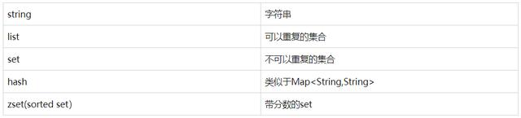
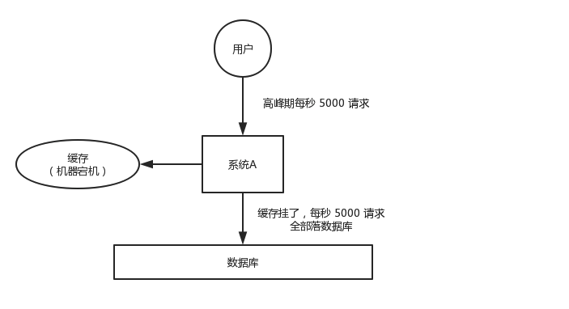
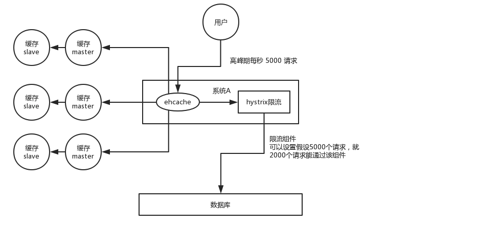

## 面试题

### 1、什么是Redis

Redis本质上是一个Key-Value类型的内存数据库，很像memcached，整个数据库统统加载在内存当中进行操作，定期通过异步操作把数据库数据flush到硬盘上进行保存。因为是纯内存操作，Redis的性能非常出色，每秒可以处理超过 10万次读写操作，是已知性能最快的Key-Value DB。

Redis的出色之处不仅仅是性能，Redis最大的魅力是支持保存多种数据结构，此外单个value的最大限制是1GB，不像 memcached只能保存1MB的数据，因此Redis可以用来实现很多有用的功能，比方说用他的List来做FIFO双向链表，实现一个轻量级的高性 能消息队列服务，用他的Set可以做高性能的tag系统等等。

另外Redis也可以对存入的Key-Value设置expire时间，因此也可以被当作一 个功能加强版的memcached来用。 Redis的主要缺点是数据库容量受到物理内存的限制，不能用作海量数据的高性能读写，因此Redis适合的场景主要局限在较小数据量的高性能操作和运算上。


### 2、Redis的全称

Remote Dictionary Server


### 3、Redis 数据类型




### 4、字符串类型的容量

STRING 是redis 中最基本的数据类型，redis 中的 STRING 类型是二进制安全的（以二进制的方式存储），即它可以包含任何数据，比如一个序列化的对象甚至一个jpg 图片，要注意的是redis 中的**字符串大小上限是 512M**。


### 5、Redis 事务

Redis无法做到像关系型数据库事务那样严格的ACID属性，特别是Redis官网明确指出了Redis为什么不支持回滚。

为了内部结构简单、运行效率更高，Redis舍弃了事务控制过程中的回滚支持。一个队列中的多个命令除非是在加入队列时发现错误会做到整个事务都不执行，否则所有命令都会执行，哪怕是队列中有的命令执行失败——显然Redis并没有在这里对队列中的多条命令进行回滚处理。Redis认为这些错误都应该在开发过程中被发现，而不是产品上线之后。

配合WATCH命令之后Redis的事务可以实现乐观锁效果：一个队列中的命令在执行时如果检测到碰撞，则放弃自己的操作。

相关命令：

- MULTI  开启一个事物，执行MULTI之后，如果继续发送命令，此时的命令不会立即执行，而是放到一个队列中。
- EXEC  执行队列中的命令。
- DISCARD  清空队列。
- WATCH  事务中的 WATCH 命令可以用来监控一个key，通过这种监控，我们可以为 redis事务提供(CAS)行为。如果有至少一个被 WATCH 监视的键在 EXEC 执行之前被修改了，那么整个事务都会被取消，EXEC返回 nil-reply 来表示事务已经失败。
- UNWATCH 取消对一个key的监控。


### 6、Redis key的过期时间

1. EXPIRE 命令为key设置过期时间，单位是秒。
2. PERSIST 命令移除一个key的过期时间，这样这个key就永远不会过期，TTL查询结果就是-1。


### 7、Redis 怎么做扩容

如果Redis被当做缓存使用，使用一致性哈希实现动态扩容缩容（通过key直接修改对应的val来实现）。

如果Redis被当做一个持久化存储使用，必须使用固定的keys-to-nodes映射关系，节点的数量一旦确定不能变化。否则（即Redis节点需要动态变化的情况），必须使用可以在运行时进行数据再平衡的一套系统，而当前只有Redis集群可以做到这样。


### 8、为什么Redis把数据放到内存中

Redis为了达到最快的读写速度将数据都读到内存中，并通过异步的方式将数据写入磁盘。所以redis具有快速和数据持久化的特征。如果不将数据放在内存中，磁盘I/O速度会严重影响redis的性能。在内存越来越便宜的今天，redis将会越来越受欢迎。 如果设置了最大使用的内存，则数据已有记录数达到内存限值后不能继续插入新值。


### 9、Redis 内存清理

redis设置配置文件的`maxmemory`参数，可以控制其最大可用内存大小（字节）。

Redis 为了保证内存通常处于可继续增加新值的状态，有以下几种淘汰key的策略。

-  **定期删除**：Redis会将所有设置了过期时间的key放入一个字典中，redis 默认每隔 100ms 就 **随机抽取** 那些设置了过期时间的 key，检查其是否过期，如果过期，就删除。注意，这里是随机抽取的。为什么要随机呢？想想，假如 redis 存了几十万个 key ，每隔 100ms 就遍历所有设置了过期时间的 key 的话，会给 CPU 带来很大的压力

-  **惰性删除**：定期删除可能会导致很多过期的 key 到了时间并没有被删除掉，所以就有了惰性删除。假如过期 key，靠定期删除没有被删除掉，还缓存在内存里，此时当程序去查那个 key 时，redis 如果判断过期，就会给删除掉，这就是所谓的惰性删除

- **主动删除**：redis是一个基于内存的数据库，如果存储的数据量很大，达到了内存限制的最大值，将会出现内存不足的问题。redis允许用户通过配置`maxmemory-policy`参数，指定redis在内存不足时的解决策略。

  > **LRU：最近使用；LFU：最频繁使用**

  - volatile-lru 使用LRU算法删除一个键（只针对设置了过期时间的key）
  - allkeys-lru 使用LRU算法删除一个键
  - volatile-lfu 使用LFU算法删除一个键（只针对设置了过期时间的key）
  - allkeys-lfu 使用LFU算法删除一个键
  - volatile-random 随机删除一个键（只针对设置了过期时间的key）
  - allkeys-random 随机删除一个键
  - volatile-ttl 删除最早过期的一个键
  - noeviction 不删除键，返回错误信息(redis默认选项)


### 10、缓存穿透

**定义：**

按照KEY去查询VALUE，当KEY对应的VALUE一定不存在的时候并对KEY并发请求量很大的时候，就会对后端造成很大的压力。（查询一个必然不存在的数据。比如文章表，查询一个不存在的id，每次都会访问DB，如果有人恶意破坏，很可能直接对DB造成影响。）

由于缓存不命中，每次都要查询持久层。从而失去缓存的意义。

**解决方法：**

1. 缓存层缓存空值。

   缓存太多空值，占用更多空间。（优化：给个空值过 期时间）

   存储层更新代码了，缓存层还是空值。（优化：后台设置时主动删除空值，并缓存真实值进去）

2. 将数据库中所有的查询条件，放布隆过滤器中。当一个查询请求来临的时候，先经过布隆过滤器进行查，如果请求存在这个条件中，那么继续执行，如果不在，直接丢弃。

    > 布隆过滤器（Bloom Filter）是 1970 年由布隆提出的，是一种非常节省空间的概率数据结构，运行速度快，占用内存小，但是有一定的误判率且无法删除元素。它实际上是一个很长的二进制向量和一系列随机映射函数组成，主要用于判断一个元素是否在一个集合中。
    >
    > 布隆过滤器中一个元素如果判断结果为存在的时候元素不一定存在，但是判断结果为不存在的时候则一定不存在。因此，布隆过滤器不适合那些对结果必须精准的应用场景。


### 11、雪崩

**定义：**

Redis缓存层由于某种原因（redis服务器断电；缓存失效、过期）宕机后，所有的请求会涌向数据库，短时间内的高并发请求可能会导致数据库挂机，称之为**雪崩**。



**解决方案：**

- 事前：redis 高可用。主从+哨兵、redis cluster，避免全盘崩溃。
- 事中：本地 ehcache 缓存 + hystrix 限流&降级，避免 MySQL 被打死。
- 事后：redis 持久化，一旦重启，自动从磁盘上加载数据，快速恢复缓存数据。



用户发送一个请求，系统 A 收到请求后，先查本地 ehcache 缓存，如果没查到再查 redis。如果 ehcache 和 redis 都没有，再查数据库，将数据库中的结果，写入 ehcache 和 redis 中。

限流组件，可以设置每秒的请求，有多少能通过组件，剩余的未通过的请求，怎么办？**走降级**！可以返回一些默认的值，或者友情提示，或者空白的值。

好处：

- 数据库绝对不会死，限流组件确保了每秒只有多少个请求能通过。
- 只要数据库不死，就是说，对用户来说，2/5 的请求都是可以被处理的。
- 只要有 2/5 的请求可以被处理，就意味着你的系统没死，对用户来说，可能就是点击几次刷不出来页面，但是多点几次，就可以刷出来一次。


### 12、哨兵模式

如果Master异常，则会进行Master-Slave切换，将其中一个Slave作为Master，如果之前的Master重启正常，将会作为Slave。

**下线：**

1. 主观下线：Subjectively Down，简称 SDOWN，指的是当前 Sentinel 实例对某个redis服务器做出的下线判断。
2. 客观下线：Objectively Down， 简称 ODOWN，指的是多个 Sentinel 实例在对Master Server做出 SDOWN 判断，并且通过 SENTINEL is-master-down-by-addr 命令互相交流之后，得出的Master Server下线判断，然后开启failover。

**工作原理：**

1. 每个Sentinel以每秒钟一次的频率向它所知的Master、Slave以及其他 Sentinel 实例发送一个 PING 命令；
2. 如果一个实例（instance）距离最后一次有效回复 PING 命令的时间超过 down-after-milliseconds 选项所指定的值，则这个实例会被 Sentinel 标记为主观下线；
3. 如果一个Master被标记为主观下线，则正在监视这个Master的所有 Sentinel 要以每秒一次的频率确认Master的确进入了主观下线状态；
4. 当有足够数量的 Sentinel（大于等于配置文件指定的值）在指定的时间范围内确认Master的确进入了主观下线状态， 则Master会被标记为客观下线 ；
5. 在一般情况下，每个 Sentinel 会以每 10 秒一次的频率向它已知的所有Master、Slave发送 INFO 命令；
6. 当Master被 Sentinel 标记为客观下线时，Sentinel 向下线的 Master 的所有 Slave 发送 INFO 命令的频率会从 10 秒一次改为每秒一次 ；
7. 若没有足够数量的 Sentinel 同意 Master 已经下线， Master 的客观下线状态就会被移除；
8. 若 Master 重新向 Sentinel 的 PING 命令返回有效回复， Master 的主观下线状态就会被移除；


**启动哨兵模式：**

```shell
# 在redis目录下打开 sentinel.conf 文件，做如下配置：
# 其中 mymaster 是给要监控的主机取的名字，随意取，后面是主机地址，最后面的 1 表示有多少个sentinel 认为主机挂掉了，就进行切换。
sentinel monitor mymaster 127.0.0.1 6379 1

# 启动哨兵
redis-sentinel sentinel.conf
```


### 13、悲观锁

执行操作前假设当前的操作肯定（或有很大几率）会被打断（悲观）。基于这个假设，我们在做操作前就会把相关资源锁定，不允许自己执行期间有其他操作干扰。

Redis不支持悲观锁。Redis作为缓存服务器使用时，以读操作为主，很少写操作，相应的操作被打断的几率较少。不采用悲观锁是为了防止降低性能。


### 14、乐观锁

执行操作前假设当前操作不会被打断（乐观）。基于这个假设，我们在做操作前不会锁定资源，万一发生了其他操作的干扰，那么本次操作将被放弃。

例如：开启一个事物，在执行事务之前检查一次数据版本，在事物执行完成提交之前在检查一次数据版本，二者一致则说说明没有其他操作干扰，则执行提交操作；否则放弃当前操作。


### 15、持久化

- **RDB持久化**

  每隔一段时间，将内存中的数据集写到磁盘，Redis 默认开启RDB持久化。

  Redis会单独创建（fork）一个子进程来进行持久化，会先将数据写入到个临时文件中，待持久化过程都结束了，再用这个临时文件替换上次持久化好的文件。

  整个过程中，主进程是不进行任何IO操作的，这就确保了极高的性能。

  如果需要进行大规模数据的恢复，且对于数据恢复的完整性不是非常敏感，那RDB方式要比AOF方式更加的高效。

  **保存策略：**

  - save 900 1  => 900秒内如果至少有 1 个 key 的值变化，则保存
  - save 300 10 => 300秒内如果至少有 10 个 key 的值变化，则保存
  - save 60 10000 => 60秒内如果至10000 个 key 的值变化，则保存

- **AOF 持久化**

  以日志形式记录每个更新操作，Redis 默认不开启AOF持久化。Redis重新启动时读取这个文件，重新执行新建、修改数据的命令恢复数据。

  **保存策略：**

  - appendfsync always：每次产生一条新的修改数据的命令都执行保存操作；效率低，但是安全。
  - appendfsync everysec：每秒执行一次保存操作。如果在未保存当前秒内操作时发生了断电，仍然会导致一部分数据丢失（即1秒钟的数据）。
  - appendfsync no：将数据库保存操作的触发时机交给操作系统来进行调度更快，也更不安全的选择。
  - 推荐（并且也是默认）的措施为每秒 fsync 一次， 这种 fsync 策略可以兼顾速度和安全性。

  **缺点：**

  - 比起RDB占用更多的磁盘空间
  - 恢复备份速度要慢
  - 每次读写都同步的话，有一定的性能压力
  - 存在个别Bug，造成恢复不全

- **策略选择**

  如果对数据不敏感，可以选单独用RDB；不建议单独用AOF，因为可能出现Bug；如果只是做纯内存缓存，可以都不用。


### 16、Redis提供了哪几种持久化方式

RDB持久化方式能够在指定的时间间隔能对你的数据进行快照存储。

AOF持久化方式记录每次对服务器写的操作，当服务器重启的时候会重新执行这些命令来恢复原始的数据，AOF命令以redis协议追加保存每次写的操作到文件末尾。Redis还能对AOF文件进行后台重写，使得AOF文件的体积不至于过大。

如果你只希望你的数据在服务器运行的时候存在，你也可以不使用任何持久化方式。

你也可以同时开启两种持久化方式，在这种情况下，当redis重启的时候会优先载入AOF文件来恢复原始的数据，因为在通常情况下AOF文件保存的数据集要比RDB文件保存的数据集要完整。


### 17、如何选择合适的持久化方式

一般来说， 如果想达到足以媲美PostgreSQL的数据安全性， 你应该同时使用两种持久化功能。如果你非常关心你的数据， 但仍然可以承受数分钟以内的数据丢失，那么你可以只使用RDB持久化。

有很多用户都只使用AOF持久化，但并不推荐这种方式：因为定时生成RDB快照（snapshot）非常便于进行数据库备份， 并且 RDB 恢复数据集的速度也要比AOF恢复的速度要快，除此之外，使用RDB还可以避免之前提到的AOF程序的bug。


### 18、Redis 分布式

既然Redis是如此的轻量（单实例只使用1M内存），为防止以后的扩容，最好的办法就是一开始就启动较多实例。即便你只有一台服务器，你也可以一开始就让Redis以分布式的方式运行，使用分区，在同一台服务器上启动多个实例。

一开始就多设置几个Redis实例，例如32或者64个实例，对大多数用户来说这操作起来可能比较麻烦，但是从长久来看做这点牺牲是值得的。

这样的话，当你的数据不断增长，需要更多的Redis服务器时，你需要做的就是仅仅将Redis实例从一台服务迁移到另外一台服务器而已（而不用考虑重新分区的问题）。一旦你添加了另一台服务器，你需要将你一半的Redis实例从第一台机器迁移到第二台机器。


### 19、Redis 内存优化

对于大量的 key-val 的短字符串类型的数据，可以考虑Hash、List等数据类型，将短字符串放到更加紧凑的数据类型中。 


### 20、Redis 是单线程，为什么还那么快

1. 完全基于内存，绝大部分请求是纯粹的内存操作，非常快速。数据存在内存中，类似于HashMap，HashMap的优势就是查找和操作的时间复杂度都是O(1)；

2. 数据结构简单，对数据操作也简单，Redis中的数据结构是专门进行设计的；

3. 采用单线程，避免了不必要的上下文切换和竞争条件，也不存在多进程或者多线程导致的切换而消耗 CPU，不用去考虑各种锁的问题，不存在加锁释放锁操作，没有因为可能出现死锁而导致的性能消耗；

4. 使用多路I/O复用模型，非阻塞IO；

5. 使用底层模型不同，它们之间底层实现方式以及与客户端之间通信的应用协议不一样，Redis直接自己构建了VM 机制 ，因为一般的服务调用系统函数的话，会浪费一定的时间去移动和请求；

6. 以上几点都比较好理解，下边针对多路 I/O 复用模型进行简单的探讨：

   - 多路I/O复用模型是利用 select、poll、epoll 可以同时监察多个流的 I/O 事件的能力，在空闲的时候，会把当前线程阻塞掉，当有一个或多个流有 I/O 事件时，就从阻塞态中唤醒，于是程序就会轮询一遍所有的流（epoll 是只轮询那些真正发出了事件的流），并且只依次顺序的处理就绪的流，这种做法就避免了大量的无用操作。
   - **多路** 指的是多个网络连接，**复用** 指的是复用同一个线程。采用多路 I/O 复用技术可以让单个线程高效的处理多个连接请求（尽量减少网络 IO 的时间消耗），且 Redis 在内存中操作数据的速度非常快，也就是说内存内的操作不会成为影响Redis性能的瓶颈，主要由以上几点造就了 Redis 具有很高的吞吐量。


### 21、Redis 为什么是单线程

redis是单线程的原因在于redis用单个CPU绑定一块内存的数据，然后针对这块内存的数据进行多次读写的时候，都是在一个CPU上完成的。redis核心就是 如果我的数据全都在内存里，我单线程的去操作就是效率最高的。所以，redis是单线程。

**为什么Redis是单线程的**

- 首先要明白，上边 20问中 的种种分析，都在说明一个Redis很快的原因。官方FAQ表示，因为Redis是基于内存的操作，CPU不是Redis的瓶颈，Redis的瓶颈最有可能是机器内存的大小或者网络带宽。既然单线程容易实现，而且CPU不会成为瓶颈，那就顺理成章地采用单线程的方案了。

- 这里我们一直在强调的单线程，**只是在处理我们的网络请求的时候只有一个线程来处理**，一个正式的Redis Server运行的时候肯定是不止一个线程的，这里需要大家明确的注意一下。例如Redis进行持久化的时候会以子进程或者子线程的方式执行。


### 22、Redis是单线程的，如何提高多核CPU的利用率

可以在同一个服务器部署多个Redis的实例，并把他们当作不同的服务器来使用，在某些时候，无论如何一个服务器是不够的， 所以，如果你想使用多个CPU，你可以考虑一下分片（shard）。


### 23、Redis实例最多能存放多少的keys

理论上Redis可以处理多达2^32的keys，并且在实际中进行了测试，每个实例至少存放了2亿5千万的keys。我们正在测试一些较大的值。

任何list、set、和sorted set都可以放2^32个元素。

换句话说，Redis的存储极限是系统中的可用内存值。


### 24、Redis常见性能问题和解决方案

1. Master最好不要做任何持久化工作，如RDB内存快照和AOF日志文件
1. 如果数据比较重要，某个Slave开启AOF备份数据，策略设置为每秒同步一次
1. 为了主从复制的速度和连接的稳定性，Master和Slave最好在同一个局域网内
1. 尽量避免在压力很大的主库上增加从库
1. 主从复制不要用图状结构，用单向链表结构更为稳定，即：Master < Slave1 < Slave2 < Slave3，这样的结构方便解决单点故障问题，实现Slave对Master的替换。如果Master挂了，可以立刻启用Slave1做Master，其他不变。


### 25、Redis相比memcached有哪些优势

1. memcached所有的值均是简单的字符串，redis作为其替代者，支持更为丰富的数据类型
2. redis的速度比memcached快很多
3. redis可以持久化其数据


### 26、如何保证redis中的数据都是热点数据

redis内存数据集大小上升到一定大小的时候，施行数据淘汰策略。


### 27、Redis 集群方案

1. twemproxy。它类似于一个代理方式，使用方法和普通redis无任何区别，设置好它下属的多个redis实例后，使用时在本地需要连接redis的地方改为连接twemproxy，它会以一个代理的身份接收请求并使用一致性hash算法，将请求转接到具体redis，将结果再返回twemproxy。使用方式简便（相对redis只需修改连接端口），对旧项目扩展的首选。 问题：twemproxy自身单端口实例的压力，使用一致性hash后，对redis节点数量改变时候的计算值的改变，数据无法自动移动到新的节点。
2. codis，目前用的最多的集群方案，基本和twemproxy一致的效果，但它支持在 节点数量改变情况下，旧节点数据可恢复到新hash节点。
3. redis cluster3.0自带的集群，特点在于他的分布式算法不是一致性hash，而是hash槽的概念，以及自身支持节点设置从节点。具体看官方文档介绍。
4. 在业务代码层实现，起几个毫无关联的redis实例，在代码层，对key 进行hash计算，然后去对应的redis实例操作数据。 这种方式对hash层代码要求比较高，考虑部分包括，节点失效后的替代算法方案，数据震荡后的自动脚本恢复，实例的监控，等等。


### 28、Redis哈希槽

Redis集群没有使用一致性hash，而是引入了哈希槽的概念，Redis集群有16384个哈希槽，每个key通过CRC16校验后对16384取模来决定放置哪个槽，集群的每个节点负责一部分hash槽。

因此，Redis集群也最多能有 16384个 节点，每个节点负责一个hash槽。


### 29、集群状态命令

INFO 查看节点信息

PING 查看目标节点是否可连接


### 30、Redis 配置修改

针对运行实例，有许多配置选项可以通过 CONFIG SET 命令进行修改，而无需执行任何形式的重启。 从 Redis 2.2 开始，可以从 AOF 切换到 RDB 的快照持久性或其他方式而不需要重启 Redis。检索 `CONFIG GET *` 命令获取更多信息。

但偶尔重新启动是必须的，如为升级 Redis 程序到新的版本，或者当你需要修改某些目前 CONFIG 命令还不支持的配置参数的时候。


### 31、Redis 适用的场景

1. **会话缓存（Session Cache）**

   最常用的一种使用Redis的情景是会话缓存（session cache）。用Redis缓存会话比其他存储（如Memcached）的优势在于：Redis提供持久化。当维护一个不是严格要求一致性的缓存时，如果用户的购物车信息全部丢失，大部分人都会不高兴的，现在，他们还会这样吗？

   幸运的是，随着 Redis 这些年的改进，很容易找到怎么恰当的使用Redis来缓存会话的文档。甚至广为人知的商业平台Magento也提供Redis的插件。

2. **全页缓存（FPC）**

   除基本的会话token之外，Redis还提供很简便的FPC平台。回到一致性问题，即使重启了Redis实例，因为有磁盘的持久化，用户也不会看到页面加载速度的下降，这是一个极大改进，类似PHP本地FPC。

   再次以Magento为例，Magento提供一个插件来使用Redis作为全页缓存后端。

   此外，对WordPress的用户来说，Pantheon有一个非常好的插件 wp-redis，这个插件能帮助你以最快速度加载你曾浏览过的页面。

3. **队列**

   Reids在内存存储引擎领域的一大优点是提供 list 和 set 操作，这使得Redis能作为一个很好的消息队列平台来使用。Redis作为队列使用的操作，就类似于本地程序语言（如Python）对 list 的 push/pop 操作。

   如果你快速地在Google中搜索“Redis queues”，你马上就能找到大量的开源项目，这些项目的目的就是利用Redis创建非常好的后端工具，以满足各种队列需求。例如，Celery有一个后台就是使用Redis作为broker，你可以从这里去查看。

4. **排行榜/计数器**

   Redis在内存中对数字进行递增或递减的操作实现的非常好。集合（Set）和有序集合（Sorted Set）也使得我们在执行这些操作的时候变的非常简单，Redis只是正好提供了这两种数据结构。所以，我们要从排序集合中获取到排名最靠前的10个用户，我们称之为“user_scores”，我们只需要像下面一样执行即可：

   当然，这是假定你是根据你用户的分数做递增的排序。如果你想返回用户及用户的分数，你需要这样执行：

   ```shell
   ZRANGE user_scores -10 -1 WITHSCORES
   ```

   Agora Games就是一个很好的例子，用Ruby实现的，它的排行榜就是使用Redis来存储数据的，你可以在这里看到。

5. **发布/订阅**

   最后（但肯定不是最不重要的）是Redis的发布/订阅功能。发布/订阅的使用场景确实非常多。我已看见人们在社交网络连接中使用，还可作为基于发布/订阅的脚本触发器，甚至用Redis的发布/订阅功能来建立聊天系统。

