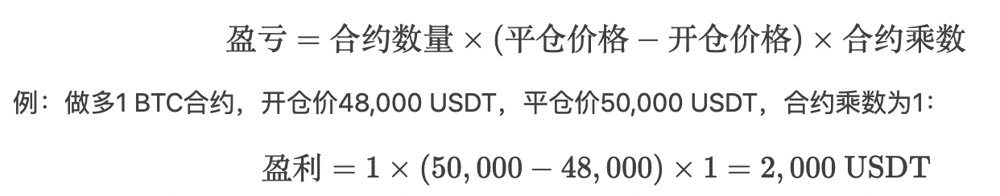
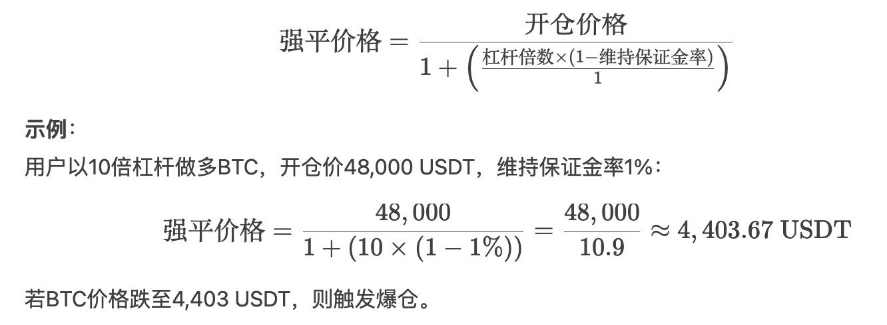

## 概述

虚拟币交易所（如币安、Gate.io、抹茶交易所等）的核心业务围绕数字资产的交易、托管、增值及生态服务展开。

## 核心业务

1. **现货交易（币币交易）**
   - **定义**：支持用户用一种加密货币兑换另一种加密货币（如BTC/USDT）。
   - **流程**：用户选择交易对（如BTC/USDT），下达市价单或限价单，系统撮合成交后更新账户资产。
   - **特点**：提供深度图表、止盈止损单等工具，适合高频交易者。
2. **法币交易（OTC交易）**
   - **定义**：允许用户通过法币（如人民币、美元）直接购买或出售加密货币。
   - **流程**：用户选择商家→绑定支付方式→下单转账→系统托管资金直至双方确认完成。
   - **风险控制**：需审核商家资质，保留交易凭证以应对纠纷。
3. **衍生品交易**
   - **类型**：包括永续合约、期货合约、期权等。
   - **流程**：用户需将现货账户资产转入合约账户，选择杠杆倍数并开仓/平仓。
   - **风险**：高杠杆可能导致强制平仓，需设置止损策略。
4. **资产管理服务**
   - **产品**：活期/定期理财、质押挖矿（如Staking）、借贷等。
   - **流程**：用户将资产存入指定账户，按协议获得收益，赎回时需支付手续费。
5. **上币服务**
   - **流程**：项目方提交申请→交易所审核技术、合规性→支付上币费（含押金、顾问费）→代币上线交易。
   - **争议**：部分交易所被曝要求项目方支付高额隐性费用（如4%-8%代币空投、5%-10%顾问费）。

## 业务流程

1. **注册与KYC验证**

   - 用户通过邮箱/手机号注册，设置密码并完成验证码验证。
   - 高级功能（如提现）需完成二级验证（如谷歌验证器）和实名认证。

2. **法币入金/充币**

   - **法币入金（OTC充值）**：绑定银行卡或支付宝→选择商家→支付法币→接收加密货币。
     - **支付方式**：银行转账、支付宝/微信（中国区）、信用卡（国际用户），需注意手续费差异（如信用卡充值费高达3%-5%）。
     - **购买稳定币**：多数交易所要求通过USDT等稳定币过渡，例如：用户A通过支付宝向商家B支付10,000元→商家B释放等值USDT至用户A账户。
   - **充币（加密货币充值）**：生成充币地址→从外部钱包转入→等待链上确认（通常需6-12个区块确认）。
     - 生成充币地址：在交易所选择对应币种（如ETH），复制唯一地址或扫描二维码。
     - 确认网络类型：不同币种需匹配正确区块链（如ERC-20与TRC-20的USDT地址不同），错误转账可能导致资产丢失。

3. **交易执行**

   - **币币交易**：选择交易对（如ETH/USDT）→输入数量/价格→选择限价单（指定价格）或市价单（即时成交）→确认订单。

     | 订单类型   | 特点                                 | 适用场景                    |
     | :--------- | :----------------------------------- | :-------------------------- |
     | **市价单** | 即时成交，按当前最优价格执行         | 快速买入/卖出，避免价格波动 |
     | **限价单** | 指定价格成交，可能部分成交或挂单等待 | 精准控制成本，适合波段操作  |
     | **止损单** | 触发设定价格后自动转为市价单         | 风险控制，防止大幅亏损      |

   - **合约交易**：转入保证金→设置杠杆（倍数）和方向（做多或做空）→开仓后监控保证金率，避免爆仓。

     - **杠杆倍数**：主流平台提供3-125倍（如币安永续合约），需注意保证金率（低于维持保证金将触发强平）。
     - **资金费率**：每8小时结算一次，正费率时多头支付空头，用于平衡市场。

4. **提现与法币出金**

   - **提币**：输入外部钱包地址→填写数量→支付链上手续费→等待审核（通常1-2小时）。
   - **法币出金**：选择支持的法币（如CNY）→匹配买家→转账加密货币至对方地址→确认收款后法币到账。

## KYC认证
**KYC（Know Your Customer）** 是交易所为反洗钱（AML）和用户身份核验设立的强制流程，具体包括：

- **认证材料**：
  - 身份证明：身份证、护照或驾照（需清晰照片，边缘无遮挡）
  - 地址证明：3个月内水电费账单或银行对账单（需与身份证明地址一致）
  - 人脸识别：通过App完成活体检测（如眨眼、转头动作）
- **认证等级**：
  - 基础认证：仅限小额交易（如单日提现≤1BTC）
  - 高级认证：需补充收入来源证明（如工资流水），解锁更高交易限额
- **审核时间**：通常为1-3个工作日，部分平台支持快速通道（如币安VIP客户2小时内完成）

## 合约交易

在加密货币合约交易中，**开仓、爆仓、平仓**是核心操作，直接关系到用户盈亏与风险控制。

### 开仓（Open Position）

**定义**：用户通过支付保证金，建立合约头寸（做多或做空）的行为。
**操作流程**：

1. **选择合约类型**：永续合约（无到期日）或交割合约（固定结算日）。
2. **设置杠杆倍数**：主流平台提供3-125倍杠杆（如币安最高125倍，OKX最高100倍）。
3. **输入开仓参数**：
   - **方向**：做多（看涨）或做空（看跌）
   - **保证金**：根据杠杆计算（例：10倍杠杆下，开仓价值=保证金×10）
   - **订单类型**：市价单（即时成交）或限价单（指定价格成交）。

**公式示例**：
假设用户以 **10倍杠杆** 开多BTC合约，投入保证金 **1,000 USDT**：

- **合约价值** = 1,000 USDT × 10 = 10,000 USDT
- 若BTC价格上涨1%，则盈利 = 10,000 × 1% = 100 USDT（收益率10%）。

### 平仓（Close Position）

**定义**：主动结束持有的合约头寸，实现盈利或止损。
**类型**：

1. **手动平仓**：用户主动点击“平仓”按钮，按市价或限价退出。
2. **止盈止损平仓**：预设触发价格自动平仓（如设置“当BTC涨至50,000 USDT时平仓”）。

**计算逻辑**：

- **盈亏公式**：

  

### 爆仓（Liquidation）

**定义**：当用户保证金不足以维持持仓时，交易所强制平仓以避免穿仓（用户倒欠平台资金）。
**触发条件**：

- **维持保证金率**跌破平台阈值（通常为0.5%-2%）。

- **强平价格**计算公式（以做多为例）：

  

### 关键风险与应对策略

1. **杠杆与仓位管理**：
   - 高杠杆放大收益，但更易爆仓（如125倍杠杆下，价格波动0.8%即可强平）。
   - **建议**：新手杠杆≤10倍，单仓位≤总资金5%。
2. **保证金监控**：
   - **保证金率** = (账户权益 / 占用保证金) × 100%
   - 当保证金率接近维持水平时，需及时追加保证金（如币安支持“自动追加保证金”功能）。
3. **平台风控差异**：
   - **部分平仓机制**：部分平台（如Bybit）在价格接近强平时，逐步平仓减少损失。
   - **保险基金**：交易所使用资金池弥补穿仓损失（如币安保险基金规模超10亿美元）。

## 风险合规

1. **手续费结构**
   - 交易费：现货交易通常为0.1%-0.2%（挂单方可能更低）；合约交易费包含开仓/平仓费用。
   - 提现费：按币种和网络收取（如BTC提现费约0.0005 BTC）。
2. **安全措施**
   - 冷热钱包分离：95%资产存储于离线冷钱包，仅少量用于日常流通。
   - 风险监控：异常登录预警、提现地址白名单、反洗钱（AML）系统。
3. **合规挑战**
   - 地域限制：部分国家禁止法币交易（如中国境内平台仅支持币币交易）。
   - 监管压力：需配合KYC/AML审查，避免涉及非法资金流动。
4. **KYC审核失败原因**
   - 证件模糊、信息不一致（如姓名拼音与身份证不符）。
   - 高风险地区用户（如伊朗、朝鲜IP）可能被直接拒绝。

