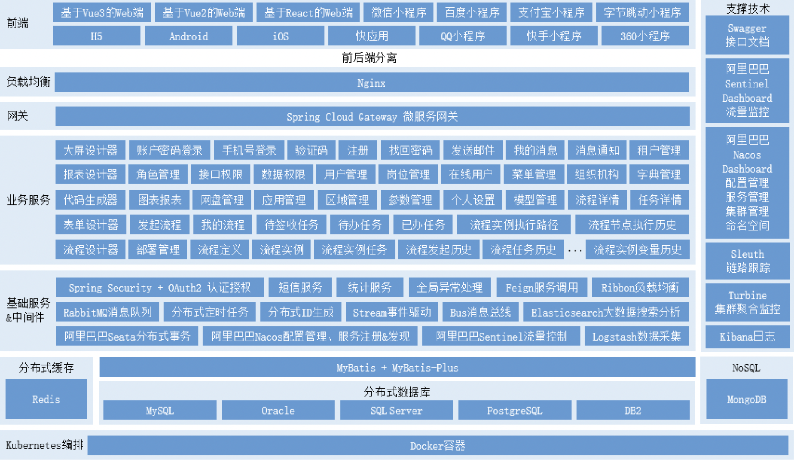

# 微服务架构

微服务架构（Microservice Architecture）是一种架构概念，旨在通过将功能分解到各个离散的服务中以实现对解决方案的解耦。

理解微服务架构的爽文：https://www.zhihu.com/question/65502802

## 概念及定义

**概念：**把一个大型的单体应用程序和服务拆分为数个甚至数十个的微服务，它可独立扩展单个组件而不影响整个的应用程序堆栈。

**定义：**围绕业务领域组件来创建应用，这些应用可独立地进行开发、管理和迭代。在分散的组件中使用云架构和平台式部署、管理和服务，使产品交付变得更加简单。

**本质：**用一些功能比较明确、业务比较精练的服务去解决更大、更实际的问题。

## 优点和缺点

### 优点

> **关键点：**复杂度可控，独立按需扩展，技术选型灵活，容错、可用性高

1. 它解决了复杂性的问题。它会将一种怪异的整体应用程序分解成一组服务。虽然功能总量不变，但应用程序已分解为可管理的块或服务。每个服务都以RPC或消息驱动的API的形式定义了一个明确的边界；Microservice架构模式实现了一个模块化水平。

2. 这种架构使每个服务都能够由专注于该服务的团队独立开发。开发人员可以自由选择任何有用的技术，只要该服务符合API合同。当然，大多数组织都希望避免完全无政府状态并限制技术选择。然而，这种自由意味着开发人员不再有义务使用在新项目开始时存在的可能过时的技术。在编写新服务时，他们可以选择使用当前的技术。此外，由于服务相对较小，因此使用当前技术重写旧服务变得可行。

3. Microservice架构模式使每个微服务都能独立部署。开发人员不需要协调部署本地服务的变更。这些变化可以在测试后尽快部署。例如，UI团队可以执行A/B测试，并快速迭代UI更改。Microservice架构模式使连续部署成为可能。

   > AB测试是为 Web 或 App 界面或流程制作两个（A/B）或多个（A/B/n）版本，在同一时间维度，分别让组成成分相同（相似）的访客群组（目标人群）随机的访问这些版本，收集各群组的用户体验数据和业务数据，最后分析、评估出最好版本，正式采用。

4. Microservice架构模式使每个服务都可以独立调整。您可以仅部署满足其容量和可用性限制的每个服务的实例数。此外，您可以使用最符合服务资源要求的硬件。

### 缺点

> **关键点（挑战）：**多服务运维难度增加，系统部署依赖，服务间通信成本，数据一致性，系统集成测试，稳定性降低，问题定位难度增加等。
>
> 数据一致性往往是需要研发同学重点关注的对象，微服务架构下的分布式事务是带来数据一致性问题的关键，当前主流的分布式事务解决方案：https://zhuanlan.zhihu.com/p/183753774

1. 微服务架构整个应用分散成多个服务，定位故障点非常困难。
2. 稳定性下降。服务数量变多导致其中一个服务出现故障的概率增大，并且一个服务故障可能导致整个系统挂掉。事实上，在大访问量的生产场景下，故障总是会出现的。
3. 服务数量非常多，部署、管理的工作量很大。
4. 开发方面，如何保证各个服务在持续开发的情况下仍然保持协同合作和分布式场景下的数据一致性。
5. 测试方面，服务拆分后，几乎所有功能都会涉及多个服务。原本单个程序的测试变为服务间调用的测试。测试变得更加复杂。

**为了提高架构的健壮性，解决以上微服务架构带来的挑战，从两方面着手解决。**

- **一方面尽量减少故障发生的概率**

  - **监控 - 发现故障的征兆**：在高并发分布式的场景下，故障经常是突然间就雪崩式爆发。所以必须建立完善的监控体系，尽可能发现故障的征兆。

  - **定位问题 - 链路跟踪**：在微服务架构下，一个用户的请求往往涉及多个内部服务调用。为了方便定位问题，需要能够记录每个用户请求时，微服务内部产生了多少服务调用，及其调用关系。这个叫做链路跟踪。

  - **分析问题 - 日志分析**：在应用规模变大时，我们需要一个日志的“**搜索引擎**”。以便于能准确的找到想要的日志。另外，数据源一侧还需要收集日志的组件和展示结果的UI组件。

  - **网关 - 权限控制、服务治理**：拆分成微服务后，出现大量的服务，大量的接口，使得整个调用关系乱糟糟的。为了应对这些情况，微服务的调用需要一个把关的东西，也就是网关。在调用者和被调用者中间加一层网关，每次调用时进行权限校验。另外，网关也可以作为一个提供服务接口文档的平台。

    

- **一方面降低故障造成的影响**

  - **服务注册与发现 - 动态扩容**：根据服务功能、时间段的不同，需要不同数量的实例。一般来说，一个服务都会部署多个实例，这样一来能够分担压力提高性能，二来即使一个实例挂了其他实例还能响应。
  - **熔断、服务降级、限流**
    - **熔断**：当一个服务因为各种原因停止响应时，调用方通常会等待一段时间，然后超时或者收到错误返回。如果调用链路比较长，可能会导致请求堆积，整条链路占用大量资源一直在等待下游响应。所以当多次访问一个服务失败时，应熔断，标记该服务已停止工作，直接返回错误。直至该服务恢复正常后再重新建立连接。
    - **服务降级**：当下游服务停止工作后，如果该服务并非核心业务，则上游服务应该降级，以保证核心业务不中断。比如网上超市下单界面有一个推荐商品凑单的功能，当推荐模块挂了后，下单功不能一起挂掉，只需要暂时关闭推荐功能即可。
    - **限流**：限流策略有很多，最简单的比如当单位时间内请求数过多时，丢弃多余的请求。另外，也可以考虑分区限流。仅拒绝来自产生大量请求的服务的请求。例如商品服务和订单服务都需要访问促销服务，商品服务由于代码问题发起了大量请求，促销服务则只限制来自商品服务的请求，来自订单服务的请求则正常响应。

## 服务间的层级关系

# SOA和微服务

**SOA架构（Service-Oriented Architecture，面向服务的架构）**

是一种基于服务的设计原则和方法，旨在实现松耦合、可重用和可组合的软件系统。在SOA架构中，系统被拆分为一组自治的服务，每个服务提供特定的功能，并通过标准化的接口进行通信。这些服务可以独立开发、部署和升级，可以跨越不同的技术平台和编程语言。SOA架构强调服务的可重用性和可组合性，通过服务的组合和编排来实现复杂的业务流程。

**微服务架构（Microservices Architecture）**

是一种将应用程序拆分为一组小型、自治的服务的架构风格。每个微服务都是独立部署和运行的，可以使用不同的技术栈和编程语言。微服务之间通过轻量级的通信机制进行交互，通常使用HTTP/REST或消息队列。微服务架构强调服务的自治性和可独立扩展性，每个微服务都专注于解决特定的业务问题，并且可以独立进行开发、部署和扩展。

**下面是SOA架构和微服务架构的区别：**

1. 规模和复杂性：SOA架构通常适用于大型企业级系统，涉及多个业务领域和复杂的业务流程。微服务架构更适合中小型系统，可以更灵活地应对快速变化的需求。

2. 服务粒度：SOA架构中的服务通常较大，涵盖多个相关功能。微服务架构中的服务更小，每个服务只关注一个特定的业务功能。

3. 通信机制：SOA架构中的服务之间通常使用SOAP（Simple Object Access Protocol）或其他基于XML的协议进行通信。微服务架构更倾向于使用轻量级的通信机制，如HTTP/REST或消息队列。

4. 数据管理：SOA架构中的服务通常共享同一个数据存储，通过共享数据库或中间件来实现数据交互。微服务架构中的每个服务都有自己的数据存储，可以选择适合自己的数据库或存储技术。

5. 部署和扩展：SOA架构中的服务通常以较大的粒度进行部署和扩展，可能需要整体升级或扩容。微服务架构中的每个服务都可以独立部署和扩展，可以根据需要进行灵活的水平扩展。

SOA架构更适合大型、复杂的企业级系统，强调服务的可重用性和组合性；微服务架构更适合中小型系统，强调服务的自治性和独立扩展性。选择哪种架构取决于具体的业务需求和系统规模。
