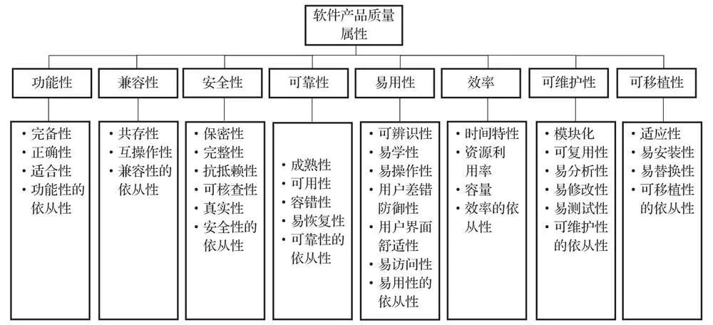
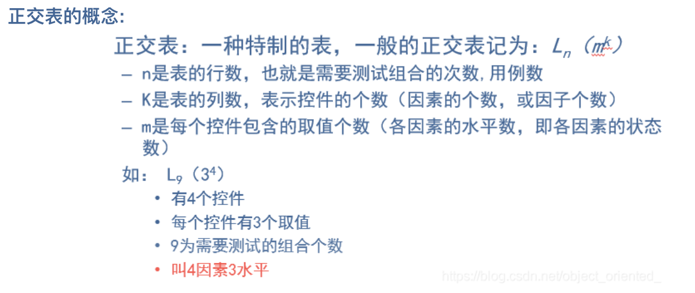
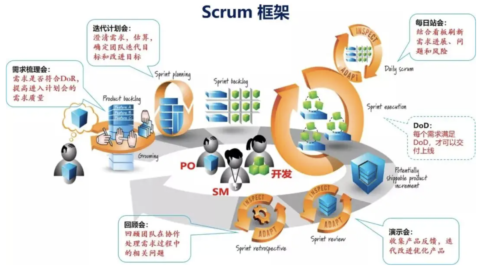

# 软件质量模型

软件质量模型将软件质量属性划分为八个质量特性：功能性、兼容性、安全性、可靠性、易用性、效率、可维护性、可移植性

**功能性**

当软件在指定条件下使用时，软件产品提供满足明确和隐含要求的功能的能力

- 完备性：功能集对指定任务和用户目标的覆盖程度（明示和隐含的用户预期）
- 适合性：功能促使指定的任务和目标实现的程度
- 正确性：提供具有所需精度的正确或相符的结果或效果的能力
- 功能性的依从性：产品或系统遵循与该功能相关的标准、约定或法规
- 安全保密性：保护信息和数据的能力，以使未授权的人员或系统不能阅读或修改这些信息和数据，而不拒绝授权人员或系统对它们的访问

**兼容性**

软件产品质量属性中的兼容性是指软件产品在共享软件或者硬件的条件下，产品、系统或者组件能够与其他产品、系统或组件交换信息，实现所需功能的能力。

- 共存性：在与其他产品共享通用的环境和资源的条件下，产品能够有效执行其所需的功能并且不会对其他产品造成负面影响。
- 互操作性：两个或多个系统、产品或组件能够交换信息并使用已交换的信息 
- 兼容性的依从性：产品或系统遵守与兼容性相关的标准、约定或者法规以及类似规定的程度

**安全性**

是指软件产品或系统保护信息和数据的程度，其可使用户、产品或系统具有与其授权类型、授权级别一致的数据访问程度

对于一个应用或服务来说，安全性不仅需要考虑这个**应用或服务本身**，还需要考虑这个**应用或服务承载的系统或者平台**。对于C/S或者B/S架构的产品来说，不仅要考虑“端点”（Client、Browser和Server）本身的安全性，还要考虑数据在**网络传输过程中的安全性**。对于云架构的产品，还要考虑**云端的安全性**，从“云”-“管”-“端”整体去考虑。

- 保密性：产品或系统确保数据只有在被授权是才能被访问
- 完整性：系统、产品或组件防止未授权访问、篡改计算机程序或数据的程度
- 真实性：对象或资源的身份识别能够被证实符合其声明的程度
- 抗抵赖性：活动或事件发生后可以被证实且不可被否认的程度（可以理解为系统需要有记录用户行为日志并保留足够长的时间）
- 可核查性：活体的活动可以被唯一追溯到该实体的程度

从产品设计的角度来说，**无论产品的目标对象是什么，形态是什么，都至少需要具备如下功能**（又称产品隐藏的安全需求）来满足基本的安全属性。

1）**认证和授权功能**：产品、系统、组件需要通过认证才能访问，通过授权来确认访问者的访问权限，不能非法越权、提权。

2）**加密功能**：数据在存储和传输过程中均需要加密。

3）**审计功能**：提供审计功能，并能将审计信息存储足够长的时间（如6个月）。

其中“认证和授权功能”和“加密功能”主要满足**“保密性”和“真实性”**方面的要求；“审计功能”主要满足“**抗抵赖性”和“可核查性”**方面的要求。产品自身在设计上还需要有一定抵御攻击的能力，来满足“**完整性”**方面的要求。

产品自身防脆弱性基本要求，能够抵御端口、用户口令、用户权限、数据传输、安全存储、重放、异常协议、web管理平台或接口的8种安全性攻击

**可靠性**

指在特定条件下使用时，软件产品维持规定的性能级别的能力。可靠性三要素：规定的环境、规定的时间、规定的性能。

可以从如下3个层层递进的句子来理解可靠性的要求：

- 第一层：产品或系统最好不要出故障，即是**成熟性**
- 第二层：产品、系统对故障和异常有一定的容忍度，出现故障了不要影响主要的功能和业务，即是**容错性**
- 第三层：如果影响了主要功能和业务，系统可以尽快定位问题并恢复的能力，即是**易恢复性**。

而**可用性代表成熟性（不要出故障，控制失效的频率）、容错性（对故障的容忍度）和易恢复性（控制每个失效发生后系统无法工作的时间）的组合**，实际工作中常用系统、产品可用状态百分比来评估可用性，也就是常说的几个9。

“几个9”是衡量**系统可用性的一种标准方式**，其表示产品、系统在1年的使用过程中最多可能出现的业务中断时间。

在实际使用时，可以使用如下公式来计算产品、系统实际的可用性A：
A = MTBF/(MTBF + MTTR)
说明：

- - MTBF(Mean Time Between Failure): 平均故障间隔时间

  - MTTR(Mean Time To Repair): 平均故障修复时间

    

- 成熟性：避免由软件中故障而导致失效的能力（产品长时间运行功能出现失效的概率；软件自身错误导致导致整个软件失效，对错误预先进行防范）

- 可用性：系统、产品或组件在需要使用时能够进行操作和访问的程度

- 容错性：在软件出现故障或者违反指定接口的情况下，软件产品维持规定的性能级别的能力（

  - 对依赖的子系统、模块可能传递过来的错误进行兜底操作（提前预防），避免这些错误传递到自身引起自身失效
  - 模块间对接，对其他模块传递的指针进行非空检查
  - 针对用户的任何错误输入，不会引发系统出现无响应、软件重启等异常

  ）

- 易恢复性：在失效发生的情况下，软件产品重建规定的性能级别并恢复受直接影响的数据的能力

- 可靠性的依存性：产品或系统遵循与可靠性性相关的标准、约定或法规以及类似规定的程度

**易用性**

产品被理解、学习、使用和吸引用户的能力。（易懂、易学、易用、漂亮）

- 可辨识性：帮助用户辨识产品或系统是否符合他们的要求，是否适合以及如何将产品用于特定的任务和环境的能力
- 易学性：使用户能学会其应用的能力
- 易操作性：使用户能操作和控制的能力
- 用户差错防御性：预防用户犯错的能力
- 用户界面舒适性：提供令人愉悦的交互性的能力
- 易访问性：产品或系统提供广泛功能供用户使用的能力
- 易用性的依从性：产品或系统遵循与易用性相关的标准、约定或法规以及类似规定的程度

**效率（性能）**

相对于所用资源的数量，软件产品可提供适当性能的能力。

- 时间特性：产品或系统执行其功能时，其响应时间、处理时间以及吞吐量满足需求的程度
- 资源利用性：产品或系统执行其功能时，所使用资源数据量和类型满足需求的程度
- 容量：产品或系统参数最大限度满足需求的能力
- 效率的依从性：产品或系统遵循与效率相关的标准、约定或法规以及类似规定的程度

**维护性**

可被修改的能力。修改可能包括纠正、改进或软件对环境、需求和功能规格说明变化的适应。

- 模块化：由多个独立组件组成的系统或程序，其中一个组件的变更对其他组件的影响最小的程度
- 可复用性：资产能够被多个系统或其他资产建设的能力
- 易分析性：可被诊断自身的缺陷/失效原因或标识其待修改部分的能力
- 易修复性：产品能够被有效修改，且不会引入缺陷或降低现有产品质量的能力
- 可测试性：能够为系统、产品或组件建立测试准则，并通过测试执行来确定测试准则是否被满足的有效性和效率的程度
- 可维护性的依从性：产品或系统遵循与可维护性相关的标准、约定或法规以及类似规定的程度

**可移植性**

从一种环境转移到另一种环境的能力。（这里的环境可以理解为硬件、软件或者系统等不同的环境）

- 适应性：无须采用额外的活动或手段就可适应不同的指定环境的能力
- 易安装性：反映产品成功安装/卸载的有效性和效率的属性
- 易替换性：在同样的环境下，产品能够替换另一个具有相同用途的指定软件产品的能力
- 可一致性的依从性：产品或系统遵循与可移植性相关的标准、约定或法规以及类似规定的程度

# 测试分类

## 功能测试

**目的： **证明可用；发现缺陷

**流程：** 需求评审	功能点提取	用例输出	用例评审	测试执行	缺陷提交	回归验证	输出测试报告

**作用：** 功能测试是所有测试工作中最重要的部分，它直接证明了产品功能的完备性、可用性，是产品交付的最基础保障。

## 性能测试

### 性能概述

软件质量模型中的**效率特性**即为软件的性能，其中包含两个方面的特性：**时间特性和资源特性。**

1. 时间特性：系统处理客户请求的响应时间；
2. 资源特性：在进行性能测试过程中，系统资源消耗的情况，常见的系统资源主要包括处理器（cpu）、内存和磁盘的使用情况。

所以通常如果我们说到性能，不仅仅只包括响应时间，还应该包括系统资源消耗。

虽然性能包含了上述两个方面，但不同的人对性能的关注点是不一样的，比如客户爸爸一般提的时候，更关注的是时间特性。通常情况下，用户、系统管理员，性能测试工程师，以及开发都会关注软件的性能。

1. 用户的关注

   从用户的角度来说，软件性能是软件系统对用户提交请求所响应的时间。

2. 系统管理员、性能测试工程师

   响应时间+服务器资源的使用情况，系统硬件资源的可扩展性（性能规划）,比如系统现在支持100并发，那将来是否能支持200并发？

3. 开发

   上述用户管理员和测试的关注点开发都需要关注，此外他们还会关注内存泄露，数据库死锁，中间件，应用服务器等

### 相关术语

1. 响应时间

2. 并发用户数

3. 吞吐量

4. 吞吐率

5. TPS/QPS

6. 点击率

7. 资源利用率

8. 性能计数器

9. 思考时间

### 测试划分

#### 1. 基准测试

在一定的软件硬件和网络环境下，模拟一定数量的虚拟用户运行一种或多种业务，将测试结果作为基线数据，在系统调优或系统评测过程中，通过运行相同的业务场景并比较测试结果确定调优是否达到效果或者为系统的选择提供决策数据。

基准测试主要包括以下2个目的：

（1）度量改善性能测试的情况。

（2）测试并且调优，保证系统达到性能要求或者服务协议要求，在这个测试过程中，基准测试与性能测试迭代配合，以确定调优的情况。

#### 2. 并发测试

通过模拟用户并发访问，测试多用户同时访问同一应用、模块或者数据，观察系统是否存在死锁、内存泄漏、系统处理速度下降等其他一些性能问题。

  并发测试有以下特点：

（1）目的：当多用户并发访问时，系统是否存在一些可能的并发问题。

（2）手段：模拟多用户同时并发操作。

#### 3. 压力测试

系统已经达到一定的饱和程度（如CPU，磁盘等已经处于饱和状态），此时系统处理业务的能力，系统是否会出现错误。

  疲劳测试是压力测试的一种表现形式。比如一个人很累了，但还在持续不停的工作。

  压力测试有以下特点：

（1）目的：测试在系统已经达到一定的饱和程度时，系统处理业务的能力。

（2）手段：使用模拟负载等方法，使系统资源达到一个较高的水平

（3）一般用于系统稳定性测试。

#### 4. 负载测试

通过对被测系统不断加压，直到超过预定的指标或者部分资源已经达到了一种饱和状态不能再加压为止。就像举重运动员，在举重过程中不断的增加杠铃重量，直到运动员无法举起

 该方法主要是为了找到系统最大的负载能力，为性能调优提供数据。

 负载测试有以下特点：

（1）目的：找到系统最大的负载能力

（2）环境：需要在特定的环境下进行测试

（3）手段：不断对系统进行加压，直到系统中部分资源达到极限。

#### 5. 可靠性测试

当系统在一定的业务压力下，让系统持续运行一段时间，观察系统是否达到要求的稳定性，此处强调在一定业务压力下持续运行的能力，可靠性测试必须给出一个明确的要求，比如系统能够持续无故障运行多少天。

**监测 mysql、redis、kafka 等中间件的 磁盘、内存、锁等待 等开销，是否在长时间压力下保持稳定。**

  可靠性测试有以下特点：

（1）目的：测试系统在一定业务压力下系统可持续运行的时间。

（2）环境：系统在一定的业务压力环境下持续运行。

（3）测试过程中要关注系统运行的情况。

#### 6. 配置测试

通过调整系统软硬件环境，了解各种不同环境对系统性能的影响，从而找到系统的最优配置。

  配置测试有以下特点：

（1）目的：通过调整环境了解不同因素对系统性能的影响情况，从而找到调优的方法。

（2）手段：通过调整系统软硬件环境，使系统在不同环境下进行性能测试。

（3）一般用于系统调优和规划能力。

#### 7. 容量测试

在一定业务压力下，系统在单位时间内 堆内存的开销、磁盘的容量 需求，以便制定对应的数据删除策略，及时处理临时数据及磁盘定期清理。

### 测试执行

上述的6种性能测试类型，我们应该安排什么阶段呢？

在编码阶段进行 并发测试、压力测试和配置测试，因为在编码阶段需要快速的发现性能问题，编码阶段结束后，系统进入测试阶段，此时更多的是测试系统的稳定性和对系统进行调优，使系统的性能最优化，所以测试阶段主要是进行负载测试、基准测试和可靠性测试。

### 测试应用

#### 1. 能力验证

“某系统能否在条件A下具备B性能”，重点在于验证系统是否具备某种能力。有以下几个特点：

（1）要求在一个已确定的环境下运行。

（2）需要根据典型场景来设置测试方案和测试用例。

#### 2. 规划能力

体现系统如何才能达到要求的性能指标。“系统如何才能支持未来用户增长的需求”，强调的是未来能力增长的一个需求，着眼于未来系统的规划。有以下几个特点：

（1）对系统能力的一种探索性的测试。

（2）可以了解系统的性能及系统性能的可扩展性。

#### 3.性能调优

通过测试来调整系统的环境，最终使系统性能达到最优的状态。性能调优是一个持续的过程，主要的调优对象有数据参数、应用服务器、系统的硬件资源等

性能的调优过程如下：

（1）确定本次性能测试的基准环境，基准负载和基准性能指标，目的是将这些基准数据作为后期测试数据的参考对象。

（2）对系统进行调优（调优的对象包括代码、数据库、应用服务器、系统资源等），再调整系统运行环境和测试方案，重复进行性能测试并记录测试的结果。

（3）将调整后的测试结果与基准数据进行比较，以确定调优的效果，重复执行步骤2直到性能指标满足要求。

#### 4. 缺陷发现

性能测试应用领域的主要目标是通过性能测试的手段来发现系统存在的缺陷。很多系统在实验测试环境中没有发现任何问题，但交付给客户时就出现了很多莫名其妙的错误。如果交付后出现多人同时访问速度缓慢或者直接宕机的现象，那么很有可能是由于系统的性能问题引起的。

## 精准测试

> 背景：
>
> 通常测试的业务功能都是有程序代码实现，对功能的测试，其实就是对代码的测试。精准测试的概念就是说通过检测测试过程中，业务代码哪些有被执行，被执行代码的比率是多少，来衡量一场测试工作的覆盖率。
>
> 被覆盖的代码不一定没有问题；但是没被覆盖的代码引发缺陷的概率一定比被覆盖过的高

精准测试的目的，主要用于量化开展的测试工作，对业务代码的覆盖率。

精准测试的开展，通常需要侵入源码打桩，这样才能检测代码的执行情况。jacoco 是一个Java精准测试的三方库，要求通过jacoco来启动业务的jar包，在启动时自动完成打桩，避免了在直接硬编码打桩，影响源码。

## 安全测试

### 常见攻击

#### DDOS攻击

分布式拒绝服务（Distributed Denial of Service，简称DDoS）是指将多台计算机联合起来作为攻击平台，通过远程连接，利用恶意程序对一个或多个目标发起DDoS攻击，消耗目标服务器性能或网络带宽，从而造成服务器无法正常地提供服务。

https://help.aliyun.com/zh/anti-ddos/product-overview/what-is-a-ddos-attack

#### 文件上传漏洞

文件上传漏洞是web系统中常见的一种功能，通过文件上传能实现上传图片、视频，以及其他类型的文件，但是随着web中包含的功能越来越多，潜在的网络安全风险也就越大。

如果恶意用户上传了可执行的文件或者脚本，就会导致网站被其控制甚至会使其服务器沦陷，以至于引发恶意的网络安全事件。

https://zhuanlan.zhihu.com/p/631648316

#### XSS攻击

**XSS 即（Cross Site Scripting）中文名称为：跨站脚本攻击。**XSS的重点不在于跨站点，而在于脚本的执行。

XSS的原理是：
恶意攻击者在web页面中会插入一些恶意的script代码。当用户浏览该页面的时候，那么嵌入到web页面中script代码会执行，因此会达到恶意攻击用户的目的。那么XSS攻击最主要有如下分类：反射型、存储型、及 DOM-based型。 反射性和DOM-baseed型可以归类为非持久性XSS攻击。存储型可以归类为持久性XSS攻击。

https://www.cnblogs.com/tugenhua0707/p/10909284.html

#### SQL注入

SQL注入是比较常见的网络攻击方式之一，它不是利用操作系统的BUG来实现攻击，而是针对程序员编写时的疏忽，通过SQL语句，实现无账号登录，甚至篡改数据库。

https://juejin.cn/post/6986531291659255838

# 用例设计方法

常用的用例设计方法：等价类、边界值、异常构建 等，正交表分析都是实际使用较少的分析方法。

## 正交表

### 应用场景

正交排列法，能够使用最小的测试过程集合获得最大的测试覆盖率。当可能的输入数据或者输入数据的组合数量很大时，由于不可能为每个输入组合都创建测试用例，可以采用这种方法。

这种测试方法是从大量的测试条件组合中找出具有代表性的测试场景。利用正交表，结合等价类划分、边界值等方法来编写测试用例。

正交表一般不需要记，能够根据确定的**因素数**和**水平数 **，通过查找正交表，选择合适的正交表使用即可。

常用正交表：https://www.docin.com/p-2228475212.html

### 正交表概念

根据 **因数个数** 和 **水平数** 计算 **行数**。

公式：`n = k * (m - 1) + 1`

示例：n = 4 * (3 - 1) + 1 = 9

# TDD

TDD是**测试驱动开发**（Test-Driven Development）的英文简称，是敏捷开发中的一项核心实践和技术，也是一种设计方法论。

**TDD 的基本思想就是在开发功能代码之前，先编写测试代码。即利用测试来驱动开发，是TDD的核心。要实现某个功能，要编写某个类或某个函数，应首先编写测试代码，明确这个类、这个函数如何使用，如何测试，然后在对其进行设计、编码。**

TDD 的基本过程可以拆解为以下 6 个步骤：

1. 分析需求，把需求拆分为具体的任务。
2. 从任务列表中取出一个任务，并对其编写测试用例。
3. 由于没有实际的功能代码，测试代码不大可能会通过（红）。
4. 编写对应的功能代码，尽快让测试代码通过（绿）。
5. 对代码进行重构优化，并保证测试通过（重构）。
6. 重复以上步骤。

TDD 流程比较关键的一环在于如何写出有效的测试代码，这里有 4 个原则可以参考：

1. 测试过程应该尽量模拟正常使用的过程。
2. 应该尽量做到分支覆盖。
3. 测试数据应该尽量包括真实数据，以及边界数据。
4. 测试语句和测试数据应该尽量简单，容易理解。

# Scrum

Scrum 是用于开发、交付和持续支持复杂产品的一个框架，是一个增量的、迭代的开发过程。

在这个框架中，整个开发过程由若干个短的迭代周期组成，一个短的迭代周期称为一个Sprint，每个Sprint的建议长度是一至四周。

在Scrum中，使用产品Backlog来管理产品的需求，产品backlog是一个按照商业价值排序的需求列表，列表条目的体现形式通常为用户故事。Scrum团队总是先开发对客户具有较高价值的需求。

在Sprint中，Scrum团队从产品Backlog中挑选最高优先级的需求进行开发。

挑选的需求在Sprint计划会议上经过讨论、分析和估算得到相应的任务列表，我们称它为Sprint backlog。

在每个迭代结束时，Scrum团队将递交潜在可交付的产品增量。 Scrum起源于软件开发项目，但它适用于任何复杂的或是创新性的项目。

**三种角色：Product Owner、Scrum Master、 Development Team**

**三个工件：Product Backlog、Sprint Backlog、Increment**

**流程图：**

> - DoR（Definition of Ready），表示需求就绪的标准，通过DoR的Story可以进入迭代开发。
> - DoD（Definition of Done），表示需求完成的标准，通过DoD的Story可以交付使用。DoD可以是开发准出的DoD，也可以是测试完成的DoD，也可以是整个需求的DoD。
> - AC（Accept Criteria），表示验收标准，通过AC的Story可以获得客户验收。

**Scrum 和 敏捷 的关系：**

> 敏捷开发以用户的需求进化为核心，采用迭代、循序渐进的方法进行软件开发。在敏捷开发中，软件项目在构建初期被切分成多个子项目，各个子项目的成果都经过测试，具备可视、可集成和可运行使用的特征。
>
> 敏捷是一种适应型生命周期的使用，它不会预先固定、设计和规划产品，而是让产品基于反馈环在整个项目中演进。它允许产品从不明确的需求和环境中涌现出来，因此，能够非常灵活的面对变化。它很灵敏迅速，因为变化不会减慢它的速度。

**敏捷其实是一个观点，拆解复杂的大需求，小步快跑，顺应变化** 。但敏捷不会告诉我们具体怎么做，具体怎么做是Scrum要做的事情，包含需要什么样的角色、具体的执行流程、精准的改进计划等。

所以说，Scrum 是一种实现 敏捷 的方法论，但是 不等于 敏捷就是 Scrum，还有其他敏捷方法 如：XP、DSDM、ADD等。

