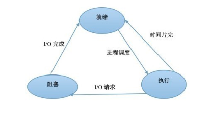

## 一、OSI五层网络模型及七层网络模型

在因特网中，涉及两个或多个远程通信实体的所有活动都受协议的制约。

### 五层模型体系结构：

为了给网络协议的设计提供一个结构，网络设计者以分层的方式组织协议和实现协议的硬件和软件。且每一层具有的协议被称为**协议栈**（protocol stack）。因特网地协议栈由五个层次组成，**自顶向下**(top-down)分别为：

#### 1. 应用层（软件）

- 应用层的分组称为**报文**。

- 应用层协议分布在多个端系统上，端系统之间的应用程序使用协议交换报文。

- 应用层包括许多协议：HTTP（WEB文档的请求和传送），SMTP（电子邮件），FTP（端系统间文件传送）。

#### 2. 传输层（软件）

* 运输层的分组称为**报文段**(segment)。
* 负责向两个主机中进程之间的通信提供服务,在应用程序端口之间运输应用层报文。

- 为上一层载荷套接端口信息。
- 两种运输协议：
- **TCP：**
  - 向应用程序提供面向连接的服务，包括应用层报文向目的地的准确传递和流量控制。
  - 通过三次握手，四次挥手建立或断开连接。可靠传输、速度相比UDP慢。
  - 将长报文划分为短报文。
  - 提供拥**塞控制机制**（网络拥塞时，抑制其传输速率）。
- **UDP：**
  - 向应用程序提供无连接式服务，不提供不必要服务。
  - 无可靠性，无流量控制和拥塞控制，速度快。

#### 3. 网络层（硬件软件混合）

+ 网络层的分组称为**数据报**（datagram）。

- 负责给分组提供不同主机之间提供通信服务。

- 协议：IP 网际协议，ICMP 控制报文协议，IGMP 组管理协议，ARP 地址解析协议，RARP反向地址转换协议
- ICMP 控制报文协议：主要用在主机与路由器之间传递控制信息，包括报告错误、交换受限控制和状态信息。
  + ping 用来测试网络可达性。
  + tracert 用来显示到达目的主机的路径
- ARP 地址解析协议：**是网络层的协议，但是它所工作的内容是链路层的。**
- IGMP 组管理协议：是因特网协议家族中的一个组播协议。该协议运行在主机和组播路由器之间。
  - **单播(unicast):** 是指封包在计算机网络的传输中，目的地址为单一目标的一种传输方式。
  - **组播(multicast):** 也叫多播， 多点广播或群播。 指把信息同时传递给一组目的地址。它使用策略是最高效的，因为消息在每条网络链路上只需传递一次，而且只有在链路分叉的时候，消息才会被复制。
  - **广播(broadcast):**是指封包在计算机网络中传输时，目的地址为网络中所有设备的一种传输方式。实际上，这里所说的“所有设备”也是限定在一个范围之中，称为“广播域”。
- RARP反向地址转换协议：允许局域网的物理机器从[网关](https://baike.baidu.com/item/网关/98992)服务器的 ARP 表或者缓存上请求其 IP 地址。
- 为上一层载荷套接IP信息。

#### 4. 链路层（硬件)

- 链路层分组称为**帧**(frame)。
- ARP协议在这里工作，根据上一层header里面的IP解析出MAC地址，并套接。
- 将分组从一个节点（主机或路由器）移动到路径上的下一个节点，网络层必须依靠链路层的服务。
- 两个主机之间的数据传输，总是在一段一段的链路上传送的，也就是说，在两个相邻结点之间传送数据是直接传送的(点对点)，这时就需要使用专门的链路层的协议。
- 链路层包括以太网，WiFi和电缆接入网的DOCSIS协议。

#### 5. 物理层

+ 物理层分组为**比特(bit)**。

- 物理层的任务是将链路层传递的帧中的一个个**比特**从一个节点移动到下一个节点，物理层协议依旧与链路相关，且与链路的实际传输媒体（网线、光纤）有关。

### OSI模型

OSI（Open System Interconnection)参考模型是国际标准化组织（ISO）制定地一个用于计算机或通信系统间互联地标准体系，一般被称为**OSI参考模型**或者**七层模型**。

OSI模型层是自底向上的，即第一层是物理层，第七层是应用层。

OSI模型自上而下分别为应用层、表示层、会话层、运输层、网络层、链路层和物理层。除了表示层和会话层，其他五层与因特网五层模型中地对应层功能相同，所以再补充以下表示层和会话层的功能。

### 表示层

使通信的应用程序能够解释交换数据地含义，包括数据压缩，数据加密和数据描述。

### 会话层

提供数据交换的定界和同步功能，包括建立检查点和恢复方案地方法。

### 报文封装

**封装**(encapsulation)：

- 在发送主机端，一个**应用层报文**(application-layer message)被传送给传输层，传输层收到之后，在报文首部附上首部信息，这个首部信息会被接收端的传输层使用。应用层报文和运输层首部信息一起构成了**运输层报文段**(transport-layer segment)，也就是说运输层封装了应用层报文。

- 同理：运输层则向网络层传递报文段，网络层又类似地在其首部添加注入源和目的端系统地址等网络层首部信息，生成**网络层数据报**(network-layer-datagram)。

- 继续向下，数据包被传递给链路层，链路层继续加上链路层地首部信息，生成**链路层帧**(link-layer-frame)。

**总结**：

- 在每一层地分组都具有两种类型地字段：**首部字段**和**有效载荷字段**(payload field)，所谓<u>有效载荷就是上一层地分组</u>。
- 接收端反向对封装进行重构，一层一层去掉首部信息，以接收原信息。
- 分组：每一层封装并发送/接受包的大小是有限的，所以传输过程中会不断的分组成一个个数据单元来传输。

### 三次握手、四次挥手

**三次握手**

1. 建立连接通常由client发起。
2. 握手过程：
   1. 客户端向服务端发送SYN建链请求报文。
   2. 服务端收到消息后，向客户端发送ASK确认报文，完成客户端到服务端的链接建立。
   3. 服务端继续向客户端发送SYN建链请求报文，请求向客户端发送消息
   4. 客户端收到消息后，向服务暖发送ASK确认报文，完成服务端到客户端的链接建立。
3. 握手过程中2和3都是从服务端到客户端发送消息，故合并到一起。由此产生了三次握手。
4. TCP链接是双向链接，称之为全双工（单工：只能从一端到另一端；半双工：双端通信，但不能同时进行）。

**四次挥手**

1. 断开连接可以由server和client发起。

2. 挥手过程：
    1. A端向B端发送FIN结束报文，等待关闭。
    2. B端收到FIN报文后，向A端发送ASK确认报文。A端到B端的链接关闭。
    3. B端向A端发送FIN结束报文，等待关闭。
    4. A端收到FIN报文后，向B端发送ASK确认报文。B端到A端的链接关闭。
3. 挥手过程中，A端到B端的链接断开后，B端仍然可以继续处理未完成的任务并继续给A端发送消息，并不会同步断开连接。因此断开连接是四次挥手。


## 二、操作系统基础概念

- 定义：
  - 操作系统位于应用软件和硬件设备之间，本质上也是一个软件，由系统内核(管理所有硬件资源)与系统接口(提供给程序员使用的接口)组成。

- 操作系统分类：
  - **多道操作系统：**多道技术的实现是为了解决多个程序竞争或者说共享同一个资源（比如cpu）的有序调度问题，以提高计算机硬件在时间和空间上的复用率。
    - **空间上的复用**：将内存分为几部分，每个部分放入一个程序，这样，同一时间内存中就有了多道程序。
    - **时间上的复用**：当一个程序在等待I/O时，可以切换到另一个程序继续使用cpu。
  - **分时操作系统：**分时操作系统是使一台[计算机](https://baike.baidu.com/item/计算机/140338)采用[时间片轮转](https://baike.baidu.com/item/时间片轮转/7256857)的方式同时为几个、几十个甚至几百个用户服务的一种操作系统。
    - **时间片：**是把计算机的系统资源（尤其是 CPU时间）进行时间上的分割，每个时间段称为一个时间片，每个进程依次轮流使用时间片。
  - **实时操作系统：**实时操作系统（RTOS）是指当外界事件或数据产生时，能够接受并以足够快的速度予以处理，其处理的结果又能在规定的时间之内来控制生产过程或对处理系统做出快速响应，调度一切可利用的资源完成实时任务，并控制所有实时任务协调一致运行的操作系统。提供及时响应和高可靠性是其主要特点。
- 编程相关概念：
  - **进程：** 进程就是运行中的程序。
    - 需要占用计算机物理资源，程序启动时，由操作系统调度分配。
    - 是计算机中最小的资源分配单位。即想要分配计算机的物理资源，至少得是一个完整的进程。
    - 进程创建时都有一个唯一标识PID。
    - 进程之间可以共用CPU资源；但内存资源是严格区分并隔离，互不干扰。父子进程间亦是如此。
    - 父进程负责开启和回收子进程的资源。
  - **线程：**是操作系统能够进行运算调度的最小单位。
    - 它被包含在进程之中，是进程中的实际运作单位。可以理解进程是CPU为程序分配了一间办公室，而线程才是办公室中真正干活的，所以线程之间是共享进程资源的。
    - 计算机具体执行编译后的计算机指令就是在线程中进行。
    - 一条线程指的是进程中一个单一顺序的控制流，一个进程中可以并发多个线程，每条线程并行执行不同的任务。一个进程中至少有一个线程。
  - **同步：**
    - 在做A事件的时候，发起B事件，必须等待B事件完成之后才能继续执行A事件。
  - **异步：**
    - 在做A事件的时候，发起B事件，不必等待B事件完成，而同时执行A事件。
  - **并发：**
    - 在单一的CPU上，同时运行多个计算机程序。
    - 宏观上：多个程序是同时运行的。
    - 微观上：多个程序在CPU上按时间片的时间轮流执行，本质上是串行。
  - **并行：**
    - 多个CPU同时运行多个程序，互不干扰。
  - **阻塞：**
    - 进程占用CPU，但是CPU并没有进行运算工作。
  - **非阻塞：**
    - 进程占用CPU，CPU在进行运算工作。
  - **同步阻塞：**
    - 调用一个操作时，需要等待执行结果，在这个过程中CPU处于空闲状态。
    - 场景：input、sleep、本地IO、网络IO、网络编程中的recv、recvfrom等。
  - **同步非阻塞：**
    - 调用一个操作时，需要等待执行结果，在这个过程中CPU处于工作状态。
    - 场景：eval("1+2+3")、等待函数执行结果。
  - **异步非阻塞：**
    - 调用一个操作时，不需要等待执行结果，过程中CPU切换到其他程序继续工作，等当前操作执行完成时再切换回来。
    - 场景：进程、线程、协程的并发。
  - **异步阻塞：**
    - 调用多个异步操作，需要等待执行结果，但是不明确要等待哪个操作的结果，CPU在调用操作完成后处于空闲状态。
    - 场景：并发场景下等待IO操作等。


## 三、进程状态及算法

- **进程状态：**在三态模型中，进程状态分为三个基本状态，即运行态，就绪态，阻塞态。在五态模型中，进程分为新建态、终止态，运行态，就绪态，阻塞态。
  - **新建态：**新建态对应于进程刚刚被创建的状态，创建1个进程要通过两个步骤，首先，是为一个新进程创建必要的管理信息；然后，让该进程进入就绪态。此时进程将处于新建态，它并没有被提交执行，而是在等待操作系统完成创建进程的必要操作。
  - **终止态：**进程的终止也要通过两个步骤，首先，是等待操作系统进行善后；然后，退出主存。进入终止态的进程以后不再执行，但依然保留在操作系统中等待善后。一旦其他进程完成了对终止态进程的信息抽取之后，操作系统将删除该进程。
  - **运行态：**进程占有处理器正在运行。
  - **就绪态：**进程具备运行条件，等待系统分配处理器以便运行。
  - **阻塞态：**指进程不具备运行条件，正在等待某个事件的完成，比如I/O阻塞时的状态。
- 
- **进程调度算法：**
  - **先来先服务(FCFS)调度算法：**每次调度是从就绪队列中选择一个最先进入该队列的进程，为之分配处理机，使之投入运行。该进程一直运行到完成或发生某事件而阻塞后才放弃处理机。
  - **短任务优先(SPN)：**从就绪就绪队列中选出下一个“CPU执行期最短”的进程，为之分配[处理机](http://baike.baidu.com/view/2107226.htm)。
  - **时间片轮转法：**从就绪队列中依次执行进行，执行时间为一个时间片。
  - **多级反馈队列调度算法：**用户体验更好。
    - 设置多个就绪队列，并为各个队列赋予不同的优先级。在优先权越高的队列中， 为每个进程所规定的执行时间片就越小。
    - 当一个新进程进入内存后，首先放入第一队列的末尾，按FCFS原则排队等候调度。
    - 仅当第一队列空闲时，调度程序才调度第二队列中的进程运行。如果此时有新进程进入第一队列，则会立即终止当前运行中的第二队列进程，去执行第一队列的进程。


## 四、进程间通讯有哪些方式

> 进程间通信（IPC，InterProcess Communication）是指在不同进程之间传播或交换信息。

- **管道：**管道可以分为两类：匿名管道和命名管道。

  - 常见的Linux命令 "|" 其实就是匿名管道，表示把一个进程的输出传输到另外一个进程，如：

    ```shell
    echo "Happyjava" | awk -F 'j' '{print $2}'
    # 输出 ava
    ```

  - 另外，我们可以通过 mkfifo <pipename> 命令创建一个命名管道，如：

    ```shell
    mkfifo pipe
    # 一个进程往管道输入数据，则会阻塞等待别的进程从管道读取数据：
    # 如果我另外一个窗口没有执行 cat < pipe 命令，则左边的窗口（echo 'Happyjava' > pipe）会一直阻塞。
    ```

- **共享内存：**系统加载一个进程的时候，分配给进程的内存并不是实际物理内存，而是虚拟内存空间。那么我们可以让两个进程各自拿出一块虚拟地址空间来，然后映射到相同的物理内存中，这样，两个进程虽然有着独立的虚拟内存空间，但有一部分却是映射到相同的物理内存，这就完成了内存共享机制了。

- **信号量：**信号量的本质就是一个计数器，用来实现进程之间的互斥与同步。例如信号量的初始值是 1，然后 a 进程来访问**内存1**的时候，我们就把信号量的值设为 0，然后进程b 也要来访问**内存1**的时候，看到信号量的值为 0 就知道已经有进程在访问**内存1**了，这个时候进程 b 就会访问不了**内存1**。

- **socket：**基于socket实现进程间的通信。

- **消息中间件：**基于网络通信实现，常见的中间件：memchace、redis、rabbitmq、kafka等。

- **消息队列：**是消息的链接表，存放在内核中。一个消息队列由一个标识符（即队列ID）来标识。
  - 消息队列是面向记录的，其中的消息具有特定的格式以及特定的优先级。
  - 消息队列独立于发送与接收进程。进程终止时，消息队列及其内容并不会被删除。
  - 消息队列可以实现消息的随机查询,消息不一定要以先进先出的次序读取，也可以按消息的类型读取。


## 五、I/O模式

详见 有道云笔记：[IO模式](https://note.youdao.com/s/TLtzcC5e)


## 六、CGI、WSGI、ASGI、UWSGI

- **CGI（Common Gateway Interface，通用网关接口）：**

  定义客户端与Web服务器的交流方式的一个程序，例如正常情况下客户端发送过来一个请求，根据HTTP协议Web服务器将请求的内容解析出来，经过处理会后，再将返回的内容封装好。例如服务器返回一个HTML页面，并且根据HTTP协议构建返回内容的响应格式，涉及到TCP连接、HTTP原始请求和相应格式都是由一个软件来完成，这个程序就是CGI。

- **WSGI（Python Web Server Gateway Interface，WSGI）：**

  Web服务器网关接口，是为Python语言定义的Web服务器和Web应用程序或框架之间的联系，一个简单而且通用的接口， 从语义上理解，WSGI为了解决Web服务器与客户端之间的通信问题而产生的。并且WSGI是基于现存的CGI标准而设计的。

- **ASGI：**

  是异步网关协议接口,介于网络服务和python应用之间的标准接口,能够处理多种通用的协议类型,包括http,http2和websocket。

- **WSGI和ASGI的区别：**

  WSGI是基于http协议模式开发的,不支持websocket,而ASGI的诞生解决了python中的WSGI不支持当前的web开发中的一些新的协议标准,同时ASGI支持原有模式和Websocket的扩展, 即ASGI是WSGI的扩展.

- **uWSGI:**

  uWSGI是一个Web服务器，它实现了WSGI协议、uwsgi、http等协议。Nginx中HttpUwsgiModule的作用是与uWSGI服务器进行交换。

  要注意 WSGI / uwsgi / uWSGI 这三个概念的区分。

  - WSGI是一种通信协议。
  - uwsgi是一种线路协议而不是通信协议，在此常用于在uWSGI服务器与其他网络服务器的数据通信。
  - 而uWSGI是实现了uwsgi和WSGI两种协议的Web服务器。

  uwsgi协议是一个uWSGI服务器自有的协议，它用于定义传输信息的类型（type of information），每一个uwsgi packet前4byte为传输信息类型描述，它与WSGI相比是两样东西。

