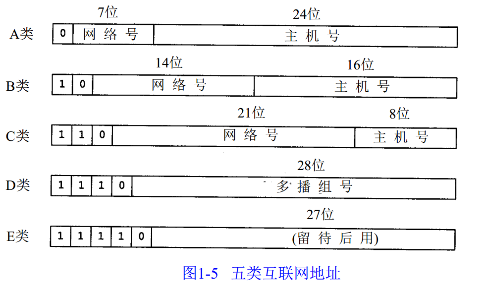
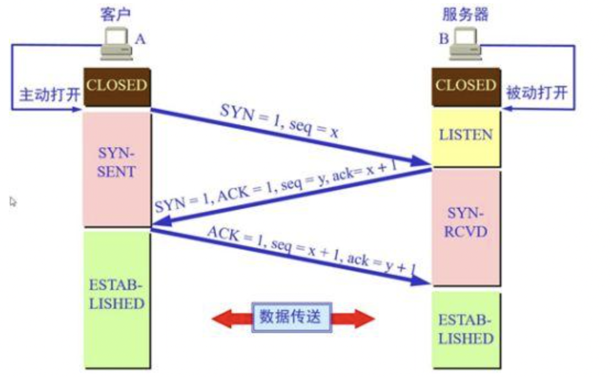
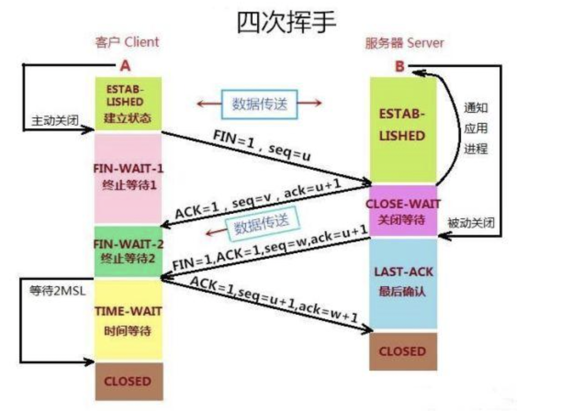
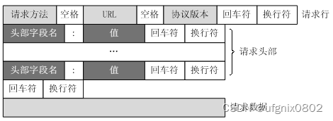
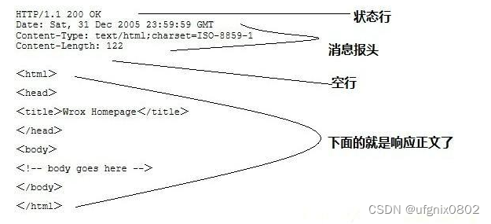
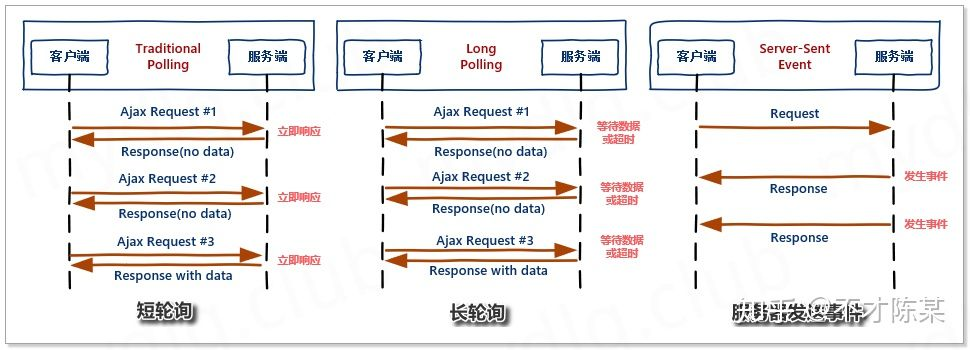
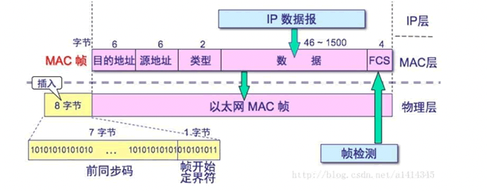
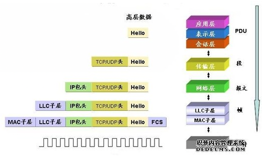

# 相关概念

## 域名和端口

### 域名

**域名**（英语：Domain Name），又称网域，是由一串用点分隔的名字组成的 互联网 上某一台 计算机 或 计算机组 的名称，用于在 数据传输 时对计算机的定位标识（有时也指地理位置）。 

由于 IP地址 不方便记忆并且不能显示地址组织的名称和性质，人们设计出了域名，并通过 域名系统（DNS，Domain Name System）来将域名和IP地址相互映射，使人更方便地访问互联网，而不用去记住能够被机器直接读取的IP地址数串。


### DNS

**域名系统**（英文：**D**omain **N**ame **S**ystem，缩写：**DNS**）是互联网的一项服务，是进行域名(domain name)和与之相对应的 IP地址 (IP address)转换的服务器。DNS中保存了一张域名(domain name)和与之相对应的IP地址 (IP address)的表，以解析消息的域名。

**公共DNS列表**

| Google DNS  | 8.8.8.8,8.8.4.4                                              |
| ----------- | ------------------------------------------------------------ |
| Public DNS+ | 119.29.29.29                                                 |
| 阿里 DNS    | 223.6.6.6,223.5.5.5                                          |
| 百度 DNS    | 180.76.76.76                                                 |
| 360 DNS     | 电信：101.226.4.6 联通：123.125.81.6 移动：101.226.4.6 铁通：101.226.4.6 |
| OpenDNS     | 208.67.220.220                                               |
| 114DNS      | 114.114.114.114,114.114.115.115                              |


### 端口

端口（port）用于标识计算机上某个特定的网络程序的访问入口。

表示形式：以整数形式，两个字节表示。范围 0 ~ 65535

**注意：**

1. 0 ~ 1024 已被系统占用，编程时尽量不要使用这部分端口
2. 常见应用使用的端口信息：
    1. ssh 22
    2. ftp 21
    3. smtp 25
    4. http 80
    5. https 443
    6. tomcat 8080
    7. mysql 3306


## IP地址

IP地址是 IP协议 提供的一种统一的 地址格式，它为互联网上的每一个网络和每一台 主机 分配一个 逻辑地址 ，以此来屏蔽 物理地址（MAC地址）的差异。


### 公网和私网

**公网：**

指以公网连接Internet上的非保留地址。由InterNIC负责。这些IP地址分配给注册并向InterNIC提出申请的组织机构。通过直接访问互联网。全世界公网IP是唯一的，在Internet上的其他计算机可以随意地相互访问。

**私网：**

是在本地局域网上的IP。私有网络地址不能出现在公共网络上，只能在内部网络中使用。所有路由器不能发送目标地址为私有网络地址的数据报。内部IP地址必须通过NAT（Network Address Translation）转换成公网上可用的IP地址，才能实现内部IP地址与外部公网的通信。随着私有IP网络的发展，为节省可分配的注册IP地址，有一组IP地址被拿出来专门用于私有IP网络。我们从三个主要类型的IP地址里，各保留了一个区域作为私有地址的专用网络，详见 IP地址分类。


### IP地址分类

IP地址由四段组成，每个字段是一个字节，8位，最大值是255。

IP地址由两部分组成，即 网络地址 和 主机地址 。网络地址表示其属于互联网的哪一个网络，主机地址表示其属于该网络中的哪一台主机。二者是主从关系。

> 网络地址（Network address）是互联网上的节点在网络中具有的逻辑地址，可对节点进行寻址。拥有相同 网络地址 的主机，表示他们在同一网段；
>
> 主机地址 就是当前 主机在网段中的逻辑地址。

IP地址的四大类型标识的是网络中的某台主机。IPv4的地址长度为32位，共4个字节，但实际中我们用[点分十进制](http://baike.baidu.com/view/828066.htm)记法。




**IP地址根据网络号和主机号来分，分为A、B、C三类及特殊地址D、E。  全0和全1的都保留不用。**

- **A类：**

  (1.0.0.0-126.0.0.0)（默认子网掩码：255.0.0.0或 0xFF000000）第一个字节为网络号，后三个字节为主机号。该类IP地址的最前面为“0”，所以地址的 网络号 取值于**1~126**之间。一般用于大型网络。

  **网络地址取值分析：**

  1. 网络号最小值：0000 0001 => 1，因为全0保留不用；
  2. 网络号最大值：0111 1111 => 127，但是这里还有一个特殊点，那就是 127 网络号也是为专用保留的，比如本机地址：127.0.0.1，所以这里最大值只能取到 126。

- **B类：**

  (128.0.0.0-191.255.0.0)（默认子网掩码：255.255.0.0或0xFFFF0000）前两个字节为网络号，后两个字节为主机号。该类IP地址的最前面为“10”，所以地址的网络号取值于**128.0~191.255**之间。一般用于中等规模网络。

  **网络地址取值分析：**

  1. 网络号最小值：1000 0000 0000 0000 => 128.0  。
  2. 网络号最大值：1011 1111 1111 1111=> 191.255  。

- **C类：**

  (192.0.0.0-223.255.255.0)（子网掩码：255.255.255.0或 0xFFFFFF00）前三个字节为网络号，最后一个字节为主机号。该类IP地址的最前面为“110”，所以地址的网络号取值于**192.0.0~223.255.255**之间。一般用于小型网络。

  **网络地址取值分析：**

  ​	同上。

- **D类：**

  是多播地址。该类IP地址的最前面为“1110”，所以地址的网络号取值于224~239之间。一般用于多路广播用户。

- **E类：**

  是保留地址。该类IP地址的最前面为“1111”，所以地址的网络号取值于240~255之间。


**在IP地址3种主要类型里，各保留了1个区域作为私有地址，其地址范围如下： **

- A类地址：10.0.0.0～10.255.255.255
- B类地址：172.16.0.0～172.31.255.255
- C类地址：192.168.0.0～192.168.255.255


**回送地址：**

127.0.0.1。 也是本机地址，等效于localhost或本机IP。一般用于测试使用。例如：ping 127.0.0.1来测试本机TCP/IP是否正常。


**总结：**

| 类别 | 最大网络数    | IP地址范围                | 单个网段最大主机数 | 私有IP地址范围              |
| ---- | ------------- | ------------------------- | ------------------ | --------------------------- |
| A    | 126(2^7-2)    | 1.0.0.1-126.255.255.254   | 16777214           | 10.0.0.0-10.255.255.255     |
| B    | 16384(2^14)   | 128.0.0.1-191.255.255.254 | 65534              | 172.16.0.0-172.31.255.255   |
| C    | 2097152(2^21) | 192.0.0.1-223.255.255.254 | 254                | 192.168.0.0-192.168.255.255 |

单个网段最大主机个数解析（用A类举例）：

> 一个A类主机地址：121.4.47.229

1. 在一个网段中，将主机号全为0（二进制）的IP地址保留不用，用来表示一个网络地址。这里的 网络地址：121.0.0.0 ；
2. 同时，还将 主机号全为1（二进制）的IP地址作为广播号，即在网络寻址的时候发送广播包的目的IP地址，这个广播号可以让同网段的所有主机都收到广播包。这里的 广播号：121.255.255.255。

所以，最大主机个数：256 * 256 * 256 - 2 = 16777214。

同时，我们习惯将第一个主机地址用作网络的路由地址，这里建议使用的路由地址是：121.0.0.1。


### IP正则

每组数字最大值事255，则考虑以下几种情况：

1. 以25开头时，第三位可以取0～5；
2. 以2开头，第二位取0～4，第三位可以取任意一个数字；
3. 以1开头时，后两位都可以取任意一个数字；
4. 每组数字是1位或者两位；


所以正则表达式如下：

`^((25[0-5]|2[0-4]\d|1\d{2}|\d{1,2})\.){3}(25[0-5]|2[0-4]\d|1\d{2}|\d{1,2})$`


## 网关

网关实质上是一个网络通向其他网络的 IP地址。网关也被称为 IP路由器。

PC本身不具备路由寻址能力，所以PC要把所有的IP包发送到一个默认的中转地址上面进行转发，也就是默认网关。这个网关可以在路由器上，可以在三层交换机上，可以在防火墙上，可以在服务器上，所以和物理的设备无关。

比如：

​		有网络A和网络B，网络A的IP地址范围为“192.168.1.1~192. 168.1.254”，子网掩码为255.255.255.0；网络B的IP地址范围为“192.168.2.1~192.168.2.254”，子网掩码为255.255.255.0。在没有路由器的情况下，两个网络之间是不能进行TCP/IP通信的，即使是两个网络连接在同一台交换机（或集线器）上，TCP/IP协议也会根据子网掩码（255.255.255.0）与主机的IP 地址作 “与” 运算的结果不同判定两个网络中的主机处在不同的网络里。而要实现这两个网络之间的通信，则必须通过网关。如果网络A中的主机发现数据包的目的主机不在本地网络中，就把数据包转发给它自己的网关，再由网关转发给网络B的网关，网络B的网关再转发给网络B的某个主机。


**常见WEB网关接口：**

- **CGI（Common Gateway Interface，通用网关接口）：**

  定义客户端与Web服务器的交流方式的一个程序，例如正常情况下客户端发送过来一个请求，根据HTTP协议Web服务器将请求的内容解析出来，经过处理会后，再将返回的内容封装好。例如服务器返回一个HTML页面，并且根据HTTP协议构建返回内容的响应格式，涉及到TCP连接、HTTP原始请求和相应格式都是由一个软件来完成，这个程序就是CGI。

- **WSGI（Python Web Server Gateway Interface，WSGI）：**

  Web服务器网关接口，是为Python语言定义的Web服务器和Web应用程序或框架之间的联系，一个简单而且通用的接口， 从语义上理解，WSGI为了解决Web服务器与客户端之间的通信问题而产生的。并且WSGI是基于现存的CGI标准而设计的。

- **ASGI：**

  是异步网关协议接口，介于网络服务和python应用之间的标准接口，能够处理多种通用的协议类型，包括http、http2和websocket。

- **WSGI和ASGI的区别：**

  WSGI是基于http协议模式开发的，不支持websocket，而ASGI的诞生解决了python中的WSGI不支持当前的web开发中的一些新的协议标准，同时ASGI支持原有模式和Websocket的扩展，即ASGI是WSGI的扩展。

- **uWSGI:**

  uWSGI是一个Web服务器，它实现了WSGI协议、uwsgi、http等协议。Nginx中HttpUwsgiModule的作用是与uWSGI服务器进行交换。

  要注意 WSGI / uwsgi / uWSGI 这三个概念的区分。

  - WSGI是一种通信协议。
  - uwsgi是一种线路协议而不是通信协议，在此常用于在uWSGI服务器与其他网络服务器的数据通信。
  - 而uWSGI是实现了uwsgi和WSGI两种协议的Web服务器。

  uwsgi协议是一个uWSGI服务器自有的协议，它用于定义传输信息的类型（type of information），每一个uwsgi packet前4byte为传输信息类型描述，它与WSGI相比是两样东西。


## 子网掩码

子网掩码(subnet mask)又叫 网络掩码 、地址掩码 、子网络遮罩，它用来指明一个 IP地址 的哪些位标识的是 主机 所在的子网，以及哪些位标识的是主机的位掩码。子网掩码不能单独存在，它必须结合IP地址一起使用。子网掩码只有一个作用，就是将某个IP地址划分成 **网络地址** 和 **主机地址** 两部分。

子网掩码是一个32位地址，用于屏蔽IP地址的一部分以区别网络标识和主机标识，并说明该IP地址是在[局域网](https://baike.baidu.com/item/局域网/98626)上，还是在[广域网](https://baike.baidu.com/item/广域网/422004)上。

| 类别 | 子网掩码的二进制数值                | 子网掩码的十进制数值 |
| ---- | ----------------------------------- | -------------------- |
| A    | 11111111 00000000 00000000 00000000 | 255.0.0.0            |
| B    | 11111111 11111111 00000000 00000000 | 255.255.0.0          |
| C    | 11111111 11111111 11111111 00000000 | 255.255.255.0        |

子网掩码一定是配合IP地址来使用的。对于常用网络A、 B、C 类IP地址其默认子网掩码的二进制与十进制对应关系如上表所示。子网掩码工作过程是：将32位的 子网掩码 和 IP地址 二进制进行逻辑 “与”（&）运算，得到的就是网络地址。如：192.168.10.11 & 255.255.255.0，结果为192.168.10.0（网络地址），其表达的含义为：该IP地址属于 192.168.10.0这个网络，其主机号为11（主机地址），即该主机在这个网络中编号为11。


**CIDR表示掩码：**

IP地址/ 掩码中1的个数。

例：192.168.1.10/24 就表示该IP的子网掩码中有24个1，就是一个标准的C类IP。


**子网划分：**

子网划分的目的是为了充分利用网段IP，当一个网段中只能使用部分IP时，就可以将当前网段划分为多个子网段。

子网划分内容较多，详见一个优秀的博客：https://blog.51cto.com/u_6930123/2113151


## 网络通信

正常情况下，主机之间要完成相互通信，两台主机必须要在同一网段中。如果两台主机不在同一网段，那么需要 路由器（网关） 转发才能完成通信。

判断 两台主机 是否在同一网段的标准：**两台主机的 网络地址 相同**。

**注意**：当 源主机 判断 目标主机 是否跟自己 在同一网段时，计算 目标主机 的 网络地址时，使用的是自己的 子网掩码 和 目标主机IP 进行 “与” 运算。

**示例：**

```shell
# 两台主机信息
192.168.0.10/24  		# 主机1。子网掩码：255.255.255.0
192.168.10.10/16		# 主机2。子网掩码：255.255.0.0

# ！！！ 错误逻辑 计算 网络地址。 就是 都用各自的 掩码 来计算。
192.168.0.10 & 255.255.255.0 => 192.168.0.0 # 主机1的网络地址
192.168.10.10 & 255.255.0.0 => 192.168.0.0 # 主机2的网络地址
## 上面的计算逻辑，这两台主机是可以直接通信的。但事实并非如此。


# 当 主机1 向 主机2 发送数据时，由 主机1 校验 网络地址。
192.168.0.10 & 255.255.255.0 => 192.168.0.0 # 主机1的网络地址
192.168.10.10 & 255.255.255.0 => 192.168.10.0 # 主机2的网络地址
## 可见 二者网络地址是不相同的，也就不能完成通信。


# 当 主机2 向 主机1 发送数据时，由 主机2 校验 网络地址。
192.168.0.10 & 255.255.0.0 => 192.168.0.0 # 主机1的网络地址
192.168.10.10 & 255.255.0.0 => 192.168.0.0 # 主机2的网络地址
## 可见 此时二者的网络地址相同，可以由 主机2 向 主机1 发送数据包；但当 主机1 想回发时，会发现网络地址是不一样的，也就会导致 主机2 收不到 主机1 的回送。因此在这种情况下，二者仍然是不能建立通信的。
```


## MAC地址

**MAC地址**（**英语：Media Access Control Address）**，直译为**媒体存取控制地址**，也称为**局域网地址**（LAN Address），**MAC位址**，**以太网地址**（Ethernet Address）或**物理地址**（Physical Address），它是一个用来确认网络设备位置的地址。**在 OSI模型 中，第三层网络层负责 IP地址 ，第二层数据链路层则负责 MAC位址。**MAC地址用于在网络中唯一标识一个 网卡，一台设备若有一或多个网卡，则每个网卡都需要并会有一个唯一的MAC地址。

MAC地址也叫物理地址、硬件地址，由网络设备制造商生产时烧录在网卡(Network lnterface Card)的[EPROM](https://baike.baidu.com/item/EPROM/1690813)(一种闪存芯片，通常可以通过程序擦写)。IP地址 与 MAC地址 在计算机里都是以 二进制 表示的，IP地址是32位的，而MAC地址则是48位的。

MAC地址的长度为48位(6个字节)，通常表示为12个16进制数，如：00-16-EA-AE-3C-40 就是一个MAC地址，其中前3个字节，16进制数00-16-EA 代表网络硬件制造商的编号，它由[IEEE](https://baike.baidu.com/item/IEEE/150905)(电气与电子工程师协会)分配，而后3个字节，16进制数 AE-3C-40 代表该制造商所制造的某个网络产品(如网卡)的系列号。只要不更改自己的MAC地址，MAC地址在世界是唯一的。形象地说，MAC地址就如同身份证上的身份证号码，具有唯一性。

**如果目的地址是：FF-FF-FF-FF-FF-FF，则表示当前数据包是一个广播包，广播包的作用主要就是 用 RARP、ARP 两种协议查找目标IP的MAC地址。**


## 冲突域

冲突域是在同一个网络上两个比特同时进行传输则会产生冲突；在网路内部数据分组所产生与发生冲突的这样一个区域称为冲突域，所有的 共享介质 环境都是一个冲突域，在共享介质环境中一定类型的冲突域是正常行为。

用网桥划分多个缆段，多个缆段之间没有冲突，但一个缆段中有冲突（各个缆段中用HUB连接），一个缆段中的一个冲突是一个冲突域，一个冲突域（即同一缆段中的）都能收到所有被发送的帧，因为HUB是完全复制的。

对网络进行分段的原因是：分离流量并创建更小的冲突域来使用户获得更高的 带宽，否则网络很快会被流量所阻塞，**冲突域就是连接在同一导线上的所有工作站的集合**，或者说是同一物理 网段 上所有节点的集合，或 以太网 上竞争同一 带宽 的节点集合。

冲突域 是基于第一层（[物理层](https://baike.baidu.com/item/物理层)）。


## 广播域

广播是信息的一种传播方式，指网络中的某一设备同时向网络中所有的其它设备发送数据，这个数据所能广播到的范围即为广播域(Broadcast Domain)。

简单点说，广播域就是指网络中所有能接收到同样广播消息的设备的集合。而能接收到同样广播消息的设备一定是同一网段的设备。

广播域 是基于第二层（[链路层](https://baike.baidu.com/item/链路层)）。


## ISP

互联网服务提供商（Internet Service Provider），简称ISP，指的是面向公众提供下列信息服务的经营者：

一是接入服务，即帮助用户接入Internet；

二是导航服务，即帮助用户在Internet上找到所需要的信息；

三是信息服务，即建立数据服务系统，收集、加工、存储信息，定期维护更新，并通过网络向用户提供信息内容服务。


## 局域网

局域网（Local Area Network）英文缩写 LAN，指的是一个局域（较小）的地理范围内，一般是方圆几千米以内，将各种计算机，外部设备和数据库等互相联接起来组成的计算机通信网。

无线局域网（Wireless Local Area Network）英文缩写 WLAN。


## 广域网

**广域网**（Wide Area Network，缩写为 WAN），又称**外网**、**公网**。是连接不同地区 局域网 或 城域网 计算机通信的远程网。通常跨接很大的物理范围，所覆盖的范围从几十公里到几千公里，它能连接多个地区、城市和国家，或横跨几个洲并能提供远距离通信，形成国际性的远程网络。广域网并不等同于 互联网。


## 互联网

互联网（internet），又称国际网络，指的是网络与网络之间所串连成的庞大网络，这些网络以一组通用的协议相连，形成逻辑上的单一巨大国际网络。

通常 **internet** 泛指互联网，而 **Internet** 则特指因特网。


## CDN

CDN的全称是Content Delivery Network，即**内容分发网络**。CDN是构建在现有网络基础之上的智能虚拟网络，依靠部署在各地的边缘服务器，通过中心平台的负载均衡、内容分发、调度等功能模块，使用户就近获取所需内容，降低网络拥塞，提高用户访问响应速度和命中率。CDN的关键技术主要有内容存储和分发技术。

CDN的基本原理是广泛采用各种缓存服务器，将这些缓存服务器分布到用户访问相对集中的地区或网络中，在用户访问网站时，利用全局负载技术将用户的访问指向距离最近的工作正常的缓存服务器上，由缓存服务器直接响应用户请求。

CDN的基本思路是尽可能避开互联网上有可能影响数据传输速度和稳定性的瓶颈和环节，使内容传输的更快、更稳定。通过在网络各处放置节点服务器所构成的在现有的互联网基础之上的一层智能虚拟网络，CDN系统能够实时地根据网络流量和各节点的连接、负载状况以及到用户的距离和响应时间等综合信息将用户的请求重新导向离用户最近的服务节点上。其目的是使用户可就近取得所需内容，解决 Internet网络拥挤的状况，提高用户访问网站的响应速度。


# 网络设备

## 网卡

网卡是一块被设计用来允许计算机在计算机网络上进行通讯的计算机硬件。由于其拥有 MAC地址，因此属于 OSI模型 的第1层和2层之间。它使得用户可以通过电缆或无线相互连接。

每一个网卡都有一个被称为MAC地址的独一无二的48位串行号，它被写在卡上的一块 ROM 中。在网络上的每一个计算机都必须拥有一个独一无二的MAC地址。

**主要功能：**

1. 数据的封装与解封

   发送时将上一层传递来的数据加上首部和尾部，成为以太网的帧。接收时将以太网的帧剥去首部和尾部，然后送交上一层

   物理层是最上层

2. 链路管理

   主要是通过[CSMA/CD](https://baike.baidu.com/item/CSMA%2FCD)（Carrier Sense Multiple Access with Collision Detection ，带[冲突检测](https://baike.baidu.com/item/冲突检测)的[载波监听多路访问](https://baike.baidu.com/item/载波监听多路访问)）协议来实现

3. 数据编码 与 译码

   即[曼彻斯特编码](https://baike.baidu.com/item/曼彻斯特编码)与译码。其中曼彻斯特码，又称数字双向码、相位编码(PE)，是一种常用的二元码线路编码方式之一，被 物理层 使用来编码一个同步位流的时钟和数据。在通信技术中，用来表示所要发送比特 流中的数据与定时信号所结合起来的代码。 常用在 以太网 通信，列车总线控制，工业总线等领域。


## 网线

网线，一般由金属或玻璃制成，它可以用来在网络内传递信息。常用的网络电缆有三种：**双绞线**、**同轴电缆**和**光纤电缆（光纤）**。双绞线是由许多对线组成的数据传输线。它的特点是价格便宜，所以被广泛应用。双绞线是用来和RJ45水晶头相连的，有STP和UTP两种，常用的是UTP。

- **双绞线**

  双绞线（Twisted pair）分为屏蔽（Shielded Twisted pair，简称STP）和非屏蔽（Unshielded Twisted pair，简称UTP）两种。所谓的屏蔽就是指网线内部信号线的外面包裹着一层金属网，在屏蔽层外面才是绝缘外皮，屏蔽层可以有效地隔离外界电磁信号的干扰。

  UTP是目前局域网中使用频率最高的一种网线。这种网线在塑料绝缘外皮里面包裹着8根信号线，它们每两根为一对相互缠绕，总共形成四对，双绞线也因此得名。双绞线这样互相缠绕的目的就是利用铜线中电流产生的电磁场互相作用抵消邻近线路的干扰并减少来自外界的干扰。每对线在每英寸长度上相互缠绕的次数决定了抗干扰的能力和通信的质量，缠绕得越紧密其通信质量越高，可以支持更高的网络数据传送速率，当然它的成本也就越高。

  

- **同轴电缆**

  同轴电缆（Coaxial Cable）是指有两个同心导体，而导体和屏蔽层又共用同一轴心的电缆。由于它在主线外包裹绝缘材料，在绝缘材料外面又有一层网状编织的屏蔽金属网线，所以能很好地阻隔外界的电磁干扰，提高通信质量。

  同轴电缆的优点是可以在相对长的无中继器的线路上支持高带宽通信，而其缺点也是显而易见的：一是体积大，细缆的直径就有3/8英寸粗，要占用电缆管道的大量空间；二是不能承受缠结、压力和严重的弯曲，这些都会损坏电缆结构，阻止信号的传输；三是成本高。而所有这些缺点正是双绞线能克服的，因此在现在的局域网环境中，基本已被基于双绞线的以太网物理层规范所取代。同轴电缆分为细缆和粗缆两种。


- **光纤**

  光纤（Fiber Optic Cable）以光脉冲的形式来传输信号，因此材质也以玻璃或 有机玻璃 为主。它由纤维芯、包层和保护套组成。

  光纤的结构和同轴电缆很类似，也是中心为一根由玻璃或透明塑料制成的光导纤维，周围包裹着保护材料，根据需要还可以多根光纤并合在一根光缆里面。根据光信号发生方式的不同，光纤可分为单模光纤和多模光纤。


## 中继器

中继器（RP repeater）是工作在 物理层 上的连接设备。适用于完全相同的两个网络的互连，主要功能是通过对数据信号的重新发送或者转发，来扩大网络传输的距离。

中继器是 局域网 环境下用来延长网络距离的，但是它属于 网络互联设备，操作在OSI的物理层，中继器对在线路上的信号具有放大再生的功能，用于扩展局域网[网段](https://baike.baidu.com/item/网段/11026985)的长度（仅用于连接相同的局域网网段）。


## 集线器（HUB）

**集线器** 的英文称为`Hub`。`Hub`是“中心”的意思，集线器的主要功能是对接收到的信号进行再生整形放大，以扩大网络的传输距离，同时把所有节点集中在以它为中心的节点上。

`Hub` 工作于OSI参考模型第一层，即“物理层”。集线器与网卡、网线等传输介质一样，属于局域网中的基础设备，采用 CSMA/CD（即带冲突检测的载波监听多路访问技术)介质访问控制机制。**集线器每个接口简单的收发比特，收到1就转发1，收到0就转发0，不进行碰撞检测。**

集线器（hub）属于 **纯硬件** 网络底层设备，不具有类似于交换机的 "智能记忆" 能力和 "学习" 能力，也不具备交换机所具有的MAC地址表，所以<font color="red">它发送数据时都是没有针对性的，采用广播方式发送。也就是说当它要向某节点发送数据时，不是直接把数据发送到目的节点，而是把数据包发送到与集线器相连的所有节点。</font>

HUB是一个多端口的转发器，当以HUB为中心设备时，网络中某条线路产生了故障，并不影响其它线路的工作。所以HUB在局域网中得到了广泛的应用。大多数的时候它用在星型与树型网络拓扑结构中，以RJ45接口与各主机相连（也有[BNC接口](https://baike.baidu.com/item/BNC接口)）。

HUB 是半双工通信。


## 网桥

网桥（Bridge）是 **早期** 的两端口二层网络设备。网桥的两个端口分别有一条独立的交换信道，不是共享一条背板总线，可隔离冲突域。网桥比集线器（Hub）性能更好，集线器上各端口都是共享同一条背板总线的。**后来，网桥被具有更多端口、同时也可隔离冲突域的交换机（Switch）所取代。**

网桥（Bridge）像一个聪明的中继器。中继器从一个网络电缆里接收信号，放大它们，将其送入下一个电缆。相比较而言，网桥对从关卡上传下来的信息更敏锐一些。网桥是一种对 **帧** 进行转发的技术，根据MAC分区块，可隔离碰撞。网桥将网络的同一网段在[数据链路层](https://baike.baidu.com/item/数据链路层/4329290)连接起来，只能连接同构网络(同一网段)，不能连接异构网络（不同网段）。

网桥也叫桥接器，是连接两个局域网的一种存储/转发设备，它能将一个大的LAN分割为多个网段，或将两个以上的LAN互联为一个逻辑LAN，使LAN上的所有用户都可访问服务器。

**扩展局域网最常见的方法是使用网桥。最简单的网桥有两个端口，复杂些的网桥可以有更多的端口。网桥的每个端口与一个网段相连。**


## 交换机

交换机（Switch）意为 “ 开关 ” 是一种用于电（光）信号转发的 网络设备。它可以为接入交换机的任意两个 网络节点 提供独享的电信号通路。最常见的交换机是 **以太网交换机**。其他常见的还有电话语音交换机、光纤交换机 等。

交换机工作于OSI参考模型的 第二层，即 [数据链路层](https://baike.baidu.com/item/数据链路层)。交换机内部的CPU会在每个端口成功连接时，通过将MAC地址和端口对应，形成一张MAC表。在今后的通讯中，发往该MAC地址的数据包将仅送往其对应的端口，而不是所有的端口。因此，**交换机可用于划分数据链路层广播，即冲突域；但它不能划分网络层广播，即广播域。**

**交换机工作原理：**

1. 交换机拥有一条很高 带宽 的背部 **总线** 和内部 **交换矩阵**。交换机的所有的端口都挂接在这条背部总线上，控制电路收到数据包以后，处理端口会查找内存中的地址对照表以确定 目的MAC地址（[网卡](https://baike.baidu.com/item/网卡)的硬件地址）的[NIC](https://baike.baidu.com/item/NIC)（网卡）挂接在哪个端口上，通过内部交换矩阵迅速将数据包传送到目的端口，**目的MAC地址 若不存在，则先广播到所有的端口，接收端口回应后交换机会“学习”新的MAC地址，并把它添加入内部MAC地址表中。**
2. 使用交换机也可以把网络“分段”，通过对照IP地址表，交换机只允许必要的 网络流量 通过交换机。通过交换机的过滤和转发，可以有效的减少冲突域。即交换机可以将两个不同网段的局域网隔离开来，不会允许一个网段的数据包发送到另一个网段。


**交换机的特点：**

1. 以太网交换机的每个端口都直接与主机相连，并且通信一般都采用 全双工方式。
2. 交换机能同时连通许多对的端口，使每一对相互通信的主机都能像独占通信媒体那样，进行无冲突地传输数据。
3. 用户独占传输媒体的带宽，若一个接口到主机的带宽是10Mbit每秒，那么有10个接口的交换机的总容量是100Mbit每秒。这是交换机的最大优点。


交换机是全双工通信。


## 路由器

路由器（Router）是连接两个或多个网络（一个网段组成的局域网理解为一个网络）的硬件设备，在网络间起**网关**的作用，是读取每一个数据包中的地址然后决定如何传送的专用智能性的网络设备。

路由器又可以称之为网关设备。路由器就是在OSI/RM中完成的[网络层](https://baike.baidu.com/item/网络层/4329439)中继以及第三层中继任务，对不同的网络之间的[数据包](https://baike.baidu.com/item/数据包/489739)进行存储、分组转发处理，其主要就是在不同的逻辑分开网络。

**原理：**

网络中的设备相互通信主要是用它们的 IP地址，路由器只能根据具体的IP地址来转发数据。

IP地址由网络地址和主机地址两部分组成。在Internet中采用的是由子网掩码来确定网络地址和主机地址。

子网掩码与IP地址一样都是32位的，并且这两者是一一对应的，子网掩码中 `1` 对应IP地址中的网络地址，`0` 对应的是主机地址，网络地址和主机地址就构成了一个完整的IP地址。

在同一个网络中，IP地址的**网络地址必须是相同的（这就是同一个网段）**。计算机之间的通信只能在具有相同 网络地址 的IP地址之间进行，如果想要与其他网段的计算机进行通信，则必须经过路由器转发出去。不同网络地址的IP地址是不能直接通信的，即便它们距离非常近，也不能进行通信。

路由器的多个端口可以连接多个网段，<font color="red">**路由器的 每个端口的IP地址的 网络地址 都必须与所连接的 网段 的网络地址一致（路由器的端口也是有 IP地址的）。**</font>不同的端口它的网络地址是不同的，所对应的网段也是不同的，这样才能使各个网段中的主机通过自己网段的IP地址把数据发送到路由器上。

> 所以，不同网段的 计算机通信，都是先将 **数据报** 发送到路由器，再由路由器转发到其他网段。


# 网络协议

## IP

IP是Internet Protocol（网际互连协议）的缩写，是 TCP/IP 体系中的网络层协议。IP是整个TCP/IP协议族的核心，也是构成互联网的基础。

IP所提供的服务大致可归纳为两类：IP信息包的传送、IP信息包的分割与重组。

**IP信息包传送**

IP是网络之间信息传送的协议，可将IP信息包从源设备传送到目的设备。为了达到这样的目的，IP必须依赖IP地址与IP路由器两种机制来实现。

- **IP地址**

  IP规定网络上所有的设备都必须有一个独一无二的IP地址，就好比是邮件上都必须注明收件人地址，邮递员才能将邮件送到。同理，每个IP信息包都必须包含有目的设备的IP地址，信息包才可以正确地送到目的地。同一设备不可以拥有多个IP地址，所有使用IP的网络设备至少有一个唯一的IP地址。

- **IP路由**

  互联网是由许多个网络连接所形成的大型网络。如果要在互联网中传送IP信息包，除了确保网络上每个设备都有一个唯一的IP地址之外，网络之间还必须有传送的机制，才能将IP信息包通过一个个的网络传送到目的地。此种传送机制称为IP路由。

  各个网络通过路由器相互连接。路由器的功能是为IP信息包选择传送的路径。换言之，必须依靠沿途各路由器的通力合作，才能将IP信息包送到目的地。在IP路由的过程中，由路由器负责选择路径，IP信息包则是被传送的对象。


**IP信息包的分割与重组**

IP信息包在传送过程中，可能会经过许多个使用不同技术的网络。假设IP信息包是从ATM网络所发出，原始长度为9180B，如果IP路由途中经过以太网络，便面临信息包太大，无法在以太网络上传输的障碍。为了解决此问题，路由器必须有IP信息包分割与重组的机制，将过长的信息包进行分割，以便能在最大传输单位较小的网络上传输。分割后的IP信息包，由目的设备接收后重组，恢复成原来IP信息包。


## CSMA/CD

CSMA/CD（Carrier Sense Multiple Access with Collision Detection，载波侦听多路访问/冲突检测协议），早期主要是以太网络中数据传输方式，广泛应用于以太网中。

载波侦听（Carrier Sense），意思是网络上各个工作站在发送数据前，都要确认总线上有没有数据传输。若有数据传输（称总线为忙），则不发送数据；若无数据传输（称总线为空），立即发送准备好的数据。

- 如果两个站点都检测到信道是空闲的，并且同时开始传送数据，那么这几乎会立即导致冲突。

  

多路访问（Multiple Access），意思是网络上所有工作站收发数据，共同使用同一条总线，且发送数据是广播式。

冲突检测（Collision Detection），是指发送结点在发出信息帧的同时，还必须监听媒体，判断是否发生冲突（同一时刻，有无其他结点也在发送信息帧）。


## ARP

地址解析协议，即**ARP（Address Resolution Protocol）**，**是根据 IP地址 获取 物理地址 的一个 TCP/IP协议**。**是网络层的协议，但是它所工作的内容是链路层的。**

主机 发送信息时将包含目标IP地址的ARP请求广播到局域网络上的所有主机，并接收返回消息，以此 确定目标的物理地址；收到返回消息后将该IP地址和物理地址存入本机ARP缓存中并保留一定时间，下次请求时直接查询ARP缓存以节约资源。

地址解析协议是建立在网络中各个主机互相信任的基础上的，局域网络上的主机可以自主发送ARP应答消息，其他主机收到应答报文时不会检测该报文的真实性就会将其记入本机ARP缓存；由此攻击者就可以向某一主机发送伪ARP应答报文，使其发送的信息无法到达预期的主机或到达错误的主机，这就构成了一个 **ARP欺骗**。

> **ARP欺骗**（英语：**ARP spoofing**），又称**ARP毒化**（**ARP poisoning**，网络上多译为**ARP病毒**）或**ARP攻击**，是针对 以太网 地址解析协议（ARP）的一种攻击技术，通过欺骗局域网内访问者PC的网关MAC地址，使访问者PC错以为攻击者更改后的MAC地址是网关的MAC，导致网络不通。此种攻击可让攻击者获取 局域网 上的数据包甚至可篡改数据包，且可让网络上特定计算机或所有计算机无法正常连线。


## RARP

反向地址转换协议（RARP：Reverse Address Resolution Protocol） 反向地址转换协议（RARP）允许局域网的物理机器从[网关](https://baike.baidu.com/item/网关/98992)服务器的 ARP 表或者缓存上请求其 IP 地址。

RARP与ARP的工作方式相反。

工作原理：

1. 发送主机发送一个本地的RARP广播，在此广播包中，声明自己的MAC地址并且请求任何收到此请求的RARP服务器分配一个IP地址；
2. 本地网段上的RARP服务器收到此请求后，检查其RARP列表，查找该MAC地址对应的IP地址；
3. 如果存在，RARP服务器就给源主机发送一个响应数据包并将此IP地址提供给对方主机使用；
4. 如果不存在，RARP服务器对此不做任何的响应；
5. 源主机收到从RARP服务器的响应信息，就利用得到的IP地址进行通讯；如果一直没有收到RARP服务器的响应信息，表示初始化失败。


## PPP

点对点协议（Point to Point Protocol，PPP）是为在同等单元之间传输数据包这样的简单链路设计的链路层协议。

PPP 封装 提供了不同网络层协议同时在同一链路传输的 多路复用技术。它不仅仅提供帧定界，而且提供协议标识和位级完整性检查服务。

为了建立点对点链路通信，PPP 链路的每一端，必须首先发送 LCP 包以便设定和测试数据链路。在链路建立后，LCP 所需的可选功能被选定之后，PPP 必须发送 NCP 包以便选择和设定一个或更多的网络层协议。一旦每个被选择的网络层协议都被设定好了，来自每个网络层协议的数据报就能在链路上发送了。

> 链路控制协议（LCP）：一种扩展链路控制协议，用于建立、配置、测试和管理数据链路连接
>
> 网络控制协议（NCP）：协商该链路上所传输的数据包格式与类型，建立、配置不同的网络层协议

链路将保持通信设定不变，直到有 LCP 和 NCP 数据包关闭链路，或者是发生一些外部事件的时候。


## ICMP

ICMP（Internet Control Message Protocol）Internet控制报文协议。它是[TCP/IP协议簇](https://baike.baidu.com/item/TCP%2FIP协议簇)的一个子协议，用于在 IP主机、路由器 之间传递控制消息。**控制消息是指 网络通不通、主机是否可达、路由是否可用 等网络本身的消息。**这些控制消息虽然并不传输用户数据，但是对于用户数据的传递起着重要的作用。

+ ping 用来测试网络可达性。

+ tracert 用来显示到达目的主机的路径。

  

## IGMP

Internet 组管理协议称为IGMP协议（Internet Group Management Protocol），是因特网协议家族中的一个组播协议。该协议运行在主机和组播路由器之间。

IGMP提供了在转发组播数据包到目的地的最后阶段所需的信息，实现如下双向的功能：

1、主机通过IGMP通知路由器希望接收或离开某个特定组播组的信息。

2、路由器通过IGMP周期性地查询局域网内的组播组成员是否处于活动状态，实现所连网段组成员关系的收集与维护。


**扩展：**

- **单播(unicast):** 是指封包在计算机网络的传输中，目的地址为单一目标的一种传输方式。
- **组播(multicast):** 也叫多播， 多点广播或群播。 指把信息同时传递给一组目的地址。它使用策略是最高效的，因为消息在每条网络链路上只需传递一次，而且只有在链路分叉的时候，消息才会被复制。
- **广播(broadcast):** 是指封包在计算机网络中传输时，目的地址为网络中所有设备的一种传输方式。实际上，这里所说的“所有设备”也是限定在一个范围之中，称为“广播域”。


## TCP

传输控制协议（TCP，Transmission Control Protocol）是一种面向连接的、可靠的、基于字节流的传输层通信协议。

当应用层向TCP层发送用于网间传输的、用8位字节表示的数据流，**TCP则把数据流分割成适当长度的报文段**。TCP 以 数据流 形式传输数据，所以 理论上传输大小没有限制。但是，最大传输段大小（MSS）通常受该计算机连接的网络的数据链路层的最大传送单元（MTU）限制。

之后TCP把数据包传给IP层，由它来通过网络将包传送给接收端实体的TCP层。

TCP为了保证报文传输的可靠，就给每个包一个序号，同时序号也保证了传送到接收端实体的包的按序接收。然后接收端实体对已成功收到的字节发回一个相应的确认（ACK）；如果发送端实体在合理的往返时延（RTT）内未收到确认，那么对应的数据（假设丢失了）将会被重传。


### 三次握手

所谓三次握手(Three-way Handshake)，是指建立一个 TCP 连接时，需要客户端和服务器总共发送3个报文。

三次握手的目的是连接服务器指定端口，建立 TCP 连接，并同步连接双方的序列号和确认号，交换 TCP 窗口大小信息。在 socket 编程中，客户端执行 connect() 时。将触发三次握手。



> - 小写的ack代表的是头部的确认号Acknowledge number， 缩写ack，是对上一个包的序号进行确认的号，ack=seq+1。
> - 大写的ACK（*Ack*nowledge character 确认字符），则是 TCP包 首部的标志位，用于标志的 TCP包 是否对上一个包进行了确认操作，如果确认了，则把 ACK标志位 设置成1。
> - 在客户端与服务器端传输的TCP报文中，双方的确认号ack和序号seq的值，都是在彼此ack和seq值的基础上进行计算的，这样做保证了TCP报文传输的连贯性。一旦出现某一方发出的TCP报文丢失，便无法继续"握手"，以此确保了"三次握手"的顺利完成。

握手之前主动打开连接的客户端结束CLOSED阶段，被动打开的服务器端也结束CLOSED阶段，并进入LISTEN阶段。

随后进入 **三次握手**：

1. 首先客户端向服务器端发送一段TCP报文，其中：
   - 标记位为SYN（*Syn*chronize Sequence Numbers 同步序列号），表示 **请求同服务端建立新连接**；
   - 序号为seq=X(X一般为1)；
   - 随后客户端进入SYN-SENT阶段。
2. 服务器端接收到来自客户端的TCP报文之后，结束LISTEN阶段。并返回一段TCP报文，其中：
   - 标记位为SYN和ACK，表示 **ACK 表示确认客户端的报文seq序号有效，服务器能正常接收客户端发送的数据。SYN 表示请求同客户端创建新连接**；
   - 服务端序号为seq=y；
   - 确认号为ack=x+1，表示收到客户端的序号seq并将其值加1作为自己确认号ack的值；
   - 随后服务器端进入SYN-RCVD阶段。
3. 客户端接收到来自服务器端的确认收到数据的TCP报文之后，明确了从客户端到服务器的数据传输是正常的，结束SYN-SENT阶段。并返回最后一段TCP报文。其中：
   - 标志位为ACK，表示 **确认收到服务器端同意连接的信号(即告诉服务器，我知道你收到我发的数据了)**；
   - 序号为seq=x+1，客户端自身的序号自增；
   - 确认号为ack=y+1，表示收到服务器端序号seq，并将其值加1作为自己的确认号ack的值；
   - 客户端进入ESTABLISHED阶段。
   - 服务器收到来自客户端的 **确认收到服务器数据** 的TCP报文之后，明确了从服务器到客户端的数据传输是正常的，结束SYN-RCVD阶段；
   - 服务端进入ESTABLISHED阶段。


**为什么要进行第三次握手：**

1. 为了防止服务器端开启一些无用的连接增加服务器开销；

   > 假设client发出的第一个连接请求报文段并没有丢失，而是在某个网络结点长时间的滞留了，以致延误到连接释放以后的某个时间才到达server。
   >
   > server收到此失效的连接请求报文段后，误认为是client再次发出的一个新的连接请求。于是就向client发出确认报文段，同意建立连接。
   >
   > 假设不采用“三次握手”，那么只要server发出确认，新的连接就建立了。由于现在client并没有发出建立连接的请求，因此不会理睬server的确认，也不会向server发送数据。但server却以为新的运输连接已经建立，并一直等待client发来数据。这样，server的很多资源就白白浪费掉了。

2. 防止已失效的连接请求报文段突然又传送到了服务端，因而产生错误。


**一个TCP连接上可以发送多个http请求，不同的版本这个模式不一样:**

1. HTTP/1.0中这个TCP连接是在http请求创建的时候同步创建的，http请求发送到服务器端，服务器端响应了之后，这个TCP连接就关闭了；

2. HTTP/1.1中可以以某种方式声明这个连接一直保持，一个请求传输完之后，另一个请求可以接着传输。好处是第二个http请求发送就不需要再进行一次 **三次握手**；
3. HTTP/2.0 中同一个TCP连接里还可以并发地传输http请求。


### 四次挥手

所谓的四次挥手即TCP连接的释放(解除)。连接的释放必须是一方主动释放，另一方被动释放。



挥手之前主动释放连接的客户端结束ESTABLISHED阶段。

随后开始 **四次挥手**：

1. 首先客户端想要释放连接，向服务器端发送一段TCP报文，其中：

   - 标记位为FIN，表示 **请求释放连接**；
   - 序号为seq=U；
   - 随后客户端进入FIN-WAIT-1阶段，即半关闭阶段。并且停止在客户端到服务器端方向上发送数据，但是客户端仍然能接收从服务器端传输过来的数据。
     - **注意：**这里不发送的是正常连接时传输的数据，而不是一切数据，所以客户端仍然能发送ACK确认报文。

2. 服务器端接收到从客户端发出的TCP报文之后，确认了客户端想要释放连接，随后服务器端结束ESTABLISHED阶段，进入CLOSE-WAIT阶段(半关闭状态)并返回一段TCP报文，其中：

   - 标记位为ACK，表示 **接收到客户端发送的释放连接的请求**；
   - 序号为seq=V；
   - 确认号为ack=U+1，表示是在收到客户端报文的基础上，将其序号seq值加1作为本段报文确认号ack的值；
   - 客户端收到从服务器端发出的TCP报文之后，确认了服务器收到了客户端发出的释放连接请求，随后客户端结束FIN-WAIT-1阶段，进入FIN-WAIT-2阶段。

   > 前"两次挥手"既让服务器端知道了客户端想要释放连接，也让客户端知道了服务器端了解了自己想要释放连接的请求。于是，可以确认关闭客户端到服务器端方向上的连接了。

3. 服务器端自从发出ACK确认报文之后，经过CLOSED-WAIT阶段，做好了释放服务器端到客户端方向上的连接准备，再次向客户端发出一段TCP报文，其中：

   - 标记位为 FIN 和 ACK，表示 **已经准备好释放连接了**；
   - 序号为seq=W；
   - 确认号为ack=U+1；表示是在收到客户端报文的基础上，将其序号seq值加1作为本段报文确认号ack的值。
   - 随后服务器端结束CLOSE-WAIT阶段，进入LAST-ACK阶段。并且停止在服务器端到客户端的方向上发送数据，但是服务器端仍然能够接收从客户端传输过来的数据。

4. 客户端收到从服务器端发出的TCP报文，确认了服务器端已做好释放连接的准备，结束FIN-WAIT-2阶段，进入TIME-WAIT阶段，并向服务器端发送一段报文，其中：

   - 标记位为ACK，表示 **接收到服务器准备好释放连接的信号**；
   - 序号为seq=U+1，客户端自身的序号自增；
   - 确认号为ack=W+1；表示是在收到了服务器端报文的基础上，将其序号seq值 加1 作为本段报文确认号的值；
   - 随后客户端开始在TIME-WAIT阶段等待2MSL；
   - 服务器端收到从客户端发出的TCP报文之后结束LAST-ACK阶段，进入CLOSED阶段。由此正式确认关闭服务器端到客户端方向上的连接。
   - 客户端等待完2MSL之后，结束TIME-WAIT阶段，进入CLOSED阶段，由此完成“四次挥手”。

   > 后“两次挥手”既让客户端知道了服务器端准备好释放连接了，也让服务器端知道了客户端了解了自己准备好释放连接了。于是，可以确认关闭服务器端到客户端方向上的连接了，由此完成“四次挥手”。


**为什么“握手”是三次，“挥手”却要四次？**

1. TCP建立连接时之所以只需要"三次握手"，是因为在第二次"握手"过程中，服务器端发送给客户端的TCP报文是以SYN与ACK作为标志位的。SYN是请求连接标志，表示服务器端请求与客户端建立连接；ACK是确认报文，表示告诉客户端，服务器端同意了客户端建立连接的请求。

   > 即SYN建立连接报文与ACK确认接收报文是在同一次"握手"当中传输的，所以"三次握手"不多也不少，正好让双方明确彼此信息互通。

2. TCP释放连接时之所以需要“四次挥手”，是因为 ACK确认接收报文 和 FIN释放连接报文 分别是由第二次和第三次"握手"传输的。为何建立连接时一起传输，释放连接时却要分开传输？

   > - 建立连接时，被动方服务器端结束CLOSED阶段进入“握手”阶段并不需要任何准备，可以直接返回SYN和ACK报文，开始建立连接。
   >
   > - 释放连接时，被动方服务器，突然收到主动方客户端释放连接的请求时并不能立即释放连接，因为还有必要的数据需要处理，所以服务器先返回ACK确认收到报文，经过CLOSE-WAIT阶段准备好释放连接之后，才能返回FIN释放连接报文。

所以是“三次握手”，“四次挥手”。


**为什么客户端在TIME-WAIT阶段要等2MSL?**

为的是确认服务器端是否收到客户端发出的ACK确认报文。

**原因：**

当客户端发出最后的ACK确认报文时，并不能确定服务器端能够收到该段报文。所以客户端在发送完ACK确认报文之后，会设置一个时长为2MSL的计时器。

> MSL指的是Maximum Segment Lifetime：一段TCP报文在传输过程中的最大生命周期。
>
> 2MSL即是服务器端发出为FIN报文和客户端发出的ACK确认报文所能保持有效的最大时长。

1. 服务器端在2MSL内没有收到客户端发出的ACK确认报文，就会再次向客户端发出FIN报文；
2. 如果客户端在2MSL内，再次收到了来自服务器端的FIN报文，说明服务器端由于各种原因没有接收到客户端发出的ACK确认报文。客户端再次向服务器端发出ACK确认报文，计时器重置，重新开始2MSL的计时；
3. 否则客户端在2MSL内没有再次收到来自服务器端的FIN报文，说明服务器端正常接收了ACK确认报文，客户端可以进入CLOSED阶段，完成“四次挥手”。

所以，客户端要经历时长为2MSL的TIME-WAIT阶段；这也是为什么客户端比服务器端晚进入CLOSED阶段的原因。


## UDP

UDP 是User Datagram Protocol的简称， 中文名是用户数据包协议。

UDP是OSI参考模型中一种无连接的传输层协议，它主要用于不要求分组顺序到达的传输中，分组传输顺序的检查与排序由应用层完成，提供面向事务的简单不可靠信息传送服务。

UDP是一个 无连接协议，传输数据之前源端和终端不建立连接，当它想传送时就简单地去抓取来自应用程序的数据，并尽可能快地把它扔到网络上。在发送端，UDP传送数据的速度仅仅是受应用程序生成数据的速度、计算机的能力和传输带宽的限制；在接收端，UDP把每个消息段放在队列中，应用程序每次从队列中读一个消息段。

由于传输数据不建立连接，因此也就不需要维护连接状态，包括收发状态等，因此一台服务机可同时向多个客户机传输相同的消息。

UDP信息包的标题很短，只有8个字节，相对于TCP的20个字节信息包而言UDP的额外开销很小。

> **UDP** 协议发送时，整个 数据报 的大小最大为 64k
>
> 用 **sendto** 函数**最大**能发送数据的长度为：65535- IP头(20) - UDP头(8)＝**65507字节**


吞吐量不受拥挤控制算法的调节，只受 应用软件 生成数据的速率、传输带宽、源端和终端主机性能的限制。

UDP是面向报文的。发送方的UDP对应用程序交下来的报文，在添加首部后就向下交付给IP层。既不拆分，也不合并，而是保留这些报文的边界，因此，应用程序需要选择合适的报文大小。


## TLS

安全传输层协议（TLS）用于在两个通信应用程序之间提供 保密性 和 数据完整性。

该协议由两层组成： TLS 记录协议（TLS Record）和 TLS 握手协议（TLS Handshake）。

[传输层安全性协议](https://baike.baidu.com/item/传输层安全性协议/22657552?fromModule=lemma_inlink)（英语：Transport Layer Security，缩写作**TLS**），及其前身[安全套接层](https://baike.baidu.com/item/安全套接层/9442234?fromModule=lemma_inlink)（Secure Sockets Layer，缩写作**SSL**）是一种安全协议，目的是为互联网通信提供安全及数据完整性保障。

TLS协议是可选的，必须配置客户端和服务器才能使用。主要有两种方式实现这一目标：

1. 一个是使用统一的TLS协议通信端口（例如：用于[HTTPS](https://baike.baidu.com/item/HTTPS/285356?fromModule=lemma_inlink)的端口443）；

2. 另一个是客户端请求服务器连接到TLS时使用特定的协议机制（例如：邮件、新闻协议和[STARTTLS](https://baike.baidu.com/item/STARTTLS/3757533?fromModule=lemma_inlink)）。一旦客户端和服务器都同意使用TLS协议，他们通过使用一个握手过程协商出一个有状态的连接以传输数据。通过握手，客户端和服务器协商各种参数用于创建安全连接：

   - 当客户端连接到支持TLS协议的服务器要求创建安全连接并列出了受支持的密码组合（加密密码算法和散列算法），握手开始；

   - 服务器从该列表中决定加密算法和散列算法，并通知客户端；

   - 服务器发回其数字证书，此证书通常包含服务器的名称、受信任的证书颁发机构（CA）和服务器的公钥；

   - 客户端验证其收到的服务器证书的有效性；

   - 为了生成会话密钥用于安全连接，客户端使用服务器的公钥加密随机生成的密钥，并将其发送到服务器，只有服务器才能使用自己的私钥解密；

   - 利用随机数，双方生成用于加密和解密的对称密钥。这就是TLS协议的握手，握手完毕后的连接是安全的，直到连接（被）关闭。如果上述任何一个步骤失败，TLS握手过程就会失败，并且断开所有的连接。


TLS协议的优势是与高层的应用层协议（如 HTTP、FTP、Telnet等）无耦合。应用层协议 能透明地运行在TLS协议之上，由TLS协议进行创建加密通道需要的协商和认证。应用层协议传送的数据在通过TLS协议时都会被加密，从而保证通信的私密性。


## HTTP

> 1. URI，是uniform resource identifier，统一资源标识符，用来唯一的标识一个资源。Web上可用的每种资源如HTML文档、图像、视频片段、程序等都是由一个URI来定位的。URI由三部分组成：①访问资源的命名机制；②存放资源的主机名；③资源自身的名称，由路径表示，着重强调于资源。
> 2. URL，是uniform resource locator，统一资源定位器，它是一种具体的URI，即URL可以用来标识一个资源，而且还指明如何查找到这个资源。URL一般由三部组成：①协议（或者服务方式）；②存有该资源的主机IP地址(有时也包括端口号)；③ 主机资源的具体地址，如目录和文件名等。
> 3. URN，uniform resource name，统一资源命名，是通过名字来标识资源，比如mailto:java-net@java.sun.com。URI是以一种抽象的，高层次概念定义统一资源标识，而URL和URN则是具体的资源标识的方式。URL和URN都是一种URI。笼统地说，每个 URL 都是 URI，但不一定每个 URI 都是 URL。这是因为 URI 还包括一个子类，即统一资源名称 (URN)，它命名资源但不指定如何定位资源。上面的 mailto、news 和 isbn URI 都是 URN 的示例。

- **request**

    客户端发送一个HTTP请求到服务器的请求消息格式为：**请求行（request line）、请求头部（header）、空行和请求数据**四个部分组成。

    

    ```shell
    POST / HTTP1.1
    Host:www.wrox.com
    User-Agent:Mozilla/4.0 (compatible; MSIE 6.0; Windows NT 5.1; SV1; .NET CLR 2.0.50727; .NET CLR 3.0.04506.648; .NET CLR 3.5.21022)
    Content-Type:application/x-www-form-urlencoded
    Content-Length:40
    Connection: Keep-Alive
    
    name=Professional%20Ajax&publisher=Wiley
    ```

    1. 第一部分：请求行、用来说明请求类型，要访问的资源以及使用的HTTP版本。
    2. 第二部分：从第二行起为请求头部，紧接着请求行（即第一行）之后，用来说明服务器要使用的附加信息。
    3. 第三部分：空行，请求头部后面的空行是必须的。即使第四部分的请求数据为空，也必须有空行。
    4. 第四部分：请求数据也叫主体，可以添加任意的其它数据。

- **response**

    

    1. 第一部分：状态行由HTTP协议版本号，状态码，状态消息三部分组成。
    2. 第二部分：消息报头，用来说明客户端要使用的一些附加信息。
    3. 第三部分：空行，消息报头后面的空行是必须的。
    4. 第四部分：响应正文，服务器返回给客户端的文本信息。


http 2.0 主要的新特性：

- 新的二进制格式

  http 1.x 都是基于文本解析，但由于文本表现形式的多样性，基于文本协议的格式解析天然存在健壮性问题。而采用二进制格式后，不仅实现更方便且健壮。

- 多路复用

  - http 1.0 中，每发起一个http都需要同步创建一个tcp连接，断开时同步销毁，这个性能开销是非常大的；

  - http 1.1 中则可以允许保持长链接（keep-alive），即建立tcp连接后，并不会随着当前http连接断开而销毁tcp连接，而是可以继续在此基础上发起http请求，但是http请求只能是串行的；
  - http 2.0 则允许多个 http 同时在一个tcp连接上发起请求而互不干扰（I/O多路复用）。

- header压缩

  在HTTP1.x中header信息很多，且每次都会重复发送，造成很大浪费。HTTP2.0使用encoder减少了传输的header大小，且通信双方都缓存一份包含了header信息的表，此后的请求可以只发送差异数据，避免信息的重复传输，进一步减少需要传输的内容大小。

- 服务端推送

  主要的思想是：当一个客户端请求资源X，而服务器知道它很可能也需要资源Z的情况下，服务器可以在客户端发送请求前，主动将资源Z推送给客户端。这个功能帮助客户端将Z放进缓存以备将来之需。也遵守同源策略，且客户端可以拒绝推送过来的资源。


## WebSocket

### websocket 简介


`WebSocket` 是一种基于 `TCP` 的**网络协议**。在 2009 年诞生，于 2011 年被 IETF 定为标准 `RFC 6455` 通信标准，并由 `RFC7936` 补充规范。`WebSocket API` 也被 `W3C` 定为标准。

`WebSocket` 也是一种**全双工通信**的协议，既允许客户端向服务器主动发送消息，也允许服务器主动向客户端发送消息。在 `WebSocket` 中，浏览器和服务器只需要完成一次握手，两者之间就可以建立持久性的连接，进行双向数据传输。


### websocket 特点

1. 连接握手阶段使用 `HTTP` 协议，在此之前已经完成TCP/IP的三次握手；
2. 协议标识符是 `ws`，如果采用加密则是 `wss`；
3. 数据格式比较轻量，性能开销小，通信高效；
4. 没有同源限制，客户端可以与任意服务器通信；
5. 建立在 `TCP` 协议之上，服务器端的实现比较容易；
6. 通过 `WebSocket` 可以发送文本，也可以发送二进制数据；
7. 与 `HTTP` 协议有着良好的兼容性。默认端口也是 `80` 和 `443`，并且握手阶段采用 `HTTP` 协议，因此握手时不容易屏蔽，能通过各种 `HTTP` 代理服务器；


### websocket 背景

谈起为什么诞生 `WebSocket` 前，那得先了解在没有 `WebSocket` 那段时间说起，那时候基于 `Web` 的消息基本上是靠 `Http` 协议进行通信，而经常有”**聊天室**”、”**消息推送**”、”**股票信息实时动态**”等这样需求，而实现这样的需求常用的有以下几种解决方案：



- 短轮询(Traditional Polling)

  短轮询是指客户端每隔一段时间就询问一次服务器是否有新的消息，如果有就接收消息。这样方式会增加很多次无意义的发送请求信息，每次都会耗费流量及处理器资源。

  **优点**：短连接，服务器处理简单，支持跨域、浏览器兼容性较好。

  **缺点**：有一定延迟、服务器压力较大，浪费带宽流量、大部分是无效请求。

- 长轮询(Long Polling)

  长轮询是段轮询的改进，客户端执行 `HTTP` 请求发送消息到服务器后，等待服务器回应，如果没有新的消息就一直等待，直到服务器有新消息传回或者超时。

  这也是个反复的过程，这种做法只是减小了网络带宽和处理器的消耗，但是带来的问题是导致消息实时性低，延迟严重。而且也是基于循环，最根本的带宽及处理器资源占用并没有得到有效的解决。

  **优点**：减少轮询次数，低延迟，浏览器兼容性较好。

  **缺点**：服务器需要保持大量连接。

- 服务器发送事件(Server-Sent Event)

  > 目前除了 `IE/Edge`，其他浏览器都支持。

  服务器发送事件是一种服务器向浏览器客户端发起数据传输的技术。一旦创建了初始连接，事件流将保持打开状态，直到客户端关闭。该技术通过传统的 `HTTP` 发送，并具有 `WebSockets` 缺乏的各种功能，例如”自动重新连接”、”**事件ID**” 及 “**发送任意事件**”的能力。但是服务器发送事件是单向通道，只能服务器向浏览器发送，因为流信息本质上就是下载。

  **优点**：适用于更新频繁、低延迟并且数据都是从服务端发到客户端。

  **缺点**：浏览器兼容难度高。

**总结**

显然，上面这几种方式都有各自的优缺点，虽然靠轮询方式能够实现这些一些功能，但是其对性能的开销和低效率是非常致命的，尤其是在移动端流行的现在。

现在客户端与服务端双向通信的需求越来越多，且现在的浏览器大部分都支持 `WebSocket`。所以对实时性和双向通信及其效率有要求的话，比较推荐使用 `WebSocket`。


### **WebSocket 连接流程**

1. **客户端发起握手请求**

   客户端先用带有 `Upgrade:Websocket` 请求头的 `HTTP` 请求，向服务器端发起连接请求，实现握手(`HandShake`)。

   客户端 `HTTP` 请求的 `Header` 头信息如下：

   ```shell
   Upgrade: websocket
   Connection: Upgrade 
   Sec-WebSocket-Extensions: permessage-deflate; client_max_window_bits
   Sec-WebSocket-Key: IRQYhWINfX5Fh1zdocDl6Q==
   Sec-WebSocket-Version: 13
   ```

   - `Connection`： Upgrade 表示要升级协议。
   - `Upgrade`： Websocket 要升级协议到 websocket 协议。
   - `Sec-WebSocket-Extensions`： 表示客户端所希望执行的扩展(如消息压缩插件)。
   - `Sec-WebSocket-Key`：浏览器生成的随机字符串， 用于WebSocket协议的校验，对应服务端响应头的 `Sec-WebSocket-Accept`。
   - `Sec-WebSocket-Version`： 表示 `websocket` 的版本。如果服务端不支持该版本，需要返回一个`Sec-WebSocket-Versionheader`，里面包含服务端支持的版本号。

2. **服务器加密随机字符串**

   - 从请求【握手】信息中提取 Sec-WebSocket-Key

   - 利用magic_string 和 Sec-WebSocket-Key 进行sha1加密，再进行base64加密

     > 注：magic string为：258EAFA5-E914-47DA-95CA-C5AB0DC85B11  全球公认的固定字符串

     ```python
     # 伪代码
     import hashlib
     import base64
     
     magic_string = '258EAFA5-E914-47DA-95CA-C5AB0DC85B11'
     socket_key = headers['Sec-WebSocket-Key']
     
     # 将客户端传过来的随机字符串和magic_string拼接，sha1加密
     cipher1 = hashlib.sha1((socket_key + magic_string).encode('utf-8')).digist()
     cipher2 = base64.b64encode(cipher1)
     ```

3. **服务器将密文返回给客户端**

   服务端响应的 HTTP Header 头信息如下：

   ```shell
   Connection: upgrade
   Sec-Websocket-Accept: TSF8/KitM+yYRbXmjclgl7DwbHk=
   Upgrade: websocket
   ```

   - `Connection`： Upgrade 表示要升级协议。
   - `Upgrade`： Websocket 要升级协议到 websocket 协议。
   - `Sec-Websocket-Accept`： 对应 `Sec-WebSocket-Key` 生成的密文，返回给客户端，让客户端对此值进行校验，证明服务端支持 `WebSocket`。

4. **客户端校验服务器密文**

   客户端同样会根据握手时生成的随机字符串和 magic_string 生成一段密文，并同服务器返回的密文进行对比、校验。

   若通过，则说明两端用的同一个magic string，同一种加密手段，即可以判定服务端支持websocket协议，握手成功；若校验不通过，则代表服务端不支持websocket协议，握手失败。

   握手成功后，由 `HTTP` 协议升级成 `Websocket` 协议，进行长连接通信，两端相互传递信息。


### WebSocket 收发数据

收发数据：**数据是加密的**

浏览器将数据加密发往服务端，服务端接收到数据之后进行的解密（解密是全球公认的）：

- 拿到第2个字节（8位），取其后7位(即前两个字节的10-16位)，也就是数据的前9位都不要，我们取到的7位称之为payload length（7位最大值是127）；

- 服务端对payload length的值进行判断：

  - 若payload length = 127： 再往后读8个字节（64位），也就是说前10个字节(8+2)是数据头，剩余字节是 数据

  - 若payload length = 126： 再往后读2个字节（16位），也就是说前4个字节(2+2)是数据头，剩余字节是 数据

  - 若payload length <= 125： 不再往后读，前面2个字节就是数据头，剩余字节是 数据

  - 通过前面解密过程获取到的数据，仍然不是明文，还需要再解密

    - 获取到数据部分后，读取前4个字节，这4个字节称之为**masking key**，剩下部分是真正的密文数据；
    - 让masking key与数据的每一个字节进行位运算（异或运算），运算完之后就获取到了最终的明文数据；

    ```python
    # 伪代码
    var decrypt_text = ''
    for index, b in enuencrypt_byte(encrypt_text):
      decrypt_text += b ^ MASK[index % 4]  # MASK 就是 masking key
    ```


### **WebSocket 使用场景**

1. **数据流状态**： 比如说上传下载文件，文件进度，文件是否上传成功。
2. **协同编辑文档**： 同一份文档，编辑状态得同步到所有参与的用户界面上。
3. **多玩家游戏**： 很多游戏都是协同作战的，玩家的操作和状态肯定需要及时同步到所有玩家。
4. **多人聊天**： 很多场景下都需要多人参与讨论聊天，用户发送的消息得第一时间同步到所有用户。
5. **社交订阅**： 有时候我们需要及时收到订阅消息，比如说开奖通知，比如说在线邀请，支付结果等。
6. **股票虚拟货币价格**： 股票和虚拟货币的价格都是实时波动的，价格跟用户的操作息息相关，及时推送对用户跟盘有很大的帮助。


# 网络模型

在因特网中，涉及两个或多个远程通信实体的所有活动都受协议的制约。

为了给网络协议的设计提供一个结构，网络设计者以分层的方式组织协议和实现协议的硬件和软件。且每一层具有的协议被称为**协议栈**（protocol stack）。


## TCP/IP 五层模型

TCP/IP模型将OSI模型中的 应用层、表示层和会话层 这三层统一到了 **应用层** 这一层来表示。


### 第五层--应用层（软件）

**应用层（Application Layer）：**应用层是最靠近用户的一层，为计算机用户提供应用接口，也为用户直接提供各种网络服务。应用层协议分布在多个端系统上，端系统之间的应用程序使用协议交换报文。

- 功能：规定应用程序的数据格式。
- 传输单位：**报文**。
- 协议：HTTP（WEB文档的请求和传送），SMTP（电子邮件），FTP（端系统间文件传送）等。


### 第四层--传输层（软件）

**传输层（Transport Layer）：**传输层的作用是为上层协议提供端到端的可靠和透明的数据传输服务，包括处理差错控制和流量控制等问题。该层向高层屏蔽了下层数据通信的细节，使高层用户看到的只是在两个传输实体间的一条主机到主机的、由用户控制和设定的、可靠的数据通路。

* 功能：建立端口到端口的通信，就是为数据包找到确切的应用程序。（补充：端口范围0-65535，0-1023为系统占用端口。）
* 传输单位：**报文段**(segment)。

- 协议：TCP（传输控制协议），UDP（用户数据包协议）。

- 封装：上层报文被分割为多个数据段，每个数据段加上TCP首部（主要包含 目的端口，源端口），变成TCP报文段。

  

### 第三层--网络层（硬件软件混合）

**网络层（Network Layer）：**网络层负责为各个子网之间的数据进行路由选择，分组与重组。本层通过IP寻址来建立两个节点之间的连接，为传输层送来的分组选择合适的路由和交换节点，正确无误的按照地址传送给目的端的传输层。网络层就是通常说的IP层。这一层也可以叫做IP协议层，IP协议是Internet的基础。

> 背景：链路层 通过 ARP/RARP 协议 获取到了 MAC 地址，在链路层就已经可以基于 广播 实现计算机之间的通信了。但是 广播 有一个很大的缺点就是 一台 主机发出广播，全世界的主机都可以收到。由此，网络层诞生了。在这一层 IP 协议将世界大网络分成一个个彼此隔离的局域网，而 广播 只能在 局域网 内部发送，跨广播域的通信 只能通过 路由（网关）转发。

+ 功能：引入一套新的地址（IP地址）用来区分不同的广播域／子网，这套地址即网络地址。
+ 传输单位：**数据报**（datagram）。

- 协议：IP（网际协议）、ICMP（控制报文协议）、IGMP（组管理协议）、ARP（地址解析协议）、RARP（反向地址转换协议） 等。
- 封装：将TCP报文段加上IP数据包首部（主要包含目的IP，源IP），变成数据包。


### 第二层--链路层（硬件)

**数据链路层（Data Link Layer）：**将比特位组合成字节，再将字节组合成帧。使用数据链路层地址（以太网使用MAC地址）来访问介质，并进行差错检验。数据链路层分为两个子层 ：逻辑链路控制层（LLC）和 媒体访问控制（MAC）。

- 功能：定义了电信号的分组方式。分组方式后来形成了统一的标准，即以太网协议ethernet。

  > ethernet采用最原始的方式，基于MAC地址广播的方式进行通讯。

- 传输单位：**帧**(frame)。

  > **以太帧** 起始部分由前同步码和帧开始定界符组成，后面紧跟着一个以太网报头，以 MAC 地址说明目的地址和源地址。以太帧的中部是该帧负载的包含其他协议报头的数据包，如 IP 协议。
  >
  > 以太帧由一个 32 位冗余校验码结尾，用于检验数据传输是否出现损坏。以太帧结构如图所示。
  >
  > 
  >
  > 上图中每个字段的含义如下表所示：
  >
  > | 字段           | 含义                                                         |
  > | -------------- | ------------------------------------------------------------ |
  > | 前同步码       | 用来使接收端的适配器在接收 MAC 帧时能够迅速调整时钟频率，使它和发送端的频率相同。前同步码为 7 个字节，1 和 0 交替。 |
  > | 帧开始定界符   | 帧的起始符，为 1 个字节。前 6 位 1 和 0 交替，最后的两个连续的 1 表示告诉接收端适配器：“帧信息要来了，准备接收”。 |
  > | 目的地址       | 接收帧的网络适配器的物理地址（MAC 地址），为 6 个字节（48 比特）。作用是当网卡接收到一个数据帧时，首先会检查该帧的目的地址，是否与当前适配器的物理地址相同，如果相同，就会进一步处理；如果不同，则直接丢弃。 |
  > | 源地址         | 发送帧的网络适配器的物理地址（MAC 地址），为 6 个字节（48 比特）。 |
  > | 类型           | 上层协议的类型。由于上层协议众多，所以在处理数据的时候必须设置该字段，标识数据交付哪个协议处理。例如，字段为 0x0800 时，表示将数据交付给 IP 协议；字段为 0x0806 时，表示将数据交付给 ARP 协议。 |
  > | 数据           | 也称为有效载荷，表示交付给上层的数据。以太网帧数据长度最小为 46 字节，最大为 1500 字节。如果不足 46 字节时，会填充到最小长度。最大值也叫最大传输单元（MTU）。  在 Linux 中，使用 ifconfig 命令可以查看该值，通常为 1500。 |
  > | 帧检验序列 FCS | 检测该帧是否出现差错，占 4 个字节（32 比特）。发送方计算帧的循环冗余码校验（CRC）值，把这个值写到帧里。接收方计算机重新计算 CRC，与 FCS 字段的值进行比较。如果两个值不相同，则表示传输过程中发生了数据丢失或改变。这时，就需要重新传输这一帧。 |

- 协议：ARP（地址解析协议）、RARP（反向地址解析协议）、PPP（点对点协议）等。

- 封装：在数据包首部加上 前同步码、帧开始界定符、目标MAC、源MAC、上层协议类型；在尾部加上 FCS帧检验序列。生成一个链路层帧。

  

### 第一层--物理层（硬件）

**物理层(Physical Layer)：**物理层的任务是将链路层传递的帧中的一个个**比特**从一个节点移动到下一个节点。

物理层协议依旧与链路相关，且与链路的实际传输媒体（网线、光纤）有关。

+ 功能：主要是基于电器特性发送高低电压(电信号)，高电压对应数字1，低电压对应数字0。
+ 传输单位：**比特(bit)**。
+ 封装：将 帧 转换成 比特流。


## OSI 七层模型

OSI（Open System Interconnection)参考模型是国际标准化组织（ISO）制定地一个用于计算机或通信系统间互联地标准体系，一般被称为**OSI参考模型**或者**七层模型**。

OSI模型层是自底向上的，即第一层是物理层，第七层是应用层。

OSI模型自上而下分别为应用层、表示层、会话层、运输层、网络层、链路层和物理层。除了表示层和会话层，其他五层与因特网五层模型中地对应层功能相同，所以再补充以下表示层和会话层的功能。


### 表示层

使通信的应用程序能够解释交换数据地含义，包括数据压缩，数据加密和数据描述。


### 会话层

提供数据交换的定界和同步功能，包括建立检查点和恢复方案地方法。


## 报文封装

**报文(message)**：是网络中交换与传输的数据单元，即站点一次性要发送的数据块。报文包含了将要发送的完整的数据信息，其长短很不一致，长度不限且可变。


**封装**(encapsulation)：

- 在发送主机端，一个**应用层报文**(application-layer message)被传送给传输层，传输层收到之后，在报文首部附上首部信息，这个首部信息会被接收端的传输层使用。应用层报文和运输层首部信息一起构成了**传输层报文段**(transport-layer segment)，也就是说运输层封装了应用层报文。
- 同理：运输层则向网络层传递报文段，网络层又类似地在其首部添加注入源和目的端系统IP地址等网络层首部信息，生成**网络层数据报**(network-layer-datagram)。
- 继续向下，数据报被传递给链路层，链路层继续加上链路层地首部信息，生成**链路层帧**(link-layer-frame)。




**总结**：

- 在每一层地分组都具有两种类型地字段：**首部字段**和**有效载荷字段**(payload field)，所谓<u>有效载荷就是上一层地分组</u>。
- 接收端反向对封装进行重构，一层一层去掉首部信息，以接收原信息。
- 分组：每一层封装并发送/接受包的大小是有限的，所以传输过程中会不断的分组成一个个数据单元来传输。


# 操作系统

## 基础概念

### 定义

操作系统位于应用软件和硬件设备之间，本质上也是一个软件，由系统内核(管理所有硬件资源)与系统接口(提供给程序员使用的接口)组成。

### 分类

- **批处理操作系统：**

  - **单道操作系统：**为解决人机速度不匹配、CPU和IO设备速度不匹配而形成的系统，旨在提高系统资源利用率和吞吐量。实现方式主要是引入 脱机输入/输出技术（用磁带完成），并 监督程序 负责控制作业的输入输出。
    - **优点：**一定程度上缓解了人机速度矛盾，资源利用率有所提升。
    - **缺点：**内存中仅有一道程序在运行，只有该程序运行结束之后才能调入下一程序。CPU有大量的时间处于空闲状态，在等待IO的完成，资源利用率依然很低。

  - **多道操作系统：**多道技术的实现是为了解决多个程序竞争或者说共享同一个资源（比如cpu）的有序调度问题，以提高计算机硬件在时间和空间上的复用率。
    - **空间上的复用**：将内存分为几部分，每个部分放入一个程序，这样，同一时间内存中就有了多道程序。
    - **时间上的复用**：当一个程序在等待I/O时，可以切换到另一个程序继续使用cpu。

- **分时操作系统：**分时操作系统是使一台[计算机](https://baike.baidu.com/item/计算机/140338)采用[时间片轮转](https://baike.baidu.com/item/时间片轮转/7256857)的方式同时为几个、几十个甚至几百个用户服务的一种操作系统。
  - **时间片：**是把计算机的系统资源（尤其是 CPU时间）进行时间上的分割，每个时间段称为一个时间片，每个进程依次轮流使用时间片（5ms - 800ms）。

- **实时操作系统：**实时操作系统（RTOS）是指当外界事件或数据产生时，能够接受并以足够快的速度予以处理，其处理的结果又能在规定的时间之内来控制生产过程或对处理系统做出快速响应，调度一切可利用的资源完成实时任务，并控制所有实时任务协调一致运行的操作系统。提供及时响应和高可靠性是其主要特点。

  

### 相关概念

- **进程：** 进程就是运行中的程序。
  - 需要占用计算机物理资源，程序启动时，由操作系统调度分配。
  - 是计算机中最小的资源分配单位。即想要分配计算机的物理资源，至少得是一个完整的进程。
  - 进程创建时都有一个唯一标识PID。
  - 进程之间可以共用CPU资源；但内存资源是严格区分并隔离，互不干扰。父子进程间亦是如此。
  - 父进程负责开启和回收子进程的资源。
- **线程：**是操作系统能够进行运算调度的最小单位。
  - 它被包含在进程之中，是进程中的实际运作单位。可以理解进程是CPU为程序分配了一间办公室，而线程才是办公室中真正干活的，所以线程之间是共享进程资源的。
  - 计算机具体执行编译后的计算机指令就是在线程中进行。
  - 一条线程指的是进程中一个单一顺序的控制流，一个进程中可以并发多个线程，每条线程并行执行不同的任务。一个进程中至少有一个线程。
- **同步：**
  - 在做A事件的时候，发起B事件，必须等待B事件完成之后才能继续执行A事件。
- **异步：**
  - 在做A事件的时候，发起B事件，不必等待B事件完成，而同时执行A事件。
- **并发：**
  - 在单一的CPU上，同时运行多个计算机程序。
  - 宏观上：多个程序是同时运行的。
  - 微观上：多个程序在CPU上按时间片的时间轮流执行，本质上是串行。
- **并行：**
  - 多个CPU同时运行多个程序，互不干扰。
- **阻塞：**
  - 进程占用CPU，但是CPU并没有进行运算工作。
- **非阻塞：**
  - 进程占用CPU，CPU在进行运算工作。
- **同步阻塞：**
  - 调用一个操作时，需要等待执行结果，在这个过程中CPU处于空闲状态。
  - 场景：input、sleep、本地IO、网络IO、网络编程中的recv、recvfrom等。
- **同步非阻塞：**
  - 调用一个操作时，需要等待执行结果，在这个过程中CPU处于工作状态。
  - 场景：eval("1+2+3")、等待函数执行结果。
- **异步非阻塞：**
  - 调用一个操作时，不需要等待执行结果，过程中CPU切换到其他程序继续工作，等当前操作执行完成时再切换回来。
  - 场景：进程、线程、协程的并发。
- **异步阻塞：**
  - 调用多个异步操作，需要等待执行结果，但是不明确要等待哪个操作的结果，CPU在调用操作完成后处于空闲状态。
  - 场景：并发场景下等待IO操作等。


## 进程

### 进程状态

在三态模型中，进程状态分为三个基本状态，即运行态，就绪态，阻塞态。在五态模型中，进程分为新建态、终止态，运行态，就绪态，阻塞态。

- **新建态：**新建态对应于进程刚刚被创建的状态，创建1个进程要通过两个步骤，首先，是为一个新进程创建必要的管理信息；然后，让该进程进入就绪态。此时进程将处于新建态，它并没有被提交执行，而是在等待操作系统完成创建进程的必要操作。
- **就绪态：**进程具备运行条件，等待系统分配处理器以便运行。
- **运行态：**进程正在处理器上运行。
- **阻塞态：**指进程不具备运行条件，正在等待某个事件的完成，比如I/O阻塞时的状态。阻塞态结束后进入 就绪态，再次等待被系统分配处理器。
- **终止态：**进程的终止也要通过两个步骤，首先，是等待操作系统进行善后；然后，退出主存。进入终止态的进程以后不再执行，但依然保留在操作系统中等待善后。一旦其他进程完成了对终止态进程的信息抽取之后，操作系统将删除该进程。

​	

### 进程调度

- **先来先服务(FCFS)调度算法：**每次调度是从就绪队列中选择一个最先进入该队列的进程，为之分配处理机，使之投入运行。该进程一直运行到完成或发生某事件而阻塞后才放弃处理机。
- **短作业优先 SJF(Shortest Job First )：**从就绪就绪队列中选出下一个“CPU执行期最短”的进程，为之分配[处理机](http://baike.baidu.com/view/2107226.htm)。算法易于实现，但效率不高，主要弱点是忽视了作业等待时间，会出现饥饿现象。
- **时间片轮转法：**从就绪队列中依次执行进行，执行时间为一个时间片。
- **多级反馈队列调度算法：**用户体验更好。
  - 设置多个就绪队列，并为各个队列赋予不同的优先级。在优先权越高的队列中， 为每个进程所规定的执行时间片就越小。
  - 当一个新进程进入内存后，首先放入第一队列的末尾，按FCFS原则排队等候调度。
  - 仅当第一队列空闲时，调度程序才调度第二队列中的进程运行。如果此时有新进程进入第一队列，则会立即终止当前运行中的第二队列进程，去执行第一队列的进程。


### 进程通讯

> 进程间通信（IPC，InterProcess Communication）是指在不同进程之间传播或交换信息。

- **管道：**管道可以分为两类：匿名管道和命名管道。

  - 常见的Linux命令 "|" 其实就是匿名管道，表示把一个进程的输出传输到另外一个进程，如：

    ```shell
    echo "Happyjava" | awk -F 'j' '{print $2}'
    # 输出 ava
    ```

  - 另外，我们可以通过 mkfifo <pipename> 命令创建一个命名管道，如：

    ```shell
    mkfifo pipe
    # 一个进程往管道输入数据，则会阻塞等待别的进程从管道读取数据：
    # 如果我另外一个窗口没有执行 cat < pipe 命令，则左边的窗口（echo 'Happyjava' > pipe）会一直阻塞。
    ```

- **共享内存：**系统加载一个进程的时候，分配给进程的内存并不是实际物理内存，而是虚拟内存空间。那么我们可以让两个进程各自拿出一块虚拟地址空间来，然后映射到相同的物理内存中，这样，两个进程虽然有着独立的虚拟内存空间，但有一部分却是映射到相同的物理内存，这就完成了内存共享机制了。

- **信号量：**信号量的本质就是一个计数器，用来实现进程之间的互斥与同步。例如信号量的初始值是 1，然后 a 进程来访问**内存1**的时候，我们就把信号量的值设为 0，然后进程b 也要来访问**内存1**的时候，看到信号量的值为 0 就知道已经有进程在访问**内存1**了，这个时候进程 b 就会访问不了**内存1**。

- **socket：**基于socket实现进程间的通信。

- **消息中间件：**基于网络通信实现，常见的中间件：memchace、redis、rabbitmq、kafka等。

- **消息队列：**是消息的链接表，存放在内核中。一个消息队列由一个标识符（即队列ID）来标识。
  - 消息队列是面向记录的，其中的消息具有特定的格式以及特定的优先级。
  - 消息队列独立于发送与接收进程。进程终止时，消息队列及其内容并不会被删除。
  - 消息队列可以实现消息的随机查询,消息不一定要以先进先出的次序读取，也可以按消息的类型读取。


## I/O模式

有道云笔记：[IO模式](https://note.youdao.com/s/TLtzcC5e)


